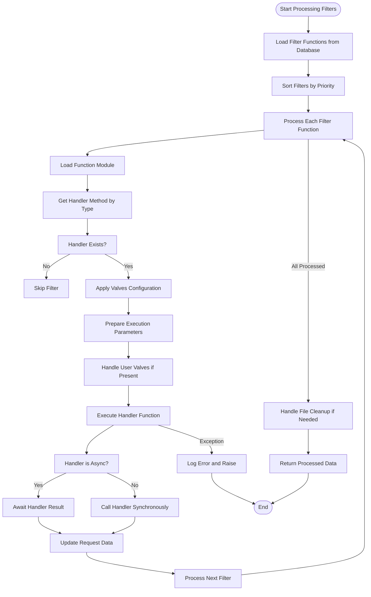
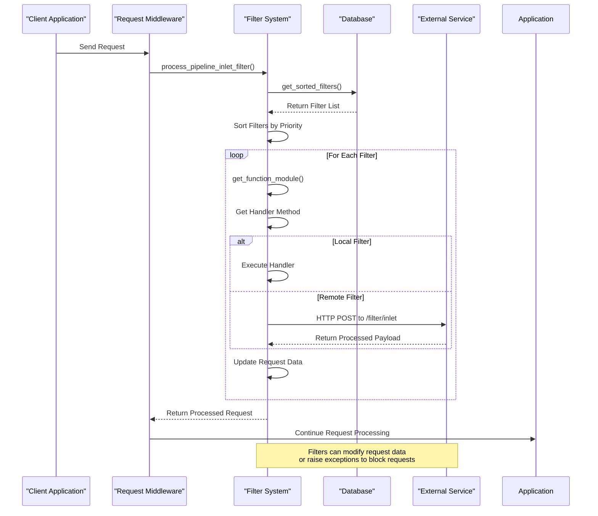

# Filter Functions

<cite>
**Referenced Files in This Document**   
- [filter.py](file://backend/open_webui/utils/filter.py)
- [functions.py](file://backend/open_webui/functions.py)
- [models.py](file://backend/open_webui/models/functions.py)
- [routers/functions.py](file://backend/open_webui/routers/functions.py)
- [middleware.py](file://backend/open_webui/utils/middleware.py)
- [rate_limit.py](file://backend/open_webui/utils/rate_limit.py)
</cite>

## Table of Contents
1. [Introduction](#introduction)
2. [Filter Function Interface](#filter-function-interface)
3. [Implementation and Decision-Making Patterns](#implementation-and-decision-making-patterns)
4. [Integration with Request Preprocessing](#integration-with-request-preprocessing)
5. [Common Use Cases](#common-use-cases)
6. [Troubleshooting Guide](#troubleshooting-guide)
7. [Performance Considerations](#performance-considerations)

## Introduction
Filter functions in the Functions Framework serve as validation and gating mechanisms within the AI pipeline, determining whether a request should proceed based on custom logic. These functions are implemented as specialized components that can intercept requests at various stages of processing, evaluate them against defined criteria, and either allow them to continue or halt execution with custom error messages. The framework supports multiple filter types including inlet, outlet, and stream filters, each designed to operate at different points in the request-response cycle. Filter functions can be used for content moderation, access control, input validation, rate limiting, and other security or business logic requirements.

## Filter Function Interface

The filter function interface is implemented through the `process_filter_functions` function in the filter.py module. This function processes a collection of filter functions in a specified order, applying each filter to the request data. The interface supports different filter types (inlet, outlet, stream) which are executed at different stages of the request processing pipeline. Each filter function is loaded dynamically from the database and executed with appropriate parameters. The interface handles parameter preparation, valve application, and error handling during filter execution. Filters can modify the request data or raise exceptions to block requests. The system also supports file handling capabilities through the `file_handler` attribute, allowing filters to control file processing behavior.

**Section sources**
- [filter.py](file://backend/open_webui/utils/filter.py#L60-L136)

## Implementation and Decision-Making Patterns

Filter functions are implemented using a priority-based execution model where filters are sorted by their priority value before execution. The system retrieves both global filter functions and model-specific filters, combining them into a single execution sequence. Each filter function is loaded from the database cache and its handler method is invoked with the appropriate parameters. The implementation supports both synchronous and asynchronous filter functions, with proper execution handling for each type. Filters can access user-specific configuration through the `UserValves` mechanism, allowing for personalized filtering rules. The decision-making process involves evaluating the request against the filter's logic, with the ability to modify the request data or raise exceptions to block the request. Filters can also control file processing through the `file_handler` attribute, which when set to True, will remove files from the request data.

**Diagram sources **
- [filter.py](file://backend/open_webui/utils/filter.py#L60-L136)

**Section sources**
- [filter.py](file://backend/open_webui/utils/filter.py#L25-L57)
- [filter.py](file://backend/open_webui/utils/filter.py#L60-L136)

## Integration with Request Preprocessing

Filter functions are integrated into the request preprocessing stage through the middleware system, which invokes filters at specific points in the request lifecycle. The integration occurs through the `process_pipeline_inlet_filter` and `process_pipeline_outlet_filter` functions in the pipelines module, which handle inlet and outlet filters respectively. These functions communicate with external services via HTTP requests, sending the request payload to filter endpoints and receiving processed results. The system supports both local and remote filter execution, with local filters being executed directly within the application and remote filters being invoked via API calls. The integration also handles error conditions, propagating detailed error messages back to the client when filters block requests. The preprocessing stage allows filters to modify request data, add metadata, or completely halt request processing based on their evaluation.

**Diagram sources **
- [pipelines.py](file://backend/open_webui/routers/pipelines.py#L60-L109)
- [middleware.py](file://backend/open_webui/utils/middleware.py#L96-L99)

**Section sources**
- [pipelines.py](file://backend/open_webui/routers/pipelines.py#L60-L109)
- [middleware.py](file://backend/open_webui/utils/middleware.py#L96-L99)

## Common Use Cases

Filter functions support several common use cases including content moderation, access control, input validation, and rate limiting. For content moderation, filters can analyze request content for inappropriate language or topics and block requests that violate policy. Access control filters can verify user permissions and roles, restricting access to certain models or features based on user attributes. Input validation filters can check request parameters for correctness and completeness, ensuring that required fields are present and properly formatted. Rate limiting is implemented through the RateLimiter class, which tracks request counts per user or IP address and blocks requests that exceed configured limits. The system also supports custom error messages, allowing filters to provide specific feedback when requests are blocked. Filters can be configured globally or on a per-user basis through the valves system, enabling flexible policy enforcement.

```mermaid
graph TD
UseCases[Common Use Cases] --> ContentModeration
UseCases --> AccessControl
UseCases --> InputValidation
UseCases --> RateLimiting
UseCases --> SecurityFiltering
ContentModeration --> CM1["Block inappropriate content"]
ContentModeration --> CM2["Detect hate speech"]
ContentModeration --> CM3["Filter sensitive topics"]
AccessControl --> AC1["Verify user roles"]
AccessControl --> AC2["Check model permissions"]
AccessControl --> AC3["Enforce group policies"]
InputValidation --> IV1["Validate parameter types"]
InputValidation --> IV2["Check required fields"]
InputValidation --> IV3["Sanitize input data"]
RateLimiting --> RL1["Track requests per user"]
RateLimiting --> RL2["Enforce time windows"]
RateLimiting --> RL3["Provide retry information"]
SecurityFiltering --> SF1["Detect injection attacks"]
SecurityFiltering --> SF2["Block malicious patterns"]
SecurityFiltering --> SF3["Validate data integrity"]
style UseCases fill:#f9f,stroke:#333,stroke-width:2px
```

**Diagram sources **
- [filter.py](file://backend/open_webui/utils/filter.py#L60-L136)
- [rate_limit.py](file://backend/open_webui/utils/rate_limit.py#L6-L140)

**Section sources**
- [filter.py](file://backend/open_webui/utils/filter.py#L60-L136)
- [rate_limit.py](file://backend/open_webui/utils/rate_limit.py#L6-L140)

## Troubleshooting Guide

When troubleshooting filter logic issues, start by verifying that the filter function is properly registered in the database and marked as active. Check the filter's priority setting to ensure it executes in the expected order relative to other filters. Verify that the filter type (inlet, outlet, stream) matches the intended use case and that the corresponding handler method exists in the function module. For filters that are not executing as expected, confirm that the request model includes the filter in its configuration or that the filter is configured as global. When filters are raising unexpected errors, examine the function's exception handling and ensure that any required valves or user valves are properly configured. For performance issues, review the filter's execution time and consider whether database queries or external API calls can be optimized. Use the logging system to trace filter execution and identify where failures occur.

**Section sources**
- [filter.py](file://backend/open_webui/utils/filter.py#L125-L127)
- [functions.py](file://backend/open_webui/functions.py#L223-L225)
- [routers/functions.py](file://backend/open_webui/routers/functions.py#L258-L278)

## Performance Considerations

When implementing complex filtering rules, consider the performance implications of synchronous versus asynchronous execution. Synchronous filters block the request thread during execution, while asynchronous filters allow for non-blocking operation. For filters that perform database queries or external API calls, use asynchronous methods to prevent request queuing. Cache frequently accessed data to reduce database load, and consider implementing rate limiting to prevent abuse. When multiple filters are applied, ensure they are ordered by priority with the most selective filters first to minimize unnecessary processing. For high-traffic scenarios, consider offloading filter execution to external services to reduce load on the main application server. Monitor filter execution times and optimize any filters that consistently exceed acceptable latency thresholds. The system's built-in caching mechanism for function modules helps reduce the overhead of repeatedly loading the same filter code.

**Section sources**
- [filter.py](file://backend/open_webui/utils/filter.py#L72-L73)
- [plugin.py](file://backend/open_webui/utils/plugin.py#L211-L264)
- [rate_limit.py](file://backend/open_webui/utils/rate_limit.py#L54-L60)