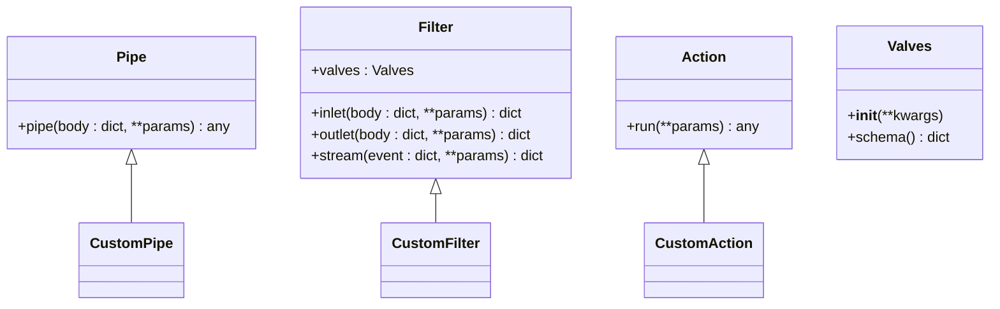
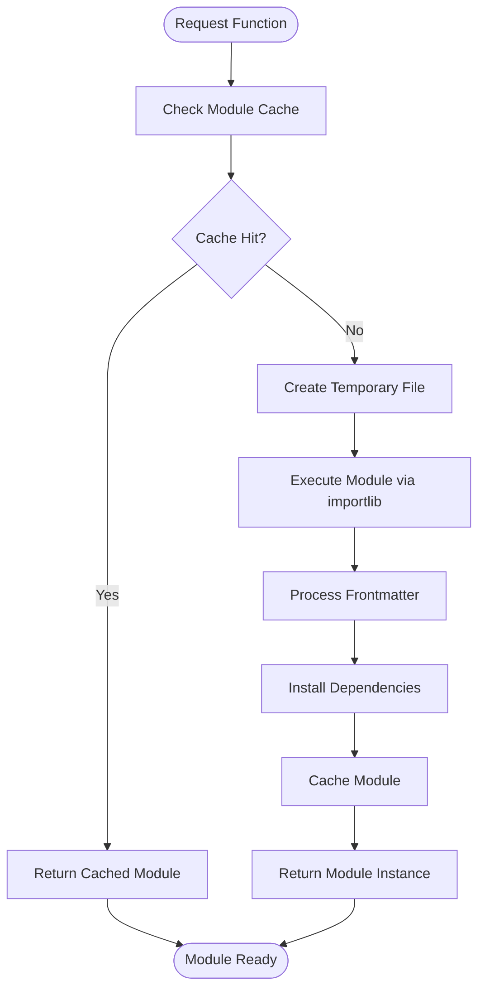
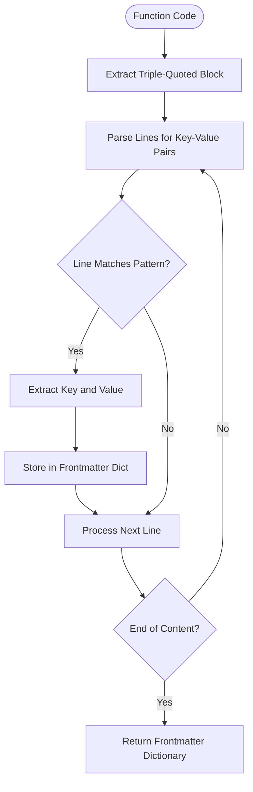
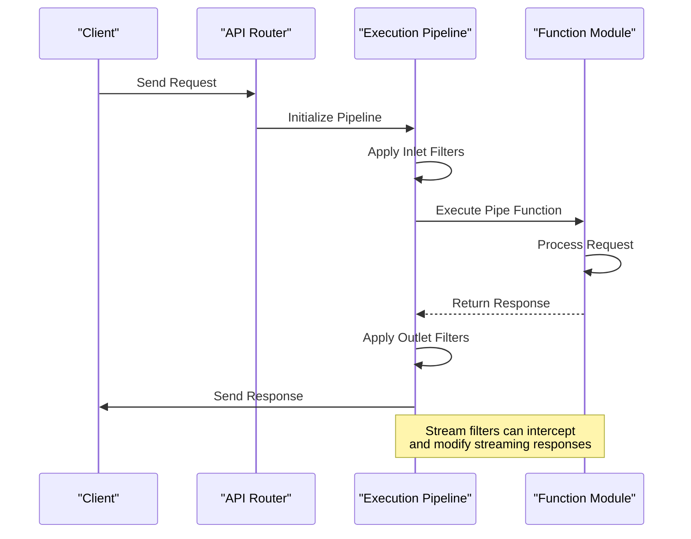
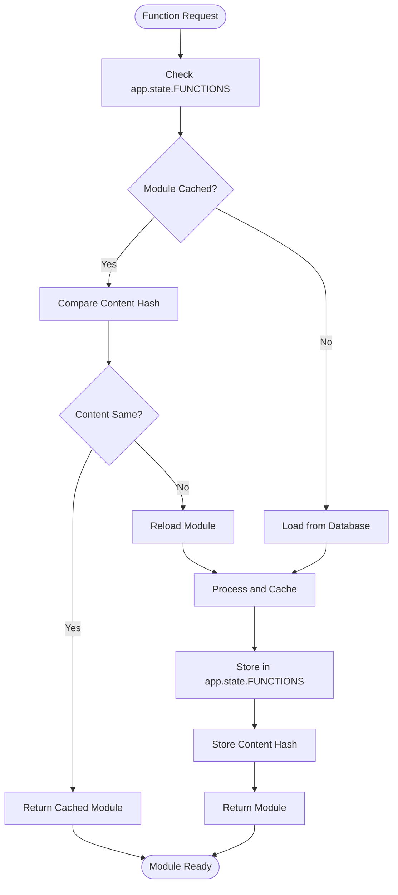

# Functions Framework

<cite>
**Referenced Files in This Document**   
- [functions.py](file://backend/open_webui/functions.py)
- [routers/functions.py](file://backend/open_webui/routers/functions.py)
- [models/functions.py](file://backend/open_webui/models/functions.py)
- [utils/plugin.py](file://backend/open_webui/utils/plugin.py)
</cite>

## Table of Contents
1. [Introduction](#introduction)
2. [Function Types: Pipe, Filter, and Action](#function-types-pipe-filter-and-action)
3. [Function Loading Mechanism](#function-loading-mechanism)
4. [Frontmatter Parsing System](#frontmatter-parsing-system)
5. [Function Execution Pipeline](#function-execution-pipeline)
6. [Caching System](#caching-system)
7. [Security Considerations](#security-considerations)
8. [Common Issues and Solutions](#common-issues-and-solutions)
9. [Optimization Strategies](#optimization-strategies)
10. [Conclusion](#conclusion)

## Introduction
The Functions Framework in Open WebUI provides a flexible system for extending the platform's capabilities through custom functions. This framework supports three primary function types—Pipe, Filter, and Action—each serving distinct roles in the execution pipeline. The system leverages dynamic module loading via importlib and temporary files, enabling runtime execution of user-defined code. Metadata extraction from docstrings (frontmatter) allows for configuration of dependencies and valves (configuration parameters). This document details the implementation, usage, and optimization of this framework.

**Section sources**
- [functions.py](file://backend/open_webui/functions.py#L1-L354)
- [routers/functions.py](file://backend/open_webui/routers/functions.py#L1-L546)

## Function Types: Pipe, Filter, and Action
The Functions Framework categorizes functions into three types, each with a specific role in the processing pipeline:

### Pipe Functions
Pipe functions serve as the primary interface for model-like interactions. They are designed to handle chat completions and can be invoked directly through the API as if they were language models. A Pipe function must implement a `pipe` method that processes input and generates output. These functions can transform prompts, generate responses, or act as intermediaries to external services.

### Filter Functions
Filter functions operate at various stages of the request-response cycle, including inlet (pre-processing), outlet (post-processing), and stream (real-time processing). They can validate inputs, modify requests, or transform responses. Filter functions are particularly useful for implementing security checks, content moderation, or data transformation logic. The framework supports both global and user-specific filters.

### Action Functions
Action functions perform side effects such as database operations, external API calls, or file system modifications. Unlike Pipe and Filter functions, Actions are typically invoked explicitly rather than being part of the automatic processing pipeline. They are ideal for implementing custom business logic that needs to be triggered by specific events or user actions.

**Diagram sources**
- [functions.py](file://backend/open_webui/functions.py#L60-L78)
- [routers/functions.py](file://backend/open_webui/routers/functions.py#L398-L411)

**Section sources**
- [functions.py](file://backend/open_webui/functions.py#L81-L156)
- [routers/functions.py](file://backend/open_webui/routers/functions.py#L468-L505)

## Function Loading Mechanism
The framework employs a sophisticated loading mechanism that uses importlib and temporary files to dynamically execute user-defined functions. When a function is requested, the system creates a temporary Python file containing the function code and loads it as a module using importlib.util. This approach allows for dynamic execution of code without requiring package installation.

The loading process begins with the `load_function_module_by_id` function in the plugin utilities, which retrieves the function code from the database and creates a temporary file. The module is then executed in a controlled namespace, allowing access to the framework's utilities while maintaining isolation. The system automatically handles import path replacements, converting relative imports to the appropriate package structure.

**Diagram sources**
- [utils/plugin.py](file://backend/open_webui/utils/plugin.py#L118-L167)
- [functions.py](file://backend/open_webui/functions.py#L60-L78)

**Section sources**
- [utils/plugin.py](file://backend/open_webui/utils/plugin.py#L118-L167)
- [routers/functions.py](file://backend/open_webui/routers/functions.py#L198-L216)

## Frontmatter Parsing System
The framework uses a frontmatter parsing system to extract metadata from function docstrings. This metadata, enclosed in triple quotes at the beginning of the function file, contains configuration information such as required dependencies and valve definitions. The `extract_frontmatter` function processes the content line by line, identifying key-value pairs in the format `key: value`.

The frontmatter supports several important fields:
- **requirements**: A comma-separated list of Python packages that the function depends on
- **description**: A brief description of the function's purpose
- **icon_url**: URL to an icon representing the function
- **name**: The display name of the function

When a function is loaded, the system automatically installs any required packages specified in the requirements field using pip. This ensures that all dependencies are available before the function is executed.

**Diagram sources**
- [utils/plugin.py](file://backend/open_webui/utils/plugin.py#L18-L51)
- [routers/functions.py](file://backend/open_webui/routers/functions.py#L129-L133)

**Section sources**
- [utils/plugin.py](file://backend/open_webui/utils/plugin.py#L18-L51)
- [models/functions.py](file://backend/open_webui/models/functions.py#L37-L40)

## Function Execution Pipeline
The function execution pipeline orchestrates the invocation of different function types in a specific order. For chat completions, Pipe functions are executed as the primary processing unit, while Filter functions are applied at various stages of the request-response cycle.

The pipeline begins with inlet filters that process incoming requests, followed by the main Pipe function execution, and concludes with outlet filters that process the response. Stream filters can intercept and modify streaming responses in real-time. Each function receives a standardized set of parameters including the request body, user information, and event emitters for real-time communication.

The execution context includes several special parameters:
- **__user__**: User information and permissions
- **__event_emitter__**: Function for sending real-time events to the client
- **__metadata__**: Additional context information
- **__files__**: Uploaded files associated with the request
- **__oauth_token__**: OAuth token for external service authentication

**Diagram sources**
- [functions.py](file://backend/open_webui/functions.py#L159-L354)
- [utils/filter.py](file://backend/open_webui/utils/filter.py#L60-L117)

**Section sources**
- [functions.py](file://backend/open_webui/functions.py#L159-L354)
- [utils/filter.py](file://backend/open_webui/utils/filter.py#L60-L117)

## Caching System
The framework implements a comprehensive caching system to optimize function loading and execution. The `get_function_module_from_cache` function serves as the primary caching mechanism, storing loaded modules in the application state to avoid repeated parsing and compilation.

The cache stores both the module object and its content hash, allowing the system to detect changes and reload modules when necessary. This is particularly important for development scenarios where function code may be updated frequently. The caching system also maintains a separate cache for function content, enabling quick comparison without re-reading the database.

Cache invalidation occurs automatically when:
- Function content is updated in the database
- Dependencies are installed or modified
- Application restarts
- Explicit cache clearing operations

The caching strategy significantly improves performance by eliminating the overhead of file creation, module loading, and dependency resolution for frequently used functions.

**Diagram sources**
- [utils/plugin.py](file://backend/open_webui/utils/plugin.py#L211-L264)
- [functions.py](file://backend/open_webui/functions.py#L60-L78)

**Section sources**
- [utils/plugin.py](file://backend/open_webui/utils/plugin.py#L211-L264)
- [routers/functions.py](file://backend/open_webui/routers/functions.py#L404-L411)

## Security Considerations
Executing untrusted code presents significant security challenges that the framework addresses through multiple layers of protection. The system requires administrative privileges for function creation and modification, limiting access to trusted users.

Key security measures include:
- **Code isolation**: Functions execute in isolated modules with controlled imports
- **Dependency management**: External packages are installed through controlled pip operations
- **Input validation**: Function parameters are validated against defined schemas
- **Resource limits**: Execution time and memory usage are monitored
- **Sandboxing**: Functions have limited access to the file system and network

The framework also implements valve-based configuration, allowing administrators to define safe parameter ranges and validation rules. User-specific valves enable personalized configurations without exposing sensitive settings.

Despite these measures, administrators should exercise caution when deploying functions from untrusted sources, as sophisticated attacks could potentially bypass these protections. Regular security audits and code reviews are recommended for production deployments.

**Section sources**
- [routers/functions.py](file://backend/open_webui/routers/functions.py#L89-L134)
- [utils/plugin.py](file://backend/open_webui/utils/plugin.py#L267-L284)

## Common Issues and Solutions
Several common issues may arise when working with the Functions Framework, along with their respective solutions:

### Dependency Installation Failures
When dependencies specified in the frontmatter fail to install, verify that:
- The package names are correct and available on PyPI
- The system has internet access
- The pip configuration allows installation from the specified indexes
- There are no version conflicts with existing packages

Solution: Check the application logs for detailed error messages and adjust the requirements accordingly.

### Function Loading Errors
If a function fails to load, check for:
- Syntax errors in the Python code
- Import errors due to missing packages
- Incorrect function class implementation
- Invalid frontmatter formatting

Solution: Use the function validation endpoints to test the code before deployment and review the error logs for specific details.

### Performance Issues
For functions experiencing slow execution:
- Optimize the code for efficiency
- Minimize external API calls
- Use caching for repeated operations
- Consider asynchronous implementations for I/O-bound tasks

Solution: Profile the function execution and identify bottlenecks using standard Python profiling tools.

**Section sources**
- [utils/plugin.py](file://backend/open_webui/utils/plugin.py#L267-L284)
- [routers/functions.py](file://backend/open_webui/routers/functions.py#L224-L228)

## Optimization Strategies
To maximize function performance, consider the following optimization strategies:

### Caching and Reuse
Leverage the built-in caching system by ensuring functions are stateless and idempotent. This allows the cache to effectively store and reuse module instances without side effects.

### Asynchronous Implementation
For I/O-bound operations, implement functions using async/await patterns to prevent blocking the event loop. This is particularly important for functions that make external API calls or database queries.

### Efficient Dependency Management
Minimize the number of dependencies and prefer lightweight packages. Consider bundling multiple related functions into a single module to reduce overhead.

### Stream Processing
For large responses, implement streaming capabilities to begin transmitting data to the client immediately rather than waiting for complete processing.

### Resource Monitoring
Implement monitoring to track function execution time, memory usage, and error rates. This helps identify performance bottlenecks and optimize resource allocation.

**Section sources**
- [functions.py](file://backend/open_webui/functions.py#L162-L166)
- [utils/plugin.py](file://backend/open_webui/utils/plugin.py#L211-L264)

## Conclusion
The Functions Framework provides a powerful and flexible system for extending Open WebUI's capabilities through custom code. By understanding the distinct roles of Pipe, Filter, and Action functions, leveraging the dynamic loading mechanism, and utilizing the frontmatter configuration system, developers can create sophisticated extensions that integrate seamlessly with the platform. The caching system ensures optimal performance, while security measures help protect against common vulnerabilities. With proper implementation and optimization, this framework enables a wide range of use cases from simple prompt transformations to complex workflow automation.