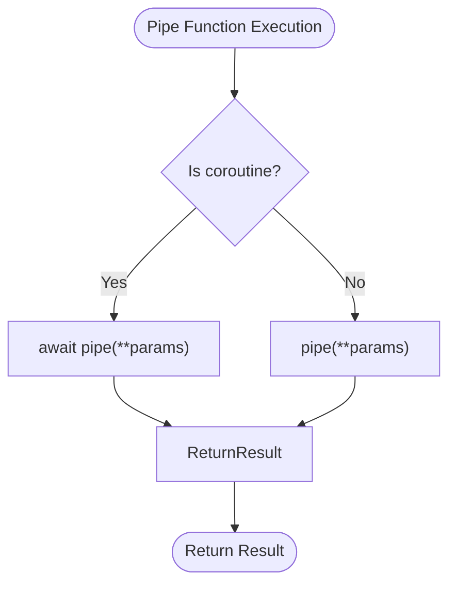
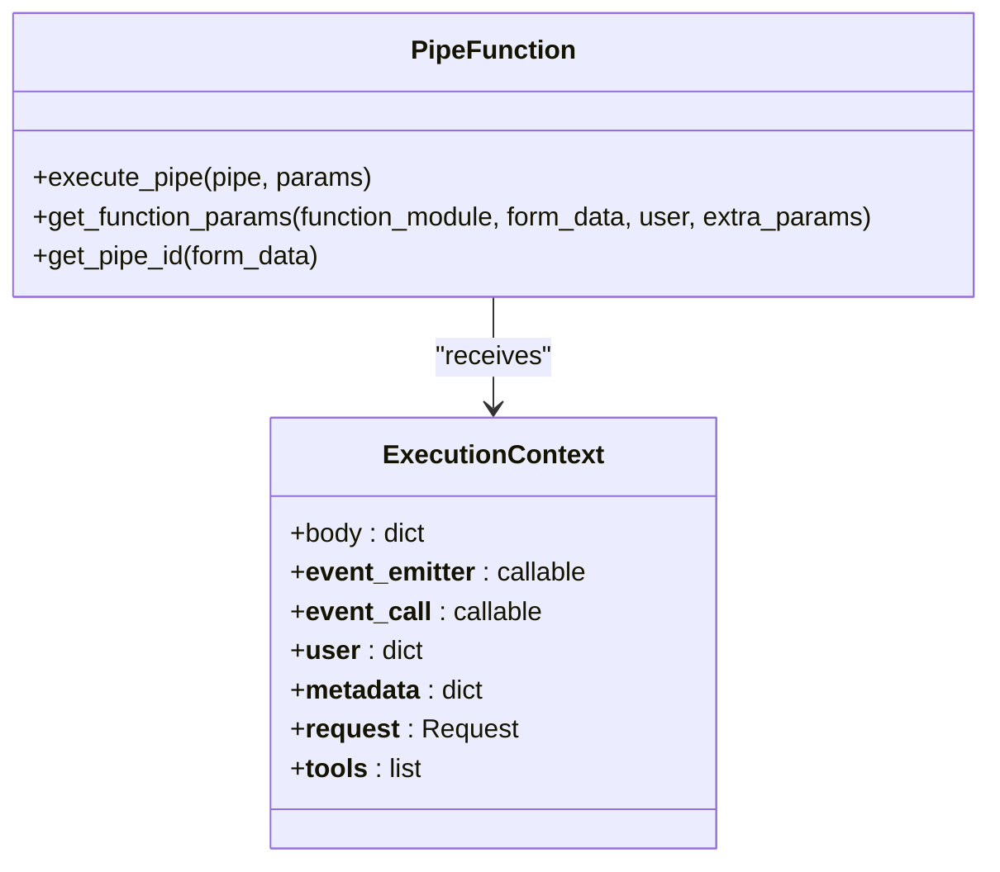
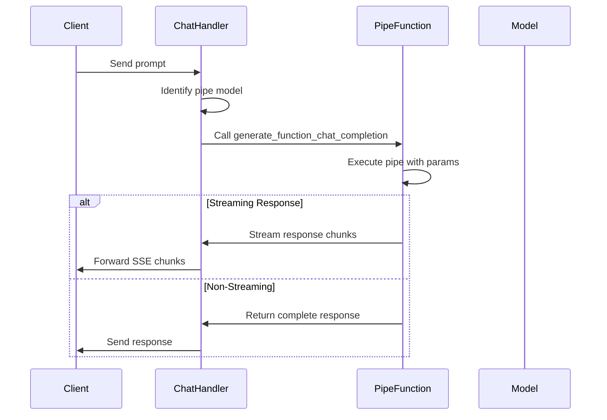
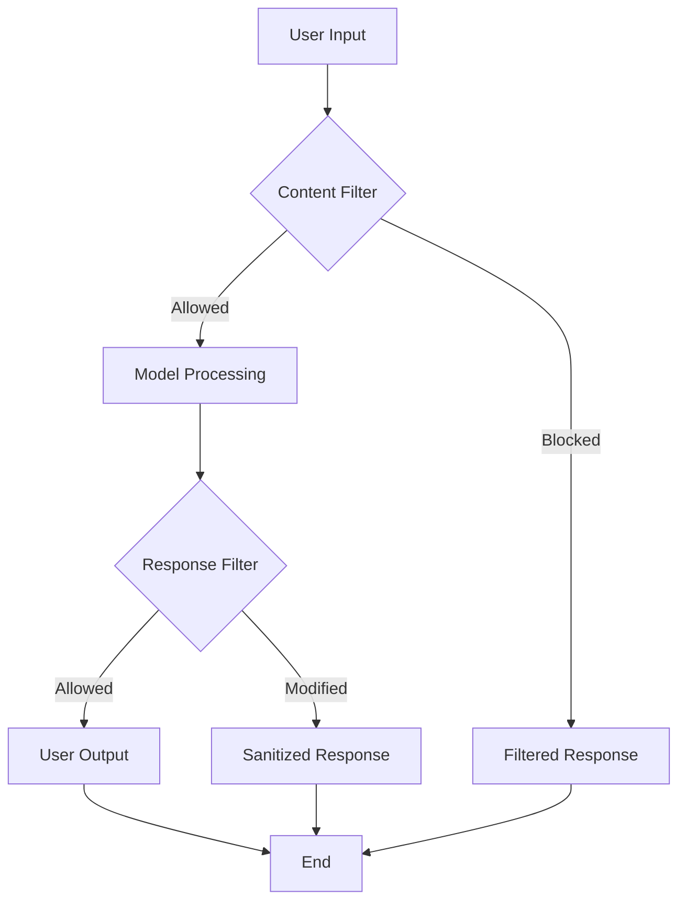
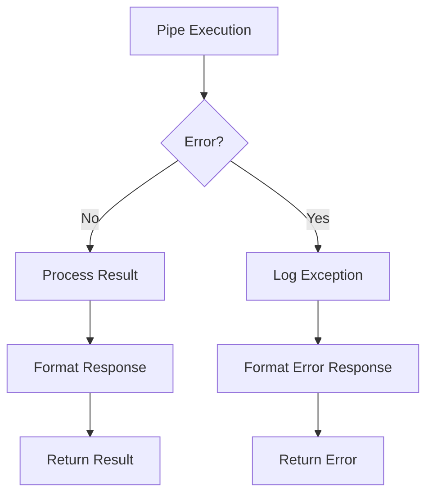
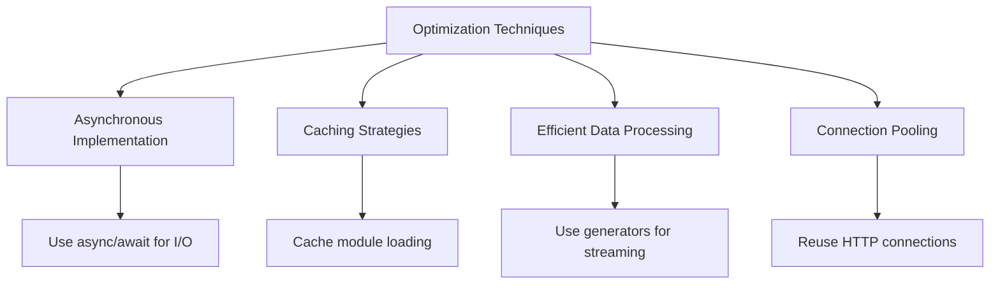

# Pipe Functions

<cite>
**Referenced Files in This Document**   
- [functions.py](file://backend/open_webui/functions.py)
- [plugin.py](file://backend/open_webui/utils/plugin.py)
- [chat.py](file://backend/open_webui/utils/chat.py)
- [models.py](file://backend/open_webui/models/functions.py)
</cite>

## Table of Contents
1. [Introduction](#introduction)
2. [Pipe Function Interface](#pipe-function-interface)
3. [Execution Context and Parameters](#execution-context-and-parameters)
4. [Integration with Chat Processing Pipeline](#integration-with-chat-processing-pipeline)
5. [Common Use Cases](#common-use-cases)
6. [Troubleshooting and Debugging](#troubleshooting-and-debugging)
7. [Performance Optimization](#performance-optimization)

## Introduction

Pipe Functions in the Functions Framework serve as middleware components in the AI pipeline, enabling sequential transformation of prompts and responses through a chain of processing functions. These functions are designed to intercept and modify the data flow between user input and model inference, as well as between model output and response delivery. The pipe function system provides a flexible architecture for implementing various preprocessing and postprocessing operations, allowing for customization of the AI interaction without modifying the core model infrastructure.

The implementation follows a modular design where each pipe function is registered as a distinct entity in the system, with its own configuration and execution context. This architecture enables administrators and developers to create, manage, and chain together multiple pipe functions to create sophisticated processing workflows that can adapt to different use cases and requirements.

**Section sources**
- [functions.py](file://backend/open_webui/functions.py#L81-L156)
- [plugin.py](file://backend/open_webui/utils/plugin.py#L149-L157)

## Pipe Function Interface

The pipe function interface is defined through a standardized structure that ensures consistent implementation across different functions. Each pipe function is implemented as a Python module that must contain a `Pipe` class, which serves as the entry point for the function execution. The system identifies pipe functions by checking for the presence of this class using the `hasattr(module, "Pipe")` condition during module loading.

The interface supports both synchronous and asynchronous execution patterns, allowing developers to implement functions that can perform blocking operations or leverage async/await patterns for non-blocking I/O operations. The execution is handled by the `execute_pipe` function in the framework, which determines the appropriate invocation method based on whether the pipe function is a coroutine:

**Diagram sources**
- [functions.py](file://backend/open_webui/functions.py#L162-L166)

The system also supports manifold pipes, which are pipe functions that can dynamically generate sub-pipes at runtime. This is achieved through the optional `pipes` attribute, which can be a list of pipe definitions, a synchronous function, or an asynchronous function that returns pipe configurations. This feature enables hierarchical organization of pipe functions and dynamic pipeline construction based on runtime conditions.

**Section sources**
- [functions.py](file://backend/open_webui/functions.py#L94-L108)
- [plugin.py](file://backend/open_webui/utils/plugin.py#L149-L157)

## Execution Context and Parameters

Pipe functions receive a rich execution context that provides access to various system components and data necessary for processing. The context is passed as keyword parameters to the pipe function, with the primary data payload available in the `body` parameter. This payload typically contains the complete request data, including the model identifier, message history, and other relevant information.

The parameter injection system uses Python's introspection capabilities to match available context parameters with the function signature, ensuring that only parameters explicitly declared in the function signature are passed. This approach provides type safety and prevents unexpected parameter injection. The `get_function_params` function handles this parameter mapping by examining the function signature using `inspect.signature()` and filtering the available parameters accordingly.

Key execution context parameters include:
- `__event_emitter__`: For emitting real-time events during processing
- `__event_call__`: For making synchronous calls to other system components
- `__user__`: User information and permissions
- `__metadata__`: Additional metadata about the request context
- `__request__`: The original HTTP request object
- `__tools__`: Available tools that can be invoked during processing

**Diagram sources**
- [functions.py](file://backend/open_webui/functions.py#L200-L220)
- [functions.py](file://backend/open_webui/functions.py#L255-L268)

The system also supports specialized parameter types such as valves, which provide configurable settings for pipe functions. Global valves are configured at the function level, while user-specific valves allow for personalized settings per user. This dual valve system enables both administrator-controlled configurations and user-customizable behavior within the same framework.

**Section sources**
- [functions.py](file://backend/open_webui/functions.py#L60-L78)
- [models.py](file://backend/open_webui/models/functions.py#L102-L104)

## Integration with Chat Processing Pipeline

Pipe functions are tightly integrated with the chat processing pipeline through the `generate_function_chat_completion` function, which serves as the entry point for pipe-based model processing. When a request is made to a model that has a pipe configuration, the system routes the request through this function instead of the standard model inference path.

The integration follows a sequential execution model where the pipe function processes the input and produces output that conforms to the expected response format. For streaming responses, the system handles various output types including strings, generators, and async generators, converting them to the appropriate Server-Sent Events (SSE) format. The `process_line` function is responsible for this conversion, ensuring that all output is properly formatted as data chunks.

**Diagram sources**
- [functions.py](file://backend/open_webui/functions.py#L159-L353)
- [chat.py](file://backend/open_webui/utils/chat.py#L270-L273)

The pipeline integration also handles special response types such as `StreamingResponse` objects, which are passed through directly to maintain the streaming connection. This allows pipe functions to implement their own streaming logic when needed, providing maximum flexibility for complex processing scenarios.

The system uses model identification to determine whether a request should be processed by a pipe function. When a model ID contains a dot notation (e.g., "pipe_id.sub_pipe"), the system extracts the base pipe ID and routes the request accordingly. This naming convention enables hierarchical organization of pipe functions and supports the manifold pipe pattern.

**Section sources**
- [functions.py](file://backend/open_webui/functions.py#L194-L198)
- [chat.py](file://backend/open_webui/utils/chat.py#L269-L273)

## Common Use Cases

Pipe functions support a variety of common use cases that enhance the AI interaction experience. These use cases leverage the middleware nature of pipe functions to transform prompts and responses in meaningful ways.

### Prompt Templating
Pipe functions can implement prompt templating by modifying the user's input before it reaches the model. This is achieved by accessing the message history in the `body` parameter and restructuring it according to predefined templates. The function can add system messages, modify conversation history, or inject contextual information to guide the model's response.

### Language Translation
Language translation is implemented by intercepting the user's prompt, translating it to the model's preferred language, and then translating the model's response back to the user's language. This bidirectional translation ensures that users can interact with the system in their preferred language while leveraging models that may be optimized for different languages.

### Content Filtering
Content filtering pipe functions analyze both prompts and responses for inappropriate content, applying various filtering strategies such as keyword matching, pattern recognition, or machine learning-based classification. These functions can modify or block content based on configurable policies, with global and user-specific valve settings controlling the strictness of filtering.

**Diagram sources**
- [functions.py](file://backend/open_webui/functions.py#L168-L175)
- [functions.py](file://backend/open_webui/functions.py#L318-L337)

Other common use cases include:
- **Prompt enrichment**: Adding contextual information to prompts based on user history or external data sources
- **Response formatting**: Transforming model output into specific formats such as JSON, HTML, or structured data
- **Rate limiting**: Implementing usage controls based on user roles or subscription levels
- **Analytics collection**: Gathering usage data for monitoring and reporting purposes

**Section sources**
- [functions.py](file://backend/open_webui/functions.py#L176-L193)
- [functions.py](file://backend/open_webui/functions.py#L300-L337)

## Troubleshooting and Debugging

Debugging pipe function execution requires understanding the flow of data through the pipeline and identifying potential failure points. The system provides several mechanisms for troubleshooting and monitoring pipe function behavior.

### Debug Logging
The framework includes comprehensive logging capabilities that can be enabled by setting appropriate log levels. The `log.debug()` statements in the `get_function_models` function provide insights into pipe discovery and manifold processing, helping developers understand how pipe functions are being loaded and organized.

### Error Handling
The system implements robust error handling with try-catch blocks around critical operations such as pipe execution and parameter processing. When an error occurs, the system logs the exception and returns an appropriate error response in the expected format. For streaming responses, errors are formatted as SSE error events to maintain the connection protocol.

**Diagram sources**
- [functions.py](file://backend/open_webui/functions.py#L313-L316)
- [functions.py](file://backend/open_webui/functions.py#L343-L345)

### Common Issues and Solutions
- **Function not loading**: Verify that the module contains a `Pipe` class and that the function is activated in the system
- **Parameter injection failures**: Check that parameter names in the function signature match available context parameters
- **Streaming issues**: Ensure that streaming responses are properly formatted as SSE chunks
- **Performance bottlenecks**: Monitor execution time and consider async implementations for I/O-bound operations

**Section sources**
- [functions.py](file://backend/open_webui/functions.py#L313-L316)
- [functions.py](file://backend/open_webui/functions.py#L343-L345)

## Performance Optimization

Optimizing pipe function performance is critical for maintaining low latency in the AI pipeline. The following techniques can be applied to minimize processing overhead:

### Asynchronous Implementation
For pipe functions that perform I/O operations such as API calls or database queries, implementing the function as an async coroutine can significantly improve performance by allowing concurrent execution. The framework natively supports async functions through the `asyncio.iscoroutinefunction()` check and `await` syntax.

### Caching Strategies
The system implements module caching through the `get_function_module_from_cache` function, which stores loaded function modules in memory to avoid repeated parsing and compilation. Developers can extend this caching to application-level data by leveraging the provided context parameters.

### Efficient Data Processing
When processing streaming responses, using generators and async generators instead of building complete responses in memory can reduce memory usage and improve response time. The `get_message_content` function demonstrates this approach by handling different response types efficiently.

**Diagram sources**
- [functions.py](file://backend/open_webui/functions.py#L162-L166)
- [functions.py](file://backend/open_webui/functions.py#L168-L175)

### Connection Management
For pipe functions that make external API calls, implementing connection pooling and reusing HTTP sessions can reduce connection overhead. The framework's use of `aiohttp.ClientSession` with `trust_env=True` enables efficient connection management for outbound requests.

**Section sources**
- [functions.py](file://backend/open_webui/functions.py#L162-L175)
- [plugin.py](file://backend/open_webui/utils/plugin.py#L211-L264)