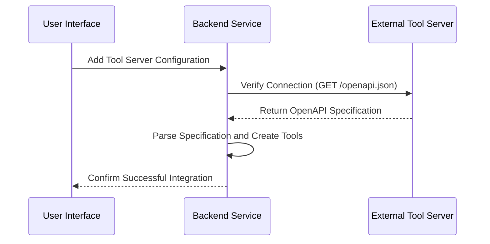
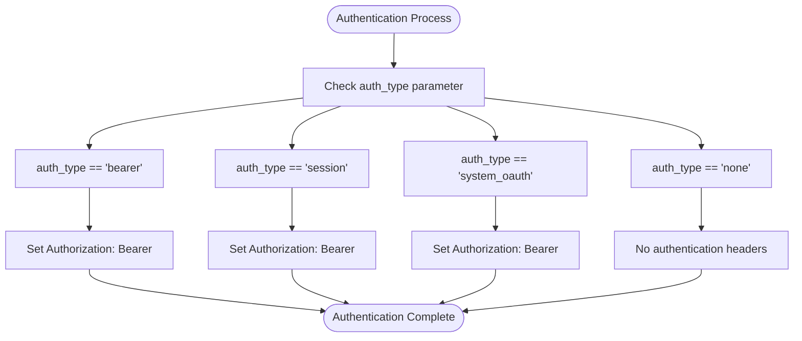
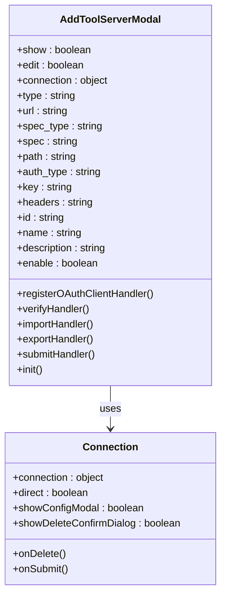
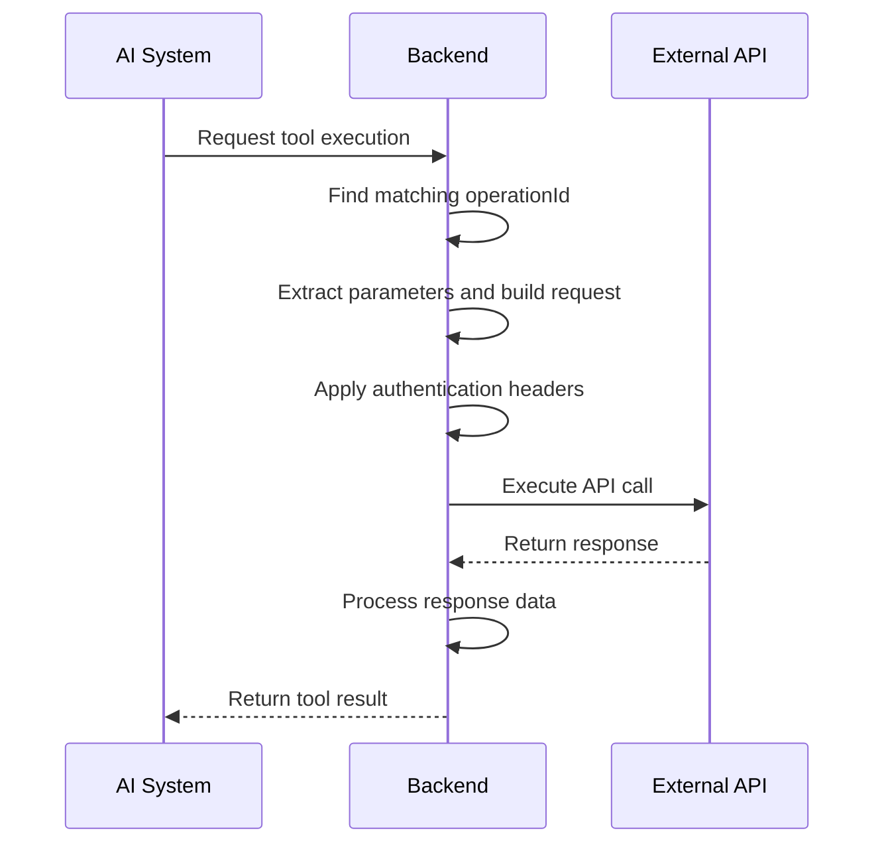
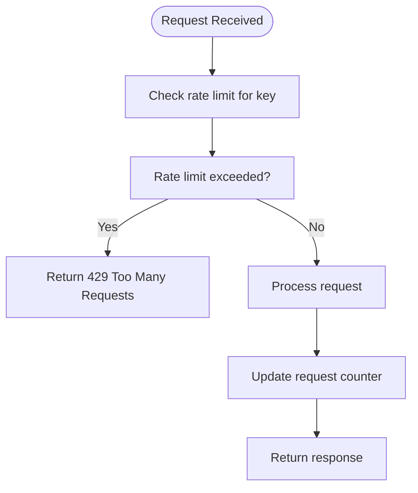

# External Tool Servers

<cite>
**Referenced Files in This Document**   
- [ToolServerConnection](file://backend/open_webui/routers/configs.py#L142-L149)
- [ToolServersConfigForm](file://backend/open_webui/routers/configs.py#L154-L155)
- [get_tool_servers_data](file://backend/open_webui/utils/tools.py#L639-L733)
- [execute_tool_server](file://backend/open_webui/utils/tools.py#L736-L847)
- [get_tool_server_data](file://backend/open_webui/utils/tools.py#L590-L636)
- [AddToolServerModal.svelte](file://src/lib/components/AddToolServerModal.svelte)
- [Connection.svelte](file://src/lib/components/chat/Settings/Tools/Connection.svelte)
- [Tools.svelte](file://src/lib/components/chat/Settings/Tools.svelte)
- [config.py](file://backend/open_webui/config.py)
- [tools.py](file://backend/open_webui/models/tools.py)
</cite>

## Table of Contents
1. [Introduction](#introduction)
2. [External Tool Server Integration](#external-tool-server-integration)
3. [Authentication Methods](#authentication-methods)
4. [Adding External Tool Servers](#adding-external-tool-servers)
5. [API Call Execution and Response Handling](#api-call-execution-and-response-handling)
6. [Security Considerations](#security-considerations)
7. [Troubleshooting Common Issues](#troubleshooting-common-issues)
8. [Optimization Strategies](#optimization-strategies)
9. [Conclusion](#conclusion)

## Introduction
This document provides comprehensive guidance on integrating external tool servers within the Open WebUI platform. It details the process of connecting to external OpenAPI endpoints, configuring authentication methods, and managing tool server connections through the user interface. The system enables AI tools to leverage external APIs by securely exposing their functionality while maintaining proper credential management and error handling.

**Section sources**
- [config.py](file://backend/open_webui/config.py#L1-L800)

## External Tool Server Integration
The Open WebUI platform supports integration with external tool servers through OpenAPI specifications. The system discovers and exposes external API endpoints as AI tools that can be utilized within the application. This integration is managed through configuration objects that define the connection parameters, authentication methods, and endpoint discovery mechanisms.

The core integration process involves:
- Connecting to external OpenAPI endpoints
- Discovering available API operations through OpenAPI specifications
- Converting API operations into AI tool functions
- Managing tool server lifecycle and availability



**Diagram sources**
- [get_tool_server_data](file://backend/open_webui/utils/tools.py#L590-L636)
- [AddToolServerModal.svelte](file://src/lib/components/AddToolServerModal.svelte#L1-L884)

## Authentication Methods
The system supports multiple authentication methods for external tool server connections, allowing flexibility in integrating with various API security models.

### Supported Authentication Types
The following authentication methods are supported:

| Authentication Type | Description | Configuration Parameters |
|-------------------|-------------|-------------------------|
| Bearer Token | API key authentication using Bearer token | `auth_type: "bearer"`, `key: <API_KEY>` |
| Session Cookies | Uses the system user's session credentials | `auth_type: "session"` |
| System OAuth | Forwards the system user's OAuth access token | `auth_type: "system_oauth"` |
| OAuth 2.1 | Dynamic client registration for MCP servers | `auth_type: "oauth_2.1"` |
| None | No authentication required | `auth_type: "none"` |

### Authentication Implementation
The authentication mechanism is implemented in the backend to securely handle credentials:



**Section sources**
- [ToolServerConnection](file://backend/open_webui/routers/configs.py#L142-L149)
- [get_tool_servers_data](file://backend/open_webui/utils/tools.py#L640-L658)

## Adding External Tool Servers
The process of adding external tool servers involves configuring connection parameters through the user interface and verifying the connection to ensure proper integration.

### Configuration Process
To add an external tool server:

1. Access the tool server management interface
2. Provide the base URL of the external API
3. Configure the OpenAPI specification location (URL or inline JSON)
4. Select the appropriate authentication method
5. Enter required credentials or tokens
6. Set tool server metadata (ID, name, description)
7. Verify and save the connection

### UI Components
The frontend provides dedicated components for managing tool server connections:



**Section sources**
- [AddToolServerModal.svelte](file://src/lib/components/AddToolServerModal.svelte#L1-L884)
- [Connection.svelte](file://src/lib/components/chat/Settings/Tools/Connection.svelte#L1-L54)

## API Call Execution and Response Handling
The system handles external API calls through a structured process that includes request construction, execution, and response processing.

### Request Execution Flow
When an AI tool invokes an external API, the following process occurs:



### Error Handling
The system implements comprehensive error handling for external API calls:

```python
# Pseudocode representation of error handling
try:
    response = execute_external_api_call()
    if response.status >= 400:
        raise Exception(f"HTTP error {response.status}")
    return response.data
except Exception as e:
    return {"error": str(e)}
```

The error handling process includes:
- HTTP status code validation (4xx and 5xx errors)
- Network connectivity issues
- Authentication failures
- Invalid response formats
- Timeout handling

**Section sources**
- [execute_tool_server](file://backend/open_webui/utils/tools.py#L736-L847)
- [get_tool_server_data](file://backend/open_webui/utils/tools.py#L590-L636)

## Security Considerations
The integration with external tool servers incorporates several security measures to protect credentials and ensure secure API communication.

### Credential Management
- API keys and tokens are stored securely in the configuration system
- Sensitive credentials are not exposed in client-side code
- Authentication tokens are transmitted over encrypted connections
- Session-based authentication uses secure cookie handling

### Rate Limiting
The system implements rate limiting to prevent abuse of external API endpoints:



### Secure Communication
- All external API calls use HTTPS by default
- SSL verification is enabled for external connections
- Sensitive headers are properly sanitized
- Input validation is performed on all API parameters

**Section sources**
- [config.py](file://backend/open_webui/config.py#L1-L800)
- [rate_limit.py](file://backend/open_webui/utils/rate_limit.py#L1-L89)

## Troubleshooting Common Issues
This section addresses common connection issues and provides guidance for resolving them.

### Connection Problems
| Issue | Possible Cause | Solution |
|------|---------------|----------|
| Connection timeout | Network connectivity issues | Verify network access to the external server |
| Authentication failed | Invalid credentials | Check API key or token validity |
| Invalid OpenAPI spec | Malformed specification | Validate the OpenAPI JSON/YAML format |
| Endpoint not found | Incorrect path configuration | Verify the API path and base URL |
| SSL errors | Certificate validation issues | Check SSL configuration and certificates |

### Verification Process
The system provides a connection verification feature to test tool server connectivity:

1. Enter the tool server configuration
2. Click the "Verify Connection" button
3. The system will attempt to retrieve the OpenAPI specification
4. Success or failure status is displayed with details

This verification helps identify configuration issues before saving the connection.

**Section sources**
- [AddToolServerModal.svelte](file://src/lib/components/AddToolServerModal.svelte#L1-L884)
- [verify_tool_servers_config](file://backend/open_webui/routers/configs.py#L218-L245)

## Optimization Strategies
To improve performance and reliability of external tool server calls, several optimization strategies can be implemented.

### Caching Mechanisms
- Cache OpenAPI specifications to reduce discovery time
- Implement response caching for frequently accessed endpoints
- Use Redis for distributed caching across instances

### Connection Pooling
- Reuse HTTP connections to external servers
- Implement connection timeouts to prevent resource exhaustion
- Use asynchronous I/O for non-blocking API calls

### Error Resilience
- Implement retry logic with exponential backoff
- Provide fallback mechanisms for critical operations
- Monitor API availability and performance metrics

### Performance Monitoring
- Track API call latency and success rates
- Monitor rate limit usage
- Log performance metrics for analysis
- Set up alerts for degraded performance

**Section sources**
- [get_tool_servers_data](file://backend/open_webui/utils/tools.py#L639-L733)
- [config.py](file://backend/open_webui/config.py#L1-L800)

## Conclusion
The external tool server integration in Open WebUI provides a robust framework for connecting to external OpenAPI endpoints and exposing their functionality as AI tools. The system supports multiple authentication methods, including bearer tokens, session cookies, and OAuth, allowing flexible integration with various API security models. The configuration process is user-friendly, with a comprehensive UI for managing tool server connections. Security considerations are addressed through proper credential management, rate limiting, and secure communication practices. The system includes error handling and troubleshooting features to ensure reliable operation, along with optimization strategies to improve performance and reliability of external API calls.