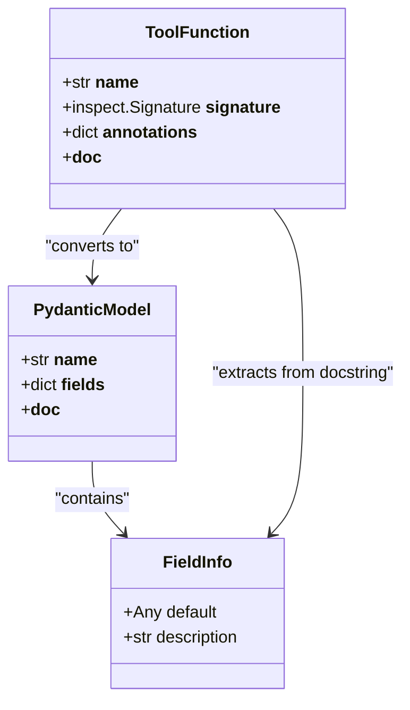
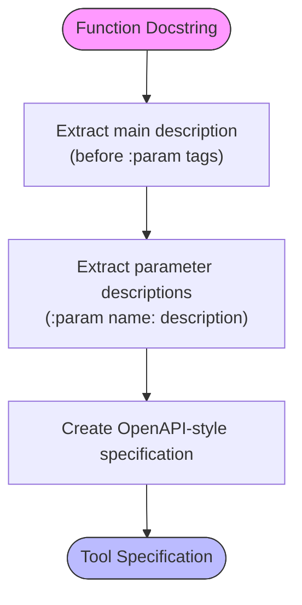
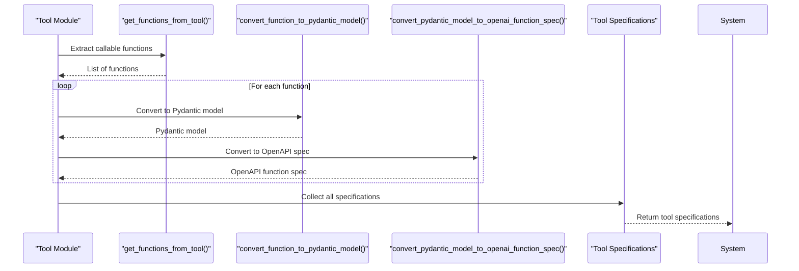
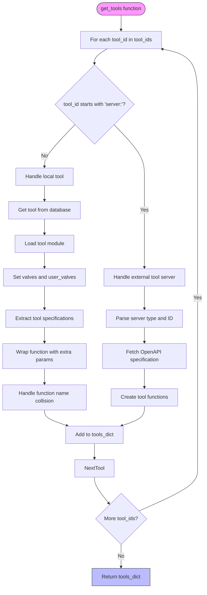
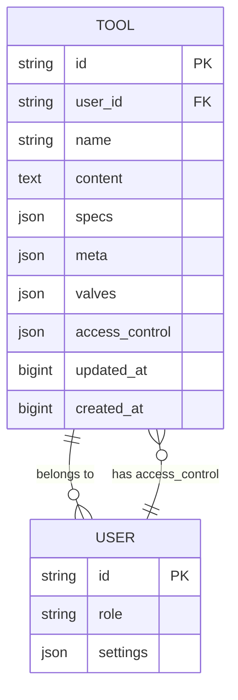

# Local Tools

<cite>
**Referenced Files in This Document**   
- [tools.py](file://backend/open_webui/utils/tools.py)
- [tools.py](file://backend/open_webui/models/tools.py)
- [tools.py](file://backend/open_webui/routers/tools.py)
- [plugin.py](file://backend/open_webui/utils/plugin.py)
</cite>

## Table of Contents
1. [Introduction](#introduction)
2. [Tool Definition and Structure](#tool-definition-and-structure)
3. [Parameter Validation with Pydantic Models](#parameter-validation-with-pydantic-models)
4. [OpenAPI-Style Descriptions and Docstring Parsing](#openapi-style-descriptions-and-docstring-parsing)
5. [Tool Specification System](#tool-specification-system)
6. [Dynamic Tool Loading with get_tools Function](#dynamic-tool-loading-with-get_tools-function)
7. [Valves for User-Specific Configurations](#valves-for-user-specific-configurations)
8. [Tool Metadata Structure](#tool-metadata-structure)
9. [Function Name Collision Handling](#function-name-collision-handling)
10. [Security Considerations for Local Code Execution](#security-considerations-for-local-code-execution)
11. [Performance Optimization Strategies](#performance-optimization-strategies)
12. [Example: Creating a Custom Tool](#example-creating-a-custom-tool)

## Introduction
The Local Tools implementation in Open WebUI provides a comprehensive framework for defining, managing, and executing tools within the application. This system enables developers to create Python functions with Pydantic models for parameter validation and OpenAPI-style descriptions, while supporting dynamic loading and user-specific configurations through valves. The architecture is designed to handle both local tools and external tool servers, providing a flexible and secure environment for tool execution. This documentation details the core components of the tool system, including the specification parsing mechanism, dynamic loading capabilities, and configuration management through valves.

**Section sources**
- [tools.py](file://backend/open_webui/utils/tools.py#L1-L861)

## Tool Definition and Structure
Local tools in Open WebUI are defined as Python modules containing a Tools class that encapsulates one or more callable functions. Each tool is identified by a unique ID and stored in the database with its content, specifications, and metadata. The tool structure follows a specific pattern where the module must contain a Tools class, which is instantiated when the tool is loaded. Tools are dynamically loaded from the database and cached in the application state for performance optimization. The system supports both local tools and external tool servers, with different handling mechanisms for each type. When a tool is created or updated, its content is processed to extract frontmatter (containing metadata like requirements) and replace import paths to ensure proper module loading within the application context.

**Section sources**
- [tools.py](file://backend/open_webui/utils/plugin.py#L87-L115)
- [tools.py](file://backend/open_webui/models/tools.py#L24-L54)
- [tools.py](file://backend/open_webui/routers/tools.py#L306-L317)

## Parameter Validation with Pydantic Models
The tool system leverages Pydantic models for robust parameter validation of tool functions. When a tool function is processed, its type hints and default values are extracted and used to create a Pydantic model dynamically. This model serves as a validation schema for the function's parameters, ensuring that inputs conform to the expected types and constraints. The `convert_function_to_pydantic_model` function in the tools utility module handles this conversion process, examining the function's signature, type hints, and docstring to generate an appropriate Pydantic model. This approach provides automatic validation of function parameters, with detailed error messages for invalid inputs. The generated models also preserve default values from the original function parameters, maintaining the intended behavior while adding type safety and validation.

**Diagram sources**
- [tools.py](file://backend/open_webui/utils/tools.py#L380-L419)

## OpenAPI-Style Descriptions and Docstring Parsing
The tool system parses docstrings to generate OpenAPI-style descriptions for tool parameters and functions. This parsing follows the reStructuredText (reST) format, specifically looking for `:param name: description` patterns in the docstring. The `parse_docstring` function extracts these parameter descriptions and returns them as a dictionary mapping parameter names to their descriptions. Additionally, the `parse_description` function extracts the main function description that appears before any parameter declarations in the docstring. This two-part parsing system allows for rich documentation of tool functions, where the main description provides context about the function's purpose, and individual parameter descriptions explain the role and expectations for each parameter. These descriptions are then incorporated into the tool's specification, making them available in the UI and for API documentation.

**Diagram sources**
- [tools.py](file://backend/open_webui/utils/tools.py#L325-L377)
- [tools.py](file://backend/open_webui/utils/tools.py#L351-L377)

## Tool Specification System
The tool specification system generates standardized specifications for tools based on their Python function definitions. This process begins with the `get_tool_specs` function, which extracts all callable functions from a tool module (excluding special methods and classes) using `get_functions_from_tool`. Each function is then converted to a Pydantic model using `convert_function_to_pydantic_model`, which captures type hints, default values, and descriptions from the docstring. These Pydantic models are subsequently converted to OpenAPI function specifications using `convert_pydantic_model_to_openai_function_spec` from the langchain_core library. The resulting specifications include the function name, description, and a parameters object that describes the expected input schema. This standardized format enables consistent tool representation across the application and facilitates integration with AI models that can call functions based on these specifications.

**Diagram sources**
- [tools.py](file://backend/open_webui/utils/tools.py#L438-L448)
- [tools.py](file://backend/open_webui/utils/tools.py#L380-L419)

## Dynamic Tool Loading with get_tools Function
The `get_tools` function is responsible for dynamically loading tools based on a list of tool IDs, user context, and additional parameters. This function processes each tool ID, handling both local tools and external tool servers. For local tools, it retrieves the tool from the database, loads the module if not already cached, and applies user-specific configurations through valves. The function uses `get_async_tool_function_and_apply_extra_params` to wrap tool functions, making them asynchronous and injecting additional parameters like the tool ID and user information. For external tool servers (identified by the "server:" prefix), it fetches the OpenAPI specification and creates tool functions that make HTTP requests to the server endpoints. The function also handles function name collisions by prepending the tool ID or server ID to conflicting function names, ensuring unique identifiers in the returned tools dictionary.

**Diagram sources**
- [tools.py](file://backend/open_webui/utils/tools.py#L109-L322)

## Valves for User-Specific Configurations
Valves provide a mechanism for configuring tool behavior on a per-user basis. Each tool can define a Valves Pydantic model that specifies configurable parameters, and optionally a UserValves model for user-specific configurations. When tools are loaded via the `get_tools` function, the system retrieves the appropriate valve configurations from the database and applies them to the tool module. Admin-defined valves are stored in the tool's database record, while user-specific valves are stored in the user's settings. This dual configuration system allows administrators to set default behaviors while enabling users to customize tools according to their preferences. The valve system supports various data types including strings, numbers, booleans, and enums, with validation provided by Pydantic. The UI presents these configuration options in a form based on the valve schema, allowing users to modify settings without requiring code changes.

**Section sources**
- [tools.py](file://backend/open_webui/models/tools.py#L204-L247)
- [tools.py](file://backend/open_webui/routers/tools.py#L566-L647)

## Tool Metadata Structure
The tool metadata structure consists of several components stored in the database and used to manage tool behavior and presentation. Each tool has an ID, user ID, name, content (the Python code), specifications (the OpenAPI-style function definitions), and meta information. The meta field contains additional information such as a description and manifest (extracted frontmatter). Tools also have valves for configuration and access_control settings that determine who can use or modify the tool. The access_control field supports various permission levels, from public access to private access restricted to the owner, with custom permissions allowing specific group or user-level restrictions. This metadata structure enables rich tool management, including discovery, access control, and configuration, while maintaining a clean separation between the tool's code and its operational parameters.

**Diagram sources**
- [tools.py](file://backend/open_webui/models/tools.py#L24-L54)

## Function Name Collision Handling
The system includes robust handling for function name collisions that may occur when multiple tools define functions with the same name. When the `get_tools` function encounters a name collision while building the tools dictionary, it logs a warning and modifies the function name by prepending the tool ID (for local tools) or server ID (for external tool servers). This approach ensures that each tool function has a unique identifier in the final tools dictionary, preventing overwrites and enabling all functions to be accessible. The collision handling occurs during the tool loading process, specifically in the loops that add tool functions to the tools_dict. For local tools, the code checks if the function_name already exists in tools_dict, and if so, prepends the tool_id to create a unique name. Similarly, for external tool servers, it prepends the server_id to resolve conflicts. This mechanism allows multiple tools to coexist even when they define functions with identical names.

**Section sources**
- [tools.py](file://backend/open_webui/utils/tools.py#L313-L320)
- [tools.py](file://backend/open_webui/utils/tools.py#L234-L241)

## Security Considerations for Local Code Execution
The local tools system implements several security measures to mitigate risks associated with executing user-provided code. Tool modules are loaded in isolated contexts using Python's `types.ModuleType`, preventing direct access to the main application namespace. The system uses temporary files for module loading, which are securely created and immediately deleted after use. Import paths within tool code are rewritten to prevent access to arbitrary modules, with replacements like "from utils" becoming "from open_webui.utils". Additionally, the frontmatter system allows specifying required packages, which are installed using pip with configured options, providing some control over dependencies. The access_control system restricts tool usage based on user roles and permissions, ensuring that only authorized users can access specific tools. Despite these measures, executing arbitrary code always carries inherent risks, and administrators should carefully review tool code before enabling it in production environments.

**Section sources**
- [tools.py](file://backend/open_webui/utils/plugin.py#L87-L115)
- [tools.py](file://backend/open_webui/utils/plugin.py#L54-L68)
- [tools.py](file://backend/open_webui/models/tools.py#L35-L50)

## Performance Optimization Strategies
The tool system employs several performance optimization strategies to ensure efficient operation. Tools are cached in the application state (request.app.state.TOOLS) after first loading, eliminating the need to reprocess the code for subsequent requests. The system uses asynchronous operations for external tool server communication, allowing concurrent execution of multiple tool calls. Database queries are optimized by retrieving all necessary information in single queries where possible, such as when fetching multiple tools or user information. The tool loading process includes a cache check that compares the current content with the cached version, avoiding unnecessary processing when the tool hasn't changed. For external tool servers, specifications are cached in Redis when available, reducing the need to fetch OpenAPI specifications repeatedly. The system also uses connection pooling and timeouts for HTTP requests to external services, preventing resource exhaustion and ensuring timely responses.

**Section sources**
- [tools.py](file://backend/open_webui/utils/plugin.py#L183-L190)
- [tools.py](file://backend/open_webui/utils/tools.py#L575-L585)
- [tools.py](file://backend/open_webui/utils/tools.py#L696-L697)

## Example: Creating a Custom Tool
Creating a custom tool in Open WebUI follows a specific pattern that ensures compatibility with the tool system. A tool module must contain a Tools class with callable methods that represent the tool functions. The module can include frontmatter (enclosed in triple quotes at the beginning) with metadata like a description and required packages. Each tool function should have a comprehensive docstring following the reST format, with a main description followed by `:param` tags for each parameter. The tool can define Valves and UserValves Pydantic models to enable configuration through the UI. When creating a new tool via the API, the tool ID must be a valid Python identifier and not already in use. After creation, the tool is stored in the database with its specifications automatically generated from the function definitions, making it immediately available for use in conversations.

**Section sources**
- [tools.py](file://backend/open_webui/routers/tools.py#L271-L327)
- [tools.py](file://backend/open_webui/utils/plugin.py#L87-L115)
- [tools.py](file://backend/open_webui/utils/tools.py#L380-L419)