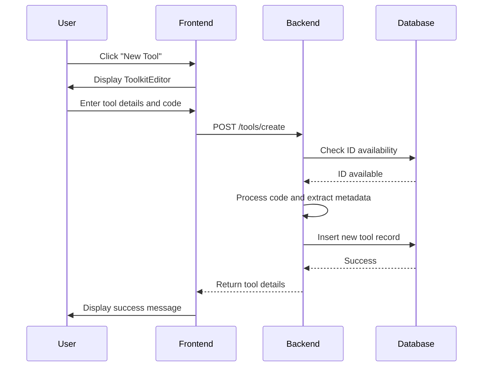
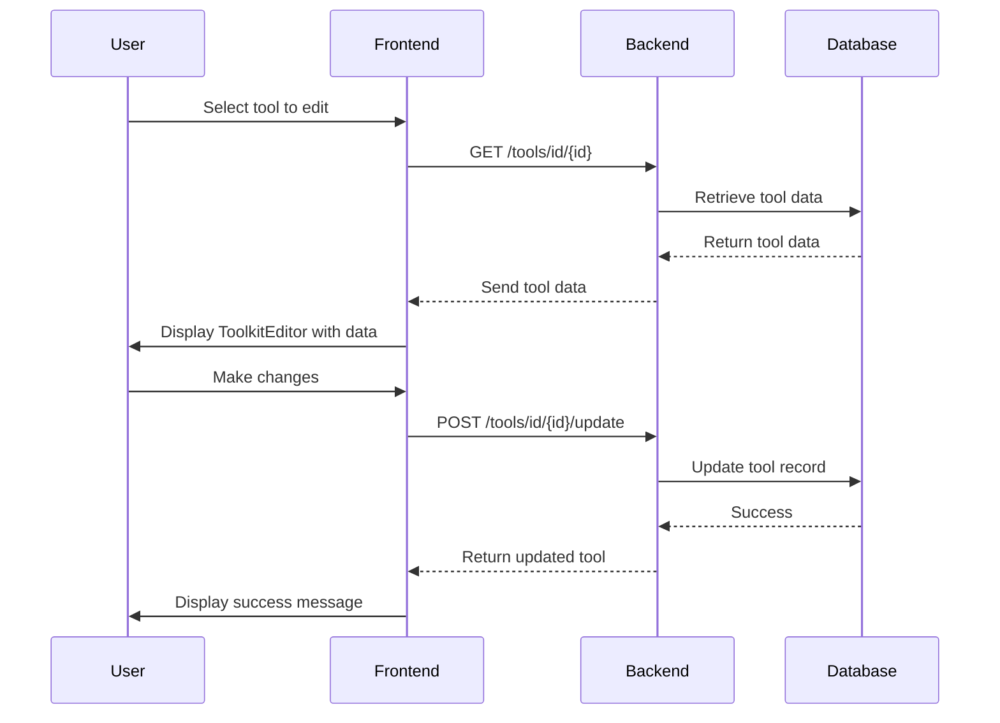
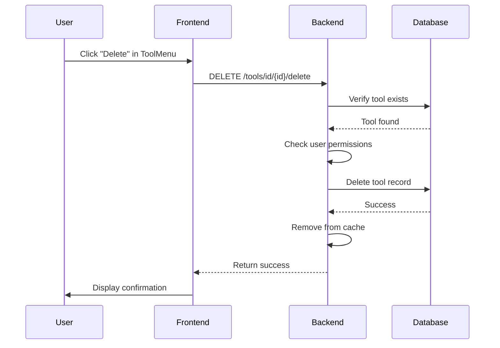
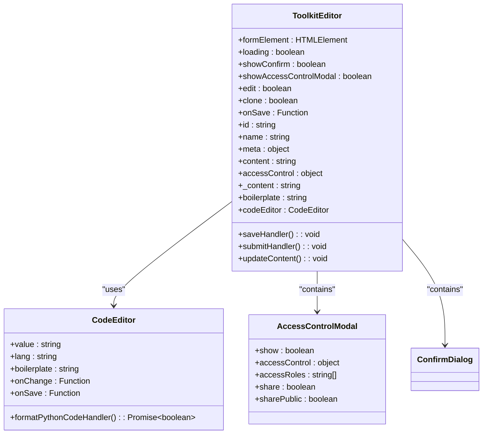
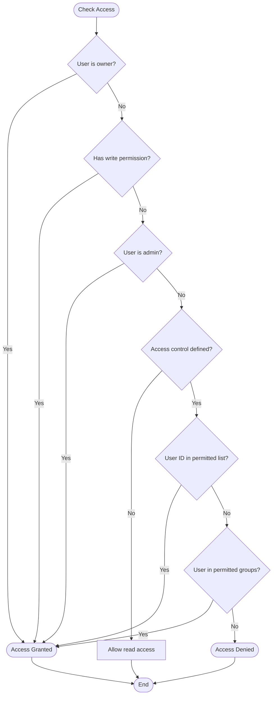
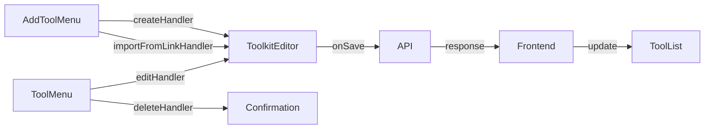

# Tool Management

<cite>
**Referenced Files in This Document**   
- [ToolkitEditor.svelte](file://src/lib/components/workspace/Tools/ToolkitEditor.svelte)
- [tools.py](file://backend/open_webui/routers/tools.py)
- [tools/index.ts](file://src/lib/apis/tools/index.ts)
- [ToolMenu.svelte](file://src/lib/components/workspace/Tools/ToolMenu.svelte)
- [AddToolMenu.svelte](file://src/lib/components/workspace/Tools/AddToolMenu.svelte)
- [access_control.py](file://backend/open_webui/utils/access_control.py)
- [models/tools.py](file://backend/open_webui/models/tools.py)
</cite>

## Table of Contents
1. [Introduction](#introduction)
2. [Tool Lifecycle Management](#tool-lifecycle-management)
3. [ToolkitEditor Component](#toolkiteditor-component)
4. [Access Control System](#access-control-system)
5. [API Integration and Data Flow](#api-integration-and-data-flow)
6. [Common Issues and Troubleshooting](#common-issues-and-troubleshooting)
7. [Best Practices for Tool Organization](#best-practices-for-tool-organization)
8. [Conclusion](#conclusion)

## Introduction
The tool management interface in Open WebUI provides a comprehensive system for creating, editing, organizing, and managing tools through a web-based interface. This documentation details the complete tool lifecycle management process, including creation with the ToolkitEditor component, configuration updates, deletion procedures, and the access control system that governs tool visibility and usage permissions. The system supports both local tools and external tool servers, providing a flexible framework for extending functionality.

**Section sources**
- [ToolkitEditor.svelte](file://src/lib/components/workspace/Tools/ToolkitEditor.svelte)
- [tools.py](file://backend/open_webui/routers/tools.py)

## Tool Lifecycle Management

### Tool Creation
The tool creation process begins with the AddToolMenu component, which provides options to create a new tool or import from a URL. When creating a new tool, users are presented with the ToolkitEditor interface where they can define the tool's name, ID, description, and Python code implementation. The tool ID must be a valid Python identifier containing only alphanumeric characters and underscores, and is automatically converted to lowercase.

The creation process involves several validation steps:
1. The tool ID is checked for uniqueness in the database
2. The Python code is validated for syntax and proper structure
3. Required imports are automatically replaced with appropriate paths
4. Frontmatter is extracted from the code comments to populate metadata

When importing a tool from a URL, the system supports GitHub repository links, automatically converting them to raw content URLs. The imported content is then processed to extract the tool definition and metadata.



**Diagram sources**
- [AddToolMenu.svelte](file://src/lib/components/workspace/Tools/AddToolMenu.svelte)
- [ToolkitEditor.svelte](file://src/lib/components/workspace/Tools/ToolkitEditor.svelte)
- [tools.py](file://backend/open_webui/routers/tools.py)

**Section sources**
- [AddToolMenu.svelte](file://src/lib/components/workspace/Tools/AddToolMenu.svelte)
- [ToolkitEditor.svelte](file://src/lib/components/workspace/Tools/ToolkitEditor.svelte)
- [tools.py](file://backend/open_webui/routers/tools.py)

### Tool Editing and Updating
Existing tools can be edited through the ToolkitEditor interface, which is pre-populated with the current tool configuration. The editing process maintains the original tool ID but allows modification of the name, description, and code implementation. When updating a tool, the system performs the same validation and processing steps as during creation.

The update process includes:
1. Verification that the user has write access to the tool
2. Code validation and import replacement
3. Metadata extraction from frontmatter
4. Database update with new content and timestamp



**Diagram sources**
- [ToolkitEditor.svelte](file://src/lib/components/workspace/Tools/ToolkitEditor.svelte)
- [tools.py](file://backend/open_webui/routers/tools.py)

**Section sources**
- [ToolkitEditor.svelte](file://src/lib/components/workspace/Tools/ToolkitEditor.svelte)
- [tools.py](file://backend/open_webui/routers/tools.py)

### Tool Deletion
Tools can be deleted through the ToolMenu component, which provides a delete option for authorized users. The deletion process requires verification of user permissions before proceeding. Only the tool owner, users with write access, or administrators can delete a tool.

The deletion process:
1. Validates user permissions
2. Removes the tool from the database
3. Clears the tool from the application state cache
4. Returns a success status



**Diagram sources**
- [ToolMenu.svelte](file://src/lib/components/workspace/Tools/ToolMenu.svelte)
- [tools.py](file://backend/open_webui/routers/tools.py)

**Section sources**
- [ToolMenu.svelte](file://src/lib/components/workspace/Tools/ToolMenu.svelte)
- [tools.py](file://backend/open_webui/routers/tools.py)

## ToolkitEditor Component

The ToolkitEditor component provides the primary interface for creating and editing tools. It features a code editor with Python syntax highlighting and a form for tool metadata. The editor includes a boilerplate template with example functions to help users get started.

Key features of the ToolkitEditor:
- **Code Editor**: Syntax-highlighted Python editor with formatting capabilities
- **Metadata Fields**: Input fields for tool name, ID, and description
- **Access Control**: Button to configure access permissions for the tool
- **Validation**: Real-time validation of required fields
- **Formatting**: Automatic Python code formatting before saving

The component handles several important functions:
1. Automatic ID generation from the tool name when creating new tools
2. Code formatting using the integrated code editor
3. Access control configuration through a modal dialog
4. Form validation before submission
5. Warning messages about the security implications of arbitrary code execution



**Diagram sources**
- [ToolkitEditor.svelte](file://src/lib/components/workspace/Tools/ToolkitEditor.svelte)

**Section sources**
- [ToolkitEditor.svelte](file://src/lib/components/workspace/Tools/ToolkitEditor.svelte)

## Access Control System

The access control system governs tool visibility and usage permissions through a flexible permission model. Each tool has an access_control field that defines who can read and write to the tool.

### Access Control Structure
The access_control field can have three states:
- **None (null)**: Public access, available to all users with the "user" role
- **Empty object ({})**: Private access, restricted exclusively to the owner
- **Custom permissions**: Specific access control rules for reading and writing

Custom permissions are defined as:
```json
{
  "read": {
    "group_ids": ["group_id1", "group_id2"],
    "user_ids": ["user_id1", "user_id2"]
  },
  "write": {
    "group_ids": ["group_id1", "group_id2"],
    "user_ids": ["user_id1", "user_id2"]
  }
}
```

### Permission Evaluation
The system evaluates permissions using the has_access function, which checks:
1. If the user is the tool owner
2. If the user has the required permission level (read or write)
3. If the user belongs to a group with the required permissions
4. If the user has admin privileges (which bypass access control when configured)



**Diagram sources**
- [access_control.py](file://backend/open_webui/utils/access_control.py)
- [models/tools.py](file://backend/open_webui/models/tools.py)

**Section sources**
- [access_control.py](file://backend/open_webui/utils/access_control.py)
- [models/tools.py](file://backend/open_webui/models/tools.py)

## API Integration and Data Flow

### Frontend API Calls
The frontend communicates with the backend through a series of API endpoints defined in the tools/index.ts file. These endpoints handle all tool operations:

```mermaid
sequenceDiagram
participant Frontend
participant Backend
participant Database
subgraph "Tool Creation"
Frontend->>Backend : POST /tools/create
Backend->>Database : Insert tool
Database-->>Backend : Success
Backend-->>Frontend : Tool details
end
subgraph "Tool Retrieval"
Frontend->>Backend : GET /tools/
Backend->>Database : Query tools
Database-->>Backend : Tool list
Backend->>Backend : Apply access control
Backend-->>Frontend : Filtered tool list
end
subgraph "Tool Update"
Frontend->>Backend : POST /tools/id/{id}/update
Backend->>Database : Update tool
Database-->>Backend : Success
Backend-->>Frontend : Updated tool
end
subgraph "Tool Deletion"
Frontend->>Backend : DELETE /tools/id/{id}/delete
Backend->>Database : Delete tool
Database-->>Backend : Success
Backend-->>Frontend : Status
end
```

**Diagram sources**
- [tools/index.ts](file://src/lib/apis/tools/index.ts)
- [tools.py](file://backend/open_webui/routers/tools.py)

### Data Flow Between Components
The data flow between frontend components follows a structured pattern:



**Section sources**
- [tools/index.ts](file://src/lib/apis/tools/index.ts)
- [tools.py](file://backend/open_webui/routers/tools.py)

## Common Issues and Troubleshooting

### Failed Tool Creation
Common causes of failed tool creation include:
- **Invalid ID format**: IDs must contain only alphanumeric characters and underscores
- **Duplicate ID**: The specified ID already exists in the system
- **Code syntax errors**: Invalid Python syntax in the tool implementation
- **Missing required fields**: Name or description fields are empty

Troubleshooting steps:
1. Verify the ID format follows Python identifier rules
2. Check if the ID is already in use by another tool
3. Validate Python syntax using the code editor's format function
4. Ensure all required fields are filled

### Access Denied Errors
When encountering access denied errors:
1. Verify you are the tool owner or have the required permissions
2. Check if your user role allows tool management operations
3. Confirm group membership if access is granted through group permissions
4. Contact an administrator if you believe you should have access

### Tool Loading Issues
If tools fail to load or appear missing:
1. Check if the tool exists in the database
2. Verify your access permissions for the tool
3. Clear browser cache and refresh the page
4. Check server logs for any error messages

## Best Practices for Tool Organization

### Naming Conventions
- Use descriptive names that clearly indicate the tool's purpose
- Follow a consistent naming pattern across related tools
- Use lowercase with underscores for IDs (e.g., "weather_forecast")
- Avoid generic names like "tool1" or "function"

### Code Structure
- Include clear docstrings for all functions
- Use type hints for better code documentation
- Organize related functions within the Tools class
- Include error handling for external API calls
- Use environment variables for sensitive data like API keys

### Access Control Strategy
- Set appropriate access levels based on tool sensitivity
- Use group-based permissions for team collaboration
- Keep administrative tools private or restrict to admin groups
- Regularly review and update access permissions

### Version Control
- Maintain backups of important tool implementations
- Document changes when updating tools
- Use descriptive names when cloning tools for modifications
- Test new versions before replacing existing tools

## Conclusion
The tool management system in Open WebUI provides a robust framework for creating, organizing, and managing tools through a user-friendly web interface. By understanding the tool lifecycle, access control mechanisms, and best practices for organization, users can effectively extend the platform's functionality while maintaining security and collaboration. The integration between frontend components and backend APIs ensures a seamless experience for tool management operations.