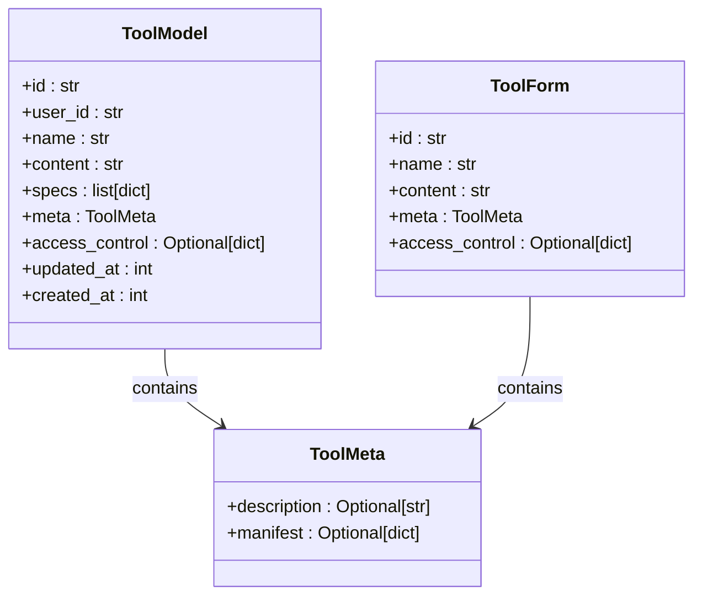
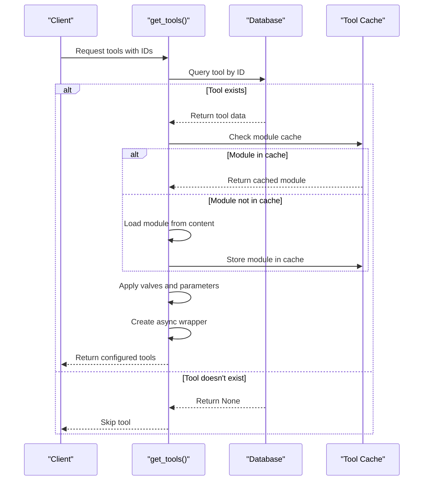
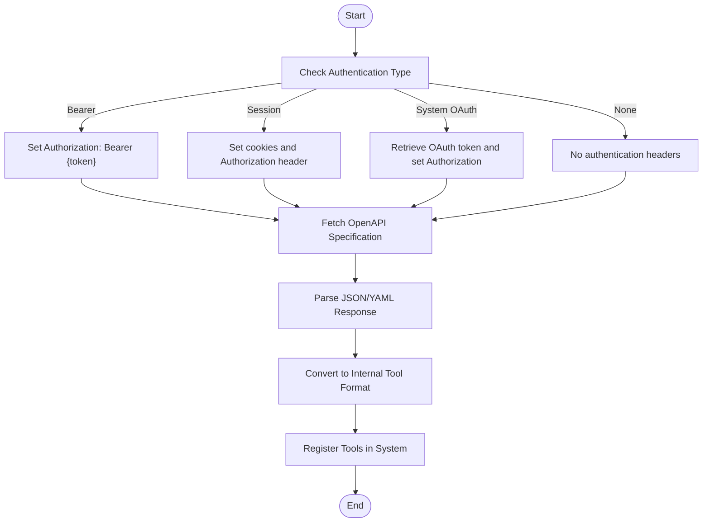
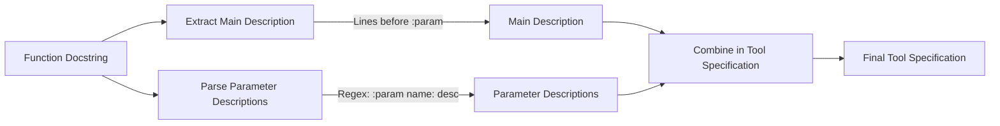
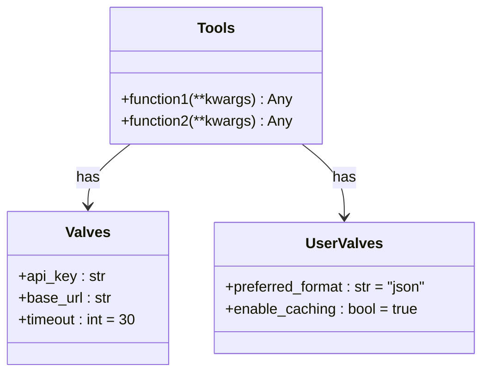
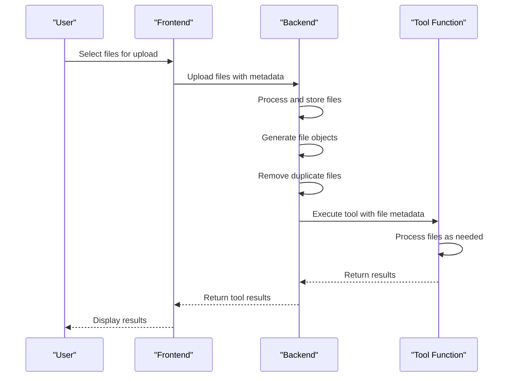
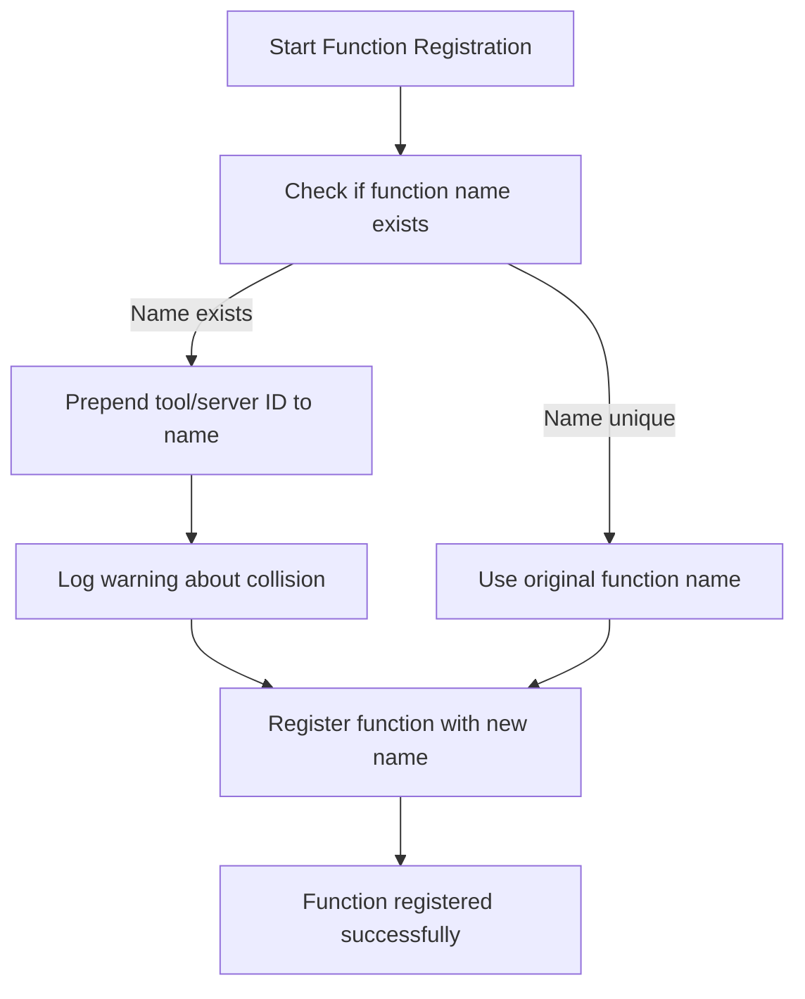
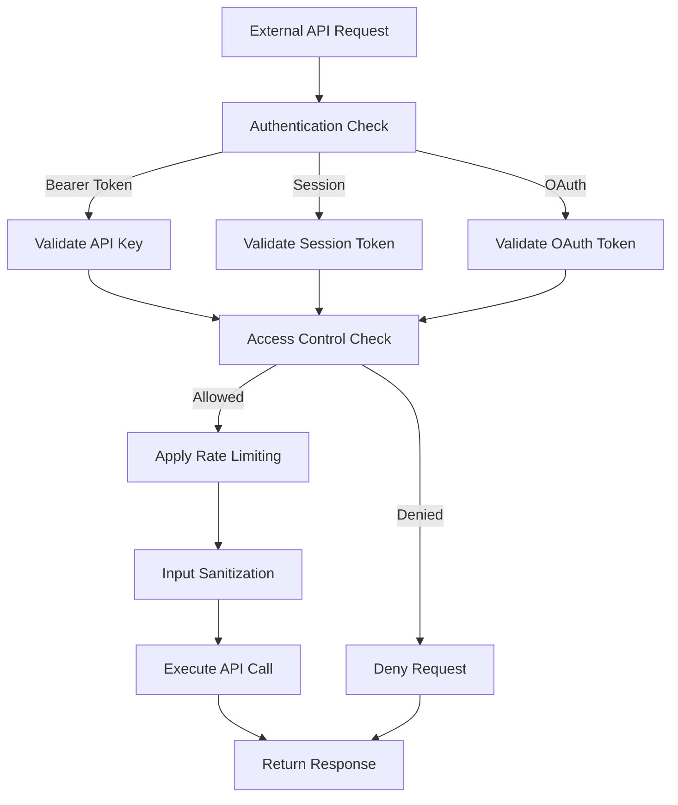
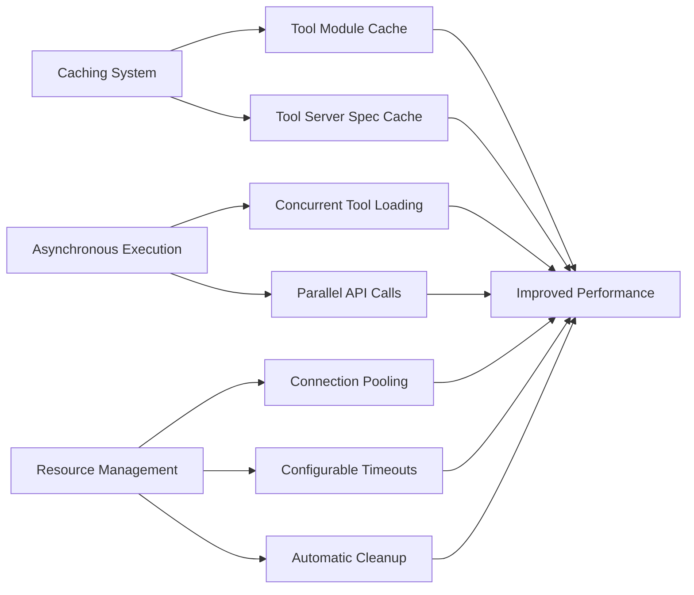

# Tools Framework

<cite>
**Referenced Files in This Document**   
- [tools.py](file://backend/open_webui/models/tools.py)
- [tools.py](file://backend/open_webui/routers/tools.py)
- [tools.py](file://backend/open_webui/utils/tools.py)
- [plugin.py](file://backend/open_webui/utils/plugin.py)
- [config.py](file://backend/open_webui/config.py)
</cite>

## Table of Contents
1. [Introduction](#introduction)
2. [Tool Specification System](#tool-specification-system)
3. [Tool Loading and Configuration](#tool-loading-and-configuration)
4. [External Tool Server Integration](#external-tool-server-integration)
5. [Tool Discovery and Parameter Description](#tool-discovery-and-parameter-description)
6. [Custom Tool Creation with Valves](#custom-tool-creation-with-valves)
7. [File Upload Handling](#file-upload-handling)
8. [Function Name Collision Handling](#function-name-collision-handling)
9. [Security Considerations](#security-considerations)
10. [Performance Optimization](#performance-optimization)
11. [Conclusion](#conclusion)

## Introduction
The Tools Framework in Open WebUI provides a comprehensive system for integrating and managing tools that extend the functionality of the application. This framework supports both internal Python-based tools and external API endpoints through OpenAPI specifications. The system enables dynamic tool loading, configuration through Pydantic models, and integration with external services using various authentication methods. This document details the architecture and implementation of the Tools Framework, providing guidance on creating custom tools, integrating external APIs, and managing tool configurations.

## Tool Specification System
The tool specification system in Open WebUI uses Pydantic models and OpenAPI-style descriptions to define tool interfaces. Each tool is defined with a structured specification that includes the tool's name, description, parameters, and their types. The framework automatically converts Python function signatures and type hints into OpenAPI-compatible function specifications using the `convert_function_to_pydantic_model` function. This conversion process extracts type hints, default values, and parameter descriptions from docstrings to create a standardized tool interface.

The tool specifications are stored in the database as JSON structures that follow the OpenAI function calling format. Each specification includes the function name, description, and a parameters object that describes the expected input schema. The system supports complex data types including nested objects, arrays, and enums, which are properly represented in the generated OpenAPI specifications.

**Diagram sources**
- [tools.py](file://backend/open_webui/models/tools.py#L61-L97)

**Section sources**
- [tools.py](file://backend/open_webui/models/tools.py#L61-L97)
- [tools.py](file://backend/open_webui/utils/tools.py#L380-L419)

## Tool Loading and Configuration
The `get_tools` function dynamically loads and configures tools with user-specific parameters and authentication. This function takes a request object, a list of tool IDs, a user object, and extra parameters as input. It processes each tool ID, loading the corresponding tool module from cache or database if necessary. For internal tools, the function retrieves the tool from the database and loads its module using the `load_tool_module_by_id` function.

The configuration process involves setting up valves (configuration parameters) for each tool. The system retrieves both global tool valves and user-specific valves, applying them to the tool instance. Global valves are stored in the tool's database record, while user-specific valves are stored in the user's settings. This dual-level configuration system allows administrators to set default parameters while enabling users to customize tool behavior according to their needs.

For each tool function, the system creates an asynchronous wrapper that incorporates the configuration parameters. This is achieved through the `get_async_tool_function_and_apply_extra_params` function, which uses functools.partial to bind the extra parameters to the tool function. The wrapper preserves the original function signature while making it awaitable, ensuring compatibility with asynchronous execution contexts.

**Diagram sources**
- [tools.py](file://backend/open_webui/utils/tools.py#L109-L322)
- [plugin.py](file://backend/open_webui/utils/plugin.py#L71-L116)

**Section sources**
- [tools.py](file://backend/open_webui/utils/tools.py#L109-L322)
- [plugin.py](file://backend/open_webui/utils/plugin.py#L71-L116)

## External Tool Server Integration
The framework supports integration with external tool servers through OpenAPI endpoints, allowing connection to various authentication methods including bearer tokens, session-based authentication, and system-managed OAuth. The integration is configured through the application's configuration system, where tool server connections are defined with their URLs, authentication types, and access controls.

For bearer token authentication, the system includes the token in the Authorization header as "Bearer {token}". Session-based authentication combines cookies from the client request with a bearer token derived from the user's session. System OAuth authentication uses tokens obtained through the OAuth flow, which are retrieved using the `get_oauth_token` method from the OAuth client manager.

The external tool server integration process begins with fetching the OpenAPI specification from the server URL. The system supports both JSON and YAML formats, automatically detecting the format based on the URL extension or attempting to parse the response as JSON first, then falling back to YAML. Once the specification is retrieved, it is converted into the internal tool payload format using the `convert_openapi_to_tool_payload` function.

**Diagram sources**
- [tools.py](file://backend/open_webui/utils/tools.py#L169-L194)
- [tools.py](file://backend/open_webui/utils/tools.py#L590-L637)
- [config.py](file://backend/open_webui/config.py#L286-L800)

**Section sources**
- [tools.py](file://backend/open_webui/utils/tools.py#L169-L194)
- [tools.py](file://backend/open_webui/utils/tools.py#L590-L637)

## Tool Discovery and Parameter Description
The tool discovery mechanism parses function docstrings to generate parameter descriptions using reStructuredText (reST) format. The system extracts descriptions from docstrings by identifying lines that match the pattern ":param parameter_name: description". These descriptions are then incorporated into the tool specification, providing detailed information about each parameter's purpose and usage.

The docstring parsing process is implemented in the `parse_docstring` function, which uses regular expressions to identify parameter descriptions. The function iterates through each line of the docstring, matching lines that start with ":param" followed by the parameter name and description. Internal parameters that start with double underscores are filtered out to prevent exposure of implementation details.

In addition to parameter descriptions, the system extracts the function's main description by taking all lines from the beginning of the docstring up to the first ":param" or ":return" directive. This ensures that the tool's overall purpose is clearly documented in the generated specification. The extracted descriptions are then used to populate the "description" field in the OpenAPI-compatible tool specification.

**Diagram sources**
- [tools.py](file://backend/open_webui/utils/tools.py#L351-L377)
- [tools.py](file://backend/open_webui/utils/tools.py#L325-L349)

**Section sources**
- [tools.py](file://backend/open_webui/utils/tools.py#L325-L377)

## Custom Tool Creation with Valves
Creating a custom tool with valves for configuration involves defining a Python module with specific components. The tool module must contain a `Tools` class and can optionally include `Valves` and `UserValves` Pydantic models for configuration. The `Valves` model defines global configuration parameters that can be set by administrators, while `UserValves` defines user-specific configuration options.

To create a custom tool, developers define functions within the `Tools` class, adding docstrings that describe the function and its parameters using reST format. The framework automatically discovers these functions and generates appropriate specifications. Configuration valves are defined as Pydantic models with fields that represent the configurable parameters, including their types, default values, and descriptions.

The system provides APIs for managing valve configurations. Administrators can update global valves through the `/tools/id/{id}/valves/update` endpoint, while users can manage their personal valve settings via the `/tools/id/{id}/valves/user/update` endpoint. The framework ensures proper access control, allowing only authorized users to modify valve configurations.

**Diagram sources**
- [tools.py](file://backend/open_webui/routers/tools.py#L456-L559)
- [tools.py](file://backend/open_webui/routers/tools.py#L562-L647)

**Section sources**
- [tools.py](file://backend/open_webui/routers/tools.py#L456-L647)

## File Upload Handling
The framework handles file uploads through tool functions by incorporating file metadata into the tool execution context. When a file is uploaded, it is first processed by the file management system, which stores the file and returns a file object containing metadata such as the file ID, name, and URL. This file object is then passed to tool functions that support file operations.

Tool functions that handle files can access them through the metadata parameter, which includes a list of file objects. The system supports both individual files and folders, with folder uploads being expanded to include all files within the folder. Before processing, the system removes duplicate files based on their content to prevent redundant operations.

The file upload process is integrated with the tool execution pipeline, allowing tools to access uploaded files directly. When a tool requires file input, the system ensures that the necessary file permissions are checked and that the files are available for processing. This integration enables tools to perform operations such as document analysis, data extraction, or file conversion on user-uploaded content.

**Diagram sources**
- [middleware.py](file://backend/open_webui/utils/middleware.py#L1297-L1319)
- [files/index.ts](file://src/lib/apis/files/index.ts#L1-L85)

**Section sources**
- [middleware.py](file://backend/open_webui/utils/middleware.py#L1297-L1319)
- [files/index.ts](file://src/lib/apis/files/index.ts#L1-L85)

## Function Name Collision Handling
The framework addresses function name collisions through a systematic renaming strategy when loading tools. When a function name from a new tool conflicts with an existing function name in the tools dictionary, the system logs a warning and automatically prepends the tool ID to the function name. This approach ensures that all functions remain uniquely identifiable while preserving their original functionality.

For internal tools, the collision resolution occurs during the tool loading process in the `get_tools` function. When a function name already exists in the tools dictionary, the system modifies the name by prefixing it with the tool ID followed by an underscore. For external tool servers, the same strategy is applied, but using the server ID instead of the tool ID.

This collision handling mechanism allows multiple tools to provide functions with the same name without interference. The original function names are preserved in the tool specifications, while the execution system uses the unique prefixed names to route calls correctly. This approach maintains backward compatibility with existing tool implementations while enabling the coexistence of multiple tools with similar functionality.

**Diagram sources**
- [tools.py](file://backend/open_webui/utils/tools.py#L233-L241)
- [tools.py](file://backend/open_webui/utils/tools.py#L312-L320)

**Section sources**
- [tools.py](file://backend/open_webui/utils/tools.py#L233-L241)
- [tools.py](file://backend/open_webui/utils/tools.py#L312-L320)

## Security Considerations
Security considerations for external API calls in the Tools Framework include proper authentication management, input validation, and access control. The system implements multiple authentication methods for external tool servers, each with specific security implications. Bearer token authentication requires secure storage of API keys, while session-based authentication leverages existing user sessions for authorization.

The framework enforces access control at multiple levels. Tool access is controlled through the `access_control` field in the tool database model, which can specify read and write permissions for specific user IDs and group IDs. Additionally, the system checks user permissions before allowing tool creation, modification, or deletion operations.

For OAuth-based external tools, the system uses the OAuth client manager to securely retrieve and refresh access tokens. The token refresh process includes validation of token expiration and automatic cleanup of invalid sessions. This ensures that external API calls always use valid authentication credentials while minimizing the risk of using expired or revoked tokens.

**Diagram sources**
- [tools.py](file://backend/open_webui/routers/tools.py#L16-L27)
- [oauth.py](file://backend/open_webui/utils/oauth.py#L843-L876)
- [tools.py](file://backend/open_webui/models/tools.py#L35-L50)

**Section sources**
- [tools.py](file://backend/open_webui/routers/tools.py#L16-L27)
- [oauth.py](file://backend/open_webui/utils/oauth.py#L843-L876)

## Performance Optimization
Performance optimization strategies for the tool system include caching, asynchronous execution, and efficient resource management. The framework implements a multi-level caching system to minimize redundant operations. Tool modules are cached in memory after first load, preventing repeated parsing and compilation of tool code. Additionally, tool server specifications are cached in Redis to reduce the need for repeated HTTP requests to external endpoints.

The system leverages asynchronous execution for all tool operations, allowing concurrent processing of multiple tool calls. This is particularly beneficial for external API calls, where network latency can be mitigated through parallel execution. The `get_tools` function processes tool server connections concurrently using asyncio.gather, significantly reducing the initialization time when multiple external tools are configured.

Resource management is optimized through the use of connection pooling and timeout configurations. External API calls use configurable timeouts to prevent hanging requests, and SSL verification can be controlled through configuration options. The system also implements efficient memory management by using temporary files for tool module loading and ensuring proper cleanup of these files after use.

**Diagram sources**
- [tools.py](file://backend/open_webui/utils/tools.py#L574-L587)
- [tools.py](file://backend/open_webui/utils/tools.py#L696-L697)
- [tools.py](file://backend/open_webui/utils/tools.py#L800-L842)

**Section sources**
- [tools.py](file://backend/open_webui/utils/tools.py#L574-L587)
- [tools.py](file://backend/open_webui/utils/tools.py#L696-L697)

## Conclusion
The Tools Framework in Open WebUI provides a robust and flexible system for integrating both internal and external tools. By leveraging Pydantic models and OpenAPI specifications, the framework ensures consistent tool interfaces while supporting rich configuration through valves. The dynamic loading system with caching optimizes performance, and comprehensive security measures protect against unauthorized access. The framework's support for multiple authentication methods and external API integration enables seamless connection to various services, making it a powerful platform for extending application functionality. With proper implementation of best practices for tool creation, configuration, and security, developers can create powerful, reliable tools that enhance the user experience.