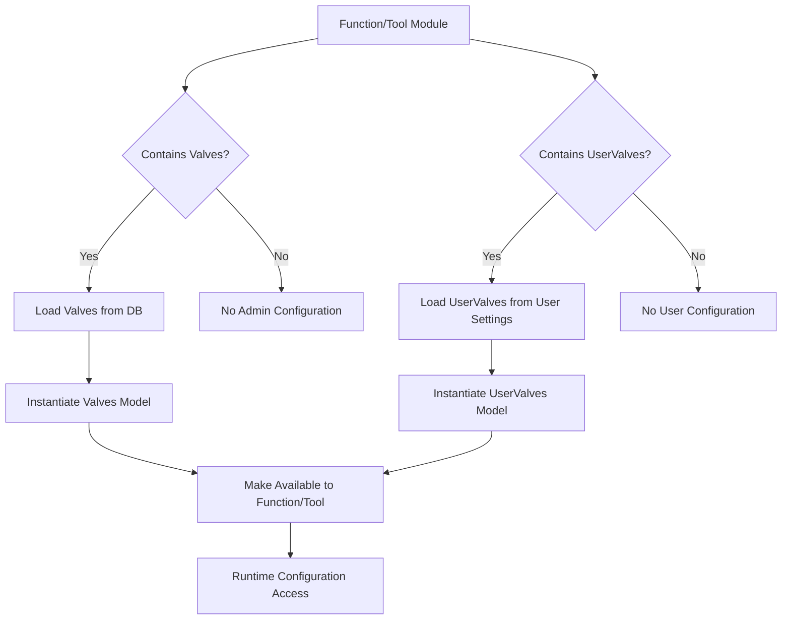
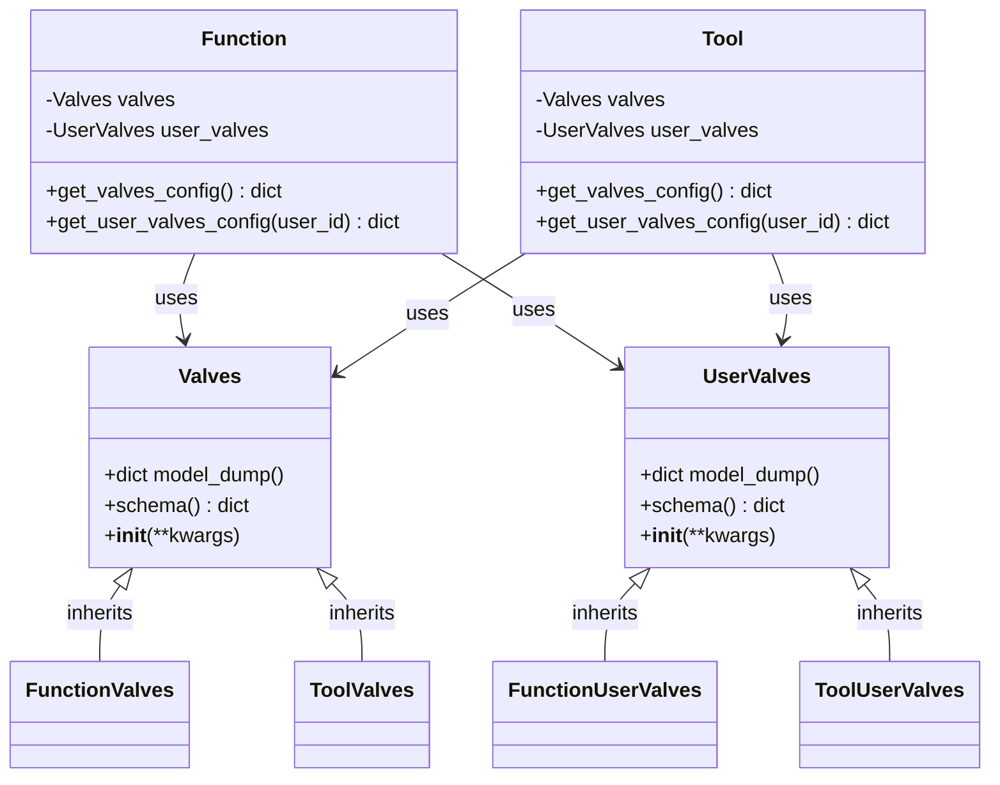
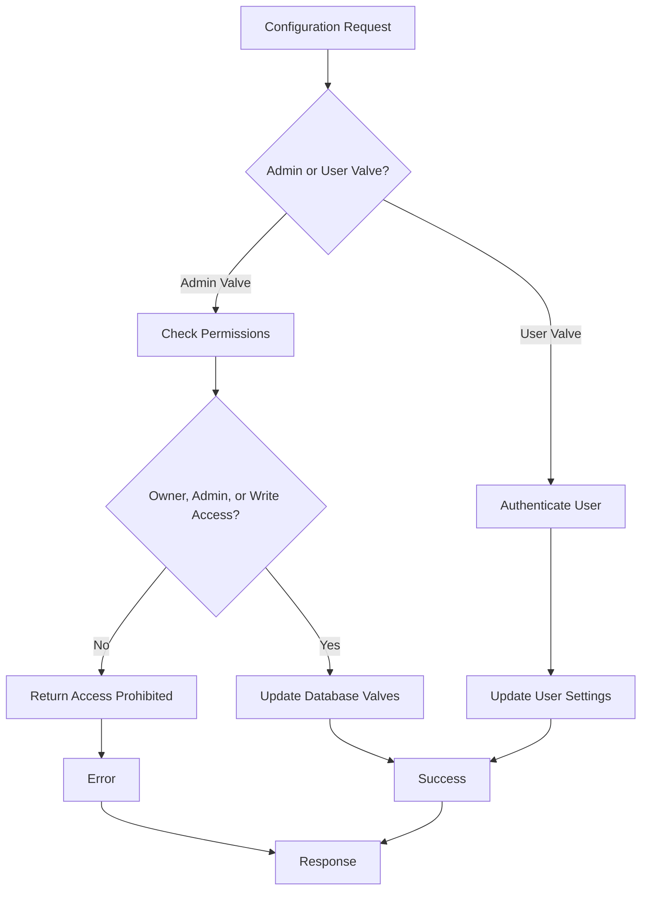
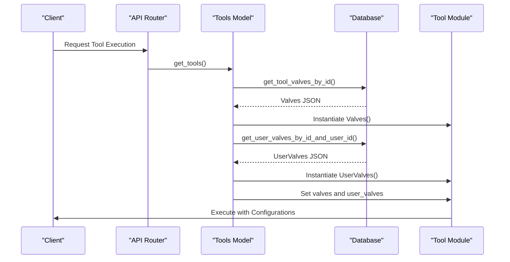
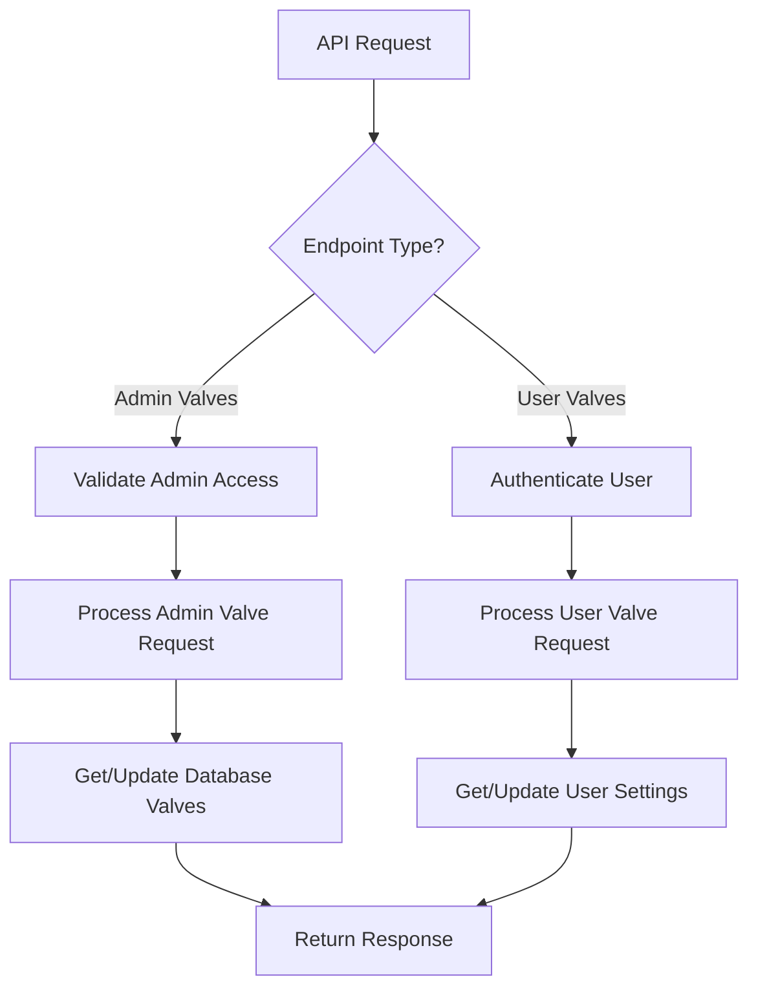
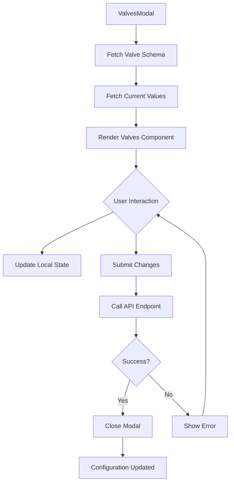
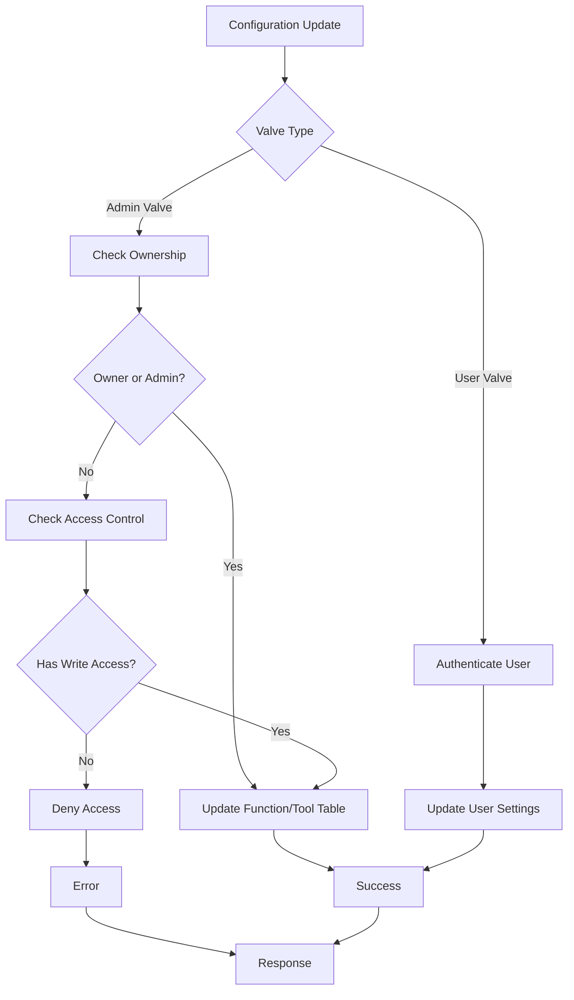
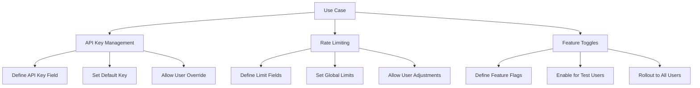
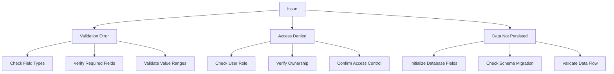

# Valves Configuration System

<cite>
**Referenced Files in This Document**   
- [functions.py](file://backend/open_webui/models/functions.py)
- [tools.py](file://backend/open_webui/models/tools.py)
- [tools.py](file://backend/open_webui/routers/tools.py)
- [functions.py](file://backend/open_webui/routers/functions.py)
- [plugin.py](file://backend/open_webui/utils/plugin.py)
- [ValvesModal.svelte](file://src/lib/components/workspace/common/ValvesModal.svelte)
- [Valves.svelte](file://src/lib/components/common/Valves.svelte)
- [016_add_valves_and_is_active.py](file://backend/open_webui/internal/migrations/016_add_valves_and_is_active.py)
</cite>

## Table of Contents
1. [Introduction](#introduction)
2. [Core Architecture](#core-architecture)
3. [Valve Configuration Models](#valve-configuration-models)
4. [Admin and User-Level Configuration](#admin-and-user-level-configuration)
5. [Runtime Configuration Implementation](#runtime-configuration-implementation)
6. [API Endpoints for Valve Management](#api-endpoints-for-valve-management)
7. [Frontend Interface Components](#frontend-interface-components)
8. [Security Model and Access Control](#security-model-and-access-control)
9. [Use Cases and Implementation Examples](#use-cases-and-implementation-examples)
10. [Common Issues and Troubleshooting](#common-issues-and-troubleshooting)

## Introduction

The Valves Configuration System in Open WebUI provides a flexible mechanism for runtime configuration of functions and tools through Pydantic models. This system enables both administrators and users to configure parameters that control various aspects of functionality, including API keys, rate limiting, and feature toggles. The implementation separates admin-configured valves from user-configured valves, creating a security model that allows global settings while permitting user-level customization.

The system is built around two primary Pydantic models: Valves and UserValves. Admin-configured valves (Valves) are stored in the database and apply globally, while user-configured valves (UserValves) are stored in user settings and apply only to individual users. This dual-layer approach provides both centralized control and personalized configuration options.

**Section sources**
- [functions.py](file://backend/open_webui/models/functions.py#L28-L29)
- [tools.py](file://backend/open_webui/models/tools.py#L33)
- [016_add_valves_and_is_active.py](file://backend/open_webui/internal/migrations/016_add_valves_and_is_active.py#L40-L42)

## Core Architecture

The Valves Configuration System follows a modular architecture that integrates with the existing functions and tools infrastructure. At its core, the system relies on Pydantic models defined within function and tool modules to provide type-safe configuration with validation. These models are dynamically loaded and instantiated based on database-stored values.

The architecture consists of three main components:
1. Database storage for valve configurations
2. Runtime loading and instantiation of valve models
3. API endpoints for configuration management

When a function or tool is loaded, the system checks for the presence of Valves and UserValves classes in the module. If found, it retrieves the corresponding configuration values from the database (for Valves) or user settings (for UserValves) and instantiates the Pydantic models. These instantiated models are then made available to the function or tool code at runtime.

**Diagram sources**
- [plugin.py](file://backend/open_webui/utils/plugin.py#L118-L157)
- [tools.py](file://backend/open_webui/utils/tools.py#L258-L265)
- [functions.py](file://backend/open_webui/models/functions.py#L267-L286)

**Section sources**
- [plugin.py](file://backend/open_webui/utils/plugin.py#L118-L157)
- [tools.py](file://backend/open_webui/utils/tools.py#L258-L265)

## Valve Configuration Models

The Valves Configuration System utilizes Pydantic models to define configuration schemas with built-in validation. These models are defined within function and tool modules and follow specific naming conventions: Valves for admin-level configuration and UserValves for user-level configuration.

The Valves model represents admin-configured settings that apply globally across all users. These configurations are stored in the functions and tools database tables as JSON fields. The UserValves model represents user-specific configurations that override or supplement the admin settings. These are stored within the user's settings object in the users table.

Both models leverage Pydantic's validation capabilities, allowing developers to define field types, default values, and validation rules. When a valve configuration is updated through the API, the system validates the input against the Pydantic model schema before storing it. This ensures that only valid configurations are applied.

**Diagram sources**
- [functions.py](file://backend/open_webui/models/functions.py#L102-L104)
- [tools.py](file://backend/open_webui/models/tools.py#L109-L111)
- [functions.py](file://backend/open_webui/models/functions.py#L267-L275)
- [tools.py](file://backend/open_webui/models/tools.py#L184-L189)

**Section sources**
- [functions.py](file://backend/open_webui/models/functions.py#L102-L104)
- [tools.py](file://backend/open_webui/models/tools.py#L109-L111)

## Admin and User-Level Configuration

The Valves Configuration System implements a dual-layer configuration model that separates admin-level and user-level settings. This separation creates a security model where administrators can define global parameters while allowing users to customize their experience within defined boundaries.

Admin-configured valves are stored in the functions and tools database tables. The migration file 016_add_valves_and_is_active.py adds a valves column to both the function and tool tables, enabling storage of admin-level configurations as JSON data. These configurations are accessible to all users but can only be modified by administrators or the tool/function owner.

User-configured valves are stored within the user's settings object in the users table. The system organizes these settings hierarchically under "functions" and "tools" keys, with a "valves" subkey containing the user-specific configurations. This structure allows users to customize their experience without affecting other users.

The implementation ensures proper access control through validation in the API endpoints. When updating admin valves, the system verifies that the user is either the owner, has write access, or is an administrator. User valve updates only require authentication, as users can always modify their own settings.

**Diagram sources**
- [tools.py](file://backend/open_webui/routers/tools.py#L524-L532)
- [functions.py](file://backend/open_webui/routers/functions.py#L308-L315)
- [tools.py](file://backend/open_webui/models/tools.py#L224-L247)
- [functions.py](file://backend/open_webui/models/functions.py#L331-L347)

**Section sources**
- [tools.py](file://backend/open_webui/routers/tools.py#L524-L532)
- [functions.py](file://backend/open_webui/routers/functions.py#L308-L315)

## Runtime Configuration Implementation

The runtime configuration implementation in the Valves System centers around the load_function_module_by_id and get_tools functions, which instantiate valve configurations from database-stored values. These functions are critical to the system's operation, ensuring that configuration values are properly loaded and made available to functions and tools at runtime.

The load_function_module_by_id function in plugin.py is responsible for loading function modules and extracting valve configurations. It creates a dynamic module from the function content, executes it in the module's namespace, and returns the Tools class along with frontmatter. During this process, it checks for the presence of Valves and UserValves classes and handles them appropriately.

The get_tools function in tools.py implements the runtime configuration logic for tools. It retrieves the tool valves from the database using get_tool_valves_by_id and instantiates the Valves model if present. Similarly, it retrieves user valves using get_user_valves_by_id_and_user_id and instantiates the UserValves model. These instantiated models are then made available to the tool functions through the __user__ parameter.

**Diagram sources**
- [plugin.py](file://backend/open_webui/utils/plugin.py#L118-L157)
- [tools.py](file://backend/open_webui/utils/tools.py#L258-L265)
- [tools.py](file://backend/open_webui/models/tools.py#L184-L189)

**Section sources**
- [plugin.py](file://backend/open_webui/utils/plugin.py#L118-L157)
- [tools.py](file://backend/open_webui/utils/tools.py#L258-L265)

## API Endpoints for Valve Management

The Valves Configuration System exposes a comprehensive set of API endpoints for managing both admin and user valve configurations. These endpoints follow a consistent pattern and provide CRUD operations for valve settings, with appropriate authentication and authorization controls.

For admin valve management, the system provides endpoints to get, update, and retrieve the schema of valve configurations. The GET /id/{id}/valves endpoint retrieves the current admin valve settings for a specific tool or function. The POST /id/{id}/valves/update endpoint allows authorized users to update these settings, with validation performed against the Valves Pydantic model.

For user valve management, separate endpoints handle user-specific configurations. The GET /id/{id}/valves/user endpoint retrieves the user's valve settings, while POST /id/{id}/valves/user/update allows users to modify their own settings. The system also provides schema endpoints (GET /id/{id}/valves/spec and GET /id/{id}/valves/user/spec) that return the JSON schema of the valve models, enabling dynamic form generation in the frontend.

**Diagram sources**
- [tools.py](file://backend/open_webui/routers/tools.py#L461-L558)
- [tools.py](file://backend/open_webui/routers/tools.py#L566-L637)
- [functions.py](file://backend/open_webui/routers/functions.py#L247-L354)

**Section sources**
- [tools.py](file://backend/open_webui/routers/tools.py#L461-L558)
- [functions.py](file://backend/open_webui/routers/functions.py#L247-L354)

## Frontend Interface Components

The frontend interface for the Valves Configuration System consists of reusable Svelte components that provide a consistent user experience across different parts of the application. These components dynamically generate configuration forms based on the valve schema, supporting various input types and validation.

The primary component is Valves.svelte, which renders form fields based on the valve specification. It supports multiple input types including text, textarea, boolean (switch), select (enum), and specialized inputs like API keys and coordinates. The component handles array types by converting them to comma-separated strings for display and back to arrays when submitting.

The ValvesModal.svelte component provides a modal interface for editing valve configurations. It fetches the valve schema and current values, then renders the Valves component within a modal dialog. This component handles the submission process, calling the appropriate API endpoints to update the configuration and providing feedback to the user.

**Diagram sources**
- [Valves.svelte](file://src/lib/components/common/Valves.svelte#L43-L185)
- [ValvesModal.svelte](file://src/lib/components/workspace/common/ValvesModal.svelte#L143-L206)
- [index.ts](file://src/lib/apis/tools/index.ts#L327-L456)

**Section sources**
- [Valves.svelte](file://src/lib/components/common/Valves.svelte#L43-L185)
- [ValvesModal.svelte](file://src/lib/components/workspace/common/ValvesModal.svelte#L143-L206)

## Security Model and Access Control

The Valves Configuration System implements a robust security model that separates admin-configured valves from user-configured valves, ensuring appropriate access control and data isolation. This model prevents unauthorized modification of global settings while allowing users to customize their experience.

For admin valves, access is restricted based on ownership, role, and access control settings. The system verifies that the user attempting to modify valve settings is either the owner of the function/tool, has explicit write access, or is an administrator. This check is performed in the API endpoints before any database operations are executed.

User valves follow a simpler security model, as users are always allowed to modify their own settings. The system retrieves user valve configurations from the user's settings object, ensuring that users can only access and modify their own configurations. This approach eliminates the need for complex permission checks while maintaining data isolation.

The database schema supports this security model by storing admin valves in the functions and tools tables, while user valves are stored in the users table within the user's settings. This physical separation reinforces the logical separation of configuration types and simplifies access control implementation.

**Diagram sources**
- [tools.py](file://backend/open_webui/routers/tools.py#L524-L532)
- [functions.py](file://backend/open_webui/routers/functions.py#L308-L315)
- [tools.py](file://backend/open_webui/models/tools.py#L204-L247)
- [functions.py](file://backend/open_webui/models/functions.py#L313-L347)

**Section sources**
- [tools.py](file://backend/open_webui/routers/tools.py#L524-L532)
- [functions.py](file://backend/open_webui/routers/functions.py#L308-L315)

## Use Cases and Implementation Examples

The Valves Configuration System supports several key use cases that enhance the flexibility and security of functions and tools. These use cases demonstrate how the system can be applied to real-world scenarios such as API key management, rate limiting, and feature toggles.

For API key management, a tool can define a Valves model with a field for the API key. Administrators can set the default API key that applies to all users, while individual users can override this with their own keys. This approach allows organizations to provide a shared API key while enabling users to use their own credentials when needed.

Rate limiting can be implemented by defining valve fields for maximum requests per minute, burst limits, and cooldown periods. Admins can set global rate limits to prevent abuse, while power users might be granted higher limits through user-level valves. The system validates these values at runtime, ensuring they fall within acceptable ranges.

Feature toggles enable gradual rollout of new functionality. Admins can define boolean valve fields to enable or disable specific features. They can initially enable a feature for a subset of users by configuring it in their user valves, then gradually roll it out to all users by updating the admin valves.

**Diagram sources**
- [functions.py](file://backend/open_webui/models/functions.py#L102-L104)
- [tools.py](file://backend/open_webui/models/tools.py#L109-L111)
- [Valves.svelte](file://src/lib/components/common/Valves.svelte#L64-L77)

**Section sources**
- [functions.py](file://backend/open_webui/models/functions.py#L102-L104)
- [tools.py](file://backend/open_webui/models/tools.py#L109-L111)

## Common Issues and Troubleshooting

The Valves Configuration System may encounter several common issues related to validation, access control, and data persistence. Understanding these issues and their solutions is essential for effective system management.

Valve validation errors occur when configuration values do not meet the requirements defined in the Pydantic model. These errors typically result from type mismatches, missing required fields, or values outside allowed ranges. The system returns detailed error messages that can be used to diagnose and fix the issue. Ensuring that frontend forms properly handle the valve schema helps prevent these errors.

Access control issues may arise when users attempt to modify valve configurations without proper permissions. For admin valves, users must be the owner, an administrator, or have explicit write access. For user valves, authentication is required but no additional permissions are needed. Checking the user's role and access rights can resolve these issues.

Data persistence problems can occur if the database schema does not match the expected structure. The migration file 016_add_valves_and_is_active.py ensures that the necessary columns are present, but custom deployments may require manual verification. Ensuring that the valves and user settings fields are properly initialized in the database prevents null pointer exceptions.

**Diagram sources**
- [tools.py](file://backend/open_webui/routers/tools.py#L553-L558)
- [functions.py](file://backend/open_webui/routers/functions.py#L348-L353)
- [tools.py](file://backend/open_webui/models/tools.py#L204-L247)
- [functions.py](file://backend/open_webui/models/functions.py#L313-L347)

**Section sources**
- [tools.py](file://backend/open_webui/routers/tools.py#L553-L558)
- [functions.py](file://backend/open_webui/routers/functions.py#L348-L353)