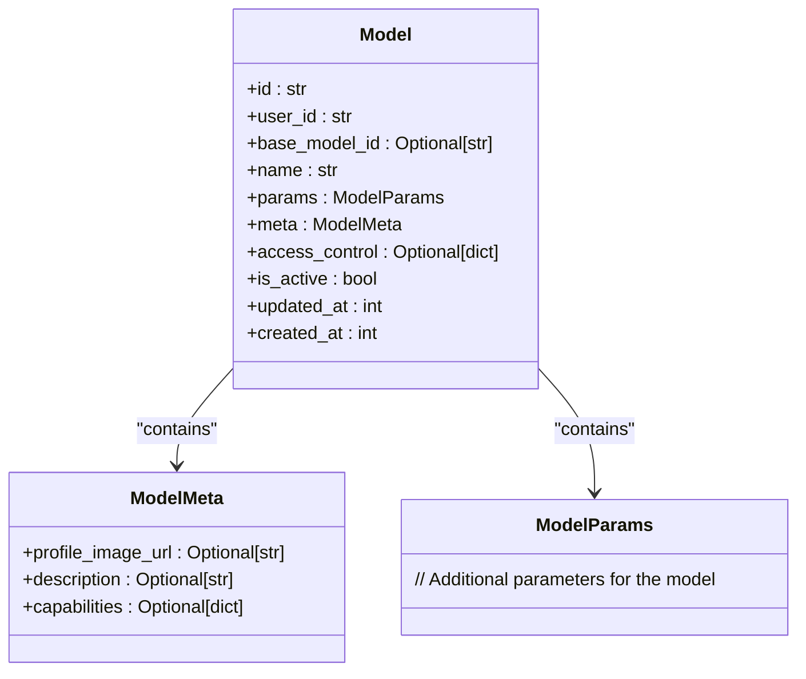
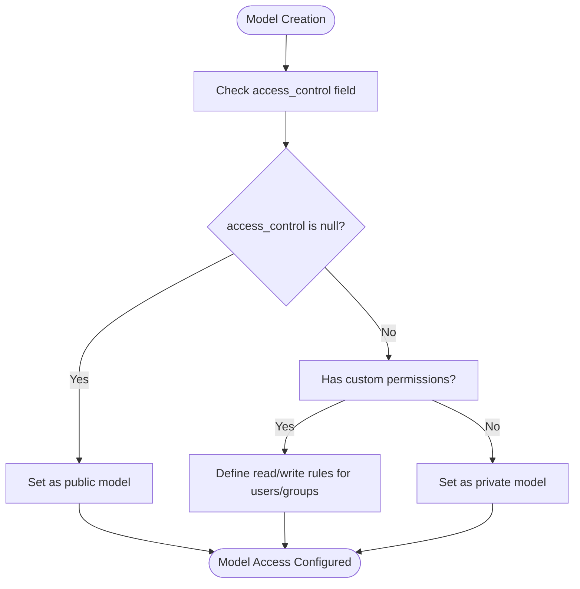
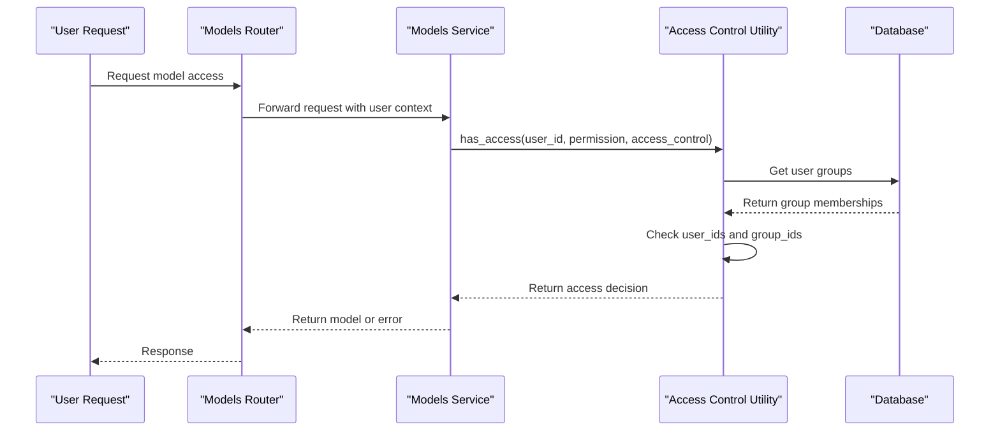
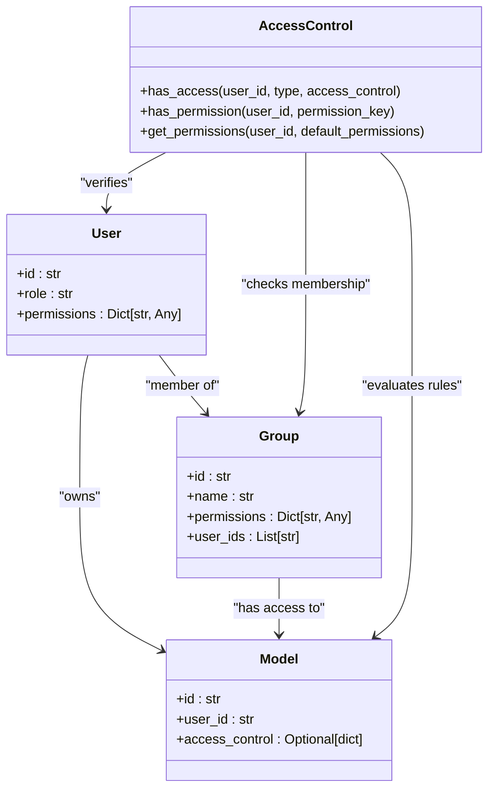
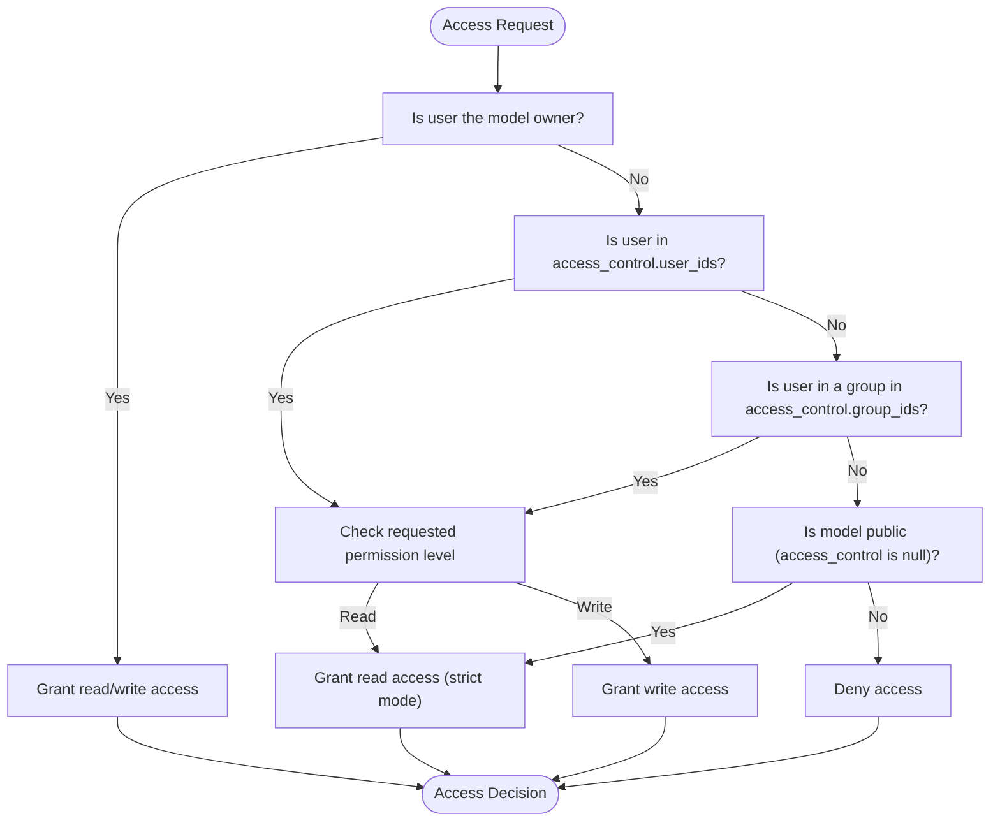
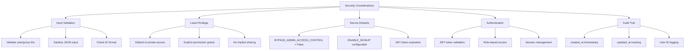
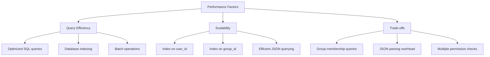

# Access Control and Permissions

<cite>
**Referenced Files in This Document**   
- [models.py](file://backend/open_webui/models/models.py)
- [access_control.py](file://backend/open_webui/utils/access_control.py)
- [models.py](file://backend/open_webui/routers/models.py)
- [AccessControl.svelte](file://src/lib/components/workspace/common/AccessControl.svelte)
- [config.py](file://backend/open_webui/config.py)
</cite>

## Table of Contents
1. [Introduction](#introduction)
2. [Model Access Control Implementation](#model-access-control-implementation)
3. [Permission Levels](#permission-levels)
4. [Group-Based and User-Specific Access Rules](#group-based-and-user-specific-access-rules)
5. [Relationship with User Roles and Permissions](#relationship-with-user-roles-and-permissions)
6. [Permission Inheritance and Conflict Resolution](#permission-inheritance-and-conflict-resolution)
7. [Security Considerations](#security-considerations)
8. [Performance Implications](#performance-implications)
9. [Conclusion](#conclusion)

## Introduction
The Model Access Control system in Open WebUI provides a comprehensive framework for managing access to AI models within the platform. This system implements fine-grained permission controls that allow administrators and users to define who can access specific models and what operations they can perform. The implementation supports public, private, and custom permission levels, enabling flexible sharing policies across individual users and groups. This document details the technical implementation of the access control system, focusing on the `access_control` field in the Model entity, permission management, and the underlying security architecture.

## Model Access Control Implementation

The access control system is implemented through the `access_control` field in the Model entity, which is stored as a JSON field in the database. This field determines the visibility and accessibility of models across the platform.



**Diagram sources**
- [models.py](file://backend/open_webui/models/models.py#L55-L123)

The `access_control` field is defined as a nullable JSON field in the Model table, allowing for three distinct states: public access (null value), private access (empty object), and custom permissions (structured object with read/write rules). This implementation enables flexible access policies while maintaining backward compatibility with existing models.

**Section sources**
- [models.py](file://backend/open_webui/models/models.py#L84-L99)

## Permission Levels

The system implements three primary permission levels for model access: public, private, and custom.

### Public Access
Public access is represented by a null value in the `access_control` field. When a model has public access, it is available to all users with the "user" role in the system. This is the default permission level for models created by administrators.

### Private Access
Private access is indicated by an empty object or the absence of specific permission rules. In this mode, only the model owner has access to the model. This provides a baseline level of protection for user-created models.

### Custom Permissions
Custom permissions allow for granular control over model access through a structured JSON object that defines read and write permissions for specific users and groups:

```json
{
  "read": {
    "group_ids": ["group_id1", "group_id2"],
    "user_ids": ["user_id1", "user_id2"]
  },
  "write": {
    "group_ids": ["group_id1", "group_id2"],
    "user_ids": ["user_id1", "user_id2"]
  }
}
```

The implementation distinguishes between read and write permissions, allowing for scenarios where users can view a model but not modify it, or where specific users can both view and edit the model configuration.



**Diagram sources**
- [AccessControl.svelte](file://src/lib/components/workspace/common/AccessControl.svelte#L109-L124)
- [models.py](file://backend/open_webui/models/models.py#L84-L99)

**Section sources**
- [AccessControl.svelte](file://src/lib/components/workspace/common/AccessControl.svelte#L105-L140)
- [models.py](file://backend/open_webui/models/models.py#L84-L99)

## Group-Based and User-Specific Access Rules

The access control system supports both group-based and user-specific access rules, allowing for flexible sharing policies that can be managed at scale.

### Group-Based Access
Group-based access rules are implemented through the `group_ids` field within the read and write permission objects. When a model grants access to a group, all members of that group inherit the specified permissions. The system efficiently manages group membership through the GroupMember table, which was introduced in migration 37f288994c47_add_group_member_table.py.

### User-Specific Access
User-specific access rules are implemented through the `user_ids` field within the read and write permission objects. This allows model owners to grant access to specific individuals without requiring them to be part of a shared group.

### Access Verification Process
The system verifies access through the `has_access` function in the access_control utility module. This function checks whether a user has the required permission level for a specific model by evaluating both direct user permissions and group memberships.



**Diagram sources**
- [access_control.py](file://backend/open_webui/utils/access_control.py#L124-L150)
- [models.py](file://backend/open_webui/models/models.py#L213-L223)
- [models.py](file://backend/open_webui/routers/models.py#L270-L277)

**Section sources**
- [access_control.py](file://backend/open_webui/utils/access_control.py#L124-L150)
- [models.py](file://backend/open_webui/models/models.py#L213-L223)

## Relationship with User Roles and Permissions

The model access control system is integrated with the broader user role and permission framework in Open WebUI, creating a layered security model.

### User Roles
The system implements user roles such as "admin" and "user", which provide baseline permissions that interact with the model-specific access controls. Administrators have elevated privileges that allow them to bypass certain access restrictions when the `BYPASS_ADMIN_ACCESS_CONTROL` configuration is enabled.

### Permission Hierarchy
The permission system follows a hierarchical approach where user roles provide general capabilities, while the model access control provides specific resource-level permissions. This allows for a principle of least privilege, where users have only the permissions necessary for their role and specific assigned resources.

### Default User Permissions
The system defines default user permissions through the `DEFAULT_USER_PERMISSIONS` constant in the configuration. These defaults are applied to all users with the "user" role and can be overridden by group-specific permissions or individual model access rules.



**Diagram sources**
- [config.py](file://backend/open_webui/config.py#L1430-L1431)
- [access_control.py](file://backend/open_webui/utils/access_control.py#L71-L105)
- [models.py](file://backend/open_webui/models/models.py#L84-L99)

**Section sources**
- [config.py](file://backend/open_webui/config.py#L1430-L1431)
- [access_control.py](file://backend/open_webui/utils/access_control.py#L71-L105)

## Permission Inheritance and Conflict Resolution

The system implements sophisticated rules for permission inheritance and conflict resolution to ensure predictable access control behavior.

### Permission Inheritance
When a user belongs to multiple groups with different permission levels for a model, the system follows a "most permissive wins" policy. This means that if any group grants a specific permission, the user inherits that permission regardless of more restrictive settings in other groups.

### Conflict Resolution
The system resolves permission conflicts through a well-defined hierarchy:
1. Direct user permissions take precedence over group permissions
2. Write permissions imply read permissions (a user with write access automatically has read access)
3. Explicit denials are not supported; the system operates on an allow-only basis

### Strict vs. Permissive Mode
The `has_access` function includes a `strict` parameter that modifies the behavior for public models:
- In strict mode (default): Public models are readable but not writable
- In permissive mode: Public models are fully accessible

This allows the system to balance usability with security based on the deployment context.



**Diagram sources**
- [access_control.py](file://backend/open_webui/utils/access_control.py#L131-L135)
- [models.py](file://backend/open_webui/models/models.py#L222)
- [models.py](file://backend/open_webui/routers/models.py#L276)

**Section sources**
- [access_control.py](file://backend/open_webui/utils/access_control.py#L124-L150)
- [models.py](file://backend/open_webui/models/models.py#L213-L223)

## Security Considerations

The access control implementation incorporates several security measures to protect against common vulnerabilities and ensure data integrity.

### Input Validation
All access control operations include rigorous input validation to prevent injection attacks and malformed data. The system validates user IDs, group IDs, and permission structures before applying them to model entities.

### Principle of Least Privilege
The system follows the principle of least privilege by defaulting to private access for user-created models and requiring explicit permission grants for sharing. This minimizes the risk of accidental data exposure.

### Secure Defaults
The configuration includes secure defaults such as `BYPASS_ADMIN_ACCESS_CONTROL` being disabled by default, preventing administrators from automatically accessing all models without explicit configuration.

### Authentication Integration
The access control system is tightly integrated with the authentication framework, ensuring that all access decisions are based on verified user identities. The system uses JWT tokens for session management and validates user credentials before evaluating access permissions.

### Audit Trail
The system maintains timestamps for model creation and updates, providing an audit trail for access control changes. This allows administrators to track when permissions were modified and by which user.



**Diagram sources**
- [config.py](file://backend/open_webui/config.py#L1545-L1546)
- [models.py](file://backend/open_webui/models/models.py#L103-L104)
- [auths.py](file://backend/open_webui/routers/auths.py#L920-L988)

**Section sources**
- [config.py](file://backend/open_webui/config.py#L1545-L1546)
- [models.py](file://backend/open_webui/models/models.py#L103-L104)

## Performance Implications

The access control system is designed to balance security with performance, particularly during model retrieval operations.

### Database Query Optimization
The system uses efficient database queries to retrieve models while enforcing access controls. The `_has_permission` method in the Models service constructs optimized SQL queries that filter results based on the user's access rights, minimizing the amount of data transferred from the database.

### Caching Strategy
For frequently accessed models, the system could benefit from implementing a caching layer to reduce database queries. While not explicitly implemented in the current code, the architecture supports caching through the use of consistent data access patterns.

### Scalability Considerations
The implementation scales well with the number of users and models due to:
- Indexing on key fields like user_id and group_id
- Efficient JSON querying capabilities in supported databases
- Batch operations for retrieving multiple models

### Performance Trade-offs
The system makes several performance trade-offs to ensure security:
- Additional database queries to verify group memberships
- JSON parsing overhead for access control rules
- Multiple permission checks for complex access scenarios

These trade-offs are considered acceptable given the security requirements of the system.



**Diagram sources**
- [models.py](file://backend/open_webui/models/models.py#L225-L264)
- [models.py](file://backend/open_webui/models/models.py#L267-L352)
- [models.py](file://backend/open_webui/models/models.py#L184-L204)

**Section sources**
- [models.py](file://backend/open_webui/models/models.py#L225-L264)

## Conclusion
The Model Access Control system in Open WebUI provides a robust and flexible framework for managing access to AI models. By implementing public, private, and custom permission levels, the system enables organizations to balance collaboration with security. The integration of group-based and user-specific access rules allows for granular control over model sharing, while the relationship with user roles and permissions creates a comprehensive security model. The system addresses common issues like permission inheritance through a "most permissive wins" policy and includes important security considerations such as input validation and secure defaults. While there are performance implications from the access control checks, the implementation is optimized for efficiency and scalability. Overall, this access control system provides a solid foundation for secure model sharing in multi-user environments.