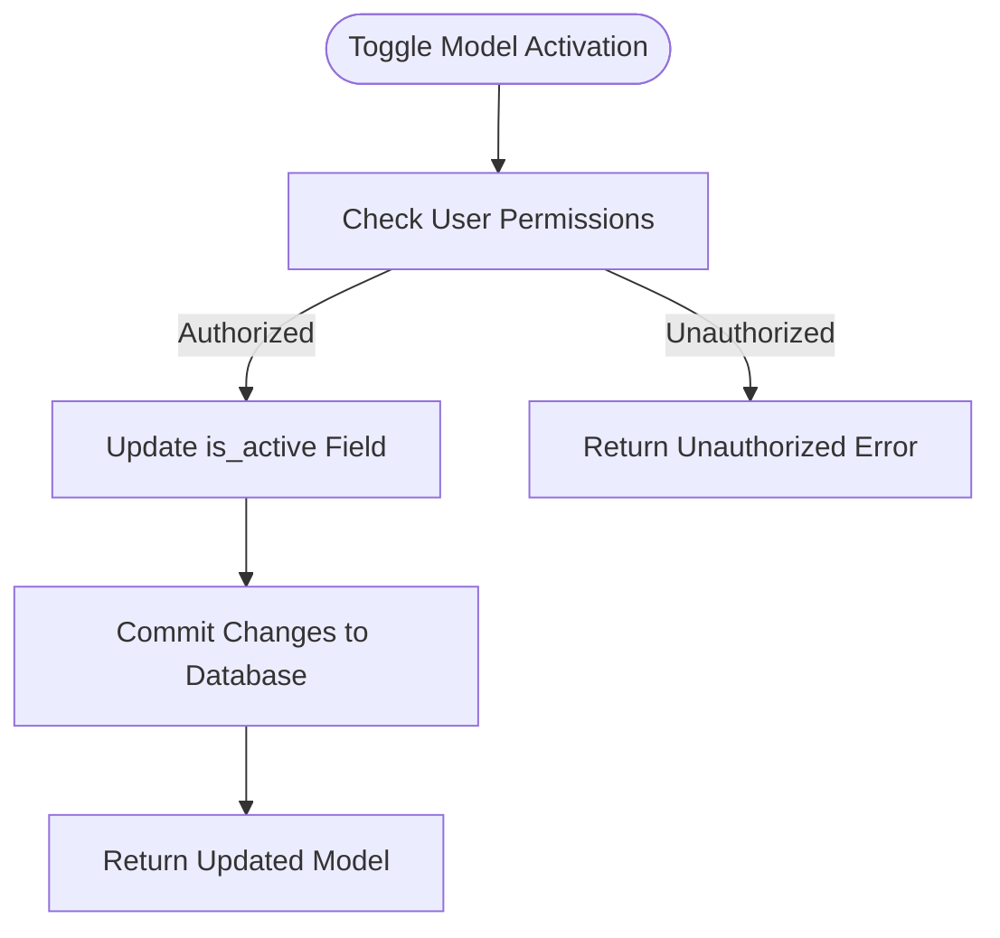
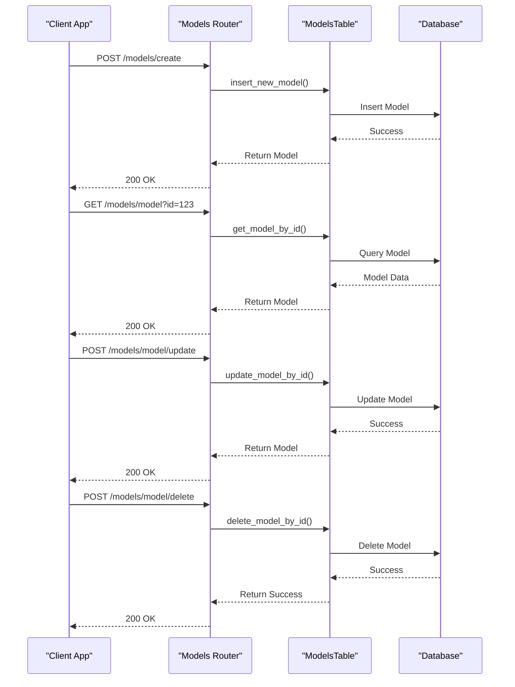
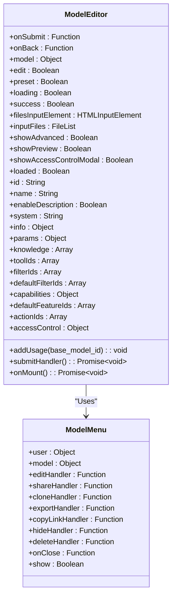
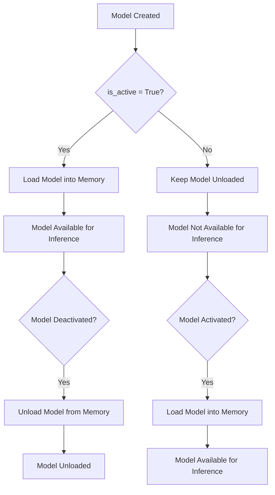
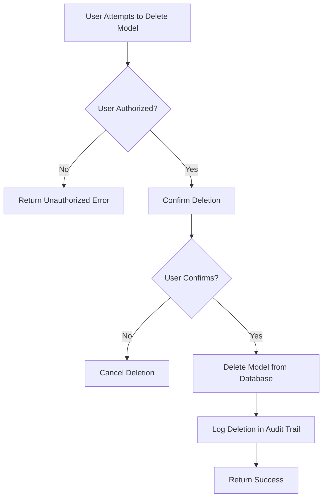
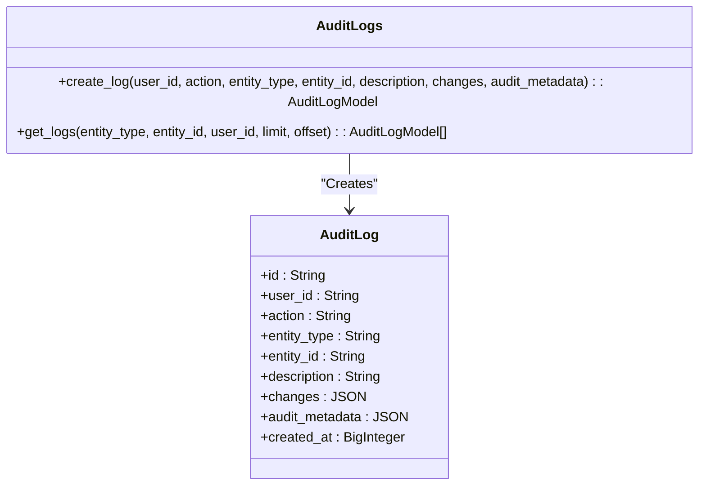

# Lifecycle Management

<cite>
**Referenced Files in This Document**   
- [models.py](file://backend/open_webui/models/models.py)
- [models.py](file://backend/open_webui/routers/models.py)
- [016_add_valves_and_is_active.py](file://backend/open_webui/internal/migrations/016_add_valves_and_is_active.py)
- [ModelEditor.svelte](file://src/lib/components/workspace/Models/ModelEditor.svelte)
- [ModelMenu.svelte](file://src/lib/components/workspace/Models/ModelMenu.svelte)
- [index.ts](file://src/lib/apis/models/index.ts)
- [audit.py](file://backend/open_webui/models/audit.py)
- [ollama.py](file://backend/open_webui/routers/ollama.py)
</cite>

## Table of Contents
1. [Introduction](#introduction)
2. [Model Activation and Deactivation](#model-activation-and-deactivation)
3. [CRUD Operations for Models](#crud-operations-for-models)
4. [UI Components for Model Management](#ui-components-for-model-management)
5. [Model Lifecycle States and System Performance](#model-lifecycle-states-and-system-performance)
6. [Common Issues and Recovery Strategies](#common-issues-and-recovery-strategies)
7. [Audit Trail and Compliance](#audit-trail-and-compliance)
8. [Conclusion](#conclusion)

## Introduction
Model Lifecycle Management is a critical aspect of the Open WebUI system, enabling administrators and users to control the availability, configuration, and usage of AI models. This document provides a comprehensive overview of the implementation of model lifecycle management, focusing on the `is_active` field, CRUD operations, UI components, performance implications, and compliance considerations. The system allows for fine-grained control over model availability, ensuring that only authorized users can access and modify models, while maintaining a robust audit trail for compliance purposes.

**Section sources**
- [models.py](file://backend/open_webui/models/models.py#L1-L461)

## Model Activation and Deactivation
The `is_active` field in the Model table is a Boolean value that determines whether a model is available for use. When a model is created, the `is_active` field is set to `True` by default, making the model immediately available. Administrators and users with appropriate permissions can toggle the `is_active` field to activate or deactivate a model. This operation is performed through the `toggle_model_by_id` method in the `ModelsTable` class, which updates the `is_active` field and the `updated_at` timestamp in the database. The method ensures that only authorized users can perform this action by checking the user's role and access control permissions.

**Diagram sources**
- [models.py](file://backend/open_webui/models/models.py#L362-L377)
- [models.py](file://backend/open_webui/routers/models.py#L325-L348)

**Section sources**
- [models.py](file://backend/open_webui/models/models.py#L362-L377)
- [models.py](file://backend/open_webui/routers/models.py#L325-L348)

## CRUD Operations for Models
The system supports full CRUD (Create, Read, Update, Delete) operations for models, allowing users to manage their models effectively. The `ModelsTable` class provides methods for each operation, ensuring that only authorized users can perform these actions. The `insert_new_model` method creates a new model, the `get_model_by_id` method retrieves a model by its ID, the `update_model_by_id` method updates an existing model, and the `delete_model_by_id` method deletes a model. These methods are exposed through API endpoints in the `models.py` router, which handle authentication and authorization.

**Diagram sources**
- [models.py](file://backend/open_webui/models/models.py#L153-L413)
- [models.py](file://backend/open_webui/routers/models.py#L130-L417)

**Section sources**
- [models.py](file://backend/open_webui/models/models.py#L153-L413)
- [models.py](file://backend/open_webui/routers/models.py#L130-L417)

## UI Components for Model Management
The frontend of the Open WebUI system includes several components for managing models, such as the `ModelEditor` and `ModelMenu` components. The `ModelEditor` component allows users to create and edit models, providing a form for entering model details such as name, description, and parameters. The `ModelMenu` component provides a dropdown menu for performing actions on a model, such as editing, cloning, and deleting. These components are implemented using Svelte and interact with the backend through API calls defined in the `index.ts` file.

**Diagram sources**
- [ModelEditor.svelte](file://src/lib/components/workspace/Models/ModelEditor.svelte#L1-L800)
- [ModelMenu.svelte](file://src/lib/components/workspace/Models/ModelMenu.svelte#L1-L190)

**Section sources**
- [ModelEditor.svelte](file://src/lib/components/workspace/Models/ModelEditor.svelte#L1-L800)
- [ModelMenu.svelte](file://src/lib/components/workspace/Models/ModelMenu.svelte#L1-L190)

## Model Lifecycle States and System Performance
The lifecycle states of models, particularly their activation status, have a direct impact on system performance. When a model is activated, it is loaded into memory and made available for inference, which can consume significant resources. Conversely, when a model is deactivated, it is unloaded from memory, freeing up resources for other models or processes. The system uses the `unload_model` endpoint in the `ollama.py` router to unload models from memory, ensuring that only active models consume resources. This approach optimizes system performance by minimizing resource usage when models are not in use.

**Diagram sources**
- [models.py](file://backend/open_webui/models/models.py#L101-L104)
- [ollama.py](file://backend/open_webui/routers/ollama.py#L634-L697)

**Section sources**
- [models.py](file://backend/open_webui/models/models.py#L101-L104)
- [ollama.py](file://backend/open_webui/routers/ollama.py#L634-L697)

## Common Issues and Recovery Strategies
One common issue in model lifecycle management is the accidental deletion of models. To mitigate this risk, the system includes safeguards such as requiring user confirmation before deletion and maintaining a backup of model data. Additionally, the system logs all model-related actions in the audit trail, allowing administrators to track changes and recover from accidental deletions. The `delete_model_by_id` method in the `ModelsTable` class ensures that only authorized users can delete models, and the `delete_all_models` method is restricted to administrators, preventing accidental mass deletions.

**Diagram sources**
- [models.py](file://backend/open_webui/models/models.py#L395-L403)
- [audit.py](file://backend/open_webui/models/audit.py#L86-L115)

**Section sources**
- [models.py](file://backend/open_webui/models/models.py#L395-L403)
- [audit.py](file://backend/open_webui/models/audit.py#L86-L115)

## Audit Trail and Compliance
The system maintains a comprehensive audit trail for all model-related actions, ensuring compliance with regulatory requirements. The `AuditLog` class in the `audit.py` file defines the structure of audit log entries, which include details such as the user ID, action performed, entity type, entity ID, and timestamp. The `create_log` method in the `AuditLogs` class is used to create audit log entries whenever a model-related action is performed. These logs are stored in the `billing_audit_log` table and can be queried for compliance audits.

**Diagram sources**
- [audit.py](file://backend/open_webui/models/audit.py#L34-L136)

**Section sources**
- [audit.py](file://backend/open_webui/models/audit.py#L34-L136)

## Conclusion
Model Lifecycle Management in the Open WebUI system is a robust and secure process that ensures the availability, performance, and compliance of AI models. The `is_active` field provides a simple yet effective mechanism for controlling model availability, while the CRUD operations and UI components enable users to manage their models effectively. The system's performance is optimized by loading and unloading models based on their activation status, and the audit trail ensures compliance with regulatory requirements. By following the best practices outlined in this document, administrators and users can ensure that their models are managed securely and efficiently.