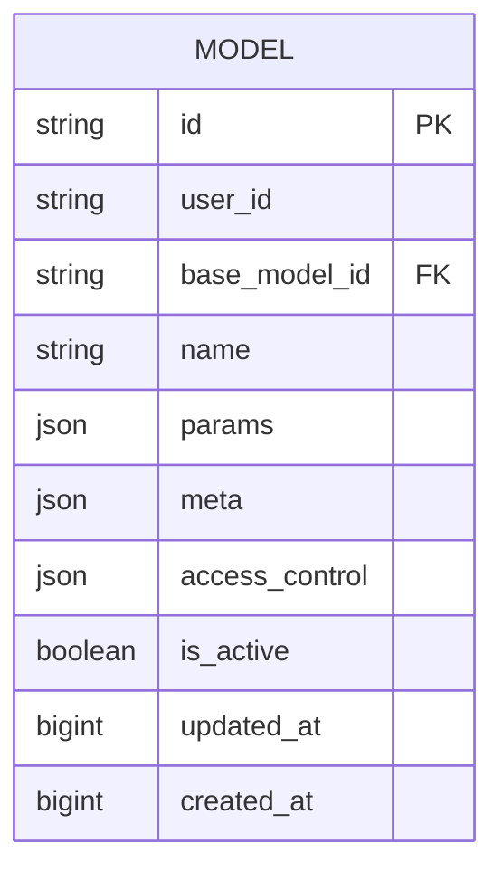
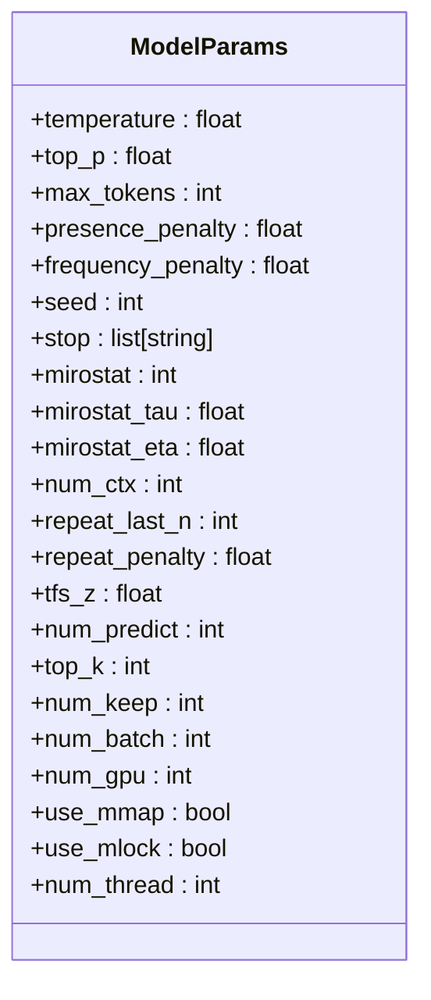
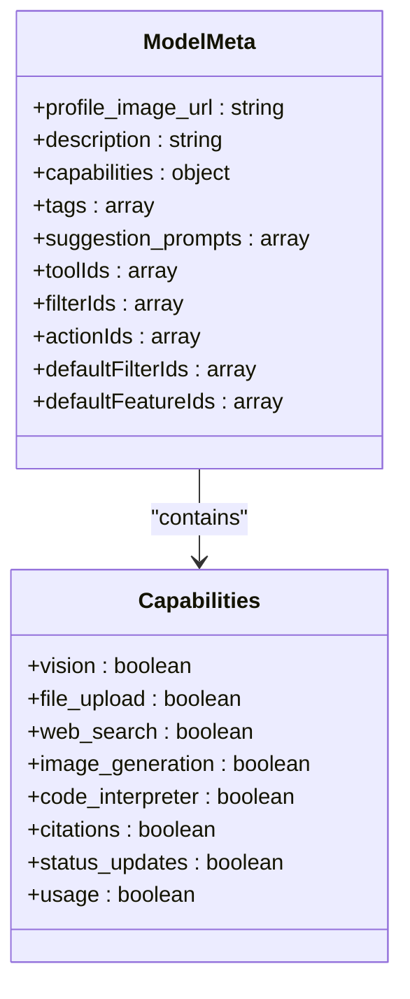
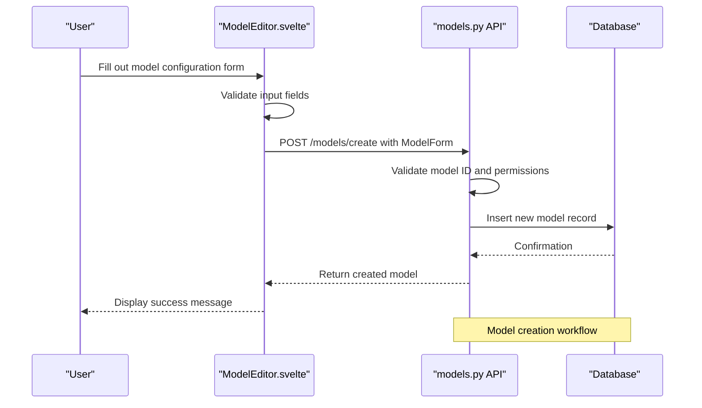
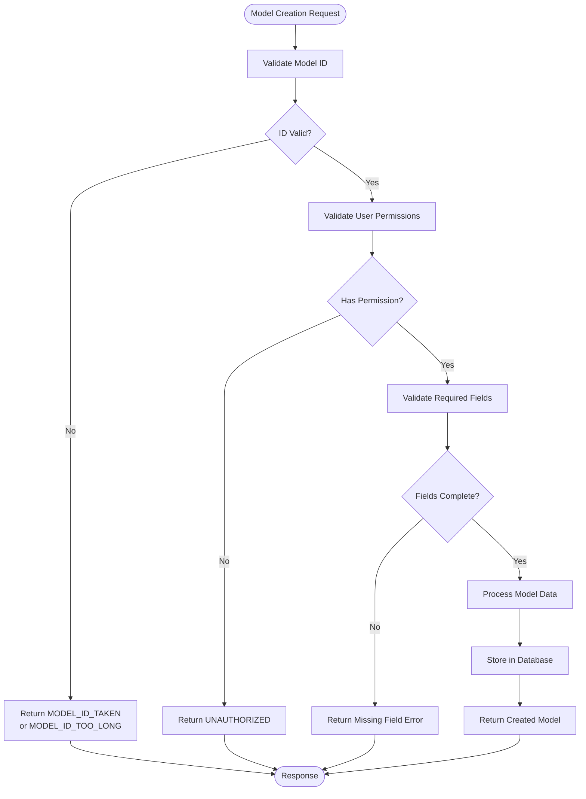

# Model Configuration

<cite>
**Referenced Files in This Document**   
- [models.py](file://backend/open_webui/models/models.py)
- [models.py](file://backend/open_webui/routers/models.py)
- [index.ts](file://src/lib/apis/models/index.ts)
- [ModelEditor.svelte](file://src/lib/components/workspace/Models/ModelEditor.svelte)
- [misc.py](file://backend/open_webui/utils/misc.py)
</cite>

## Table of Contents
1. [Introduction](#introduction)
2. [Model Entity Structure](#model-entity-structure)
3. [Parameter Customization](#parameter-customization)
4. [Metadata Definition](#metadata-definition)
5. [Frontend-Backend Integration](#frontend-backend-integration)
6. [Validation and Error Handling](#validation-and-error-handling)
7. [Performance Considerations](#performance-considerations)
8. [Troubleshooting Guide](#troubleshooting-guide)

## Introduction

The Model Configuration feature in Open WebUI enables users to create and customize AI models with specific parameters and metadata. This system allows for the definition of model behavior through configurable parameters such as temperature, top_p, and max_tokens, while also supporting rich metadata for model identification and organization. The configuration system bridges the frontend user interface with backend storage and validation mechanisms, providing a comprehensive solution for model management.

## Model Entity Structure

The Model entity is structured with several key fields that define its behavior and characteristics. The core components include the `params` and `meta` JSON fields, which store configuration options and descriptive information respectively.

**Diagram sources**
- [models.py](file://backend/open_webui/models/models.py#L55-L104)

**Section sources**
- [models.py](file://backend/open_webui/models/models.py#L33-L123)

## Parameter Customization

The `params` field in the Model entity contains a JSON blob of parameters that control the AI model's behavior during inference. These parameters are defined by the `ModelParams` Pydantic model and can include various configuration options.

### Supported Parameters

The system supports a comprehensive set of parameters for model configuration, including:

- **temperature**: Controls randomness in output (higher values = more random)
- **top_p**: Controls diversity via nucleus sampling
- **max_tokens**: Limits the maximum number of tokens in the response
- **presence_penalty**: Penalizes new tokens based on whether they appear in the text so far
- **frequency_penalty**: Penalizes new tokens based on their existing frequency in the text
- **seed**: Sets the random seed for reproducible outputs
- **stop**: Specifies stop sequences where the model should end generation

**Diagram sources**
- [models.py](file://backend/open_webui/models/models.py#L34-L36)
- [misc.py](file://backend/open_webui/utils/misc.py#L431-L453)

**Section sources**
- [models.py](file://backend/open_webui/models/models.py#L34-L36)
- [misc.py](file://backend/open_webui/utils/misc.py#L431-L474)

## Metadata Definition

The `meta` field in the Model entity contains metadata that provides additional information about the model. This includes both user-facing information and system-level capabilities.

### Meta Field Structure

The metadata structure is defined by the `ModelMeta` Pydantic model and includes the following properties:

- **profile_image_url**: URL or data URI for the model's profile image
- **description**: User-facing description of the model's purpose and capabilities
- **capabilities**: Object defining the model's supported features
- **tags**: Array of tags for categorization and filtering
- **suggestion_prompts**: Custom prompts that appear as suggestions to users
- **toolIds**: Array of tool IDs that the model can access
- **filterIds**: Array of filter IDs that can be applied to the model
- **actionIds**: Array of action IDs that the model can trigger

**Diagram sources**
- [models.py](file://backend/open_webui/models/models.py#L39-L52)
- [ModelEditor.svelte](file://src/lib/components/workspace/Models/ModelEditor.svelte#L95-L104)

**Section sources**
- [models.py](file://backend/open_webui/models/models.py#L39-L52)
- [ModelEditor.svelte](file://src/lib/components/workspace/Models/ModelEditor.svelte#L74-L207)

## Frontend-Backend Integration

The model configuration system integrates the frontend user interface with backend API endpoints through a well-defined workflow. Users interact with the ModelEditor component, which communicates with the backend models API.

**Diagram sources**
- [ModelEditor.svelte](file://src/lib/components/workspace/Models/ModelEditor.svelte#L123-L221)
- [models.py](file://backend/open_webui/routers/models.py#L130-L166)

**Section sources**
- [ModelEditor.svelte](file://src/lib/components/workspace/Models/ModelEditor.svelte#L1-L844)
- [models.py](file://backend/open_webui/routers/models.py#L130-L166)
- [index.ts](file://src/lib/apis/models/index.ts#L152-L179)

## Validation and Error Handling

The model configuration system implements comprehensive validation to ensure data integrity and prevent common configuration issues.

### Validation Rules

- **Model ID**: Must be unique and not exceed 256 characters
- **Required fields**: ID and name are required for model creation
- **Access control**: Users must have appropriate permissions to create or modify models
- **Parameter types**: Parameters are validated according to their expected types
- **JSON structure**: All JSON fields must have valid structure

### Error Conditions

Common error conditions include:
- **MODEL_ID_TAKEN**: Attempting to create a model with an existing ID
- **MODEL_ID_TOO_LONG**: Model ID exceeds maximum length
- **UNAUTHORIZED**: User lacks required permissions
- **NOT_FOUND**: Requested model does not exist
- **ACCESS_PROHIBITED**: User cannot modify the specified model

**Diagram sources**
- [models.py](file://backend/open_webui/routers/models.py#L144-L155)
- [models.py](file://backend/open_webui/routers/models.py#L365-L380)

**Section sources**
- [models.py](file://backend/open_webui/routers/models.py#L144-L166)
- [models.py](file://backend/open_webui/routers/models.py#L365-L383)

## Performance Considerations

When configuring models with complex parameter sets, several performance considerations should be taken into account:

- **Parameter complexity**: Excessive parameters can increase processing overhead
- **Validation overhead**: Complex validation rules can impact API response times
- **Database queries**: Large metadata objects can affect query performance
- **Memory usage**: Models with extensive configuration consume more memory
- **Serialization costs**: Converting between JSON and Python objects has computational costs

The system is designed to handle these considerations through:
- Efficient database indexing on frequently queried fields
- Caching of frequently accessed model configurations
- Streamlined validation processes
- Proper database schema design with appropriate field types

**Section sources**
- [models.py](file://backend/open_webui/models/models.py#L74-L80)
- [models.py](file://backend/open_webui/routers/models.py#L268-L352)

## Troubleshooting Guide

This section addresses common configuration issues and provides guidance for resolution.

### Common Configuration Issues

**Invalid Parameter Formats**
- Ensure numeric parameters (temperature, top_p) are valid numbers
- Verify array parameters (stop sequences) are properly formatted
- Check that boolean parameters use correct true/false values

**Missing Required Fields**
- Always provide both ID and name when creating a model
- Ensure the base_model_id is valid if specified
- Include required capabilities for the intended use case

**Permission Errors**
- Verify user has appropriate role (admin) or permissions
- Check access control settings for the model
- Ensure the user has write access to modify existing models

**Integration Issues**
- Confirm API endpoints are properly configured
- Verify authentication tokens are valid
- Check network connectivity between frontend and backend

The system provides descriptive error messages to help identify and resolve configuration issues. When encountering problems, review the specific error message and validate that all configuration parameters meet the required specifications.

**Section sources**
- [models.py](file://backend/open_webui/routers/models.py#L136-L142)
- [models.py](file://backend/open_webui/routers/models.py#L372-L380)
- [models.py](file://backend/open_webui/models/models.py#L143-L151)