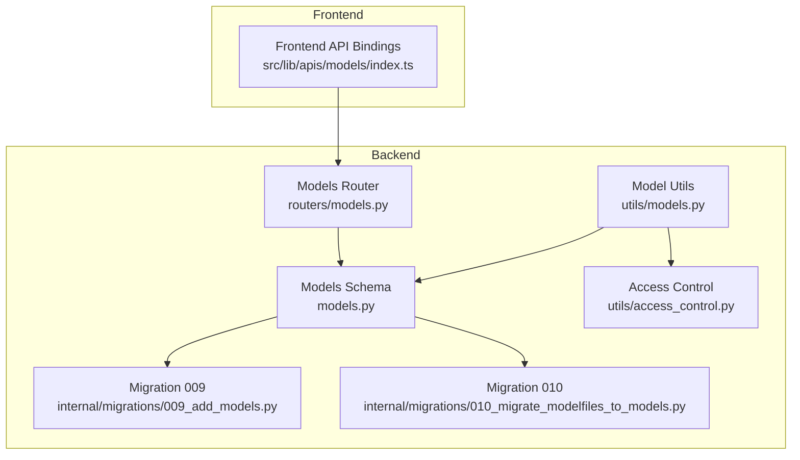
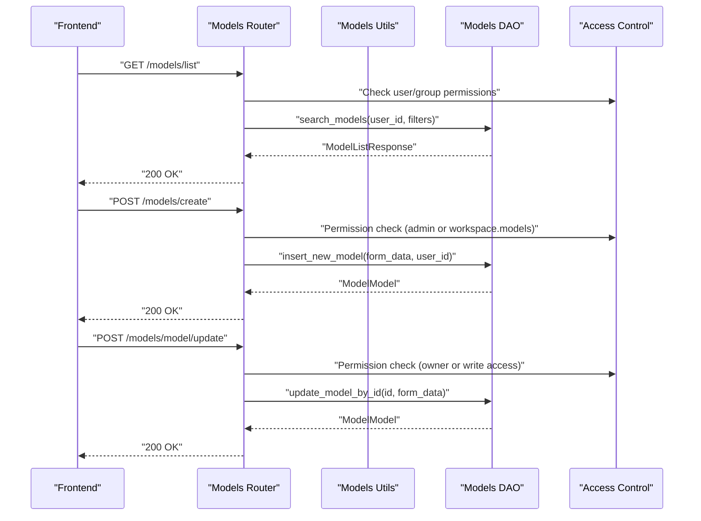
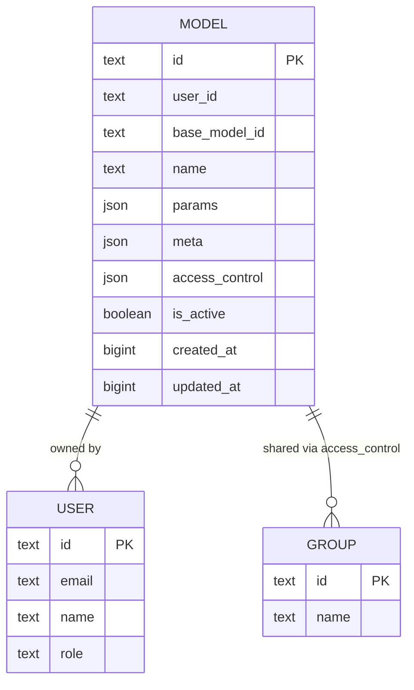
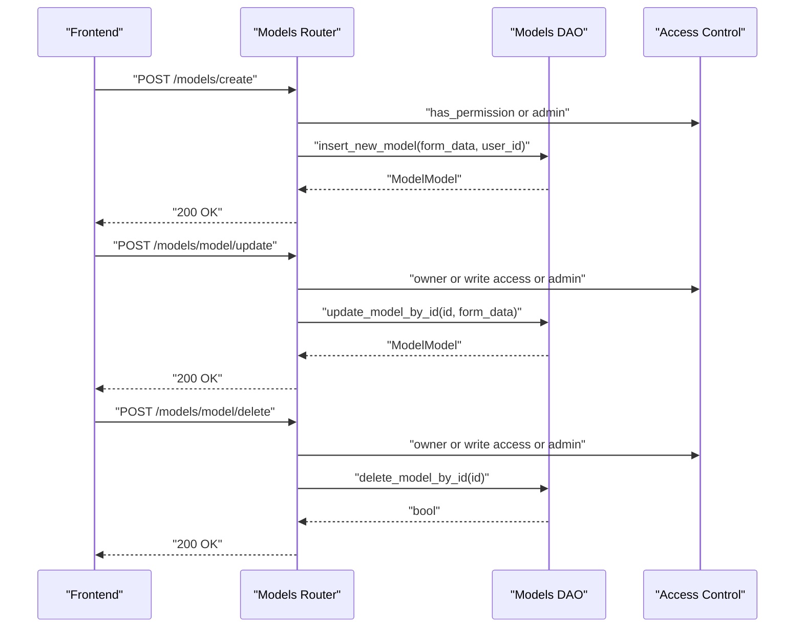
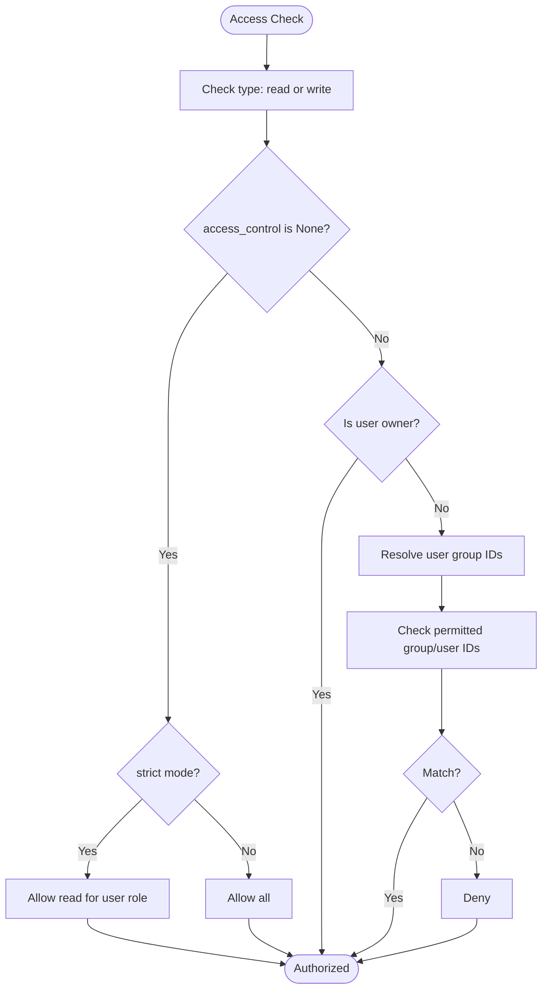
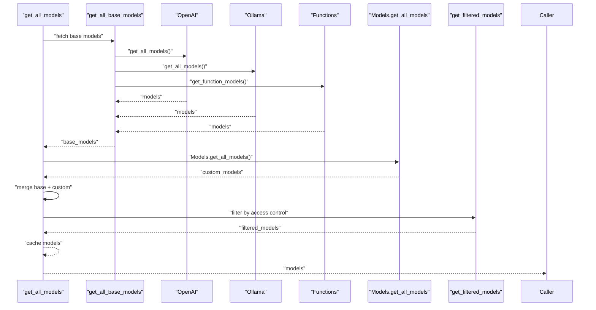
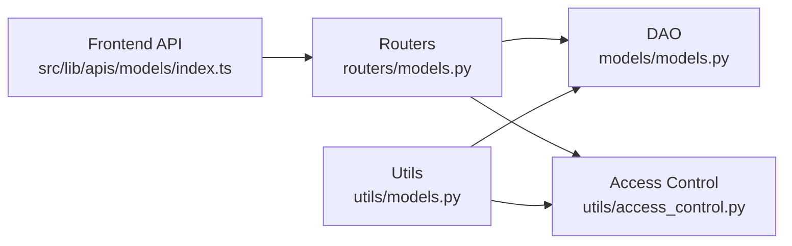

# Model Management

<cite>
**Referenced Files in This Document**
- [backend/open_webui/models/models.py](file://backend/open_webui/models/models.py)
- [backend/open_webui/routers/models.py](file://backend/open_webui/routers/models.py)
- [backend/open_webui/utils/models.py](file://backend/open_webui/utils/models.py)
- [backend/open_webui/utils/access_control.py](file://backend/open_webui/utils/access_control.py)
- [backend/open_webui/internal/migrations/009_add_models.py](file://backend/open_webui/internal/migrations/009_add_models.py)
- [backend/open_webui/internal/migrations/010_migrate_modelfiles_to_models.py](file://backend/open_webui/internal/migrations/010_migrate_modelfiles_to_models.py)
- [src/lib/apis/models/index.ts](file://src/lib/apis/models/index.ts)
</cite>

## Table of Contents
1. [Introduction](#introduction)
2. [Project Structure](#project-structure)
3. [Core Components](#core-components)
4. [Architecture Overview](#architecture-overview)
5. [Detailed Component Analysis](#detailed-component-analysis)
6. [Dependency Analysis](#dependency-analysis)
7. [Performance Considerations](#performance-considerations)
8. [Troubleshooting Guide](#troubleshooting-guide)
9. [Conclusion](#conclusion)
10. [Appendices](#appendices)

## Introduction
This document describes the Model Management system responsible for AI model configuration and organization. It covers how models are created, updated, and deleted through the API, how model metadata is structured (including parameters, access control, and tagging), and how model activation/deactivation works. It also explains admin-level model management, practical examples for custom model configuration, and the data model relationships to users and groups. Finally, it addresses common permission-related issues and provides performance guidance for model loading and discovery.

## Project Structure
The Model Management system spans backend models, routers, utilities, and frontend APIs:

- Backend models define the schema and persistence logic for models.
- Routers expose REST endpoints for CRUD operations, toggling, listing, and importing/exporting.
- Utilities handle model discovery, merging custom models with base providers, and access filtering.
- Frontend API bindings wrap the backend endpoints for the UI.

**Diagram sources**
- [backend/open_webui/models/models.py](file://backend/open_webui/models/models.py#L55-L123)
- [backend/open_webui/routers/models.py](file://backend/open_webui/routers/models.py#L1-L120)
- [backend/open_webui/utils/models.py](file://backend/open_webui/utils/models.py#L82-L120)
- [backend/open_webui/utils/access_control.py](file://backend/open_webui/utils/access_control.py#L124-L175)
- [backend/open_webui/internal/migrations/009_add_models.py](file://backend/open_webui/internal/migrations/009_add_models.py#L40-L56)
- [backend/open_webui/internal/migrations/010_migrate_modelfiles_to_models.py](file://backend/open_webui/internal/migrations/010_migrate_modelfiles_to_models.py#L48-L82)
- [src/lib/apis/models/index.ts](file://src/lib/apis/models/index.ts#L1-L120)

**Section sources**
- [backend/open_webui/models/models.py](file://backend/open_webui/models/models.py#L55-L123)
- [backend/open_webui/routers/models.py](file://backend/open_webui/routers/models.py#L1-L120)
- [backend/open_webui/utils/models.py](file://backend/open_webui/utils/models.py#L82-L120)
- [src/lib/apis/models/index.ts](file://src/lib/apis/models/index.ts#L1-L120)

## Core Components
- Model schema and persistence: defines the model table, Pydantic models for forms and responses, and DAO methods for CRUD and search.
- Router endpoints: expose list, create, update, delete, toggle, export/import, and tag discovery.
- Model discovery and filtering: merges base provider models with custom models, applies access control, and caches results.
- Access control utilities: evaluate read/write permissions for users and groups.

Key responsibilities:
- Store model identity, ownership, base model linkage, human-friendly name, parameters, metadata, access control, and timestamps.
- Enforce permissions for read/write operations and admin-only actions.
- Provide model discovery and filtering for UI and downstream services.

**Section sources**
- [backend/open_webui/models/models.py](file://backend/open_webui/models/models.py#L55-L123)
- [backend/open_webui/routers/models.py](file://backend/open_webui/routers/models.py#L120-L210)
- [backend/open_webui/utils/models.py](file://backend/open_webui/utils/models.py#L341-L402)
- [backend/open_webui/utils/access_control.py](file://backend/open_webui/utils/access_control.py#L124-L175)

## Architecture Overview
The system integrates frontend API calls with backend routers, models, and utilities. Access control is enforced at both router and utility layers. Model discovery aggregates base provider models and custom models, applying access control and filtering.

**Diagram sources**
- [backend/open_webui/routers/models.py](file://backend/open_webui/routers/models.py#L51-L120)
- [backend/open_webui/routers/models.py](file://backend/open_webui/routers/models.py#L129-L166)
- [backend/open_webui/routers/models.py](file://backend/open_webui/routers/models.py#L355-L384)
- [backend/open_webui/models/models.py](file://backend/open_webui/models/models.py#L153-L205)
- [backend/open_webui/utils/access_control.py](file://backend/open_webui/utils/access_control.py#L124-L175)

## Detailed Component Analysis

### Data Model and Metadata Structure
The model entity stores:
- Identity: id, base_model_id, name
- Ownership and lifecycle: user_id, created_at, updated_at
- Behavior: is_active
- Configuration: params (JSON), meta (JSON)
- Access control: access_control (JSON)

Metadata structure supports:
- Profile image URL
- Description
- Capabilities
- Additional fields via extra="allow" in Pydantic models

**Diagram sources**
- [backend/open_webui/models/models.py](file://backend/open_webui/models/models.py#L55-L123)

**Section sources**
- [backend/open_webui/models/models.py](file://backend/open_webui/models/models.py#L33-L53)
- [backend/open_webui/models/models.py](file://backend/open_webui/models/models.py#L55-L123)

### API Operations: Creation, Update, Deletion, Activation/Deactivation
- Create model: POST /models/create validates ID uniqueness and length, checks permissions, and persists the model.
- Update model: POST /models/model/update requires write access or ownership/admin role.
- Delete model: POST /models/model/delete requires write access or ownership/admin role.
- Toggle activation: POST /models/model/toggle flips is_active and updates timestamps.
- List models: GET /models/list supports filtering by query, view option, tag, ordering, and pagination.
- Base models: GET /models/base returns admin-restricted base models.
- Tags: GET /models/tags aggregates tags from model metadata.
- Import/Export: POST /models/import and GET /models/export manage bulk operations.

**Diagram sources**
- [backend/open_webui/routers/models.py](file://backend/open_webui/routers/models.py#L129-L166)
- [backend/open_webui/routers/models.py](file://backend/open_webui/routers/models.py#L355-L411)
- [backend/open_webui/models/models.py](file://backend/open_webui/models/models.py#L379-L404)

**Section sources**
- [backend/open_webui/routers/models.py](file://backend/open_webui/routers/models.py#L51-L120)
- [backend/open_webui/routers/models.py](file://backend/open_webui/routers/models.py#L129-L166)
- [backend/open_webui/routers/models.py](file://backend/open_webui/routers/models.py#L264-L322)
- [backend/open_webui/routers/models.py](file://backend/open_webui/routers/models.py#L355-L411)
- [backend/open_webui/models/models.py](file://backend/open_webui/models/models.py#L153-L205)

### Access Control and Admin Management
- Access control rules:
  - None: public read access for users with role "user".
  - {}: private access restricted to owner.
  - Custom: specify group_ids and user_ids for read/write.
- Permission checks:
  - Router enforces read/write checks against access_control and ownership.
  - Admin bypass controlled by configuration flags.
- Admin endpoints:
  - Base model listing requires admin.
  - Bulk delete endpoint requires admin.
  - Import/export require admin or specific permissions.

**Diagram sources**
- [backend/open_webui/utils/access_control.py](file://backend/open_webui/utils/access_control.py#L124-L175)
- [backend/open_webui/routers/models.py](file://backend/open_webui/routers/models.py#L264-L322)
- [backend/open_webui/routers/models.py](file://backend/open_webui/routers/models.py#L355-L411)

**Section sources**
- [backend/open_webui/utils/access_control.py](file://backend/open_webui/utils/access_control.py#L124-L175)
- [backend/open_webui/routers/models.py](file://backend/open_webui/routers/models.py#L81-L120)
- [backend/open_webui/routers/models.py](file://backend/open_webui/routers/models.py#L129-L166)

### Model Discovery and Filtering
- Base models are fetched from OpenAI and Ollama providers and function modules.
- Custom models are merged into the base list:
  - If base_model_id is None, treat as a base override and update name/info.
  - Otherwise, create a preset model entry with inherited properties.
- Access control filtering ensures only accessible models are returned.
- Results are cached in RedisDict or memory for performance.

**Diagram sources**
- [backend/open_webui/utils/models.py](file://backend/open_webui/utils/models.py#L62-L120)
- [backend/open_webui/utils/models.py](file://backend/open_webui/utils/models.py#L151-L244)
- [backend/open_webui/utils/models.py](file://backend/open_webui/utils/models.py#L341-L402)

**Section sources**
- [backend/open_webui/utils/models.py](file://backend/open_webui/utils/models.py#L62-L120)
- [backend/open_webui/utils/models.py](file://backend/open_webui/utils/models.py#L151-L244)
- [backend/open_webui/utils/models.py](file://backend/open_webui/utils/models.py#L341-L402)

### Practical Examples

- Create a custom model configuration:
  - Use POST /models/create with a ModelForm payload containing id, base_model_id, name, meta, params, access_control, and is_active.
  - Example path: [POST /models/create](file://backend/open_webui/routers/models.py#L129-L166)

- Update model parameters:
  - Use POST /models/model/update with a ModelForm payload including id and updated fields.
  - Example path: [POST /models/model/update](file://backend/open_webui/routers/models.py#L355-L384)

- Manage model visibility:
  - Toggle activation via POST /models/model/toggle.
  - Example path: [POST /models/model/toggle](file://backend/open_webui/routers/models.py#L325-L353)

- List and filter models:
  - GET /models/list with query, view_option, tag, order_by, direction, page.
  - Example path: [GET /models/list](file://backend/open_webui/routers/models.py#L51-L89)

- Import/export models:
  - Import via POST /models/import with a list of model objects.
  - Export via GET /models/export.
  - Example paths: [POST /models/import](file://backend/open_webui/routers/models.py#L198-L241), [GET /models/export](file://backend/open_webui/routers/models.py#L173-L187)

**Section sources**
- [backend/open_webui/routers/models.py](file://backend/open_webui/routers/models.py#L51-L120)
- [backend/open_webui/routers/models.py](file://backend/open_webui/routers/models.py#L129-L166)
- [backend/open_webui/routers/models.py](file://backend/open_webui/routers/models.py#L173-L241)
- [backend/open_webui/routers/models.py](file://backend/open_webui/routers/models.py#L325-L384)

### Data Model Evolution
- Initial model table migration adds id, user_id, base_model_id, name, meta, params, created_at, updated_at.
- Migration from modelfiles to models transforms legacy modelfiles into the new model schema, preserving descriptions, images, suggestions, categories, and Ollama modelfile content.

**Section sources**
- [backend/open_webui/internal/migrations/009_add_models.py](file://backend/open_webui/internal/migrations/009_add_models.py#L40-L56)
- [backend/open_webui/internal/migrations/010_migrate_modelfiles_to_models.py](file://backend/open_webui/internal/migrations/010_migrate_modelfiles_to_models.py#L48-L82)

## Dependency Analysis
- Router depends on Models DAO for persistence and access_control for permission checks.
- Model discovery utility depends on provider routers (OpenAI/Ollama), function modules, and Models DAO.
- Frontend API bindings call router endpoints.

**Diagram sources**
- [src/lib/apis/models/index.ts](file://src/lib/apis/models/index.ts#L1-L120)
- [backend/open_webui/routers/models.py](file://backend/open_webui/routers/models.py#L1-L120)
- [backend/open_webui/models/models.py](file://backend/open_webui/models/models.py#L153-L205)
- [backend/open_webui/utils/access_control.py](file://backend/open_webui/utils/access_control.py#L124-L175)
- [backend/open_webui/utils/models.py](file://backend/open_webui/utils/models.py#L82-L120)

**Section sources**
- [src/lib/apis/models/index.ts](file://src/lib/apis/models/index.ts#L1-L120)
- [backend/open_webui/routers/models.py](file://backend/open_webui/routers/models.py#L1-L120)
- [backend/open_webui/models/models.py](file://backend/open_webui/models/models.py#L153-L205)
- [backend/open_webui/utils/access_control.py](file://backend/open_webui/utils/access_control.py#L124-L175)
- [backend/open_webui/utils/models.py](file://backend/open_webui/utils/models.py#L82-L120)

## Performance Considerations
- Model caching:
  - Base models and merged models are cached in RedisDict or memory to reduce repeated provider calls and DB reads.
  - Example path: [get_all_models caching](file://backend/open_webui/utils/models.py#L332-L338)
- Access control filtering:
  - Filtering by access control and tags is performed in-memory after fetching base/custom models; consider indexing meta JSON fields if tags become large.
- Pagination and ordering:
  - Listing supports pagination and ordering; ensure appropriate indexes exist for frequently ordered fields.
- Tag discovery:
  - Aggregates tags from model metadata; consider precomputing tags or adding a dedicated tag table for scalability.

[No sources needed since this section provides general guidance]

## Troubleshooting Guide
Common issues and resolutions:
- Permission errors when accessing models:
  - Ensure the user has write access or owns the model; admin role may bypass depending on configuration.
  - Verify access_control rules include the user or group IDs.
  - Example path: [Access checks](file://backend/open_webui/routers/models.py#L264-L322), [Access control logic](file://backend/open_webui/utils/access_control.py#L124-L175)
- Model not found:
  - Confirm model id exists and is active; check base_model_id mapping for custom models.
  - Example path: [Model not found handling](file://backend/open_webui/routers/models.py#L264-L284)
- Import/Export failures:
  - Validate payload structure and model id validity; ensure admin or required permissions.
  - Example path: [Import/export](file://backend/open_webui/routers/models.py#L173-L241)
- Tag filtering inefficiency:
  - Tag search uses text-like matching on meta; consider optimizing with a dedicated tag table or indexing.
  - Example path: [Tag search](file://backend/open_webui/models/models.py#L300-L306)

**Section sources**
- [backend/open_webui/routers/models.py](file://backend/open_webui/routers/models.py#L264-L322)
- [backend/open_webui/utils/access_control.py](file://backend/open_webui/utils/access_control.py#L124-L175)
- [backend/open_webui/models/models.py](file://backend/open_webui/models/models.py#L300-L306)

## Conclusion
The Model Management system provides a robust foundation for organizing AI models with flexible metadata, strong access control, and efficient discovery. It supports admin-level operations, user-driven customization, and integration with provider ecosystems. By leveraging caching, careful permission enforcement, and scalable tag handling, the system can accommodate growing model catalogs while maintaining performance and security.

[No sources needed since this section summarizes without analyzing specific files]

## Appendices

### API Reference Summary
- GET /models/list: List models with filters and pagination.
- GET /models/base: Admin-only base models.
- GET /models/tags: Aggregate tags from model metadata.
- POST /models/create: Create a new model.
- GET /models/model: Get model by id with access checks.
- GET /models/model/profile/image: Serve model profile image.
- POST /models/model/toggle: Toggle model activation.
- POST /models/model/update: Update model fields.
- POST /models/model/delete: Delete a model.
- POST /models/import: Import models.
- GET /models/export: Export models.
- DELETE /models/delete/all: Admin-only delete all.

**Section sources**
- [backend/open_webui/routers/models.py](file://backend/open_webui/routers/models.py#L51-L120)
- [backend/open_webui/routers/models.py](file://backend/open_webui/routers/models.py#L129-L166)
- [backend/open_webui/routers/models.py](file://backend/open_webui/routers/models.py#L173-L241)
- [backend/open_webui/routers/models.py](file://backend/open_webui/routers/models.py#L264-L322)
- [backend/open_webui/routers/models.py](file://backend/open_webui/routers/models.py#L355-L411)