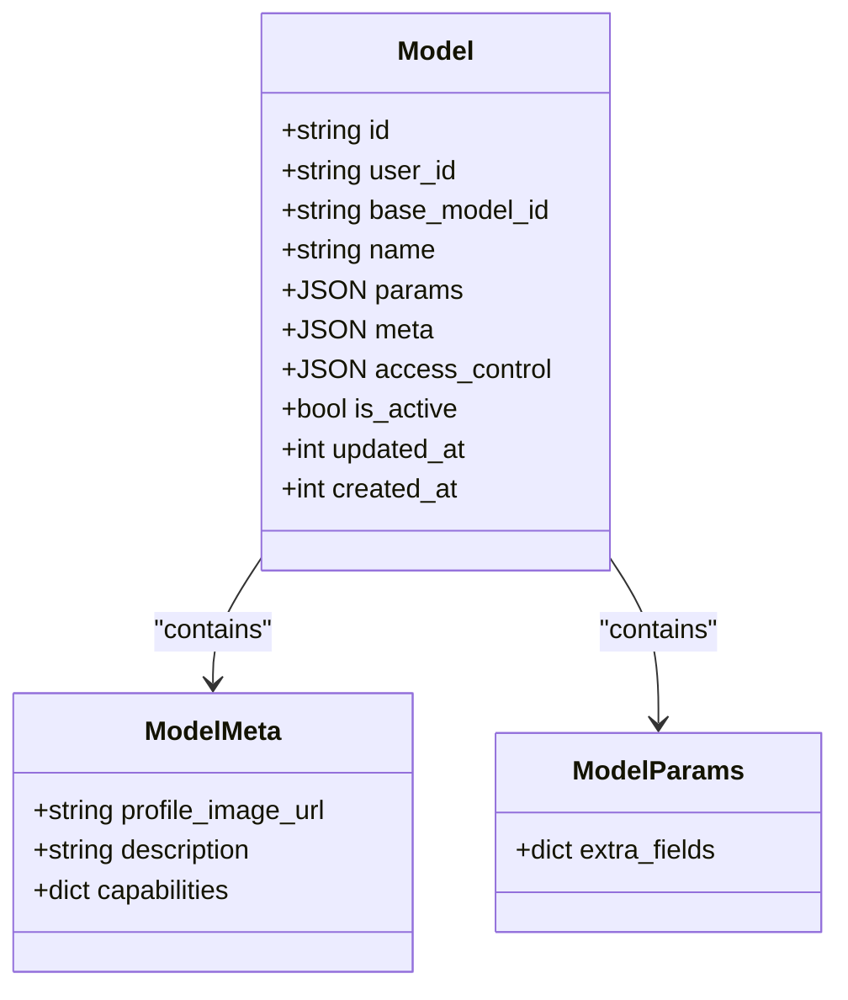
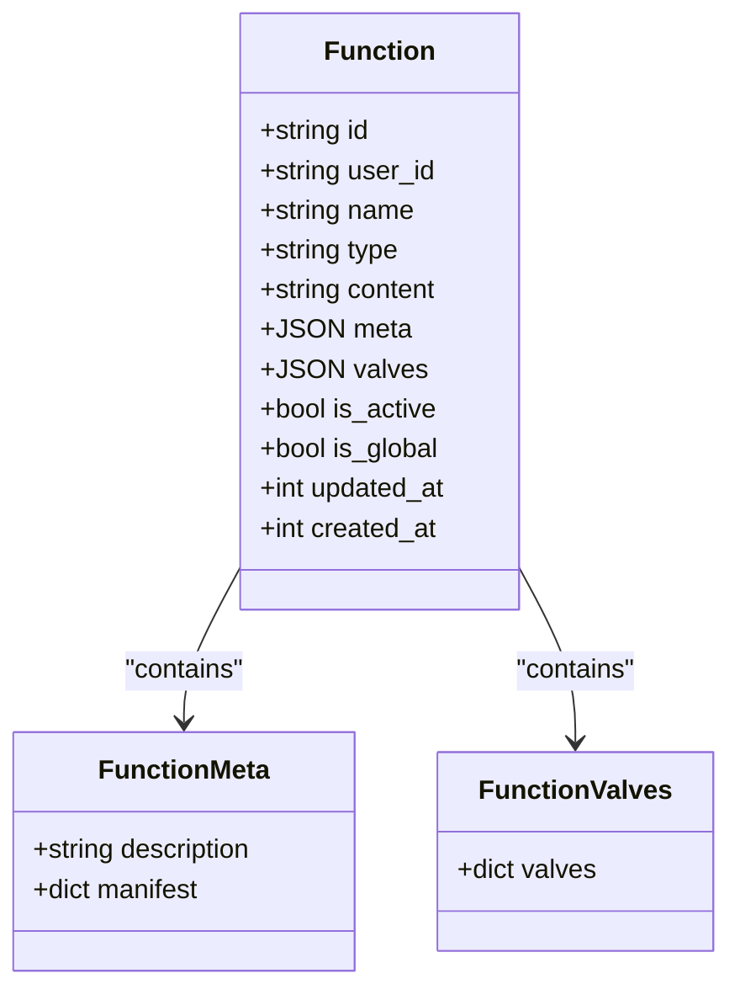
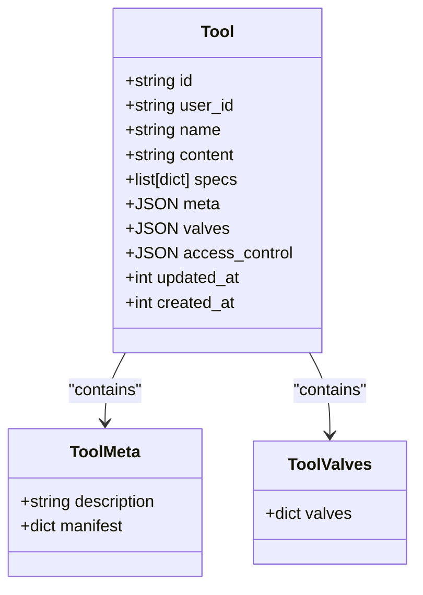
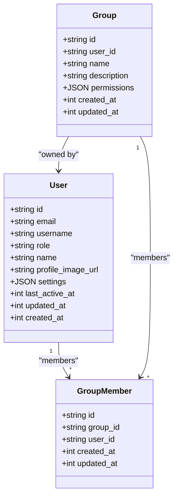
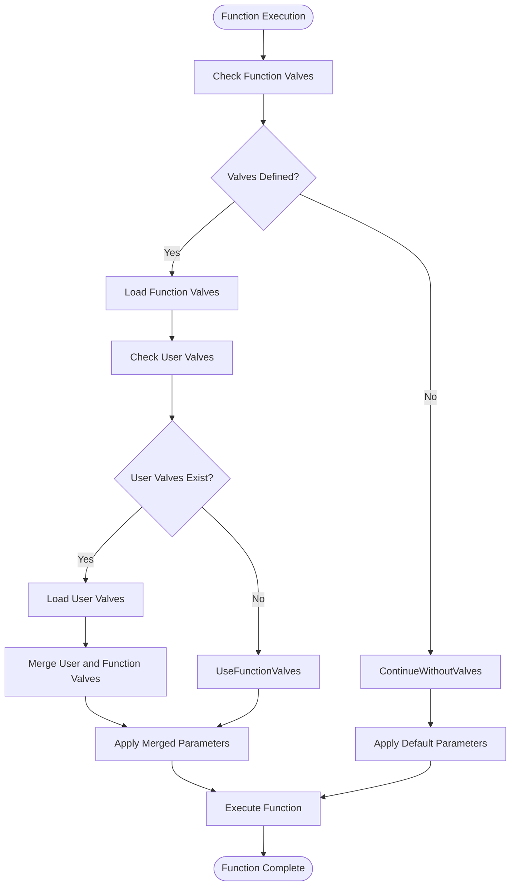
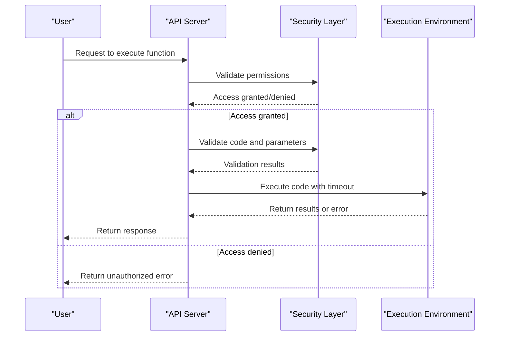
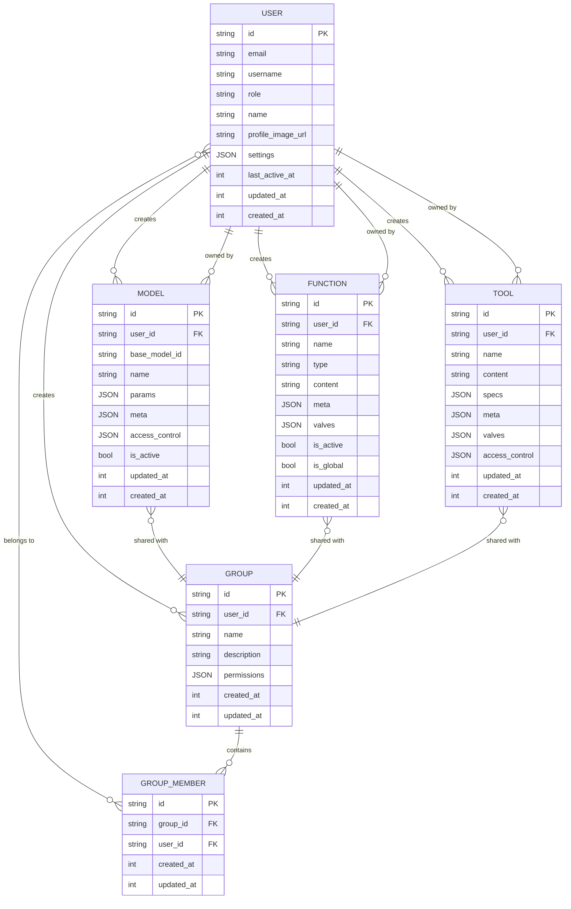

# AI Model, Function, and Tool Data Model

<cite>
**Referenced Files in This Document**   
- [models.py](file://backend/open_webui/models/models.py)
- [functions.py](file://backend/open_webui/models/functions.py)
- [tools.py](file://backend/open_webui/models/tools.py)
- [users.py](file://backend/open_webui/models/users.py)
- [groups.py](file://backend/open_webui/models/groups.py)
- [access_control.py](file://backend/open_webui/utils/access_control.py)
- [plugin.py](file://backend/open_webui/utils/plugin.py)
</cite>

## Table of Contents
1. [Introduction](#introduction)
2. [Model Entity](#model-entity)
3. [Function Entity](#function-entity)
4. [Tool Entity](#tool-entity)
5. [User and Group Relationships](#user-and-group-relationships)
6. [Valves System](#valves-system)
7. [Security Considerations](#security-considerations)
8. [Schema Diagram](#schema-diagram)
9. [Sample Data](#sample-data)
10. [Conclusion](#conclusion)

## Introduction
The Open WebUI application provides a comprehensive framework for managing AI models, functions, and tools within a collaborative environment. This document details the data model for these core entities, including their fields, relationships, and configuration options. The system supports user ownership, group-based sharing, parameter customization through the valves system, and feature toggling via the is_active flag. Understanding these data models is essential for administrators and developers who need to configure and extend the platform's capabilities.

## Model Entity

The Model entity represents AI models that can be used within the Open WebUI application. Each model has a unique identifier and is associated with a user who created it. The model configuration includes various parameters that define its behavior and appearance.

**Model Fields:**
- **id**: Unique identifier for the model, used in API calls
- **user_id**: Identifier of the user who created the model
- **base_model_id**: Optional pointer to the actual model for proxying requests
- **name**: Human-readable display name of the model
- **params**: JSON blob containing model parameters (ModelParams)
- **meta**: JSON blob containing metadata (ModelMeta)
- **access_control**: Defines access control rules for the model
- **is_active**: Boolean flag for feature toggling
- **updated_at**: Timestamp of last update (epoch)
- **created_at**: Timestamp of creation (epoch)

The ModelMeta class includes additional metadata fields:
- **profile_image_url**: URL for the model's profile image
- **description**: User-facing description of the model
- **capabilities**: Dictionary defining model capabilities

The access_control field implements a flexible permission system:
- `None`: Public access for all users with "user" role
- `{}`: Private access, restricted to the owner
- Custom permissions: Specific access control with group and user-level restrictions



**Diagram sources**
- [models.py](file://backend/open_webui/models/models.py#L55-L84)

**Section sources**
- [models.py](file://backend/open_webui/models/models.py#L55-L84)

## Function Entity

The Function entity represents executable code modules that can be used to extend the functionality of the Open WebUI application. Functions are typically Python scripts that implement specific behaviors such as filters, actions, or pipes.

**Function Fields:**
- **id**: Unique identifier for the function
- **user_id**: Identifier of the user who created the function
- **name**: Display name of the function
- **type**: Type of function (filter, action, pipe)
- **content**: The actual code of the function
- **meta**: JSON blob containing metadata (FunctionMeta)
- **valves**: JSON blob for parameter overrides
- **is_active**: Boolean flag indicating if the function is active
- **is_global**: Boolean flag indicating if the function is globally available
- **updated_at**: Timestamp of last update (epoch)
- **created_at**: Timestamp of creation (epoch)

The FunctionMeta class includes:
- **description**: User-facing description of the function
- **manifest**: Dictionary containing function manifest information

Functions can be of different types:
- **Filter**: Processes input before it reaches the model
- **Action**: Performs actions in response to events
- **Pipe**: Transforms data in a pipeline

The system supports both global and user-specific functions. Global functions are available to all users, while user-specific functions are only available to their creators (unless shared).



**Diagram sources**
- [functions.py](file://backend/open_webui/models/functions.py#L19-L34)

**Section sources**
- [functions.py](file://backend/open_webui/models/functions.py#L19-L34)

## Tool Entity

The Tool entity represents external services or APIs that can be integrated into the Open WebUI application. Tools allow users to connect to various external systems and leverage their capabilities within the platform.

**Tool Fields:**
- **id**: Unique identifier for the tool
- **user_id**: Identifier of the user who created the tool
- **name**: Display name of the tool
- **content**: Code or configuration for the tool
- **specs**: List of dictionaries defining tool specifications
- **meta**: JSON blob containing metadata (ToolMeta)
- **valves**: JSON blob for parameter overrides
- **access_control**: Defines access control rules for the tool
- **updated_at**: Timestamp of last update (epoch)
- **created_at**: Timestamp of creation (epoch)

The ToolMeta class includes:
- **description**: User-facing description of the tool
- **manifest**: Dictionary containing tool manifest information

Tools can be loaded from external sources such as GitHub repositories. The system supports OAuth 2.1 authentication for tools that require it. When a tool requires OAuth authentication, the system manages session tokens for secure access.

The specs field contains the OpenAPI specification for the tool's API endpoints, allowing the system to understand and interact with the tool's capabilities.



**Diagram sources**
- [tools.py](file://backend/open_webui/models/tools.py#L24-L54)

**Section sources**
- [tools.py](file://backend/open_webui/models/tools.py#L24-L54)

## User and Group Relationships

The Open WebUI application implements a sophisticated access control system that allows for fine-grained sharing of models, functions, and tools between users and groups. This system enables collaboration while maintaining appropriate security boundaries.

**User Entity:**
The User entity represents individuals who use the application. Key fields include:
- **id**: Unique identifier
- **email**: User's email address
- **username**: Optional username
- **role**: User role (admin, user, pending)
- **name**: Display name
- **profile_image_url**: URL for profile image
- **settings**: JSON blob containing user preferences

**Group Entity:**
Groups are collections of users that can be used for sharing resources. Key aspects:
- Groups have a name and description
- Users can be members of multiple groups
- Groups can have permissions that apply to all members
- Resources can be shared with specific groups

The access control system works as follows:
- Resources can be public (accessible to all users)
- Resources can be private (accessible only to the owner)
- Resources can have custom permissions specifying which users and groups can read or write

The has_access function in the access_control utility determines whether a user has permission to access a resource based on:
1. The user's ID
2. The type of access requested (read or write)
3. The resource's access_control configuration
4. The user's group memberships



**Diagram sources**
- [users.py](file://backend/open_webui/models/users.py#L45-L76)
- [groups.py](file://backend/open_webui/models/groups.py#L36-L84)

**Section sources**
- [users.py](file://backend/open_webui/models/users.py#L45-L76)
- [groups.py](file://backend/open_webui/models/groups.py#L36-L84)

## Valves System

The valves system is a powerful feature that allows for parameter overrides at different levels of the application. This system enables administrators and users to customize the behavior of functions and tools without modifying their core code.

**Valves Implementation:**
- **Function Valves**: Allow administrators to set default parameters for functions
- **User Valves**: Allow individual users to override parameters for functions and tools
- **Tool Valves**: Allow administrators to set default parameters for tools

The valves system works by storing parameter overrides in JSON format in the respective valves fields of functions and tools. When a function or tool is executed, the system merges the default parameters with any applicable overrides.

For functions, the system first checks for function-level valves (set by administrators), then checks for user-level valves (set by individual users). This allows for a hierarchy of configuration where user preferences can override system defaults.

The valves are defined in the code using Pydantic models. For example, a function might define a Valves class that specifies the available parameters and their types, defaults, and validation rules.



**Diagram sources**
- [functions.py](file://backend/open_webui/models/functions.py#L28-L29)
- [tools.py](file://backend/open_webui/models/tools.py#L33-L34)

**Section sources**
- [functions.py](file://backend/open_webui/models/functions.py#L28-L29)
- [tools.py](file://backend/open_webui/models/tools.py#L33-L34)

## Security Considerations

The Open WebUI application implements several security measures to protect against potential risks associated with code execution and API access.

**Code Execution Security:**
- Functions and tools are executed in isolated environments
- The code_interpreter.py module handles code execution with timeout protection
- Jupyter kernels are used for code execution with controlled resource access
- Code is executed with limited privileges to prevent system-level access

**API Access Security:**
- OAuth 2.1 authentication is supported for external tools
- API keys can be used for authentication
- Session tokens are managed securely
- Access to external APIs is controlled through the access_control system

**Input Validation:**
- Function and tool IDs are validated to contain only alphanumeric characters and underscores
- Model IDs are validated for length and format
- User input is sanitized before being used in code execution
- JSON payloads are validated against schemas

**Access Control:**
- The has_access function enforces permission checks
- Users can only modify resources they own or have write access to
- Admin users have elevated privileges but can be restricted by configuration
- Group-based permissions enable collaborative sharing with controlled access

**Additional Security Measures:**
- Code is loaded from temporary files that are deleted after use
- Import statements in functions and tools are replaced to prevent unauthorized imports
- Requirements specified in frontmatter are installed in isolated environments
- Error messages are sanitized to prevent information leakage



**Diagram sources**
- [code_interpreter.py](file://backend/open_webui/utils/code_interpreter.py#L100-L211)
- [access_control.py](file://backend/open_webui/utils/access_control.py#L124-L150)

**Section sources**
- [code_interpreter.py](file://backend/open_webui/utils/code_interpreter.py#L100-L211)
- [access_control.py](file://backend/open_webui/utils/access_control.py#L124-L150)

## Schema Diagram

The following entity relationship diagram illustrates how Models, Functions, and Tools are configured and accessed within the Open WebUI application, showing their relationships with Users and Groups.



**Diagram sources**
- [models.py](file://backend/open_webui/models/models.py#L55-L84)
- [functions.py](file://backend/open_webui/models/functions.py#L19-L34)
- [tools.py](file://backend/open_webui/models/tools.py#L24-L54)
- [users.py](file://backend/open_webui/models/users.py#L45-L76)
- [groups.py](file://backend/open_webui/models/groups.py#L36-L84)

## Sample Data

### Custom Model Configuration
```json
{
  "id": "custom-gpt-4",
  "user_id": "user123",
  "base_model_id": "gpt-4",
  "name": "Custom GPT-4 Configuration",
  "params": {
    "temperature": 0.7,
    "max_tokens": 2000,
    "top_p": 0.9,
    "frequency_penalty": 0.0,
    "presence_penalty": 0.0
  },
  "meta": {
    "profile_image_url": "/static/custom-model.png",
    "description": "A customized version of GPT-4 with adjusted parameters for creative writing",
    "capabilities": {
      "text_generation": true,
      "code_generation": false,
      "image_generation": false
    },
    "tags": [
      {"name": "creative"},
      {"name": "writing"}
    ]
  },
  "access_control": {
    "read": {
      "group_ids": ["group456"],
      "user_ids": ["user789"]
    },
    "write": {
      "group_ids": ["group456"],
      "user_ids": ["user789"]
    }
  },
  "is_active": true,
  "updated_at": 1703123456,
  "created_at": 1703123456
}
```

### Function Definition
```python
# Function ID: web_search
# Function type: action

"""manifest
{
    "name": "Web Search",
    "description": "Search the web for information",
    "parameters": {
        "type": "object",
        "properties": {
            "query": {
                "type": "string",
                "description": "The search query"
            }
        },
        "required": ["query"]
    }
}
"""

class Valves:
    def __init__(self):
        self.search_engine: str = "google"
        self.max_results: int = 5
        self.api_key: str = ""

class Action:
    def __init__(self, user):
        pass

    async def action(self, body, __user__, __task__):
        query = body["input"]
        # Implementation of web search functionality
        # would go here
        return f"Searching web for: {query}"
```

## Conclusion
The Open WebUI application provides a robust data model for managing AI models, functions, and tools with comprehensive support for user ownership, group sharing, parameter customization, and security controls. The Model, Function, and Tool entities each have well-defined fields that support their specific purposes, with common patterns for metadata, access control, and configuration. The valves system enables flexible parameter overrides at both system and user levels, while the is_active flag provides simple feature toggling. The security model protects against risks associated with code execution and API access through isolation, validation, and access control mechanisms. This comprehensive data model supports a collaborative environment where users can safely share and extend AI capabilities.