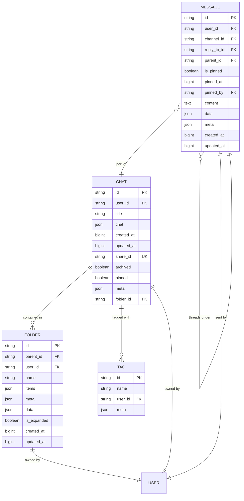

# Chat and Message Data Model

<cite>
**Referenced Files in This Document**   
- [chats.py](file://backend/open_webui/models/chats.py)
- [messages.py](file://backend/open_webui/models/messages.py)
- [folders.py](file://backend/open_webui/models/folders.py)
- [tags.py](file://backend/open_webui/models/tags.py)
- [004_add_archived.py](file://backend/open_webui/internal/migrations/004_add_archived.py)
- [005_add_updated_at.py](file://backend/open_webui/internal/migrations/005_add_updated_at.py)
- [242a2047eae0_update_chat_table.py](file://backend/open_webui/migrations/versions/242a2047eae0_update_chat_table.py)
- [3781e22d8b01_update_message_table.py](file://backend/open_webui/migrations/versions/3781e22d8b01_update_message_table.py)
- [a5c220713937_add_reply_to_id_column_to_message.py](file://backend/open_webui/migrations/versions/a5c220713937_add_reply_to_id_column_to_message.py)
- [018012973d35_add_indexes.py](file://backend/open_webui/migrations/versions/018012973d35_add_indexes.py)
- [7e5b5dc7342b_init.py](file://backend/open_webui/migrations/versions/7e5b5dc7342b_init.py)
</cite>

## Table of Contents
1. [Introduction](#introduction)
2. [Chat Entity](#chat-entity)
3. [Message Entity](#message-entity)
4. [Parent-Child Relationships](#parent-child-relationships)
5. [Foreign Key Constraints and Indexes](#foreign-key-constraints-and-indexes)
6. [Schema Diagram](#schema-diagram)
7. [Sample Conversation Data](#sample-conversation-data)
8. [Querying Patterns](#querying-patterns)
9. [Data Retention and Archival](#data-retention-and-archival)
10. [Performance Considerations](#performance-considerations)

## Introduction
This document provides comprehensive documentation for the Chat and Message entities in the open-webui application. The data model supports a conversational interface where users can create chats, exchange messages, organize conversations with folders and tags, and manage message threads. The model includes features for archiving, sharing, and searching conversations, with performance optimizations through indexing and efficient data retrieval patterns.

## Chat Entity
The Chat entity represents a conversation between a user and an AI assistant. Each chat contains metadata about the conversation and stores the message history in a structured format.

### Fields
- **id**: Unique identifier for the chat (String, primary key)
- **user_id**: Identifier of the user who owns the chat (String)
- **title**: Display title for the chat (Text)
- **chat**: JSON object containing the conversation history and metadata (JSON)
- **created_at**: Timestamp when the chat was created (BigInteger, epoch time)
- **updated_at**: Timestamp when the chat was last modified (BigInteger, epoch time)
- **share_id**: Unique identifier for shared chats (Text, nullable, unique)
- **archived**: Boolean flag indicating if the chat is archived (Boolean, default: False)
- **pinned**: Boolean flag indicating if the chat is pinned (Boolean, nullable, default: False)
- **meta**: JSON object for additional metadata (JSON, server_default: "{}")
- **folder_id**: Identifier of the folder containing the chat (Text, nullable)

### Metadata Structure
The chat entity's metadata includes:
- Model information used in the conversation
- Tags associated with the chat
- Custom metadata fields for extensibility

The `meta` field supports flexible storage of additional information without requiring schema changes.

**Section sources**
- [chats.py](file://backend/open_webui/models/chats.py#L26-L80)
- [7e5b5dc7342b_init.py](file://backend/open_webui/migrations/versions/7e5b5dc7342b_init.py#L41-L52)

## Message Entity
The Message entity represents individual messages within a chat conversation. Messages can be part of threaded discussions and support rich content with metadata.

### Fields
- **id**: Unique identifier for the message (Text, primary key)
- **user_id**: Identifier of the user who sent the message (Text)
- **channel_id**: Identifier of the channel containing the message (Text, nullable)
- **reply_to_id**: Identifier of the message being replied to (Text, nullable)
- **parent_id**: Identifier of the parent message in a thread (Text, nullable)
- **is_pinned**: Boolean flag indicating if the message is pinned (Boolean, default: False)
- **pinned_at**: Timestamp when the message was pinned (BigInteger, nullable)
- **pinned_by**: Identifier of the user who pinned the message (Text, nullable)
- **content**: Text content of the message (Text)
- **data**: JSON object for structured message data (JSON, nullable)
- **meta**: JSON object for additional metadata (JSON, nullable)
- **created_at**: Timestamp when the message was created (BigInteger, epoch time in nanoseconds)
- **updated_at**: Timestamp when the message was last modified (BigInteger, epoch time in nanoseconds)

### Message Relationships
Messages support two types of relationships:
- **Reply-to**: Direct replies to specific messages using the `reply_to_id` field
- **Thread hierarchy**: Parent-child relationships in message threads using the `parent_id` field

The entity also supports message reactions through the `message_reaction` table, which stores user reactions to messages.

**Section sources**
- [messages.py](file://backend/open_webui/models/messages.py#L41-L63)
- [3781e22d8b01_update_message_table.py](file://backend/open_webui/migrations/versions/3781e22d8b01_update_message_table.py#L29-L33)
- [a5c220713937_add_reply_to_id_column_to_message.py](file://backend/open_webui/migrations/versions/a5c220713937_add_reply_to_id_column_to_message.py#L23-L25)

## Parent-Child Relationships
The Chat and Message entities form a hierarchical relationship structure that enables organized conversations and threaded discussions.

### Chat-Message Relationship
Each Chat can contain multiple Messages, establishing a one-to-many relationship:
- One Chat → Many Messages
- Enforced through the `chat` JSON field in the Chat entity which contains message history
- Messages are stored within the Chat's `chat` JSON structure under the "history" key
- When a Chat is deleted, all associated Messages are automatically removed (cascade delete)

### Message Threading
Messages support nested threading through parent-child relationships:
- **Parent messages**: Top-level messages with `parent_id` set to null
- **Child messages**: Replies within a thread with `parent_id` referencing the parent message
- Threaded messages can also have `reply_to_id` to indicate which specific message they're replying to
- The `get_thread_replies_by_message_id` method retrieves all replies to a specific message

### Cascade Delete Behavior
When a parent entity is deleted, related child entities are automatically removed:
- Deleting a Chat removes all messages in its history
- Deleting a parent message removes all threaded replies (children)
- Deleting a message removes all associated reactions
- This behavior is implemented in the `delete_message_by_id` and `delete_chats_by_user_id` methods

**Section sources**
- [chats.py](file://backend/open_webui/models/chats.py#L231-L329)
- [messages.py](file://backend/open_webui/models/messages.py#L190-L218)
- [messages.py](file://backend/open_webui/models/messages.py#L445-L459)

## Foreign Key Constraints and Indexes
The data model includes foreign key relationships and database indexes to ensure data integrity and optimize query performance.

### Foreign Key Constraints
- **Chat to User**: `user_id` references the User entity
- **Message to User**: `user_id` references the User entity
- **Message to Channel**: `channel_id` references the Channel entity
- **Message to Parent Message**: `parent_id` references another Message entity
- **Message to Replied Message**: `reply_to_id` references another Message entity
- **Chat to Folder**: `folder_id` references the Folder entity

### Database Indexes
The following indexes are implemented to optimize common query patterns:

#### Chat Table Indexes
- **folder_id_idx**: Index on `folder_id` for fast folder-based queries
- **user_id_pinned_idx**: Composite index on `user_id` and `pinned` for retrieving pinned chats
- **user_id_archived_idx**: Composite index on `user_id` and `archived` for filtering archived chats
- **updated_at_user_id_idx**: Composite index on `updated_at` and `user_id` for chronological sorting
- **folder_id_user_id_idx**: Composite index on `folder_id` and `user_id` for folder membership queries

#### Message Table Indexes
- Indexes are created on commonly queried fields including `channel_id`, `parent_id`, and `user_id`
- The `message_reaction` table has indexes on `message_id` and `user_id` for efficient reaction lookups

These indexes support the application's primary use cases: retrieving chat lists, searching conversations, and loading message threads.

**Section sources**
- [chats.py](file://backend/open_webui/models/chats.py#L44-L56)
- [018012973d35_add_indexes.py](file://backend/open_webui/migrations/versions/018012973d35_add_indexes.py#L18-L24)
- [3781e22d8b01_update_message_table.py](file://backend/open_webui/migrations/versions/3781e22d8b01_update_message_table.py#L35-L50)

## Schema Diagram
The following diagram illustrates the relationships between Chat, Message, Folder, and Tag entities:



**Diagram sources**
- [chats.py](file://backend/open_webui/models/chats.py#L26-L43)
- [messages.py](file://backend/open_webui/models/messages.py#L42-L63)
- [folders.py](file://backend/open_webui/models/folders.py#L24-L35)
- [tags.py](file://backend/open_webui/models/tags.py#L20-L30)

## Sample Conversation Data
The following example demonstrates the structure of chat and message data in the open-webui application:

```json
{
  "id": "chat_123",
  "user_id": "user_456",
  "title": "Python Programming Help",
  "chat": {
    "title": "Python Programming Help",
    "model": "gpt-4",
    "prompt": "You are a helpful assistant...",
    "history": {
      "messages": {
        "msg_1": {
          "id": "msg_1",
          "role": "user",
          "content": "How do I create a class in Python?",
          "create_time": 1700000000,
          "update_time": 1700000000
        },
        "msg_2": {
          "id": "msg_2",
          "role": "assistant",
          "content": "To create a class in Python, use the `class` keyword...",
          "create_time": 1700000005,
          "update_time": 1700000005,
          "metadata": {
            "model": "gpt-4",
            "finish_reason": "stop"
          }
        },
        "msg_3": {
          "id": "msg_3",
          "role": "user",
          "content": "Thanks! Can you show me an example with inheritance?",
          "create_time": 1700000010,
          "update_time": 1700000010,
          "reply_to_id": "msg_2"
        },
        "msg_4": {
          "id": "msg_4",
          "role": "assistant",
          "content": "Certainly! Here's an example of class inheritance in Python...",
          "create_time": 1700000015,
          "update_time": 1700000015,
          "parent_id": "msg_3",
          "metadata": {
            "model": "gpt-4",
            "finish_reason": "stop"
          }
        }
      },
      "currentId": "msg_4"
    }
  },
  "created_at": 1700000000,
  "updated_at": 1700000015,
  "archived": false,
  "pinned": true,
  "meta": {
    "tags": ["python", "programming", "oop"],
    "model": "gpt-4"
  },
  "folder_id": "folder_789"
}
```

This example shows a chat with a threaded conversation where the third message replies to the assistant's response, and the fourth message continues the thread. The chat includes metadata with tags and model information, and is organized within a folder.

**Section sources**
- [chats.py](file://backend/open_webui/models/chats.py#L29-L33)
- [messages.py](file://backend/open_webui/models/messages.py#L43-L63)

## Querying Patterns
The data model supports various querying patterns for retrieving chat history and message data efficiently.

### Chat History Retrieval
To retrieve a user's chat list, the application uses:
- `get_chat_list_by_user_id`: Retrieves all non-archived chats for a user
- `get_chat_title_id_list_by_user_id`: Retrieves chat titles and IDs with sorting options
- `get_chats_by_user_id_and_search_text`: Full-text search across chat titles and content

These methods leverage the `updated_at_user_id_idx` index for chronological sorting and the `user_id_archived_idx` for filtering archived chats.

### Message Thread Queries
For retrieving message threads:
- `get_messages_by_channel_id`: Retrieves top-level messages in a channel
- `get_thread_replies_by_message_id`: Retrieves all replies to a specific message
- `get_messages_by_parent_id`: Retrieves messages in a thread with pagination

The `parent_id` field enables efficient retrieval of threaded conversations, while the `reply_to_id` field supports direct message replies.

### Search and Filtering
The application supports advanced search capabilities:
- Text search in chat titles and message content
- Filtering by tags using the `tag` table
- Filtering by folder membership
- Filtering by pinned and archived status
- Sorting by creation or update time

Search functionality is implemented in the `get_chats_by_user_id_and_search_text` method, which parses search queries containing filters like "tag:python" or "folder:work".

**Section sources**
- [chats.py](file://backend/open_webui/models/chats.py#L535-L573)
- [messages.py](file://backend/open_webui/models/messages.py#L227-L259)
- [chats.py](file://backend/open_webui/models/chats.py#L705-L774)

## Data Retention and Archival
The data model includes features for managing data retention and organizing conversations through archival.

### Archival System
The `archived` field (Boolean) implements a soft-delete pattern:
- When a chat is archived, `archived` is set to True
- Archived chats are hidden from the default chat list
- Users can view archived chats in a separate section
- Archiving a chat automatically removes its folder association
- The `toggle_chat_archive_by_id` method handles archive/unarchive operations

The archival system allows users to declutter their main chat list while preserving conversation history. Archived chats can be restored at any time.

### Data Retention Policies
The application implements the following data retention patterns:
- No automatic deletion of chats or messages
- Users can manually delete individual chats or all chats
- Deleted chats are permanently removed from the database
- Message reactions are deleted when their parent message is deleted
- Threaded replies are deleted when their parent message is deleted

Administrative functions allow bulk operations:
- `archive_all_chats_by_user_id`: Archives all chats for a user
- `unarchive_all_chats_by_user_id`: Restores all archived chats
- `delete_chats_by_user_id`: Permanently deletes all chats for a user

These operations ensure data consistency across related entities.

**Section sources**
- [chats.py](file://backend/open_webui/models/chats.py#L38-L39)
- [004_add_archived.py](file://backend/open_webui/internal/migrations/004_add_archived.py#L37-L40)
- [chats.py](file://backend/open_webui/models/chats.py#L473-L484)

## Performance Considerations
The data model includes several performance optimizations for handling large message threads and frequent data access.

### Large Message Thread Handling
For chats with extensive message histories:
- Messages are stored in a JSON structure within the Chat entity
- The `_clean_null_bytes` method sanitizes message content to prevent database errors
- Message updates use partial updates rather than replacing the entire chat history
- The `upsert_message_to_chat_by_id_and_message_id` method efficiently updates individual messages

### Database Optimization
The schema includes several performance-focused features:
- Composite indexes on frequently queried field combinations
- JSON field indexing for efficient metadata queries
- Proper timestamp indexing for chronological sorting
- Foreign key constraints with appropriate indexing
- Use of BigInteger for timestamps to support high precision

### Query Optimization
Recommended querying patterns include:
- Using indexed fields in WHERE clauses
- Limiting result sets with pagination
- Selecting only required fields rather than full entities
- Using EXISTS queries for relationship checks
- Batch operations for bulk updates

The application's repository methods are designed to minimize database round-trips and leverage the database's query optimization capabilities.

**Section sources**
- [chats.py](file://backend/open_webui/models/chats.py#L130-L143)
- [018012973d35_add_indexes.py](file://backend/open_webui/migrations/versions/018012973d35_add_indexes.py#L18-L24)
- [chats.py](file://backend/open_webui/models/chats.py#L167-L190)