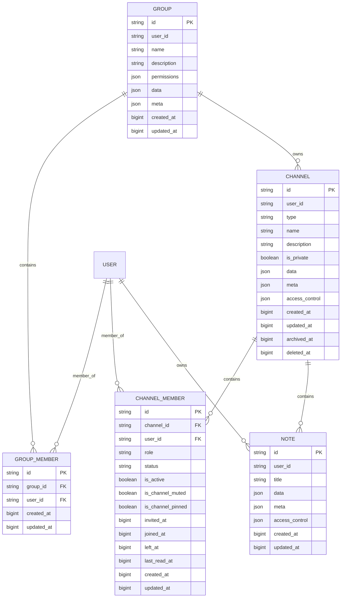
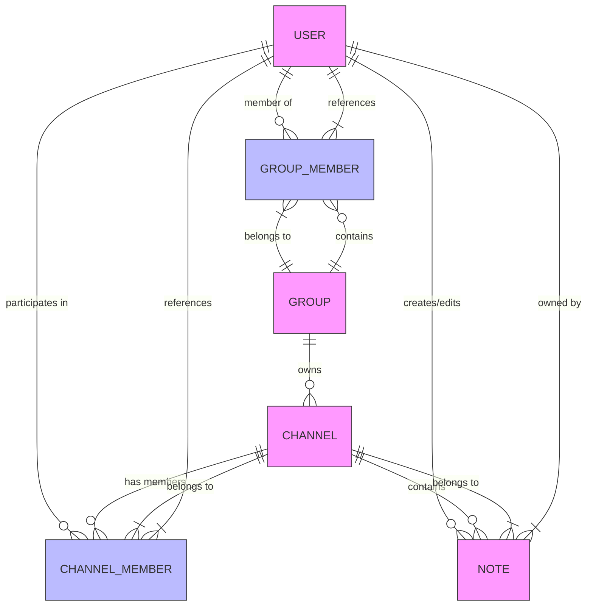

# Collaboration and Group Data Model

<cite>
**Referenced Files in This Document**   
- [groups.py](file://backend/open_webui/models/groups.py)
- [channels.py](file://backend/open_webui/models/channels.py)
- [notes.py](file://backend/open_webui/models/notes.py)
- [922e7a387820_add_group_table.py](file://backend/open_webui/migrations/versions/922e7a387820_add_group_table.py)
- [57c599a3cb57_add_channel_table.py](file://backend/open_webui/migrations/versions/57c599a3cb57_add_channel_table.py)
- [9f0c9cd09105_add_note_table.py](file://backend/open_webui/migrations/versions/9f0c9cd09105_add_note_table.py)
- [37f288994c47_add_group_member_table.py](file://backend/open_webui/migrations/versions/37f288994c47_add_group_member_table.py)
- [90ef40d4714e_update_channel_and_channel_members_table.py](file://backend/open_webui/migrations/versions/90ef40d4714e_update_channel_and_channel_members_table.py)
- [access_control.py](file://backend/open_webui/utils/access_control.py)
- [audit.py](file://backend/open_webui/models/audit.py)
</cite>

## Table of Contents
1. [Introduction](#introduction)
2. [Group Entity](#group-entity)
3. [Channel Entity](#channel-entity)
4. [Note Entity](#note-entity)
5. [Membership Model](#membership-model)
6. [Data Access Patterns](#data-access-patterns)
7. [Privacy Controls and Sharing Semantics](#privacy-controls-and-sharing-semantics)
8. [Audit Trails](#audit-trails)
9. [Sample Data Configuration](#sample-data-configuration)
10. [Schema Diagram](#schema-diagram)

## Introduction
The open-webui application implements a collaborative workspace model centered around three core entities: Group, Channel, and Note. These entities form a hierarchical structure that enables team-based collaboration with granular access control. The data model supports role-based access through membership tables and provides comprehensive privacy controls for shared content. This documentation details the structure, relationships, and access patterns for these entities, providing a comprehensive understanding of the collaboration framework.

## Group Entity
The Group entity serves as the foundational organizational unit in the open-webui application, representing a collection of users who share common access permissions and resources. Each group is identified by a unique ID and contains metadata including name, description, and creation timestamps. The group model includes a permissions field that stores JSON data defining the access rights and capabilities available to members of the group. Groups are created and managed by administrators, and users are added to groups through the group_member table, establishing the membership relationship. The group entity also tracks creation and update timestamps, enabling audit capabilities and providing temporal context for group activities.

**Section sources**
- [groups.py](file://backend/open_webui/models/groups.py#L36-L334)
- [922e7a387820_add_group_table.py](file://backend/open_webui/migrations/versions/922e7a387820_add_group_table.py#L18-L31)

## Channel Entity
The Channel entity represents a communication and collaboration space within the open-webui application, typically associated with a specific group or team. Channels are identified by a unique ID and contain essential metadata including name, description, and type (such as group or direct message). The channel model includes an is_private flag that indicates whether the channel is restricted to specific members or accessible more broadly. Additional fields track creation, update, archival, and deletion events, including timestamps and the user responsible for each action. Channels support access control through the access_control JSON field, which defines read and write permissions for specific users and groups. The channel entity also maintains relationships with users through the channel_member table, tracking membership status, roles, and interaction history.

**Section sources**
- [channels.py](file://backend/open_webui/models/channels.py#L22-L42)
- [57c599a3cb57_add_channel_table.py](file://backend/open_webui/migrations/versions/57c599a3cb57_add_channel_table.py#L18-L30)
- [90ef40d4714e_update_channel_and_channel_members_table.py](file://backend/open_webui/migrations/versions/90ef40d4714e_update_channel_and_channel_members_table.py#L23-L34)

## Note Entity
The Note entity represents a collaborative document or piece of content within the open-webui application, allowing users to create, edit, and share information. Each note is identified by a unique ID and contains a title and content stored in the data field as JSON. The note model includes metadata fields for creation and update timestamps, as well as an access_control field that defines the sharing permissions for the note. Notes are owned by a specific user, indicated by the user_id field, and can be shared with other users or groups according to the access control settings. The entity supports collaborative editing through real-time updates and maintains a history of changes, enabling version tracking and audit capabilities. Notes can be organized and retrieved based on user permissions, ensuring appropriate access to sensitive information.

**Section sources**
- [notes.py](file://backend/open_webui/models/notes.py#L23-L37)
- [9f0c9cd09105_add_note_table.py](file://backend/open_webui/migrations/versions/9f0c9cd09105_add_note_table.py#L18-L29)

## Membership Model
The membership model in open-webui implements role-based access control through dedicated membership tables for groups and channels. The group_member table establishes the relationship between users and groups, with each record containing a unique ID, group_id, user_id, and timestamps for creation and updates. This table uses foreign key constraints to ensure referential integrity and includes a unique constraint on the combination of group_id and user_id to prevent duplicate memberships. Similarly, the channel_member table manages channel memberships with additional fields for role, status, and interaction tracking such as last_read_at and invited_at. Both membership tables support soft deletion through status flags rather than physical record removal, preserving audit trails. The model enables hierarchical access where group membership can grant access to associated channels and notes, with specific permissions overriding broader group settings.

**Diagram sources**
- [groups.py](file://backend/open_webui/models/groups.py#L72-L84)
- [channels.py](file://backend/open_webui/models/channels.py#L80-L108)
- [notes.py](file://backend/open_webui/models/notes.py#L23-L37)

**Section sources**
- [groups.py](file://backend/open_webui/models/groups.py#L72-L334)
- [channels.py](file://backend/open_webui/models/channels.py#L80-L138)
- [37f288994c47_add_group_member_table.py](file://backend/open_webui/migrations/versions/37f288994c47_add_group_member_table.py#L27-L45)
- [90ef40d4714e_update_channel_and_channel_members_table.py](file://backend/open_webui/migrations/versions/90ef40d4714e_update_channel_and_channel_members_table.py#L36-L40)

## Data Access Patterns
The open-webui application implements sophisticated data access patterns for permission checking and real-time collaboration. Permission validation follows a hierarchical model where access is determined by user ownership, explicit permissions, and group membership. The has_access function in access_control.py evaluates whether a user can perform a specific action (read or write) on a resource by checking the user's ID against permitted users and the user's group IDs against permitted groups in the access_control JSON structure. For real-time collaboration, the system uses WebSocket events to synchronize changes across clients, with the socket layer emitting updates to all users with access to a specific note or channel. Data retrieval patterns include optimized queries that filter results based on user permissions, with methods like get_notes_by_permission streaming results to manage memory usage for large datasets. The access patterns also support temporal queries, allowing retrieval of data based on creation or update timestamps for audit and synchronization purposes.

**Section sources**
- [access_control.py](file://backend/open_webui/utils/access_control.py#L124-L150)
- [notes.py](file://backend/open_webui/models/notes.py#L131-L179)
- [channels.py](file://backend/open_webui/models/channels.py#L341-L377)

## Privacy Controls and Sharing Semantics
The open-webui application implements comprehensive privacy controls and sharing semantics through a flexible access control system. Privacy is managed at multiple levels: user-owned resources, group-shared content, and public/shared items. The access_control field in entities like Channel and Note contains a JSON structure that specifies permitted user IDs and group IDs for different permission types (read, write). When access_control is null, the system applies default sharing semantics where read access may be granted broadly while write access remains restricted. Users can share content publicly only if they have the appropriate permissions, as checked by the has_permission function against the user's role and group permissions. The system also implements privacy controls through channel visibility settings, where is_private channels restrict access to explicitly added members. Sharing semantics follow a principle of least privilege, where access is granted only to specified users and groups, and inherited permissions from group membership can be overridden by specific resource settings.

**Section sources**
- [access_control.py](file://backend/open_webui/utils/access_control.py#L108-L150)
- [channels.py](file://backend/open_webui/models/channels.py#L37-L38)
- [notes.py](file://backend/open_webui/routers/notes.py#L183-L193)

## Audit Trails
The open-webui application maintains comprehensive audit trails for collaborative editing and administrative actions through dedicated audit logging. The billing_audit_log table records significant events with fields for user_id (who performed the action), action type, entity_type and entity_id (what was affected), and detailed information about the changes made. Each audit log entry includes a timestamp for when the action occurred, enabling chronological tracking of modifications. The system captures both user-initiated actions and system events, providing a complete history of changes to groups, channels, and notes. Audit trails are particularly important for collaborative editing, as they document who made changes and when, supporting accountability and enabling rollback of unauthorized modifications. The audit system also supports filtering and retrieval of logs by entity type, entity ID, or user, facilitating investigation of specific activities or compliance requirements.

**Section sources**
- [audit.py](file://backend/open_webui/models/audit.py#L34-L115)
- [groups.py](file://backend/open_webui/models/groups.py#L123-L150)
- [channels.py](file://backend/open_webui/models/channels.py#L44-L49)

## Sample Data Configuration
A typical team workspace configuration in open-webui would include a Group entity representing the team, with multiple Channel entities for different topics or projects, and numerous Note entities for collaborative documentation. For example, a "Marketing Team" group might have channels like "campaign-planning", "content-calendar", and "analytics-review", each with appropriate access controls. The group would contain members assigned specific roles, with managers having write access to all channels and notes while contributors have more limited permissions. Notes within the campaign-planning channel might include "Q3 Campaign Strategy" and "Budget Allocation", both shared with the entire marketing team but editable only by senior members. The configuration would also include privacy settings where sensitive channels like "budget-review" are marked as private and accessible only to designated members. This structure enables organized collaboration while maintaining appropriate access controls and privacy boundaries.

**Section sources**
- [groups.py](file://backend/open_webui/models/groups.py#L124-L150)
- [channels.py](file://backend/open_webui/models/channels.py#L260-L292)
- [notes.py](file://backend/open_webui/models/notes.py#L79-L99)

## Schema Diagram
The collaboration hierarchy in open-webui follows a clear structure from Group to Channel to Note, with membership tables providing the role-based access control. Groups serve as the top-level organizational unit, containing users through the group_member relationship. Channels are associated with groups and provide communication spaces, with access controlled through the channel_member table that tracks user roles and status. Notes represent collaborative content within channels, inheriting access permissions from their parent channel while also supporting individual sharing settings. The diagram illustrates how users can belong to multiple groups, participate in various channels, and create or edit notes according to their permissions. This hierarchical structure enables scalable team collaboration while maintaining clear boundaries and access controls across different levels of the organization.

**Diagram sources**
- [groups.py](file://backend/open_webui/models/groups.py#L36-L84)
- [channels.py](file://backend/open_webui/models/channels.py#L22-L108)
- [notes.py](file://backend/open_webui/models/notes.py#L23-L37)