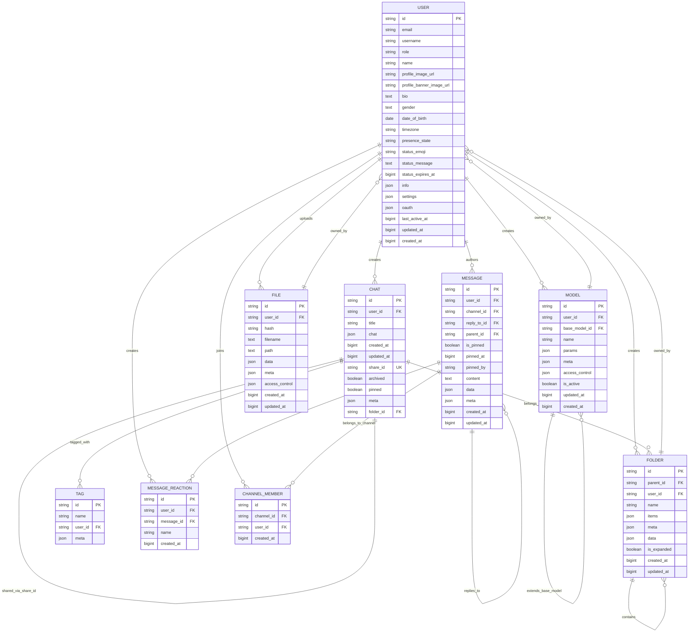

# Data Model

<cite>
**Referenced Files in This Document**   
- [db.py](file://backend/open_webui/internal/db.py)
- [users.py](file://backend/open_webui/models/users.py)
- [chats.py](file://backend/open_webui/models/chats.py)
- [messages.py](file://backend/open_webui/models/messages.py)
- [files.py](file://backend/open_webui/models/files.py)
- [models.py](file://backend/open_webui/models/models.py)
- [folders.py](file://backend/open_webui/models/folders.py)
- [tags.py](file://backend/open_webui/models/tags.py)
- [001_initial_schema.py](file://backend/open_webui/internal/migrations/001_initial_schema.py)
- [002_add_local_sharing.py](file://backend/open_webui/internal/migrations/002_add_local_sharing.py)
- [003_add_auth_api_key.py](file://backend/open_webui/internal/migrations/003_add_auth_api_key.py)
- [004_add_archived.py](file://backend/open_webui/internal/migrations/004_add_archived.py)
- [005_add_updated_at.py](file://backend/open_webui/internal/migrations/005_add_updated_at.py)
- [006_migrate_timestamps_and_charfields.py](file://backend/open_webui/internal/migrations/006_migrate_timestamps_and_charfields.py)
- [007_add_user_last_active_at.py](file://backend/open_webui/internal/migrations/007_add_user_last_active_at.py)
- [008_add_memory.py](file://backend/open_webui/internal/migrations/008_add_memory.py)
- [009_add_models.py](file://backend/open_webui/internal/migrations/009_add_models.py)
- [010_migrate_modelfiles_to_models.py](file://backend/open_webui/internal/migrations/010_migrate_modelfiles_to_models.py)
- [011_add_user_settings.py](file://backend/open_webui/internal/migrations/011_add_user_settings.py)
- [012_add_tools.py](file://backend/open_webui/internal/migrations/012_add_tools.py)
- [013_add_user_info.py](file://backend/open_webui/internal/migrations/013_add_user_info.py)
- [014_add_files.py](file://backend/open_webui/internal/migrations/014_add_files.py)
- [015_add_functions.py](file://backend/open_webui/internal/migrations/015_add_functions.py)
- [016_add_valves_and_is_active.py](file://backend/open_webui/internal/migrations/016_add_valves_and_is_active.py)
- [017_add_user_oauth_sub.py](file://backend/open_webui/internal/migrations/017_add_user_oauth_sub.py)
- [018_add_function_is_global.py](file://backend/open_webui/internal/migrations/018_add_function_is_global.py)
- [7e5b5dc7342b_init.py](file://backend/open_webui/migrations/versions/7e5b5dc7342b_init.py)
- [9f0c9cd09105_add_note_table.py](file://backend/open_webui/migrations/versions/9f0c9cd09105_add_note_table.py)
- [3781e22d8b01_update_message_table.py](file://backend/open_webui/migrations/versions/3781e22d8b01_update_message_table.py)
- [7826ab40b532_update_file_table.py](file://backend/open_webui/migrations/versions/7826ab40b532_update_file_table.py)
- [3af16a1c9fb6_update_user_table.py](file://backend/open_webui/migrations/versions/3af16a1c9fb6_update_user_table.py)
- [242a2047eae0_update_chat_table.py](file://backend/open_webui/migrations/versions/242a2047eae0_update_chat_table.py)
</cite>

## Table of Contents
1. [Introduction](#introduction)
2. [Core Entities](#core-entities)
   1. [User](#user)
   2. [Chat](#chat)
   3. [Message](#message)
   4. [File](#file)
   5. [Model](#model)
3. [Database Schema Evolution](#database-schema-evolution)
4. [Data Access Patterns](#data-access-patterns)
5. [Data Lifecycle Management](#data-lifecycle-management)
6. [Data Security and Access Control](#data-security-and-access-control)
7. [Database Schema Diagram](#database-schema-diagram)

## Introduction

The open-webui application implements a comprehensive data model to support its AI chat interface, user management, and content organization features. The data model is built on a relational database foundation with key entities including User, Chat, Message, File, and Model, each with specific attributes, relationships, and constraints. The schema has evolved through a series of migration files that track changes from the initial implementation to the current state, with both Peewee and Alembic migration systems used for schema management. The application supports multiple database backends including SQLite and PostgreSQL, with appropriate data type handling for each. The data model incorporates features for content sharing, access control, metadata storage, and user preferences, providing a robust foundation for the application's functionality.

**Section sources**
- [db.py](file://backend/open_webui/internal/db.py#L1-L165)
- [users.py](file://backend/open_webui/models/users.py#L1-L719)
- [chats.py](file://backend/open_webui/models/chats.py#L1-L800)

## Core Entities

### User

The User entity represents individuals who interact with the open-webui application. It contains personal information, authentication details, preferences, and status information. The User table serves as the central identity management component, with relationships to other entities such as Chats, Messages, and Files. The schema includes fields for basic profile information (name, email, profile image), role-based access control (role field), and user status (presence_state, last_active_at). Additional fields support OAuth authentication (oauth field as JSON), user settings (settings field as JSON), and personal information (bio, gender, date_of_birth). The User entity also includes timestamps for creation, updates, and last activity, enabling user activity tracking and analytics.

**Section sources**
- [users.py](file://backend/open_webui/models/users.py#L45-L107)
- [001_initial_schema.py](file://backend/open_webui/internal/migrations/001_initial_schema.py#L132-L142)
- [7e5b5dc7342b_init.py](file://backend/open_webui/migrations/versions/7e5b5dc7342b_init.py#L168-L186)
- [3af16a1c9fb6_update_user_table.py](file://backend/open_webui/migrations/versions/3af16a1c9fb6_update_user_table.py#L21-L26)

### Chat

The Chat entity represents conversational threads between users and AI models. Each chat contains a history of interactions stored as JSON in the chat field, with a descriptive title for user identification. The schema supports chat organization through folder_id for hierarchical grouping and tagging through relationships with the Tag entity. Key features include sharing capabilities (share_id field), archiving (archived boolean), and pinning (pinned boolean) for quick access. The chat table includes timestamps for creation and updates, enabling chronological sorting and activity tracking. The chat field was migrated from TEXT to JSON type to support structured conversation data, allowing for richer content representation and easier manipulation of message history.

**Section sources**
- [chats.py](file://backend/open_webui/models/chats.py#L26-L43)
- [001_initial_schema.py](file://backend/open_webui/internal/migrations/001_initial_schema.py#L63-L72)
- [002_add_local_sharing.py](file://backend/open_webui/internal/migrations/002_add_local_sharing.py#L40-L42)
- [242a2047eae0_update_chat_table.py](file://backend/open_webui/migrations/versions/242a2047eae0_update_chat_table.py#L21-L78)

### Message

The Message entity represents individual messages within a chat or channel context. It supports rich content through the content field (TEXT) and structured data through the data field (JSON). The schema includes support for message threading with parent_id and reply_to_id fields, enabling nested conversations. Message reactions are handled through a separate MessageReaction entity with a many-to-one relationship. The message table includes metadata for pinning (is_pinned, pinned_at, pinned_by) and timestamps for creation and updates (created_at, updated_at) with nanosecond precision. Messages are associated with users (user_id) and channels (channel_id), supporting both direct messaging and group chat functionality.

**Section sources**
- [messages.py](file://backend/open_webui/models/messages.py#L42-L63)
- [3781e22d8b01_update_message_table.py](file://backend/open_webui/migrations/versions/3781e22d8b01_update_message_table.py#L18-L69)
- [chats.py](file://backend/open_webui/models/chats.py#L32-L33)

### File

The File entity represents uploaded or generated files within the application. It stores metadata about files including filename, hash (for deduplication), and path. The schema includes JSON fields for data and meta to store structured information about the file content and properties. A key feature is access control (access_control field as JSON) which defines permissions for reading and writing the file. The File entity is associated with a user (user_id) and includes timestamps for creation and updates. This entity supports various file types used in the application, including documents, images, and other media that may be referenced in chats or used as context for AI interactions.

**Section sources**
- [files.py](file://backend/open_webui/models/files.py#L18-L34)
- [7e5b5dc7342b_init.py](file://backend/open_webui/migrations/versions/7e5b5dc7342b_init.py#L79-L88)
- [7826ab40b532_update_file_table.py](file://backend/open_webui/migrations/versions/7826ab40b532_update_file_table.py#L18-L22)

### Model

The Model entity represents AI models that can be used within the application. It includes fields for the model identifier (id), display name (name), and configuration parameters (params as JSON). The schema supports model inheritance or delegation through the base_model_id field, allowing custom models to extend existing ones. Metadata about the model is stored in the meta field (JSON), including profile images and descriptions. A sophisticated access control system (access_control field as JSON) defines who can use the model, with options for public access, private access, or custom group/user permissions. The is_active field enables toggling model availability without deletion. This entity allows users to define, customize, and share AI models with specific configurations and capabilities.

**Section sources**
- [models.py](file://backend/open_webui/models/models.py#L55-L105)
- [7e5b5dc7342b_init.py](file://backend/open_webui/migrations/versions/7e5b5dc7342b_init.py#L118-L130)
- [009_add_models.py](file://backend/open_webui/internal/migrations/009_add_models.py)

## Database Schema Evolution

The open-webui application's database schema has evolved through a comprehensive migration strategy using both Peewee and Alembic frameworks. The evolution began with an initial schema (001_initial_schema.py) that established core tables for User, Chat, and other entities, with separate migration paths for SQLite and external databases. Early migrations added fundamental features: local sharing capability to chats (002_add_local_sharing.py) and API key authentication for users (003_add_auth_api_key.py). Subsequent migrations introduced the archived status for chats (004_add_archived.py), standardized timestamp fields with updated_at (005_add_updated_at.py), and migrated from CHAR fields to more appropriate types (006_migrate_timestamps_and_charfields.py).

The schema continued to expand with user-centric features: tracking last active time (007_add_user_last_active_at.py), adding memory storage (008_add_memory.py), and introducing the Model entity for AI model management (009_add_models.py). A significant migration (010_migrate_modelfiles_to_models.py) transformed the modelfile concept into a full Model entity with enhanced capabilities. User experience improvements followed with settings (011_add_user_settings.py), tools (012_add_tools.py), and extended user information (013_add_user_info.py). File management was introduced (014_add_files.py) alongside functions (015_add_functions.py) and valves for model customization (016_add_valves_and_is_active.py).

The Alembic migration system (in the migrations/versions directory) continued the evolution with more sophisticated changes. The init migration (7e5b5dc7342b_init.py) established the modern schema with JSON fields for flexible data storage. Key structural changes included updating the chat table to use JSON for chat content instead of TEXT (242a2047eae0_update_chat_table.py), enhancing the message table with threading and reactions (3781e22d8b01_update_message_table.py), and adding access control to files (7826ab40b532_update_file_table.py). User profile expansion added username, bio, gender, and date of birth fields (3af16a1c9fb6_update_user_table.py), while note-taking functionality was introduced with a dedicated note table (9f0c9cd09105_add_note_table.py). This migration history demonstrates a thoughtful, incremental approach to schema design that balances backward compatibility with new feature development.

**Section sources**
- [001_initial_schema.py](file://backend/open_webui/internal/migrations/001_initial_schema.py)
- [002_add_local_sharing.py](file://backend/open_webui/internal/migrations/002_add_local_sharing.py)
- [003_add_auth_api_key.py](file://backend/open_webui/internal/migrations/003_add_auth_api_key.py)
- [004_add_archived.py](file://backend/open_webui/internal/migrations/004_add_archived.py)
- [005_add_updated_at.py](file://backend/open_webui/internal/migrations/005_add_updated_at.py)
- [006_migrate_timestamps_and_charfields.py](file://backend/open_webui/internal/migrations/006_migrate_timestamps_and_charfields.py)
- [007_add_user_last_active_at.py](file://backend/open_webui/internal/migrations/007_add_user_last_active_at.py)
- [008_add_memory.py](file://backend/open_webui/internal/migrations/008_add_memory.py)
- [009_add_models.py](file://backend/open_webui/internal/migrations/009_add_models.py)
- [010_migrate_modelfiles_to_models.py](file://backend/open_webui/internal/migrations/010_migrate_modelfiles_to_models.py)
- [7e5b5dc7342b_init.py](file://backend/open_webui/migrations/versions/7e5b5dc7342b_init.py)
- [242a2047eae0_update_chat_table.py](file://backend/open_webui/migrations/versions/242a2047eae0_update_chat_table.py)
- [3781e22d8b01_update_message_table.py](file://backend/open_webui/migrations/versions/3781e22d8b01_update_message_table.py)
- [7826ab40b532_update_file_table.py](file://backend/open_webui/migrations/versions/7826ab40b532_update_file_table.py)
- [3af16a1c9fb6_update_user_table.py](file://backend/open_webui/migrations/versions/3af16a1c9fb6_update_user_table.py)
- [9f0c9cd09105_add_note_table.py](file://backend/open_webui/migrations/versions/9f0c9cd09105_add_note_table.py)

## Data Access Patterns

The open-webui application implements several key data access patterns optimized for its use cases. For user management, the application uses direct lookups by ID, email, and API key, with additional methods for retrieving users by OAuth sub identifier and filtering users by various criteria including roles, groups, and search queries. Chat access patterns focus on user-specific retrieval with methods to get chat lists, pinned chats, archived chats, and chats by folder, supporting the application's organizational features. The get_chats_by_user_id_and_search_text method implements a sophisticated search that can filter by tags, folders, pinned/archived status, and shared status.

Message access patterns include retrieving messages by channel, by parent message (for threads), and by user, with additional methods to get the last message in a channel and pinned messages. The application implements denormalized data patterns in some cases, such as storing chat title directly in the Chat entity despite it also being present in the chat JSON, to optimize read performance. Indexing strategies reflect these access patterns, with indexes on user_id for all user-associated entities, folder_id for organizational queries, and composite indexes for common filter combinations like user_id and pinned status.

The application also implements batch operations and bulk retrieval methods, such as getting multiple files or chats by ID lists, which optimizes performance for scenarios where multiple related items need to be loaded. Transaction management is handled through the get_db context manager, ensuring data consistency for operations that modify multiple related records. The data access layer abstracts database-specific differences, particularly between SQLite and PostgreSQL, in areas like JSON field querying, ensuring consistent behavior across different database backends.

**Section sources**
- [users.py](file://backend/open_webui/models/users.py#L270-L453)
- [chats.py](file://backend/open_webui/models/chats.py#L535-L631)
- [messages.py](file://backend/open_webui/models/messages.py#L227-L259)
- [files.py](file://backend/open_webui/models/files.py#L178-L186)
- [db.py](file://backend/open_webui/internal/db.py#L148-L164)

## Data Lifecycle Management

The open-webui application implements a comprehensive data lifecycle management strategy through its data model and associated business logic. Data retention is primarily user-driven, with users able to archive or delete their own content. The Chat entity includes an archived field that allows users to remove chats from their main view without permanent deletion, supporting a soft-delete pattern. Users can archive individual chats or all chats at once through dedicated methods in the Chats class.

Data deletion follows a cascading pattern to maintain referential integrity. When a user is deleted, their associated chats are also removed, as implemented in the Users.delete_user_by_id method. Similarly, when a folder is deleted, all child folders are recursively removed. The application does not appear to implement automated data retention policies or scheduled data purging based on age, suggesting that data persistence is indefinite unless explicitly removed by the user.

For data archival, the application uses the archived boolean field on the Chat entity rather than moving data to separate archival tables or systems. This approach simplifies the schema but keeps archived data in the primary tables, relying on filtering in queries to separate active and archived content. The application does not implement data tiering or cold storage for infrequently accessed data. Data backup and recovery would be handled at the database level rather than through application-level mechanisms.

**Section sources**
- [chats.py](file://backend/open_webui/models/chats.py#L473-L484)
- [users.py](file://backend/open_webui/models/users.py#L628-L645)
- [folders.py](file://backend/open_webui/models/folders.py#L281-L311)

## Data Security and Access Control

The open-webui application implements a multi-layered data security and access control system. At the authentication level, users can authenticate via email/password or OAuth providers, with API keys providing programmatic access. The User entity includes role-based access control with roles such as "admin" and "pending" that determine user privileges within the application.

For data access control, the application implements a flexible JSON-based permissions system in the access_control field present on several entities including Model and File. This system supports three access levels: public (access_control is NULL, available to all users with "user" role), private (access_control is an empty object, restricted to the owner), and custom permissions that specify granular read/write access for specific user IDs or group IDs. The has_access function in the access_control module evaluates these permissions, considering both direct user access and group membership.

The application also implements ownership-based security, where users can only modify or delete their own content in most cases. Methods like get_file_by_id_and_user_id and get_folder_by_id_and_user_id enforce this ownership principle at the data access layer. Sensitive user information such as passwords is not stored in the User entity, suggesting that authentication is handled externally or through hashed credentials not exposed in the model layer. The database connection supports encryption through SQLCipher for SQLite databases, requiring a DATABASE_PASSWORD environment variable when using encrypted storage.

**Section sources**
- [models.py](file://backend/open_webui/models/models.py#L84-L99)
- [utils/access_control.py](file://backend/open_webui/utils/access_control.py)
- [files.py](file://backend/open_webui/models/files.py#L31-L32)
- [db.py](file://backend/open_webui/internal/db.py#L85-L113)

## Database Schema Diagram

**Diagram sources **
- [users.py](file://backend/open_webui/models/users.py#L45-L76)
- [chats.py](file://backend/open_webui/models/chats.py#L26-L43)
- [messages.py](file://backend/open_webui/models/messages.py#L42-L63)
- [files.py](file://backend/open_webui/models/files.py#L18-L34)
- [models.py](file://backend/open_webui/models/models.py#L55-L105)
- [folders.py](file://backend/open_webui/models/folders.py#L24-L35)
- [tags.py](file://backend/open_webui/models/tags.py#L20-L30)
- [messages.py](file://backend/open_webui/models/messages.py#L22-L29)
- [channels.py](file://backend/open_webui/models/channels.py)