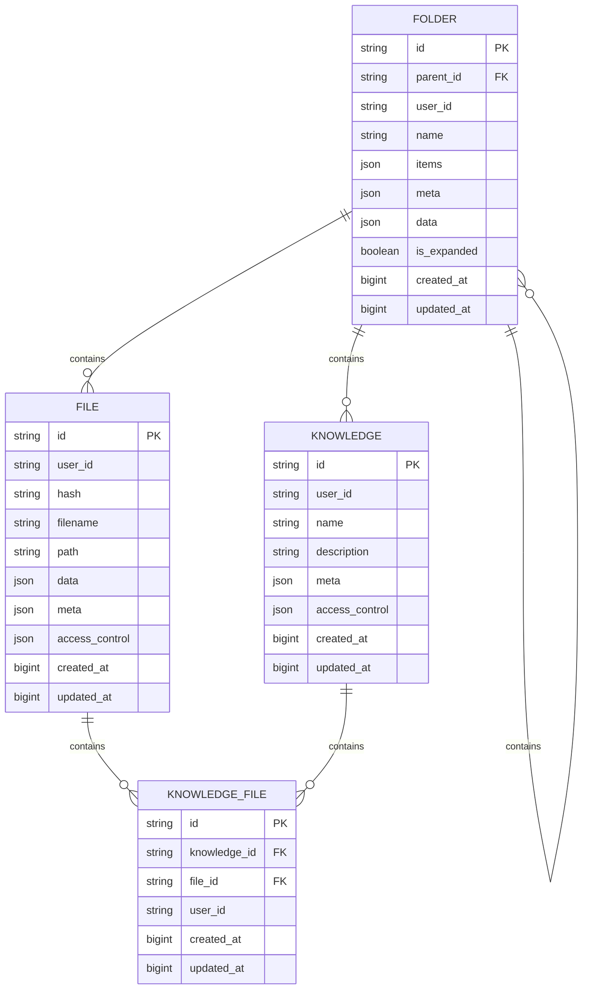

# File and Knowledge Data Model

<cite>
**Referenced Files in This Document**   
- [files.py](file://backend/open_webui/models/files.py)
- [knowledge.py](file://backend/open_webui/models/knowledge.py)
- [folders.py](file://backend/open_webui/models/folders.py)
- [provider.py](file://backend/open_webui/storage/provider.py)
- [3e0e00844bb0_add_knowledge_file_table.py](file://backend/open_webui/migrations/versions/3e0e00844bb0_add_knowledge_file_table.py)
- [6a39f3d8e55c_add_knowledge_table.py](file://backend/open_webui/migrations/versions/6a39f3d8e55c_add_knowledge_table.py)
- [files.py](file://backend/open_webui/routers/files.py)
- [knowledge.py](file://backend/open_webui/routers/knowledge.py)
- [retrieval.py](file://backend/open_webui/routers/retrieval.py)
</cite>

## Table of Contents
1. [Introduction](#introduction)
2. [File Entity](#file-entity)
3. [Knowledge Entity](#knowledge-entity)
4. [Knowledge-File Relationship](#knowledge-file-relationship)
5. [Folder Organization](#folder-organization)
6. [Storage Backend and File Path Management](#storage-backend-and-file-path-management)
7. [Data Access Patterns](#data-access-patterns)
8. [RAG Pipeline Integration](#rag-pipeline-integration)
9. [Cleanup Procedures](#cleanup-procedures)
10. [Sample Data](#sample-data)
11. [Schema Diagram](#schema-diagram)

## Introduction
This document provides comprehensive documentation for the File and Knowledge entities in the open-webui application. It details the data models, relationships, storage mechanisms, and access patterns for managing documents and knowledge bases within the system. The documentation covers the core entities (File and Knowledge), their relationship through the knowledge_file mapping table, folder organization, tagging capabilities, storage backends, and integration with the Retrieval-Augmented Generation (RAG) pipeline.

## File Entity

The File entity represents uploaded documents and other file-based content in the open-webui application. It serves as the foundation for storing user-uploaded content that can be processed and incorporated into knowledge bases.

### File Fields
The File model contains the following fields:

- **id**: Unique identifier for the file (String, primary key)
- **user_id**: Identifier of the user who uploaded the file (String)
- **hash**: Cryptographic hash of the file content for integrity verification (String, nullable)
- **filename**: Original name of the uploaded file (Text)
- **path**: Storage path where the file is located (Text, nullable)
- **data**: JSON field storing processing status, metadata, and other dynamic information (JSON, nullable)
- **meta**: JSON field storing additional metadata about the file such as content type and size (JSON, nullable)
- **access_control**: JSON field defining access permissions for the file (JSON, nullable)
- **created_at**: Timestamp when the file was created (BigInteger, epoch time)
- **updated_at**: Timestamp when the file was last updated (BigInteger, epoch time)

The File model also includes methods for CRUD operations, access control checks, and file metadata retrieval. The `FilesTable` class provides methods like `insert_new_file`, `get_file_by_id`, `update_file_by_id`, and `delete_file_by_id` to manage file records in the database.

**Section sources**
- [files.py](file://backend/open_webui/models/files.py#L18-L290)

## Knowledge Entity

The Knowledge entity represents a knowledge base or collection that can contain multiple files. It serves as a container for organizing related documents and enabling semantic search capabilities through vector embeddings.

### Knowledge Fields
The Knowledge model contains the following fields:

- **id**: Unique identifier for the knowledge base (Text, primary key)
- **user_id**: Identifier of the user who created the knowledge base (Text)
- **name**: Display name of the knowledge base (Text)
- **description**: Brief description of the knowledge base purpose (Text)
- **meta**: JSON field storing additional metadata about the knowledge base (JSON, nullable)
- **access_control**: JSON field defining access permissions for the knowledge base (JSON, nullable)
- **created_at**: Timestamp when the knowledge base was created (BigInteger, epoch time)
- **updated_at**: Timestamp when the knowledge base was last updated (BigInteger, epoch time)

The access_control field supports complex permission schemes:
- `None`: Public access, available to all users with the "user" role
- `{}`: Private access, restricted exclusively to the owner
- Custom permissions: Specific access control for reading and writing, with group or user-level restrictions

The Knowledge model includes methods for managing knowledge bases, checking access permissions, and retrieving associated files.

**Section sources**
- [knowledge.py](file://backend/open_webui/models/knowledge.py#L36-L371)

## Knowledge-File Relationship

The relationship between Files and Knowledge entries is managed through a many-to-many mapping table called `knowledge_file`, which establishes the association between knowledge bases and their constituent files.

### knowledge_file Mapping Table
The `knowledge_file` table contains the following fields:

- **id**: Unique identifier for the mapping record (Text, primary key)
- **knowledge_id**: Foreign key referencing the Knowledge entity (Text, not nullable)
- **file_id**: Foreign key referencing the File entity (Text, not nullable)
- **user_id**: Identifier of the user who added the file to the knowledge base (Text, not nullable)
- **created_at**: Timestamp when the mapping was created (BigInteger, not nullable)
- **updated_at**: Timestamp when the mapping was last updated (BigInteger, not nullable)

The table includes a unique constraint on the combination of `knowledge_id` and `file_id` to prevent duplicate entries. It also defines foreign key constraints with CASCADE deletion, ensuring that when a knowledge base or file is deleted, the corresponding mapping records are automatically removed.

The migration file `3e0e00844bb0_add_knowledge_file_table.py` created this table and migrated existing data from the deprecated `data` JSON field in the knowledge table, which previously stored file IDs in a JSON structure.

**Section sources**
- [knowledge.py](file://backend/open_webui/models/knowledge.py#L84-L103)
- [3e0e00844bb0_add_knowledge_file_table.py](file://backend/open_webui/migrations/versions/3e0e00844bb0_add_knowledge_file_table.py#L27-L54)

## Folder Organization

The Folder model provides hierarchical organization for files and knowledge bases, allowing users to create a structured directory-like system for managing their content.

### Folder Fields
The Folder model contains the following fields:

- **id**: Unique identifier for the folder (Text, primary key)
- **parent_id**: Identifier of the parent folder (Text, nullable)
- **user_id**: Identifier of the user who owns the folder (Text)
- **name**: Name of the folder (Text)
- **items**: JSON field storing references to files, knowledge bases, or other items in the folder (JSON, nullable)
- **meta**: JSON field storing additional metadata about the folder (JSON, nullable)
- **data**: JSON field storing dynamic data associated with the folder (JSON, nullable)
- **is_expanded**: Boolean indicating whether the folder is expanded in the UI (Boolean, default: False)
- **created_at**: Timestamp when the folder was created (BigInteger)
- **updated_at**: Timestamp when the folder was last updated (BigInteger)

The Folder model supports recursive operations for managing nested folder structures, including methods to get children folders, update parent relationships, and delete folders with all their descendants.

**Section sources**
- [folders.py](file://backend/open_webui/models/folders.py#L24-L367)

## Storage Backend and File Path Management

The open-webui application supports multiple storage backends through a pluggable storage provider system, allowing files to be stored locally or in cloud storage services.

### Storage Providers
The storage system is implemented in `provider.py` and supports the following backends:

- **Local Storage**: Files are stored in a local directory specified by the `UPLOAD_DIR` configuration
- **S3 Storage**: Files are stored in Amazon S3 or S3-compatible object storage
- **GCS Storage**: Files are stored in Google Cloud Storage
- **Azure Storage**: Files are stored in Microsoft Azure Blob Storage

The `StorageProvider` abstract base class defines the interface for all storage providers, with concrete implementations for each backend. The system uses configuration variables like `STORAGE_PROVIDER`, `S3_BUCKET_NAME`, `GCS_BUCKET_NAME`, and `AZURE_STORAGE_CONTAINER_NAME` to determine which provider to use and its configuration.

### File Path Management
When a file is uploaded, it is assigned a path based on the storage backend:
- For local storage: `{UPLOAD_DIR}/{filename}`
- For S3 storage: `s3://{bucket_name}/{key_prefix}/{filename}`
- For GCS storage: `gs://{bucket_name}/{filename}`
- For Azure storage: `{endpoint}/{container_name}/{filename}`

The system maintains both the original filename and the storage path, allowing for proper retrieval and management of files across different storage backends.

**Section sources**
- [provider.py](file://backend/open_webui/storage/provider.py#L43-L377)

## Data Access Patterns

The open-webui application implements several data access patterns for retrieving files and knowledge bases, with appropriate access control checks.

### File Retrieval
Files can be retrieved through various endpoints and methods:
- By ID: `get_file_by_id(id)` returns a specific file
- By user ID: `get_files_by_user_id(user_id)` returns all files owned by a user
- By multiple IDs: `get_files_by_ids(ids)` returns files matching a list of IDs
- With metadata: `get_file_metadatas_by_ids(ids)` returns only file metadata for efficiency

Access to files is controlled through the `check_access_by_user_id` method, which verifies that the requesting user has appropriate permissions based on ownership and access control settings.

### Knowledge Base Retrieval
Knowledge bases can be retrieved with different access levels:
- All knowledge bases: `get_knowledge_bases()` returns all knowledge bases
- By user ID with permission: `get_knowledge_bases_by_user_id(user_id, permission)` returns knowledge bases where the user has the specified permission level
- By ID: `get_knowledge_by_id(id)` returns a specific knowledge base

The access control system checks both direct ownership and group-based permissions to determine if a user can access a knowledge base.

**Section sources**
- [files.py](file://backend/open_webui/models/files.py#L132-L287)
- [knowledge.py](file://backend/open_webui/models/knowledge.py#L165-L211)

## RAG Pipeline Integration

The Retrieval-Augmented Generation (RAG) pipeline integrates file processing with vector embeddings to enable semantic search capabilities.

### File Processing Workflow
When a file is uploaded, it goes through the following processing steps:

1. **Upload**: The file is received and stored in the configured storage backend
2. **Metadata Extraction**: File metadata is extracted and stored in the database
3. **Content Processing**: The file content is processed using appropriate loaders based on file type
4. **Text Splitting**: The content is split into chunks using configurable splitters (RecursiveCharacterTextSplitter, TokenTextSplitter, etc.)
5. **Embedding Generation**: Each chunk is converted to a vector embedding using the configured embedding model
6. **Vector Storage**: The embeddings are stored in the vector database associated with the knowledge base

The `process_file` function in `retrieval.py` orchestrates this workflow, using the `Loader` class to determine the appropriate document loader based on file type and content.

### Supported File Types
The system supports a wide range of file types through various document loaders:
- **PDF**: PyPDFLoader or AzureAIDocumentIntelligenceLoader
- **HTML**: BSHTMLLoader
- **CSV**: CSVLoader
- **DOCX**: Docx2txtLoader
- **Text**: TextLoader
- **EPUB**: UnstructuredEPubLoader
- **Excel**: UnstructuredExcelLoader
- **ODT**: UnstructuredODTLoader
- **PowerPoint**: UnstructuredPowerPointLoader
- **RST**: UnstructuredRSTLoader
- **XML/HTML**: UnstructuredXMLLoader
- **YouTube Videos**: YoutubeLoader
- **External Documents**: ExternalDocumentLoader
- **Mistral OCR**: MistralLoader
- **Datalab Marker**: DatalabMarkerLoader
- **MinerU**: MinerULoader

For files that don't have a specific loader, the system can use Tika or Docling services for content extraction.

**Section sources**
- [retrieval.py](file://backend/open_webui/routers/retrieval.py#L187-L200)
- [main.py](file://backend/open_webui/retrieval/loaders/main.py#L8-L23)

## Cleanup Procedures

The system implements several cleanup procedures to manage storage and maintain data integrity.

### Orphaned File Cleanup
Orphaned files (files without corresponding database records) can be cleaned up through:
- **Direct deletion**: The `delete_file_by_id` method removes both the database record and the physical file
- **Batch deletion**: The `delete_all_files` method removes all files and their records
- **Storage synchronization**: When a file record is deleted, the corresponding physical file is also removed from storage

### Knowledge Base Reset
The `reset_knowledge_by_id` method allows for resetting a knowledge base by:
1. Deleting all `knowledge_file` mapping records for the knowledge base
2. Updating the knowledge base's `updated_at` timestamp
3. This effectively removes all files from the knowledge base while preserving the knowledge base metadata

### Folder Deletion
When a folder is deleted, the system recursively deletes all child folders and their contents through the `delete_folder_by_id_and_user_id` method, ensuring complete cleanup of the folder hierarchy.

**Section sources**
- [files.py](file://backend/open_webui/models/files.py#L268-L286)
- [knowledge.py](file://backend/open_webui/models/knowledge.py#L294-L312)
- [folders.py](file://backend/open_webui/models/folders.py#L281-L311)

## Sample Data

### Sample File Record
```json
{
  "id": "f1a2b3c4-d5e6-7890-a1b2-c3d4e5f6a7b8",
  "user_id": "u1234567-8901-2345-6789-012345678901",
  "hash": "sha256:abcdef1234567890abcdef1234567890abcdef1234567890abcdef1234567890",
  "filename": "research_paper.pdf",
  "path": "/app/uploads/research_paper.pdf",
  "data": {
    "status": "processed",
    "processing_time": 12.5,
    "chunk_count": 47
  },
  "meta": {
    "name": "Research Paper on AI",
    "content_type": "application/pdf",
    "size": 2457600,
    "page_count": 23
  },
  "access_control": null,
  "created_at": 1700000000,
  "updated_at": 1700000000
}
```

### Sample Knowledge Base Record
```json
{
  "id": "k9a8b7c6-d5e4-3210-f9e8-d7c6b5a4f3e2",
  "user_id": "u1234567-8901-2345-6789-012345678901",
  "name": "AI Research Collection",
  "description": "Collection of research papers on artificial intelligence",
  "meta": {
    "category": "research",
    "tags": ["AI", "machine learning", "neural networks"]
  },
  "access_control": {
    "read": {
      "group_ids": ["g1234567-8901-2345-6789-012345678901"],
      "user_ids": ["u9876543-2109-8765-4321-098765432109"]
    }
  },
  "created_at": 1700000000,
  "updated_at": 1700000000
}
```

### Sample knowledge_file Mapping
```json
{
  "id": "m1a2b3c4-d5e6-7890-a1b2-c3d4e5f6a7b8",
  "knowledge_id": "k9a8b7c6-d5e4-3210-f9e8-d7c6b5a4f3e2",
  "file_id": "f1a2b3c4-d5e6-7890-a1b2-c3d4e5f6a7b8",
  "user_id": "u1234567-8901-2345-6789-012345678901",
  "created_at": 1700000000,
  "updated_at": 1700000000
}
```

**Section sources**
- [files.py](file://backend/open_webui/models/files.py#L37-L52)
- [knowledge.py](file://backend/open_webui/models/knowledge.py#L67-L81)

## Schema Diagram



**Diagram sources**
- [files.py](file://backend/open_webui/models/files.py#L18-L34)
- [knowledge.py](file://backend/open_webui/models/knowledge.py#L36-L65)
- [folders.py](file://backend/open_webui/models/folders.py#L24-L35)
- [knowledge.py](file://backend/open_webui/models/knowledge.py#L84-L103)