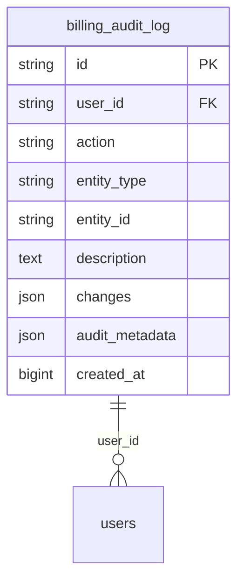
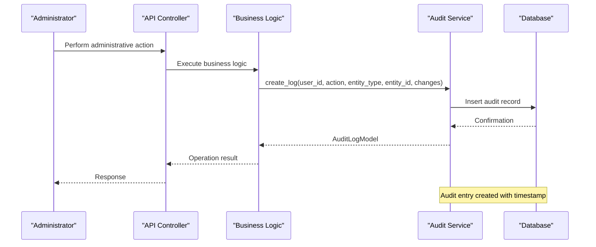
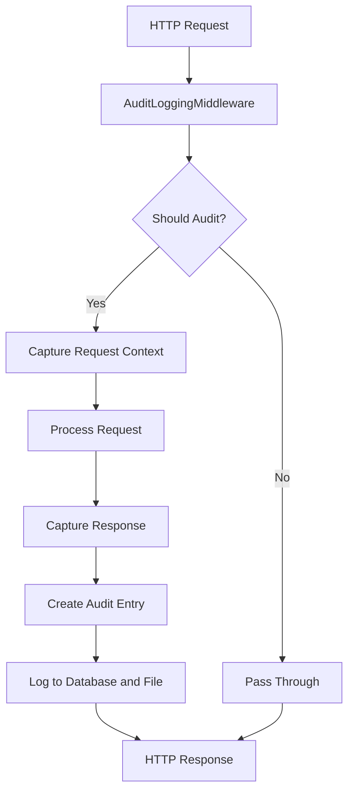

# Audit Data Model

<cite>
**Referenced Files in This Document**   
- [audit.py](file://backend/open_webui/models/audit.py)
- [audit.py](file://backend/open_webui/utils/audit.py)
- [admin_billing.py](file://backend/open_webui/routers/admin_billing.py)
- [users.py](file://backend/open_webui/routers/users.py)
- [env.py](file://backend/open_webui/env.py)
- [logger.py](file://backend/open_webui/utils/logger.py)
- [main.py](file://backend/open_webui/main.py)
- [b2f8a9c1d5e3_add_billing_tables.py](file://backend/open_webui/migrations/versions/b2f8a9c1d5e3_add_billing_tables.py)
</cite>

## Table of Contents
1. [Introduction](#introduction)
2. [Audit Entity Fields](#audit-entity-fields)
3. [Database Schema](#database-schema)
4. [Audit Log Generation](#audit-log-generation)
5. [Access Controls](#access-controls)
6. [Security Monitoring Integration](#security-monitoring-integration)
7. [Retention Policies](#retention-policies)
8. [Export Capabilities](#export-capabilities)
9. [Sample Audit Log Entries](#sample-audit-log-entries)
10. [Compliance Requirements](#compliance-requirements)

## Introduction
The Audit data model in the open-webui application provides comprehensive tracking of administrative actions and critical system operations. This documentation details the structure, implementation, and usage of the audit logging system, which is essential for security, compliance, and operational transparency. The audit system captures detailed information about user actions, including who performed the action, what was changed, when it occurred, and from where the request originated. This information is crucial for maintaining accountability, investigating security incidents, and ensuring regulatory compliance.

**Section sources**
- [audit.py](file://backend/open_webui/models/audit.py#L1-L136)
- [audit.py](file://backend/open_webui/utils/audit.py#L1-L284)

## Audit Entity Fields
The Audit entity captures comprehensive information about administrative actions and system events. Each audit log entry contains several key fields that provide context and details about the recorded action.

### Core Fields
The primary fields in the Audit entity include:

- **id**: A unique identifier for the audit log entry, generated using UUID4
- **user_id**: The identifier of the user who performed the action, with an index for query performance
- **action**: The type of action performed, stored as a string representation of the AuditAction enum
- **entity_type**: The type of entity affected by the action (e.g., "plan", "subscription")
- **entity_id**: The identifier of the specific entity that was affected
- **created_at**: Timestamp of when the action occurred, stored as a BigInteger representing Unix time

### Descriptive Fields
Additional fields provide context and details about the action:

- **description**: Text description of the action, providing human-readable context
- **changes**: JSON field containing a dictionary of changes made, with structure {"field": {"old": value, "new": value}}
- **audit_metadata**: JSON field for additional metadata specific to the audit event

### Request Context Fields
When configured for higher audit levels, additional context is captured:

- **source_ip**: IP address from which the request originated
- **user_agent**: User agent string identifying the client application
- **request_uri**: Full URI of the request
- **verb**: HTTP method used for the request (GET, POST, PUT, DELETE)
- **request_object**: Request payload (when audit level includes request body)
- **response_object**: Response payload (when audit level includes response body)
- **response_status_code**: HTTP status code of the response

**Section sources**
- [audit.py](file://backend/open_webui/models/audit.py#L34-L56)
- [audit.py](file://backend/open_webui/utils/audit.py#L37-L51)

## Database Schema
The Audit entity is implemented as a database table with a well-defined schema optimized for performance and query efficiency.



**Diagram sources **
- [audit.py](file://backend/open_webui/models/audit.py#L34-L56)
- [b2f8a9c1d5e3_add_billing_tables.py](file://backend/open_webui/migrations/versions/b2f8a9c1d5e3_add_billing_tables.py#L132-L145)

### Table Structure
The `billing_audit_log` table has the following structure:

- **id**: Primary key, String type, unique constraint
- **user_id**: String type, not nullable, indexed for performance
- **action**: String type, not nullable
- **entity_type**: String type, not nullable
- **entity_id**: String type, not nullable
- **description**: Text type, nullable
- **changes**: JSON type, nullable
- **audit_metadata**: JSON type, nullable
- **created_at**: BigInteger type, not nullable

### Indexes
The table includes several indexes to optimize query performance:

- **idx_audit_user**: Index on user_id for queries filtering by user
- **idx_audit_entity**: Composite index on entity_type and entity_id for entity-specific queries
- **idx_audit_created**: Index on created_at for time-based queries
- **idx_audit_action**: Index on action for filtering by action type

These indexes ensure that common query patterns, such as retrieving all logs for a specific user, entity, or time period, can be executed efficiently.

**Section sources**
- [audit.py](file://backend/open_webui/models/audit.py#L34-L62)
- [b2f8a9c1d5e3_add_billing_tables.py](file://backend/open_webui/migrations/versions/b2f8a9c1d5e3_add_billing_tables.py#L132-L167)

## Audit Log Generation
Audit logs are generated automatically when critical operations are performed in the system, particularly for administrative actions related to user management, model configuration, and system settings changes.

### Critical Operations Tracked
The audit system captures logs for various critical operations:

#### User Management
- Creating, updating, or deleting user accounts
- Modifying user roles and permissions
- User authentication events (login, logout)
- User status changes

#### Model Configuration
- Creating, updating, or deleting billing plans
- Activating or deactivating plans
- Duplicating existing plans
- Modifying plan quotas and features

#### System Settings Changes
- Updating default user permissions
- Modifying system configuration
- Changing security settings
- Updating API key configurations

### Generation Process
The audit log generation process follows a consistent pattern across the application:

1. When an administrative action is performed, the relevant service or controller calls the `AuditLogs.create_log()` method
2. The method parameters include the user_id, action type, entity type, entity_id, and optional details
3. For update operations, the system detects changes by comparing old and new values
4. The audit entry is created with a timestamp and stored in the database
5. The entry is also written to the audit log file if file logging is enabled



**Diagram sources **
- [admin_billing.py](file://backend/open_webui/routers/admin_billing.py#L242-L249)
- [audit.py](file://backend/open_webui/models/audit.py#L87-L115)

### Action Types
The system defines specific action types for different operations:

- **PLAN_CREATED**: When a new billing plan is created
- **PLAN_UPDATED**: When an existing plan is modified
- **PLAN_DELETED**: When a plan is removed
- **PLAN_ACTIVATED**: When a plan is activated
- **PLAN_DEACTIVATED**: When a plan is deactivated
- **PLAN_DUPLICATED**: When a plan is copied to create a new one

These action types are defined in the `AuditAction` enum and provide a standardized way to categorize administrative operations.

**Section sources**
- [audit.py](file://backend/open_webui/models/audit.py#L19-L27)
- [admin_billing.py](file://backend/open_webui/routers/admin_billing.py#L242-L249)

## Access Controls
Access to audit logs is restricted to authorized personnel, primarily administrators, to ensure the confidentiality and integrity of the audit data.

### Role-Based Access
The system implements role-based access control for audit log viewing:

- **Administrators**: Full access to view all audit logs
- **Regular Users**: No access to audit logs
- **Auditors**: Access limited to specific audit log categories (if implemented)

The access control is enforced through the `get_admin_user` dependency in API routes, which ensures that only users with administrative privileges can access audit log endpoints.

### Viewing Permissions
To view audit logs, users must have the appropriate role and permissions:

- Access is controlled through the authentication system
- The `get_admin_user` function verifies user roles
- Only users with the "admin" role can access audit log endpoints
- The system prevents privilege escalation by validating user roles

### Security Considerations
Several security measures protect audit log access:

- Audit log endpoints require authentication
- Role verification is performed on each request
- Sensitive information is redacted from logs when appropriate
- The primary admin user has additional protections against modification or deletion

**Section sources**
- [admin_billing.py](file://backend/open_webui/routers/admin_billing.py#L206-L253)
- [users.py](file://backend/open_webui/routers/users.py#L578-L610)

## Security Monitoring Integration
The audit system integrates with the application's security monitoring infrastructure to provide real-time visibility into administrative activities and potential security incidents.

### Middleware Integration
The audit system is implemented as ASGI middleware that intercepts HTTP requests and responses:



**Diagram sources **
- [audit.py](file://backend/open_webui/utils/audit.py#L121-L180)

### Audit Levels
The system supports different audit levels, configurable through environment variables:

- **NONE**: No audit logging
- **METADATA**: Logs basic metadata (user, action, timestamp, IP, user agent)
- **REQUEST**: Includes request body in addition to metadata
- **REQUEST_RESPONSE**: Includes both request and response bodies

The audit level is configured via the `AUDIT_LOG_LEVEL` environment variable, allowing administrators to balance security requirements with performance and storage considerations.

### Log Output
Audit logs are written to multiple destinations:

- **Database**: Structured storage in the `billing_audit_log` table for querying and analysis
- **File**: JSON-formatted entries in a rotating log file for external monitoring systems
- **Console**: For debugging purposes during development

The file output is configured with rotation and compression to manage disk space usage effectively.

**Section sources**
- [audit.py](file://backend/open_webui/utils/audit.py#L53-L57)
- [env.py](file://backend/open_webui/env.py#L787-L788)
- [logger.py](file://backend/open_webui/utils/logger.py#L135-L144)

## Retention Policies
The audit system implements retention policies to manage storage requirements while maintaining compliance with regulatory requirements.

### Database Retention
While the codebase does not explicitly define database retention policies, the schema and indexing suggest considerations for long-term storage:

- The `created_at` field uses BigInteger to store Unix timestamps, supporting a wide date range
- Indexes on `created_at` enable efficient time-based queries and potential automated cleanup
- The JSON fields for changes and metadata allow flexible storage of varying data sizes

### File Retention
The file-based audit logging includes built-in retention management:

- **Rotation**: Log files are rotated when they reach the size specified by `AUDIT_LOG_FILE_ROTATION_SIZE` (default: 10MB)
- **Compression**: Rotated files are compressed using zip format to save disk space
- **Configuration**: The rotation size is configurable via the `AUDIT_LOG_FILE_ROTATION_SIZE` environment variable

This rotation mechanism ensures that disk space usage is controlled while maintaining a rolling window of audit data.

### Configuration
Retention settings are configured through environment variables:

- **AUDIT_LOGS_FILE_PATH**: Specifies the path for audit log files (default: DATA_DIR/audit.log)
- **AUDIT_LOG_FILE_ROTATION_SIZE**: Sets the maximum size before log rotation (default: 10MB)

These settings allow administrators to customize retention based on their storage capacity and compliance requirements.

**Section sources**
- [env.py](file://backend/open_webui/env.py#L776-L778)
- [logger.py](file://backend/open_webui/utils/logger.py#L140-L141)

## Export Capabilities
The audit system provides programmatic access to audit data, enabling export for external analysis and compliance reporting.

### API Endpoints
The system exposes API endpoints for retrieving audit logs:

- **Filtering**: Logs can be filtered by entity type, entity ID, and user ID
- **Pagination**: Results are paginated with configurable limit and offset parameters
- **Sorting**: Logs are returned in reverse chronological order by default

The `AuditLogs.get_logs()` method implements these capabilities, allowing clients to retrieve specific subsets of audit data efficiently.

### Data Format
Exported audit data is provided in a structured JSON format:

```json
{
  "id": "string",
  "user_id": "string",
  "action": "string",
  "entity_type": "string",
  "entity_id": "string",
  "description": "string",
  "changes": {
    "field": {
      "old": "value",
      "new": "value"
    }
  },
  "audit_metadata": {},
  "created_at": 1234567890
}
```

This standardized format facilitates integration with external analysis tools and compliance reporting systems.

### Integration Points
The export capabilities support various integration scenarios:

- **Security Information and Event Management (SIEM)**: Real-time forwarding of audit events
- **Compliance Reporting**: Generation of audit trails for regulatory requirements
- **Analytics Platforms**: Import into data analysis tools for trend analysis
- **Backup Systems**: Regular export for offsite storage and disaster recovery

**Section sources**
- [audit.py](file://backend/open_webui/models/audit.py#L117-L136)

## Sample Audit Log Entries
The following examples illustrate typical audit log entries for common administrative actions in the open-webui application.

### Plan Creation
```json
{
  "id": "a1b2c3d4-e5f6-7890-g1h2-i3j4k5l6m7n8",
  "user_id": "admin123",
  "action": "plan_created",
  "entity_type": "plan",
  "entity_id": "pro_plan_1a2b3c",
  "description": "Created plan 'Pro Plan' (1490 RUB/month)",
  "audit_metadata": {
    "plan_data": {
      "id": "pro_plan_1a2b3c",
      "name": "Pro Plan",
      "price": 1490,
      "currency": "RUB",
      "interval": "month",
      "quotas": {
        "tokens_input": 100000,
        "requests": 1000
      }
    }
  },
  "created_at": 1738368000
}
```

### Plan Update
```json
{
  "id": "b2c3d4e5-f6g7-8901-h2i3-j4k5l6m7n8o9",
  "user_id": "admin123",
  "action": "plan_updated",
  "entity_type": "plan",
  "entity_id": "pro_plan_1a2b3c",
  "description": "Updated plan 'Pro Plan'",
  "changes": {
    "price": {
      "old": 1490,
      "new": 1990
    },
    "quotas": {
      "old": {
        "tokens_input": 100000,
        "requests": 1000
      },
      "new": {
        "tokens_input": 150000,
        "requests": 1500
      }
    }
  },
  "created_at": 1738454400
}
```

### Plan Activation
```json
{
  "id": "c3d4e5f6-g7h8-9012-i3j4-k5l6m7n8o9p0",
  "user_id": "admin123",
  "action": "plan_activated",
  "entity_type": "plan",
  "entity_id": "enterprise_plan_4d5e6f",
  "description": "Activated plan 'Enterprise Plan'",
  "created_at": 1738540800
}
```

### User Permission Update
```json
{
  "id": "d4e5f6g7-h8i9-0123-j4k5-l6m7n8o9p0q1",
  "user_id": "admin123",
  "action": "plan_updated",
  "entity_type": "system_settings",
  "entity_id": "default_permissions",
  "description": "Updated default user permissions",
  "changes": {
    "workspace.models": {
      "old": false,
      "new": true
    },
    "features.api_keys": {
      "old": false,
      "new": true
    }
  },
  "created_at": 1738627200
}
```

These sample entries demonstrate the comprehensive nature of the audit logging system, capturing not only what action was performed but also the specific changes made and the context in which they occurred.

**Section sources**
- [admin_billing.py](file://backend/open_webui/routers/admin_billing.py#L242-L249)
- [admin_billing.py](file://backend/open_webui/routers/admin_billing.py#L319-L326)

## Compliance Requirements
The audit data model in open-webui is designed to support various compliance requirements for security, privacy, and regulatory standards.

### Regulatory Alignment
The audit system helps meet requirements from several regulatory frameworks:

- **GDPR**: Provides accountability for data processing activities and supports data subject rights
- **HIPAA**: Creates an audit trail for access to sensitive information
- **SOC 2**: Supports the Security and Availability trust service principles
- **ISO 27001**: Implements control A.12.4.1 on event logging

The comprehensive logging of user actions, including who performed an action and when, helps demonstrate compliance with these standards.

### Security Controls
The audit system implements several security controls that align with best practices:

- **Immutable Logs**: Once created, audit records cannot be modified or deleted
- **Complete Trail**: All administrative actions are logged, creating a complete audit trail
- **Timestamp Accuracy**: Uses Unix timestamps to ensure accurate time recording
- **Source Identification**: Captures user ID and IP address to identify the source of actions

### Data Protection
The system includes features to protect sensitive information in audit logs:

- **Redaction**: Passwords and other sensitive data are redacted from request bodies
- **Access Control**: Strict role-based access prevents unauthorized viewing of audit logs
- **Secure Storage**: Logs are stored in a protected database with appropriate access controls

### Audit Integrity
To ensure the integrity of audit data:

- **Unique Identifiers**: Each log entry has a UUID to prevent duplication
- **Sequential Timestamps**: Entries are stored with precise timestamps
- **Complete Context**: Each entry includes sufficient context to understand the action

These features ensure that the audit trail is reliable and can be used for forensic analysis and compliance audits.

**Section sources**
- [audit.py](file://backend/open_webui/utils/audit.py#L260-L266)
- [audit.py](file://backend/open_webui/models/audit.py#L39-L56)