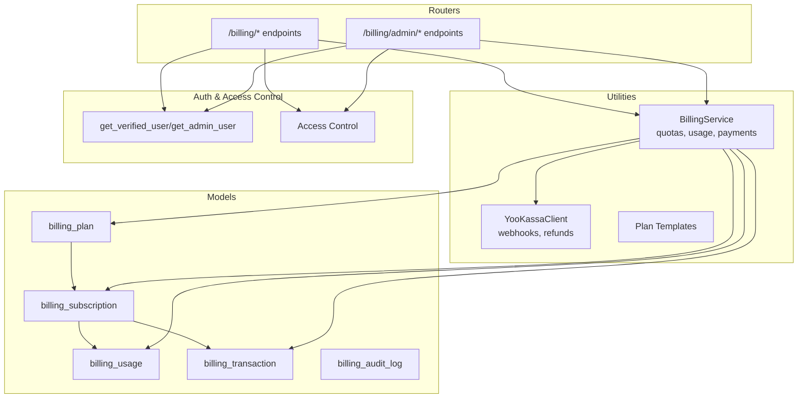
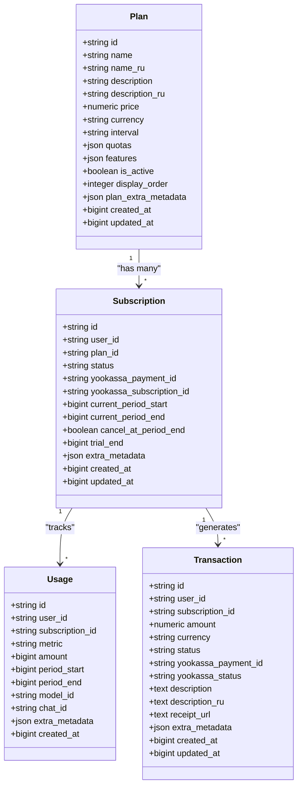
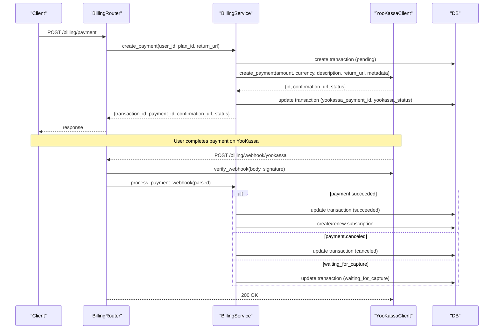
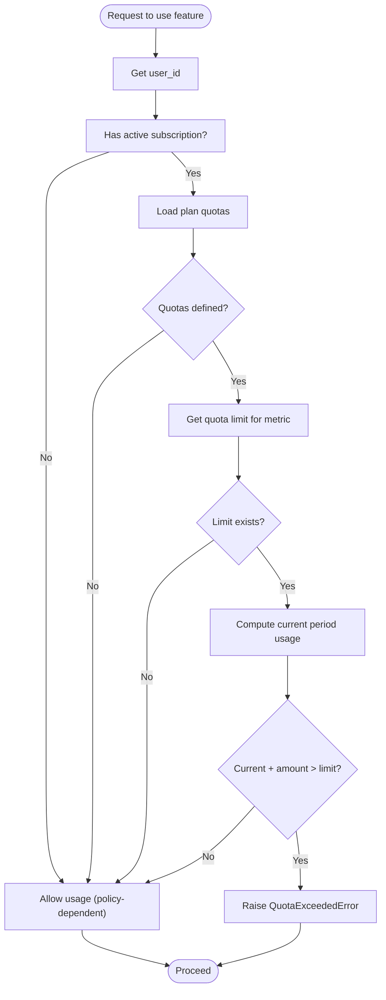
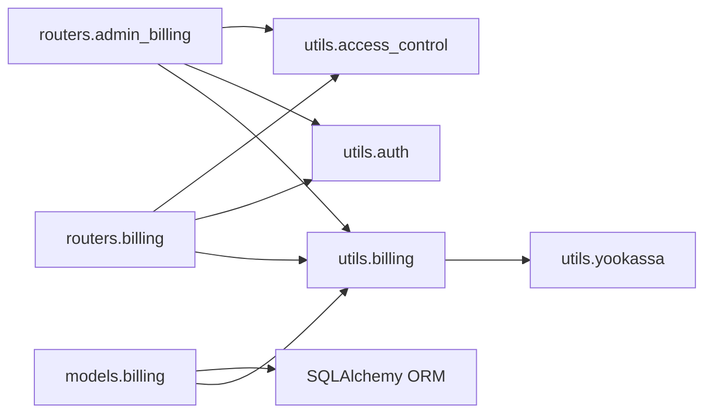

# Billing Data Model

<cite>
**Referenced Files in This Document**
- [billing.py](file://backend/open_webui/models/billing.py)
- [billing.py](file://backend/open_webui/routers/billing.py)
- [billing.py](file://backend/open_webui/utils/billing.py)
- [yookassa.py](file://backend/open_webui/utils/yookassa.py)
- [plan_templates.py](file://backend/open_webui/utils/plan_templates.py)
- [admin_billing.py](file://backend/open_webui/routers/admin_billing.py)
- [b2f8a9c1d5e3_add_billing_tables.py](file://backend/open_webui/migrations/versions/b2f8a9c1d5e3_add_billing_tables.py)
- [init_billing_plans.py](file://backend/scripts/init_billing_plans.py)
- [auth.py](file://backend/open_webui/utils/auth.py)
- [access_control.py](file://backend/open_webui/utils/access_control.py)
- [BILLING_SETUP.md](file://BILLING_SETUP.md)
</cite>

## Table of Contents
1. [Introduction](#introduction)
2. [Project Structure](#project-structure)
3. [Core Components](#core-components)
4. [Architecture Overview](#architecture-overview)
5. [Detailed Component Analysis](#detailed-component-analysis)
6. [Dependency Analysis](#dependency-analysis)
7. [Performance Considerations](#performance-considerations)
8. [Troubleshooting Guide](#troubleshooting-guide)
9. [Conclusion](#conclusion)
10. [Appendices](#appendices)

## Introduction
This document describes the Billing data model for the open-webui application. It covers subscription plans, user subscriptions, usage tracking, and transaction history. It explains how billing integrates with the authentication system to enforce feature access, outlines trial periods, plan upgrades/downgrades, cancellation policies, and multi-tenant billing considerations. It also documents integration with the payment processor (YooKassa) and provides sample plan configurations and subscription states.

## Project Structure
The billing system spans models, utilities, routers, migrations, and scripts:
- Models define database tables and Pydantic models for typed APIs.
- Utilities implement business logic for quotas, usage tracking, and payment processing.
- Routers expose REST endpoints for billing operations.
- Migrations define the schema for billing entities.
- Scripts initialize default billing plans.

**Diagram sources**
- [billing.py](file://backend/open_webui/models/billing.py#L1-L524)
- [billing.py](file://backend/open_webui/routers/billing.py#L1-L413)
- [billing.py](file://backend/open_webui/utils/billing.py#L1-L566)
- [yookassa.py](file://backend/open_webui/utils/yookassa.py#L1-L355)
- [plan_templates.py](file://backend/open_webui/utils/plan_templates.py#L1-L305)
- [admin_billing.py](file://backend/open_webui/routers/admin_billing.py#L1-L558)
- [b2f8a9c1d5e3_add_billing_tables.py](file://backend/open_webui/migrations/versions/b2f8a9c1d5e3_add_billing_tables.py#L1-L188)
- [auth.py](file://backend/open_webui/utils/auth.py#L403-L419)
- [access_control.py](file://backend/open_webui/utils/access_control.py#L71-L106)

**Section sources**
- [billing.py](file://backend/open_webui/models/billing.py#L1-L524)
- [billing.py](file://backend/open_webui/routers/billing.py#L1-L413)
- [billing.py](file://backend/open_webui/utils/billing.py#L1-L566)
- [yookassa.py](file://backend/open_webui/utils/yookassa.py#L1-L355)
- [plan_templates.py](file://backend/open_webui/utils/plan_templates.py#L1-L305)
- [admin_billing.py](file://backend/open_webui/routers/admin_billing.py#L1-L558)
- [b2f8a9c1d5e3_add_billing_tables.py](file://backend/open_webui/migrations/versions/b2f8a9c1d5e3_add_billing_tables.py#L1-L188)
- [auth.py](file://backend/open_webui/utils/auth.py#L403-L419)
- [access_control.py](file://backend/open_webui/utils/access_control.py#L71-L106)

## Core Components
- Subscription plans: Define pricing, billing intervals, quotas, and features.
- Subscriptions: Track user membership, status, billing periods, trials, and provider IDs.
- Usage: Track per-user metrics per billing period with optional context.
- Transactions: Record payment attempts, statuses, provider IDs, and receipts.
- BillingService: Orchestrates plan management, subscription lifecycle, usage tracking, quota checks, and payment processing.
- YooKassa integration: Handles payment creation, capture, refunds, and webhook verification.
- Admin endpoints: Manage plans, statistics, subscribers, and plan duplication.

**Section sources**
- [billing.py](file://backend/open_webui/models/billing.py#L54-L290)
- [billing.py](file://backend/open_webui/utils/billing.py#L39-L566)
- [yookassa.py](file://backend/open_webui/utils/yookassa.py#L1-L355)
- [admin_billing.py](file://backend/open_webui/routers/admin_billing.py#L1-L558)

## Architecture Overview
The billing architecture separates concerns:
- Data access via SQLAlchemy ORM models and Pydantic models.
- Business logic in BillingService.
- Payment processing via YooKassaClient.
- API exposure via FastAPI routers with authentication and authorization.
- Admin-only operations protected by get_admin_user.

**Diagram sources**
- [billing.py](file://backend/open_webui/models/billing.py#L54-L290)

**Section sources**
- [billing.py](file://backend/open_webui/models/billing.py#L54-L290)

## Detailed Component Analysis

### Data Model: Plans
- Purpose: Define subscription tiers with pricing, quotas, features, and presentation metadata.
- Key fields:
  - Identity: id, name, name_ru, description, description_ru.
  - Pricing: price, currency, interval (month/year).
  - Quotas: JSON mapping metric to limit (e.g., tokens_input, tokens_output, requests).
  - Features: JSON list of capabilities/features.
  - Lifecycle: is_active, display_order, plan_extra_metadata.
  - Timestamps: created_at, updated_at.

Sample plan configurations:
- Free: zero price, modest quotas for tokens and requests.
- Starter: monthly plan with higher quotas.
- Pro: monthly plan with advanced quotas and features.
- Business: monthly plan with enterprise quotas and features.
- Unlimited: placeholder plan with no quotas (inactive by default).
- Annual variants: 20% discount, year interval.
- Promotional plans: discounted pricing and limited-time metadata.

**Section sources**
- [billing.py](file://backend/open_webui/models/billing.py#L54-L105)
- [plan_templates.py](file://backend/open_webui/utils/plan_templates.py#L10-L181)
- [plan_templates.py](file://backend/open_webui/utils/plan_templates.py#L184-L305)
- [init_billing_plans.py](file://backend/scripts/init_billing_plans.py#L1-L120)

### Data Model: Subscriptions
- Purpose: Track user membership to a plan, billing periods, trial state, and provider IDs.
- Key fields:
  - Identity: id, user_id, plan_id.
  - Status: active, canceled, past_due, trialing, paused.
  - Provider: yookassa_payment_id, yookassa_subscription_id.
  - Billing cycle: current_period_start, current_period_end.
  - Flags: cancel_at_period_end, trial_end.
  - Metadata: extra_metadata.
  - Timestamps: created_at, updated_at.

Subscription states and lifecycle:
- Active: within current_period_start/end, not canceled_at_period_end.
- Trialing: status trialing with trial_end set.
- Past Due: status past_due (managed externally).
- Canceled: status canceled or cancel_at_period_end true.
- Paused: status paused (managed externally).

**Section sources**
- [billing.py](file://backend/open_webui/models/billing.py#L112-L170)
- [billing.py](file://backend/open_webui/utils/billing.py#L86-L155)

### Data Model: Usage
- Purpose: Track per-user metrics per billing period with optional context.
- Key fields:
  - Identity: id, user_id, subscription_id.
  - Metric: tokens_input, tokens_output, requests, images, audio_minutes.
  - Amount: bigint count for the metric.
  - Period: period_start, period_end.
  - Context: model_id, chat_id, extra_metadata.
  - Timestamp: created_at.

Usage aggregation:
- Current period usage computed from subscription’s current_period_start/end.
- Totals aggregated per metric for quota enforcement.

**Section sources**
- [billing.py](file://backend/open_webui/models/billing.py#L176-L224)
- [billing.py](file://backend/open_webui/utils/billing.py#L226-L310)

### Data Model: Transactions
- Purpose: Record payment attempts and outcomes with provider IDs and receipts.
- Key fields:
  - Identity: id, user_id, subscription_id.
  - Payment: amount, currency, status (pending, succeeded, failed, canceled).
  - Provider: yookassa_payment_id (unique), yookassa_status.
  - Description: description, description_ru.
  - Receipt: receipt_url.
  - Metadata: extra_metadata.
  - Timestamps: created_at, updated_at.

**Section sources**
- [billing.py](file://backend/open_webui/models/billing.py#L231-L290)
- [billing.py](file://backend/open_webui/utils/billing.py#L372-L524)

### BillingService: Business Logic
Responsibilities:
- Plan management: create, update, get, list active plans.
- Subscription lifecycle: create, cancel (immediate or at period end), renew.
- Usage tracking: record usage, compute totals, enforce quotas.
- Payments: create payment via YooKassa, process webhooks, update subscriptions.
- User billing info: combined subscription, plan, usage, and transactions.

Quota enforcement:
- check_quota determines if a user can consume a given amount without exceeding plan quotas.
- enforce_quota raises a QuotaExceededError if exceeded.

Payment flow:
- create_payment creates a transaction and a YooKassa payment, returning confirmation URL.
- process_payment_webhook updates transaction status and creates/renews subscription on success.

**Section sources**
- [billing.py](file://backend/open_webui/utils/billing.py#L39-L566)

### YooKassa Integration
Capabilities:
- Create payment with amount, currency, description, return URL, and metadata.
- Capture payment (authorize-and-capture flow).
- Cancel payment.
- Create and query refunds.
- Verify webhook signatures.
- Parse webhook payloads into normalized structure.

Webhook handling:
- Signature verification using HMAC-SHA256 with configured webhook secret.
- Parsing event types: payment.succeeded, payment.waiting_for_capture, payment.canceled, refund.succeeded.

**Section sources**
- [yookassa.py](file://backend/open_webui/utils/yookassa.py#L1-L355)

### Admin Billing Endpoints
- Plan CRUD: create, update, delete, toggle activation, duplicate.
- Statistics: per-plan active/canceled/total subscriptions and MRR calculation.
- Subscribers: paginated listing of users subscribed to a plan with status and period end.
- Validation: prevents decreasing quotas for plans with active subscriptions; logs price changes.

**Section sources**
- [admin_billing.py](file://backend/open_webui/routers/admin_billing.py#L1-L558)

### Authentication and Access Control Integration
- User endpoints require get_verified_user (JWT or API key) to ensure authenticated users.
- Admin endpoints require get_admin_user to restrict plan management to administrators.
- Access control utilities provide permission checks for group-based permissions.

Integration with feature access:
- The billing system enforces quotas and subscription status to gate feature usage.
- Quota checks occur before model requests; enforcement can raise QuotaExceededError.

**Section sources**
- [billing.py](file://backend/open_webui/routers/billing.py#L1-L413)
- [auth.py](file://backend/open_webui/utils/auth.py#L403-L419)
- [access_control.py](file://backend/open_webui/utils/access_control.py#L71-L106)

### API Workflows

#### Payment Creation and Webhook Processing

**Diagram sources**
- [billing.py](file://backend/open_webui/routers/billing.py#L182-L413)
- [billing.py](file://backend/open_webui/utils/billing.py#L372-L524)
- [yookassa.py](file://backend/open_webui/utils/yookassa.py#L262-L338)

#### Quota Enforcement Flow

**Diagram sources**
- [billing.py](file://backend/open_webui/utils/billing.py#L311-L371)

## Dependency Analysis
- Models depend on SQLAlchemy declarative Base and JSONField for JSON columns.
- BillingService depends on Plans, Subscriptions, UsageTracking, Transactions, and YooKassaClient.
- Routers depend on BillingService and authentication helpers.
- Admin endpoints depend on BillingService and user/group models for subscriber listing.
- Migrations define schema and indexes for efficient queries.

**Diagram sources**
- [billing.py](file://backend/open_webui/models/billing.py#L1-L524)
- [billing.py](file://backend/open_webui/utils/billing.py#L1-L566)
- [billing.py](file://backend/open_webui/routers/billing.py#L1-L413)
- [admin_billing.py](file://backend/open_webui/routers/admin_billing.py#L1-L558)
- [auth.py](file://backend/open_webui/utils/auth.py#L403-L419)
- [access_control.py](file://backend/open_webui/utils/access_control.py#L71-L106)

**Section sources**
- [billing.py](file://backend/open_webui/models/billing.py#L1-L524)
- [billing.py](file://backend/open_webui/utils/billing.py#L1-L566)
- [billing.py](file://backend/open_webui/routers/billing.py#L1-L413)
- [admin_billing.py](file://backend/open_webui/routers/admin_billing.py#L1-L558)

## Performance Considerations
- Indexes:
  - Subscription: composite index on user_id and status for fast active subscription lookups.
  - Usage: indexes on user_id+metric and period_start/period_end for analytics queries.
  - Transactions: indexes on user_id and yookassa_payment_id for payment reconciliation.
- Aggregation:
  - Usage totals computed via SQL SUM with appropriate filters to minimize memory overhead.
- Idempotency:
  - YooKassa requests use idempotence keys to safely retry without duplicates.
- Pagination:
  - Admin subscriber listing supports pagination to avoid large result sets.

[No sources needed since this section provides general guidance]

## Troubleshooting Guide
Common issues and resolutions:
- Invalid webhook signature:
  - Ensure webhook secret is configured and signature verification passes.
- Payment not creating subscription:
  - Verify transaction metadata includes user_id and plan_id; check webhook parsing and payment status.
- Quota exceeded errors:
  - Confirm plan quotas exist and are correctly configured; verify current period usage computation.
- Admin plan updates failing:
  - Decreasing quotas for plans with active subscriptions is disallowed; create a new plan instead.
- Authentication failures:
  - Ensure JWT/API key is valid and user role is verified; check admin-only endpoints require admin role.

**Section sources**
- [yookassa.py](file://backend/open_webui/utils/yookassa.py#L262-L338)
- [billing.py](file://backend/open_webui/utils/billing.py#L372-L524)
- [admin_billing.py](file://backend/open_webui/routers/admin_billing.py#L109-L141)

## Conclusion
The billing system provides a robust foundation for multi-tenant subscriptions with flexible plans, usage-based quotas, and payment processing via YooKassa. It integrates with the authentication system to enforce access control and supports administrative operations for plan management and reporting. The schema and indexes are designed for performance, while the service layer centralizes business logic for reliability and maintainability.

[No sources needed since this section summarizes without analyzing specific files]

## Appendices

### API Endpoints Overview
- User endpoints:
  - GET /billing/plans
  - GET /billing/plans/{plan_id}
  - GET /billing/subscription
  - POST /billing/subscription/cancel
  - POST /billing/payment
  - GET /billing/transactions
  - GET /billing/usage/{metric}
  - POST /billing/usage/check
  - GET /billing/me
- Admin endpoints:
  - GET/POST/PATCH/DELETE /billing/admin/plans
  - GET /billing/admin/plans/{plan_id}/subscribers

**Section sources**
- [billing.py](file://backend/open_webui/routers/billing.py#L84-L413)
- [admin_billing.py](file://backend/open_webui/routers/admin_billing.py#L159-L558)

### Sample Data: Default Plans
- Free: zero price, modest quotas for tokens and requests.
- Starter: monthly plan with higher quotas.
- Pro: monthly plan with advanced quotas and features.
- Business: monthly plan with enterprise quotas and features.
- Unlimited: placeholder plan with no quotas (inactive by default).
- Annual variants: 20% discount, year interval.
- Promotional plans: discounted pricing and limited-time metadata.

**Section sources**
- [plan_templates.py](file://backend/open_webui/utils/plan_templates.py#L10-L181)
- [plan_templates.py](file://backend/open_webui/utils/plan_templates.py#L184-L305)
- [init_billing_plans.py](file://backend/scripts/init_billing_plans.py#L1-L120)

### Trial Periods, Upgrades/Downgrades, and Cancellations
- Trial periods:
  - Set status to trialing with trial_end timestamp; auto-renew to active upon trial end.
- Upgrades/Downgrades:
  - Implemented by creating a new subscription to the target plan; existing subscription continues until renewal or cancellation.
- Cancellations:
  - Immediate: set status to canceled and end current period.
  - At period end: set cancel_at_period_end flag to true.

**Section sources**
- [billing.py](file://backend/open_webui/utils/billing.py#L102-L224)

### Multi-Tenant Billing Scenarios
- Tenant isolation:
  - All billing entities include user_id to associate records with users.
  - Admin endpoints provide subscriber listings per plan with user details.
- Scalability:
  - Indexes on user_id and composite keys optimize lookups.
  - Usage and transaction tables support analytics and reporting.

**Section sources**
- [billing.py](file://backend/open_webui/models/billing.py#L112-L290)
- [admin_billing.py](file://backend/open_webui/routers/admin_billing.py#L489-L558)

### Payment Processor Integration (YooKassa)
- Supported operations:
  - Create payment, capture, cancel, refund.
  - Webhook verification and parsing.
- Security:
  - HMAC-SHA256 signature verification for webhooks.
  - Idempotence keys for idempotent operations.

**Section sources**
- [yookassa.py](file://backend/open_webui/utils/yookassa.py#L1-L355)

### Setup and Initialization
- Initialize default plans using the provided script with options for annual and promotional plans and force updates.

**Section sources**
- [init_billing_plans.py](file://backend/scripts/init_billing_plans.py#L1-L120)
- [BILLING_SETUP.md](file://BILLING_SETUP.md#L173-L247)