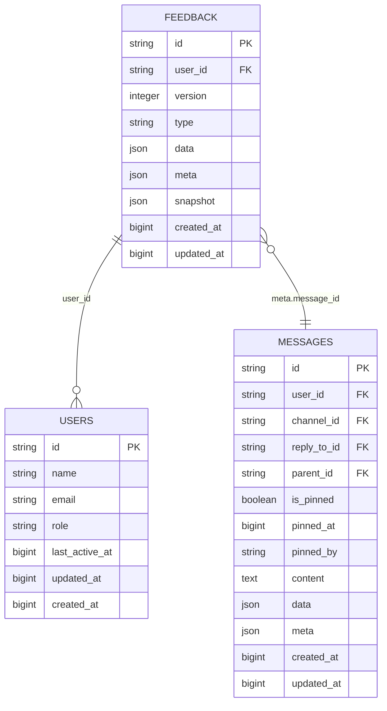
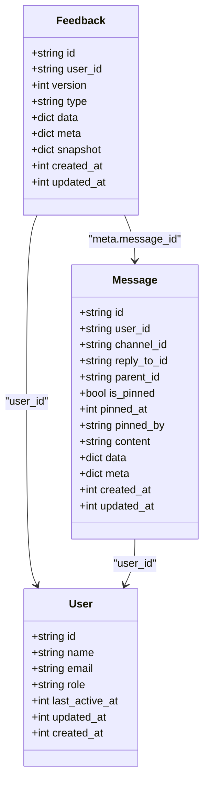
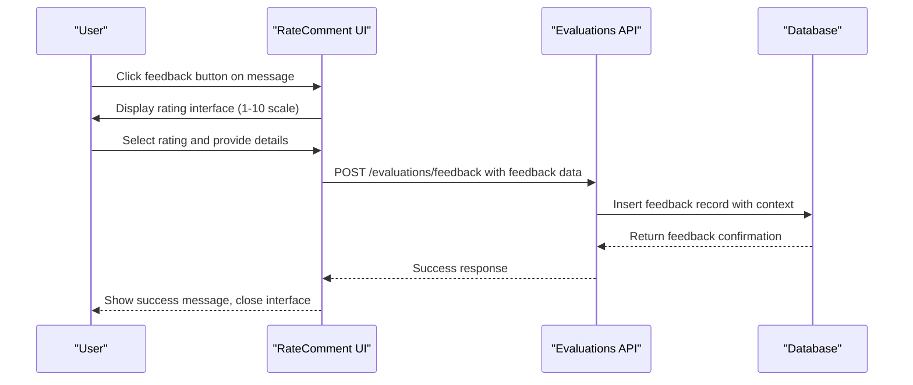
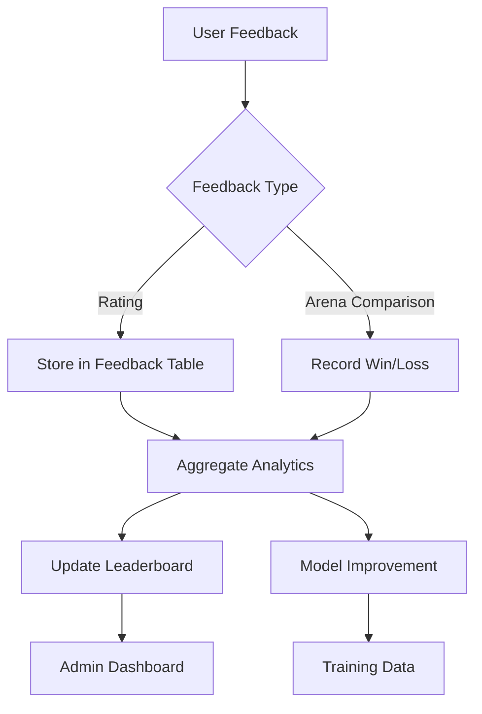

# Feedback Data Model

<cite>
**Referenced Files in This Document**   
- [feedbacks.py](file://backend/open_webui/models/feedbacks.py)
- [af906e964978_add_feedback_table.py](file://backend/open_webui/migrations/versions/af906e964978_add_feedback_table.py)
- [evaluations.py](file://backend/open_webui/routers/evaluations.py)
- [RateComment.svelte](file://src/lib/components/chat/Messages/RateComment.svelte)
- [FeedbackModal.svelte](file://src/lib/components/admin/Evaluations/FeedbackModal.svelte)
- [Feedbacks.svelte](file://src/lib/components/admin/Evaluations/Feedbacks.svelte)
- [index.ts](file://src/lib/apis/evaluations/index.ts)
- [messages.py](file://backend/open_webui/models/messages.py)
</cite>

## Table of Contents
1. [Introduction](#introduction)
2. [Feedback Schema](#feedback-schema)
3. [Field Definitions](#field-definitions)
4. [Relationships](#relationships)
5. [Feedback Collection Process](#feedback-collection-process)
6. [Evaluation System Integration](#evaluation-system-integration)
7. [Data Aggregation and Analytics](#data-aggregation-and-analytics)
8. [Privacy and Retention](#privacy-and-retention)
9. [Sample Feedback Entries](#sample-feedback-entries)
10. [API Endpoints](#api-endpoints)

## Introduction

The Feedback data model in the open-webui application serves as a comprehensive system for collecting, storing, and analyzing user evaluations of AI-generated responses. This model enables systematic assessment of AI response quality through structured feedback collection, supporting both individual message ratings and comparative evaluations in arena-style testing. The feedback system is tightly integrated with the chat functionality, allowing users to rate specific messages and provide detailed commentary on response quality.

The feedback mechanism supports multiple evaluation modes, including simple thumbs-up/down ratings, detailed 1-10 scale assessments, and comparative evaluations between different AI models. This data is crucial for ongoing model improvement, performance benchmarking, and community-driven evaluation of AI response quality.

**Section sources**
- [feedbacks.py](file://backend/open_webui/models/feedbacks.py#L22-L341)
- [af906e964978_add_feedback_table.py](file://backend/open_webui/migrations/versions/af906e964978_add_feedback_table.py#L1-L52)

## Feedback Schema

The Feedback entity is implemented as a database table with a flexible schema designed to accommodate various types of user feedback. The schema uses a combination of structured fields and JSON columns to provide both consistency and flexibility in data storage.



**Diagram sources**
- [feedbacks.py](file://backend/open_webui/models/feedbacks.py#L22-L341)
- [messages.py](file://backend/open_webui/models/messages.py#L41-L463)
- [af906e964978_add_feedback_table.py](file://backend/open_webui/migrations/versions/af906e964978_add_feedback_table.py#L1-L52)

## Field Definitions

The Feedback entity contains several key fields that capture different aspects of user feedback:

### Core Fields
- **id**: Unique identifier for each feedback entry (TEXT, primary key)
- **user_id**: Identifier of the user providing feedback (TEXT, foreign key to users)
- **version**: Version number for feedback (BIGINT, default 0)
- **type**: Type of feedback (TEXT, e.g., "rating", "arena")
- **created_at**: Timestamp when feedback was created (BIGINT, epoch time)
- **updated_at**: Timestamp when feedback was last updated (BIGINT, epoch time)

### Data Structure Fields
The feedback model uses JSON fields to store flexible data structures:

#### data field
Contains the primary feedback content with the following structure:
- **rating**: User's rating of the response (string or integer)
- **model_id**: Identifier of the AI model that generated the response
- **sibling_model_ids**: List of other model IDs when comparing multiple models
- **reason**: User's reason for their rating
- **comment**: Additional comments from the user
- **tags**: List of tags associated with the feedback

#### meta field
Contains metadata about the feedback context:
- **arena**: Boolean indicating if feedback was provided in arena mode
- **chat_id**: Identifier of the chat session
- **message_id**: Identifier of the specific message being rated
- **tags**: Additional metadata tags

#### snapshot field
Contains a snapshot of the chat context at the time of feedback:
- **chat**: Complete chat history including messages and metadata

**Section sources**
- [feedbacks.py](file://backend/open_webui/models/feedbacks.py#L65-L84)
- [feedbacks.py](file://backend/open_webui/models/feedbacks.py#L22-L31)

## Relationships

The Feedback entity maintains several important relationships with other entities in the system:

### User Relationship
Each feedback entry is associated with a user through the user_id field. This relationship enables:
- Attribution of feedback to specific users
- Aggregation of feedback by user
- User-specific feedback history
- Access control for feedback management

### Message Relationship
Feedback is directly linked to specific chat messages through the meta.message_id field in the metadata. This relationship allows:
- Precise association of feedback with individual AI responses
- Contextual display of the rated message and its prompt
- Traceability from feedback to the exact response being evaluated
- Analysis of feedback patterns across different message types

### Chat Relationship
Feedback entries reference the chat session through the meta.chat_id field, enabling:
- Contextual understanding of feedback within conversation flow
- Analysis of feedback patterns within specific conversations
- Reconstruction of conversation context when reviewing feedback



**Diagram sources**
- [feedbacks.py](file://backend/open_webui/models/feedbacks.py#L22-L341)
- [messages.py](file://backend/open_webui/models/messages.py#L41-L463)

## Feedback Collection Process

The feedback collection process is integrated directly into the chat interface, making it easy for users to evaluate AI responses. The process involves several key components:

### UI Components
The RateComment.svelte component provides the user interface for submitting feedback on chat messages. This component displays:
- A 1-10 rating scale for detailed assessment
- Reason selection options that vary based on positive or negative ratings
- Comment field for additional feedback
- Tagging system for categorizing feedback

### Collection Workflow
1. User interacts with a chat message and clicks the feedback button
2. The RateComment component displays a modal with rating options
3. User selects a rating on the 1-10 scale (1-5 for negative, 6-10 for positive)
4. Based on the rating, appropriate reason options are displayed
5. User can add a comment and select relevant tags
6. Feedback is submitted through the API

### Data Enrichment
When feedback is submitted, the system automatically enriches it with contextual data:
- User identifier from the authenticated session
- Message identifier from the targeted chat message
- Chat identifier from the current conversation
- Timestamps for creation and update
- Model identifier from the response metadata
- Chat snapshot for context preservation



**Diagram sources**
- [RateComment.svelte](file://src/lib/components/chat/Messages/RateComment.svelte#L1-L165)
- [evaluations.py](file://backend/open_webui/routers/evaluations.py#L116-L129)
- [feedbacks.py](file://backend/open_webui/models/feedbacks.py#L118-L145)

## Evaluation System Integration

The feedback data is central to the application's evaluation system, which uses this information to measure and improve AI response quality.

### Leaderboard System
The evaluation system uses feedback data to power a leaderboard that ranks AI models based on user ratings. The LeaderboardModal component processes feedback data to:
- Calculate model performance metrics
- Identify top-performing models
- Display comparative performance data
- Highlight common feedback tags for each model

### Arena Mode
The system supports arena-style evaluation where users can compare responses from multiple models:
- Users receive responses from different models without knowing their identities
- Users provide feedback on which response they prefer
- The system records comparative ratings (win/loss/draw)
- Aggregate results are used to rank models objectively

### Analytics Processing
Feedback data is processed to extract meaningful insights:
- Rating distribution analysis
- Common feedback reasons and patterns
- Model performance trends over time
- User engagement metrics



**Diagram sources**
- [Feedbacks.svelte](file://src/lib/components/admin/Evaluations/Feedbacks.svelte#L1-L410)
- [LeaderboardModal.svelte](file://src/lib/components/admin/Evaluations/LeaderboardModal.svelte#L1-L32)
- [feedbacks.py](file://backend/open_webui/models/feedbacks.py#L168-L230)

## Data Aggregation and Analytics

The feedback system supports comprehensive data aggregation for analytics purposes, enabling both real-time monitoring and long-term trend analysis.

### Aggregation Methods
The system provides several methods for aggregating feedback data:

#### By Model
- Average rating per model
- Total feedback count per model
- Win/loss ratio in arena comparisons
- Most common feedback tags per model

#### By User
- Feedback history per user
- Rating patterns of individual users
- User engagement metrics

#### By Time Period
- Daily feedback volume
- Rating trends over time
- Model performance evolution

### Analytics Endpoints
The system exposes several endpoints for data retrieval and analysis:

| Endpoint | Method | Description | Authentication |
|---------|--------|-------------|----------------|
| /evaluations/feedbacks/list | GET | List feedback with pagination and sorting | Admin |
| /evaluations/feedbacks/all | GET | Retrieve all feedback entries | Admin |
| /evaluations/feedbacks/all/export | GET | Export all feedback data | Admin |
| /evaluations/feedbacks/user | GET | Get current user's feedback | Authenticated |

### Data Export
The system supports data export functionality for external analysis:
- JSON export of all feedback data
- Privacy-preserving export options
- Batch processing for large datasets

**Section sources**
- [Feedbacks.svelte](file://src/lib/components/admin/Evaluations/Feedbacks.svelte#L130-L142)
- [evaluations.py](file://backend/open_webui/routers/evaluations.py#L94-L113)
- [index.ts](file://src/lib/apis/evaluations/index.ts#L96-L133)

## Privacy and Retention

The feedback system implements several privacy and retention policies to protect user data while maintaining the utility of feedback information.

### Privacy Considerations
- Chat content in snapshots is stored but access is restricted
- User identities are preserved for accountability but anonymized in public sharing
- Feedback data sharing with the community excludes chat logs
- Only ratings, model IDs, tags, and metadata are shared externally

### Data Retention
- Feedback data is retained indefinitely by default
- Users can delete their own feedback entries
- Administrators can purge all feedback data
- Export functionality allows users to maintain personal copies

### Community Sharing
The system supports optional community sharing of feedback data:
- Users can choose to share their feedback history
- Shared data contributes to a community leaderboard
- Privacy is protected by excluding chat logs from shared data
- Only aggregated metrics are visible in the public leaderboard

**Section sources**
- [Feedbacks.svelte](file://src/lib/components/admin/Evaluations/Feedbacks.svelte#L103-L128)
- [Feedbacks.svelte](file://src/lib/components/admin/Evaluations/Feedbacks.svelte#L375-L404)

## Sample Feedback Entries

The following examples illustrate typical feedback entries in the system:

### Positive Rating Example
```json
{
  "id": "fb123456-7890-abcd-efgh-ijklmnopqrst",
  "user_id": "usr98765-4321-fedc-ba98-765432109876",
  "version": 0,
  "type": "rating",
  "data": {
    "rating": 9,
    "model_id": "gpt-4-turbo",
    "reason": "thorough_explanation",
    "comment": "Excellent detailed response with clear examples",
    "tags": ["helpful", "detailed", "accurate"]
  },
  "meta": {
    "arena": false,
    "chat_id": "chat55555-6666-7777-8888-999999999999",
    "message_id": "msg11111-2222-3333-4444-555555555555",
    "tags": ["technical", "programming"]
  },
  "snapshot": {
    "chat": {
      "history": {
        "messages": [
          {
            "id": "msg00000-1111-2222-3333-444444444444",
            "content": "How do I implement a binary search algorithm?",
            "role": "user"
          },
          {
            "id": "msg11111-2222-3333-4444-555555555555",
            "content": "Here's a detailed explanation of binary search...",
            "role": "assistant"
          }
        ]
      }
    }
  },
  "created_at": 1700000000,
  "updated_at": 1700000000
}
```

### Arena Comparison Example
```json
{
  "id": "fb999999-8888-7777-6666-555555555555",
  "user_id": "usr11111-2222-3333-4444-555555555555",
  "version": 0,
  "type": "arena",
  "data": {
    "rating": 1,
    "model_id": "claude-3-opus",
    "sibling_model_ids": ["gpt-4-turbo", "gemini-pro"],
    "reason": "showcased_creativity",
    "comment": "Most creative and engaging response",
    "tags": ["creative", "engaging", "well-structured"]
  },
  "meta": {
    "arena": true,
    "chat_id": "chat88888-7777-6666-5555-444444444444",
    "message_id": "msg33333-4444-5555-6666-777777777777",
    "tags": ["creative-writing", "story"]
  },
  "snapshot": {
    "chat": {
      "history": {
        "messages": [
          {
            "id": "msg22222-3333-4444-5555-666666666666",
            "content": "Write a short story about a robot learning to paint",
            "role": "user"
          },
          {
            "id": "msg33333-4444-5555-6666-777777777777",
            "content": "The robot's fingers trembled as it held the brush...",
            "role": "assistant"
          }
        ]
      }
    }
  },
  "created_at": 1700000000,
  "updated_at": 1700000000
}
```

**Section sources**
- [feedbacks.py](file://backend/open_webui/models/feedbacks.py#L65-L84)
- [RateComment.svelte](file://src/lib/components/chat/Messages/RateComment.svelte#L91-L98)

## API Endpoints

The feedback system exposes a comprehensive API for creating, retrieving, and managing feedback data.

```mermaid
classDiagram
class FeedbackAPI {
+GET /evaluations/feedbacks/list
+GET /evaluations/feedbacks/all
+GET /evaluations/feedbacks/all/export
+GET /evaluations/feedbacks/user
+POST /evaluations/feedback
+GET /evaluations/feedback/{id}
+POST /evaluations/feedback/{id}
+DELETE /evaluations/feedback/{id}
+DELETE /evaluations/feedbacks
+DELETE /evaluations/feedbacks/all
}
class FeedbackForm {
+string type
+RatingData data
+dict meta
+SnapshotData snapshot
}
class RatingData {
+string/int rating
+string model_id
+list[string] sibling_model_ids
+string reason
+string comment
}
class MetaData {
+bool arena
+string chat_id
+string message_id
+list[string] tags
}
class SnapshotData {
+dict chat
}
FeedbackAPI --> FeedbackForm : "request body"
FeedbackForm --> RatingData : "data"
FeedbackForm --> MetaData : "meta"
FeedbackForm --> SnapshotData : "snapshot"
```

**Diagram sources**
- [evaluations.py](file://backend/open_webui/routers/evaluations.py#L61-L178)
- [index.ts](file://src/lib/apis/evaluations/index.ts#L1-L285)