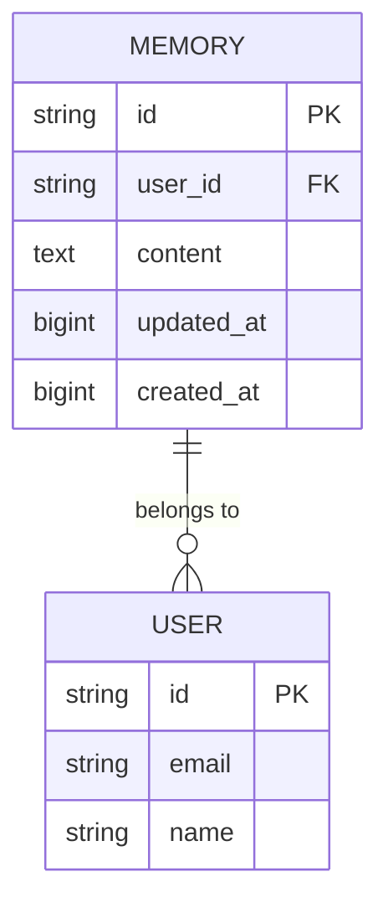
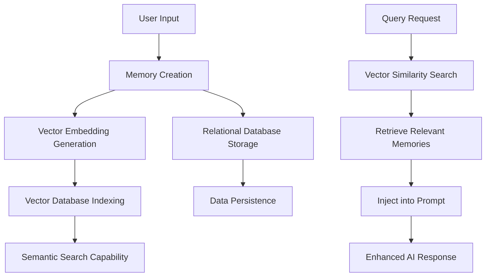
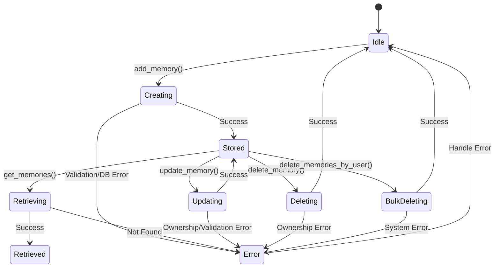
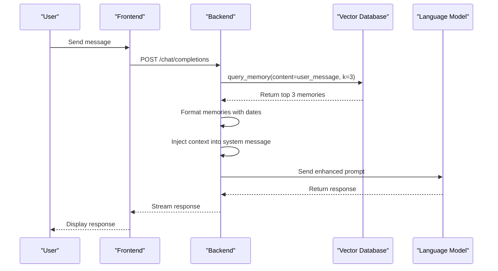
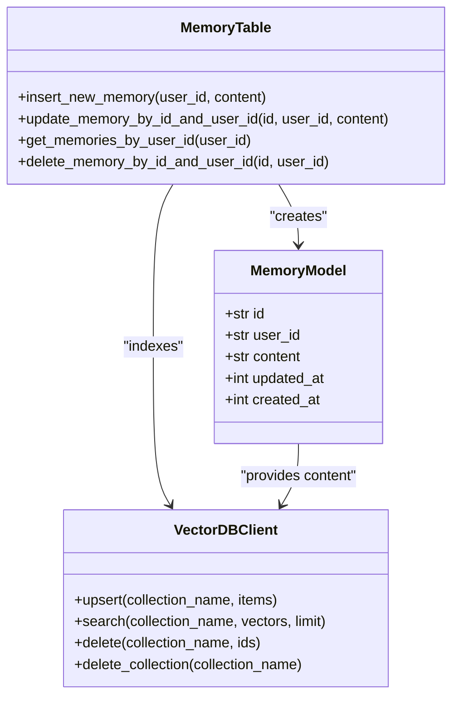
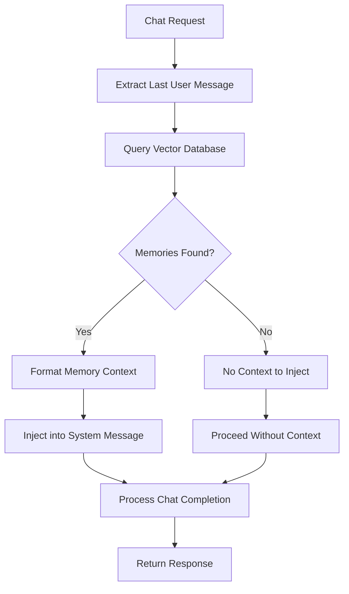

# Memory Data Model

<cite>
**Referenced Files in This Document**   
- [memories.py](file://backend/open_webui/models/memories.py)
- [memories.py](file://backend/open_webui/routers/memories.py)
- [ManageModal.svelte](file://src/lib/components/chat/Settings/Personalization/ManageModal.svelte)
- [middleware.py](file://backend/open_webui/utils/middleware.py)
- [factory.py](file://backend/open_webui/retrieval/vector/factory.py)
- [Personalization.svelte](file://src/lib/components/chat/Settings/Personalization.svelte)
</cite>

## Table of Contents
1. [Introduction](#introduction)
2. [Memory Entity Schema](#memory-entity-schema)
3. [Field Definitions](#field-definitions)
4. [Data Storage and Indexing](#data-storage-and-indexing)
5. [Memory Lifecycle Management](#memory-lifecycle-management)
6. [User Controls and Interface](#user-controls-and-interface)
7. [Context Injection and Prompt Engineering](#context-injection-and-prompt-engineering)
8. [Vector Database Integration](#vector-database-integration)
9. [Privacy and Security Considerations](#privacy-and-security-considerations)
10. [Sample Memory Entries](#sample-memory-entries)
11. [Integration with Chat System](#integration-with-chat-system)
12. [Conclusion](#conclusion)

## Introduction

The Memory entity in the open-webui application serves as a persistent storage mechanism for user-specific contextual information that enhances AI interactions. This data model enables the system to maintain personalized knowledge across conversations, allowing for more relevant and tailored responses from language models. The memory system combines traditional database storage with vector database indexing to enable both persistent storage and semantic retrieval capabilities.

The memory functionality is designed as an experimental feature that allows users to store personal information, preferences, and important facts that can be referenced during AI conversations. This documentation provides a comprehensive overview of the memory data model, including its schema, implementation details, user interface, and integration with the chat system.

**Section sources**
- [Personalization.svelte](file://src/lib/components/chat/Settings/Personalization.svelte#L1-L46)
- [memories.py](file://backend/open_webui/models/memories.py#L1-L32)

## Memory Entity Schema

The Memory entity is implemented as a database table with a straightforward schema designed to store user-specific contextual information. The schema includes fields for the memory content, user identification, and temporal metadata for tracking creation and modification times.



**Diagram sources**
- [memories.py](file://backend/open_webui/models/memories.py#L14-L22)
- [users.py](file://backend/open_webui/models/users.py#L63-L75)

The Memory table is defined with the following structure:
- **id**: Primary key, unique identifier for each memory entry
- **user_id**: Foreign key linking the memory to a specific user
- **content**: The actual memory text containing contextual information
- **updated_at**: Timestamp of the last modification (epoch time)
- **created_at**: Timestamp of creation (epoch time)

The schema is implemented using SQLAlchemy ORM in the backend, with corresponding Pydantic models for data validation and serialization. The memory table was added to the database schema through migration script `008_add_memory.py`, indicating it was the eighth major schema change in the application's evolution.

**Section sources**
- [memories.py](file://backend/open_webui/models/memories.py#L14-L32)
- [7e5b5dc7342b_init.py](file://backend/open_webui/migrations/versions/7e5b5dc7342b_init.py#L107-L116)

## Field Definitions

### id
- **Type**: String
- **Constraints**: Primary Key, Unique
- **Description**: A UUID4-generated unique identifier for each memory entry. This serves as the primary key for the memory record and is used for referencing the memory in API operations and vector database entries.

### user_id
- **Type**: String
- **Constraints**: None (but functions as a foreign key)
- **Description**: The identifier of the user who owns this memory. This field establishes the ownership relationship between memories and users, ensuring that users can only access and modify their own memories. The user_id corresponds to the id field in the User table.

### content
- **Type**: Text
- **Constraints**: None
- **Description**: The actual content of the memory, stored as plain text. This field contains the contextual information that the user wants the AI to remember, such as personal preferences, important facts, or recurring topics of interest. There are no length restrictions at the database level, allowing for both short notes and longer contextual descriptions.

### updated_at
- **Type**: BigInteger
- **Constraints**: None
- **Description**: A Unix timestamp (in seconds) representing when the memory was last modified. This field is automatically updated whenever the memory content is changed, allowing the system to track the recency of information and potentially prioritize more recent memories during retrieval.

### created_at
- **Type**: BigInteger
- **Constraints**: None
- **Description**: A Unix timestamp (in seconds) representing when the memory was initially created. This field provides historical context about when the information was first stored, which can be useful for understanding the timeline of user information.

**Section sources**
- [memories.py](file://backend/open_webui/models/memories.py#L17-L21)
- [memories.py](file://backend/open_webui/models/memories.py#L25-L29)

## Data Storage and Indexing

The memory system employs a dual-storage approach that combines relational database persistence with vector database indexing for efficient semantic retrieval. This hybrid architecture ensures data durability while enabling fast, context-aware memory retrieval.

The primary storage is in a relational database table named "memory" with the schema described above. All CRUD operations for memories are performed through this database, ensuring ACID compliance and data integrity. The backend implementation uses SQLAlchemy for database operations, providing a robust ORM layer for memory management.

For efficient semantic search and retrieval, memories are also indexed in a vector database. Each memory is converted to a vector embedding using the application's configured embedding function and stored in a collection named "user-memory-{user_id}". This allows the system to perform similarity searches based on the semantic content of user queries.



**Diagram sources**
- [memories.py](file://backend/open_webui/models/memories.py#L40-L65)
- [memories.py](file://backend/open_webui/routers/memories.py#L55-L67)

The vector database client is configured through the application's settings, supporting multiple vector database backends including Qdrant, Milvus, Pinecone, and others. The specific vector database implementation is abstracted through a factory pattern in `factory.py`, allowing for flexible configuration without changing the core memory logic.

**Section sources**
- [memories.py](file://backend/open_webui/routers/memories.py#L55-L67)
- [factory.py](file://backend/open_webui/retrieval/vector/factory.py#L1-L79)

## Memory Lifecycle Management

The memory lifecycle is managed through a comprehensive set of operations that handle creation, retrieval, updating, and deletion of memory entries. These operations ensure data consistency across both the relational database and vector index.

### Creation
When a new memory is created:
1. A UUID4 identifier is generated
2. The current timestamp is recorded for both created_at and updated_at
3. The memory is inserted into the relational database
4. An embedding is generated from the content
5. The memory is indexed in the user's vector database collection

### Updating
When a memory is updated:
1. The system verifies ownership (user_id matches)
2. The content is modified in the relational database
3. The updated_at timestamp is refreshed
4. The vector embedding is regenerated
5. The vector database entry is upserted with the new content and embedding

### Deletion
Memories can be deleted individually or in bulk:
- Individual deletion removes the memory from both the relational database and vector index
- Bulk deletion by user_id clears all memories for a user and deletes the entire vector collection
- The system includes safeguards to prevent unauthorized access to memories belonging to other users



**Diagram sources**
- [memories.py](file://backend/open_webui/models/memories.py#L40-L144)
- [memories.py](file://backend/open_webui/routers/memories.py#L47-L212)

The memory lifecycle operations are exposed through a REST API with endpoints for adding, querying, updating, and deleting memories. The API includes proper error handling and authentication to ensure secure access to memory data.

**Section sources**
- [memories.py](file://backend/open_webui/models/memories.py#L39-L147)
- [memories.py](file://backend/open_webui/routers/memories.py#L29-L212)

## User Controls and Interface

Users interact with the memory system through a dedicated interface in the application's settings, specifically in the Personalization section. The interface provides comprehensive controls for managing personal memories.

The memory management interface includes the following features:
- **View Memories**: A table displaying all user memories with their content and last modified date
- **Add Memory**: A form to create new memory entries
- **Edit Memory**: Inline editing capability for existing memories
- **Delete Memory**: Option to remove individual memories
- **Clear All Memories**: Function to delete all memories at once
- **Toggle Memory Feature**: Enable/disable the memory functionality

```mermaid
flowchart TD
A[Personalization Settings] --> B{Memory Enabled?}
B --> |Yes| C[Manage Memories Button]
B --> |No| D[Enable Memory Switch]
C --> E[Memory Management Modal]
E --> F[Memory List Table]
F --> G[Add Memory Button]
F --> H[Edit Memory Button]
F --> I[Delete Memory Button]
F --> J[Clear All Button]
G --> K[Add Memory Modal]
H --> L[Edit Memory Modal]
I --> M[Confirmation Dialog]
J --> N[Clear Confirmation Dialog]
K --> O[Save New Memory]
L --> P[Update Existing Memory]
M --> Q[Delete Single Memory]
N --> R[Delete All Memories]
O --> S[API: POST /memories/add]
P --> T[API: POST /{memory_id}/update]
Q --> U[API: DELETE /{memory_id}]
R --> V[API: DELETE /delete/user]
```

**Diagram sources**
- [ManageModal.svelte](file://src/lib/components/chat/Settings/Personalization/ManageModal.svelte#L1-L230)
- [memories.py](file://backend/open_webui/routers/memories.py#L47-L212)

The frontend implementation uses Svelte components to provide a responsive interface, with API calls to the backend endpoints for all memory operations. The interface displays memories in a table format with the content and last modified date, allowing users to easily review and manage their stored context.

**Section sources**
- [ManageModal.svelte](file://src/lib/components/chat/Settings/Personalization/ManageModal.svelte#L1-L230)
- [Personalization.svelte](file://src/lib/components/chat/Settings/Personalization.svelte#L1-L97)

## Context Injection and Prompt Engineering

The primary purpose of the memory system is to enhance AI interactions by injecting relevant user context into prompts. This is achieved through a middleware process that retrieves and formats memories before they are included in the conversation with the language model.

When a chat request is processed, the system performs the following steps:
1. Extract the most recent user message as the query
2. Search for relevant memories using semantic similarity
3. Format retrieved memories with metadata
4. Inject the formatted context into the system message
5. Proceed with the normal chat completion process



**Diagram sources**
- [middleware.py](file://backend/open_webui/utils/middleware.py#L517-L553)
- [memories.py](file://backend/open_webui/routers/memories.py#L82-L98)

The context injection process formats memories with their creation dates and presents them in a structured format within the system message. For example:

```
User Context:
1. [2023-12-15] I prefer concise responses and dislike verbose explanations.
2. [2023-12-20] I recently adopted a golden retriever puppy named Buddy.
3. [2024-01-05] I'm currently working on a machine learning project about sentiment analysis.
```

This formatted context is prepended to the conversation, allowing the language model to incorporate the user's personal information into its responses. The system retrieves the top 3 most relevant memories based on semantic similarity to the current query, ensuring that the most pertinent context is included without overwhelming the model with excessive information.

**Section sources**
- [middleware.py](file://backend/open_webui/utils/middleware.py#L517-L553)
- [task.py](file://backend/open_webui/utils/task.py#L193-L227)

## Vector Database Integration

The memory system integrates with a vector database to enable semantic search capabilities, allowing memories to be retrieved based on conceptual similarity rather than exact keyword matching. This integration is crucial for effective context retrieval during conversations.

The vector database integration works as follows:
1. When a memory is created or updated, its content is passed through an embedding function
2. The resulting vector embedding is stored in the vector database along with the original text and metadata
3. During query time, the user's message is similarly embedded and used to search for similar memories
4. The most similar memories are retrieved and injected into the prompt



**Diagram sources**
- [memories.py](file://backend/open_webui/models/memories.py#L14-L32)
- [memories.py](file://backend/open_webui/routers/memories.py#L55-L67)
- [factory.py](file://backend/open_webui/retrieval/vector/factory.py#L10-L79)

The system supports multiple vector database backends through a factory pattern, with the specific implementation determined by the VECTOR_DB configuration setting. The vector database client is initialized at application startup and made available as a global variable (VECTOR_DB_CLIENT) for use across the application.

Each user has their own isolated vector database collection named "user-memory-{user_id}", ensuring data privacy and preventing cross-user contamination. This collection contains documents with the memory ID, text content, vector embedding, and metadata (including creation and update timestamps).

The embedding function is accessed through the application state (request.app.state.EMBEDDING_FUNCTION), allowing for flexible configuration of the embedding model. This function converts text content into high-dimensional vectors that capture semantic meaning, enabling the system to find conceptually related memories even when the exact words don't match.

**Section sources**
- [memories.py](file://backend/open_webui/routers/memories.py#L55-L212)
- [factory.py](file://backend/open_webui/retrieval/vector/factory.py#L1-L79)

## Privacy and Security Considerations

The memory system incorporates several privacy and security measures to protect user data and ensure appropriate access controls.

### Access Control
- All memory operations require user authentication
- Users can only access memories belonging to their own user_id
- The API verifies ownership before allowing read, update, or delete operations
- Memory data is not shared between users

### Data Isolation
- Each user's memories are stored separately in the database
- Vector database collections are isolated by user_id
- No cross-user queries are possible through the API

### Security Measures
- Memory content is treated as sensitive user data
- The system prevents direct access to memories belonging to other users
- Bulk deletion operations are protected by confirmation dialogs in the UI
- The experimental nature of the feature is clearly indicated to users

### Privacy Implications
Users should be aware that:
- Memories are accessible to the AI during conversations
- The content of memories may influence AI responses
- Memories persist across sessions until explicitly deleted
- Administrators may have access to memory data depending on deployment configuration

The system strikes a balance between providing personalized AI interactions and respecting user privacy. By default, the memory feature is disabled and must be explicitly enabled by the user, giving them control over whether their context is stored and used.

**Section sources**
- [memories.py](file://backend/open_webui/models/memories.py#L74-L76)
- [memories.py](file://backend/open_webui/routers/memories.py#L74-L76)
- [Personalization.svelte](file://src/lib/components/chat/Settings/Personalization.svelte#L37-L39)

## Sample Memory Entries

The following examples illustrate different types of contextual information that users might store in the memory system:

### Personal Preferences
```
I prefer responses that are concise and to the point, avoiding unnecessary elaboration. When providing code examples, please include comments to explain key concepts.
```

### Important Life Events
```
I recently adopted a golden retriever puppy named Buddy. He's 8 weeks old and requires frequent walks and training. I'm looking for pet care advice and training tips.
```

### Professional Context
```
I'm currently working on a machine learning project focused on sentiment analysis of social media data. The project uses Python, TensorFlow, and Hugging Face transformers.
```

### Technical Specifications
```
My development environment uses Ubuntu 22.04, Python 3.10, and VS Code. I prefer using virtual environments for Python projects and typically structure my projects with separate src, tests, and docs directories.
```

### Recurring Topics
```
I'm interested in learning more about renewable energy technologies, particularly solar panel efficiency improvements and battery storage solutions for home use.
```

These sample entries demonstrate how users can store various types of contextual information that would help the AI provide more relevant and personalized responses. The system does not enforce any particular structure on memory content, allowing users to store information in their preferred format.

**Section sources**
- [ManageModal.svelte](file://src/lib/components/chat/Settings/Personalization/ManageModal.svelte#L100-L101)

## Integration with Chat System

The memory system is tightly integrated with the chat functionality through middleware that automatically retrieves and injects relevant context during conversation processing. This integration ensures that user memories are seamlessly incorporated into AI interactions without requiring manual intervention.

The integration process follows these steps:
1. When a chat request is received, the middleware extracts the most recent user message
2. This message is used as a query to search for relevant memories in the vector database
3. The top k most similar memories are retrieved (currently k=3)
4. These memories are formatted with their creation dates and organized into a context block
5. The context block is injected into the system message of the conversation
6. The enhanced conversation is passed to the language model for processing



**Diagram sources**
- [middleware.py](file://backend/open_webui/utils/middleware.py#L517-L553)
- [chat.py](file://backend/open_webui/utils/chat.py#L171-L331)

The integration is implemented in the `chat_memory_handler` function in `middleware.py`, which is part of the request processing pipeline. This function is called during the preprocessing stage of chat requests, ensuring that context injection occurs before the message reaches the language model.

The system retrieves a limited number of memories (currently 3) to prevent context overflow and maintain optimal performance. Memories are ranked by semantic similarity to the current query, ensuring that the most relevant context is prioritized. The creation date of each memory is included in the injected context, providing temporal information that can help the AI assess the recency and relevance of the information.

This integration enables stateful conversations where the AI can maintain awareness of user-specific context across multiple interactions, creating a more personalized and coherent experience.

**Section sources**
- [middleware.py](file://backend/open_webui/utils/middleware.py#L517-L553)
- [chat.py](file://backend/open_webui/utils/chat.py#L171-L331)

## Conclusion

The Memory entity in the open-webui application provides a sophisticated mechanism for storing and utilizing user-specific context to enhance AI interactions. By combining relational database storage with vector database indexing, the system achieves both data persistence and efficient semantic retrieval.

Key features of the memory system include:
- A simple yet effective schema for storing user context
- Dual storage in both relational and vector databases
- Comprehensive CRUD operations with proper access controls
- Seamless integration with the chat system for automatic context injection
- User-friendly interface for managing personal memories
- Privacy-conscious design with user-controlled enablement

The system enables personalized AI interactions by allowing users to store important information, preferences, and context that can be referenced during conversations. This creates a more natural and helpful experience, as the AI can maintain awareness of user-specific details across sessions.

Future enhancements could include memory expiration settings, context tagging, and more sophisticated relevance scoring. However, the current implementation provides a solid foundation for personalized AI interactions while maintaining data privacy and system performance.

**Section sources**
- [memories.py](file://backend/open_webui/models/memories.py#L1-L148)
- [memories.py](file://backend/open_webui/routers/memories.py#L1-L213)
- [middleware.py](file://backend/open_webui/utils/middleware.py#L517-L553)