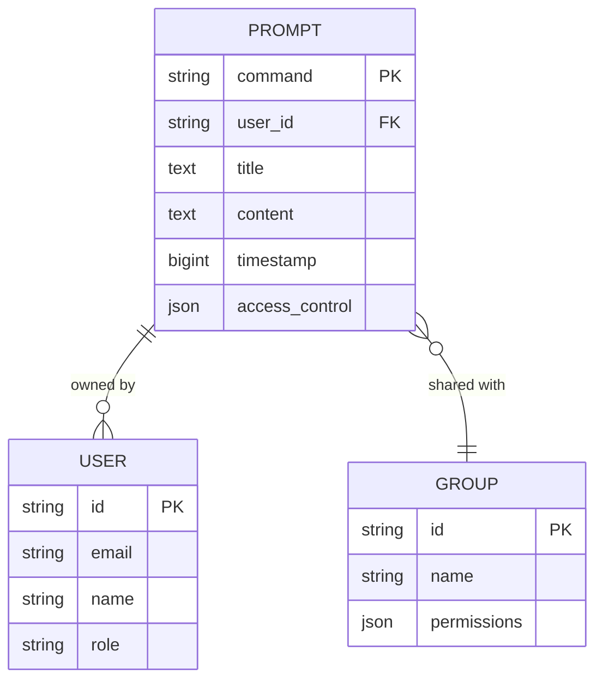
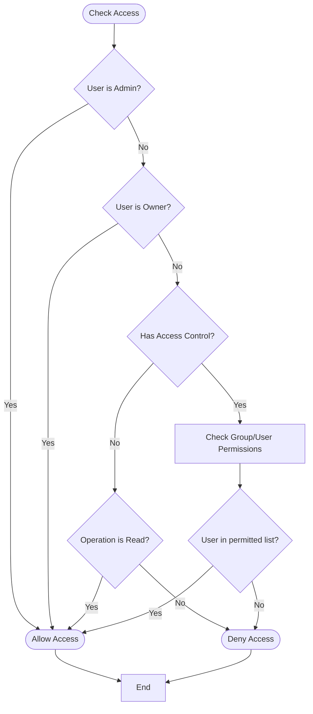
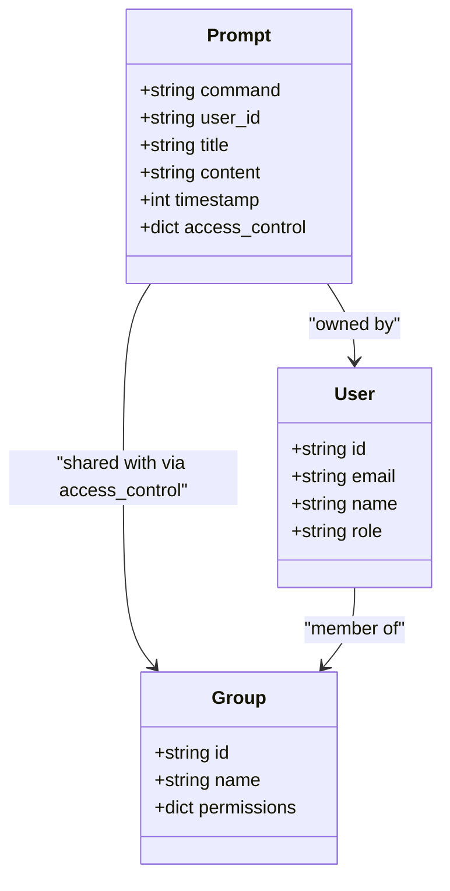

# Prompt Data Model

<cite>
**Referenced Files in This Document**   
- [prompts.py](file://backend/open_webui/models/prompts.py)
- [prompts.py](file://backend/open_webui/routers/prompts.py)
- [index.ts](file://src/lib/apis/prompts/index.ts)
- [PromptEditor.svelte](file://src/lib/components/workspace/Prompts/PromptEditor.svelte)
- [AccessControl.svelte](file://src/lib/components/workspace/common/AccessControl.svelte)
- [access_control.py](file://backend/open_webui/utils/access_control.py)
- [users.py](file://backend/open_webui/models/users.py)
- [groups.py](file://backend/open_webui/models/groups.py)
- [7e5b5dc7342b_init.py](file://backend/open_webui/migrations/versions/7e5b5dc7342b_init.py)
</cite>

## Table of Contents
1. [Introduction](#introduction)
2. [Core Fields](#core-fields)
3. [Data Schema](#data-schema)
4. [Access Control and Sharing](#access-control-and-sharing)
5. [Ownership and Relationships](#ownership-and-relationships)
6. [UI Management](#ui-management)
7. [Search and Integration](#search-and-integration)
8. [Personal vs Global Prompts](#personal-vs-global-prompts)
9. [Sample Prompt Entries](#sample-prompt-entries)

## Introduction
The Prompt entity in the open-webui application serves as a reusable template system for AI interactions, enabling users to create, share, and manage standardized prompts for consistent AI responses. Prompts are stored as structured templates with metadata that includes content, name, description, tags, and sharing status. The system supports both personal prompts for individual use and shared prompts that can be accessed by specific users or groups. Prompts are activated in chat interactions by typing their command prefix (e.g., "/summarize"), making them easily accessible during conversations. The prompt system is integrated throughout the application, appearing in the prompt library, chat interface, and workspace management tools.

**Section sources**
- [prompts.py](file://backend/open_webui/models/prompts.py#L18-L44)
- [PromptEditor.svelte](file://src/lib/components/workspace/Prompts/PromptEditor.svelte#L1-L202)

## Core Fields
The Prompt entity contains several core fields that define its functionality and metadata. The command field serves as the primary identifier and activation mechanism, functioning as the primary key in the database. This command is used to trigger the prompt in chat interactions by prefixing it with a forward slash (e.g., "/summarize"). The title field provides a human-readable name for the prompt, while the content field stores the actual prompt text that will be sent to the AI model. The timestamp field records when the prompt was created or last updated, stored as an epoch timestamp in seconds. Each prompt is associated with a user_id that establishes ownership and enables user-specific filtering and access control. These fields work together to create a comprehensive prompt template that can be easily identified, activated, and managed within the application.

**Section sources**
- [prompts.py](file://backend/open_webui/models/prompts.py#L18-L30)
- [PromptEditor.svelte](file://src/lib/components/workspace/Prompts/PromptEditor.svelte#L23-L26)

## Data Schema
The Prompt entity is implemented as a database table with a well-defined schema that supports efficient querying and relationship management. The schema is defined in the SQLAlchemy ORM with the following structure: the command field is a String column serving as the primary key, ensuring each prompt command is unique across the system. The user_id field is a String column that references the user who created the prompt, establishing ownership. The title and content fields are Text columns that store the prompt's metadata and body respectively, with the content field capable of storing extensive prompt text. The timestamp field is a BigInteger that stores Unix epoch time, providing chronological ordering of prompts. An access_control JSON field enables flexible sharing permissions, allowing prompts to be private, public, or shared with specific users and groups. This schema is created and managed through Alembic migrations, with the initial schema defined in the 7e5b5dc7342b_init.py migration file, ensuring consistent database structure across deployments.



**Diagram sources **
- [prompts.py](file://backend/open_webui/models/prompts.py#L18-L30)
- [7e5b5dc7342b_init.py](file://backend/open_webui/migrations/versions/7e5b5dc7342b_init.py#L132-L141)
- [users.py](file://backend/open_webui/models/users.py#L45-L76)

## Access Control and Sharing
The prompt system implements a sophisticated access control mechanism that determines who can view and modify prompts. The access_control field in the Prompt schema defines sharing permissions using a JSON structure that specifies read and write access for users and groups. When access_control is null, the prompt is public and available to all users with the "user" role. When access_control is an empty object, the prompt is private and restricted exclusively to the owner. Custom access control rules can specify group_ids and user_ids for both read and write permissions, enabling granular sharing. The has_access function in access_control.py evaluates these rules by checking if the requesting user is the owner, has explicit permission, or is an administrator. The AccessControl.svelte component in the frontend provides a user interface for managing these permissions, allowing users to set visibility to public or private and specify which groups and users have access. This system ensures that prompts can be securely shared within teams while maintaining privacy for sensitive templates.



**Diagram sources **
- [prompts.py](file://backend/open_webui/models/prompts.py#L27-L43)
- [access_control.py](file://backend/open_webui/utils/access_control.py#L124-L150)
- [AccessControl.svelte](file://src/lib/components/workspace/common/AccessControl.svelte#L1-L156)

## Ownership and Relationships
The Prompt entity maintains clear ownership and relationships through its association with users and groups. Each prompt is owned by a specific user, identified by the user_id field that references the User table. This ownership model enables user-specific prompt management, allowing users to view, edit, and delete only their own prompts unless they have appropriate sharing permissions. The relationship between prompts and users is one-to-many, with each user potentially owning multiple prompts. The access_control field establishes relationships with groups by storing group_ids that have permission to access the prompt. The Groups model provides methods to retrieve groups by member ID, enabling the system to determine which shared prompts a user can access based on their group memberships. This relationship structure supports both personal prompts for individual use and collaborative prompts shared within teams, creating a flexible system for prompt management across different organizational structures.



**Diagram sources **
- [prompts.py](file://backend/open_webui/models/prompts.py#L18-L44)
- [users.py](file://backend/open_webui/models/users.py#L45-L76)
- [groups.py](file://backend/open_webui/models/groups.py#L156-L241)

## UI Management
Prompts are managed through a comprehensive user interface that supports creation, editing, and organization. The PromptEditor.svelte component provides a form for creating and modifying prompts, with fields for title, command, and content. The command is automatically generated from the title using slugify function but can be manually edited. The editor includes a visibility control that allows users to set access permissions through the AccessControlModal component. Prompts can be created through the workspace interface at /workspace/prompts/create, where the PromptEditor is embedded in a page that handles form submission and navigation. The prompt list view displays all accessible prompts with options to edit, clone, export, or delete. The UI enforces validation rules, such as restricting command strings to alphanumeric characters, hyphens, and underscores. The frontend APIs in index.ts handle communication with the backend, using functions like createNewPrompt and updatePromptByCommand to manage prompt lifecycle operations through REST endpoints.

**Section sources**
- [PromptEditor.svelte](file://src/lib/components/workspace/Prompts/PromptEditor.svelte#L1-L202)
- [create/+page.svelte](file://src/routes/(app)/workspace/prompts/create/+page.svelte#L1-L57)
- [index.ts](file://src/lib/apis/prompts/index.ts#L1-L204)

## Search and Integration
Prompts are integrated into the chat interface and searchable through the application's search functionality. In chat interactions, prompts are activated by typing their command prefix followed by the command name (e.g., "/summarize"). The system supports variable substitution in prompts using double curly braces (e.g., "{{topic}}"), allowing dynamic content insertion during AI interactions. The prompt library is accessible from the workspace, where users can browse, search, and filter prompts. The getPrompts and getPromptList API endpoints retrieve prompts for display in the UI, with access control applied to ensure users only see prompts they have permission to view. The frontend stores maintain a cache of prompts for quick access, with the prompts store in index.ts holding the current list of available prompts. This integration enables seamless transition from prompt creation to usage, making reusable templates readily available during conversations and enhancing consistency in AI interactions.

**Section sources**
- [PromptEditor.svelte](file://src/lib/components/workspace/Prompts/PromptEditor.svelte#L165-L172)
- [prompts.py](file://backend/open_webui/routers/prompts.py#L22-L39)
- [index.ts](file://src/lib/apis/prompts/index.ts#L42-L71)

## Personal vs Global Prompts
The system distinguishes between personal and global prompts through its access control mechanism rather than separate entity types. Personal prompts are those with restricted access, typically set to private (empty access_control object) or shared only with specific individuals. These prompts appear only to the owner and designated users in the prompt library. Global prompts are those with public access (null access_control) or shared with broad groups, making them available to all users with appropriate permissions. Administrators can bypass access control through the BYPASS_ADMIN_ACCESS_CONTROL setting, allowing them to view all prompts regardless of sharing status. The get_prompts_by_user_id method in the PromptsTable class implements this distinction by filtering prompts based on the user's ID and their group memberships. This approach provides flexibility in prompt sharing while maintaining security, allowing organizations to establish both private templates for individual use and standardized templates for team-wide consistency.

**Section sources**
- [prompts.py](file://backend/open_webui/models/prompts.py#L128-L139)
- [prompts.py](file://backend/open_webui/routers/prompts.py#L23-L38)
- [access_control.py](file://backend/open_webui/utils/access_control.py#L124-L150)

## Sample Prompt Entries
The following examples illustrate different prompt use cases within the system:

**Content Summarization Prompt**
- Command: /summarize
- Title: Content Summarization
- Content: "Write a summary in 50 words that summarizes {{topic}}."
- Access Control: Public (null)
- Use Case: General content summarization for articles, documents, or discussions

**Code Explanation Prompt**
- Command: /explain-code
- Title: Code Explanation
- Content: "Explain the following code in simple terms:\n\n```{{language}}\n{{code}}\n```\n\nProvide a step-by-step explanation of what this code does and how it works."
- Access Control: Shared with Development Team (specific group_ids)
- Use Case: Helping team members understand complex code snippets

**Meeting Notes Prompt**
- Command: /meeting-notes
- Title: Meeting Notes Formatter
- Content: "Format the following meeting notes with clear sections for decisions, action items, and discussion points:\n\n{{notes}}\n\nEnsure action items include responsible persons and deadlines."
- Access Control: Private (empty object)
- Use Case: Personal template for organizing meeting notes consistently

These examples demonstrate how prompts serve as reusable templates that standardize AI interactions while supporting variable substitution for dynamic content.

**Section sources**
- [PromptEditor.svelte](file://src/lib/components/workspace/Prompts/PromptEditor.svelte#L157-L172)
- [prompts.py](file://backend/open_webui/models/prompts.py#L65-L70)