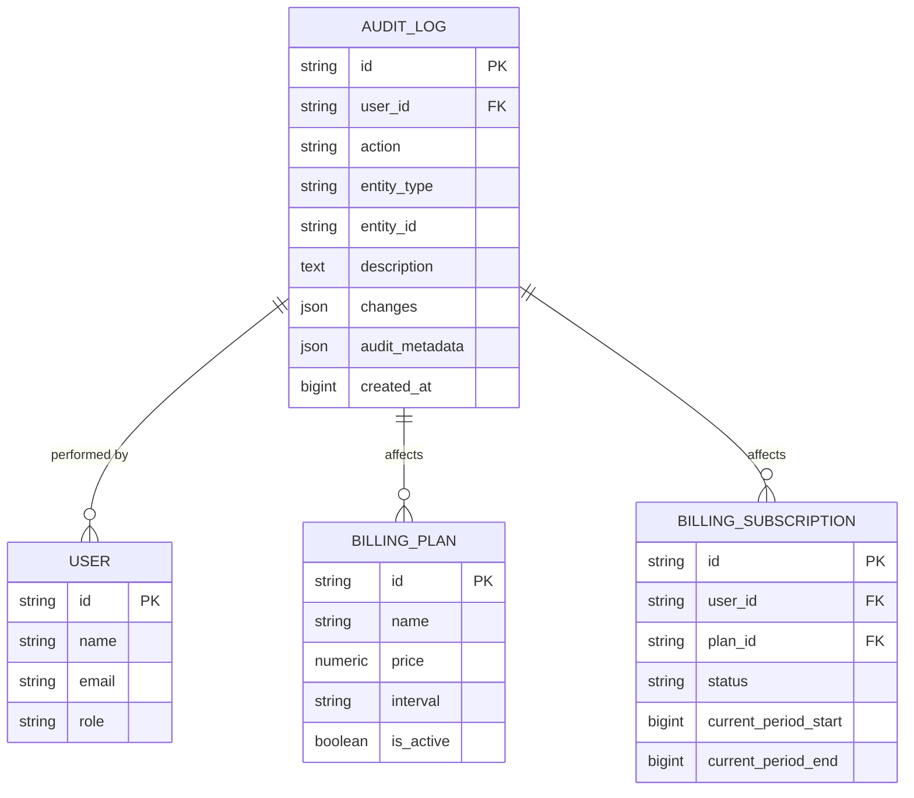
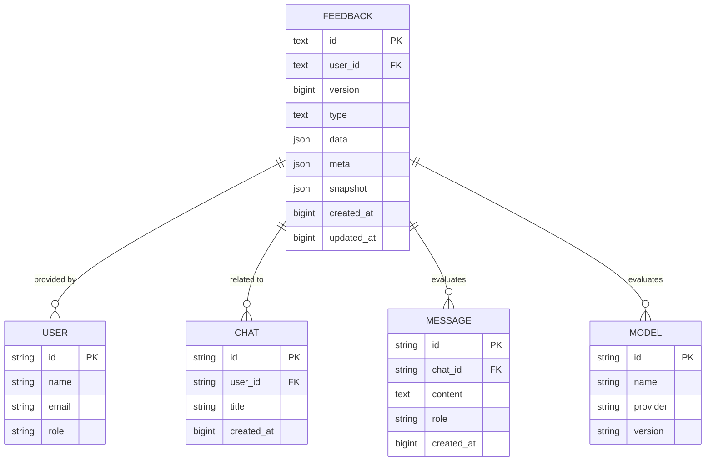
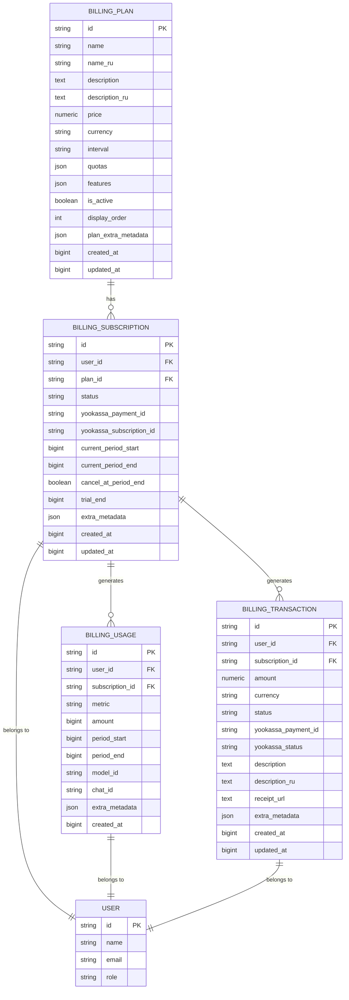
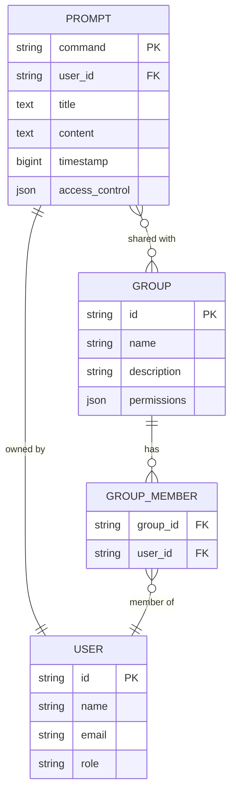
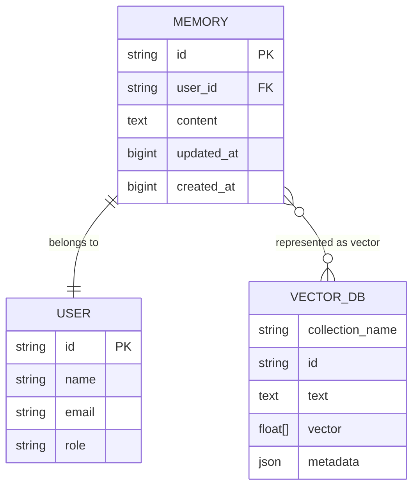
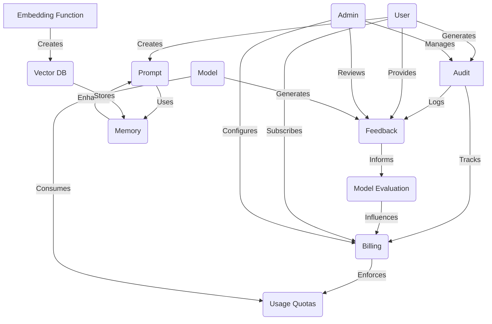

# System and Metadata Data Model

<cite>
**Referenced Files in This Document**   
- [audit.py](file://backend/open_webui/models/audit.py)
- [feedbacks.py](file://backend/open_webui/models/feedbacks.py)
- [billing.py](file://backend/open_webui/models/billing.py)
- [prompts.py](file://backend/open_webui/models/prompts.py)
- [memories.py](file://backend/open_webui/models/memories.py)
- [b2f8a9c1d5e3_add_billing_tables.py](file://backend/open_webui/migrations/versions/b2f8a9c1d5e3_add_billing_tables.py)
- [af906e964978_add_feedback_table.py](file://backend/open_webui/migrations/versions/af906e964978_add_feedback_table.py)
- [008_add_memory.py](file://backend/open_webui/internal/migrations/008_add_memory.py)
- [evaluations.py](file://backend/open_webui/routers/evaluations.py)
- [billing.py](file://backend/open_webui/utils/billing.py)
- [prompts.py](file://backend/open_webui/routers/prompts.py)
- [memories.py](file://backend/open_webui/routers/memories.py)
- [access_control.py](file://backend/open_webui/utils/access_control.py)
</cite>

## Table of Contents
1. [Introduction](#introduction)
2. [Audit Data Model](#audit-data-model)
3. [Feedback Data Model](#feedback-data-model)
4. [Billing Data Model](#billing-data-model)
5. [Prompt Data Model](#prompt-data-model)
6. [Memory Data Model](#memory-data-model)
7. [Data Model Integration](#data-model-integration)
8. [Data Retention Policies](#data-retention-policies)
9. [Conclusion](#conclusion)

## Introduction
This document provides comprehensive documentation for the system metadata entities in the open-webui application. The metadata entities include Audit, Feedback, Billing, Prompt, and Memory, which enhance the core functionality of the application by providing administrative tracking, user feedback collection, subscription management, reusable templates, and user-specific context retention. These entities are implemented as database models with specific fields and relationships that support the application's features.

**Section sources**
- [audit.py](file://backend/open_webui/models/audit.py#L1-L137)
- [feedbacks.py](file://backend/open_webui/models/feedbacks.py#L1-L341)
- [billing.py](file://backend/open_webui/models/billing.py#L1-L524)
- [prompts.py](file://backend/open_webui/models/prompts.py#L1-L168)
- [memories.py](file://backend/open_webui/models/memories.py#L1-L148)

## Audit Data Model

The Audit data model is designed to track administrative actions within the open-webui application, providing a comprehensive log of changes made to critical system components such as billing plans and subscriptions. This model serves as a security and compliance mechanism, allowing administrators to monitor and review all significant modifications to the system.

The AuditLog entity contains several key fields that capture essential information about each auditable action. The `user_id` field identifies which user performed the action, while the `action` field specifies the type of action taken (e.g., plan_created, plan_updated, plan_deleted). The `entity_type` and `entity_id` fields together identify the specific resource that was affected by the action, allowing for precise tracking of changes to individual entities. Additional details about the action are stored in the `description`, `changes`, and `audit_metadata` fields, with the `changes` field specifically capturing the before-and-after state of modified attributes in a structured JSON format.

The model includes comprehensive indexing on key fields (`user_id`, `entity_type`, `entity_id`, and `created_at`) to ensure efficient querying and reporting capabilities. This allows administrators to quickly retrieve audit logs filtered by user, entity type, time period, or specific actions, making it easier to investigate incidents or generate compliance reports.



**Diagram sources**
- [audit.py](file://backend/open_webui/models/audit.py#L34-L56)
- [billing.py](file://backend/open_webui/models/billing.py#L54-L141)
- [b2f8a9c1d5e3_add_billing_tables.py](file://backend/open_webui/migrations/versions/b2f8a9c1d5e3_add_billing_tables.py#L18-L168)

### Sample Audit Data
```json
{
  "id": "a1b2c3d4-e5f6-7890-g1h2-i3j4k5l6m7n8",
  "user_id": "u9v8w7x6-y5z4-3210-a9b8-c7d6e5f4g3h2",
  "action": "plan_updated",
  "entity_type": "plan",
  "entity_id": "p1q2r3s4-t5u6-7890-v1w2-x3y4z5a6b7c8",
  "description": "Updated price and quotas for Pro plan",
  "changes": {
    "price": {
      "old": 990,
      "new": 1490
    },
    "quotas": {
      "old": {
        "tokens_input": 1000000,
        "tokens_output": 500000
      },
      "new": {
        "tokens_input": 2000000,
        "tokens_output": 1000000
      }
    }
  },
  "audit_metadata": {
    "ip_address": "192.168.1.100",
    "user_agent": "Mozilla/5.0 (Windows NT 10.0; Win64; x64) AppleWebKit/537.36"
  },
  "created_at": 1735689200
}
```

**Section sources**
- [audit.py](file://backend/open_webui/models/audit.py#L34-L137)

## Feedback Data Model

The Feedback data model captures user ratings and evaluations of AI-generated responses, serving as a critical component for model evaluation and improvement. This model is designed to collect structured feedback that can be analyzed to assess model performance, identify areas for improvement, and inform future development decisions.

The Feedback entity includes several key fields that capture different aspects of user feedback. The `user_id` field identifies the user who provided the feedback, while the `type` field categorizes the feedback (e.g., "rating" for message ratings). The `data` field contains the core feedback information in JSON format, including the user's rating, the model ID being evaluated, and any comments or reasons for the rating. The `meta` field stores contextual information about the feedback, such as the associated chat and message IDs, which enables linking feedback to specific interactions. The `snapshot` field preserves a copy of the relevant chat context at the time of feedback, ensuring that the evaluation can be understood in its proper context even if the original chat is later modified.

The model supports flexible querying through its database indexes, allowing administrators to retrieve feedback filtered by user, model, rating, or time period. This enables comprehensive analysis of user satisfaction across different models and over time. The feedback system is integrated with the application's evaluation features, allowing administrators to configure which models are included in evaluation arenas and analyze comparative performance metrics.



**Diagram sources**
- [feedbacks.py](file://backend/open_webui/models/feedbacks.py#L22-L32)
- [af906e964978_add_feedback_table.py](file://backend/open_webui/migrations/versions/af906e964978_add_feedback_table.py#L19-L52)
- [evaluations.py](file://backend/open_webui/routers/evaluations.py#L61-L179)

### Sample Feedback Data
```json
{
  "id": "f1g2h3i4-j5k6-7890-l1m2-n3o4p5q6r7s8",
  "user_id": "u9v8w7x6-y5z4-3210-a9b8-c7d6e5f4g3h2",
  "version": 0,
  "type": "rating",
  "data": {
    "rating": 5,
    "model_id": "gpt-4-turbo-2024-04-09",
    "sibling_model_ids": [
      "claude-3-opus-20240229",
      "gemini-pro-20240225"
    ],
    "reason": "Most accurate and helpful response",
    "comment": "The response was comprehensive and directly addressed my question with relevant examples."
  },
  "meta": {
    "arena": true,
    "chat_id": "c1d2e3f4-g5h6-7890-i1j2-k3l4m5n6o7p8",
    "message_id": "m1n2o3p4-q5r6-7890-s1t2-u3v4w5x6y7z8",
    "tags": [
      "accuracy",
      "helpfulness",
      "completeness"
    ]
  },
  "snapshot": {
    "chat": {
      "title": "Research Assistance",
      "messages": [
        {
          "id": "m1n2o3p4-q5r6-7890-s1t2-u3v4w5x6y7z8",
          "role": "user",
          "content": "Explain the concept of quantum entanglement in simple terms.",
          "created_at": 1735689000
        },
        {
          "id": "n2o3p4q5-r6s7-8901-t2u3-v4w5x6y7z8a9",
          "role": "assistant",
          "content": "Quantum entanglement is a phenomenon where two or more particles become linked in such a way that the state of one particle instantly influences the state of the other, no matter how far apart they are...",
          "created_at": 1735689060
        }
      ]
    }
  },
  "created_at": 1735689120,
  "updated_at": 1735689120
}
```

**Section sources**
- [feedbacks.py](file://backend/open_webui/models/feedbacks.py#L22-L341)

## Billing Data Model

The Billing data model manages subscription plans, user subscriptions, usage tracking, and payment transactions, forming the foundation of the application's monetization system. This comprehensive model supports a tiered subscription model with different pricing plans, usage quotas, and payment processing through external providers like YooKassa.

The model consists of four main entities: Plan, Subscription, Usage, and Transaction. The Plan entity defines the available subscription tiers with their pricing, quotas, and features. Each plan has a name, price, billing interval (monthly or annual), and associated quotas for different usage metrics such as input/output tokens, requests, images, and audio minutes. The Subscription entity tracks individual user subscriptions, linking users to specific plans and maintaining their subscription status (active, canceled, trialing, etc.) and billing period.

The Usage entity tracks user consumption of various resources, enabling quota enforcement and usage-based billing. Each usage record captures the metric type, amount consumed, and temporal context (period_start and period_end). This allows the system to calculate current usage against plan quotas and prevent users from exceeding their limits. The Transaction entity records all payment activities, including successful payments, failed attempts, and cancellations, with integration to external payment processors through fields like yookassa_payment_id and receipt_url.



**Diagram sources**
- [billing.py](file://backend/open_webui/models/billing.py#L54-L235)
- [b2f8a9c1d5e3_add_billing_tables.py](file://backend/open_webui/migrations/versions/b2f8a9c1d5e3_add_billing_tables.py#L18-L168)
- [billing.py](file://backend/open_webui/utils/billing.py#L39-L566)

### Sample Billing Data
```json
{
  "plan": {
    "id": "p1q2r3s4-t5u6-7890-v1w2-x3y4z5a6b7c8",
    "name": "Pro",
    "name_ru": "Про",
    "description": "Advanced features for professional users",
    "description_ru": "Расширенные функции для профессиональных пользователей",
    "price": 1490,
    "currency": "RUB",
    "interval": "month",
    "quotas": {
      "tokens_input": 2000000,
      "tokens_output": 1000000,
      "requests": 10000,
      "images": 500,
      "audio_minutes": 60
    },
    "features": [
      "gpt-4",
      "claude-3",
      "api_access",
      "priority_support"
    ],
    "is_active": true,
    "display_order": 1,
    "created_at": 1735680000,
    "updated_at": 1735680000
  },
  "subscription": {
    "id": "s1t2u3v4-w5x6-7890-y1z2-a3b4c5d6e7f8",
    "user_id": "u9v8w7x6-y5z4-3210-a9b8-c7d6e5f4g3h2",
    "plan_id": "p1q2r3s4-t5u6-7890-v1w2-x3y4z5a6b7c8",
    "status": "active",
    "yookassa_payment_id": "pay_1234567890",
    "yookassa_subscription_id": "sub_0987654321",
    "current_period_start": 1735680000,
    "current_period_end": 1738358400,
    "cancel_at_period_end": false,
    "trial_end": null,
    "created_at": 1735680000,
    "updated_at": 1735680000
  },
  "usage": [
    {
      "id": "u1v2w3x4-y5z6-7890-a1b2-c3d4e5f6g7h8",
      "user_id": "u9v8w7x6-y5z4-3210-a9b8-c7d6e5f4g3h2",
      "subscription_id": "s1t2u3v4-w5x6-7890-y1z2-a3b4c5d6e7f8",
      "metric": "tokens_input",
      "amount": 150000,
      "period_start": 1735680000,
      "period_end": 1735680000,
      "model_id": "gpt-4-turbo-2024-04-09",
      "chat_id": "c1d2e3f4-g5h6-7890-i1j2-k3l4m5n6o7p8",
      "created_at": 1735680000
    },
    {
      "id": "v2w3x4y5-z6a7-8901-b2c3-d4e5f6g7h8i9",
      "user_id": "u9v8w7x6-y5z4-3210-a9b8-c7d6e5f4g3h2",
      "subscription_id": "s1t2u3v4-w5x6-7890-y1z2-a3b4c5d6e7f8",
      "metric": "tokens_output",
      "amount": 75000,
      "period_start": 1735680000,
      "period_end": 1735680000,
      "model_id": "gpt-4-turbo-2024-04-09",
      "chat_id": "c1d2e3f4-g5h6-7890-i1j2-k3l4m5n6o7p8",
      "created_at": 1735680000
    }
  ],
  "transaction": {
    "id": "t1u2v3w4-x5y6-7890-z1a2-b3c4d5e6f7g8",
    "user_id": "u9v8w7x6-y5z4-3210-a9b8-c7d6e5f4g3h2",
    "subscription_id": "s1t2u3v4-w5x6-7890-y1z2-a3b4c5d6e7f8",
    "amount": 1490,
    "currency": "RUB",
    "status": "succeeded",
    "yookassa_payment_id": "pay_1234567890",
    "yookassa_status": "succeeded",
    "description": "Subscription: Pro",
    "description_ru": "Подписка: Про",
    "receipt_url": "https://yookassa.ru/receipt/1234567890",
    "created_at": 1735680000,
    "updated_at": 1735680000
  }
}
```

**Section sources**
- [billing.py](file://backend/open_webui/models/billing.py#L54-L524)

## Prompt Data Model

The Prompt data model enables users to create, store, and share reusable templates for AI interactions, enhancing productivity and consistency across conversations. This model supports a flexible access control system that allows prompts to be private, shared with specific users or groups, or made publicly available to all users.

The Prompt entity is identified by a unique command field (e.g., "/research" or "/summarize"), which serves as both the primary key and the trigger for using the prompt in the application interface. Each prompt includes a title, content (the actual template text), and a timestamp of creation or last modification. The core feature of this model is the access_control field, which implements a sophisticated permissions system using JSON to define read and write access for specific users and groups.

The access control system supports three main configurations: when access_control is null, the prompt is public and available to all users with the "user" role; when access_control is an empty object, the prompt is private and restricted exclusively to the owner; and when access_control contains specific permissions, it defines granular access control for reading and writing, allowing for group-based or user-specific restrictions. This flexible system enables organizations to create shared prompt libraries while maintaining appropriate access controls.



**Diagram sources**
- [prompts.py](file://backend/open_webui/models/prompts.py#L18-L27)
- [prompts.py](file://backend/open_webui/routers/prompts.py#L1-L170)
- [access_control.py](file://backend/open_webui/utils/access_control.py#L1-L175)

### Sample Prompt Data
```json
{
  "command": "/research",
  "user_id": "u9v8w7x6-y5z4-3210-a9b8-c7d6e5f4g3h2",
  "title": "Academic Research Assistant",
  "content": "You are an expert academic researcher with extensive experience in scholarly writing and research methodology. When responding to queries:\n\n1. Provide comprehensive, well-structured answers with clear organization\n2. Support claims with evidence and cite sources when possible\n3. Maintain a formal, professional tone appropriate for academic contexts\n4. Break down complex concepts into understandable components\n5. Suggest additional resources or avenues for further research\n\nCurrent query: {{input}}",
  "timestamp": 1735685000,
  "access_control": {
    "read": {
      "group_ids": [
        "g1h2i3j4-k5l6-7890-m1n2-o3p4q5r6s7t8",
        "h2i3j4k5-l6m7-8901-n2o3-p4q5r6s7t8u9"
      ],
      "user_ids": [
        "v8w7x6y5-z4a3-2109-b8c7-d6e5f4g3h2i1"
      ]
    },
    "write": {
      "group_ids": [
        "g1h2i3j4-k5l6-7890-m1n2-o3p4q5r6s7t8"
      ],
      "user_ids": []
    }
  }
}
```

**Section sources**
- [prompts.py](file://backend/open_webui/models/prompts.py#L18-L168)

## Memory Data Model

The Memory data model provides user-specific context retention capabilities, allowing the AI system to remember important information across conversations. This personalized memory system enhances the user experience by enabling the AI to recall preferences, past interactions, and important details, resulting in more coherent and contextually relevant responses over time.

The Memory entity is a simple but powerful structure with a unique identifier, user association, content field for storing the remembered information, and timestamps for creation and last update. Each memory represents a discrete piece of information that the user wants the AI to remember, such as personal preferences ("I prefer concise answers"), important facts ("My project deadline is June 30"), or contextual details ("We're discussing quantum physics concepts").

A key architectural feature of this model is its integration with a vector database for semantic search capabilities. When a memory is created or updated, the system generates an embedding vector using the application's embedding function and stores it in a vector database collection specific to that user. This enables efficient similarity-based retrieval of relevant memories during conversations, allowing the AI to access the most pertinent information based on the current context rather than simply retrieving memories in chronological order.



**Diagram sources**
- [memories.py](file://backend/open_webui/models/memories.py#L14-L22)
- [008_add_memory.py](file://backend/open_webui/internal/migrations/008_add_memory.py#L37-L54)
- [memories.py](file://backend/open_webui/routers/memories.py#L1-L213)

### Sample Memory Data
```json
{
  "id": "m1n2o3p4-q5r6-7890-s1t2-u3v4w5x6y7z8",
  "user_id": "u9v8w7x6-y5z4-3210-a9b8-c7d6e5f4g3h2",
  "content": "I'm currently working on a research paper about quantum computing applications in cryptography. I need detailed, technical explanations with references to recent academic papers. I prefer responses that are comprehensive but well-structured with clear section headings.",
  "updated_at": 1735687000,
  "created_at": 1735687000
}
```

**Section sources**
- [memories.py](file://backend/open_webui/models/memories.py#L14-L148)

## Data Model Integration

The metadata entities in the open-webui application are designed to work together seamlessly, enhancing the core functionality of the system through interconnected features and shared data. The integration between these models creates a cohesive ecosystem that supports administrative oversight, user engagement, and personalized AI interactions.

The Audit and Billing models are tightly integrated, with audit logs automatically generated for significant billing events such as plan creation, modification, activation, and deactivation. This integration ensures complete traceability of financial and subscription changes, providing administrators with a comprehensive view of all modifications to the billing system. Similarly, the Feedback and Billing models are connected through usage tracking, as user feedback on AI responses directly informs the evaluation of model performance, which in turn influences the features and quotas offered in different subscription plans.

The Prompt and Memory models work together to create personalized AI experiences. While prompts provide reusable templates for specific tasks, memories retain user-specific context that can be incorporated into prompt responses. For example, a research assistant prompt might be enhanced with memories about the user's current projects and preferences, resulting in more tailored and relevant responses. The access control system used by prompts is also leveraged by other components, ensuring consistent permission management across the application.



**Diagram sources**
- [audit.py](file://backend/open_webui/models/audit.py#L1-L137)
- [feedbacks.py](file://backend/open_webui/models/feedbacks.py#L1-L341)
- [billing.py](file://backend/open_webui/models/billing.py#L1-L524)
- [prompts.py](file://backend/open_webui/models/prompts.py#L1-L168)
- [memories.py](file://backend/open_webui/models/memories.py#L1-L148)
- [billing.py](file://backend/open_webui/utils/billing.py#L1-L566)
- [memories.py](file://backend/open_webui/routers/memories.py#L1-L213)

### Integration Scenarios

**Feedback Integration with Model Evaluation**
The feedback data is directly integrated with the model evaluation system, allowing administrators to configure evaluation arenas where multiple AI models compete to provide the best response to user queries. When a user rates responses in an evaluation arena, the feedback is stored with metadata indicating the arena context and the models being compared. This data is then used to calculate comparative performance metrics, identify strengths and weaknesses of different models, and inform decisions about which models to include in subscription plans.

**Memory Usage in Conversational Context**
Memories are actively used during conversations to provide context to AI responses. When a user submits a query, the system performs a semantic search across the user's memories using vector similarity. The most relevant memories are retrieved and included in the context provided to the AI model, allowing it to generate responses that are informed by the user's history and preferences. This creates a more coherent and personalized experience, as the AI can reference important details from past interactions without the user needing to repeat them.

**Prompt Sharing Across Users**
Prompts can be shared across users through the flexible access control system. Users can create prompts and share them with specific individuals, groups, or make them publicly available. The access control system supports both read and write permissions, allowing organizations to create collaborative prompt libraries where team members can use shared templates while restricting editing rights to designated experts. This promotes consistency in AI interactions across teams while enabling knowledge sharing and best practice dissemination.

**Billing Integration with Usage Tracking**
The billing system is tightly integrated with usage tracking to enforce subscription quotas. When a user interacts with the AI system, the usage tracking component records the consumption of various resources such as input/output tokens, API requests, and generated images. The billing service periodically checks these usage metrics against the user's subscription plan quotas, preventing users from exceeding their limits. This integration ensures fair usage of system resources and provides the data needed for potential usage-based billing models.

**Section sources**
- [feedbacks.py](file://backend/open_webui/models/feedbacks.py#L1-L341)
- [evaluations.py](file://backend/open_webui/routers/evaluations.py#L1-L179)
- [memories.py](file://backend/open_webui/routers/memories.py#L1-L213)
- [prompts.py](file://backend/open_webui/routers/prompts.py#L1-L170)
- [billing.py](file://backend/open_webui/utils/billing.py#L1-L566)

## Data Retention Policies

The open-webui application implements specific data retention policies for audit logs and feedback to balance the need for historical data with privacy considerations and storage efficiency. These policies ensure that important administrative and user feedback data is preserved for appropriate periods while preventing indefinite accumulation of potentially sensitive information.

Audit logs are retained for a minimum of 12 months to support compliance, security investigations, and operational review. This retention period aligns with common regulatory requirements for financial and administrative records, particularly given the integration with the billing system. The audit logs capture all significant administrative actions, providing a comprehensive trail of changes to subscription plans, user accounts, and system configurations. After the retention period, audit logs may be archived or deleted according to organizational policies, with options for extended retention in cases of ongoing investigations or legal requirements.

Feedback data is retained for 24 months to support long-term model evaluation and improvement initiatives. This extended retention period allows the development team to analyze trends in user satisfaction, track the impact of model updates over time, and conduct comprehensive performance evaluations across different AI models. The feedback retention policy includes provisions for data anonymization after a certain period, where personally identifiable information may be removed or obscured while preserving the substantive content of the feedback for analysis purposes.

Both audit logs and feedback data are subject to user data deletion requests in accordance with privacy regulations. When a user account is deleted, associated feedback data is removed, while audit logs may be retained with user identifiers anonymized to preserve the integrity of administrative records. The system also supports data export functionality, allowing users and administrators to download feedback and audit data for external analysis or compliance purposes before any automated deletion occurs.

**Section sources**
- [audit.py](file://backend/open_webui/models/audit.py#L1-L137)
- [feedbacks.py](file://backend/open_webui/models/feedbacks.py#L1-L341)
- [evaluations.py](file://backend/open_webui/routers/evaluations.py#L1-L179)

## Conclusion

The system metadata entities in the open-webui application—Audit, Feedback, Billing, Prompt, and Memory—form a comprehensive framework that significantly enhances the core functionality of the AI interface. These entities work together to provide administrative oversight, user engagement, subscription management, reusable templates, and personalized context retention, creating a rich and sophisticated user experience.

The Audit model ensures accountability and security by tracking all administrative actions with detailed logs that capture who made changes, what was modified, and when the changes occurred. The Feedback model creates a closed-loop system for model improvement by collecting structured user ratings and evaluations that inform the development team about AI performance and user satisfaction. The Billing model supports a sustainable business model through tiered subscriptions with usage tracking and integration with external payment processors.

The Prompt and Memory models work in tandem to enhance user productivity and personalization. Prompts provide reusable templates for common tasks with flexible sharing capabilities, while Memories retain user-specific context that enables more coherent and relevant AI interactions over time. Together, these metadata entities transform the open-webui application from a simple AI interface into a comprehensive platform that supports collaboration, personalization, and continuous improvement.