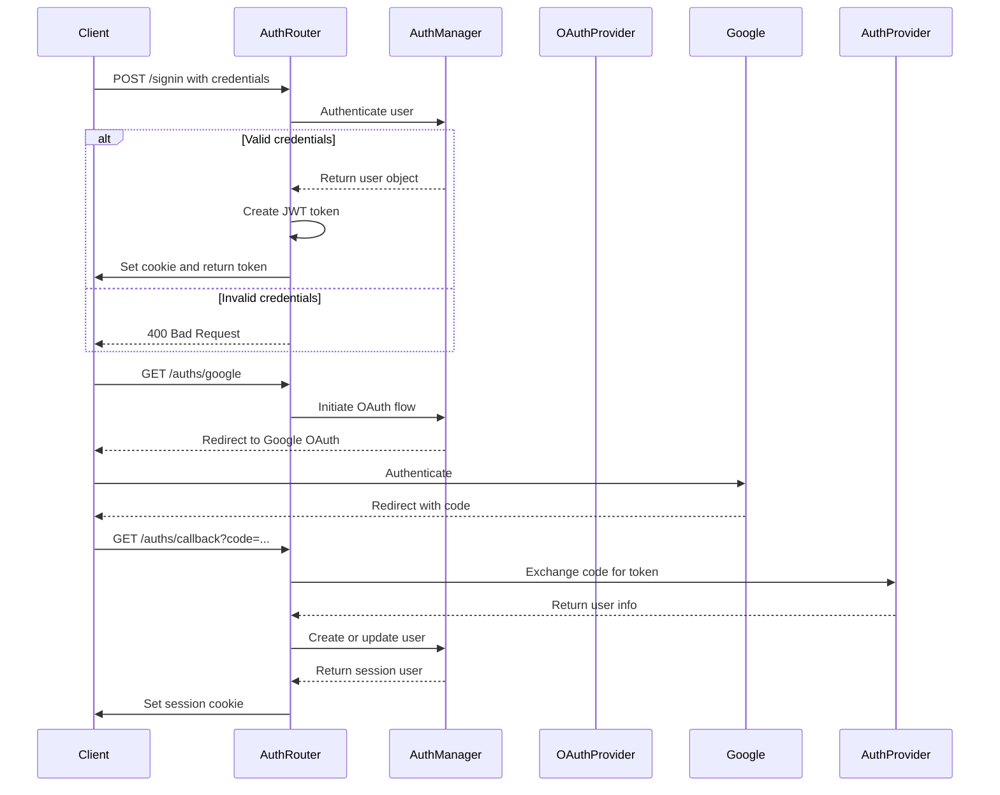
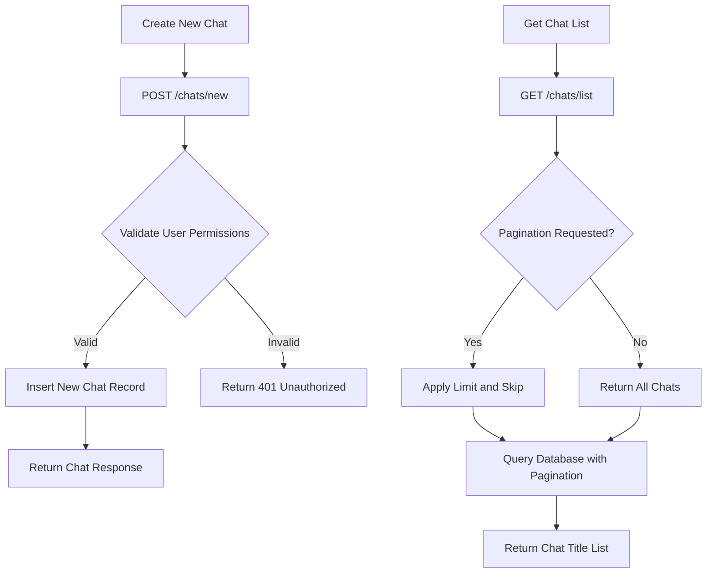
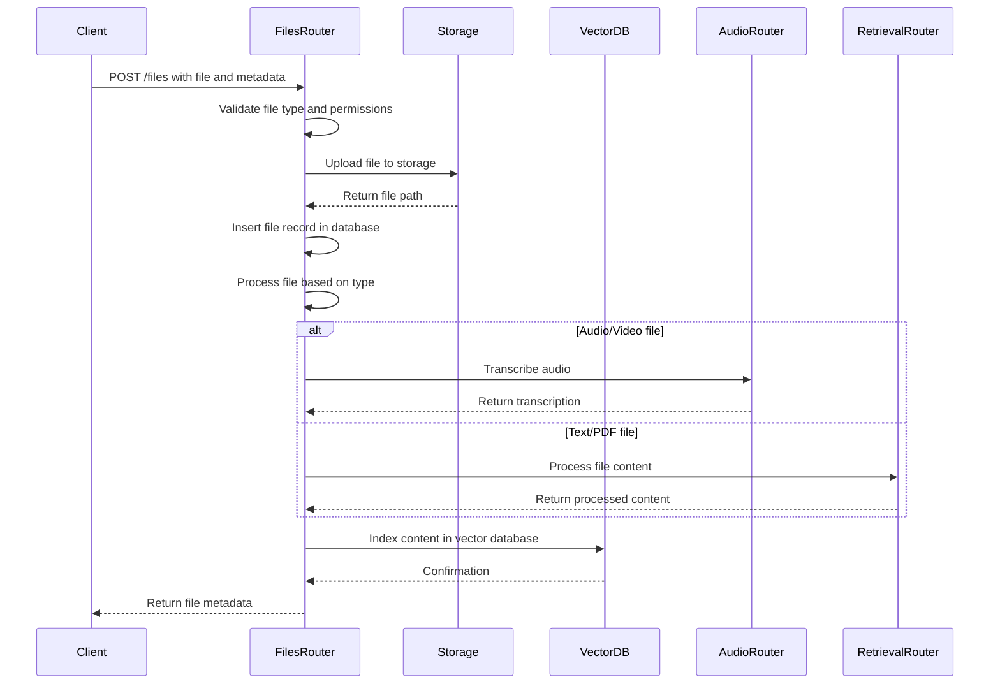
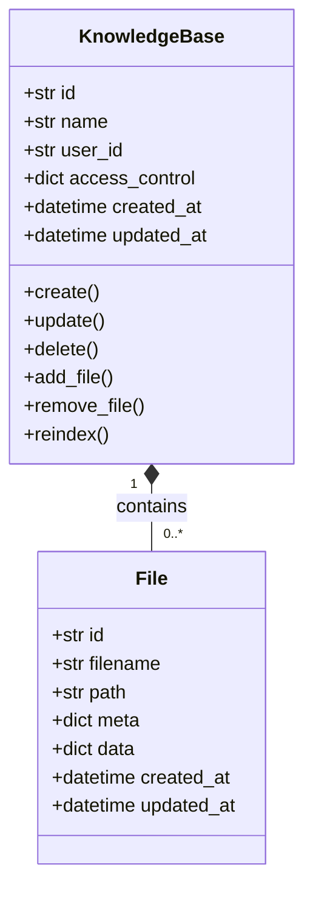
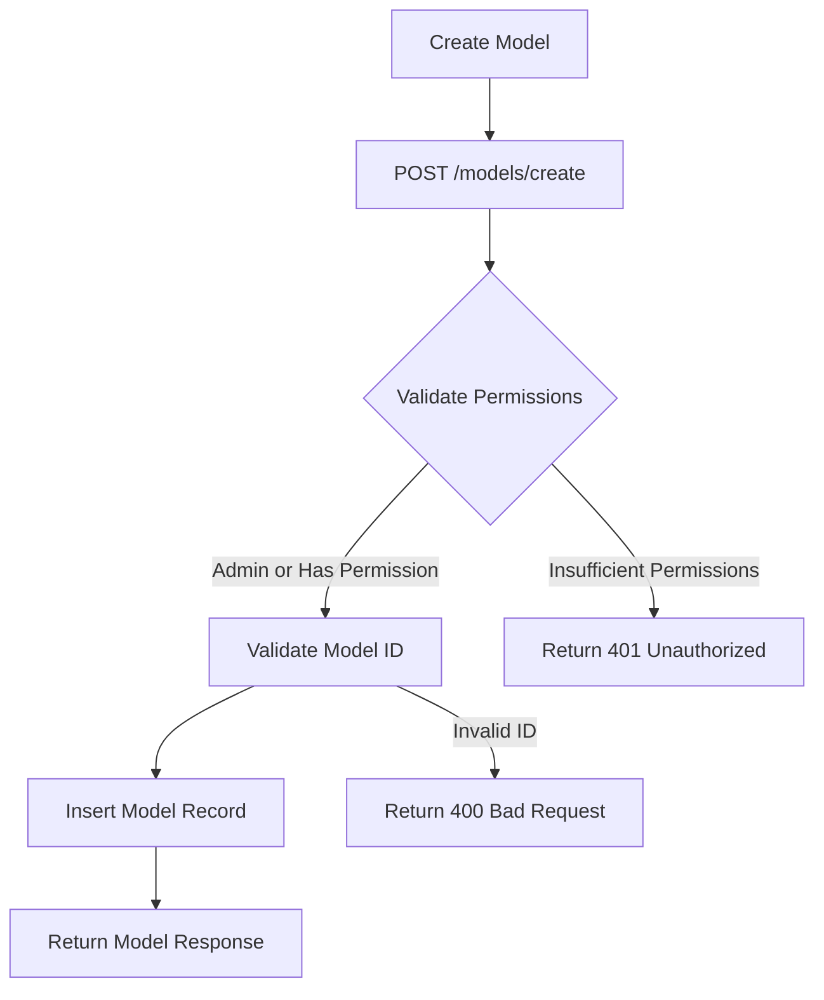
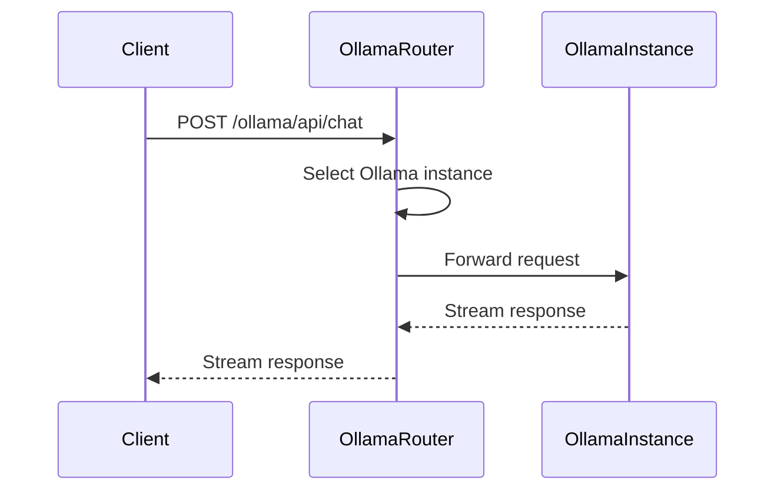

# API Routers

<cite>
**Referenced Files in This Document**   
- [auths.py](file://backend/open_webui/routers/auths.py)
- [chats.py](file://backend/open_webui/routers/chats.py)
- [files.py](file://backend/open_webui/routers/files.py)
- [knowledge.py](file://backend/open_webui/routers/knowledge.py)
- [models.py](file://backend/open_webui/routers/models.py)
- [ollama.py](file://backend/open_webui/routers/ollama.py)
- [openai.py](file://backend/open_webui/routers/openai.py)
- [oauth.py](file://backend/open_webui/utils/oauth.py)
- [oauth_sessions.py](file://backend/open_webui/models/oauth_sessions.py)
</cite>

## Table of Contents
1. [Introduction](#introduction)
2. [Authentication Routers (auths.py)](#authentication-routers-authspy)
3. [Chat Management Routers (chats.py)](#chat-management-routers-chatspy)
4. [File Management Routers (files.py)](#file-management-routers-filespy)
5. [Knowledge Base Routers (knowledge.py)](#knowledge-base-routers-knowledgepy)
6. [AI Model Configuration Routers (models.py)](#ai-model-configuration-routers-modelspy)
7. [Backend Provider Proxy Routers (ollama.py and openai.py)](#backend-provider-proxy-routers-ollamapy-and-openaipy)
8. [Security and Middleware](#security-and-middleware)
9. [Dependency Injection and Shared Services](#dependency-injection-and-shared-services)
10. [Extending the Router System](#extending-the-router-system)

## Introduction
The Open WebUI backend implements a comprehensive API router system using FastAPI to manage user authentication, chat interactions, file processing, knowledge bases, and AI model configurations. This documentation provides a detailed overview of each router module, including their HTTP methods, endpoint patterns, request/response schemas, authentication requirements, and integration points. The system supports OAuth2 integration with Google, Microsoft, and GitHub for user authentication, implements message streaming via Server-Sent Events (SSE) for chat interactions, and provides robust file upload and processing pipelines for knowledge base integration. The API is designed with security in mind, incorporating rate limiting, CORS policies, and middleware integration to protect against common web vulnerabilities.

## Authentication Routers (auths.py)

The authentication router handles user registration, login, password management, and OAuth2 integration with external providers. It implements a comprehensive security model with support for LDAP authentication, trusted header authentication, and traditional username/password authentication.

### User Authentication Flows
The authentication system supports multiple authentication methods:
- **Traditional Signin/Signup**: Standard email/password authentication with password validation and hashing
- **LDAP Authentication**: Integration with LDAP servers for enterprise authentication
- **OAuth2 Integration**: Support for Google, Microsoft, and GitHub OAuth2 providers
- **Trusted Header Authentication**: For integration with reverse proxies that handle authentication



**Diagram sources** 
- [auths.py](file://backend/open_webui/routers/auths.py#L507-L632)
- [oauth.py](file://backend/open_webui/utils/oauth.py#L167-L195)

### OAuth2 Integration
The system implements OAuth2 flows for Google, Microsoft, and GitHub authentication. When a user initiates OAuth login, they are redirected to the provider's authorization endpoint. After authentication, the provider redirects back to the application with an authorization code, which is exchanged for an access token and user information.

The OAuth session is stored securely in the database with encrypted tokens using Fernet encryption. The system supports merging accounts by email address and can automatically assign users to groups based on claims in the OAuth token.

**Section sources**
- [auths.py](file://backend/open_webui/routers/auths.py#L800-L1185)
- [oauth.py](file://backend/open_webui/utils/oauth.py#L1-L200)
- [oauth_sessions.py](file://backend/open_webui/models/oauth_sessions.py#L1-L200)

## Chat Management Routers (chats.py)

The chat management router handles all aspects of chat conversation management, including creation, retrieval, updating, and deletion of chat sessions. It supports message streaming via Server-Sent Events (SSE) for real-time chat interactions.

### Chat Creation and Management
The chat router provides endpoints for creating new chats, retrieving chat lists, and managing chat metadata such as titles, tags, and folder organization.



**Diagram sources** 
- [chats.py](file://backend/open_webui/routers/chats.py#L133-L143)

### Message Streaming via SSE
The chat system implements Server-Sent Events (SSE) for real-time message streaming. When a user sends a message, the backend establishes an SSE connection and streams the AI's response token by token, providing a typing effect similar to human conversation.

The streaming endpoint uses FastAPI's StreamingResponse to send data chunks as they become available from the AI model. This approach minimizes latency and provides immediate feedback to users.

**Section sources**
- [chats.py](file://backend/open_webui/routers/chats.py#L1-L800)

## File Management Routers (files.py)

The file management router handles file uploads, processing, and retrieval. It integrates with the storage provider system and supports various file types for knowledge base integration.

### File Upload and Processing Pipeline
The file upload process follows a multi-stage pipeline:

1. **Upload**: Files are uploaded via POST request with metadata
2. **Storage**: Files are stored in the configured storage backend (local, S3, etc.)
3. **Processing**: Files are processed based on type (text extraction, transcription, etc.)
4. **Indexing**: Processed content is indexed in the vector database for retrieval



**Diagram sources** 
- [files.py](file://backend/open_webui/routers/files.py#L152-L287)

### Knowledge Base Integration
Uploaded files can be associated with knowledge bases for semantic search and retrieval. The system supports adding multiple files to a knowledge base and automatically indexes their content in the vector database.

**Section sources**
- [files.py](file://backend/open_webui/routers/files.py#L1-L761)

## Knowledge Base Routers (knowledge.py)

The knowledge base router manages the creation, updating, and deletion of knowledge bases, which are collections of documents used for retrieval-augmented generation (RAG).

### Knowledge Base Lifecycle
The knowledge base system follows a CRUD pattern with additional functionality for file management and reindexing:



**Diagram sources** 
- [knowledge.py](file://backend/open_webui/routers/knowledge.py#L84-L117)

### Access Control and Permissions
Knowledge bases implement a flexible access control system that supports:
- Private knowledge bases (owner only)
- Group-based access
- Public knowledge bases (with permission requirements)

The system checks user permissions before allowing access to knowledge base operations, ensuring data security and privacy.

**Section sources**
- [knowledge.py](file://backend/open_webui/routers/knowledge.py#L1-L662)

## AI Model Configuration Routers (models.py)

The AI model configuration router manages custom AI models that can be created, updated, and deleted by users with appropriate permissions.

### Model Management
The model system allows users to define custom models with specific parameters and configurations:



**Diagram sources** 
- [models.py](file://backend/open_webui/routers/models.py#L130-L166)

### Model Tags and Filtering
Models can be organized using tags, which are extracted from the model metadata. The system provides endpoints to retrieve all available tags and filter models by tag.

**Section sources**
- [models.py](file://backend/open_webui/routers/models.py#L1-L418)

## Backend Provider Proxy Routers (ollama.py and openai.py)

The backend provider proxy routers act as intermediaries between the frontend and AI backend services like Ollama and OpenAI. They handle request routing, load balancing, and response streaming.

### Ollama Proxy (ollama.py)
The Ollama proxy router provides a unified interface to one or more Ollama instances. It supports:

- **Model Management**: Listing available models, pulling new models, and managing loaded models
- **Load Balancing**: Distributing requests across multiple Ollama instances
- **Request Proxying**: Forwarding chat completion, embedding, and other requests to Ollama



**Diagram sources** 
- [ollama.py](file://backend/open_webui/routers/ollama.py#L213-L217)

### OpenAI Proxy (openai.py)
The OpenAI proxy router provides compatibility with the OpenAI API format, allowing the system to work with any OpenAI-compatible service:

- **Model Listing**: Aggregates models from multiple OpenAI-compatible endpoints
- **Request Translation**: Converts OpenAI-style requests to the appropriate format
- **Azure OpenAI Support**: Special handling for Azure OpenAI parameters and authentication

**Section sources**
- [ollama.py](file://backend/open_webui/routers/ollama.py#L1-L1806)
- [openai.py](file://backend/open_webui/routers/openai.py#L1-L1189)

## Security and Middleware

The API implements multiple security layers through middleware and configuration:

### Rate Limiting
The authentication system includes rate limiting for sign-in attempts to prevent brute force attacks:

```python
signin_rate_limiter = RateLimiter(
    redis_client=get_redis_client(), limit=5 * 3, window=60 * 3
)
```

### CORS Policies
The application configures CORS middleware to control which domains can access the API:

```python
app.add_middleware(
    CORSMiddleware,
    allow_origins=origins,
    allow_credentials=True,
    allow_methods=["*"],
    allow_headers=["*"],
)
```

### Authentication Middleware
The system uses multiple authentication methods:
- JWT tokens in cookies or Authorization header
- API keys for programmatic access
- Session-based authentication for web interface

**Section sources**
- [main.py](file://backend/open_webui/main.py#L42-L44)
- [auths.py](file://backend/open_webui/routers/auths.py#L86-L88)

## Dependency Injection and Shared Services

The router system uses FastAPI's dependency injection to provide shared services across endpoints:

### Database Sessions
Database access is managed through a dependency that provides database sessions:

```python
def get_db():
    db = Session()
    try:
        yield db
    finally:
        db.close()
```

### Authentication Dependencies
The system implements reusable authentication dependencies:

```python
def get_current_user(token: str = Depends(oauth2_scheme)):
    # Decode and validate JWT token
    pass

def get_verified_user(user = Depends(get_current_user)):
    # Verify user is not pending
    pass

def get_admin_user(user = Depends(get_current_user)):
    # Verify user has admin role
    pass
```

These dependencies are used throughout the routers to enforce authentication and authorization requirements.

**Section sources**
- [auths.py](file://backend/open_webui/routers/auths.py#L52-L65)
- [utils/auth.py](file://backend/open_webui/utils/auth.py#L1-L50)

## Extending the Router System

Developers can extend the existing router system by following the project patterns:

### Creating New Routers
To create a new router, follow these steps:
1. Create a new Python file in the routers directory
2. Import required dependencies
3. Create an APIRouter instance
4. Define endpoints with proper authentication dependencies
5. Import the router in main.py

### Following Project Patterns
When extending the system, maintain consistency with existing patterns:
- Use Pydantic models for request/response schemas
- Implement proper error handling with HTTPException
- Use dependency injection for shared services
- Follow the same authentication patterns
- Maintain consistent naming conventions

**Section sources**
- [main.py](file://backend/open_webui/main.py#L70-L98)
- [routers/template.py](file://backend/open_webui/routers/utils.py#L1-L50)