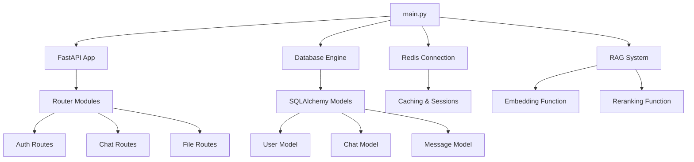

# Backend Directory Structure

<cite>
**Referenced Files in This Document**   
- [main.py](file://backend/open_webui/main.py)
- [users.py](file://backend/open_webui/models/users.py)
- [chats.py](file://backend/open_webui/models/chats.py)
- [messages.py](file://backend/open_webui/models/messages.py)
- [files.py](file://backend/open_webui/models/files.py)
- [auths.py](file://backend/open_webui/routers/auths.py)
- [chats.py](file://backend/open_webui/routers/chats.py)
- [auth.py](file://backend/open_webui/utils/auth.py)
- [chat.py](file://backend/open_webui/utils/chat.py)
- [retrieval/loaders/main.py](file://backend/open_webui/retrieval/loaders/main.py)
- [retrieval/vector/main.py](file://backend/open_webui/retrieval/vector/main.py)
- [retrieval/web/main.py](file://backend/open_webui/retrieval/web/main.py)
- [internal/db.py](file://backend/open_webui/internal/db.py)
- [migrations/versions](file://backend/open_webui/migrations/versions)
</cite>

## Table of Contents
1. [Introduction](#introduction)
2. [Models Directory](#models-directory)
3. [Routers Directory](#routers-directory)
4. [Utils Directory](#utils-directory)
5. [Retrieval Directory](#retrieval-directory)
6. [Internal Directory](#internal-directory)
7. [Migrations Directory](#migrations-directory)
8. [Component Interactions](#component-interactions)
9. [Development Patterns and Best Practices](#development-patterns-and-best-practices)

## Introduction
The open-webui backend application follows a modular directory structure designed to separate concerns and promote maintainability. This document provides a comprehensive overview of the major directories and their components, focusing on how they interact through dependency injection and shared configuration in the main.py file. The architecture is built on FastAPI for API endpoints, SQLAlchemy for database operations, and implements a Retrieval-Augmented Generation (RAG) system for enhanced AI capabilities.

**Section sources**
- [main.py](file://backend/open_webui/main.py#L1-L2352)

## Models Directory
The models/ directory contains SQLAlchemy models that define the database schema for various entities in the application. Each model file corresponds to a specific domain entity and includes both the database table definition and associated Pydantic models for data validation and serialization.

### User Model
The users.py file defines the User entity with comprehensive profile information including authentication details, personal information, and user preferences. The model includes fields for email, username, role-based access control, profile image URL, bio, and OAuth integration data. It also tracks user activity with last_active_at timestamps and manages API keys through a related ApiKey model.

**Section sources**
- [users.py](file://backend/open_webui/models/users.py#L1-L719)

### Chat Model
The chats.py file defines the Chat entity that stores conversational data between users and AI models. Each chat record contains a JSON field for the conversation history, title, creation and update timestamps, and metadata for sharing, archiving, and pinning functionality. The model includes performance-optimized indexes for common queries based on user_id, folder_id, and update timestamps.

**Section sources**
- [chats.py](file://backend/open_webui/models/chats.py#L1-L1175)

### Message Model
The messages.py file defines the Message entity that represents individual messages within chat conversations or channels. Messages can be organized in threads with parent-child relationships and support rich features like reactions, replies, and pinning. The model includes fields for content, metadata, and timestamps with nanosecond precision for accurate message ordering.

**Section sources**
- [messages.py](file://backend/open_webui/models/messages.py#L1-L463)

### File Model
The files.py file defines the File entity for managing file uploads and document storage. Each file record includes metadata about the file (filename, content type, size), storage path, and access control settings. The model supports hash verification for file integrity and stores additional data in JSON fields for extensibility.

**Section sources**
- [files.py](file://backend/open_webui/models/files.py#L1-L290)

## Routers Directory
The routers/ directory contains FastAPI route handlers that expose the application's API endpoints. Each router file corresponds to a specific feature area and handles HTTP requests for CRUD operations and other business logic.

### Authentication Routes
The auths.py file implements authentication endpoints for user registration, login, and profile management. It includes form models for various authentication operations and uses dependency injection to enforce access control through functions like get_verified_user and get_current_user. The router handles both password-based authentication and OAuth integration.

**Section sources**
- [auths.py](file://backend/open_webui/routers/auths.py#L1-L1185)

### Chat Routes
The chats.py file in the routers directory implements endpoints for managing chat conversations. It provides routes for creating new chats, retrieving chat lists, searching chats by content or metadata, and importing/exporting chat data. The router uses the Chats model for data persistence and implements pagination for efficient retrieval of large datasets.

**Section sources**
- [chats.py](file://backend/open_webui/routers/chats.py#L1-L942)

## Utils Directory
The utils/ directory contains shared utility modules that provide common functionality across different components of the application.

### Authentication Utilities
The auth.py file contains functions for password hashing, token creation and validation, and user authentication. It implements JWT-based authentication with configurable expiration times and includes utilities for verifying password strength according to configurable regex patterns. The module also handles API key generation and validation.

**Section sources**
- [auth.py](file://backend/open_webui/utils/auth.py#L1-L419)

### Chat Processing Utilities
The chat.py file contains functions for generating chat completions by routing requests to appropriate AI models. It includes both streaming and non-streaming response handlers and implements direct model connections for improved performance. The utilities handle payload conversion between different AI provider formats (OpenAI to Ollama) and manage WebSocket communication for real-time updates.

**Section sources**
- [chat.py](file://backend/open_webui/utils/chat.py#L1-L490)

## Retrieval Directory
The retrieval/ directory implements the RAG (Retrieval-Augmented Generation) system that enhances AI responses with external knowledge. This system consists of three main components: loaders for ingesting documents, vector databases for semantic search, and web search integrations.

### Loaders
The loaders/ subdirectory contains modules for processing various document types including PDFs, web pages, YouTube videos, and external documents. Each loader is responsible for extracting text content from its specific source type and preparing it for embedding. The main.py file orchestrates the loading process and integrates with external services like Tika, Docling, and Azure Document Intelligence.

**Section sources**
- [retrieval/loaders/main.py](file://backend/open_webui/retrieval/loaders/main.py)

### Vector Database Integration
The vector/ subdirectory implements the vector database functionality for semantic search. It includes a factory pattern for supporting multiple vector database backends and utilities for creating and managing vector stores. The system uses embedding functions to convert text into vector representations and supports both synchronous and asynchronous embedding operations.

**Section sources**
- [retrieval/vector/main.py](file://backend/open_webui/retrieval/vector/main.py)

### Web Search Integration
The web/ subdirectory contains integrations with various web search engines including Google, Bing, Brave, Tavily, and custom search APIs. Each integration module implements the specific API requirements for its search engine and normalizes the results into a common format. The system supports concurrent requests and domain filtering to control search scope.

**Section sources**
- [retrieval/web/main.py](file://backend/open_webui/retrieval/web/main.py)

## Internal Directory
The internal/ directory contains database-related utilities and wrappers that are used across the application. The db.py file provides the SQLAlchemy base class and database session management, while the wrappers.py file contains utility functions for common database operations.

### Database Configuration
The internal/db.py file defines the Base class for all SQLAlchemy models and provides the get_db() context manager for database session management. It configures the database engine with appropriate connection pooling and isolation settings to ensure reliable database operations.

**Section sources**
- [internal/db.py](file://backend/open_webui/internal/db.py)

## Migrations Directory
The migrations/ directory contains Alembic configuration and migration scripts for managing database schema changes. The versions/ subdirectory includes timestamped migration files that implement incremental schema updates, while the configuration files (env.py, alembic.ini) define the migration environment and settings.

### Migration Scripts
The migration scripts in the versions/ directory implement schema changes in a sequential, version-controlled manner. Each migration file includes upgrade() and downgrade() functions to apply and revert schema changes. The migrations track important application updates such as adding authentication API keys, implementing user archiving, and adding model support.

**Section sources**
- [migrations/versions](file://backend/open_webui/migrations/versions)

## Component Interactions
The backend components interact through a well-defined architecture centered around the main.py file, which serves as the application entry point and dependency injection container.

### Dependency Injection in main.py
The main.py file initializes the FastAPI application and configures various components through the app.state object. It imports and registers all routers, initializes database connections, configures Redis for caching and session management, and sets up the RAG system with embedding and reranking functions. The lifespan context manager handles startup and shutdown procedures.

**Diagram sources **
- [main.py](file://backend/open_webui/main.py#L1-L2352)

### Configuration Management
Configuration is managed through environment variables and centralized configuration objects. The main.py file imports configuration constants from config.py and env.py, then exposes them through app.state.config for access by other components. This approach allows for flexible configuration across different deployment environments.

**Section sources**
- [main.py](file://backend/open_webui/main.py#L1-L2352)

## Development Patterns and Best Practices
The open-webui backend implements several development patterns and best practices to ensure code quality, maintainability, and performance.

### Error Handling Strategies
The application uses FastAPI's HTTPException for standardized error responses across all endpoints. Each model repository method includes try-catch blocks to handle database exceptions gracefully, returning None instead of raising errors. The system defines a comprehensive set of error messages in constants.py for consistent error reporting.

### Performance Considerations
The backend implements several performance optimizations including database query indexing, Redis caching for frequently accessed data, and connection pooling for database and HTTP requests. The chat system uses efficient JSON field queries and implements pagination to prevent excessive data loading. The RAG system supports asynchronous embedding operations to avoid blocking the main thread.

### Security Practices
Security is implemented through multiple layers including JWT-based authentication, role-based access control, input validation with Pydantic models, and protection against common web vulnerabilities. The application uses bcrypt for password hashing and implements rate limiting for authentication endpoints to prevent brute force attacks.

**Section sources**
- [main.py](file://backend/open_webui/main.py#L1-L2352)
- [auth.py](file://backend/open_webui/utils/auth.py#L1-L419)
- [auths.py](file://backend/open_webui/routers/auths.py#L1-L1185)