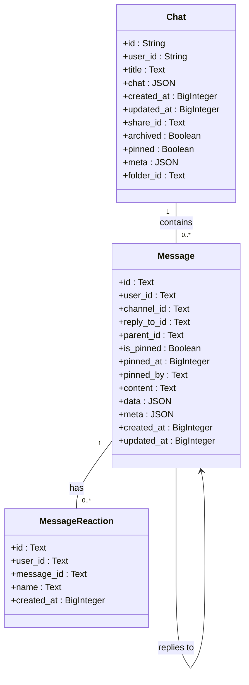
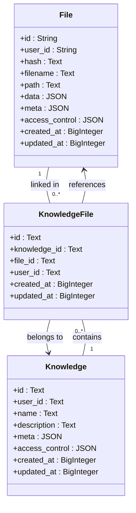
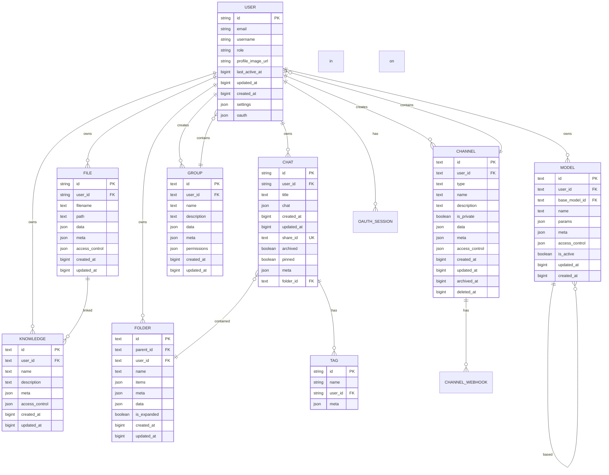

# Data Models

<cite>
**Referenced Files in This Document**   
- [users.py](file://backend/open_webui/models/users.py)
- [chats.py](file://backend/open_webui/models/chats.py)
- [messages.py](file://backend/open_webui/models/messages.py)
- [files.py](file://backend/open_webui/models/files.py)
- [knowledge.py](file://backend/open_webui/models/knowledge.py)
- [models.py](file://backend/open_webui/models/models.py)
- [folders.py](file://backend/open_webui/models/folders.py)
- [tags.py](file://backend/open_webui/models/tags.py)
- [groups.py](file://backend/open_webui/models/groups.py)
- [channels.py](file://backend/open_webui/models/channels.py)
- [oauth_sessions.py](file://backend/open_webui/models/oauth_sessions.py)
- [db.py](file://backend/open_webui/internal/db.py)
- [7e5b5dc7342b_init.py](file://backend/open_webui/migrations/versions/7e5b5dc7342b_init.py)
- [6a39f3d8e55c_add_knowledge_table.py](file://backend/open_webui/migrations/versions/6a39f3d8e55c_add_knowledge_table.py)
- [38d63c18f30f_add_oauth_session_table.py](file://backend/open_webui/migrations/versions/38d63c18f30f_add_oauth_session_table.py)
</cite>

## Table of Contents
1. [Introduction](#introduction)
2. [User Model](#user-model)
3. [Chat and Message Models](#chat-and-message-models)
4. [File and Knowledge Models](#file-and-knowledge-models)
5. [Model Configuration Model](#model-configuration-model)
6. [Folder and Tag Models](#folder-and-tag-models)
7. [Group and Channel Models](#group-and-channel-models)
8. [OAuth Session Model](#oauth-session-model)
9. [Database Schema and Indexing](#database-schema-and-indexing)
10. [Alembic Migrations](#alembic-migrations)
11. [Common Database Operations](#common-database-operations)
12. [Performance Considerations](#performance-considerations)

## Introduction
This document provides comprehensive documentation for the SQLAlchemy ORM models in the open-webui backend. It details each entity's fields, data types, relationships, and constraints, with a focus on the core data models that power the application. The documentation covers user authentication, chat and message hierarchies, file and knowledge management, AI model configurations, and organizational structures like folders, tags, groups, and channels. The analysis is based on the model files located in the `backend/open_webui/models/` directory, migration scripts in `backend/open_webui/migrations/versions/`, and the database configuration in `backend/open_webui/internal/db.py`. The models are designed to support a collaborative AI interface with features for user management, conversation persistence, document storage, and access control.

## User Model

The User model is the central entity for user management and authentication in the open-webui application. It stores core user information, authentication details, and preferences. The model is defined in `users.py` and includes fields for personal information, authentication tokens, and user settings. The `User` class inherits from `Base`, the declarative base for SQLAlchemy, and uses various data types such as `String`, `Text`, `Date`, and `JSON` to store different kinds of data. The `id` field serves as the primary key and is unique for each user. The `email` and `username` fields are used for identification, with `role` indicating the user's permission level (e.g., "admin", "user", "pending"). The model supports OAuth integration through the `oauth` JSON field, which stores provider-specific data like Google or GitHub sub-identifiers. Role-based access control is implemented by checking the `role` field, with special handling for the super admin user who has the "admin" role. The `last_active_at` field is used to track user activity and determine if a user is currently active, which is crucial for presence indicators in the application.

**Section sources**
- [users.py](file://backend/open_webui/models/users.py#L45-L718)

## Chat and Message Models

The Chat and Message models represent the conversation hierarchy and message threading in the open-webui application. The `Chat` model, defined in `chats.py`, represents a conversation with a unique `id`, `user_id` for ownership, and a `chat` JSON field that stores the conversation history. The `chat` field contains a nested structure with a `history` object that includes `messages`, allowing for complex conversation trees. The `Message` model, defined in `messages.py`, represents individual messages within a chat or channel, with fields for `content`, `data`, and `meta`. Messages can be threaded through the `reply_to_id` and `parent_id` fields, enabling nested conversations. The `Message` model also supports reactions through the `MessageReaction` model, which links users to messages with specific emoji reactions. The relationship between Chat and Message is implicit, as messages are stored within the `chat` JSON field of a Chat object, rather than through a direct foreign key relationship. This design allows for flexible message structures but requires careful handling when querying or updating messages.

**Diagram sources **
- [chats.py](file://backend/open_webui/models/chats.py#L26-L56)
- [messages.py](file://backend/open_webui/models/messages.py#L41-L63)
- [messages.py](file://backend/open_webui/models/messages.py#L22-L29)

**Section sources**
- [chats.py](file://backend/open_webui/models/chats.py#L26-L800)
- [messages.py](file://backend/open_webui/models/messages.py#L41-L463)

## File and Knowledge Models

The File and Knowledge models manage document storage and parsing metadata in the open-webui application. The `File` model, defined in `files.py`, represents a stored file with fields for `filename`, `path`, and metadata in the `meta` JSON field. The `data` JSON field can store additional information about the file, such as parsing results or vector embedding references. The `Knowledge` model, defined in `knowledge.py`, represents a knowledge base that can contain multiple files. The relationship between File and Knowledge is established through the `KnowledgeFile` model, which acts as a junction table with foreign keys to both `knowledge_id` and `file_id`. This many-to-many relationship allows a single file to be part of multiple knowledge bases and a single knowledge base to contain multiple files. The `Knowledge` model also includes an `access_control` JSON field for managing permissions, supporting public, private, and custom access levels. The migration script `6a39f3d8e55c_add_knowledge_table.py` shows the creation of the `knowledge` table and the migration of data from the legacy `document` table, indicating an evolution in the data model to support more complex knowledge management.

**Diagram sources **
- [files.py](file://backend/open_webui/models/files.py#L18-L34)
- [knowledge.py](file://backend/open_webui/models/knowledge.py#L36-L65)
- [knowledge.py](file://backend/open_webui/models/knowledge.py#L84-L103)

**Section sources**
- [files.py](file://backend/open_webui/models/files.py#L18-L290)
- [knowledge.py](file://backend/open_webui/models/knowledge.py#L36-L371)

## Model Configuration Model

The Model model manages AI model configuration parameters and provider integrations in the open-webui application. Defined in `models.py`, this model allows users to define custom AI models with specific parameters and metadata. The `id` field serves as the primary key and is used in API calls to reference the model. The `base_model_id` field can point to an existing model to be used as a base, enabling model inheritance or overriding. The `params` JSON field stores model-specific parameters, while the `meta` JSON field contains user-facing information like `profile_image_url` and `description`. The model supports access control through the `access_control` JSON field, similar to the Knowledge model, allowing for public, private, and custom permission levels. The `is_active` boolean field enables or disables a model, providing a way to manage model availability without deletion. The `ModelTable` class provides methods for searching models with filtering by view option (created/shared), tag, and permission, demonstrating the model's integration with the application's search and access control systems.

**Section sources**
- [models.py](file://backend/open_webui/models/models.py#L55-L461)

## Folder and Tag Models

The Folder and Tag models provide organizational structures for chats and other entities in the open-webui application. The `Folder` model, defined in `folders.py`, represents a hierarchical folder structure with `parent_id` for nesting and `items` JSON field for storing references to contained items. The `is_expanded` boolean field tracks the UI state of the folder. The `Tag` model, defined in `tags.py`, represents a tag with a composite primary key of `id` and `user_id`, ensuring that tag IDs are unique per user. This design allows multiple users to have tags with the same name without conflict. The `Tag` model is used to categorize chats through the `ChatIdTag` table, which is created in the initial migration script `7e5b5dc7342b_init.py`. The `Folders` class provides methods for searching folders by name with normalization of spaces and underscores, indicating a user-friendly approach to folder management. The `Tags` class includes methods for managing tags and their associations with chats, supporting the application's tagging functionality for organizing conversations.

**Section sources**
- [folders.py](file://backend/open_webui/models/folders.py#L24-L367)
- [tags.py](file://backend/open_webui/models/tags.py#L20-L115)

## Group and Channel Models

The Group and Channel models support collaborative features and access control in the open-webui application. The `Group` model, defined in `groups.py`, represents a user group with `permissions` and `data` JSON fields for storing group-specific settings. The `GroupMember` model acts as a junction table, linking users to groups and tracking membership metadata like `created_at` and `updated_at`. The `Channel` model, defined in `channels.py`, represents a communication channel with `type` (e.g., "group", "dm") and `access_control` for managing permissions. The `ChannelMember` model tracks user membership in channels, including status, roles, and read/unread states. The `ChannelWebhook` model supports integration with external services. These models enable complex access control scenarios, such as sharing resources with specific groups or managing permissions for collaborative workspaces. The `Groups` and `Channels` classes provide methods for managing memberships, including bulk operations and synchronization, demonstrating the application's focus on team collaboration and user management.

**Section sources**
- [groups.py](file://backend/open_webui/models/groups.py#L36-L534)
- [channels.py](file://backend/open_webui/models/channels.py#L22-L674)

## OAuth Session Model

The OAuth Session model manages OAuth integration and token storage in the open-webui application. Defined in `oauth_sessions.py`, this model stores OAuth tokens securely with encryption using the `cryptography.fernet` library. The `token` field contains the encrypted OAuth token data, including access and refresh tokens, while the `provider` field identifies the OAuth provider (e.g., Google, GitHub). The `expires_at` field tracks token expiration, and the `user_id` field links the session to a user. The model is created in the migration script `38d63c18f30f_add_oauth_session_table.py`, which also ensures the `user` table has the correct primary key and unique constraints. The `OAuthSessionTable` class provides methods for creating, retrieving, and updating sessions, with encryption and decryption handled transparently. This model enables secure authentication with external providers while protecting sensitive token data in the database.

**Section sources**
- [oauth_sessions.py](file://backend/open_webui/models/oauth_sessions.py#L25-L278)
- [38d63c18f30f_add_oauth_session_table.py](file://backend/open_webui/migrations/versions/38d63c18f30f_add_oauth_session_table.py#L22-L63)

## Database Schema and Indexing

The database schema for the open-webui application is managed through Alembic migrations, with the initial schema defined in `7e5b5dc7342b_init.py`. This migration script creates all core tables, including `user`, `chat`, `file`, `model`, and `tag`, with appropriate columns and constraints. The schema uses a mix of data types, including `String`, `Text`, `BigInteger` for timestamps, and `JSON` for flexible data storage. Indexes are strategically placed to optimize common queries, such as the `updated_at_user_id_idx` on the `chat` table for retrieving user chats ordered by update time. The `JSONField` class in `db.py` provides a custom type decorator for handling JSON data, ensuring proper serialization and deserialization. The database configuration supports multiple backends, including SQLite and PostgreSQL, with specific settings for connection pooling and performance. The schema evolution is tracked through migration scripts, allowing for incremental changes to the database structure while preserving data integrity.

**Diagram sources **
- [7e5b5dc7342b_init.py](file://backend/open_webui/migrations/versions/7e5b5dc7342b_init.py#L29-L187)
- [db.py](file://backend/open_webui/internal/db.py#L31-L51)

**Section sources**
- [7e5b5dc7342b_init.py](file://backend/open_webui/migrations/versions/7e5b5dc7342b_init.py#L25-L187)
- [db.py](file://backend/open_webui/internal/db.py#L31-L164)

## Alembic Migrations

Alembic migrations are used to manage the database schema evolution in the open-webui application. The migrations are located in the `backend/open_webui/migrations/versions/` directory and are executed using the Alembic framework. The initial migration, `7e5b5dc7342b_init.py`, creates the core tables and establishes the baseline schema. Subsequent migrations, such as `6a39f3d8e55c_add_knowledge_table.py` and `38d63c18f30f_add_oauth_session_table.py`, add new tables and modify existing ones. The migration process is integrated with the application startup through the `handle_peewee_migration` function in `db.py`, which ensures that migrations are applied before the application starts. The `util.py` file provides helper functions for migrations, such as `get_existing_tables` to check for existing tables before creating them. Migrations are written in Python and use the Alembic `op` module to perform database operations like creating tables, adding columns, and creating indexes. This approach allows for version-controlled schema changes and ensures that the database structure is consistent across different environments.

**Section sources**
- [7e5b5dc7342b_init.py](file://backend/open_webui/migrations/versions/7e5b5dc7342b_init.py#L25-L187)
- [6a39f3d8e55c_add_knowledge_table.py](file://backend/open_webui/migrations/versions/6a39f3d8e55c_add_knowledge_table.py#L21-L79)
- [38d63c18f30f_add_oauth_session_table.py](file://backend/open_webui/migrations/versions/38d63c18f30f_add_oauth_session_table.py#L22-L71)
- [util.py](file://backend/open_webui/migrations/util.py#L5-L9)
- [db.py](file://backend/open_webui/internal/db.py#L55-L80)

## Common Database Operations

Common database operations in the open-webui application are encapsulated in table classes that provide a clean interface for CRUD operations. Each model has a corresponding table class, such as `UsersTable`, `ChatsTable`, and `FilesTable`, which contain methods for inserting, updating, deleting, and querying data. These classes use the `get_db` context manager from `db.py` to manage database sessions, ensuring proper connection handling and transaction management. Operations are typically wrapped in try-except blocks to handle exceptions gracefully and return `None` or `False` on failure. The table classes also implement business logic, such as validating user roles or checking access permissions, before performing database operations. For example, the `UsersTable` class has methods for managing API keys and OAuth integrations, while the `ChatsTable` class handles chat sharing and archiving. These operations are designed to be atomic and consistent, with proper error handling and logging to ensure data integrity.

**Section sources**
- [users.py](file://backend/open_webui/models/users.py#L237-L718)
- [chats.py](file://backend/open_webui/models/chats.py#L129-L800)
- [files.py](file://backend/open_webui/models/files.py#L107-L289)
- [db.py](file://backend/open_webui/internal/db.py#L156-L164)

## Performance Considerations

Performance considerations for the open-webui database include indexing strategies, query optimization, and efficient data access patterns. The schema includes several indexes to speed up common queries, such as the `updated_at_user_id_idx` on the `chat` table for retrieving user chats ordered by update time. The `Chat` model uses composite indexes like `user_id_pinned_idx` and `user_id_archived_idx` to optimize filtering by user and status. The application uses SQLAlchemy's query builder to construct efficient SQL queries, often using `join` and `filter` methods to minimize the number of database round-trips. The `get_db` context manager ensures that database sessions are properly managed, with connections being returned to the pool after use. For large datasets, the application implements pagination through `skip` and `limit` parameters in query methods. The use of JSON fields for flexible data storage can impact performance, so queries that filter on JSON data are carefully designed to use appropriate database functions and indexes. The database configuration supports connection pooling and pre-pinging to maintain connection health, reducing latency for database operations.

**Section sources**
- [chats.py](file://backend/open_webui/models/chats.py#L44-L56)
- [db.py](file://backend/open_webui/internal/db.py#L114-L145)
- [chats.py](file://backend/open_webui/models/chats.py#L536-L573)
- [messages.py](file://backend/open_webui/models/messages.py#L228-L237)