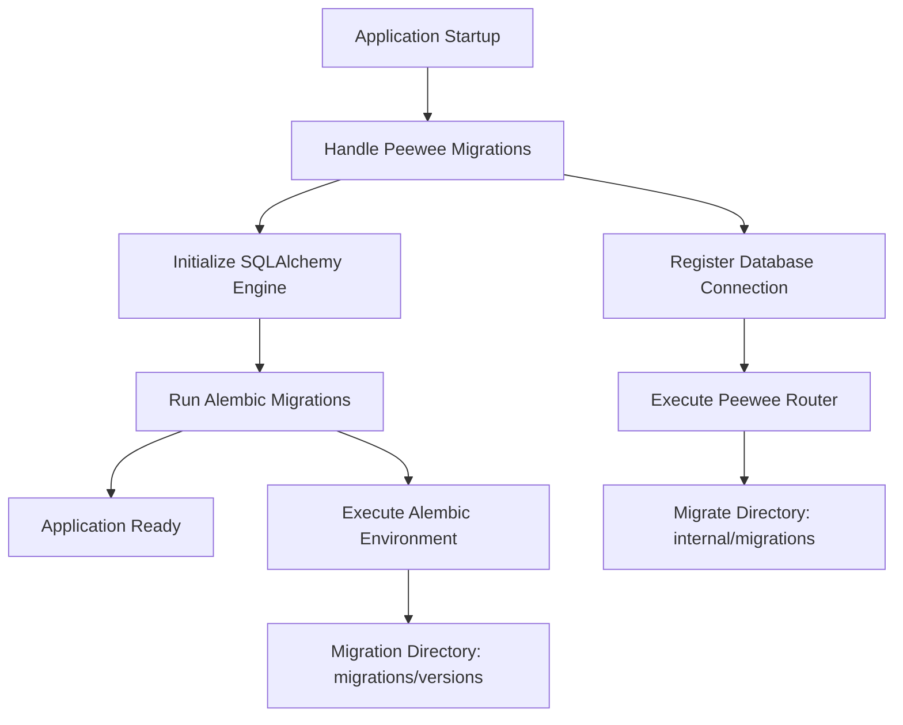
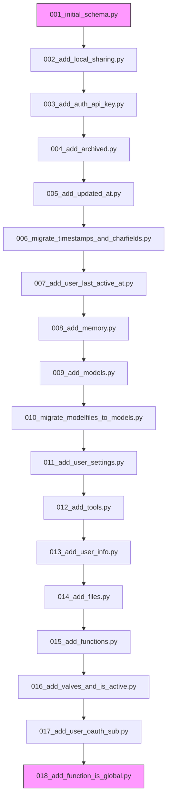
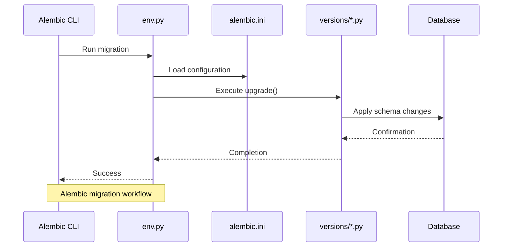
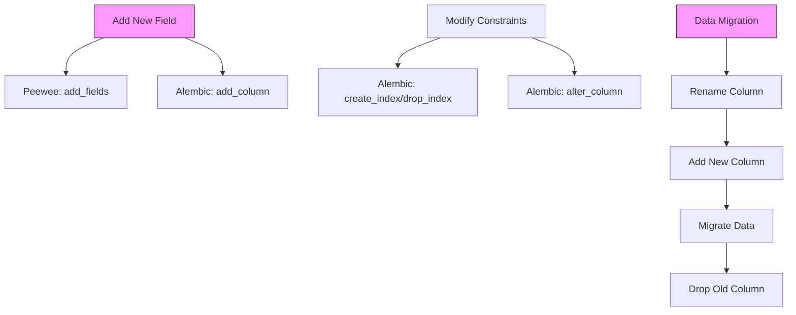

# Database Migrations

<cite>
**Referenced Files in This Document**   
- [db.py](file://backend/open_webui/internal/db.py)
- [001_initial_schema.py](file://backend/open_webui/internal/migrations/001_initial_schema.py)
- [018_add_function_is_global.py](file://backend/open_webui/internal/migrations/018_add_function_is_global.py)
- [7e5b5dc7342b_init.py](file://backend/open_webui/migrations/versions/7e5b5dc7342b_init.py)
- [3af16a1c9fb6_update_user_table.py](file://backend/open_webui/migrations/versions/3af16a1c9fb6_update_user_table.py)
- [242a2047eae0_update_chat_table.py](file://backend/open_webui/migrations/versions/242a2047eae0_update_chat_table.py)
- [env.py](file://backend/open_webui/migrations/env.py)
- [alembic.ini](file://backend/open_webui/alembic.ini)
- [util.py](file://backend/open_webui/migrations/util.py)
- [wrappers.py](file://backend/open_webui/internal/wrappers.py)
</cite>

## Table of Contents
1. [Introduction](#introduction)
2. [Two-Tier Migration Architecture](#two-tier-migration-architecture)
3. [Internal Migrations (Peewee)](#internal-migrations-peewee)
4. [Alembic Migrations](#alembic-migrations)
5. [Migration Workflow](#migration-workflow)
6. [Database Initialization and Connection Management](#database-initialization-and-connection-management)
7. [Common Migration Operations](#common-migration-operations)
8. [Migration Strategy for Multi-Instance Deployments](#migration-strategy-for-multi-instance-deployments)
9. [Rollback Procedures](#rollback-procedures)
10. [Version Compatibility](#version-compatibility)
11. [Best Practices](#best-practices)
12. [Conclusion](#conclusion)

## Introduction

The open-webui project employs a sophisticated two-tier database migration system to manage schema changes across different database backends. This system combines Peewee migrations for core schema changes and Alembic for more complex, SQLAlchemy-based migrations. The architecture supports both SQLite and external databases like PostgreSQL, with special handling for encrypted SQLite databases using SQLCipher. This documentation provides a comprehensive overview of the migration system, detailing the workflow from development to production, the purpose of key migration files, and best practices for maintaining database integrity across deployments.

## Two-Tier Migration Architecture

The open-webui database migration system implements a two-tier approach that combines Peewee migrations for core schema changes and Alembic for more complex, SQLAlchemy-based migrations. This architecture ensures backward compatibility while enabling sophisticated schema evolution. The Peewee migrations in the internal/migrations directory handle fundamental schema changes and are executed first during application startup, as evidenced by the handle_peewee_migration function in db.py. These migrations create the initial database structure and perform essential transformations that must occur before the Alembic-managed migrations can proceed.

The Alembic migrations in the migrations/versions directory provide a more robust framework for managing incremental schema changes, particularly for external databases. This two-tier system allows the application to support multiple database backends while maintaining a consistent migration workflow. The separation of concerns between the two systems enables developers to use the appropriate tool for different types of migrations: Peewee for simple, direct schema modifications and Alembic for complex migrations requiring data transformation and version control. This approach ensures that database changes are applied in the correct order and that the system can handle both backward and forward compatibility requirements.



**Diagram sources**
- [db.py](file://backend/open_webui/internal/db.py#L55-L80)
- [env.py](file://backend/open_webui/migrations/env.py#L58-L109)

**Section sources**
- [db.py](file://backend/open_webui/internal/db.py#L55-L80)
- [env.py](file://backend/open_webui/migrations/env.py#L58-L109)

## Internal Migrations (Peewee)

The internal migration system in open-webui utilizes Peewee's migration framework to manage core schema changes through the files in the internal/migrations directory. These migrations are numbered sequentially from 001_initial_schema.py to 018_add_function_is_global.py, each representing a specific evolutionary step in the database schema. The initial migration (001_initial_schema.py) establishes the foundational database structure with tables for Auth, Chat, Document, Modelfile, Prompt, Tag, and User entities. Notably, this migration includes database-specific implementations for SQLite and external databases, with differences in field types (TextField vs. CharField) and text storage (TextField vs. CharField) to accommodate SQLite's loose schema enforcement.

Subsequent migrations incrementally enhance the schema, such as 002_add_local_sharing.py which adds a share_id field to the chat table, and 005_add_updated_at.py which replaces the timestamp field with created_at and updated_at fields while preserving data integrity. The migration system supports rollback operations through dedicated rollback functions, as seen in 018_add_function_is_global.py which removes the is_global field when rolling back. Each migration follows a consistent pattern: defining migrate and rollback functions that use the Peewee migrator to add fields, create models, or modify existing schema elements. This approach ensures that schema changes are atomic and can be safely reversed if necessary, maintaining database consistency across application updates.



**Diagram sources**
- [001_initial_schema.py](file://backend/open_webui/internal/migrations/001_initial_schema.py)
- [018_add_function_is_global.py](file://backend/open_webui/internal/migrations/018_add_function_is_global.py)

**Section sources**
- [001_initial_schema.py](file://backend/open_webui/internal/migrations/001_initial_schema.py)
- [018_add_function_is_global.py](file://backend/open_webui/internal/migrations/018_add_function_is_global.py)

## Alembic Migrations

The Alembic migration system in open-webui provides a robust framework for managing incremental schema changes through the migrations/versions directory. Unlike the Peewee-based internal migrations, Alembic migrations offer more sophisticated version control and data transformation capabilities. The system is configured through alembic.ini, which specifies the migration script location as "migrations" and includes settings for logging and post-write hooks. The env.py file serves as the entry point for Alembic operations, configuring the migration environment with the appropriate database connection and target metadata from the Auth model.

Alembic migrations follow a standard structure with revision ID, revision history, and upgrade/downgrade functions. For example, the 7e5b5dc7342b_init.py migration creates all core tables with proper constraints and relationships, while 3af16a1c9fb6_update_user_table.py adds new columns to the user table. The system includes utility functions in util.py, such as get_existing_tables() which prevents duplicate table creation by checking for existing tables before creating new ones. This approach ensures that migrations can be safely applied to existing databases without conflicts. The Alembic system also handles database-specific configurations, with special logic for SQLCipher-encrypted SQLite databases that requires a DATABASE_PASSWORD environment variable.



**Diagram sources**
- [env.py](file://backend/open_webui/migrations/env.py)
- [alembic.ini](file://backend/open_webui/alembic.ini)
- [7e5b5dc7342b_init.py](file://backend/open_webui/migrations/versions/7e5b5dc7342b_init.py)

**Section sources**
- [env.py](file://backend/open_webui/migrations/env.py)
- [alembic.ini](file://backend/open_webui/alembic.ini)
- [7e5b5dc7342b_init.py](file://backend/open_webui/migrations/versions/7e5b5dc7342b_init.py)

## Migration Workflow

The migration workflow in open-webui follows a well-defined sequence from development to production deployment. During application startup, the system first executes Peewee migrations from the internal/migrations directory, ensuring the core schema is properly established before proceeding to Alembic migrations. This two-step process is implemented in db.py where the handle_peewee_migration function runs before the SQLAlchemy engine is fully initialized. Developers generate new migrations using Alembic's command-line interface, which creates timestamped migration files in the migrations/versions directory with unique revision IDs.

In development, migrations are applied automatically when the application starts, with the system detecting the current database state and applying any pending migrations. For production deployments, the workflow typically involves testing migrations on a staging environment first, then applying them to production during a maintenance window. The system supports both online and offline migration modes through Alembic, allowing migrations to be generated and applied even when the database is not accessible. Each migration includes both upgrade and downgrade functions, enabling safe rollback if issues are discovered after deployment. The workflow also includes validation steps, such as checking for existing tables before creating new ones, to prevent conflicts and ensure data integrity throughout the migration process.

```mermaid
flowchart LR
A[Development] --> B[Generate Migration]
B --> C[Test Migration]
C --> D[Commit to Repository]
D --> E[Staging Deployment]
E --> F[Verify Migration]
F --> G[Production Deployment]
G --> H[Monitor Application]
H --> I[Rollback if Necessary]
style A fill:#f9f,stroke:#333
style G fill:#f9f,stroke:#333
click A "backend/open_webui/internal/migrations/" "Development"
click G "backend/open_webui/migrations/versions/" "Production"
```



**Diagram sources**
- [db.py](file://backend/open_webui/internal/db.py#L55-L80)
- [env.py](file://backend/open_webui/migrations/env.py#L58-L109)

**Section sources**
- [db.py](file://backend/open_webui/internal/db.py#L55-L80)
- [env.py](file://backend/open_webui/migrations/env.py#L58-L109)

## Database Initialization and Connection Management

Database initialization and connection management in open-webui is handled through the db.py module, which orchestrates the entire database setup process. The module begins by executing Peewee migrations through the handle_peewee_migration function, which registers a database connection and runs migrations from the internal/migrations directory. This ensures that the core schema is properly established before the SQLAlchemy engine is initialized. The connection management system supports multiple database backends, including SQLite, PostgreSQL, and SQLCipher-encrypted SQLite, with specific configuration options for each.

For SQLCipher databases, the system requires a DATABASE_PASSWORD environment variable and uses a custom connection creator function to establish the encrypted connection. For standard databases, the system configures connection pooling with parameters like pool_size, max_overflow, and pool_timeout that can be customized through environment variables. The module also handles database-specific configurations, such as enabling WAL mode for SQLite databases to improve concurrency. The get_session function provides a context manager for database sessions, ensuring proper resource cleanup and connection management throughout the application lifecycle. This comprehensive approach to database initialization and connection management ensures reliable and secure database operations across different deployment environments.

```mermaid
classDiagram
class DatabaseManager {
+handle_peewee_migration(DATABASE_URL)
+create_engine(SQLALCHEMY_DATABASE_URL)
+get_session()
+get_db()
}
class ConnectionConfig {
+DATABASE_POOL_SIZE
+DATABASE_POOL_MAX_OVERFLOW
+DATABASE_POOL_TIMEOUT
+DATABASE_POOL_RECYCLE
+DATABASE_ENABLE_SQLITE_WAL
}
class SecurityConfig {
+DATABASE_PASSWORD
+SQLALCHEMY_DATABASE_URL
}
DatabaseManager --> ConnectionConfig : "uses"
DatabaseManager --> SecurityConfig : "requires"
note right of DatabaseManager
Manages database initialization
and connection lifecycle
end
```

**Diagram sources**
- [db.py](file://backend/open_webui/internal/db.py)
- [wrappers.py](file://backend/open_webui/internal/wrappers.py)

**Section sources**
- [db.py](file://backend/open_webui/internal/db.py)
- [wrappers.py](file://backend/open_webui/internal/wrappers.py)

## Common Migration Operations

The open-webui migration system supports various common database operations through both Peewee and Alembic frameworks. Adding new fields is accomplished by using the migrator.add_fields() method in Peewee migrations, as demonstrated in 002_add_local_sharing.py which adds a share_id field to the chat table. For Alembic migrations, the op.add_column() function serves the same purpose, as seen in 3af16a1c9fb6_update_user_table.py which adds username, bio, gender, and date_of_birth columns to the user table. Modifying constraints typically involves altering column types or adding/removing indexes, with Alembic providing functions like op.create_index() and op.drop_index() for index management.

Data migrations, which involve transforming existing data during schema changes, are implemented using custom SQL or Python functions within migration scripts. The 242a2047eae0_update_chat_table.py migration exemplifies this by converting the chat column from TEXT to JSON format through a multi-step process: renaming the existing column, adding a new JSON column, migrating data from the old column to the new one, and finally dropping the old column. This approach ensures data integrity during complex schema transformations. Both migration systems support rollback operations, allowing changes to be reversed if necessary, with Peewee migrations defining explicit rollback functions and Alembic migrations implementing downgrade functions that mirror the upgrade operations in reverse order.



**Diagram sources**
- [002_add_local_sharing.py](file://backend/open_webui/internal/migrations/002_add_local_sharing.py)
- [3af16a1c9fb6_update_user_table.py](file://backend/open_webui/migrations/versions/3af16a1c9fb6_update_user_table.py)
- [242a2047eae0_update_chat_table.py](file://backend/open_webui/migrations/versions/242a2047eae0_update_chat_table.py)

**Section sources**
- [002_add_local_sharing.py](file://backend/open_webui/internal/migrations/002_add_local_sharing.py)
- [3af16a1c9fb6_update_user_table.py](file://backend/open_webui/migrations/versions/3af16a1c9fb6_update_user_table.py)
- [242a2047eae0_update_chat_table.py](file://backend/open_webui/migrations/versions/242a2047eae0_update_chat_table.py)

## Migration Strategy for Multi-Instance Deployments

The migration strategy for multi-instance deployments in open-webui requires careful coordination to ensure database consistency across all instances. The system's two-tier migration approach provides inherent advantages for multi-instance environments, as the Peewee migrations establish a consistent baseline schema before Alembic migrations are applied. In a multi-instance setup, it's critical to ensure that only one instance applies migrations at a time to prevent race conditions and schema conflicts. This is typically achieved through deployment orchestration tools that coordinate the migration process across instances.

The recommended strategy involves taking all instances offline except one, applying the migrations using the remaining instance, and then bringing the other instances back online. This ensures that the database schema is updated atomically and that all instances connect to a consistent database state. For high-availability deployments, the system supports rolling updates where instances are updated sequentially, with each instance verifying the database schema before starting. The migration system's support for both upgrade and downgrade operations enables safe rollback if issues are detected after deployment. Additionally, the use of environment variables for database configuration allows different instances to connect to the same database backend, ensuring schema consistency across the deployment.

**Section sources**
- [db.py](file://backend/open_webui/internal/db.py#L55-L80)
- [env.py](file://backend/open_webui/migrations/env.py#L58-L109)

## Rollback Procedures

Rollback procedures in the open-webui migration system are designed to safely reverse database schema changes when necessary. Both the Peewee and Alembic migration frameworks support explicit rollback operations through dedicated functions. In Peewee migrations, the rollback function is defined alongside the migrate function, as demonstrated in 018_add_function_is_global.py where the rollback function removes the is_global field that was added in the migrate function. This approach ensures that each migration can be cleanly reversed, maintaining database integrity.

For Alembic migrations, the downgrade function serves the same purpose, providing a reverse operation for every upgrade. The system follows the principle of atomic migrations, where each migration script contains both forward and backward operations, allowing the database to be restored to its previous state if needed. The rollback process is typically initiated through the Alembic command-line interface, which can downgrade to a specific revision or revert the last migration. In multi-instance deployments, rollback procedures must be coordinated across all instances to ensure consistency. The system also includes safety checks, such as verifying database connections before and after migration operations, to prevent data corruption during rollback.

**Section sources**
- [018_add_function_is_global.py](file://backend/open_webui/internal/migrations/018_add_function_is_global.py)
- [env.py](file://backend/open_webui/migrations/env.py#L58-L109)

## Version Compatibility

Version compatibility in the open-webui migration system is maintained through careful management of schema evolution and backward compatibility. The two-tier migration approach ensures that database changes are applied in a controlled sequence, with Peewee migrations establishing the core schema before Alembic migrations make incremental changes. Each migration script includes version identifiers and revision history, allowing the system to track the current database state and apply only the necessary migrations. The system supports both forward and backward compatibility through reversible migrations, enabling safe upgrades and downgrades between versions.

The migration system handles database-specific compatibility issues, such as differences between SQLite and PostgreSQL, through conditional logic in migration scripts. For example, the initial schema migration includes separate implementations for SQLite and external databases to accommodate their different capabilities. The system also manages compatibility with encrypted databases (SQLCipher) by requiring the DATABASE_PASSWORD environment variable and using appropriate connection parameters. Version compatibility is further ensured through comprehensive testing of migrations on different database backends and through the use of environment variables to configure database-specific settings. This approach allows the application to maintain compatibility across different deployment environments while supporting ongoing schema evolution.

**Section sources**
- [db.py](file://backend/open_webui/internal/db.py#L55-L80)
- [001_initial_schema.py](file://backend/open_webui/internal/migrations/001_initial_schema.py)
- [env.py](file://backend/open_webui/migrations/env.py#L58-L109)

## Best Practices

Best practices for writing migrations in the open-webui system emphasize safety, reversibility, and data integrity. Migrations should be designed to be idempotent, meaning they can be safely applied multiple times without causing errors, as demonstrated by the get_existing_tables() utility function that checks for existing tables before creating new ones. Each migration should be small and focused on a single change, making it easier to test and rollback if necessary. The system encourages writing reversible migrations with explicit downgrade functions that cleanly undo the changes made in the upgrade function.

Data migrations should follow a safe pattern of creating new columns, migrating data, and then removing old columns, rather than attempting in-place modifications that could result in data loss. Migrations should include comprehensive error handling and validation, such as checking database connections before and after migration operations. The system also recommends thorough testing of migrations on different database backends and in different deployment scenarios before applying them to production. Additionally, migrations should be well-documented with clear comments explaining the purpose of each change and any potential impacts on application functionality.

**Section sources**
- [util.py](file://backend/open_webui/migrations/util.py)
- [018_add_function_is_global.py](file://backend/open_webui/internal/migrations/018_add_function_is_global.py)
- [242a2047eae0_update_chat_table.py](file://backend/open_webui/migrations/versions/242a2047eae0_update_chat_table.py)

## Conclusion

The database migration system in open-webui represents a sophisticated two-tier approach that combines the simplicity of Peewee migrations with the robustness of Alembic for comprehensive schema management. This architecture effectively handles the complexities of supporting multiple database backends while maintaining data integrity and enabling safe, reversible schema changes. The system's design prioritizes reliability through careful sequencing of migrations, comprehensive error handling, and support for both forward and backward compatibility. By following established best practices and leveraging the strengths of both migration frameworks, the system provides a reliable foundation for database evolution in both development and production environments. As the application continues to grow, this migration system will remain a critical component for ensuring database consistency and application stability across deployments.