# Utility Modules

<cite>
**Referenced Files in This Document**   
- [auth.py](file://backend/open_webui/utils/auth.py)
- [chat.py](file://backend/open_webui/utils/chat.py)
- [files.py](file://backend/open_webui/utils/files.py)
- [redis.py](file://backend/open_webui/utils/redis.py)
- [middleware.py](file://backend/open_webui/utils/middleware.py)
- [billing.py](file://backend/open_webui/utils/billing.py)
- [audit.py](file://backend/open_webui/utils/audit.py)
- [embeddings.py](file://backend/open_webui/utils/embeddings.py)
- [response.py](file://backend/open_webui/utils/response.py)
- [rate_limit.py](file://backend/open_webui/utils/rate_limit.py)
- [access_control.py](file://backend/open_webui/utils/access_control.py)
- [main.py](file://backend/open_webui/main.py)
- [chats.py](file://backend/open_webui/routers/chats.py)
- [files.py](file://backend/open_webui/routers/files.py)
</cite>

## Table of Contents
1. [Introduction](#introduction)
2. [Authentication Utilities](#authentication-utilities)
3. [Chat Processing Utilities](#chat-processing-utilities)
4. [File Handling Utilities](#file-handling-utilities)
5. [Redis Utilities](#redis-utilities)
6. [Middleware Utilities](#middleware-utilities)
7. [Billing Utilities](#billing-utilities)
8. [Audit Utilities](#audit-utilities)
9. [Embeddings Utilities](#embeddings-utilities)
10. [Response Utilities](#response-utilities)
11. [Rate Limiting Utilities](#rate-limiting-utilities)
12. [Access Control Utilities](#access-control-utilities)
13. [Integration and Usage Patterns](#integration-and-usage-patterns)
14. [Configuration and External Services](#configuration-and-external-services)
15. [Conclusion](#conclusion)

## Introduction
The open-webui backend implements a comprehensive suite of utility modules that provide essential functionality across the application. These utilities handle critical aspects such as authentication, chat processing, file management, caching, billing, and security. The modular design allows these utilities to be shared across various routers and components, ensuring consistent behavior and reducing code duplication. This document provides a detailed analysis of each utility category, explaining their purpose, implementation, and integration patterns within the system.

**Section sources**
- [main.py](file://backend/open_webui/main.py#L70-L98)
- [auth.py](file://backend/open_webui/utils/auth.py#L1-L419)

## Authentication Utilities
The authentication utilities in open-webui provide comprehensive token handling and user validation capabilities. The `auth.py` module implements JWT-based authentication with token creation, decoding, and validation functions. It supports multiple authentication methods including traditional JWT tokens and API keys, with the `get_current_user` function serving as the primary authentication gateway that handles both token types.

The module includes robust password management features with `get_password_hash` and `verify_password` functions that use bcrypt for secure password hashing. Token invalidation is implemented through Redis storage, where revoked tokens are stored with appropriate TTL values to prevent reuse. The authentication system also supports license verification through encrypted payload decryption and signature validation, enabling enterprise licensing features.

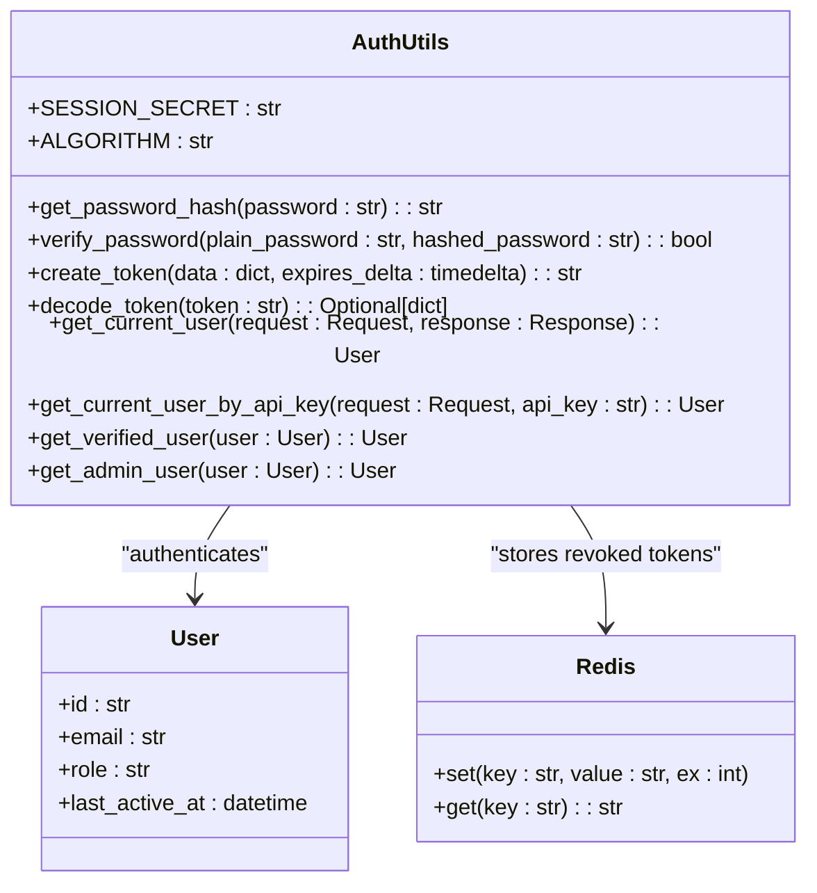

**Diagram sources **
- [auth.py](file://backend/open_webui/utils/auth.py#L51-L419)

**Section sources**
- [auth.py](file://backend/open_webui/utils/auth.py#L1-L419)

## Chat Processing Utilities
The chat processing utilities provide the core functionality for handling chat completions, message processing, and streaming responses. The `chat.py` module orchestrates the entire chat workflow, routing requests to appropriate backend services (Ollama, OpenAI) based on model configuration. It implements sophisticated message processing with support for function calling, tool integration, and pipeline filtering.

The module includes the `generate_chat_completion` function as the primary entry point, which handles both streaming and non-streaming responses. It integrates with billing systems to enforce quotas, processes filter functions for message transformation, and manages direct model connections. The chat system supports arena-style model selection, where requests are randomly routed to available models based on configuration.

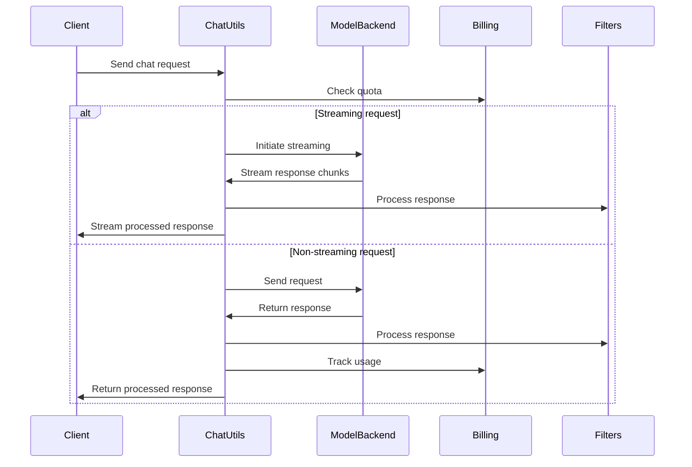

**Diagram sources **
- [chat.py](file://backend/open_webui/utils/chat.py#L72-L331)

**Section sources**
- [chat.py](file://backend/open_webui/utils/chat.py#L1-L490)

## File Handling Utilities
The file handling utilities provide abstraction for file storage and MIME type handling. The `files.py` module implements functions for processing base64-encoded images and audio data, converting them to stored files with appropriate URLs. It integrates with the main file upload system to handle various file types including images, audio, and documents.

The utilities include specialized functions for different file types: `get_image_url_from_base64` for image processing, `get_audio_url_from_base64` for audio files, and `get_file_url_from_base64` as a general dispatcher. The module uses regular expressions to identify base64-encoded content in markdown and converts it to proper file references, enabling rich media support in chat messages.

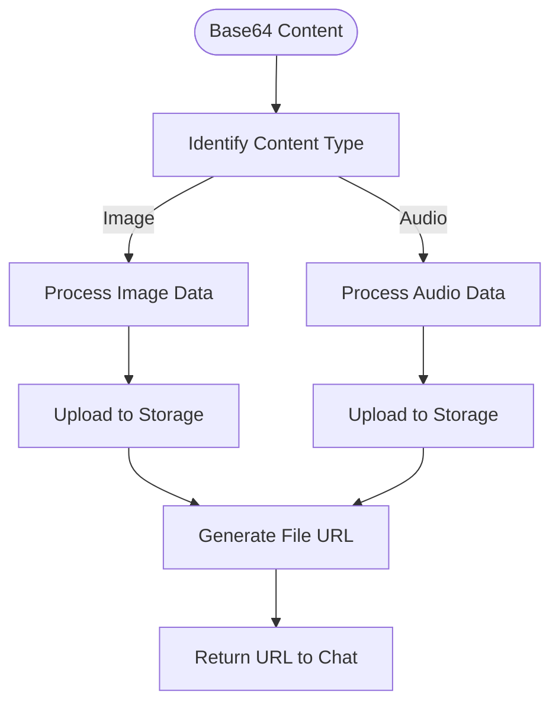

**Diagram sources **
- [files.py](file://backend/open_webui/utils/files.py#L1-L116)

**Section sources**
- [files.py](file://backend/open_webui/utils/files.py#L1-L116)

## Redis Utilities
The Redis utilities provide a robust connection management system with support for various deployment configurations including standalone, sentinel, and cluster modes. The `redis.py` module implements connection pooling and failover handling, with the `SentinelRedisProxy` class providing automatic master failover detection and retry logic.

The utilities include comprehensive configuration options through environment variables, allowing flexible deployment scenarios. The connection factory pattern with caching ensures efficient resource utilization, while the async/sync mode support enables integration with both asynchronous and synchronous code paths. The module handles connection errors gracefully with configurable retry policies.

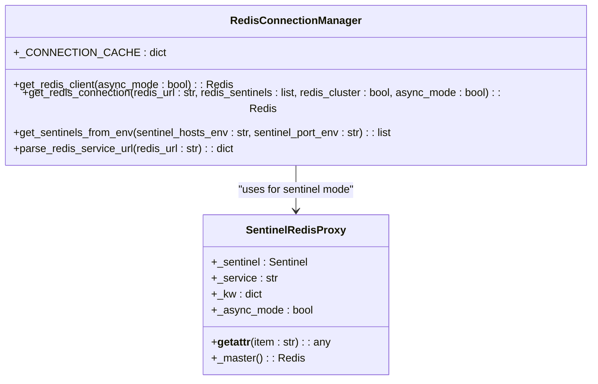

**Diagram sources **
- [redis.py](file://backend/open_webui/utils/redis.py#L1-L231)

**Section sources**
- [redis.py](file://backend/open_webui/utils/redis.py#L1-L231)

## Middleware Utilities
The middleware utilities implement advanced chat processing features including tool calling, web search, memory retrieval, and image generation. The `middleware.py` module contains handlers for various AI capabilities, orchestrating complex workflows that combine multiple services to fulfill user requests.

Key functionality includes the `chat_completion_tools_handler` for function calling, which parses tool responses and formats them for the chat interface. The module also implements web search integration, memory retrieval from vector databases, and image generation capabilities. These middleware functions are designed to be chained together, allowing for sophisticated AI behaviors that combine multiple capabilities.

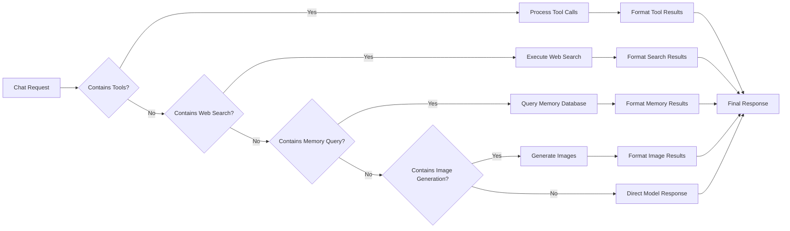

**Diagram sources **
- [middleware.py](file://backend/open_webui/utils/middleware.py#L287-L800)

**Section sources**
- [middleware.py](file://backend/open_webui/utils/middleware.py#L1-L3281)

## Billing Utilities
The billing utilities implement a comprehensive subscription management system with quota enforcement and payment processing. The `billing.py` module provides a `BillingService` class that handles all aspects of user subscriptions, including plan management, subscription lifecycle, usage tracking, and payment integration with YooKassa.

The system supports multiple subscription states (active, trialing, canceled) and enforces quotas through the `check_quota` and `enforce_quota` methods. Usage is tracked by metric type (tokens_input, tokens_output, etc.) and associated with user subscriptions. The payment processing system creates transactions and handles webhook notifications to update subscription status upon successful payments.

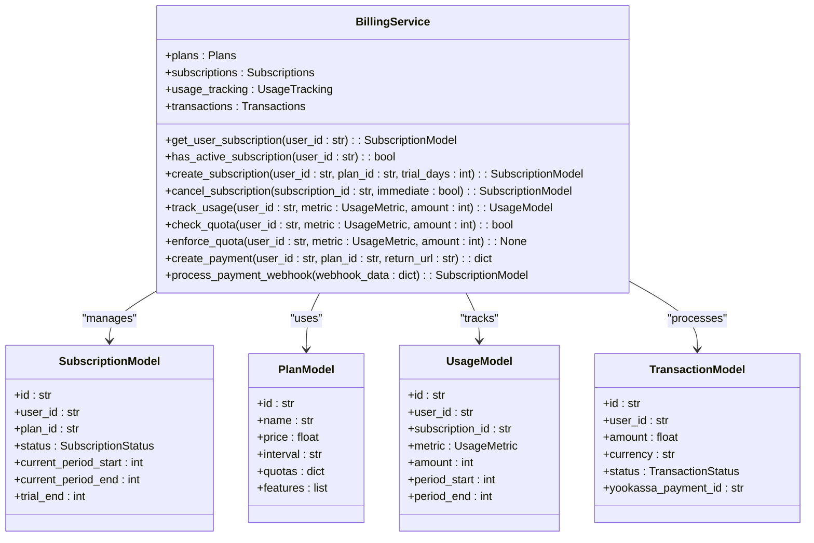

**Diagram sources **
- [billing.py](file://backend/open_webui/utils/billing.py#L39-L566)

**Section sources**
- [billing.py](file://backend/open_webui/utils/billing.py#L1-L566)

## Audit Utilities
The audit utilities implement comprehensive request logging and monitoring capabilities. The `audit.py` module provides an ASGI middleware that captures HTTP request and response data, creating structured audit logs with configurable detail levels. The system supports metadata-only, request-only, and full request-response logging modes.

The audit logger captures essential information including user identity, request method, URL, source IP, user agent, and timing information. Sensitive data such as passwords is automatically redacted from logged content. The middleware selectively audits requests based on method type and endpoint, with special handling for authentication endpoints to ensure security events are always logged.

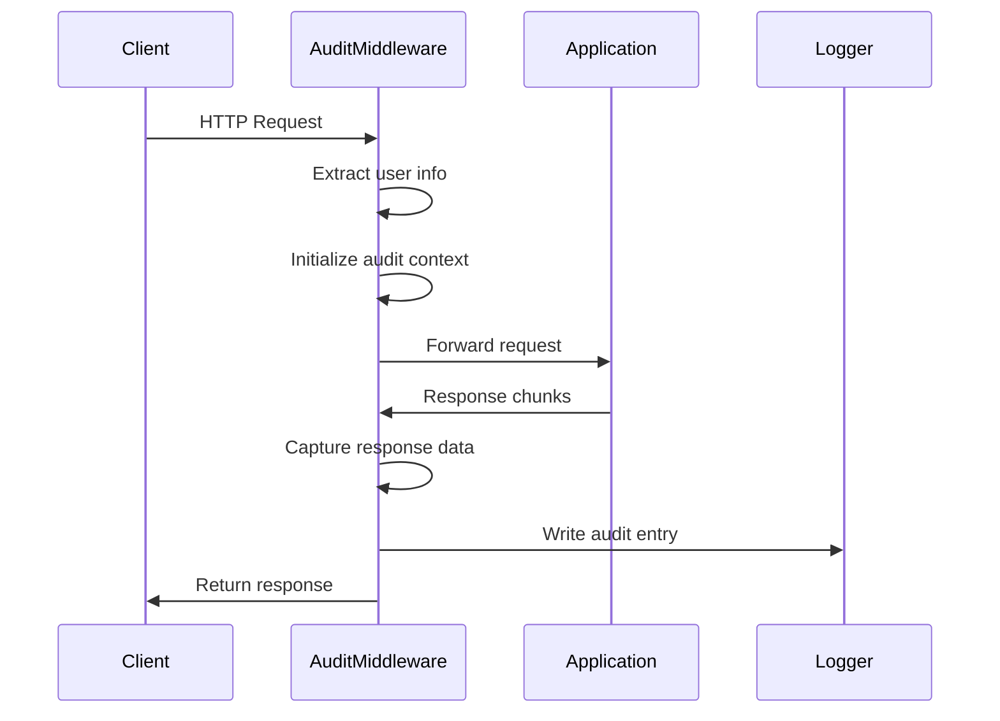

**Diagram sources **
- [audit.py](file://backend/open_webui/utils/audit.py#L121-L284)

**Section sources**
- [audit.py](file://backend/open_webui/utils/audit.py#L1-L284)

## Embeddings Utilities
The embeddings utilities provide a unified interface for generating text embeddings across different backend services. The `embeddings.py` module implements the `generate_embeddings` function that routes requests to appropriate embedding endpoints based on the model provider (Ollama or OpenAI-compatible services).

The system handles request transformation, converting OpenAI-style embedding requests to Ollama format when necessary, and vice versa for responses. It includes access control checks to ensure users can only access models they have permission to use. The utilities also support metadata propagation from the request context to the embedding generation process.

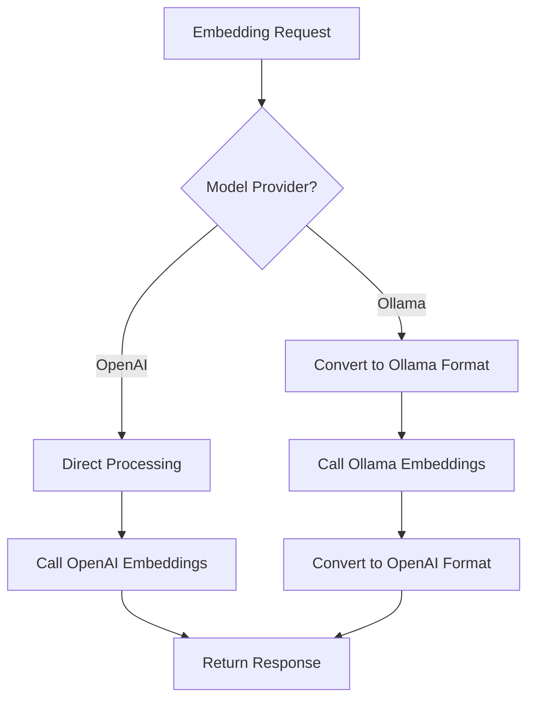

**Diagram sources **
- [embeddings.py](file://backend/open_webui/utils/embeddings.py#L26-L91)

**Section sources**
- [embeddings.py](file://backend/open_webui/utils/embeddings.py#L1-L91)

## Response Utilities
The response utilities handle the transformation of backend responses into standardized API formats. The `response.py` module implements functions to convert Ollama-specific response formats to OpenAI-compatible formats, ensuring consistent API behavior regardless of the underlying model provider.

Key functionality includes `convert_response_ollama_to_openai` for non-streaming responses and `convert_streaming_response_ollama_to_openai` for SSE (Server-Sent Events) streaming. The utilities also handle tool call conversion, usage statistics formatting, and embedding response standardization. This abstraction layer allows the frontend to interact with a consistent API interface.

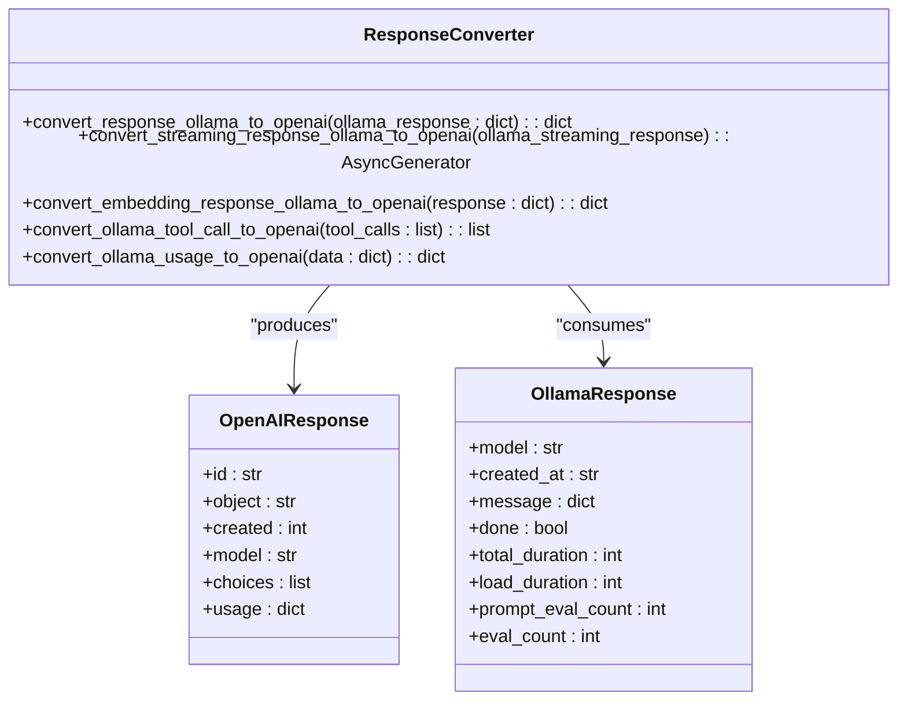

**Diagram sources **
- [response.py](file://backend/open_webui/utils/response.py#L1-L190)

**Section sources**
- [response.py](file://backend/open_webui/utils/response.py#L1-L190)

## Rate Limiting Utilities
The rate limiting utilities implement a flexible rate limiting system with Redis-backed storage and in-memory fallback. The `rate_limit.py` module provides the `RateLimiter` class that uses a rolling window algorithm to track request counts and enforce limits.

The system supports configurable limits, time windows, and bucket sizes. It gracefully handles Redis unavailability by falling back to in-memory storage, ensuring rate limiting continues to function even if the Redis service is temporarily unavailable. The implementation uses a multi-bucket approach to provide accurate rate tracking across time boundaries.

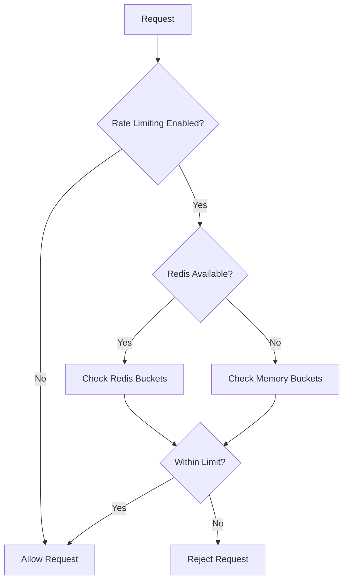

**Diagram sources **
- [rate_limit.py](file://backend/open_webui/utils/rate_limit.py#L6-L140)

**Section sources**
- [rate_limit.py](file://backend/open_webui/utils/rate_limit.py#L1-L140)

## Access Control Utilities
The access control utilities implement a hierarchical permission system based on user roles and group memberships. The `access_control.py` module provides functions to check user permissions across various system components, with support for fine-grained access control at the feature level.

The system combines permissions from multiple sources, including user groups and default permissions, using a "most permissive" policy where a permission granted in any group takes precedence. The utilities support hierarchical permission keys separated by dots, allowing for organized permission namespaces. Functions like `has_access` and `get_users_with_access` enable complex access control scenarios for shared resources.

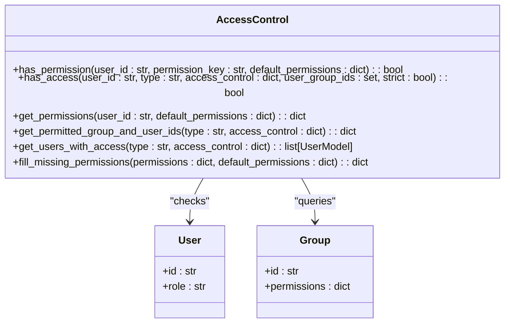

**Diagram sources **
- [access_control.py](file://backend/open_webui/utils/access_control.py#L1-L175)

**Section sources**
- [access_control.py](file://backend/open_webui/utils/access_control.py#L1-L175)

## Integration and Usage Patterns
The utility modules are designed to be shared across routers and components through dependency injection and direct imports. The main application in `main.py` initializes these utilities and makes them available through the app state, allowing routers to access shared functionality without tight coupling.

Common usage patterns include implementing rate limiting on new endpoints by creating a RateLimiter instance with appropriate parameters, and processing uploaded files by leveraging the file handling utilities to convert base64 content to stored files. The authentication utilities are integrated into routers using FastAPI's Depends system, with functions like `get_verified_user` and `get_admin_user` providing role-based access control.

```mermaid
graph TD
A[Main Application] --> B[Initialize Utilities]
B --> C[Auth Utils]
B --> D[Redis Utils]
B --> E[Billing Utils]
B --> F[Audit Utils]
A --> G[Mount Routers]
G --> H[Chats Router]
G --> I[Files Router]
G --> J[Users Router]
H --> C: "Uses for authentication"
H --> E: "Uses for quota checking"
I --> D: "Uses for rate limiting"
I --> F: "Uses for audit logging"
J --> C: "Uses for admin checks"
```

**Diagram sources **
- [main.py](file://backend/open_webui/main.py#L70-L98)
- [chats.py](file://backend/open_webui/routers/chats.py#L25-L26)
- [files.py](file://backend/open_webui/routers/files.py#L48-L49)

**Section sources**
- [main.py](file://backend/open_webui/main.py#L1-L2352)
- [chats.py](file://backend/open_webui/routers/chats.py#L1-L942)
- [files.py](file://backend/open_webui/routers/files.py#L1-L761)

## Configuration and External Services
The utility modules integrate with external services through configuration-driven parameters and environment variables. Redis connectivity is configured through REDIS_URL, REDIS_SENTINEL_HOSTS, and related environment variables, supporting various deployment topologies. The billing system integrates with YooKassa for payment processing, with API credentials managed through environment variables.

Configuration options are centralized in the config module and exposed through the app state, allowing utilities to access settings without direct dependencies. External service integrations follow a consistent pattern of environment variable configuration, connection pooling, and error handling to ensure reliability. The system supports multiple AI service providers (OpenAI, Ollama) through configurable base URLs and API keys.

**Section sources**
- [main.py](file://backend/open_webui/main.py#L115-L200)
- [billing.py](file://backend/open_webui/utils/billing.py#L26-L27)
- [redis.py](file://backend/open_webui/utils/redis.py#L8-L14)

## Conclusion
The utility modules in the open-webui backend provide a robust foundation for the application's core functionality. Through careful design and modular architecture, these utilities enable consistent behavior across the system while maintaining flexibility for different deployment scenarios and integration requirements. The comprehensive feature set, from authentication and billing to AI capabilities and audit logging, demonstrates a well-considered approach to building a scalable and maintainable backend system. The shared utility pattern reduces code duplication and ensures that critical functionality like security, rate limiting, and access control is consistently applied throughout the application.