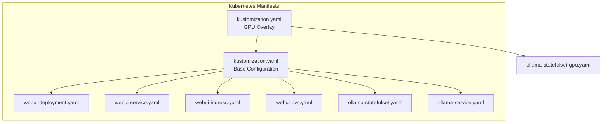
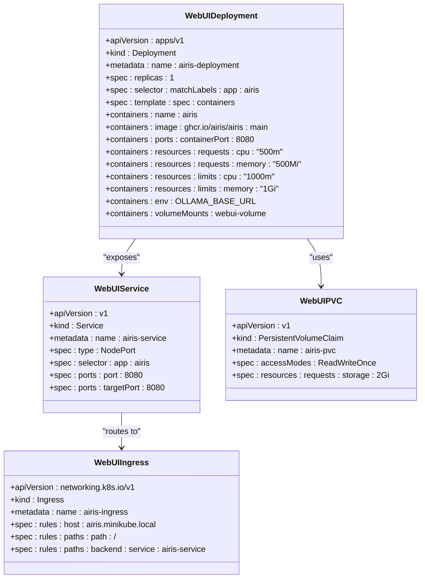
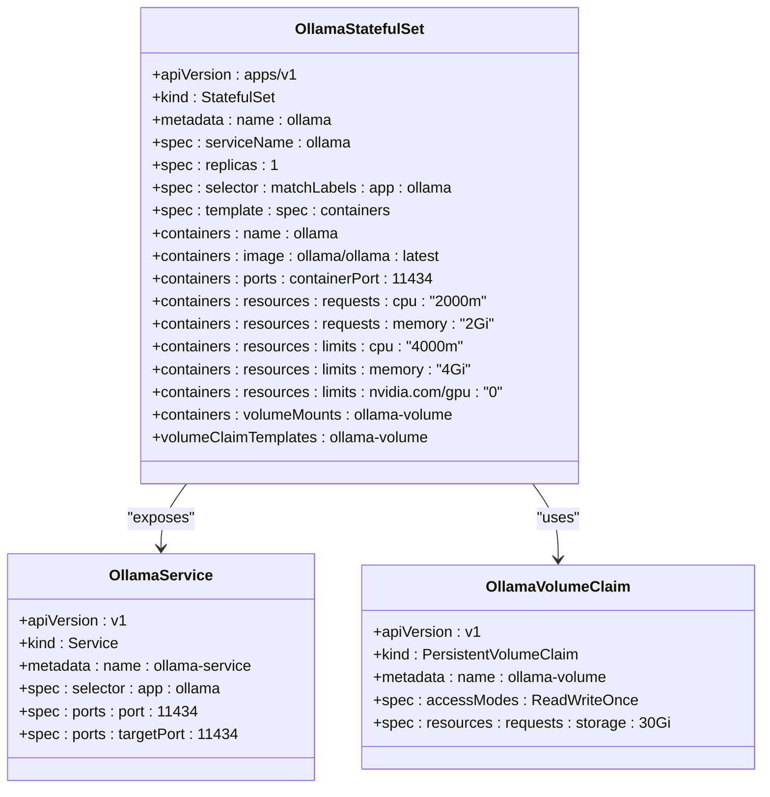
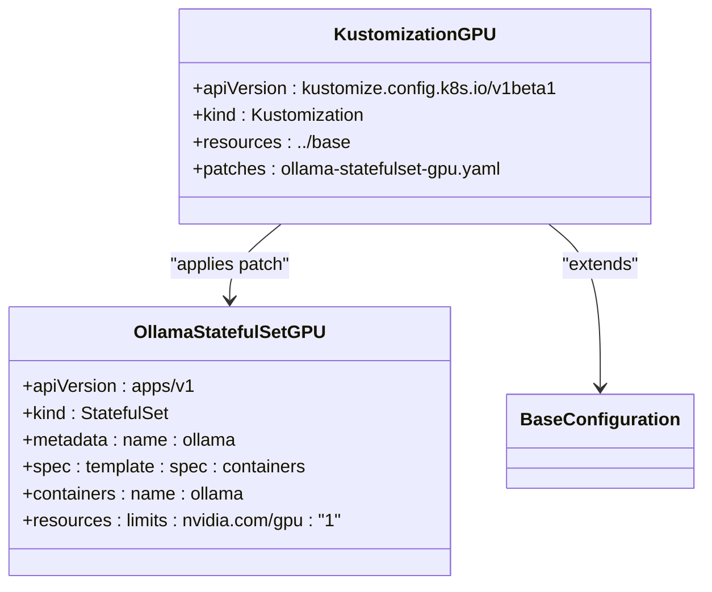
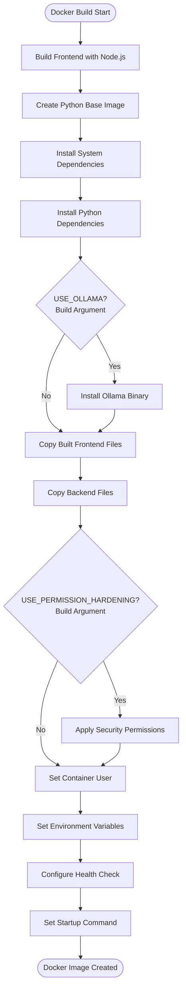
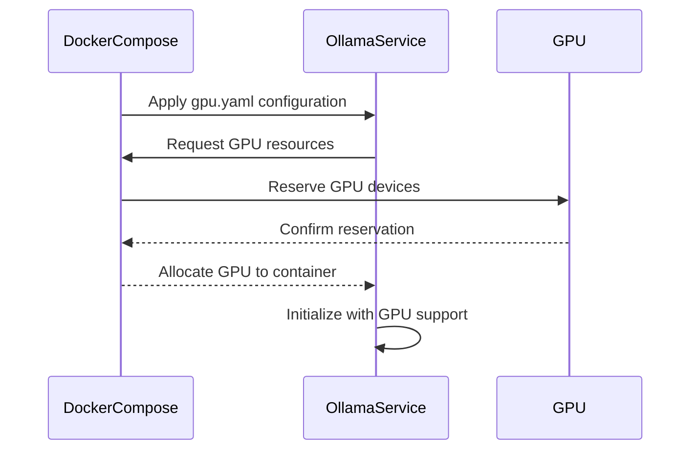
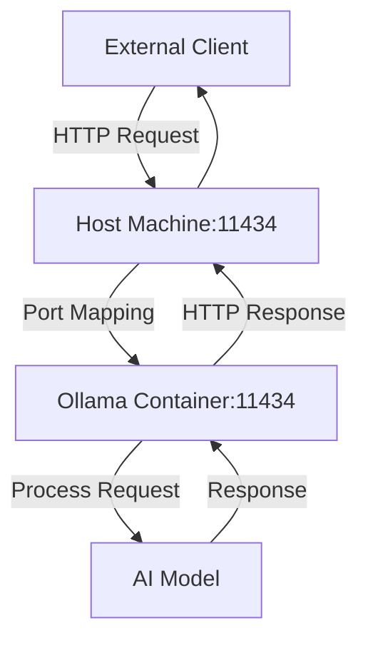
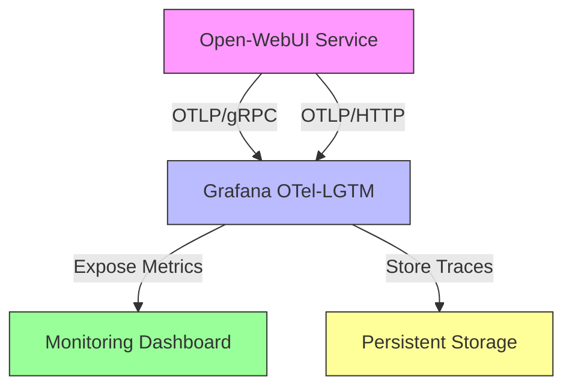
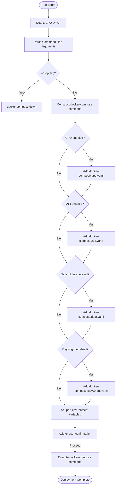

# Deployment Directory Structure

<cite>
**Referenced Files in This Document**   
- [Dockerfile](file://Dockerfile)
- [docker-compose.yaml](file://docker-compose.yaml)
- [docker-compose.gpu.yaml](file://docker-compose.gpu.yaml)
- [docker-compose.api.yaml](file://docker-compose.api.yaml)
- [docker-compose.otel.yaml](file://docker-compose.otel.yaml)
- [kubernetes/manifest/base/webui-deployment.yaml](file://kubernetes/manifest/base/webui-deployment.yaml)
- [kubernetes/manifest/base/webui-service.yaml](file://kubernetes/manifest/base/webui-service.yaml)
- [kubernetes/manifest/base/webui-ingress.yaml](file://kubernetes/manifest/base/webui-ingress.yaml)
- [kubernetes/manifest/base/webui-pvc.yaml](file://kubernetes/manifest/base/webui-pvc.yaml)
- [kubernetes/manifest/base/ollama-statefulset.yaml](file://kubernetes/manifest/base/ollama-statefulset.yaml)
- [kubernetes/manifest/base/ollama-service.yaml](file://kubernetes/manifest/base/ollama-service.yaml)
- [kubernetes/manifest/gpu/ollama-statefulset-gpu.yaml](file://kubernetes/manifest/gpu/ollama-statefulset-gpu.yaml)
- [kubernetes/manifest/base/kustomization.yaml](file://kubernetes/manifest/base/kustomization.yaml)
- [kubernetes/manifest/gpu/kustomization.yaml](file://kubernetes/manifest/gpu/kustomization.yaml)
- [kubernetes/helm/README.md](file://kubernetes/helm/README.md)
- [run-compose.sh](file://run-compose.sh)
</cite>

## Table of Contents
1. [Introduction](#introduction)
2. [Kubernetes Deployment Structure](#kubernetes-deployment-structure)
3. [Docker Image Build Process](#docker-image-build-process)
4. [Multi-Container Orchestration with Docker Compose](#multi-container-orchestration-with-docker-compose)
5. [Deployment Scenarios and Configuration Variants](#deployment-scenarios-and-configuration-variants)
6. [Deployment Best Practices and Scaling Considerations](#deployment-best-practices-and-scaling-considerations)
7. [Conclusion](#conclusion)

## Introduction
The open-webui project provides a comprehensive set of deployment configurations for various environments, from local development to production-grade Kubernetes clusters. This document details the deployment directory structure, focusing on the Kubernetes manifests, Docker build process, and docker-compose configurations that enable flexible deployment across different infrastructure types. The deployment system is designed to support multiple scenarios including GPU acceleration, API-only deployments, and observability integration.

## Kubernetes Deployment Structure

The Kubernetes deployment structure is organized using Kustomize for configuration management, with base configurations and overlays for specialized environments. The base manifests define the core components of the application, while the GPU overlay extends these configurations to enable GPU acceleration for the Ollama service.



**Diagram sources**
- [kubernetes/manifest/base/kustomization.yaml](file://kubernetes/manifest/base/kustomization.yaml)
- [kubernetes/manifest/gpu/kustomization.yaml](file://kubernetes/manifest/gpu/kustomization.yaml)

**Section sources**
- [kubernetes/manifest/base/kustomization.yaml](file://kubernetes/manifest/base/kustomization.yaml)
- [kubernetes/manifest/gpu/kustomization.yaml](file://kubernetes/manifest/gpu/kustomization.yaml)

### Core Kubernetes Components

The base Kubernetes manifests define several critical resources for the open-webui application. The deployment includes a PostgreSQL database, the open-webui frontend/backend service, and the Ollama AI model server, each with appropriate resource specifications and networking configurations.

#### WebUI Deployment Configuration
The webui-deployment.yaml file defines the deployment for the open-webui application, specifying resource requests and limits for CPU and memory. The deployment mounts persistent storage for application data and configures environment variables for service discovery.



**Diagram sources**
- [kubernetes/manifest/base/webui-deployment.yaml](file://kubernetes/manifest/base/webui-deployment.yaml)
- [kubernetes/manifest/base/webui-service.yaml](file://kubernetes/manifest/base/webui-service.yaml)
- [kubernetes/manifest/base/webui-ingress.yaml](file://kubernetes/manifest/base/webui-ingress.yaml)
- [kubernetes/manifest/base/webui-pvc.yaml](file://kubernetes/manifest/base/webui-pvc.yaml)

**Section sources**
- [kubernetes/manifest/base/webui-deployment.yaml](file://kubernetes/manifest/base/webui-deployment.yaml)
- [kubernetes/manifest/base/webui-service.yaml](file://kubernetes/manifest/base/webui-service.yaml)
- [kubernetes/manifest/base/webui-ingress.yaml](file://kubernetes/manifest/base/webui-ingress.yaml)
- [kubernetes/manifest/base/webui-pvc.yaml](file://kubernetes/manifest/base/webui-pvc.yaml)

#### Ollama StatefulSet Configuration
The Ollama service is deployed as a StatefulSet to ensure stable network identifiers and persistent storage for model data. The base configuration specifies substantial resource requests and limits to accommodate the memory requirements of large language models.



**Diagram sources**
- [kubernetes/manifest/base/ollama-statefulset.yaml](file://kubernetes/manifest/base/ollama-statefulset.yaml)
- [kubernetes/manifest/base/ollama-service.yaml](file://kubernetes/manifest/base/ollama-service.yaml)

**Section sources**
- [kubernetes/manifest/base/ollama-statefulset.yaml](file://kubernetes/manifest/base/ollama-statefulset.yaml)
- [kubernetes/manifest/base/ollama-service.yaml](file://kubernetes/manifest/base/ollama-service.yaml)

#### GPU Configuration Overlay
The GPU configuration overlay modifies the base Ollama StatefulSet to enable GPU acceleration. This is achieved through a strategic patch that adds GPU resource limits to the container specification, allowing the Ollama service to leverage GPU hardware for improved inference performance.



**Diagram sources**
- [kubernetes/manifest/gpu/ollama-statefulset-gpu.yaml](file://kubernetes/manifest/gpu/ollama-statefulset-gpu.yaml)
- [kubernetes/manifest/gpu/kustomization.yaml](file://kubernetes/manifest/gpu/kustomization.yaml)

**Section sources**
- [kubernetes/manifest/gpu/ollama-statefulset-gpu.yaml](file://kubernetes/manifest/gpu/ollama-statefulset-gpu.yaml)
- [kubernetes/manifest/gpu/kustomization.yaml](file://kubernetes/manifest/gpu/kustomization.yaml)

## Docker Image Build Process

The Dockerfile defines a multi-stage build process for creating the open-webui container image. The build process is highly configurable through build arguments that enable various features and optimizations based on deployment requirements.



**Diagram sources**
- [Dockerfile](file://Dockerfile)

**Section sources**
- [Dockerfile](file://Dockerfile)

### Build Configuration Options
The Docker build process supports several configuration options through build arguments that control the features included in the final image:

- **USE_CUDA**: Enables CUDA support for GPU acceleration
- **USE_OLLAMA**: Installs the Ollama binary within the container
- **USE_SLIM**: Creates a minimal image without pre-downloaded models
- **USE_PERMISSION_HARDENING**: Applies security hardening for OpenShift environments
- **USE_EMBEDDING_MODEL**: Specifies the sentence transformer model for embeddings
- **USE_RERANKING_MODEL**: Specifies the model for reranking search results

These build arguments allow for the creation of specialized images optimized for different deployment scenarios, from resource-constrained environments to high-performance GPU clusters.

## Multi-Container Orchestration with Docker Compose

The docker-compose.yaml file defines the multi-container application stack, orchestrating the open-webui service, PostgreSQL database, and optional Ollama service. The configuration uses environment variables for flexible configuration across different deployment environments.

```mermaid
graph TD
subgraph "Docker Compose Services"
Postgres[PostgreSQL Service]
Airis[Open-WebUI Service]
Ollama[Ollama Service<br/>(Commented)]
end
subgraph "Volumes"
PostgresData[postgres-data]
AirisData[airis]
OllamaData[ollama]
end
Airis --> Postgres : "DATABASE_URL"
Airis --> Ollama : "OLLAMA_BASE_URL"
Postgres --> PostgresData
Airis --> AirisData
Ollama --> OllamaData
style Ollama stroke-dasharray: 5 5
```

**Diagram sources**
- [docker-compose.yaml](file://docker-compose.yaml)

**Section sources**
- [docker-compose.yaml](file://docker-compose.yaml)

### Service Configuration Details
The docker-compose configuration defines three primary services with specific configurations:

- **PostgreSQL**: A persistent database service with volume mounting for data persistence and health checking to ensure readiness before the webui service starts
- **Open-WebUI (airis)**: The main application service that builds from the Dockerfile or uses a pre-built image, with volume mounting for application data and dependency management on the database service
- **Ollama**: An optional service that can be uncommented to run Ollama within the same Docker Compose stack

The configuration uses environment variables with default values to provide flexibility in deployment settings, allowing users to override defaults through environment variables or .env files.

## Deployment Scenarios and Configuration Variants

The open-webui project provides specialized docker-compose configuration files for different deployment scenarios, enabling users to easily enable specific features by including additional configuration files.

### GPU Acceleration Configuration
The docker-compose.gpu.yaml file enables GPU support for the Ollama service by configuring Docker's resource reservation system to allocate GPU devices to the container.



**Diagram sources**
- [docker-compose.gpu.yaml](file://docker-compose.gpu.yaml)

**Section sources**
- [docker-compose.gpu.yaml](file://docker-compose.gpu.yaml)

This configuration uses Docker's deploy.resources.reservations.devices feature to request GPU access, with configurable parameters for the GPU driver and count through environment variables.

### API-Only Deployment Configuration
The docker-compose.api.yaml file exposes the Ollama API externally by mapping the service port to the host machine, enabling external applications to access the AI model server directly.



**Diagram sources**
- [docker-compose.api.yaml](file://docker-compose.api.yaml)

**Section sources**
- [docker-compose.api.yaml](file://docker-compose.api.yaml)

### OpenTelemetry Integration Configuration
The docker-compose.otel.yaml file configures observability integration with OpenTelemetry, enabling distributed tracing and metrics collection for monitoring application performance.



**Diagram sources**
- [docker-compose.otel.yaml](file://docker-compose.otel.yaml)

**Section sources**
- [docker-compose.otel.yaml](file://docker-compose.otel.yaml)

This configuration sets environment variables to enable OpenTelemetry instrumentation and specifies the endpoint for exporting telemetry data to the Grafana collector.

### Unified Deployment Script
The run-compose.sh script provides a unified interface for managing deployments with various configuration options, automatically detecting GPU hardware and constructing the appropriate docker-compose command.



**Section sources**
- [run-compose.sh](file://run-compose.sh)

## Deployment Best Practices and Scaling Considerations

When deploying open-webui in production environments, several best practices should be followed to ensure reliability, performance, and security.

### Resource Allocation Guidelines
Proper resource allocation is critical for the stable operation of the open-webui application, particularly for the Ollama service which requires substantial memory for loading large language models:

- **WebUI Service**: Minimum 500m CPU and 500Mi memory, with recommended limits of 1000m CPU and 1Gi memory
- **Ollama Service**: Minimum 2000m CPU and 2Gi memory, with recommended limits of 4000m CPU and 4Gi memory plus GPU resources when available
- **PostgreSQL**: Adequate storage allocation based on expected data volume, with regular backups and monitoring

### High Availability and Scaling
For production deployments requiring high availability, consider the following scaling strategies:

- Increase the replica count in the webui-deployment.yaml for horizontal scaling of the frontend/backend service
- Implement a clustered PostgreSQL solution for database high availability
- Use Kubernetes Horizontal Pod Autoscaler to automatically adjust replica counts based on resource utilization
- Configure persistent storage with appropriate backup and disaster recovery procedures

### Security Considerations
Security best practices for open-webui deployments include:

- Using the USE_PERMISSION_HARDENING build option for OpenShift or other security-conscious environments
- Setting strong values for WEBUI_SECRET_KEY and other security-related environment variables
- Restricting network access to the Ollama API endpoint when not needed externally
- Regularly updating container images to incorporate security patches

### Monitoring and Observability
Effective monitoring is essential for maintaining system health and performance:

- Enable OpenTelemetry integration using the docker-compose.otel.yaml configuration
- Monitor resource utilization of both CPU and memory, particularly for the Ollama service
- Implement logging and alerting for critical system events
- Track application performance metrics such as request latency and error rates

## Conclusion
The open-webui project provides a comprehensive and flexible deployment system that supports various infrastructure types and deployment scenarios. The Kubernetes manifests offer a production-ready configuration with proper resource management and persistent storage, while the docker-compose configurations enable easy local development and testing. The modular design of the deployment system, with base configurations and specialized overlays, allows for easy customization to meet specific requirements. By following the documented best practices for resource allocation, scaling, and security, users can deploy open-webui in environments ranging from local development setups to production-grade clusters with confidence in system stability and performance.