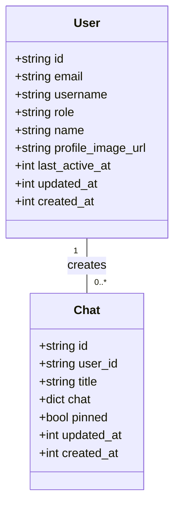
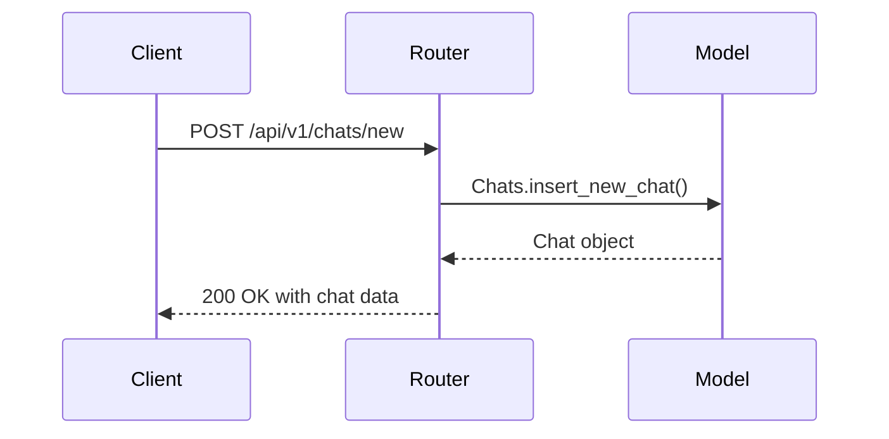
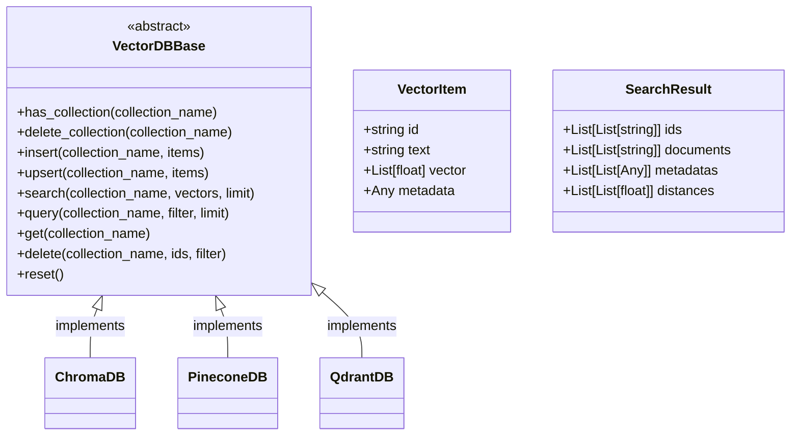
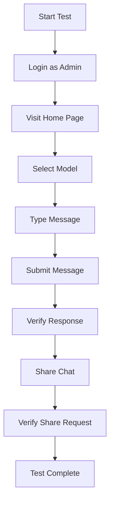

# Directory Structure Breakdown

<cite>
**Referenced Files in This Document**   
- [main.py](file://backend/open_webui/main.py)
- [users.py](file://backend/open_webui/models/users.py)
- [chats.py](file://backend/open_webui/routers/chats.py)
- [main.py](file://backend/open_webui/retrieval/vector/main.py)
- [chat.py](file://backend/open_webui/utils/chat.py)
- [config.py](file://backend/open_webui/config.py)
- [index.ts](file://src/lib/index.ts)
- [chat.cy.ts](file://cypress/e2e/chat.cy.ts)
- [open-webui.yaml](file://kubernetes/manifest/base/open-webui.yaml)
- [rosepine.css](file://static/themes/rosepine.css)
</cite>

## Table of Contents
1. [Top-Level Directory Overview](#top-level-directory-overview)
2. [Backend Structure](#backend-structure)
3. [Frontend Structure](#frontend-structure)
4. [Testing with Cypress](#testing-with-cypress)
5. [Kubernetes Deployment](#kubernetes-deployment)
6. [Static Assets and Themes](#static-assets-and-themes)
7. [Navigation Patterns and Contribution Guidelines](#navigation-patterns-and-contribution-guidelines)

## Top-Level Directory Overview

The open-webui repository follows a well-organized structure that separates concerns between backend, frontend, testing, deployment, and static assets. The top-level directories include backend/ for the FastAPI application, src/ for the Svelte frontend, cypress/ for end-to-end testing, kubernetes/ for deployment manifests, and static/ for themes and assets. This separation enables independent development and deployment of different application components while maintaining clear boundaries between concerns. The structure supports modularity and maintainability by grouping related functionality together and following established conventions for Python and Svelte applications.

**Section sources**
- [main.py](file://backend/open_webui/main.py)
- [index.ts](file://src/lib/index.ts)

## Backend Structure

The backend directory contains the FastAPI application with its core components organized in the open_webui package. This structure follows Python packaging conventions and separates concerns through dedicated subdirectories for models, routers, retrieval functionality, and utilities. The organization promotes modularity by isolating database schema definitions, API endpoints, retrieval logic, and helper functions into distinct modules that can be developed and tested independently.

### Models Directory

The models/ directory contains SQLAlchemy model definitions that map to database tables, with each file corresponding to a specific domain entity such as users, chats, or files. This organization follows a feature-based pattern where related models are grouped by functionality rather than type. For example, users.py defines the User model with its associated Pydantic schemas and forms, while chats.py contains the Chat model and related data structures. This approach makes it easy to locate all code related to a specific feature and understand its data representation.



**Diagram sources**
- [users.py](file://backend/open_webui/models/users.py)

**Section sources**
- [users.py](file://backend/open_webui/models/users.py)

### Routers Directory

The routers/ directory contains API endpoint definitions organized by feature, with each file corresponding to a specific domain such as chats, users, or files. This structure follows FastAPI's APIRouter pattern, allowing for modular endpoint registration in the main application. Each router file imports the necessary models and dependencies to handle requests for its domain, implementing CRUD operations and other business logic. The naming convention matches the models directory, creating a clear correspondence between data models and their API endpoints.



**Diagram sources**
- [chats.py](file://backend/open_webui/routers/chats.py)

**Section sources**
- [chats.py](file://backend/open_webui/routers/chats.py)

### Retrieval Directory

The retrieval/ directory implements the application's document retrieval and search functionality with a modular structure that separates concerns into loaders, vector databases, web search, and utility functions. The loaders/ subdirectory contains modules for processing different document types, while vector/ contains the vector database abstraction and specific implementations. The web/ subdirectory handles internet search functionality with support for multiple search engines. This organization enables extensibility by allowing new loaders, vector databases, or search engines to be added without modifying existing code.



**Diagram sources**
- [main.py](file://backend/open_webui/retrieval/vector/main.py)

**Section sources**
- [main.py](file://backend/open_webui/retrieval/vector/main.py)

### Utils Directory

The utils/ directory contains reusable utility functions and classes organized by concern, with subdirectories for specific functionality like images, telemetry, and OAuth. This structure promotes code reuse by providing a centralized location for common functionality that can be imported across the application. The flat structure within the utils directory follows a type-based organization, grouping related functions together while maintaining a shallow hierarchy that is easy to navigate. This approach balances discoverability with simplicity, making it straightforward to find and use utility functions.

**Section sources**
- [chat.py](file://backend/open_webui/utils/chat.py)
- [config.py](file://backend/open_webui/config.py)

## Frontend Structure

The src/ directory contains the Svelte frontend application with a structure that follows SvelteKit conventions and organizes code by feature and type. The lib/ subdirectory serves as a shared library of components, APIs, and utilities that can be imported throughout the application using the $lib alias. This structure promotes reusability and maintainability by centralizing common functionality while allowing for feature-specific implementations when needed.

### Components Directory

The src/lib/components/ directory contains reusable UI components organized by feature area, with subdirectories for admin, channel, chat, common, icons, layout, notes, playground, and workspace components. This organization follows a hybrid approach that combines feature-based and type-based grouping, making it easy to locate components related to specific functionality while maintaining a logical hierarchy. The common/ subdirectory contains generic UI elements like buttons, modals, and form controls that can be used across features, while feature-specific directories contain components tailored to particular use cases.

**Section sources**
- [index.ts](file://src/lib/index.ts)

### Routes Directory

The src/routes/ directory contains the application's page routes defined using SvelteKit's file-based routing system. The structure uses nested directories and special naming conventions like (app) for route groups and +page.svelte for page components. This approach enables complex routing patterns while maintaining a clear mapping between URL paths and file locations. The layout components (+layout.svelte) provide shared UI elements and logic for groups of pages, promoting consistency across the application. This structure supports both static and dynamic routes, with parameterized routes using square bracket syntax for dynamic segments.

**Section sources**
- [index.ts](file://src/lib/index.ts)

### APIs Directory

The src/lib/apis/ directory contains API client modules organized by feature, with each subdirectory corresponding to a specific domain such as admin, audio, auths, or billing. This structure mirrors the backend's router organization, creating a clear correspondence between frontend API clients and backend endpoints. Each API module exports functions that wrap fetch calls to specific endpoints, handling request formatting, authentication, and response parsing. This approach centralizes API interactions and provides a consistent interface for consuming backend services throughout the frontend application.

**Section sources**
- [index.ts](file://src/lib/index.ts)

## Testing with Cypress

The cypress/ directory contains end-to-end tests that verify the application's functionality from the user's perspective. The e2e/ subdirectory contains test files organized by feature, with each file using Cypress's testing framework to simulate user interactions and assert expected outcomes. The support/ directory contains custom commands and type definitions that extend Cypress's functionality and provide a consistent testing interface. This structure enables comprehensive testing of critical user flows such as chat interactions, document management, and settings configuration, ensuring the application behaves as expected in real-world scenarios.



**Diagram sources**
- [chat.cy.ts](file://cypress/e2e/chat.cy.ts)

**Section sources**
- [chat.cy.ts](file://cypress/e2e/chat.cy.ts)

## Kubernetes Deployment

The kubernetes/ directory contains deployment manifests organized by environment, with base/ containing common configuration and gpu/ containing GPU-specific overrides. This structure follows Kubernetes best practices for configuration management, using Kustomize to manage environment-specific variations. The manifests define the application's deployment, service, ingress, persistent volume claim, and stateful set resources, providing a complete specification for running the application in a Kubernetes cluster. This approach enables consistent deployments across environments while allowing for necessary variations in resource allocation and configuration.

**Section sources**
- [open-webui.yaml](file://kubernetes/manifest/base/open-webui.yaml)

## Static Assets and Themes

The static/ directory contains themes and assets that customize the application's appearance and behavior. The themes/ subdirectory contains CSS files that define color schemes and styling for different themes, with each file using CSS custom properties to define theme-specific values. This structure enables easy theme switching and customization without modifying the core application code. The static assets support branding and user experience enhancements, allowing for visual customization to meet different deployment requirements.

```mermaid
classDiagram
class Theme {
<<abstract>>
+--primary : string
+--secondary : string
+--background : string
+--text : string
}
Theme <|-- RosePine : implements
Theme <|-- DarkMode : implements
Theme <|-- LightMode : implements
RosePine : +--primary : #eb6f92
RosePine : +--secondary : #e0def4
RosePine : +--background : #1f1d2e
RosePine : +--text : #e0def4
```

**Diagram sources**
- [rosepine.css](file://static/themes/rosepine.css)

**Section sources**
- [rosepine.css](file://static/themes/rosepine.css)

## Navigation Patterns and Contribution Guidelines

The open-webui codebase follows consistent navigation patterns that make it easy to locate related functionality across the frontend and backend. Feature parity between the models, routers, and APIs directories creates a predictable structure where developers can find related code by following the feature-based organization. When contributing to the codebase, developers should maintain this pattern by creating corresponding files in each relevant directory when adding new features. For backend changes, this means adding a model, router, and any necessary utility functions. For frontend changes, it involves creating components, API clients, and routes as needed. This approach ensures consistency across the codebase and makes it easier for team members to understand and extend the application's functionality.

**Section sources**
- [main.py](file://backend/open_webui/main.py)
- [index.ts](file://src/lib/index.ts)