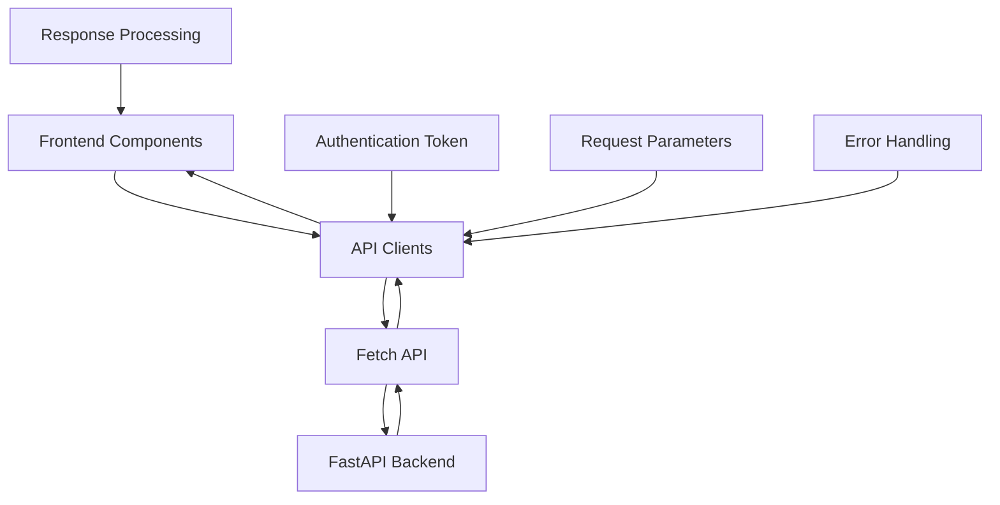
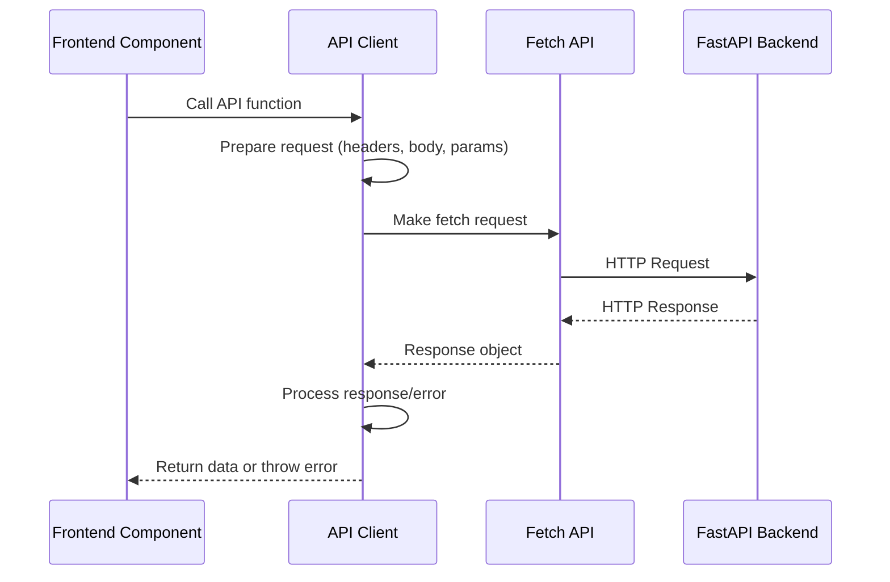
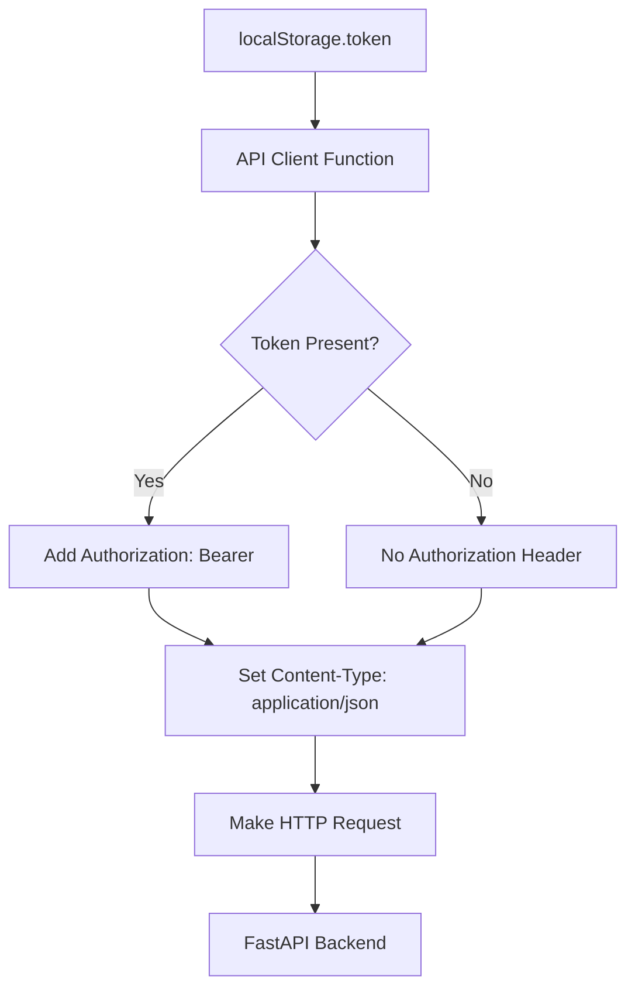
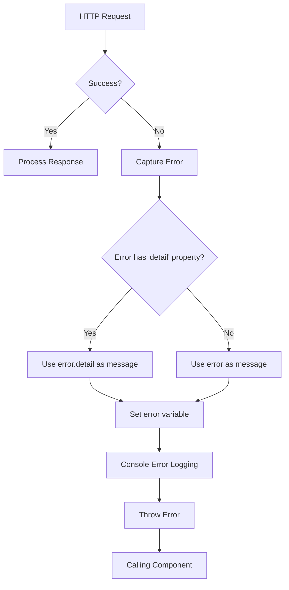
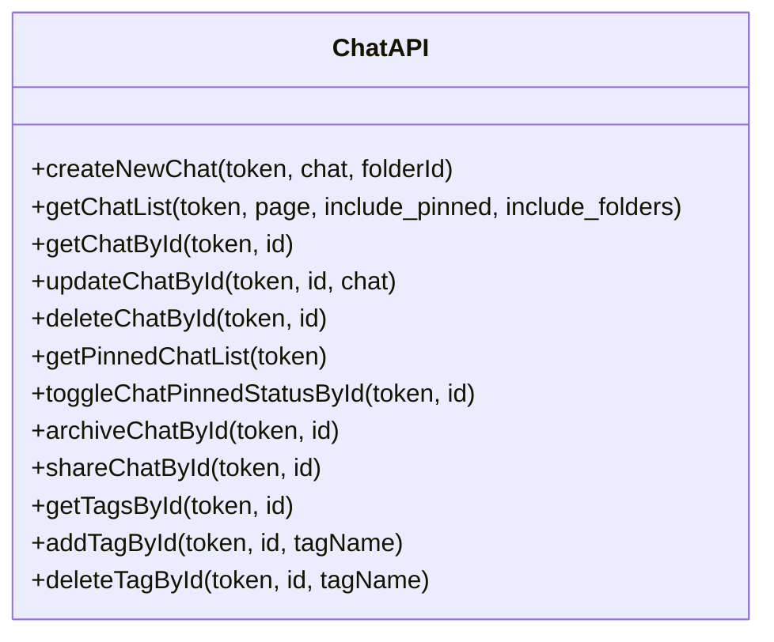
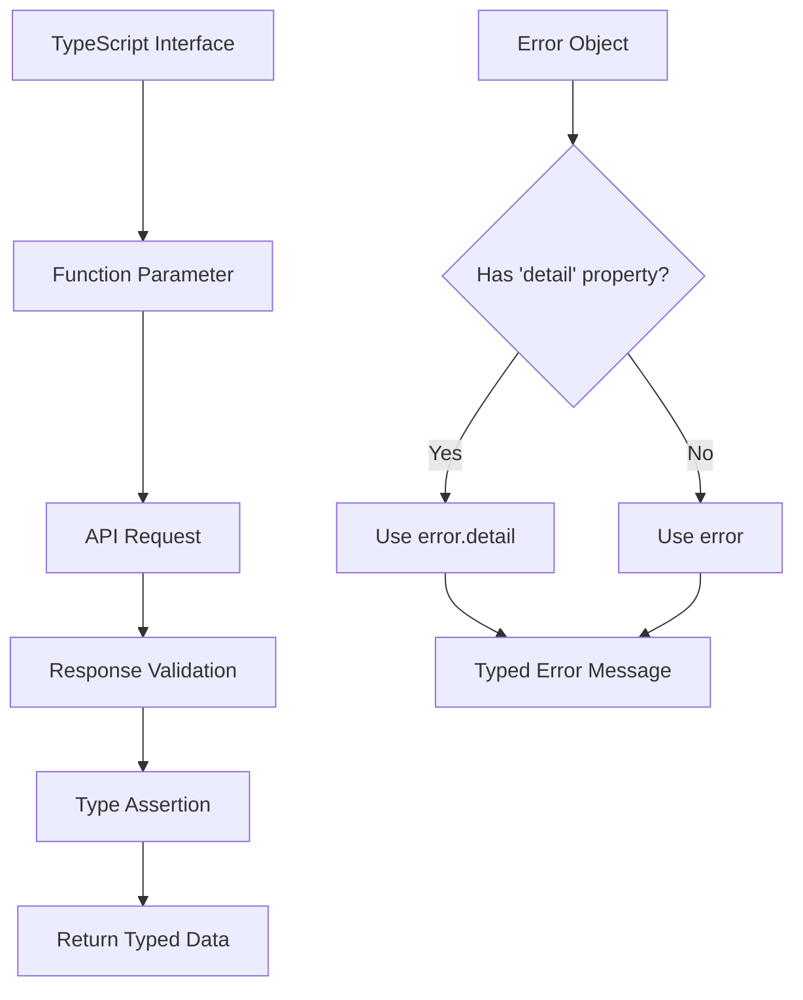
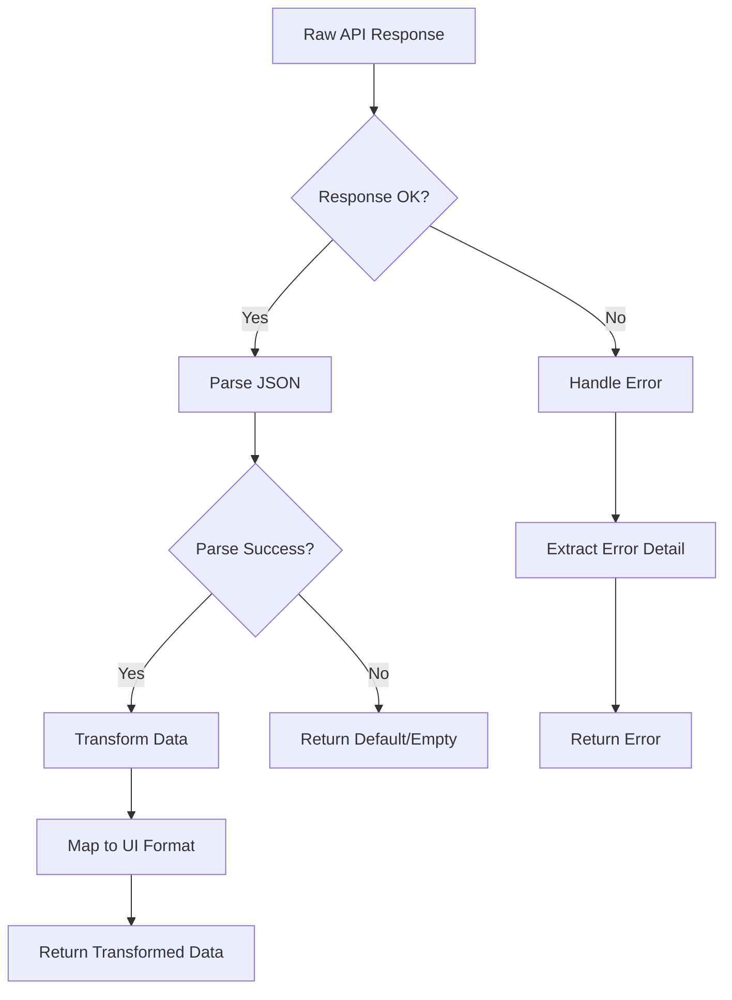
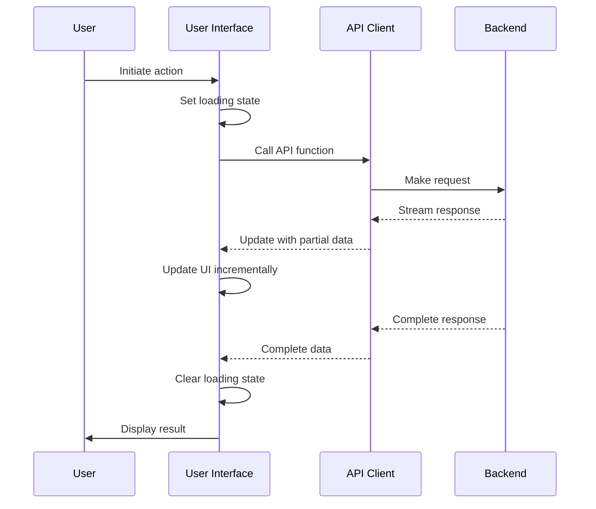
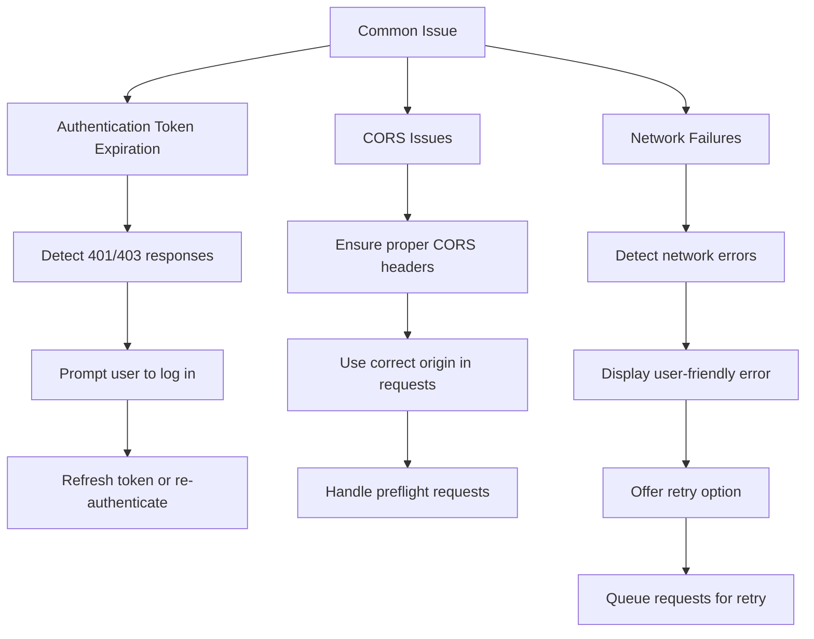

# API Client Integration

<cite>
**Referenced Files in This Document**   
- [index.ts](file://src/lib/apis/index.ts)
- [chats/index.ts](file://src/lib/apis/chats/index.ts)
- [models/index.ts](file://src/lib/apis/models/index.ts)
- [users/index.ts](file://src/lib/apis/users/index.ts)
- [constants.ts](file://src/lib/constants.ts)
- [Chat.svelte](file://src/lib/components/chat/Chat.svelte)
</cite>

## Table of Contents
1. [API Client Architecture](#api-client-architecture)
2. [Feature-Based Organization](#feature-based-organization)
3. [HTTP Request Implementation](#http-request-implementation)
4. [Authentication and Headers](#authentication-and-headers)
5. [Error Handling Patterns](#error-handling-patterns)
6. [Chat API Client Implementation](#chat-api-client-implementation)
7. [Type Safety with TypeScript](#type-safety-with-typescript)
8. [Response Transformation](#response-transformation)
9. [Loading States and UI Integration](#loading-states-and-ui-integration)
10. [Common Issues and Solutions](#common-issues-and-solutions)

## API Client Architecture

The API client architecture in open-webui follows a modular, feature-based organization pattern that encapsulates HTTP requests to the FastAPI backend. The architecture is designed to provide a clean separation of concerns, with each API client responsible for a specific domain of functionality. The main entry point for API interactions is the index.ts file in the src/lib/apis/ directory, which exports various utility functions for tasks like model management, chat completion tracking, and pipeline operations.

The architecture implements a consistent pattern across all API clients, using the fetch API with proper error handling and response processing. Each client function follows a similar structure: accepting authentication tokens and parameters, making HTTP requests with appropriate headers, handling responses, and managing errors. This consistent approach ensures maintainability and makes it easier for developers to understand and extend the API integration.

**Diagram sources**
- [index.ts](file://src/lib/apis/index.ts#L1-L1706)
- [Chat.svelte](file://src/lib/components/chat/Chat.svelte#L1-L2642)

**Section sources**
- [index.ts](file://src/lib/apis/index.ts#L1-L1706)

## Feature-Based Organization

The API clients are organized by feature domain in the src/lib/apis/ directory, with each subdirectory corresponding to a specific functional area of the application. This organization follows a domain-driven design approach, grouping related functionality together for better maintainability and discoverability. The main feature domains include chats, models, users, files, folders, functions, tools, and various administrative functions.

Each feature directory contains an index.ts file that exports functions specific to that domain. For example, the chats directory contains functions for creating, retrieving, updating, and deleting chat sessions, while the models directory contains functions for managing AI models. This organization allows developers to easily locate the API functions they need based on the feature they are working on, rather than having to search through a monolithic API file.

The feature-based organization also enables selective importing of only the functions needed for a particular component, reducing bundle size and improving performance. Components can import specific functions from a feature domain without loading the entire API client library, following the principle of code splitting and lazy loading.

```mermaid
graph TD
A[src/lib/apis/] --> B[chats/]
A --> C[models/]
A --> D[users/]
A --> E[files/]
A --> F[folders/]
A --> G[functions/]
A --> H[tools/]
A --> I[auths/]
A --> J[admin/]
A --> K[billing/]
A --> L[channels/]
A --> M[configs/]
A --> N[evaluations/]
A --> O[knowledge/]
A --> P[memories/]
A --> Q[notes/]
A --> R[ollama/]
A --> S[openai/]
A --> T[prompts/]
A --> U[retrieval/]
A --> V[streaming/]
B --> B1[index.ts]
C --> C1[index.ts]
D --> D1[index.ts]
E --> E1[index.ts]
F --> F1[index.ts]
G --> G1[index.ts]
H --> H1[index.ts]
I --> I1[index.ts]
J --> J1[billing.ts]
K --> K1[index.ts]
L --> L1[index.ts]
M --> M1[index.ts]
N --> N1[index.ts]
O --> O1[index.ts]
P --> P1[index.ts]
Q --> Q1[index.ts]
R --> R1[index.ts]
S --> S1[index.ts]
T --> T1[index.ts]
U --> U1[index.ts]
V --> V1[index.ts]
```

**Diagram sources**
- [chats/index.ts](file://src/lib/apis/chats/index.ts#L1-L1169)
- [models/index.ts](file://src/lib/apis/models/index.ts#L1-L348)
- [users/index.ts](file://src/lib/apis/users/index.ts#L1-L553)

**Section sources**
- [chats/index.ts](file://src/lib/apis/chats/index.ts#L1-L1169)
- [models/index.ts](file://src/lib/apis/models/index.ts#L1-L348)
- [users/index.ts](file://src/lib/apis/users/index.ts#L1-L553)

## HTTP Request Implementation

The HTTP request implementation in the API clients follows a consistent pattern using the fetch API with proper error handling and response processing. Each API client function constructs HTTP requests with appropriate methods (GET, POST, PUT, DELETE), headers, and body content based on the specific operation being performed. The implementation handles both simple requests and those with complex payloads, including file uploads and JSON data.

For GET requests, query parameters are constructed using URLSearchParams and appended to the endpoint URL. For POST, PUT, and other methods that require a request body, the data is serialized to JSON and included in the request. The implementation also handles file uploads using FormData for multipart requests, as seen in the pipeline upload functionality. This approach ensures that all HTTP methods are properly supported and that data is transmitted in the correct format.

The request implementation includes built-in retry mechanisms for certain operations, particularly those involving streaming responses or long-running tasks. For example, the generateMoACompletion function includes an AbortController to manage request cancellation, allowing for better user experience when dealing with potentially long-running operations. This demonstrates a thoughtful approach to handling different types of API interactions with appropriate patterns for each use case.

**Diagram sources**
- [index.ts](file://src/lib/apis/index.ts#L1-L1706)
- [chats/index.ts](file://src/lib/apis/chats/index.ts#L1-L1169)

**Section sources**
- [index.ts](file://src/lib/apis/index.ts#L1-L1706)
- [chats/index.ts](file://src/lib/apis/chats/index.ts#L1-L1169)

## Authentication and Headers

The API clients implement a robust authentication system using Bearer tokens passed in the Authorization header of HTTP requests. The authentication token is typically obtained during the user login process and stored in localStorage, from where it is retrieved for each API request. This approach ensures that all requests to protected endpoints are properly authenticated while maintaining a seamless user experience.

The implementation uses a consistent pattern for including authentication headers across all API clients. When a token is provided as a parameter to an API function, it is included in the request headers using the Bearer scheme. This is implemented using a spread operator pattern that conditionally includes the authorization header only when a token is present, preventing unnecessary headers in requests that don't require authentication.

In addition to authentication headers, the API clients set standard headers for content type and accept type, ensuring proper content negotiation between the frontend and backend. The Accept header is set to 'application/json' to indicate the preferred response format, while the Content-Type header is set to 'application/json' for requests with JSON payloads. For file uploads, the Content-Type header is omitted to allow the browser to set the appropriate multipart content type automatically.

**Diagram sources**
- [index.ts](file://src/lib/apis/index.ts#L1-L1706)
- [chats/index.ts](file://src/lib/apis/chats/index.ts#L1-L1169)
- [users/index.ts](file://src/lib/apis/users/index.ts#L1-L553)

**Section sources**
- [index.ts](file://src/lib/apis/index.ts#L1-L1706)
- [chats/index.ts](file://src/lib/apis/chats/index.ts#L1-L1169)
- [users/index.ts](file://src/lib/apis/users/index.ts#L1-L553)

## Error Handling Patterns

The API clients implement a comprehensive error handling system that captures and processes errors from HTTP requests in a consistent manner. Each API function follows a pattern of try-catch error handling, with specific processing for different types of errors. The implementation distinguishes between network errors, HTTP errors (with status codes), and application-level errors returned in the response body.

When an error occurs, it is captured in a local error variable and processed according to its type. For HTTP responses with error status codes, the response is parsed as JSON to extract detailed error information, which is then propagated to the calling component. This allows for more informative error messages to be displayed to users. The error handling also includes console logging for debugging purposes, helping developers identify and resolve issues during development.

The error handling pattern includes specific processing for errors that contain a 'detail' property, which is a common pattern in FastAPI responses. When such an error is encountered, the detail property is extracted and used as the error message, providing more specific information about what went wrong. This approach ensures that meaningful error messages are available to both developers and end users, improving the overall user experience and simplifying debugging.

**Diagram sources**
- [index.ts](file://src/lib/apis/index.ts#L1-L1706)
- [chats/index.ts](file://src/lib/apis/chats/index.ts#L1-L1169)

**Section sources**
- [index.ts](file://src/lib/apis/index.ts#L1-L1706)
- [chats/index.ts](file://src/lib/apis/chats/index.ts#L1-L1169)

## Chat API Client Implementation

The chat API client in src/lib/apis/chats/index.ts provides a comprehensive set of functions for managing chat sessions in the open-webui application. The implementation follows a consistent pattern across all functions, with each function handling a specific aspect of chat management. The client supports creating new chats, retrieving chat lists, getting individual chat details, updating chat properties, and managing chat metadata like tags and folder associations.

Key functions in the chat API client include createNewChat for creating new chat sessions, getChatList for retrieving paginated lists of chats, getChatById for fetching a specific chat by ID, and updateChatById for modifying chat content. The client also includes specialized functions for managing chat state, such as toggleChatPinnedStatusById for pinning/unpinning chats, archiveChatById for archiving chats, and shareChatById for sharing chats with others.

The implementation handles various edge cases and provides appropriate error handling for network issues, authentication failures, and server errors. For example, the getChatList function transforms the updated_at timestamp into a human-readable time range using the getTimeRange utility function, demonstrating attention to detail in the user experience. The client also supports filtering and pagination through query parameters, allowing for efficient retrieval of chat data even with large datasets.

**Diagram sources**
- [chats/index.ts](file://src/lib/apis/chats/index.ts#L1-L1169)

**Section sources**
- [chats/index.ts](file://src/lib/apis/chats/index.ts#L1-L1169)

## Type Safety with TypeScript

The API clients leverage TypeScript to provide strong type safety throughout the frontend application. This is achieved through the use of type annotations, interfaces, and type guards that ensure data integrity and prevent runtime errors. The implementation includes specific types for request parameters, response data, and error objects, providing compile-time checking and better developer experience.

For example, the chat API client defines specific types for chat-related operations, such as the ChatCompletedForm interface used in the chatCompleted function. This ensures that the correct data structure is passed to the API function and helps catch errors during development. The use of TypeScript also enables better IntelliSense and code completion in IDEs, improving developer productivity.

The type safety extends to error handling, with specific processing for different error types. The implementation checks for the presence of specific properties like 'detail' in error objects before accessing them, preventing undefined property access errors. This defensive programming approach, combined with TypeScript's type checking, creates a robust foundation for the application that minimizes runtime errors and improves code quality.

**Diagram sources**
- [chats/index.ts](file://src/lib/apis/chats/index.ts#L1-L1169)
- [index.ts](file://src/lib/apis/index.ts#L1-L1706)

**Section sources**
- [chats/index.ts](file://src/lib/apis/chats/index.ts#L1-L1169)
- [index.ts](file://src/lib/apis/index.ts#L1-L1706)

## Response Transformation

The API clients implement response transformation to convert raw API responses into formats that are more convenient for use in frontend components. This transformation occurs both within the API client functions and in the components that consume the data. The implementation includes data mapping, filtering, and formatting to ensure that the data is presented in a consistent and usable way.

For example, the getChatList function transforms the updated_at timestamp into a human-readable time range using the getTimeRange utility function. This transformation is applied to each chat in the response list, ensuring that components receive pre-formatted data that can be displayed directly without additional processing. Similarly, the getAllTags function returns a list of tags that can be used for filtering and categorization in the UI.

The response transformation also includes error handling and data validation, ensuring that incomplete or malformed responses are handled gracefully. When parsing JSON responses, the implementation includes try-catch blocks to handle parsing errors, returning default values or empty arrays when necessary. This defensive approach prevents the application from crashing due to unexpected response formats and provides a better user experience.

**Diagram sources**
- [chats/index.ts](file://src/lib/apis/chats/index.ts#L1-L1169)
- [index.ts](file://src/lib/apis/index.ts#L1-L1706)

**Section sources**
- [chats/index.ts](file://src/lib/apis/chats/index.ts#L1-L1169)
- [index.ts](file://src/lib/apis/index.ts#L1-L1706)

## Loading States and UI Integration

The API clients are integrated with the UI to provide appropriate loading states and feedback during API operations. This integration is achieved through the use of Svelte stores and reactive statements that update the UI in response to API calls. The implementation includes loading indicators, error notifications, and success messages to keep users informed about the status of their requests.

In the Chat component, for example, the loading state is managed through a loading variable that is set to true at the beginning of API operations and false when they complete. This state is used to display a loading indicator to the user, preventing interaction with the interface during data retrieval. The component also uses the toast notification system to display error messages when API calls fail, providing immediate feedback to users.

The integration also includes handling for long-running operations through the use of streaming responses and progress indicators. For example, when generating content or processing large amounts of data, the application can display intermediate results and progress updates to the user. This creates a more responsive and engaging user experience, even when backend operations take time to complete.

**Diagram sources**
- [Chat.svelte](file://src/lib/components/chat/Chat.svelte#L1-L2642)
- [chats/index.ts](file://src/lib/apis/chats/index.ts#L1-L1169)

**Section sources**
- [Chat.svelte](file://src/lib/components/chat/Chat.svelte#L1-L2642)

## Common Issues and Solutions

The API client implementation addresses several common issues that arise in web applications, particularly those related to authentication, CORS, and network reliability. For authentication token expiration, the implementation includes error handling that can detect unauthorized responses and prompt the user to log in again. This ensures that users are not left with a non-functional interface when their session expires.

For CORS issues, the implementation relies on proper backend configuration to include appropriate CORS headers in responses. The frontend code is designed to work within the constraints of CORS policies, using the correct origin and credentials settings in fetch requests. This approach minimizes CORS-related errors and ensures smooth communication between the frontend and backend.

Network failures are handled through robust error handling and user feedback mechanisms. When a network request fails, the application displays an appropriate error message to the user and may offer retry options. The implementation also includes offline detection and handling, allowing the application to function in degraded mode when network connectivity is lost. This resilience ensures a better user experience even in challenging network conditions.

**Diagram sources**
- [index.ts](file://src/lib/apis/index.ts#L1-L1706)
- [chats/index.ts](file://src/lib/apis/chats/index.ts#L1-L1169)

**Section sources**
- [index.ts](file://src/lib/apis/index.ts#L1-L1706)
- [chats/index.ts](file://src/lib/apis/chats/index.ts#L1-L1169)