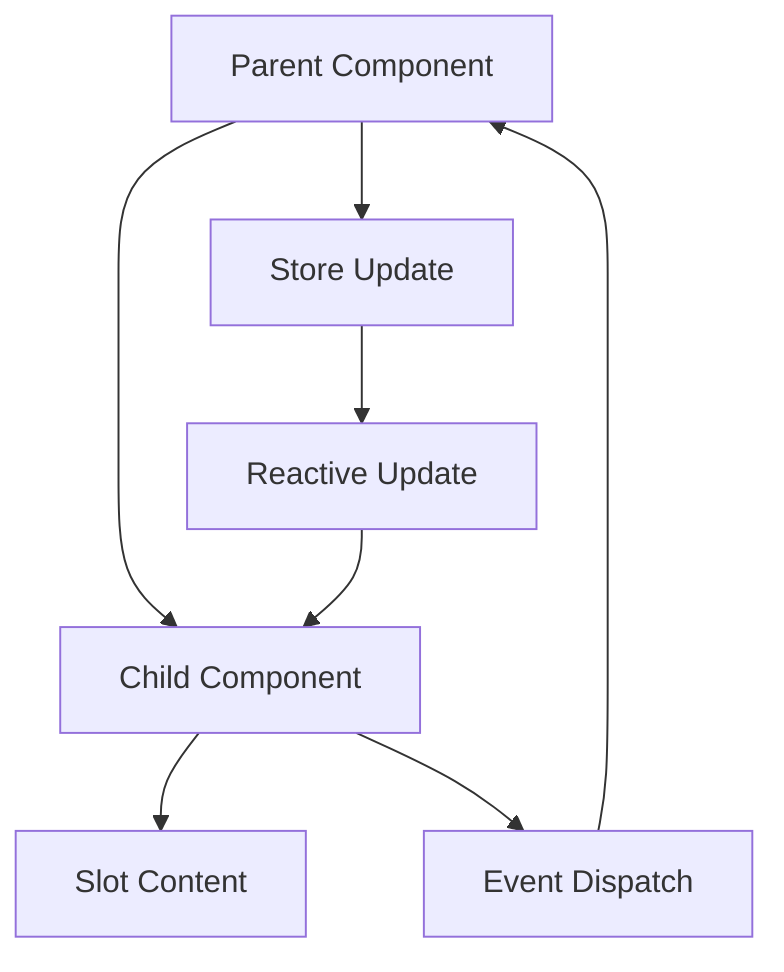
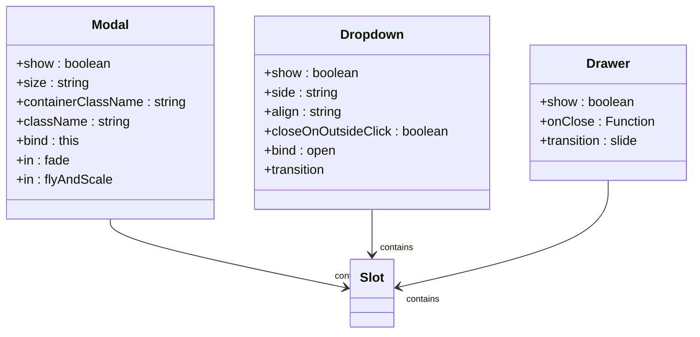

# Frontend Component Architecture

<cite>
**Referenced Files in This Document**   
- [ChatControls.svelte](file://src/lib/components/chat/ChatControls.svelte)
- [ModelSelector.svelte](file://src/lib/components/chat/ModelSelector.svelte)
- [Controls.svelte](file://src/lib/components/chat/Controls/Controls.svelte)
- [CallOverlay.svelte](file://src/lib/components/chat/MessageInput/CallOverlay.svelte)
- [Modal.svelte](file://src/lib/components/common/Modal.svelte)
- [Dropdown.svelte](file://src/lib/components/common/Dropdown.svelte)
- [Drawer.svelte](file://src/lib/components/common/Drawer.svelte)
- [Selector.svelte](file://src/lib/components/chat/ModelSelector/Selector.svelte)
- [AppSidebar.svelte](file://src/lib/components/app/AppSidebar.svelte)
- [Users.svelte](file://src/lib/components/admin/Users.svelte)
- [index.ts](file://src/lib/stores/index.ts)
</cite>

## Table of Contents
1. [Component Categorization by Feature Domain](#component-categorization-by-feature-domain)
2. [Svelte Component Structure](#svelte-component-structure)
3. [Component Composition and Reuse](#component-composition-and-reuse)
4. [Common UI Components](#common-ui-components)
5. [State Management and Reactivity](#state-management-and-reactivity)
6. [Accessibility and Responsiveness](#accessibility-and-responsiveness)
7. [Performance Optimization](#performance-optimization)

## Component Categorization by Feature Domain

The open-webui frontend architecture organizes Svelte components into feature-based domains that align with the application's functional areas. This categorization enhances maintainability and enables focused development. The primary component domains include:

- **admin**: Contains components for administrative functionality such as user management, settings, and system monitoring. For example, the `Users.svelte` component manages user administration with tabbed navigation between overview and groups views.
- **chat**: Houses components related to chat functionality, including message rendering, input controls, and conversation management. Key components include `ChatControls.svelte` and `ModelSelector.svelte`.
- **workspace**: Contains components for workspace management, including models, prompts, knowledge bases, and tools.
- **channel**: Manages channel-specific components for group conversations and collaboration.
- **common**: Provides reusable UI components that maintain consistent design patterns across the application.

This domain-based organization allows developers to locate related functionality easily and ensures that components remain focused on specific responsibilities. Each domain directory contains both high-level container components and lower-level specialized components that work together to deliver cohesive user experiences.

**Section sources**
- [Users.svelte](file://src/lib/components/admin/Users.svelte)
- [AppSidebar.svelte](file://src/lib/components/app/AppSidebar.svelte)

## Svelte Component Structure

Svelte components in open-webui follow the standard Svelte single-file component structure with three distinct sections: script, markup, and styling. This structure promotes encapsulation and maintainability.

### Script Section
The script section (denoted by `<script lang="ts">`) contains the component's logic, including:
- Import statements for dependencies and other components
- Store subscriptions for global state management
- Component properties (exported with `export let`)
- Local state variables
- Lifecycle methods (`onMount`, `onDestroy`)
- Event handlers and utility functions

For example, `ChatControls.svelte` imports stores like `mobile`, `showControls`, and `showCallOverlay` from `$lib/stores` to manage component visibility and behavior based on application state.

### Markup Section
The template section contains the component's HTML structure with Svelte-specific syntax for:
- Reactive statements (`$:`) that automatically update when dependencies change
- Conditional rendering (`{#if}`, `{:else}`, `{/if}`)
- Loops (`{#each}`, `{/each}`)
- Component composition through nested component tags
- Two-way binding (`bind:value`)
- Event handling (`on:click`, `on:change`)

### Styling Section
The style section uses Tailwind CSS classes for styling, enabling responsive design and consistent visual patterns. Components leverage Tailwind's utility-first approach to apply styles directly in the markup, reducing the need for custom CSS.

**Section sources**
- [ChatControls.svelte](file://src/lib/components/chat/ChatControls.svelte)
- [ModelSelector.svelte](file://src/lib/components/chat/ModelSelector.svelte)

## Component Composition and Reuse

The open-webui application demonstrates sophisticated component composition patterns that enable complex interfaces through the combination of smaller, focused components.

### ChatControls Component Composition
The `ChatControls.svelte` component exemplifies advanced composition by orchestrating multiple subcomponents based on application state. It imports and conditionally renders:
- `Controls.svelte` for chat configuration options
- `CallOverlay.svelte` for voice-based interactions
- `Artifacts.svelte` for displaying generated content
- `Embeds.svelte` for embedded content display
- `Drawer.svelte` for mobile-friendly presentation

This component uses Svelte's reactive declarations (`$:`) to respond to store changes and dynamically update the interface. For instance, when the `showControls` store value changes, the component automatically updates its visibility.

### Event Handling and Communication
Components communicate through various patterns:
- **Event dispatching**: Child components dispatch events that parent components handle
- **Store subscriptions**: Components subscribe to shared stores for global state
- **Two-way binding**: The `bind:` directive enables synchronized data flow between parent and child components

In `ModelSelector.svelte`, two-way binding is used with the `bind:value={selectedModel}` directive, allowing the parent component to stay synchronized with the selected model while the child component manages the selection UI.

### Slots for Flexible Composition
Svelte's slot mechanism enables flexible component composition. The `Modal.svelte` component uses the default slot (`<slot />`) to accept arbitrary content, making it reusable for various modal dialogs throughout the application. This pattern allows the same modal container to display different content based on context while maintaining consistent styling and behavior.



**Diagram sources **
- [ChatControls.svelte](file://src/lib/components/chat/ChatControls.svelte)
- [ModelSelector.svelte](file://src/lib/components/chat/ModelSelector.svelte)
- [Modal.svelte](file://src/lib/components/common/Modal.svelte)

**Section sources**
- [ChatControls.svelte](file://src/lib/components/chat/ChatControls.svelte)
- [ModelSelector.svelte](file://src/lib/components/chat/ModelSelector.svelte)
- [Controls.svelte](file://src/lib/components/chat/Controls/Controls.svelte)

## Common UI Components

The `/common` directory contains a library of reusable UI components that ensure design consistency across the application. These components abstract common patterns and provide standardized interfaces.

### Modal Component
The `Modal.svelte` component provides a flexible dialog container with configurable properties:
- `show`: Controls visibility
- `size`: Determines width (xs, sm, md, lg, xl, etc.)
- Accessibility features including focus trapping and keyboard navigation
- Transitions using Svelte's built-in `fade` and custom `flyAndScale` animations

The component handles accessibility by managing focus with the `focus-trap` library and supporting keyboard navigation, including Escape key dismissal.

### Dropdown Component
The `Dropdown.svelte` component implements a menu dropdown pattern with:
- Configurable positioning (side, alignment)
- Optional automatic closing on outside clicks
- Transition animations
- Slot-based content for custom menu items

It uses the `bits-ui` library for the underlying dropdown menu functionality while providing a simplified interface for application use.

### Other Common Components
The common components library includes various UI elements:
- `Button`: Standardized button styles and behaviors
- `Tooltip`: Contextual information display on hover
- `Collapsible`: Expandable/collapsible content sections
- `FileItem`: Consistent file representation
- `Sidebar`: Navigation sidebar with persistent state

These components promote consistency by encapsulating styling and behavior, reducing duplication, and ensuring that similar UI elements behave predictably across different contexts.



**Diagram sources **
- [Modal.svelte](file://src/lib/components/common/Modal.svelte)
- [Dropdown.svelte](file://src/lib/components/common/Dropdown.svelte)
- [Drawer.svelte](file://src/lib/components/common/Drawer.svelte)

**Section sources**
- [Modal.svelte](file://src/lib/components/common/Modal.svelte)
- [Dropdown.svelte](file://src/lib/components/common/Dropdown.svelte)

## State Management and Reactivity

The open-webui application employs a comprehensive state management strategy using Svelte stores to coordinate state across components.

### Global Stores
The `stores/index.ts` file exports writable stores for application-wide state, including:
- `user`: Current user session and permissions
- `settings`: User preferences and UI configuration
- `models`: Available AI models
- `chats`: Chat history and metadata
- `showControls`, `showCallOverlay`, etc.: UI state flags

Components subscribe to these stores using the `$` prefix syntax, which automatically updates the component when store values change.

### Reactive Declarations
Svelte's reactive statements (`$:`) enable automatic computation of derived values. In `ModelSelector.svelte`, a reactive block validates selected models against the available models list:

```typescript
$: if (selectedModels.length > 0 && $models.length > 0) {
    const _selectedModels = selectedModels.map((model) =>
        $models.map((m) => m.id).includes(model) ? model : ''
    );
    
    if (JSON.stringify(_selectedModels) !== JSON.stringify(selectedModels)) {
        selectedModels = _selectedModels;
    }
}
```

This ensures that only valid models remain selected, automatically correcting any inconsistencies when the models list changes.

### Component State
Components maintain local state for UI-specific concerns, such as:
- Form input values
- Loading states
- Temporary selections
- Animation states

The `CallOverlay.svelte` component, for example, manages local state for audio recording, camera status, and speech synthesis, coordinating these with global stores for settings and UI state.

**Section sources**
- [index.ts](file://src/lib/stores/index.ts)
- [ModelSelector.svelte](file://src/lib/components/chat/ModelSelector.svelte)
- [CallOverlay.svelte](file://src/lib/components/chat/MessageInput/CallOverlay.svelte)

## Accessibility and Responsiveness

The open-webui frontend prioritizes accessibility and responsive design to ensure usability across devices and for users with diverse needs.

### Responsive Design with Tailwind CSS
The application leverages Tailwind CSS for responsive layouts, using utility classes that adapt to different screen sizes:
- Conditional rendering based on screen width (e.g., `largeScreen` variable in `ChatControls.svelte`)
- Flexible grid and flexbox layouts
- Mobile-first design principles
- Touch-friendly interactive elements

The `ChatControls.svelte` component demonstrates responsive adaptation by using different presentation patterns for mobile and desktop views. On mobile, it uses a `Drawer` component for sliding panels, while on desktop it employs resizable panes.

### Accessibility Features
Key accessibility considerations include:
- **Keyboard navigation**: Components support tab navigation and keyboard interactions
- **Screen reader support**: Proper ARIA attributes and semantic HTML
- **Focus management**: The `Modal.svelte` component uses focus trapping to keep keyboard navigation within the modal
- **Color contrast**: Configurable high-contrast mode available in settings
- **Reduced motion**: Respecting user preferences for reduced animations

The `Modal.svelte` component exemplifies accessibility best practices with proper ARIA roles (`role="dialog"`), focus management using the `focus-trap` library, and keyboard event handling for Escape key dismissal.

### Internationalization
The application supports internationalization through a context-based i18n system. Components access the i18n context using `getContext('i18n')` and use translation functions like `$i18n.t('text')` to display localized text.

**Section sources**
- [ChatControls.svelte](file://src/lib/components/chat/ChatControls.svelte)
- [Modal.svelte](file://src/lib/components/common/Modal.svelte)
- [index.ts](file://src/lib/stores/index.ts)

## Performance Optimization

The open-webui application implements several performance optimization techniques to ensure responsive user experiences.

### Lazy Loading
Components use dynamic imports with Svelte's code splitting capabilities to load expensive components only when needed. The `ChatControls.svelte` component demonstrates this pattern:

```svelte
{#await import('./Overview.svelte') then { default: Overview }}
    <Overview {history} onNodeClick={handleNodeClick} onClose={closeHandler} />
{/await}
```

This defers loading of the `Overview.svelte` component until it's actually needed, reducing initial bundle size and improving startup performance.

### Efficient Rendering
The application employs several rendering optimizations:
- **Selective reactivity**: Only subscribing to necessary store values
- **Memoization**: Caching computed values to avoid redundant calculations
- **Event delegation**: Minimizing event listeners
- **Virtual scrolling**: For large lists (implied by pagination patterns)

### Resource Management
Components properly manage resources through lifecycle hooks:
- `onMount` for initialization and event listener setup
- `onDestroy` for cleanup and memory leak prevention
- Proper cleanup of subscriptions, timers, and DOM references

The `CallOverlay.svelte` component exemplifies thorough resource management by cleaning up audio streams, event listeners, and Web Locks in its `onDestroy` handler and cleanup function.

### Code Splitting
The Svelte compiler automatically performs code splitting based on component boundaries, ensuring that only the necessary code is loaded for each route or feature. This is particularly important for a complex application like open-webui with multiple feature domains.

**Section sources**
- [ChatControls.svelte](file://src/lib/components/chat/ChatControls.svelte)
- [CallOverlay.svelte](file://src/lib/components/chat/MessageInput/CallOverlay.svelte)