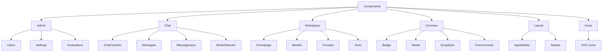
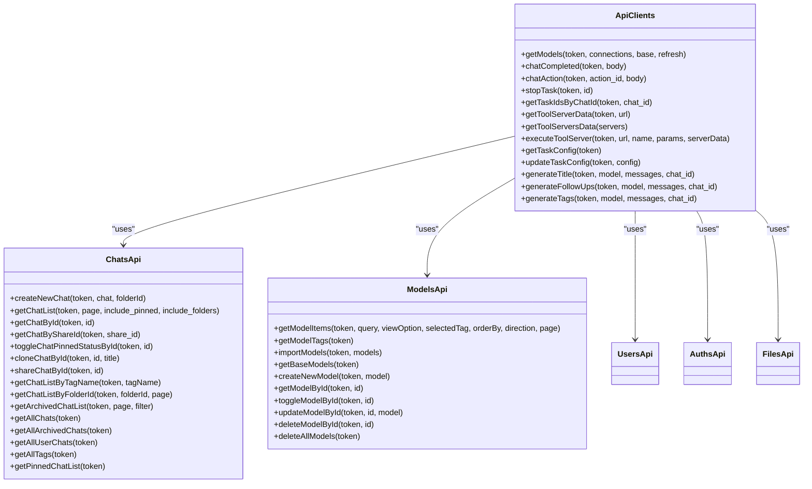
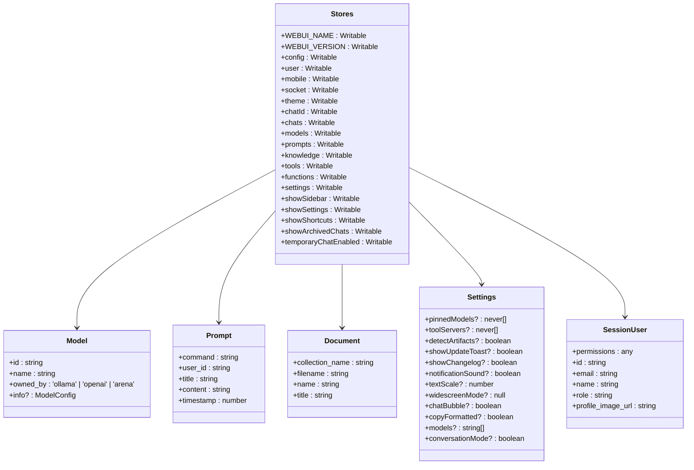
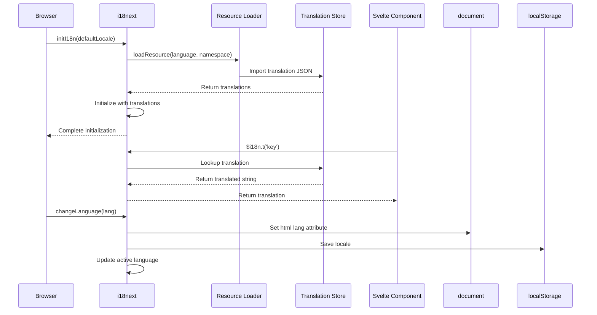

# Frontend Directory Structure

<cite>
**Referenced Files in This Document**   
- [src/lib/components/admin/Users.svelte](file://src/lib/components/admin/Users.svelte)
- [src/lib/components/chat/ChatControls.svelte](file://src/lib/components/chat/ChatControls.svelte)
- [src/lib/components/common/Badge.svelte](file://src/lib/components/common/Badge.svelte)
- [src/lib/components/workspace/Knowledge.svelte](file://src/lib/components/workspace/Knowledge.svelte)
- [src/lib/apis/index.ts](file://src/lib/apis/index.ts)
- [src/lib/apis/chats/index.ts](file://src/lib/apis/chats/index.ts)
- [src/lib/apis/models/index.ts](file://src/lib/apis/models/index.ts)
- [src/lib/stores/index.ts](file://src/lib/stores/index.ts)
- [src/lib/types/index.ts](file://src/lib/types/index.ts)
- [src/lib/utils/index.ts](file://src/lib/utils/index.ts)
- [src/lib/i18n/index.ts](file://src/lib/i18n/index.ts)
- [src/routes/+layout.svelte](file://src/routes/+layout.svelte)
</cite>

## Table of Contents
1. [Component Organization](#component-organization)
2. [API Client Structure](#api-client-structure)
3. [Routing System](#routing-system)
4. [State Management](#state-management)
5. [Utility Functions and Type Definitions](#utility-functions-and-type-definitions)
6. [Internationalization](#internationalization)
7. [Practical Implementation Examples](#practical-implementation-examples)

## Component Organization

The Svelte-based frontend of open-webui follows a well-structured component organization within the `src/lib/components/` directory, categorized by functional domains. The components are organized into distinct categories including admin, chat, workspace, and common components, enabling clear separation of concerns and promoting reusability across the application.

The component structure follows Svelte's best practices with each component encapsulating its markup, styles, and logic within a single `.svelte` file. Components are designed to be reusable and composable, with clear props interfaces and event handling mechanisms. The directory structure reflects the application's feature domains, making it easy to locate and understand components related to specific functionality.

Common UI components are stored in the `common/` subdirectory and include elements such as Badge, Button, Modal, Dropdown, and various form controls. These components are designed to be highly reusable across different parts of the application and follow consistent styling patterns using Tailwind CSS. For example, the Badge component supports different types (info, success, warning, error, muted) with corresponding color schemes that adapt to the application's dark/light mode.



**Diagram sources**
- [src/lib/components/admin/Users.svelte](file://src/lib/components/admin/Users.svelte#L1-L122)
- [src/lib/components/chat/ChatControls.svelte](file://src/lib/components/chat/ChatControls.svelte#L1-L311)
- [src/lib/components/common/Badge.svelte](file://src/lib/components/common/Badge.svelte#L1-L20)
- [src/lib/components/workspace/Knowledge.svelte](file://src/lib/components/workspace/Knowledge.svelte#L1-L292)

**Section sources**
- [src/lib/components/admin/Users.svelte](file://src/lib/components/admin/Users.svelte#L1-L122)
- [src/lib/components/chat/ChatControls.svelte](file://src/lib/components/chat/ChatControls.svelte#L1-L311)
- [src/lib/components/common/Badge.svelte](file://src/lib/components/common/Badge.svelte#L1-L20)
- [src/lib/components/workspace/Knowledge.svelte](file://src/lib/components/workspace/Knowledge.svelte#L1-L292)

## API Client Structure

The API client structure in `src/lib/apis/` is organized by feature domain, with each backend service having its dedicated module. This organization follows a clean separation of concerns, making it easy to locate and understand the API interactions for specific functionality. Each API module exports typed functions that handle HTTP requests to the corresponding backend endpoints, providing a clean abstraction layer between the frontend components and the backend services.

The API clients are designed with type safety in mind, leveraging TypeScript interfaces to ensure proper data typing throughout the application. Each API function handles request construction, error handling, and response parsing, providing a consistent interface for components to interact with the backend. The API clients use the `WEBUI_API_BASE_URL` constant for endpoint resolution, allowing for easy configuration of the backend URL.

The main API module (`src/lib/apis/index.ts`) serves as an entry point that exports commonly used functions and provides higher-level abstractions that may combine multiple API calls. Feature-specific API modules (such as chats, models, users, etc.) contain functions specific to their domain, with consistent naming patterns and parameter structures. This organization enables code reuse and makes it easy to understand the available API operations for each feature.



**Diagram sources**
- [src/lib/apis/index.ts](file://src/lib/apis/index.ts#L1-L1706)
- [src/lib/apis/chats/index.ts](file://src/lib/apis/chats/index.ts#L1-L1169)
- [src/lib/apis/models/index.ts](file://src/lib/apis/models/index.ts#L1-L348)

**Section sources**
- [src/lib/apis/index.ts](file://src/lib/apis/index.ts#L1-L1706)
- [src/lib/apis/chats/index.ts](file://src/lib/apis/chats/index.ts#L1-L1169)
- [src/lib/apis/models/index.ts](file://src/lib/apis/models/index.ts#L1-L348)

## Routing System

The routing system in open-webui leverages SvelteKit's file-based routing convention, with routes defined by the directory structure in the `src/routes/` directory. This approach provides a clear and intuitive mapping between URLs and components, making it easy to understand the application's navigation structure. The routing system supports nested layouts, dynamic segments, and special route groups, enabling complex navigation patterns while maintaining a clean organization.

The application uses route groups (denoted by parentheses) to organize related routes, such as the `(app)` group that contains the main application routes. Dynamic segments (denoted by square brackets) are used for routes that require parameters, such as `/c/[id]` for chat pages and `/workspace/knowledge/[id]` for knowledge base details. Layout components (named `+layout.svelte`) define shared UI elements and logic for groups of routes, enabling consistent navigation and styling across related pages.

The routing system also includes special files like `+page.svelte` for page content, `+layout.svelte` for layout components, and `+error.svelte` for error handling. These files work together to create a robust navigation experience with proper error boundaries and loading states. The use of SvelteKit's routing primitives like `goto` and `$page` store enables programmatic navigation and reactive URL handling within components.

```mermaid
graph TD
A[/] --> B[/auth]
A --> C[/error]
A --> D[(app)]
D --> E[/home]
D --> F[/c/[id]]
D --> G[/channels/[id]]
D --> H[/notes]
D --> I[/playground]
D --> J[/workspace]
D --> K[/billing]
D --> L[/admin]
J --> J1[/workspace/knowledge]
J --> J2[/workspace/models]
J --> J3[/workspace/prompts]
J --> J4[/workspace/tools]
L --> L1[/admin/users]
L --> L2[/admin/functions]
L --> L3[/admin/evaluations]
L --> L4[/admin/settings]
H --> H1[/notes/new]
H --> H2[/notes/[id]]
style A fill:#f9f,stroke:#333,stroke-width:2px
style B fill:#f9f,stroke:#333,stroke-width:2px
style C fill:#f9f,stroke:#333,stroke-width:2px
style D fill:#f9f,stroke:#333,stroke-width:2px
```

**Diagram sources**
- [src/routes/+layout.svelte](file://src/routes/+layout.svelte#L1-L857)

**Section sources**
- [src/routes/+layout.svelte](file://src/routes/+layout.svelte#L1-L857)

## State Management

State management in open-webui is implemented using Svelte's built-in stores, with a centralized approach that combines writable stores for reactive state with derived stores for computed values. The application uses a global stores module (`src/lib/stores/index.ts`) that exports various stores for managing different aspects of the application state, including user session, configuration, UI state, and domain-specific data.

The stores follow a clear naming convention and are organized by functionality, with stores for backend configuration, user information, UI state (such as mobile/desktop mode, sidebar visibility, and theme), and domain-specific data (such as chats, models, prompts, and tools). The stores use TypeScript interfaces to ensure type safety and provide clear documentation of the expected data structure. This centralized approach enables consistent state management across the application and makes it easy to understand the available state properties.

The state management system also includes derived stores that automatically update based on changes to other stores, reducing the need for manual state synchronization. For example, the filtered list of knowledge bases is derived from the full list based on the current search query and view option. This reactive approach ensures that components always have access to up-to-date data without requiring explicit refresh operations.



**Diagram sources**
- [src/lib/stores/index.ts](file://src/lib/stores/index.ts#L1-L302)

**Section sources**
- [src/lib/stores/index.ts](file://src/lib/stores/index.ts#L1-L302)

## Utility Functions and Type Definitions

The utility functions and type definitions in open-webui are organized in the `src/lib/utils/` and `src/lib/types/` directories, providing a comprehensive set of tools and type safety for the application. The utility functions cover a wide range of functionality including string manipulation, date formatting, file handling, and UI-specific operations, while the type definitions ensure consistent data structures across the application.

The utility functions are designed to be pure and side-effect free where possible, making them easy to test and reason about. They follow a modular approach with related functions grouped together in specific modules, such as `marked/` for Markdown processing extensions and `transitions/` for animation utilities. The functions are extensively used throughout the application to handle common operations like token replacement, response content processing, and clipboard operations.

The type definitions provide a strong foundation for type safety across the application, with interfaces for common data structures like Banner, SessionUser, and Config. These types are used consistently across the API clients, stores, and components, ensuring that data flows through the application with proper type checking. The use of TypeScript enums for constants like TTS_RESPONSE_SPLIT further enhances type safety and code clarity.

```mermaid
graph TD
A[Utilities] --> B[String]
A --> C[Date]
A --> D[File]
A --> E[UI]
A --> F[API]
B --> B1[replaceTokens]
B --> B2[sanitizeResponseContent]
B --> B3[processResponseContent]
B --> B4[capitalizeFirstLetter]
B --> B5[transformFileName]
C --> C1[formatDate]
C --> C2[getTimeRange]
D --> D1[compressImage]
D --> D2[generateInitialsImage]
D --> D3[calculateSHA256]
E --> E1[copyToClipboard]
E --> E2[generateInitialsImage]
E --> E3[canvasPixelTest]
E --> E4[setTextScale]
F --> F1[convertMessagesToHistory]
F --> F2[getGravatarURL]
F --> F3[isValidHttpUrl]
F --> F4[isYoutubeUrl]
G[Types] --> H[Banner]
G --> I[TTS_RESPONSE_SPLIT]
G --> J[SessionUser]
G --> K[Config]
H --> H1[id: string]
H --> H2[type: string]
H --> H3[title?: string]
H --> H4[content: string]
H --> H5[url?: string]
H --> H6[dismissible?: boolean]
H --> H7[timestamp: number]
I --> I1[PUNCTUATION]
I --> I2[PARAGRAPHS]
I --> I3[NONE]
```



**Diagram sources**
- [src/lib/utils/index.ts](file://src/lib/utils/index.ts#L1-L1664)
- [src/lib/types/index.ts](file://src/lib/types/index.ts#L1-L16)

**Section sources**
- [src/lib/utils/index.ts](file://src/lib/utils/index.ts#L1-L1664)
- [src/lib/types/index.ts](file://src/lib/types/index.ts#L1-L16)

## Internationalization

Internationalization in open-webui is implemented using i18next, with a dedicated module in `src/lib/i18n/` that provides a Svelte-friendly interface for managing translations. The system supports multiple languages with translation files organized by locale in the `src/lib/i18n/locales/` directory, enabling easy addition of new languages and translation management.

The internationalization system uses a context-based approach, with the i18n instance provided to components through Svelte's context API. This allows components to access the translation functions without requiring explicit prop passing, making it easy to use translations throughout the application. The system supports dynamic language switching, with the current language persisted in localStorage and automatically detected from the browser's language preferences.

The implementation includes utilities for loading translation resources on demand, detecting the user's preferred language, and handling fallback languages. The translation keys follow a consistent naming convention, making it easy to understand the purpose of each translation. The system also supports interpolation of dynamic values in translations, enabling localized messages with variable content.



**Diagram sources**
- [src/lib/i18n/index.ts](file://src/lib/i18n/index.ts#L1-L88)

**Section sources**
- [src/lib/i18n/index.ts](file://src/lib/i18n/index.ts#L1-L88)

## Practical Implementation Examples

The open-webui frontend demonstrates several practical implementation patterns that showcase best practices for Svelte development. These examples illustrate how new pages are created, how API clients are used in components, and how state is managed across the application, providing concrete guidance for developers working on the codebase.

When creating a new page, developers follow the SvelteKit file-based routing convention by adding a new directory in `src/routes/` with a `+page.svelte` file. The page component imports necessary stores and API clients, subscribes to relevant state, and uses Svelte's reactive declarations to update the UI in response to data changes. Layout components are used to provide consistent navigation and styling, while page-specific logic is encapsulated within the page component.

API clients are used in components by importing the relevant functions and calling them with the required parameters, typically within lifecycle functions like `onMount` or event handlers. The API calls are wrapped in error handling and loading state management to provide a smooth user experience. The response data is then stored in the appropriate stores, making it available to other components and ensuring consistent state management.

State management across the application is achieved through the centralized stores system, with components subscribing to the stores they need and updating them through well-defined actions. This approach ensures that state changes are predictable and traceable, making it easier to debug issues and understand data flow. The use of TypeScript interfaces for store data provides type safety and improves developer experience through better tooling support.

```mermaid
flowchart TD
A[Create New Page] --> B[Add route directory in src/routes/]
B --> C[Create +page.svelte file]
C --> D[Import required stores and APIs]
D --> E[Subscribe to stores in onMount]
E --> F[Call API to load initial data]
F --> G[Update stores with response data]
G --> H[Render UI with reactive bindings]
I[Use API Client] --> J[Import API function]
J --> K[Call function with parameters]
K --> L[Handle loading state]
L --> M[Handle success response]
M --> N[Update stores with data]
N --> O[Handle error response]
O --> P[Show user feedback]
Q[Manage State] --> R[Import store from $lib/stores]
R --> S[Subscribe to store value]
S --> T[Use value in template]
T --> U[Update store with set() or update()]
U --> V[Changes propagate to all subscribers]
V --> W[UI updates automatically]
```

**Diagram sources**
- [src/lib/components/workspace/Knowledge.svelte](file://src/lib/components/workspace/Knowledge.svelte#L1-L292)
- [src/lib/apis/chats/index.ts](file://src/lib/apis/chats/index.ts#L1-L1169)
- [src/lib/stores/index.ts](file://src/lib/stores/index.ts#L1-L302)

**Section sources**
- [src/lib/components/workspace/Knowledge.svelte](file://src/lib/components/workspace/Knowledge.svelte#L1-L292)
- [src/lib/apis/chats/index.ts](file://src/lib/apis/chats/index.ts#L1-L1169)
- [src/lib/stores/index.ts](file://src/lib/stores/index.ts#L1-L302)