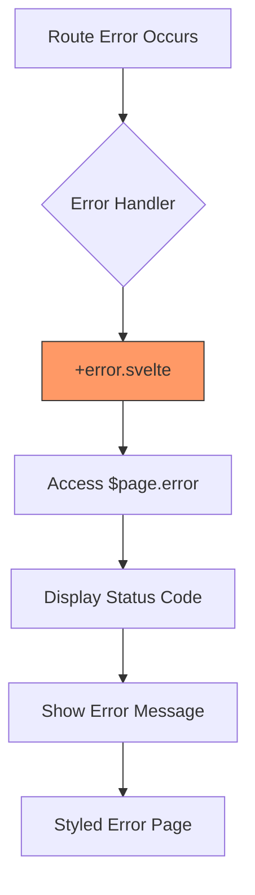
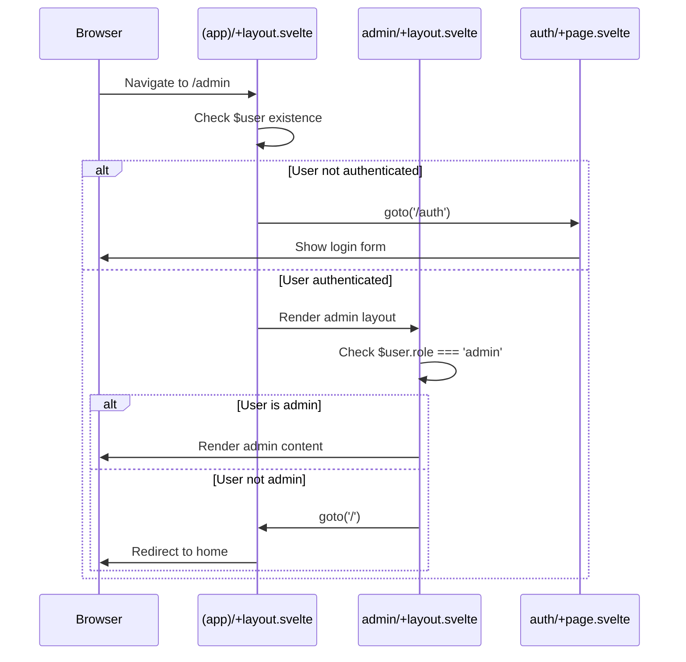

# Routing and Navigation

<cite>
**Referenced Files in This Document**   
- [src/routes/+layout.svelte](file://src/routes/+layout.svelte)
- [src/routes/+layout.js](file://src/routes/+layout.js)
- [src/routes/+error.svelte](file://src/routes/+error.svelte)
- [src/routes/(app)/+layout.svelte](file://src/routes/(app)/+layout.svelte)
- [src/routes/(app)/admin/+layout.svelte](file://src/routes/(app)/admin/+layout.svelte)
- [src/routes/(app)/workspace/+layout.svelte](file://src/routes/(app)/workspace/+layout.svelte)
- [src/routes/(app)/billing/+layout.svelte](file://src/routes/(app)/billing/+layout.svelte)
- [src/routes/(app)/c/[id]/+page.svelte](file://src/routes/(app)/c/[id]/+page.svelte)
- [src/routes/(app)/channels/[id]/+page.svelte](file://src/routes/(app)/channels/[id]/+page.svelte)
- [src/routes/(app)/notes/[id]/+page.svelte](file://src/routes/(app)/notes/[id]/+page.svelte)
- [src/routes/auth/+page.svelte](file://src/routes/auth/+page.svelte)
- [src/routes/s/[id]/+page.svelte](file://src/routes/s/[id]/+page.svelte)
</cite>

## Table of Contents
1. [Introduction](#introduction)
2. [File-Based Routing Structure](#file-based-routing-structure)
3. [Layout System and Nested Layouts](#layout-system-and-nested-layouts)
4. [Dynamic Routes and Route Parameters](#dynamic-routes-and-route-parameters)
5. [Navigation Between Application Sections](#navigation-between-application-sections)
6. [Data Fetching with Load Functions](#data-fetching-with-load-functions)
7. [Error Handling with +error.svelte](#error-handling-with-errordot-svelte)
8. [Route Groups and Access Control](#route-groups-and-access-control)
9. [Authentication Guards and Route Protection](#authentication-guards-and-route-protection)
10. [Route Organization and Code Splitting](#route-organization-and-code-splitting)
11. [Performance Optimization and Prefetching](#performance-optimization-and-prefetching)

## Introduction
The open-webui application implements a comprehensive routing system using SvelteKit's file-based routing approach. This system enables efficient navigation between different sections of the application including workspace, admin, and billing interfaces while maintaining proper authentication and access control. The routing architecture leverages SvelteKit's conventions for layout components, dynamic routes, and data loading to create a seamless user experience across various application contexts.

**Section sources**
- [src/routes/+layout.svelte](file://src/routes/+layout.svelte)
- [src/routes/+layout.js](file://src/routes/+layout.js)

## File-Based Routing Structure
The open-webui application follows SvelteKit's file-based routing convention where the directory structure under `src/routes` directly maps to the application's URL structure. The routing system is organized with route groups using parentheses, such as the `(app)` directory which groups all authenticated application routes. This structure separates public routes like authentication from protected application routes.

The root-level `+layout.svelte` serves as the top-level layout component that wraps all routes in the application, while `+layout.js` configures SvelteKit options such as disabling server-side rendering (`ssr: false`) and setting trailing slash behavior. This configuration ensures the application functions as a client-side rendered single-page application with clean URL handling.

```mermaid
graph TB
A[src/routes] --> B[(app)/]
A --> C[auth/]
A --> D[error/]
A --> E[s/[id]/]
A --> F[watch/]
A --> G[+layout.svelte]
A --> H[+layout.js]
A --> I[+error.svelte]
B --> J[admin/]
B --> K[billing/]
B --> L[c/[id]/]
B --> M[channels/[id]/]
B --> N[home/]
B --> O[notes/]
B --> P[playground/]
B --> Q[workspace/]
style A fill:#f9f,stroke:#333
style B fill:#bbf,stroke:#333
style C fill:#bbf,stroke:#333
style D fill:#bbf,stroke:#333
style E fill:#bbf,stroke:#333
style F fill:#bbf,stroke:#333
```

**Diagram sources**
- [src/routes/+layout.svelte](file://src/routes/+layout.svelte)
- [src/routes/+layout.js](file://src/routes/+layout.js)

**Section sources**
- [src/routes/+layout.svelte](file://src/routes/+layout.svelte)
- [src/routes/+layout.js](file://src/routes/+layout.js)

## Layout System and Nested Layouts
The application implements a hierarchical layout system using SvelteKit's `+layout.svelte` files at multiple levels of the route structure. The top-level `+layout.svelte` in the routes directory provides the global application shell with shared functionality like socket connections, internationalization setup, and theme management.

Within the `(app)` route group, each major section has its own layout component that extends the base layout. The `(app)/+layout.svelte` file serves as an intermediate layout that handles authentication checks and loads user-specific data before rendering child routes. This layout manages global application state, keyboard shortcuts, and initializes services required across the authenticated application.

Section-specific layouts like `admin/+layout.svelte`, `workspace/+layout.svelte`, and `billing/+layout.svelte` provide specialized navigation interfaces and access control for their respective sections. These nested layouts create a consistent user experience within each application area while allowing for section-specific customization and functionality.

```mermaid
graph TD
A[+layout.svelte] --> B[(app)/+layout.svelte]
B --> C[admin/+layout.svelte]
B --> D[workspace/+layout.svelte]
B --> E[billing/+layout.svelte]
B --> F[c/[id]/+page.svelte]
B --> G[channels/[id]/+page.svelte]
C --> H[admin/users/+page.svelte]
C --> I[admin/functions/+page.svelte]
C --> J[admin/settings/+page.svelte]
D --> K[workspace/models/+page.svelte]
D --> L[workspace/knowledge/+page.svelte]
D --> M[workspace/tools/+page.svelte]
style A fill:#f9f,stroke:#333
style B fill:#f9f,stroke:#333
style C fill:#bbf,stroke:#333
style D fill:#bbf,stroke:#333
style E fill:#bbf,stroke:#333
```

**Diagram sources**
- [src/routes/+layout.svelte](file://src/routes/+layout.svelte)
- [src/routes/(app)/+layout.svelte](file://src/routes/(app)/+layout.svelte)
- [src/routes/(app)/admin/+layout.svelte](file://src/routes/(app)/admin/+layout.svelte)
- [src/routes/(app)/workspace/+layout.svelte](file://src/routes/(app)/workspace/+layout.svelte)
- [src/routes/(app)/billing/+layout.svelte](file://src/routes/(app)/billing/+layout.svelte)

**Section sources**
- [src/routes/+layout.svelte](file://src/routes/+layout.svelte)
- [src/routes/(app)/+layout.svelte](file://src/routes/(app)/+layout.svelte)

## Dynamic Routes and Route Parameters
The application extensively uses SvelteKit's dynamic route parameters to handle variable content such as chat sessions, knowledge bases, and user profiles. Dynamic segments are denoted by square brackets in directory names, such as `c/[id]/` for chat sessions, `channels/[id]/` for channel conversations, and `notes/[id]/` for note editing.

These dynamic routes enable the application to render content based on URL parameters without requiring separate route definitions for each possible value. For example, the `c/[id]/+page.svelte` component receives the chat ID from the URL through the `$page.params.id` store and uses it to load the specific chat session. Similarly, the `s/[id]/+page.svelte` route handles shared chat links, allowing users to view and clone chats through a public URL.

The implementation leverages SvelteKit's reactivity system to automatically respond to parameter changes, ensuring that the correct content is displayed when users navigate between different instances of the same route type.

```mermaid
flowchart TD
A[URL: /c/123] --> B{Route: c/[id]/}
B --> C[Extract id=123]
C --> D[Load Chat Data]
D --> E[Render Chat Component]
F[URL: /channels/456] --> G{Route: channels/[id]/}
G --> H[Extract id=456]
H --> I[Load Channel Data]
I --> J[Render Channel Component]
K[URL: /notes/789] --> L{Route: notes/[id]/}
L --> M[Extract id=789]
M --> N[Load Note Data]
N --> O[Render Note Editor]
P[URL: /s/abc123] --> Q{Route: s/[id]/}
Q --> R[Extract id=abc123]
R --> S[Load Shared Chat]
S --> T[Render Shared Chat View]
```

**Diagram sources**
- [src/routes/(app)/c/[id]/+page.svelte](file://src/routes/(app)/c/[id]/+page.svelte)
- [src/routes/(app)/channels/[id]/+page.svelte](file://src/routes/(app)/channels/[id]/+page.svelte)
- [src/routes/(app)/notes/[id]/+page.svelte](file://src/routes/(app)/notes/[id]/+page.svelte)
- [src/routes/s/[id]/+page.svelte](file://src/routes/s/[id]/+page.svelte)

**Section sources**
- [src/routes/(app)/c/[id]/+page.svelte](file://src/routes/(app)/c/[id]/+page.svelte)
- [src/routes/(app)/channels/[id]/+page.svelte](file://src/routes/(app)/channels/[id]/+page.svelte)
- [src/routes/(app)/notes/[id]/+page.svelte](file://src/routes/(app)/notes/[id]/+page.svelte)

## Navigation Between Application Sections
Navigation between workspace, admin, and billing sections is implemented through a combination of SvelteKit's `goto` function and standard anchor links within layout components. The `(app)/+layout.svelte` serves as the central navigation hub that provides access to all major application sections while ensuring the user is authenticated.

Each section-specific layout component includes navigation controls tailored to its context. The `admin/+layout.svelte` provides a navigation bar with links to user management, function configuration, billing plans, and system settings. The `workspace/+layout.svelte` offers navigation between models, knowledge bases, prompts, and tools, with access controlled by user permissions.

The application uses Svelte's reactivity to highlight the currently active section based on the URL path, providing visual feedback to users about their current location within the application. This navigation system ensures users can seamlessly move between different functional areas while maintaining context and application state.

```mermaid
graph LR
A[Authenticated User] --> B[(app)/+layout.svelte]
B --> C[Workspace Section]
B --> D[Admin Section]
B --> E[Billing Section]
C --> F[Models]
C --> G[Knowledge]
C --> H[Prompts]
C --> I[Tools]
D --> J[Users]
D --> K[Functions]
D --> L[Evaluations]
D --> M[Billing Plans]
D --> N[Settings]
E --> O[Dashboard]
E --> P[Plans]
style B fill:#f9f,stroke:#333
style C fill:#bbf,stroke:#333
style D fill:#bbf,stroke:#333
style E fill:#bbf,stroke:#333
```

**Diagram sources**
- [src/routes/(app)/+layout.svelte](file://src/routes/(app)/+layout.svelte)
- [src/routes/(app)/admin/+layout.svelte](file://src/routes/(app)/admin/+layout.svelte)
- [src/routes/(app)/workspace/+layout.svelte](file://src/routes/(app)/workspace/+layout.svelte)
- [src/routes/(app)/billing/+layout.svelte](file://src/routes/(app)/billing/+layout.svelte)

**Section sources**
- [src/routes/(app)/admin/+layout.svelte](file://src/routes/(app)/admin/+layout.svelte)
- [src/routes/(app)/workspace/+layout.svelte](file://src/routes/(app)/workspace/+layout.svelte)
- [src/routes/(app)/billing/+layout.svelte](file://src/routes/(app)/billing/+layout.svelte)

## Data Fetching with Load Functions
The application leverages SvelteKit's reactivity system and component lifecycle methods for data fetching rather than traditional load functions. Since the application is configured with `ssr: false` in `+layout.js`, data loading occurs on the client side after the initial page render.

The `(app)/+layout.svelte` component uses the `onMount` lifecycle function to fetch essential user data, including user settings, models, tool servers, and banners. This data is loaded in parallel using `Promise.all` to minimize loading time and improve performance. The component also sets up keyboard shortcuts and checks for version updates during initialization.

For dynamic routes, data fetching is implemented within the page components themselves. For example, the `s/[id]/+page.svelte` component uses a reactive statement (`$:`) to automatically load shared chat data when the URL parameter changes. This approach ensures that the correct data is always displayed based on the current route parameters.

**Section sources**
- [src/routes/(app)/+layout.svelte](file://src/routes/(app)/+layout.svelte)
- [src/routes/s/[id]/+page.svelte](file://src/routes/s/[id]/+page.svelte)

## Error Handling with +error.svelte
The application implements centralized error handling through the `+error.svelte` component at the root level of the routes directory. This component serves as the default error page that displays when any route encounters an error during rendering or data loading.

The `+error.svelte` component accesses SvelteKit's `page` store to retrieve error information, including the HTTP status code and error message. It displays this information in a user-friendly format with appropriate styling for both light and dark themes. The error page provides basic information about what went wrong without exposing sensitive system details.

This global error handler ensures a consistent user experience when errors occur, preventing the application from crashing or displaying unstyled error messages. It works in conjunction with the application's authentication system to redirect users to appropriate pages when authentication-related errors occur.



**Diagram sources**
- [src/routes/+error.svelte](file://src/routes/+error.svelte)

**Section sources**
- [src/routes/+error.svelte](file://src/routes/+error.svelte)

## Route Groups and Access Control
The application uses route groups and layout components to implement access control for different user roles and permissions. The `(app)` route group encapsulates all authenticated routes, separating them from public routes like authentication and error pages.

Within the application, access control is implemented at the layout level. The `admin/+layout.svelte` component checks if the user has admin privileges and redirects non-admin users to the home page. Similarly, the `workspace/+layout.svelte` component checks specific workspace permissions for models, knowledge, prompts, and tools, redirecting users who lack the necessary permissions.

This approach ensures that users can only access sections of the application for which they have appropriate permissions. The access control is implemented in the `onMount` lifecycle of each layout component, providing an early check that prevents unauthorized access before any sensitive data is loaded.

```mermaid
flowchart TD
A[User Requests Route] --> B{Route Group}
B --> C[(app)/]
C --> D[Check Authentication]
D --> E{User Authenticated?}
E --> |Yes| F[Continue]
E --> |No| G[Redirect to /auth]
F --> H[Section Layout]
H --> I{Admin Layout?}
I --> |Yes| J[Check Admin Role]
J --> K{Is Admin?}
K --> |Yes| L[Render Admin]
K --> |No| M[Redirect to Home]
H --> N{Workspace Layout?}
N --> |Yes| O[Check Permissions]
O --> P{Has Permission?}
P --> |Yes| Q[Render Workspace]
P --> |No| R[Redirect to Home]
```

**Diagram sources**
- [src/routes/(app)/+layout.svelte](file://src/routes/(app)/+layout.svelte)
- [src/routes/(app)/admin/+layout.svelte](file://src/routes/(app)/admin/+layout.svelte)
- [src/routes/(app)/workspace/+layout.svelte](file://src/routes/(app)/workspace/+layout.svelte)

**Section sources**
- [src/routes/(app)/admin/+layout.svelte](file://src/routes/(app)/admin/+layout.svelte)
- [src/routes/(app)/workspace/+layout.svelte](file://src/routes/(app)/workspace/+layout.svelte)

## Authentication Guards and Route Protection
The application implements a multi-layered authentication guard system to protect private routes and ensure only authorized users can access protected content. The primary authentication guard is implemented in the `(app)/+layout.svelte` component, which checks for user authentication and redirects unauthenticated users to the login page.

Additional authentication and authorization checks are implemented in section-specific layouts. The `admin/+layout.svelte` component verifies that users have admin privileges before allowing access to administrative functions. The `billing/+layout.svelte` component ensures that users are authenticated before accessing billing information.

For public routes that should only be accessible to unauthenticated users, such as the authentication page, the application uses the inverse logic to redirect authenticated users to the main application. This comprehensive guard system prevents unauthorized access while providing appropriate redirection to maintain a smooth user experience.



**Diagram sources**
- [src/routes/(app)/+layout.svelte](file://src/routes/(app)/+layout.svelte)
- [src/routes/(app)/admin/+layout.svelte](file://src/routes/(app)/admin/+layout.svelte)
- [src/routes/auth/+page.svelte](file://src/routes/auth/+page.svelte)

**Section sources**
- [src/routes/(app)/+layout.svelte](file://src/routes/(app)/+layout.svelte)
- [src/routes/auth/+page.svelte](file://src/routes/auth/+page.svelte)

## Route Organization and Code Splitting
The application follows a well-organized route structure that groups related functionality together and leverages SvelteKit's automatic code splitting. The route organization separates concerns by feature, with distinct directories for admin, billing, workspace, and other functional areas.

Code splitting is handled automatically by SvelteKit, which generates separate JavaScript bundles for different route groups. This optimization ensures that users only download the code necessary for the current page, improving initial load times and overall performance. The use of route groups like `(app)` allows for shared code between related routes while still enabling granular code splitting.

The directory structure follows a logical hierarchy that mirrors the application's information architecture, making it easy to locate and understand the routing configuration. Dynamic routes are clearly identified by their bracket notation, and layout components are consistently named across the application.

**Section sources**
- [src/routes/+layout.js](file://src/routes/+layout.js)
- Project structure analysis

## Performance Optimization and Prefetching
The application implements several performance optimizations to ensure fast navigation and responsive user interfaces. While explicit prefetching is not implemented through SvelteKit's `prefetch` functions, the application leverages other optimization techniques.

The use of layout components reduces redundant data fetching and component initialization across related routes. Data loaded in parent layouts, such as user settings and models, is available to all child routes without requiring additional API calls. This approach minimizes network requests and improves perceived performance.

The application also implements lazy loading of components through Svelte's dynamic imports and SvelteKit's built-in code splitting. This ensures that JavaScript bundles are kept small and only the necessary code is downloaded for each route. The authentication system includes token expiry checks and automatic session management to prevent unnecessary re-authentication.

**Section sources**
- [src/routes/(app)/+layout.svelte](file://src/routes/(app)/+layout.svelte)
- [src/routes/+layout.js](file://src/routes/+layout.js)