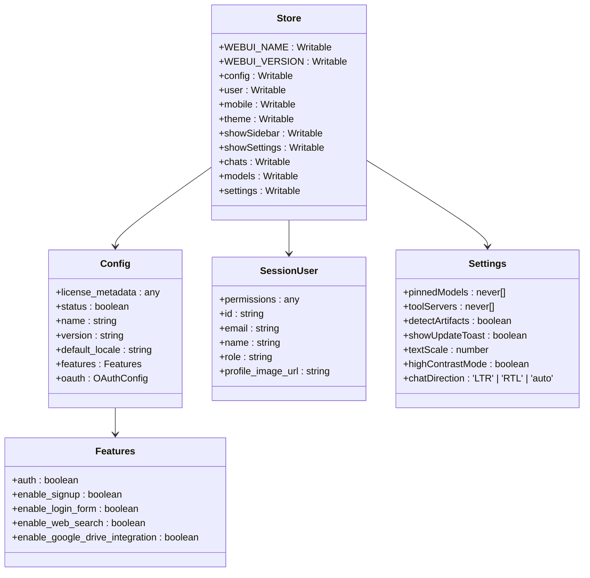
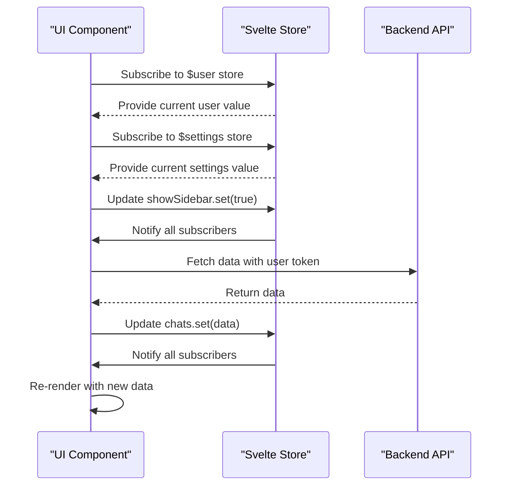
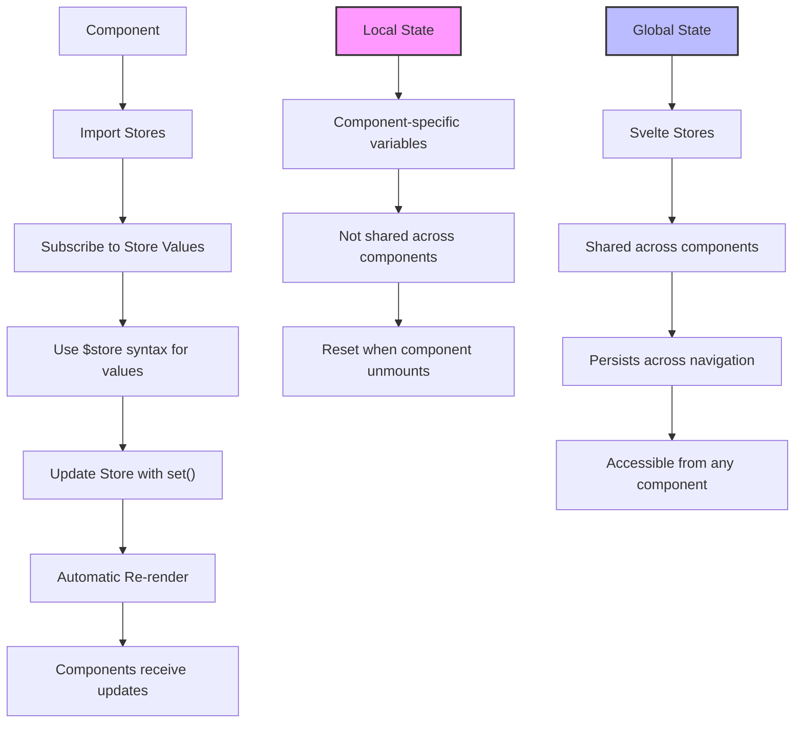

# State Management System

<cite>
**Referenced Files in This Document**   
- [index.ts](file://src/lib/stores/index.ts)
- [Sidebar.svelte](file://src/lib/components/layout/Sidebar.svelte)
- [ChatControls.svelte](file://src/lib/components/chat/ChatControls.svelte)
- [Controls.svelte](file://src/lib/components/chat/Controls/Controls.svelte)
- [types/index.ts](file://src/lib/types/index.ts)
</cite>

## Table of Contents
1. [Introduction](#introduction)
2. [Svelte Stores Overview](#svelte-stores-overview)
3. [Main Store Structure](#main-store-structure)
4. [Global State Management](#global-state-management)
5. [Store Usage Patterns](#store-usage-patterns)
6. [State Synchronization with API](#state-synchronization-with-api)
7. [Best Practices and Memory Management](#best-practices-and-memory-management)
8. [Conclusion](#conclusion)

## Introduction

The open-webui frontend implements a comprehensive state management system using Svelte stores to manage application-wide state across components. This system provides a centralized approach for managing global state such as user authentication, theme preferences, UI controls, and application data. The state management architecture is designed to facilitate real-time updates across components while maintaining a clean separation between local component state and global application state.

**Section sources**
- [index.ts](file://src/lib/stores/index.ts)

## Svelte Stores Overview

The open-webui application leverages Svelte's built-in store system for state management, utilizing writable, readable, and derived stores to manage different types of state. The stores are implemented in the `src/lib/stores/index.ts` file, which serves as the central hub for all global state in the application.

Svelte stores provide a simple yet powerful mechanism for state management, allowing components to subscribe to state changes and automatically re-render when the state updates. The stores follow Svelte's reactivity principles, ensuring that components consuming the stores are automatically updated when the underlying data changes.

The implementation uses TypeScript to provide type safety for all store values, with interfaces defined for complex state objects such as user sessions, settings, and application configuration. This type-safe approach helps prevent runtime errors and improves developer experience through better tooling support.

**Section sources**
- [index.ts](file://src/lib/stores/index.ts)

## Main Store Structure

The main store in `src/lib/stores/index.ts` exports multiple writable stores that manage various aspects of the application state. These stores are organized by functionality, covering backend configuration, frontend UI state, user data, and application settings.

The store structure includes:

- **Backend-related stores**: `WEBUI_NAME`, `WEBUI_VERSION`, `config`, and `user` for managing application metadata and user session information
- **Frontend UI state**: `mobile`, `theme`, `showSidebar`, `showSettings`, and other boolean flags for controlling UI visibility and behavior
- **Application data**: `chats`, `models`, `prompts`, `knowledge`, and `tools` for storing collections of application entities
- **UI controls**: `showControls`, `showOverview`, `showArtifacts`, and `showEmbeds` for managing the visibility of various chat interface components
- **User preferences**: `settings` store containing user-specific configuration options

The stores are typed using TypeScript interfaces and types defined within the same file, ensuring type safety throughout the application. The `Settings` interface defines the structure of user preferences, while the `SessionUser` interface describes the user object structure.



**Diagram sources**
- [index.ts](file://src/lib/stores/index.ts#L1-L302)

**Section sources**
- [index.ts](file://src/lib/stores/index.ts#L1-L302)

## Global State Management

The state management system in open-webui effectively handles global state through Svelte's writable stores, which serve as the primary mechanism for sharing data across components. Components subscribe to these stores to receive real-time updates when the state changes, enabling a reactive user interface.

Key aspects of global state management include:

- **User authentication state**: The `user` store manages the current user session, with components subscribing to this store to determine authentication status and user permissions
- **Theme preferences**: The `theme` store manages the application's visual theme (light, dark, or system), allowing for dynamic theme switching
- **UI controls**: Various boolean stores like `showSidebar`, `showSettings`, and `showControls` manage the visibility of different UI elements
- **Application data**: Stores like `chats`, `models`, and `prompts` hold collections of application entities that are shared across multiple components

The stores are designed to be consumed using Svelte's reactive syntax, with components prefixing store names with the dollar sign ($) to access their current values. This reactivity system ensures that components automatically update when store values change.



**Diagram sources**
- [index.ts](file://src/lib/stores/index.ts#L1-L302)
- [Sidebar.svelte](file://src/lib/components/layout/Sidebar.svelte#L5-L29)

**Section sources**
- [index.ts](file://src/lib/stores/index.ts#L1-L302)
- [Sidebar.svelte](file://src/lib/components/layout/Sidebar.svelte#L5-L29)

## Store Usage Patterns

The open-webui application demonstrates several effective patterns for using Svelte stores in component development. These patterns help maintain clean code organization and prevent prop drilling by providing direct access to global state.

### Component Subscription Patterns

Components import and subscribe to stores as needed, typically at the top of their script blocks. For example, the Sidebar component imports multiple stores to manage its state:

```typescript
import {
    user,
    chats,
    settings,
    showSettings,
    chatId,
    tags,
    folders as _folders,
    showSidebar,
    showSearch,
    mobile,
    showArchivedChats,
    pinnedChats,
    scrollPaginationEnabled,
    currentChatPage,
    temporaryChatEnabled,
    channels,
    socket,
    config,
    isApp,
    models,
    selectedFolder,
    WEBUI_NAME
} from '$lib/stores';
```

### State Modification Patterns

Components modify store values using the store's `set()` method or by directly assigning to the store value when using the reactive $ syntax. The Sidebar component demonstrates this pattern when toggling the sidebar visibility:

```typescript
on:click={() => {
    showSidebar.set(!$showSidebar);
}}
```

### Derived State Patterns

While not explicitly shown in the analyzed code, Svelte's derived stores could be used to create computed values based on multiple stores. For example, a derived store could determine whether the user has admin privileges based on the user role from the `user` store.

### Local vs Global State

The application follows a clear pattern of using global stores for application-wide state while maintaining local component state for transient UI state. For example, the ChatControls component uses the global `showControls` store to manage its visibility but maintains local state for the `pane` object that manages the resizable panel.



**Diagram sources**
- [Sidebar.svelte](file://src/lib/components/layout/Sidebar.svelte#L5-L29)
- [ChatControls.svelte](file://src/lib/components/chat/ChatControls.svelte#L8-L14)
- [Controls.svelte](file://src/lib/components/chat/Controls/Controls.svelte#L12)

**Section sources**
- [Sidebar.svelte](file://src/lib/components/layout/Sidebar.svelte#L5-L29)
- [ChatControls.svelte](file://src/lib/components/chat/ChatControls.svelte#L8-L14)
- [Controls.svelte](file://src/lib/components/chat/Controls/Controls.svelte#L12)

## State Synchronization with API

The state management system integrates closely with the application's API clients to ensure data synchronization between the frontend and backend. This integration follows a pattern where API calls update the stores with fresh data, which then propagates to all subscribed components.

Key aspects of API integration include:

- **Initialization**: Components use lifecycle methods like `onMount` to fetch initial data from the API and populate stores
- **Event-driven updates**: Socket events trigger store updates to reflect real-time changes from other users or system events
- **User actions**: User interactions trigger API calls that update both the backend and the local stores
- **Error handling**: Failed API calls are handled gracefully, often with user notifications while maintaining the current store state

The Sidebar component demonstrates the initialization pattern, where it fetches chat lists, tags, and pinned chats when mounted:

```typescript
const initChatList = async () => {
    currentChatPage.set(1);
    allChatsLoaded = false;
    scrollPaginationEnabled.set(false);
    
    await Promise.all([
        (async () => {
            const _tags = await getAllTags(localStorage.token);
            tags.set(_tags);
        })(),
        (async () => {
            const _pinnedChats = await getPinnedChatList(localStorage.token);
            pinnedChats.set(_pinnedChats);
        })(),
        (async () => {
            const _chats = await getChatList(localStorage.token, $currentChatPage);
            await chats.set(_chats);
        })()
    ]);
    
    scrollPaginationEnabled.set(true);
};
```

This approach ensures that the global stores always reflect the current state of the backend data, providing a consistent user experience across the application.

**Section sources**
- [Sidebar.svelte](file://src/lib/components/layout/Sidebar.svelte#L193-L221)

## Best Practices and Memory Management

The open-webui state management system follows several best practices to ensure optimal performance and prevent memory leaks:

- **Proper subscription cleanup**: Components that subscribe to stores implement cleanup logic in their `onDestroy` lifecycle methods to prevent memory leaks
- **Selective imports**: Components only import the stores they actually need, reducing bundle size and improving performance
- **Type safety**: Comprehensive TypeScript interfaces ensure type safety across the application
- **Consistent naming**: Stores follow a consistent naming convention that makes their purpose clear
- **Separation of concerns**: Different types of state are managed in separate stores, making the codebase more maintainable

The Sidebar component demonstrates proper subscription cleanup by storing unsubscribe functions and calling them in the `onDestroy` hook:

```typescript
let unsubscribers = [];
onMount(async () => {
    unsubscribers = [
        mobile.subscribe((value) => {
            // subscription logic
        }),
        showSidebar.subscribe(async (value) => {
            // subscription logic
        })
    ];
});

onDestroy(() => {
    if (unsubscribers && unsubscribers.length > 0) {
        unsubscribers.forEach((unsubscriber) => {
            if (unsubscriber) {
                unsubscriber();
            }
        });
    }
    // Additional cleanup logic
});
```

These practices ensure that the application maintains good performance characteristics and avoids common pitfalls associated with state management in single-page applications.

**Section sources**
- [Sidebar.svelte](file://src/lib/components/layout/Sidebar.svelte#L368-L449)

## Conclusion

The state management system in open-webui provides a robust and scalable solution for managing application state using Svelte stores. By centralizing global state in the `src/lib/stores/index.ts` file, the application achieves a clean separation between local component state and global application state.

The system effectively handles user authentication, theme preferences, UI controls, and application data through a collection of typed writable stores. Components subscribe to these stores to receive real-time updates, creating a reactive user interface that responds immediately to state changes.

Integration with API clients ensures that the frontend state remains synchronized with the backend, while best practices for memory management prevent leaks and maintain performance. The clear distinction between local and global state, combined with proper subscription cleanup, results in a maintainable and efficient state management architecture.

This implementation serves as a strong example of effective state management in a Svelte application, balancing simplicity with comprehensive functionality to support a complex user interface.