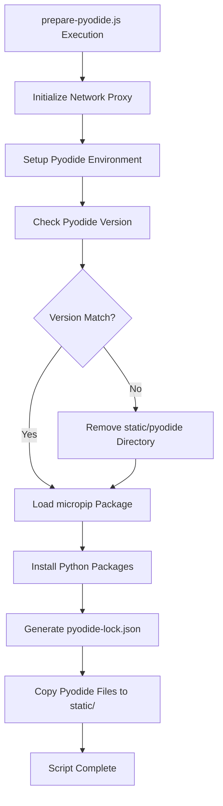
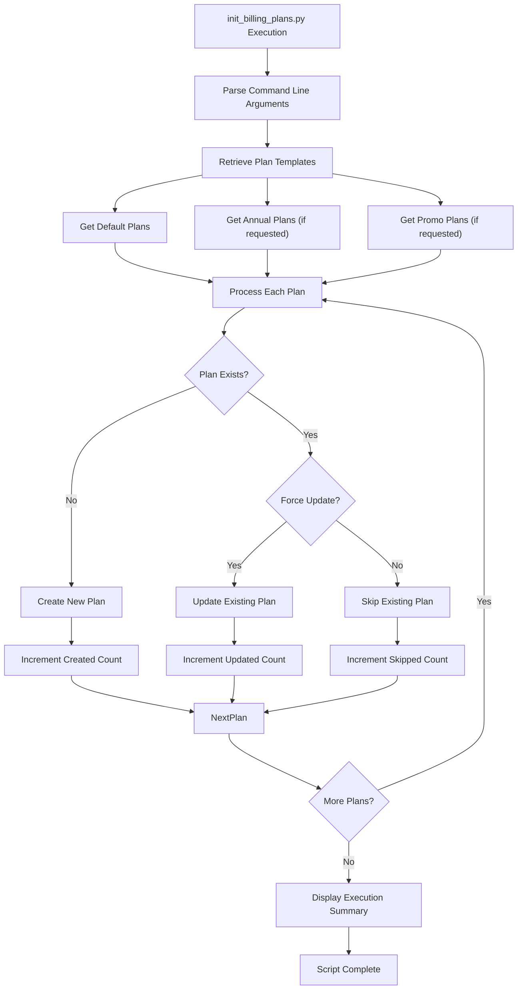
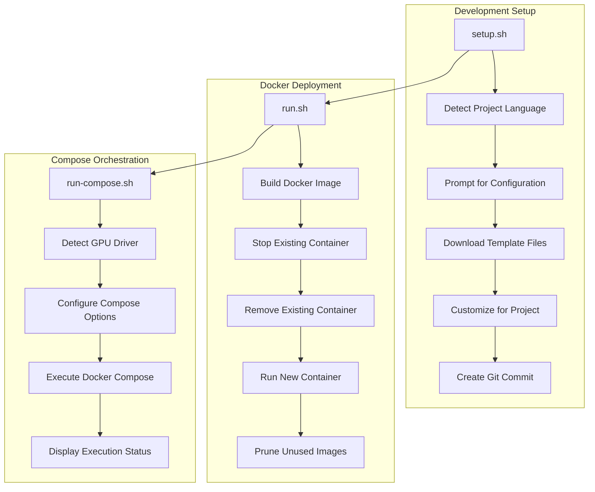
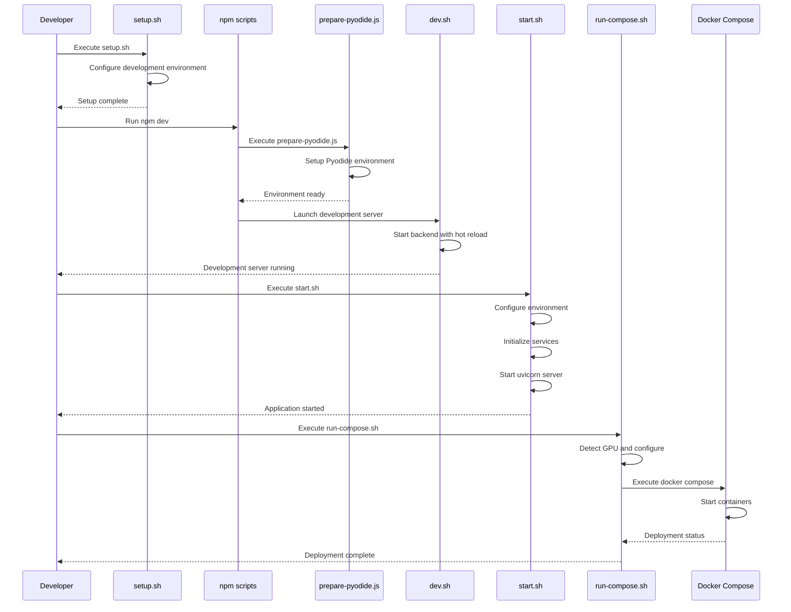
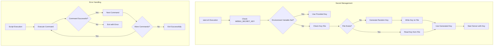
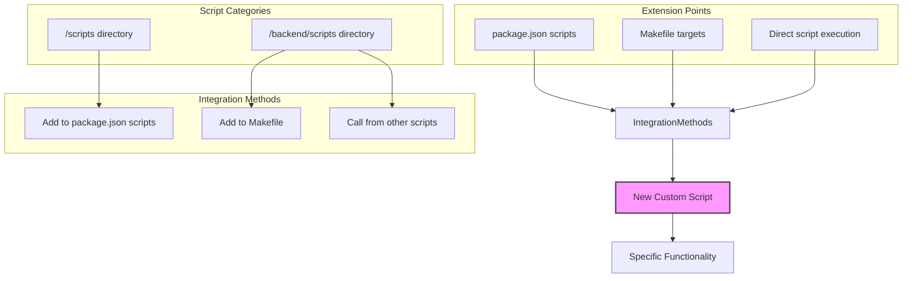

# Scripts and Utilities Structure

<cite>
**Referenced Files in This Document**   
- [scripts/prepare-pyodide.js](file://scripts/prepare-pyodide.js)
- [backend/scripts/init_billing_plans.py](file://backend/scripts/init_billing_plans.py)
- [setup.sh](file://setup.sh)
- [run.sh](file://run.sh)
- [backend/start.sh](file://backend/start.sh)
- [run-compose.sh](file://run-compose.sh)
- [backend/dev.sh](file://backend/dev.sh)
- [run-ollama-docker.sh](file://run-ollama-docker.sh)
- [update_ollama_models.sh](file://update_ollama_models.sh)
- [Makefile](file://Makefile)
</cite>

## Table of Contents
1. [Introduction](#introduction)
2. [Scripts Directory Structure](#scripts-directory-structure)
3. [Frontend Scripts](#frontend-scripts)
4. [Backend Scripts](#backend-scripts)
5. [Development and Deployment Workflows](#development-and-deployment-workflows)
6. [Script Integration and Execution Flow](#script-integration-and-execution-flow)
7. [Security Considerations and Best Practices](#security-considerations-and-best-practices)
8. [Extending the Script Ecosystem](#extending-the-script-ecosystem)
9. [Conclusion](#conclusion)

## Introduction
The open-webui project employs a comprehensive script ecosystem to manage development, testing, and production deployment workflows. This documentation provides an in-depth analysis of the scripts and utilities structure, focusing on the organization and purpose of scripts in both frontend and backend contexts. The scripts are strategically divided between the `/scripts` directory for frontend operations and `/backend/scripts` for backend-specific tasks, enabling clear separation of concerns while maintaining integration across the full stack. These scripts handle critical operations such as environment setup, dependency management, application initialization, and deployment orchestration, forming the backbone of the project's operational workflow.

## Scripts Directory Structure
The open-webui project organizes its scripts in a dual-directory structure that reflects the separation between frontend and backend concerns. The root `/scripts` directory contains JavaScript-based utilities primarily focused on frontend operations and build processes, while the `/backend/scripts` directory houses Python scripts that manage backend initialization and data setup. This architectural decision enables independent development and deployment of frontend and backend components while maintaining clear integration points. The scripts are designed to work in concert with the project's Docker and Docker Compose infrastructure, providing both high-level orchestration and granular control over specific aspects of the application lifecycle. This structure supports multiple deployment scenarios, from local development to production environments, with appropriate scripts for each context.

**Section sources**
- [scripts/prepare-pyodide.js](file://scripts/prepare-pyodide.js)
- [backend/scripts/init_billing_plans.py](file://backend/scripts/init_billing_plans.py)
- [setup.sh](file://setup.sh)
- [run.sh](file://run.sh)
- [backend/start.sh](file://backend/start.sh)

## Frontend Scripts
The frontend script ecosystem in open-webui is centered around the `/scripts` directory and focuses on preparing the client-side environment for execution. The primary script, `prepare-pyodide.js`, is responsible for setting up the Pyodide environment, which enables Python execution in the browser. This script manages the download and installation of essential Python packages such as numpy, pandas, matplotlib, and scikit-learn, creating a comprehensive data science environment accessible from the web interface. The script also handles network proxy configuration through environment variables, ensuring compatibility with restricted network environments. It integrates with the build process through npm scripts, automatically executing during the build phase to ensure the Pyodide environment is properly prepared before deployment.

**Diagram sources**
- [scripts/prepare-pyodide.js](file://scripts/prepare-pyodide.js)

**Section sources**
- [scripts/prepare-pyodide.js](file://scripts/prepare-pyodide.js)
- [package.json](file://package.json#L6-L8)

## Backend Scripts
The backend script ecosystem in open-webui, located in the `/backend/scripts` directory, focuses on initialization and configuration tasks for the server-side components. The primary script, `init_billing_plans.py`, is responsible for initializing billing configurations in the application database. This Python script leverages template-based plan definitions to create default, annual, and promotional billing plans, with command-line options to control which plans are created and whether existing plans should be overwritten. The script provides detailed output during execution, including a summary of created, updated, and skipped plans, making it suitable for both automated deployment processes and manual administration. It integrates with the application's data models and utility functions, ensuring consistency with the overall application architecture while providing a standalone interface for billing plan management.

**Diagram sources**
- [backend/scripts/init_billing_plans.py](file://backend/scripts/init_billing_plans.py)

**Section sources**
- [backend/scripts/init_billing_plans.py](file://backend/scripts/init_billing_plans.py)
- [open_webui/utils/plan_templates.py](file://backend/open_webui/utils/plan_templates.py)

## Development and Deployment Workflows
The open-webui project provides a comprehensive set of shell scripts to support various development and deployment workflows. The `setup.sh` script serves as an AI SWE template setup tool, configuring the project with AI-assisted development infrastructure including a memory bank system, custom commands, and documentation standards. This script detects the project's primary language, prompts for configuration details, downloads template files, and creates a git commit with the new infrastructure. The `run.sh` script orchestrates Docker-based deployment, building the application image, managing container lifecycle, and ensuring proper cleanup of unused images. For more complex deployment scenarios, the `run-compose.sh` script provides advanced orchestration capabilities, including GPU detection and configuration, API exposure, and Playwright support for web scraping. These scripts work together to provide a seamless transition from development to production environments.

**Diagram sources**
- [setup.sh](file://setup.sh)
- [run.sh](file://run.sh)
- [run-compose.sh](file://run-compose.sh)

**Section sources**
- [setup.sh](file://setup.sh)
- [run.sh](file://run.sh)
- [run-compose.sh](file://run-compose.sh)
- [Makefile](file://Makefile)

## Script Integration and Execution Flow
The scripts in open-webui are designed to integrate seamlessly with the project's build and deployment infrastructure, creating a cohesive execution flow from development to production. The process begins with the `setup.sh` script, which configures the development environment with AI-assisted tools and documentation standards. During development, the `dev.sh` script in the backend directory launches the application with hot reloading enabled, while the frontend development server is managed through npm scripts that automatically invoke `prepare-pyodide.js` to ensure the Pyodide environment is properly prepared. For production deployment, the `start.sh` script orchestrates the backend startup process, handling environment variable configuration, secret key management, and service initialization. The `run-compose.sh` script provides a higher-level orchestration layer, integrating with Docker Compose to manage multi-container deployments with support for GPU acceleration, API exposure, and persistent data storage.

**Diagram sources**
- [setup.sh](file://setup.sh)
- [package.json](file://package.json#L6-L8)
- [scripts/prepare-pyodide.js](file://scripts/prepare-pyodide.js)
- [backend/dev.sh](file://backend/dev.sh)
- [backend/start.sh](file://backend/start.sh)
- [run-compose.sh](file://run-compose.sh)

**Section sources**
- [setup.sh](file://setup.sh)
- [package.json](file://package.json)
- [scripts/prepare-pyodide.js](file://scripts/prepare-pyodide.js)
- [backend/dev.sh](file://backend/dev.sh)
- [backend/start.sh](file://backend/start.sh)
- [run-compose.sh](file://run-compose.sh)

## Security Considerations and Best Practices
The open-webui scripts incorporate several security considerations and best practices to ensure safe and reliable operation. The `start.sh` script implements secure secret key management by generating a random key when one is not provided through environment variables, storing it in a file that is excluded from version control. This approach prevents hardcoded secrets in the codebase while ensuring consistent key usage across application restarts. The script also handles environment variable configuration securely, using default values when necessary while allowing override through environment variables for deployment flexibility. The `run-compose.sh` script includes GPU driver detection that prevents configuration errors that could lead to security vulnerabilities. Additionally, the scripts follow secure coding practices such as using `set -e` to exit on error, preventing the continuation of execution in case of failures that could lead to inconsistent states.

**Diagram sources**
- [backend/start.sh](file://backend/start.sh)

**Section sources**
- [backend/start.sh](file://backend/start.sh)
- [run.sh](file://run.sh)
- [setup.sh](file://setup.sh)

## Extending the Script Ecosystem
The open-webui script ecosystem is designed to be extensible, allowing developers to add new scripts and modify existing ones to meet evolving requirements. The project's Makefile provides a convenient interface for common operations, demonstrating how new scripts can be integrated into the build and deployment workflow. The `update_ollama_models.sh` script serves as an example of how to extend the ecosystem with custom functionality, retrieving the list of installed LLMs and updating each one through the Docker container. Developers can create new scripts in the appropriate directory (`/scripts` for frontend utilities or `/backend/scripts` for backend operations) and integrate them into the existing workflow through npm scripts, Makefile targets, or direct execution. The scripts follow consistent patterns and conventions, making it easier to understand and extend their functionality while maintaining compatibility with the overall architecture.

**Diagram sources**
- [Makefile](file://Makefile)
- [package.json](file://package.json)
- [update_ollama_models.sh](file://update_ollama_models.sh)

**Section sources**
- [Makefile](file://Makefile)
- [package.json](file://package.json)
- [update_ollama_models.sh](file://update_ollama_models.sh)
- [run-ollama-docker.sh](file://run-ollama-docker.sh)

## Conclusion
The scripts and utilities structure in open-webui provides a comprehensive and well-organized framework for managing the application's development, testing, and deployment workflows. By separating frontend and backend scripts into distinct directories, the project maintains clear boundaries between client-side and server-side concerns while enabling seamless integration through well-defined interfaces. The scripts cover a wide range of functionality, from environment setup and dependency management to application initialization and deployment orchestration, forming a cohesive ecosystem that supports the full application lifecycle. The inclusion of security best practices, such as secure secret management and error handling, ensures reliable and safe operation across different environments. The extensible design allows developers to easily add new functionality and adapt the scripts to meet evolving requirements, making the open-webui script ecosystem a robust foundation for both current and future development needs.