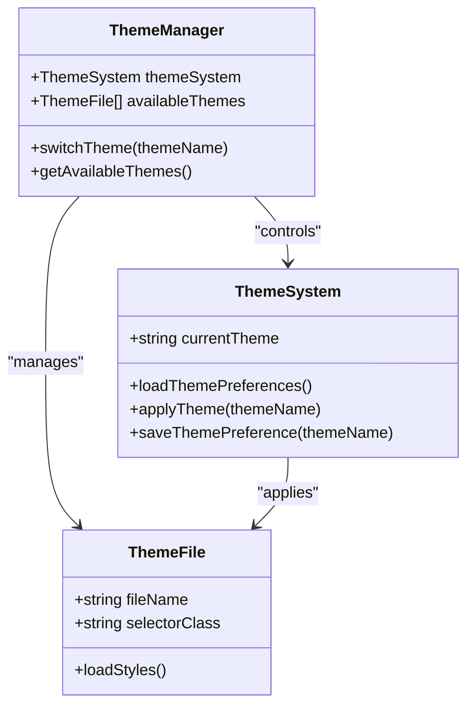
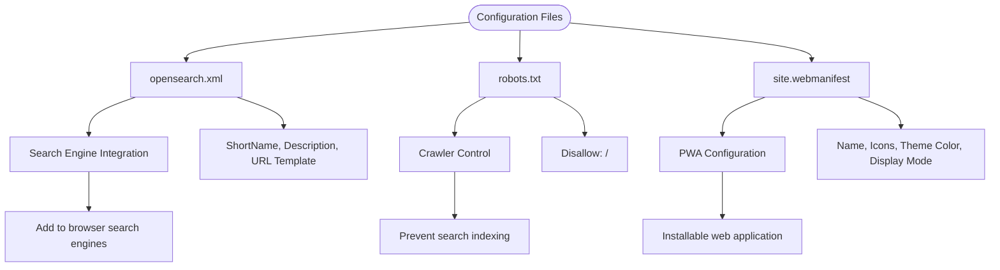
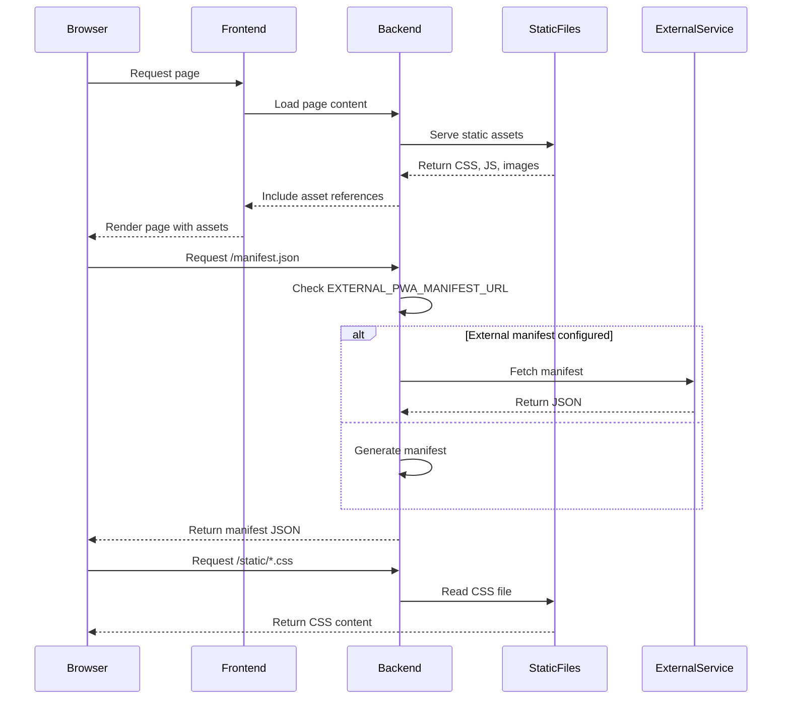

# Static Assets and Configuration Structure

<cite>
**Referenced Files in This Document**   
- [opensearch.xml](file://static/opensearch.xml)
- [robots.txt](file://static/robots.txt)
- [rosepine.css](file://static/themes/rosepine.css)
- [rosepine-dawn.css](file://static/themes/rosepine-dawn.css)
- [site.webmanifest](file://static/static/site.webmanifest)
- [site.webmanifest](file://backend/open_webui/static/site.webmanifest)
- [pdf-style.css](file://backend/open_webui/static/assets/pdf-style.css)
- [swagger-ui.css](file://backend/open_webui/static/swagger-ui/swagger-ui.css)
- [user-import.csv](file://static/static/user-import.csv)
- [main.py](file://backend/open_webui/main.py#L2252-L2283)
- [app.html](file://src/app.html#L1-L72)
</cite>

## Table of Contents
1. [Static Assets Organization](#static-assets-organization)
2. [Theme System Implementation](#theme-system-implementation)
3. [Configuration Files](#configuration-files)
4. [Static Asset Serving and Referencing](#static-asset-serving-and-referencing)
5. [Best Practices](#best-practices)

## Static Assets Organization

The Open WebUI project maintains a dual static assets structure with distinct directories serving different purposes in the application lifecycle. The `/static` directory at the project root contains user-facing static resources that are directly accessible and customizable, while the `/backend/open_webui/static` directory houses backend-managed static files that support API functionality and internal operations.

The root `/static` directory includes theme CSS files in the `/static/themes` subdirectory, configuration files like `opensearch.xml` and `robots.txt`, and a nested `/static` folder containing web manifest and CSV import templates. This organization allows for easy customization of frontend appearance and behavior without modifying backend code.

In contrast, the backend static directory `/backend/open_webui/static` contains assets specifically required by the backend services, including PDF styling rules in `assets/pdf-style.css`, Swagger UI interface styles, and shared web manifest files. These assets are served through the backend application and are typically not intended for direct user modification.

**Section sources**
- [site.webmanifest](file://static/static/site.webmanifest)
- [site.webmanifest](file://backend/open_webui/static/site.webmanifest)
- [pdf-style.css](file://backend/open_webui/static/assets/pdf-style.css)
- [swagger-ui.css](file://backend/open_webui/static/swagger-ui/swagger-ui.css)

## Theme System Implementation

The Open WebUI theme system is implemented through CSS files located in the `/static/themes` directory, specifically `rosepine.css` and `rosepine-dawn.css`. These files define comprehensive styling rules that override default application appearance with custom color schemes and visual elements. Each theme file uses a unique class selector (`rose-pine` and `rose-pine-dawn` respectively) to encapsulate all theme-specific styles, preventing conflicts with other themes.

The theme implementation follows a pattern of targeting specific CSS classes and component structures within the application, using the `!important` flag to ensure style precedence. For example, both themes define text colors, background colors, button styles, and form element appearances for various UI components. The `rosepine.css` file implements a dark theme with deep purple and gray tones, while `rosepine-dawn.css` provides a lighter variant with warmer colors.

Theme switching functionality is managed through the application's frontend code, which reads user preferences from localStorage and applies the appropriate theme class to the document. The system supports multiple theme options including 'system', 'light', 'dark', 'oled-dark', and custom themes like 'her', allowing users to select their preferred visual experience.

**Diagram sources**
- [rosepine.css](file://static/themes/rosepine.css)
- [rosepine-dawn.css](file://static/themes/rosepine-dawn.css)
- [app.html](file://src/app.html#L49-L72)

**Section sources**
- [rosepine.css](file://static/themes/rosepine.css)
- [rosepine-dawn.css](file://static/themes/rosepine-dawn.css)
- [app.html](file://src/app.html#L49-L72)

## Configuration Files

The Open WebUI project includes several configuration files in the `/static` directory that control various aspects of application behavior and integration. The `opensearch.xml` file enables browser search integration, allowing users to add the application as a search engine with a defined template for query parameters. This file specifies the search endpoint, input encoding, and visual elements like the favicon to display in browser search dropdowns.

The `robots.txt` file implements crawler directives to control search engine indexing behavior. Currently configured to disallow all crawlers with `Disallow: /`, this setting prevents search engines from indexing the application content, which is appropriate for private or authenticated applications. This configuration can be modified to allow selective indexing of public pages if needed.

Additionally, the `site.webmanifest` file in the `/static/static` directory defines the Progressive Web App (PWA) configuration, including application name, icons for various resolutions, theme color, and display mode. This manifest enables the application to be installed on user devices with a standalone interface, enhancing the user experience by making the web application feel more like a native app.

**Diagram sources**
- [opensearch.xml](file://static/opensearch.xml)
- [robots.txt](file://static/robots.txt)
- [site.webmanifest](file://static/static/site.webmanifest)

**Section sources**
- [opensearch.xml](file://static/opensearch.xml)
- [robots.txt](file://static/robots.txt)
- [site.webmanifest](file://static/static/site.webmanifest)

## Static Asset Serving and Referencing

Static assets in Open WebUI are served through a combination of direct file access and backend routing. The application backend exposes static files through predefined routes, allowing frontend components to reference assets using consistent paths. For example, the `main.py` file defines a route for `/manifest.json` that either returns an external PWA manifest or generates one dynamically with application metadata, icons, and share target configuration.

Frontend components reference static assets using absolute paths prefixed with `/static/`, such as `/static/favicon.png` for icons and `/static/custom.css` for user-defined styles. This consistent naming convention ensures that assets are correctly resolved regardless of the current page route. The `app.html` file demonstrates this pattern by including multiple favicon links, the manifest reference, and stylesheet imports, all using the `/static/` path prefix.

The backend also serves specialized static assets for specific use cases. The PDF styling rules in `pdf-style.css` are applied when generating PDF exports, ensuring consistent formatting with custom fonts and layout rules. Similarly, the Swagger UI CSS file provides styling for the API documentation interface, maintaining visual consistency with the main application.

Asset references are also embedded in component code, such as the `ProfileImage.svelte` component which constructs image URLs using the `WEBUI_BASE_URL` constant combined with static asset paths. This approach ensures that asset references remain valid across different deployment environments and base URL configurations.

**Diagram sources**
- [main.py](file://backend/open_webui/main.py#L2252-L2283)
- [app.html](file://src/app.html#L1-L51)
- [pdf-style.css](file://backend/open_webui/static/assets/pdf-style.css)

**Section sources**
- [main.py](file://backend/open_webui/main.py#L2252-L2283)
- [app.html](file://src/app.html#L1-L72)
- [pdf-style.css](file://backend/open_webui/static/assets/pdf-style.css)

## Best Practices

When adding new static assets to Open WebUI, follow these best practices to maintain consistency and optimal performance. Place user-facing assets in the appropriate directory: custom themes in `/static/themes/`, configuration files in `/static/`, and backend-specific assets in `/backend/open_webui/static/`. Use descriptive, lowercase filenames with hyphens to separate words, following the existing naming convention.

For theme development, ensure CSS rules are encapsulated within a unique class selector to prevent style conflicts. Use the `!important` flag judiciously to override default styles, but avoid excessive specificity that could make themes difficult to maintain. Test themes across different components to verify consistent appearance and address any visual inconsistencies.

Optimize asset delivery by minimizing file sizes, especially for CSS and image files. Consider using CSS variables for theme colors to simplify maintenance and enable dynamic theme switching. For images, use appropriate formats and compression levels to balance quality and performance.

When referencing assets in code, use the `/static/` path prefix consistently and leverage environment variables or constants for base URLs to ensure portability across deployment environments. For PWA functionality, keep the `site.webmanifest` file updated with current application metadata and ensure all required icon sizes are provided.

Finally, document any custom assets or themes added to the system, explaining their purpose and usage. This documentation helps other developers understand the asset structure and maintain consistency across the codebase.

**Section sources**
- [rosepine.css](file://static/themes/rosepine.css)
- [rosepine-dawn.css](file://static/themes/rosepine-dawn.css)
- [site.webmanifest](file://static/static/site.webmanifest)
- [app.html](file://src/app.html#L1-L72)