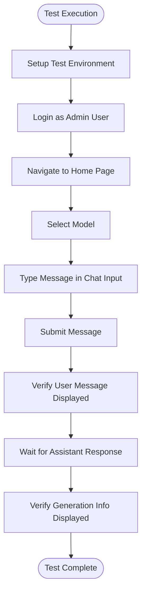
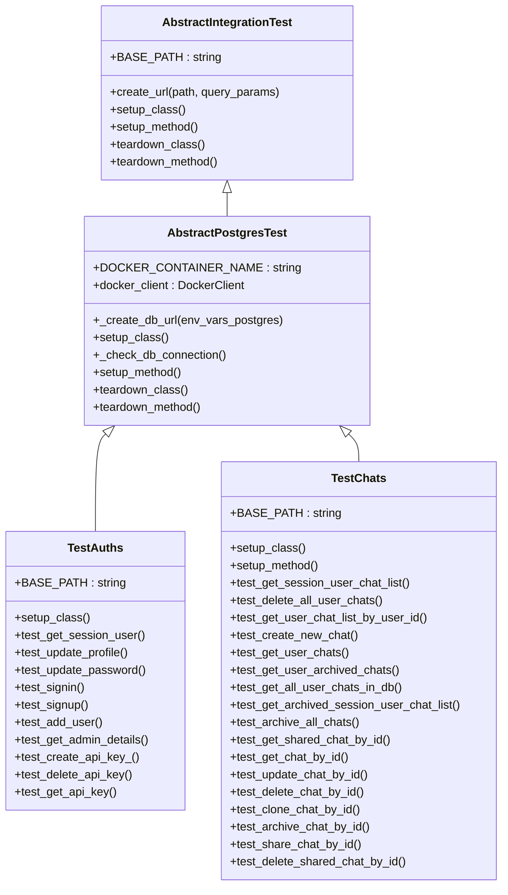
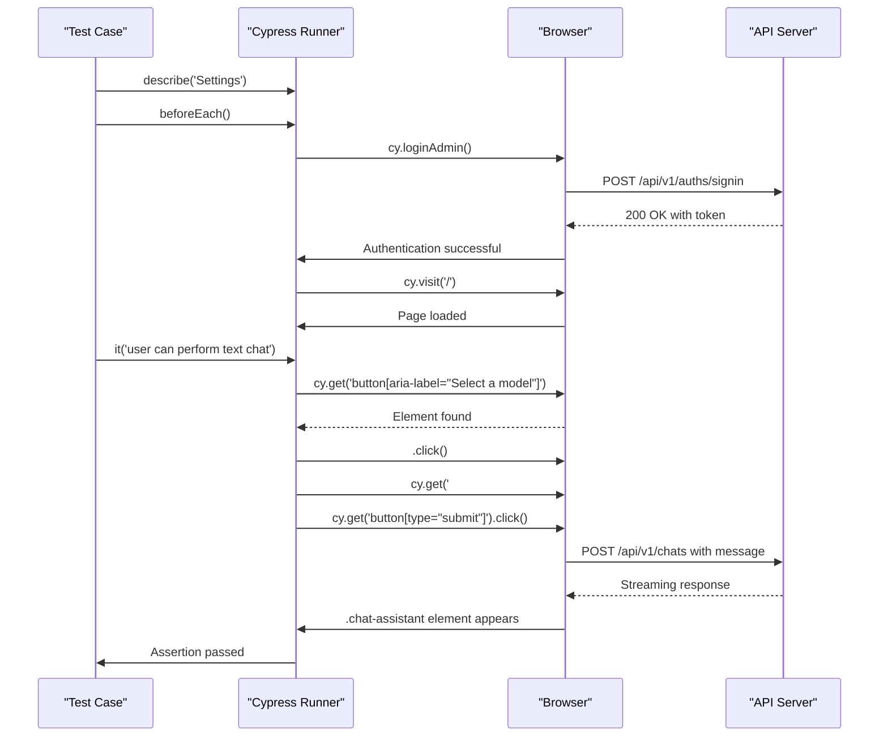

# Testing Directory Structure

<cite>
**Referenced Files in This Document**   
- [cypress/e2e/chat.cy.ts](file://cypress/e2e/chat.cy.ts)
- [cypress/e2e/documents.cy.ts](file://cypress/e2e/documents.cy.ts)
- [cypress/e2e/registration.cy.ts](file://cypress/e2e/registration.cy.ts)
- [cypress/support/e2e.ts](file://cypress/support/e2e.ts)
- [cypress.config.ts](file://cypress.config.ts)
- [backend/open_webui/test/apps/webui/routers/test_auths.py](file://backend/open_webui/test/apps/webui/routers/test_auths.py)
- [backend/open_webui/test/apps/webui/routers/test_chats.py](file://backend/open_webui/test/apps/webui/routers/test_chats.py)
- [backend/open_webui/test/apps/webui/routers/test_models.py](file://backend/open_webui/test/apps/webui/routers/test_models.py)
- [backend/open_webui/test/apps/webui/storage/test_provider.py](file://backend/open_webui/test/apps/webui/storage/test_provider.py)
- [backend/open_webui/test/util/mock_user.py](file://backend/open_webui/test/util/mock_user.py)
- [backend/open_webui/test/util/abstract_integration_test.py](file://backend/open_webui/test/util/abstract_integration_test.py)
- [backend/open_webui/test/util/test_redis.py](file://backend/open_webui/test/util/test_redis.py)
</cite>

## Table of Contents
1. [Frontend Testing with Cypress](#frontend-testing-with-cypress)
2. [Backend Testing Infrastructure](#backend-testing-infrastructure)
3. [Cypress Test Structure and Examples](#cypress-test-structure-and-examples)
4. [Backend Test Organization and Patterns](#backend-test-organization-and-patterns)
5. [Test Setup and Assertion Patterns](#test-setup-and-assertion-patterns)
6. [CI/CD Integration](#cicd-integration)
7. [Testing Best Practices and Common Pitfalls](#testing-best-practices-and-common-pitfalls)

## Frontend Testing with Cypress

The open-webui project implements comprehensive end-to-end testing using Cypress, a modern JavaScript testing framework designed for web applications. The frontend tests are located in the `cypress/` directory and focus on simulating real user interactions across critical application flows. These tests ensure that the user interface behaves as expected from the user's perspective, validating the complete integration between frontend components and backend APIs.

The Cypress testing suite is specifically designed to test key user journeys including chat interactions, document management, user registration, and settings configuration. By operating at the browser level, these tests verify not only the functionality of individual components but also the overall user experience, including UI state changes, form submissions, and asynchronous operations like API calls and streaming responses.

The tests are written in TypeScript, providing type safety and better developer experience. They leverage Cypress's rich API for DOM manipulation, assertion, and test control, allowing for reliable and maintainable test code. The framework's ability to automatically wait for elements and assertions helps create resilient tests that are less prone to flakiness.

**Section sources**
- [cypress/e2e/chat.cy.ts](file://cypress/e2e/chat.cy.ts#L1-L107)
- [cypress/e2e/documents.cy.ts](file://cypress/e2e/documents.cy.ts#L1-L3)
- [cypress/e2e/registration.cy.ts](file://cypress/e2e/registration.cy.ts#L1-L53)
- [cypress/support/e2e.ts](file://cypress/support/e2e.ts#L1-L79)
- [cypress.config.ts](file://cypress.config.ts#L1-L9)

## Backend Testing Infrastructure

The backend testing infrastructure for open-webui is organized in the `backend/open_webui/test/` directory and employs a comprehensive approach to ensure the reliability of API endpoints and business logic. The test suite combines unit tests for isolated components with integration tests that verify the interaction between different parts of the system, particularly focusing on database operations, authentication flows, and API endpoint behavior.

The backend tests are built on the pytest framework, leveraging its powerful fixture system and assertion introspection capabilities. A key architectural component is the `AbstractPostgresTest` class, which provides a consistent test environment by setting up a dedicated PostgreSQL container for each test run. This approach ensures test isolation and prevents interference between test cases while maintaining a realistic database environment that closely mirrors production.

The test infrastructure includes specialized utilities for mocking user authentication and managing test state. The `mock_user.py` module provides context managers that override FastAPI dependency injection to simulate authenticated users with customizable attributes, allowing tests to validate role-based access control and user-specific functionality without requiring actual authentication flows.

**Section sources**
- [backend/open_webui/test/util/abstract_integration_test.py](file://backend/open_webui/test/util/abstract_integration_test.py#L1-L162)
- [backend/open_webui/test/util/mock_user.py](file://backend/open_webui/test/util/mock_user.py#L1-L46)
- [backend/open_webui/test/apps/webui/routers/test_auths.py](file://backend/open_webui/test/apps/webui/routers/test_auths.py#L1-L201)
- [backend/open_webui/test/apps/webui/routers/test_chats.py](file://backend/open_webui/test/apps/webui/routers/test_chats.py#L1-L237)

## Cypress Test Structure and Examples

The Cypress test suite follows a well-organized structure with dedicated test files for different application features, located in the `cypress/e2e/` directory. Each test file focuses on a specific user flow, making the tests easier to understand, maintain, and debug. The test files include `chat.cy.ts` for chat interactions, `documents.cy.ts` for document management, `registration.cy.ts` for user registration and login, and `settings.cy.ts` for settings configuration.

The `chat.cy.ts` file contains comprehensive tests for the chat functionality, including model selection, text chat, image generation, and chat sharing. Each test follows a consistent pattern of setting up the initial state (typically by logging in as an admin user), performing user actions through the UI, and asserting the expected outcomes. For example, the text chat test verifies that user messages are displayed, assistant responses are received, and generation information is shown after the response is complete.

**Diagram sources**
- [cypress/e2e/chat.cy.ts](file://cypress/e2e/chat.cy.ts#L1-L107)

The `registration.cy.ts` file demonstrates testing of user registration and login flows. It includes tests that verify the ability to register a new user (who is initially in a pending state) and to log in with the admin user. These tests validate form interactions, state transitions, and UI feedback messages, ensuring that the authentication system works correctly from the user's perspective.

**Section sources**
- [cypress/e2e/chat.cy.ts](file://cypress/e2e/chat.cy.ts#L1-L107)
- [cypress/e2e/registration.cy.ts](file://cypress/e2e/registration.cy.ts#L1-L53)

## Backend Test Organization and Patterns

The backend test organization follows a clear pattern of grouping tests by functionality, with test files located in `backend/open_webui/test/apps/webui/routers/` corresponding to the API routers they test. This structure makes it easy to locate tests for specific endpoints and ensures that test code is co-located with the functionality it verifies. The test suite includes tests for authentication (`test_auths.py`), chat operations (`test_chats.py`), model management (`test_models.py`), and storage providers (`test_provider.py`).

A key pattern in the backend tests is the use of inheritance to share common setup and teardown logic. The `AbstractPostgresTest` class provides a foundation for all integration tests, handling the creation and destruction of the PostgreSQL container, database connection setup, and transaction management. Specific test classes like `TestAuths` and `TestChats` inherit from this base class and add functionality specific to their domain.

**Diagram sources**
- [backend/open_webui/test/util/abstract_integration_test.py](file://backend/open_webui/test/util/abstract_integration_test.py#L1-L162)
- [backend/open_webui/test/apps/webui/routers/test_auths.py](file://backend/open_webui/test/apps/webui/routers/test_auths.py#L1-L201)
- [backend/open_webui/test/apps/webui/routers/test_chats.py](file://backend/open_webui/test/apps/webui/routers/test_chats.py#L1-L237)

The test suite also includes specialized tests for infrastructure components, such as the Redis integration tests in `test_redis.py`. These tests verify the reliability of the Redis connection under various conditions, including failover scenarios and connection errors, ensuring that the application can handle real-world infrastructure challenges.

**Section sources**
- [backend/open_webui/test/apps/webui/routers/test_auths.py](file://backend/open_webui/test/apps/webui/routers/test_auths.py#L1-L201)
- [backend/open_webui/test/apps/webui/routers/test_chats.py](file://backend/open_webui/test/apps/webui/routers/test_chats.py#L1-L237)
- [backend/open_webui/test/apps/webui/routers/test_models.py](file://backend/open_webui/test/apps/webui/routers/test_models.py#L1-L62)
- [backend/open_webui/test/util/test_redis.py](file://backend/open_webui/test/util/test_redis.py#L1-L794)

## Test Setup and Assertion Patterns

Both the frontend and backend test suites employ consistent patterns for test setup and assertions, ensuring reliability and maintainability. In the Cypress tests, the `beforeEach` hook is used to log in as the admin user and navigate to the home page before each test, establishing a consistent starting state. The `support/e2e.ts` file defines custom commands like `loginAdmin` and `registerAdmin` that encapsulate common setup operations, promoting code reuse and reducing duplication.

The Cypress tests use a combination of DOM element selection and explicit assertions to verify application state. For example, the chat tests use `cy.get()` to select UI elements by their CSS classes or attributes, and then use `.should('exist')` to assert that elements are present in the DOM. For asynchronous operations like API calls, the tests leverage Cypress's built-in waiting mechanisms, using options like `{ timeout: 120_000 }` to handle long-running operations.

**Diagram sources**
- [cypress/e2e/chat.cy.ts](file://cypress/e2e/chat.cy.ts#L1-L107)
- [cypress/support/e2e.ts](file://cypress/support/e2e.ts#L1-L79)

In the backend tests, the assertion pattern is based on verifying HTTP response status codes and response body content. The tests use Python's `assert` statements to validate that API endpoints return the expected status codes (typically 200 for success) and that the response data matches the expected structure and values. For example, the authentication tests verify that the signin endpoint returns user information including ID, name, email, role, and authentication token.

The backend tests also include assertions on database state, ensuring that operations like user creation, chat creation, and profile updates correctly modify the underlying data. After performing an API operation, the tests query the database directly to verify that the expected changes have been persisted, providing a comprehensive validation of both the API behavior and data integrity.

**Section sources**
- [cypress/e2e/chat.cy.ts](file://cypress/e2e/chat.cy.ts#L1-L107)
- [cypress/support/e2e.ts](file://cypress/support/e2e.ts#L1-L79)
- [backend/open_webui/test/apps/webui/routers/test_auths.py](file://backend/open_webui/test/apps/webui/routers/test_auths.py#L1-L201)
- [backend/open_webui/test/apps/webui/routers/test_chats.py](file://backend/open_webui/test/apps/webui/routers/test_chats.py#L1-L237)

## CI/CD Integration

The open-webui testing infrastructure is designed to integrate seamlessly with CI/CD pipelines, ensuring that tests are executed automatically as part of the development workflow. The Cypress configuration in `cypress.config.ts` specifies the base URL for the application (`http://localhost:8080`) and enables video recording of test runs, which is valuable for debugging test failures in CI environments.

The backend test suite is structured to be easily executable in containerized environments, with the `AbstractPostgresTest` class handling the setup of a dedicated PostgreSQL container for each test run. This approach ensures that tests can be executed in isolation without requiring external database dependencies, making them suitable for execution in CI/CD pipelines where test environment consistency is critical.

The test files are organized in a way that allows for selective execution, enabling CI/CD pipelines to run specific test suites based on the changes in a pull request. For example, changes to frontend components could trigger only the Cypress tests, while changes to API endpoints could trigger the relevant backend test files. This selective execution helps reduce CI/CD pipeline duration while maintaining comprehensive test coverage.

**Section sources**
- [cypress.config.ts](file://cypress.config.ts#L1-L9)
- [backend/open_webui/test/util/abstract_integration_test.py](file://backend/open_webui/test/util/abstract_integration_test.py#L1-L162)

## Testing Best Practices and Common Pitfalls

The open-webui testing infrastructure demonstrates several best practices for effective testing. One key practice is the separation of concerns between frontend and backend tests, with Cypress handling end-to-end user flows and pytest handling API and business logic validation. This separation allows each test suite to focus on its specific domain, resulting in more maintainable and reliable tests.

Another best practice is the use of test fixtures and setup/teardown methods to ensure test isolation and consistency. The `beforeEach` and `afterEach` hooks in Cypress, and the `setup_method` and `teardown_method` in the backend tests, ensure that each test runs in a clean environment, preventing test pollution and making failures easier to diagnose.

Common pitfalls to avoid include over-reliance on implementation details in tests, which can make tests brittle and prone to breaking when code is refactored. The open-webui tests generally avoid this by focusing on observable behavior rather than internal implementation. However, some tests could be improved by using more semantic selectors rather than CSS classes, which might change during UI refactoring.

Another potential pitfall is test flakiness, particularly in end-to-end tests that involve asynchronous operations. The open-webui Cypress tests address this by using appropriate timeouts and leveraging Cypress's automatic waiting mechanisms, but additional resilience could be added through retry mechanisms for flaky tests.

Strategies for maintaining reliable test coverage include regular test refactoring to keep tests aligned with application changes, monitoring test execution times to identify slow tests, and using code coverage tools to identify untested code paths. The project could benefit from implementing code coverage reporting to ensure that new features are adequately tested and to identify areas that need additional test coverage.

**Section sources**
- [cypress/e2e/chat.cy.ts](file://cypress/e2e/chat.cy.ts#L1-L107)
- [backend/open_webui/test/apps/webui/routers/test_auths.py](file://backend/open_webui/test/apps/webui/routers/test_auths.py#L1-L201)
- [backend/open_webui/test/util/abstract_integration_test.py](file://backend/open_webui/test/util/abstract_integration_test.py#L1-L162)