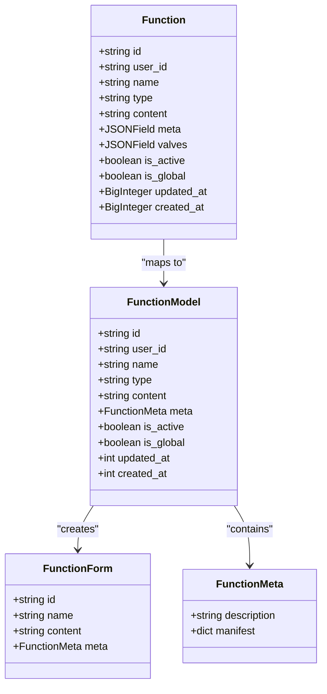
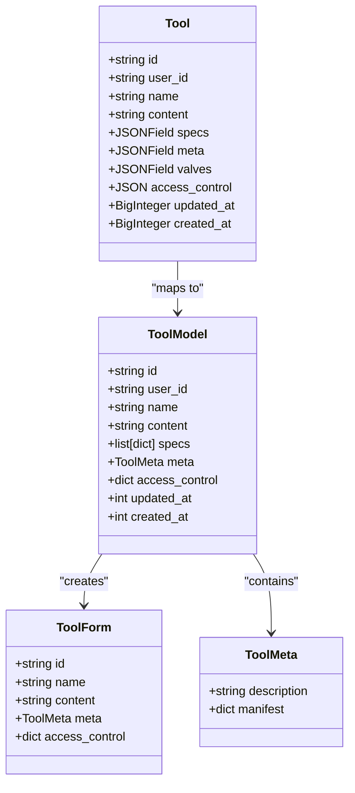
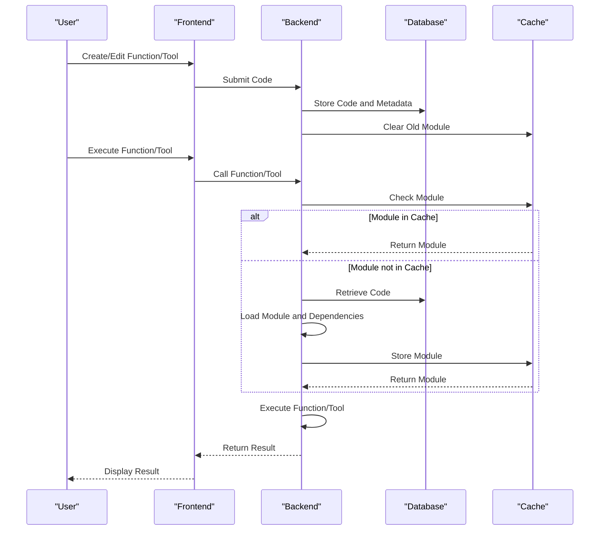

# Extensibility and Plugins

<cite>
**Referenced Files in This Document**   
- [functions.py](file://backend/open_webui/functions.py)
- [plugin.py](file://backend/open_webui/utils/plugin.py)
- [functions.py](file://backend/open_webui/models/functions.py)
- [functions.py](file://backend/open_webui/routers/functions.py)
- [tools.py](file://backend/open_webui/utils/tools.py)
- [tools.py](file://backend/open_webui/models/tools.py)
- [tools.py](file://backend/open_webui/routers/tools.py)
- [code_interpreter.py](file://backend/open_webui/utils/code_interpreter.py)
- [FunctionEditor.svelte](file://src/lib/components/admin/Functions/FunctionEditor.svelte)
- [ToolkitEditor.svelte](file://src/lib/components/workspace/Tools/ToolkitEditor.svelte)
</cite>

## Table of Contents
1. [Introduction](#introduction)
2. [Functions System](#functions-system)
3. [Tools Framework](#tools-framework)
4. [Plugin Architecture](#plugin-architecture)
5. [Development Workflow](#development-workflow)
6. [Security Considerations](#security-considerations)

## Introduction
The open-webui platform provides a robust extensibility system that allows users to enhance the application's capabilities through custom functions and tools. This system enables code execution, API integrations, and additional functionality through a well-defined plugin architecture. The extensibility framework is designed to be both powerful and secure, allowing developers to create custom extensions while maintaining system integrity.

**Section sources**
- [functions.py](file://backend/open_webui/functions.py#L1-L354)
- [tools.py](file://backend/open_webui/utils/tools.py#L1-L800)

## Functions System
The functions system in open-webui allows for the creation of custom Python functions that can be integrated into the application workflow. Functions are implemented as Python classes with specific interfaces that define their behavior. The system supports three main types of functions:

- **Pipe**: Custom pipelines that can work with external or internal models
- **Filter**: Pre-processors and post-processors for request and response modification
- **Action**: Custom actions that can be triggered within the application

Functions are defined with a specific structure that includes initialization, inlet (pre-processing), and outlet (post-processing) methods. The inlet method allows for request validation and modification before processing by the chat completion API, while the outlet method enables response modification and analysis after processing.

Functions can include configurable parameters through Valves and UserValves classes, which provide a way to expose settings to administrators and end-users respectively. The system automatically extracts frontmatter from function code to gather metadata such as title, author, version, and requirements.

**Diagram sources**
- [functions.py](file://backend/open_webui/models/functions.py#L19-L72)

**Section sources**
- [functions.py](file://backend/open_webui/models/functions.py#L1-L396)
- [functions.py](file://backend/open_webui/functions.py#L1-L354)
- [FunctionEditor.svelte](file://src/lib/components/admin/Functions/FunctionEditor.svelte#L1-L432)

## Tools Framework
The tools framework provides a function calling system that enables integration with external services and APIs. Tools are implemented as Python classes containing multiple methods that can be called by the application. Each tool method can be exposed as a callable function with proper type hints and docstrings that are automatically converted to OpenAI function specifications.

The tools system supports both local tools and external tool servers. External tool servers can be connected via OpenAPI specifications, allowing automatic discovery and integration of API endpoints. The framework handles authentication, parameter validation, and response processing for tool calls.

Tools can be shared with specific users or groups through access control settings, and can include configurable parameters through Valves and UserValves classes similar to functions. The system automatically generates tool specifications from Python function signatures and docstrings, making it easy to expose functionality to the application.

**Diagram sources**
- [tools.py](file://backend/open_webui/models/tools.py#L24-L72)

**Section sources**
- [tools.py](file://backend/open_webui/models/tools.py#L1-L275)
- [tools.py](file://backend/open_webui/utils/tools.py#L1-L800)
- [ToolkitEditor.svelte](file://src/lib/components/workspace/Tools/ToolkitEditor.svelte#L1-L354)

## Plugin Architecture
The plugin architecture in open-webui is built around dynamic module loading and caching. When a function or tool is executed, the system loads the corresponding Python code, executes it in a secure environment, and caches the result for performance optimization. The architecture includes several key components:

- **Module Loading**: Functions and tools are loaded from the database and compiled into Python modules
- **Dependency Management**: Required packages specified in the frontmatter are automatically installed
- **Caching System**: Loaded modules are cached in memory to improve performance
- **Security Isolation**: Code execution is isolated to prevent unauthorized access to system resources

The architecture supports both admin-created functions and user-created tools, with appropriate access controls and permission checks. Functions can be marked as global to make them available to all users, while tools can have fine-grained access control settings.

**Diagram sources**
- [plugin.py](file://backend/open_webui/utils/plugin.py#L1-L313)
- [functions.py](file://backend/open_webui/functions.py#L1-L354)
- [tools.py](file://backend/open_webui/utils/tools.py#L1-L800)

**Section sources**
- [plugin.py](file://backend/open_webui/utils/plugin.py#L1-L313)
- [functions.py](file://backend/open_webui/functions.py#L1-L354)
- [tools.py](file://backend/open_webui/utils/tools.py#L1-L800)

## Development Workflow
The development workflow for creating extensions in open-webui involves several steps:

1. **Creation**: Use the admin interface to create a new function or tool, providing a name, ID, and description
2. **Implementation**: Write Python code using the provided boilerplate templates, implementing the required methods
3. **Configuration**: Define Valves and UserValves classes to expose configurable parameters
4. **Testing**: Test the extension within the application to ensure proper functionality
5. **Deployment**: Save the extension to make it available for use

The system provides code editors with syntax highlighting and formatting capabilities to assist in development. Functions and tools can be imported from GitHub repositories by providing a URL to the source code. The development environment includes support for code formatting and validation to ensure code quality.

For code execution, the system supports integration with Jupyter notebooks through the code interpreter module, allowing for execution of Python code in a secure environment. This enables complex data processing and analysis capabilities within the application.

**Section sources**
- [FunctionEditor.svelte](file://src/lib/components/admin/Functions/FunctionEditor.svelte#L1-L432)
- [ToolkitEditor.svelte](file://src/lib/components/workspace/Tools/ToolkitEditor.svelte#L1-L354)
- [code_interpreter.py](file://backend/open_webui/utils/code_interpreter.py#L1-L211)

## Security Considerations
The extensibility system in open-webui includes several security measures to protect against potential risks:

- **Code Execution Warnings**: Clear warnings are displayed when creating functions or tools, emphasizing the risks of arbitrary code execution
- **Access Controls**: Functions and tools have configurable access controls that restrict who can use or modify them
- **Permission System**: A comprehensive permission system controls who can create, modify, and use extensions
- **Environment Isolation**: Code execution is isolated from the main application environment
- **Dependency Management**: Required packages are installed in a controlled manner with appropriate error handling

When implementing extensions, developers should follow security best practices:

- Avoid using eval() and similar functions that can execute arbitrary code
- Validate all inputs and handle errors gracefully
- Use environment variables for sensitive information like API keys
- Implement proper error handling and logging
- Test extensions thoroughly before deployment

The system requires administrative privileges to create or modify functions and tools, ensuring that only trusted users can introduce new code into the application. Users are strongly advised to only install extensions from trusted sources to prevent security vulnerabilities.

**Section sources**
- [FunctionEditor.svelte](file://src/lib/components/admin/Functions/FunctionEditor.svelte#L1-L432)
- [ToolkitEditor.svelte](file://src/lib/components/workspace/Tools/ToolkitEditor.svelte#L1-L354)
- [access_control.py](file://backend/open_webui/utils/access_control.py#L1-L175)
- [plugin.py](file://backend/open_webui/utils/plugin.py#L1-L313)