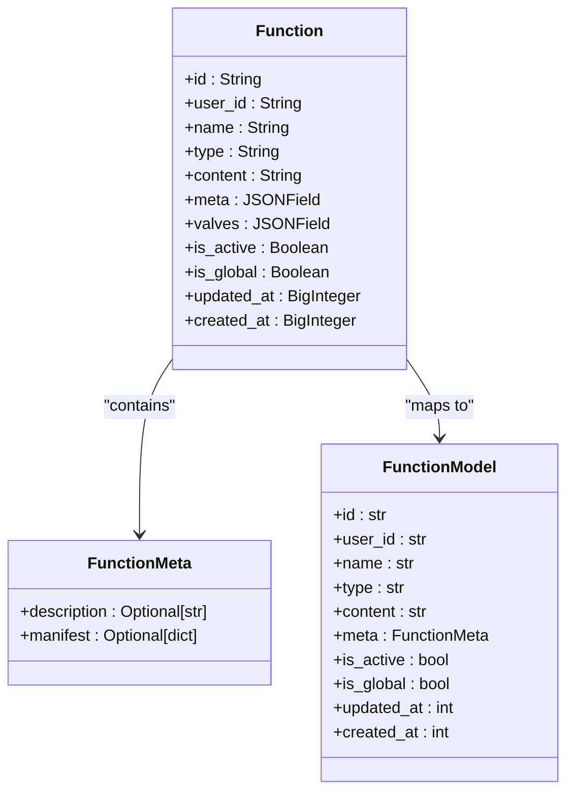
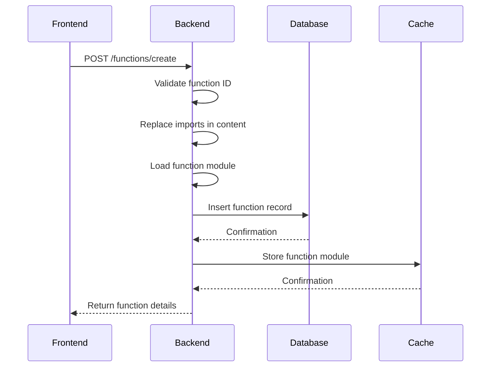
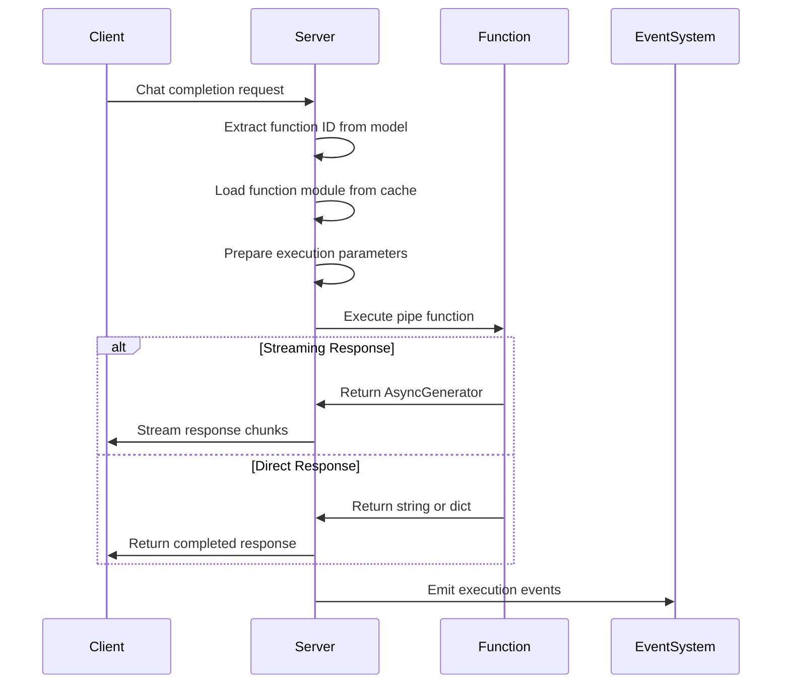
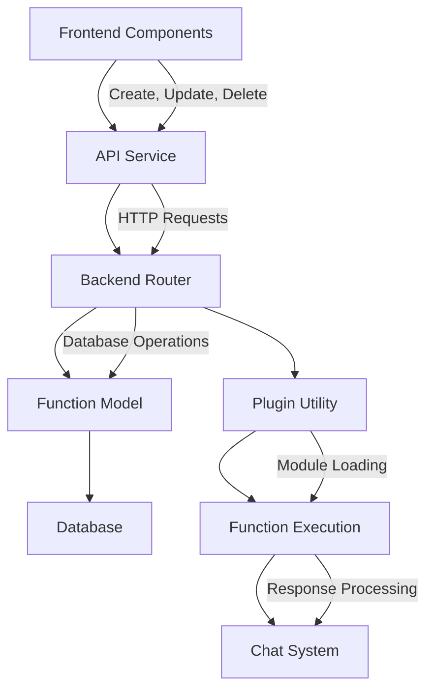
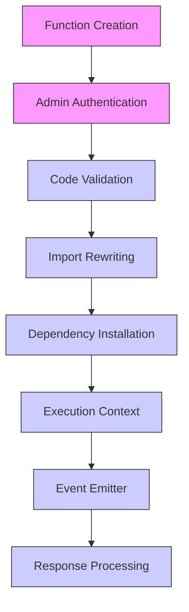
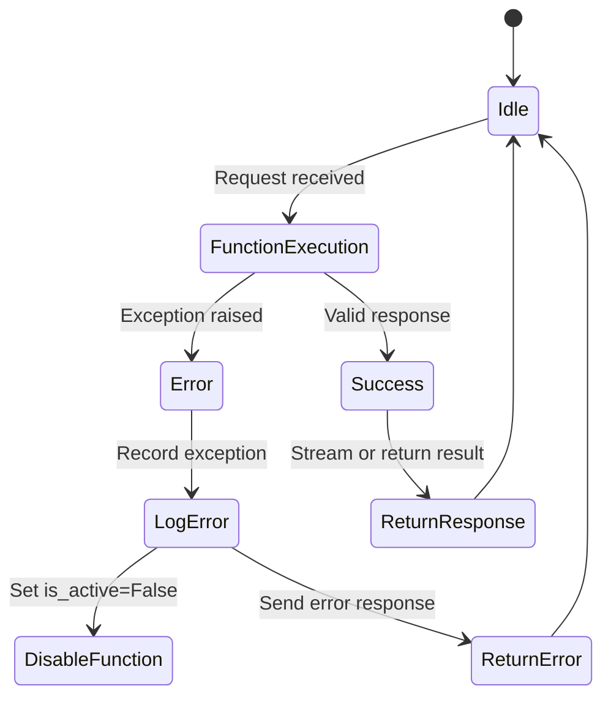
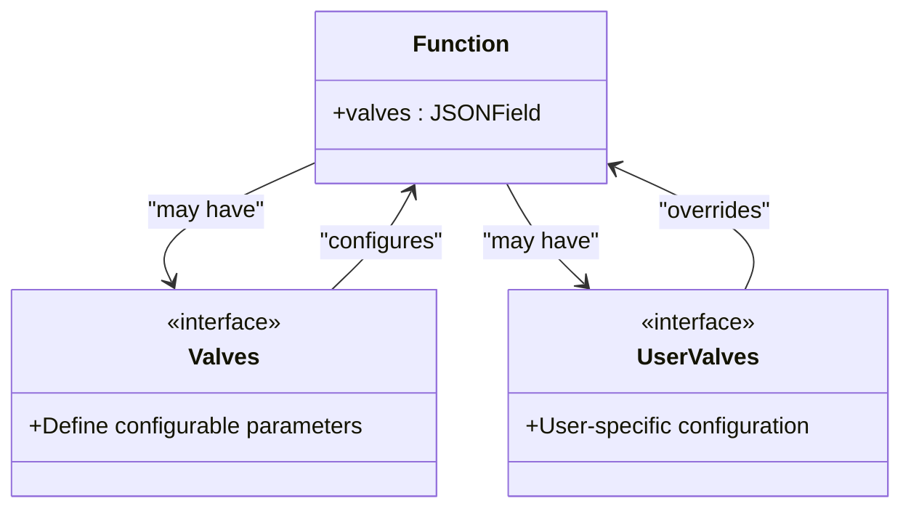

# Functions System

<cite>
**Referenced Files in This Document**   
- [functions.py](file://backend/open_webui/functions.py)
- [models/functions.py](file://backend/open_webui/models/functions.py)
- [routers/functions.py](file://backend/open_webui/routers/functions.py)
- [utils/plugin.py](file://backend/open_webui/utils/plugin.py)
- [index.ts](file://src/lib/apis/functions/index.ts)
- [AddFunctionMenu.svelte](file://src/lib/components/admin/Functions/AddFunctionMenu.svelte)
- [FunctionMenu.svelte](file://src/lib/components/admin/Functions/FunctionMenu.svelte)
</cite>

## Table of Contents
1. [Introduction](#introduction)
2. [Function Definition and Schema](#function-definition-and-schema)
3. [Function Registration Process](#function-registration-process)
4. [Function Execution Flow](#function-execution-flow)
5. [Frontend-Backend Integration](#frontend-backend-integration)
6. [Security and Sandboxing](#security-and-sandboxing)
7. [Error Handling and Debugging](#error-handling-and-debugging)
8. [Valves and Configuration](#valves-and-configuration)
9. [Conclusion](#conclusion)

## Introduction
The Functions System in open-webui enables users to define, register, and execute custom functions within the chat interface. This system supports various function types including pipes, filters, and actions that can be triggered during chat interactions. The architecture integrates frontend components with backend execution logic, providing a flexible framework for extending the platform's capabilities through user-defined code. This documentation details the complete workflow from function definition to execution, including security considerations and integration patterns.

## Function Definition and Schema
The function system in open-webui is built around a well-defined schema that specifies the structure and metadata for custom functions. Each function is stored in the database with specific attributes that define its behavior and properties.

**Diagram sources**
- [models/functions.py](file://backend/open_webui/models/functions.py#L19-L72)

**Section sources**
- [models/functions.py](file://backend/open_webui/models/functions.py#L19-L396)

The function schema includes several key components:
- **id**: Unique identifier for the function (must be a valid Python identifier)
- **user_id**: Identifier of the user who created the function
- **name**: Display name for the function
- **type**: Function type (pipe, filter, action)
- **content**: Python code implementing the function logic
- **meta**: Metadata including description and manifest information
- **valves**: Configuration parameters for the function
- **is_active**: Flag indicating whether the function is enabled
- **is_global**: Flag indicating whether the function is available globally

Function types determine how the function is used within the system:
- **Pipe functions**: Process chat completions and can modify the response
- **Filter functions**: Apply pre-processing or post-processing to chat content
- **Action functions**: Perform specific actions triggered by user interactions

## Function Registration Process
The registration process for functions in open-webui involves several steps from creation to storage in the database. The system provides both direct creation and URL-based loading mechanisms for registering new functions.

**Diagram sources**
- [routers/functions.py](file://backend/open_webui/routers/functions.py#L183-L234)
- [models/functions.py](file://backend/open_webui/models/functions.py#L107-L132)

**Section sources**
- [routers/functions.py](file://backend/open_webui/routers/functions.py#L183-L234)
- [models/functions.py](file://backend/open_webui/models/functions.py#L107-L132)

The registration process follows these key steps:
1. **Validation**: The function ID is validated to ensure it contains only alphanumeric characters and underscores
2. **Content Processing**: Import statements in the function code are replaced with appropriate paths
3. **Module Loading**: The function code is loaded as a Python module and validated
4. **Database Storage**: Function metadata and code are stored in the database
5. **Caching**: The loaded function module is cached for future use

Functions can also be loaded from external URLs, particularly GitHub repositories. The system automatically converts GitHub URLs to raw content URLs and extracts the function name from the URL path. This allows users to import functions directly from public repositories.

## Function Execution Flow
The execution of functions within the open-webui platform is tightly integrated with the chat completion process. When a user submits a message, the system determines if any registered functions should be invoked based on the selected model and function configuration.

**Diagram sources**
- [functions.py](file://backend/open_webui/functions.py#L159-L353)
- [routers/functions.py](file://backend/open_webui/routers/functions.py#L41-L44)

**Section sources**
- [functions.py](file://backend/open_webui/functions.py#L159-L353)

The function execution flow involves:
1. **Model Identification**: The system extracts the function ID from the model name in the chat request
2. **Module Retrieval**: The function module is retrieved from the application state cache
3. **Parameter Preparation**: Execution parameters are prepared, including the request body and user context
4. **Function Invocation**: The function's pipe method is executed with the prepared parameters
5. **Response Handling**: The function response is processed based on its type (string, generator, etc.)
6. **Streaming Support**: For streaming requests, the response is yielded incrementally

The system supports both synchronous and asynchronous function execution. Coroutine functions are awaited, while regular functions are called directly. The response handling accommodates various return types including strings, dictionaries, generators, and async generators.

## Frontend-Backend Integration
The integration between frontend components and backend function execution is facilitated through a well-defined API and component structure. The frontend provides user interfaces for managing functions, while communicating with the backend through REST endpoints.

**Diagram sources**
- [index.ts](file://src/lib/apis/functions/index.ts)
- [routers/functions.py](file://backend/open_webui/routers/functions.py)
- [AddFunctionMenu.svelte](file://src/lib/components/admin/Functions/AddFunctionMenu.svelte)

**Section sources**
- [index.ts](file://src/lib/apis/functions/index.ts)
- [routers/functions.py](file://backend/open_webui/routers/functions.py)
- [AddFunctionMenu.svelte](file://src/lib/components/admin/Functions/AddFunctionMenu.svelte)

Key integration points include:
- **API Endpoints**: The backend exposes REST endpoints for function management operations
- **Frontend Services**: TypeScript services wrap API calls with error handling
- **UI Components**: Svelte components provide interfaces for function administration
- **Event Emission**: The system supports event-driven communication between components

The frontend components provide comprehensive functionality for managing functions:
- **AddFunctionMenu**: Allows users to create new functions or import from URLs
- **FunctionMenu**: Provides context menu options for existing functions (edit, clone, delete, etc.)
- **API Services**: Handle communication with the backend through standardized methods

## Security and Sandboxing
The open-webui platform implements several security measures to protect against potential risks associated with executing user-provided code. While the system allows custom Python code execution, it relies on administrative controls rather than strict sandboxing.

**Diagram sources**
- [utils/plugin.py](file://backend/open_webui/utils/plugin.py#L118-L166)
- [routers/functions.py](file://backend/open_webui/routers/functions.py#L185)

**Section sources**
- [utils/plugin.py](file://backend/open_webui/utils/plugin.py#L118-L166)

Security considerations include:
- **Administrative Access**: Only admin users can create, update, or delete functions
- **Code Validation**: Function IDs are validated to prevent injection attacks
- **Import Rewriting**: Import statements are rewritten to prevent unauthorized module access
- **Dependency Management**: Requirements specified in function frontmatter are installed
- **Error Handling**: Exceptions during function loading disable the function automatically

The system uses temporary files to execute function code, which are immediately deleted after use. Function modules are loaded into isolated namespaces to prevent interference with the main application. However, the system does not implement strict code sandboxing, relying instead on the principle that only trusted administrators can deploy functions.

## Error Handling and Debugging
The functions system includes comprehensive error handling and debugging capabilities to assist developers in identifying and resolving issues with custom functions.

**Diagram sources**
- [functions.py](file://backend/open_webui/functions.py#L313-L316)
- [utils/plugin.py](file://backend/open_webui/utils/plugin.py#L158-L164)

**Section sources**
- [functions.py](file://backend/open_webui/functions.py#L313-L316)
- [utils/plugin.py](file://backend/open_webui/utils/plugin.py#L158-L164)

Error handling occurs at multiple levels:
- **Function Loading**: Errors during module loading result in the function being disabled
- **Execution Time**: Exceptions during function execution are caught and returned as error responses
- **Stream Processing**: Errors in streaming responses are handled gracefully
- **Validation**: Invalid function configurations are rejected during registration

The system logs detailed error information including stack traces, which can be used for debugging. When a function fails to load due to syntax errors or missing dependencies, it is automatically deactivated to prevent repeated failures. The frontend provides error feedback to help users identify and fix issues in their function code.

## Valves and Configuration
Valves provide a configuration mechanism for functions, allowing both global settings and user-specific overrides. This system enables functions to be customized without modifying their core code.

**Diagram sources**
- [routers/functions.py](file://backend/open_webui/routers/functions.py#L398-L411)
- [models/functions.py](file://backend/open_webui/models/functions.py#L102-L104)

**Section sources**
- [routers/functions.py](file://backend/open_webui/routers/functions.py#L398-L411)

The valves system supports two types of configuration:
- **Function Valves**: Global configuration settings that apply to all users
- **User Valves**: User-specific overrides that customize function behavior

Configuration is accessed through dedicated API endpoints:
- GET /functions/id/{id}/valves/spec: Retrieve the configuration schema
- POST /functions/id/{id}/valves/update: Update global valve settings
- GET /functions/id/{id}/valves/user: Retrieve user-specific settings
- POST /functions/id/{id}/valves/user/update: Update user-specific settings

This allows functions to expose configurable parameters that can be adjusted through the UI without requiring code changes. The configuration is validated against Pydantic models to ensure type safety and data integrity.

## Conclusion
The Functions System in open-webui provides a powerful framework for extending the platform's capabilities through custom code. By combining a flexible function schema with robust execution mechanisms and administrative controls, the system enables developers to create sophisticated extensions while maintaining security and stability. The integration between frontend and backend components provides a seamless experience for managing and using functions within chat interactions. While the system relies on administrative trust rather than strict sandboxing, its comprehensive error handling and configuration capabilities make it suitable for deploying custom functionality in controlled environments.