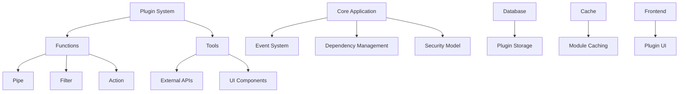
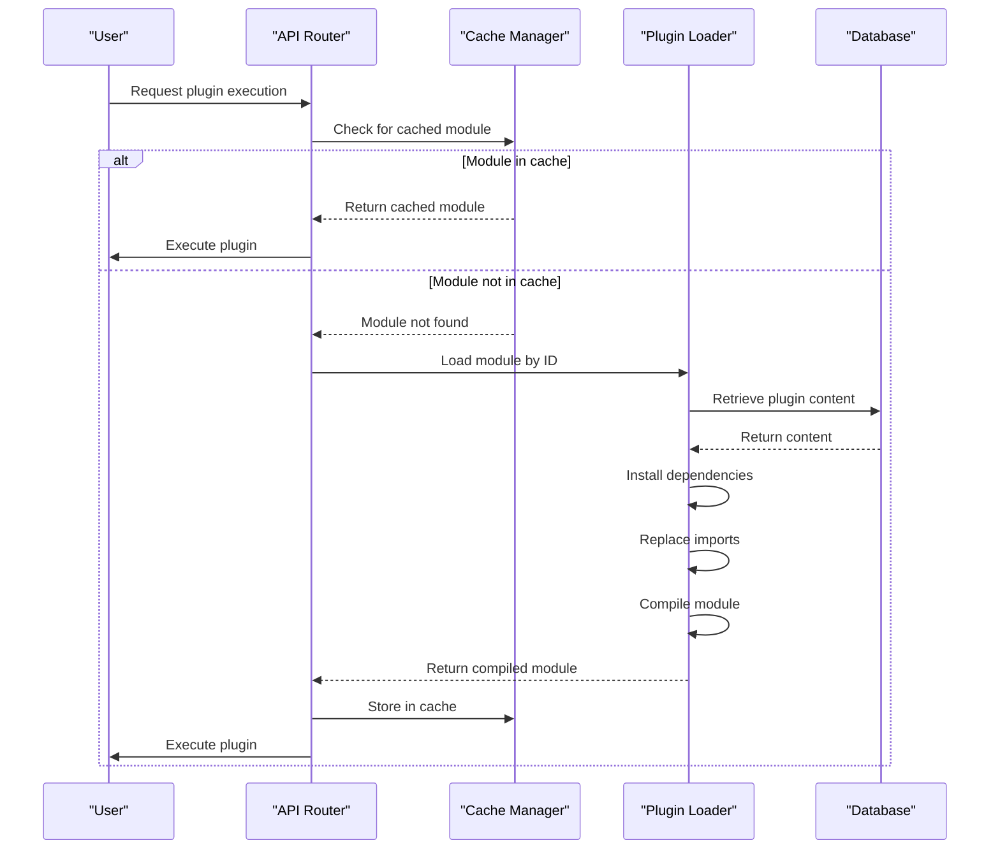
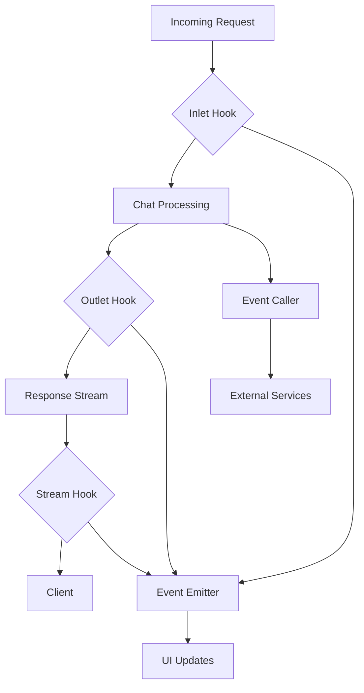
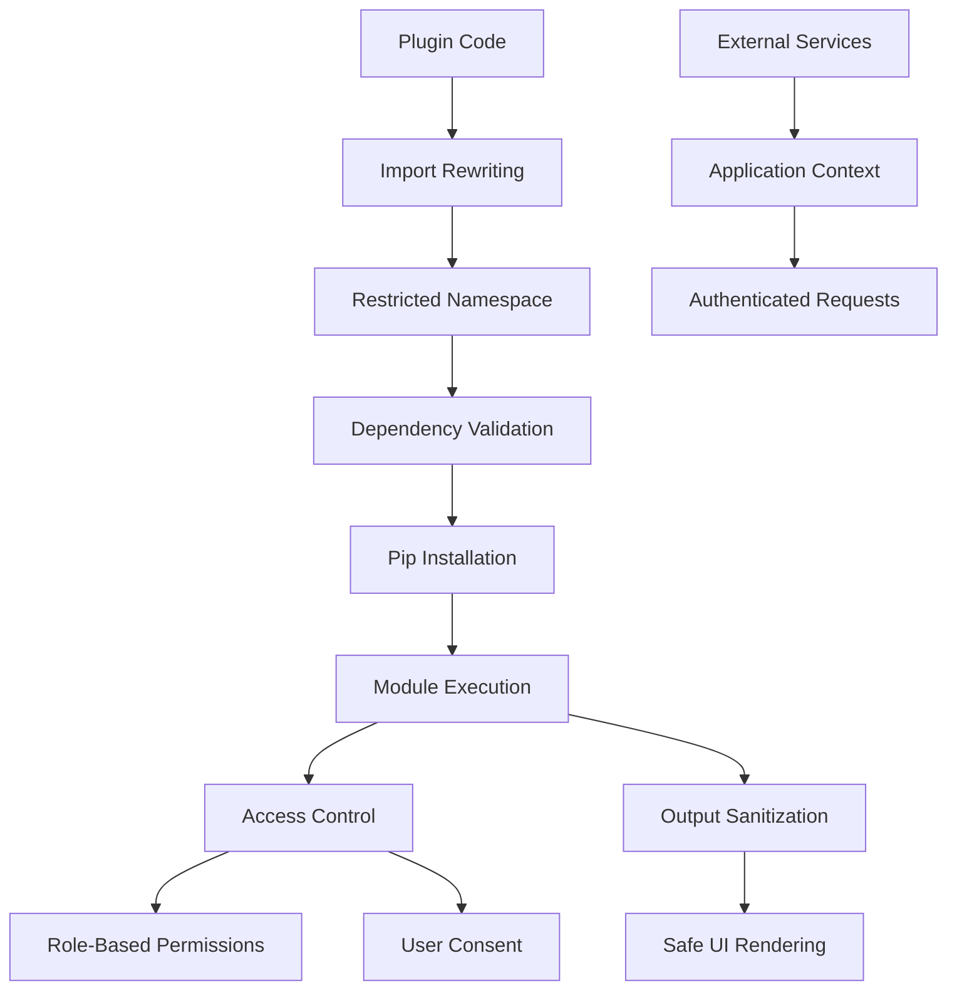

# Plugin Architecture

<cite>
**Referenced Files in This Document**   
- [plugin.py](file://backend/open_webui/utils/plugin.py)
- [functions.py](file://backend/open_webui/functions.py)
- [tools.py](file://backend/open_webui/models/tools.py)
- [functions.py](file://backend/open_webui/routers/functions.py)
- [tools.py](file://backend/open_webui/routers/tools.py)
- [middleware.py](file://backend/open_webui/utils/middleware.py)
- [filter.py](file://backend/open_webui/utils/filter.py)
- [main.py](file://backend/open_webui/main.py)
- [socket/main.py](file://backend/open_webui/socket/main.py)
</cite>

## Table of Contents
1. [Introduction](#introduction)
2. [Plugin System Overview](#plugin-system-overview)
3. [Plugin Lifecycle and Initialization](#plugin-lifecycle-and-initialization)
4. [Event Hooks and API Access](#event-hooks-and-api-access)
5. [Security Model and Isolation](#security-model-and-isolation)
6. [Plugin Development Workflow](#plugin-development-workflow)
7. [Configuration and Error Handling](#configuration-and-error-handling)
8. [Best Practices for Plugin Developers](#best-practices-for-plugin-developers)
9. [Conclusion](#conclusion)

## Introduction
The Open WebUI plugin architecture provides a robust extensibility framework that enables developers to enhance the core application functionality through modular plugins. This document details the underlying plugin system, covering how plugins are loaded, initialized, and interact with the core application. The architecture supports two primary plugin types: functions and tools, each with distinct capabilities and integration patterns. The system is designed with security, performance, and developer experience in mind, providing comprehensive APIs for extending chat functionality, processing pipelines, and user interfaces.

**Section sources**
- [plugin.py](file://backend/open_webui/utils/plugin.py#L1-L313)
- [functions.py](file://backend/open_webui/functions.py#L1-L354)

## Plugin System Overview

The Open WebUI plugin system is built around a modular architecture that supports two primary types of extensions: functions and tools. Functions are Python modules that implement specific processing patterns through classes like Pipe, Filter, and Action, while tools provide external API integrations and UI components. The system uses a dynamic loading mechanism that parses plugin code at runtime, extracts metadata from frontmatter, and manages dependencies automatically.

Plugins are stored in the database and loaded into memory when needed, with caching mechanisms to optimize performance. The core application exposes a comprehensive API for plugin interaction, including event emitters for real-time communication, access to user context, and integration with the chat processing pipeline. The architecture supports both synchronous and asynchronous execution patterns, allowing plugins to perform complex operations including HTTP requests, database queries, and AI model interactions.

**Diagram sources **
- [plugin.py](file://backend/open_webui/utils/plugin.py#L1-L313)
- [functions.py](file://backend/open_webui/functions.py#L1-L354)
- [tools.py](file://backend/open_webui/models/tools.py#L1-L100)

**Section sources**
- [plugin.py](file://backend/open_webui/utils/plugin.py#L1-L313)
- [functions.py](file://backend/open_webui/functions.py#L1-L354)

## Plugin Lifecycle and Initialization

The plugin lifecycle in Open WebUI consists of several distinct phases: loading, initialization, execution, and cleanup. When a plugin is first accessed, the system retrieves its code from the database and processes it through the `load_function_module_by_id` or `load_tool_module_by_id` functions. These functions handle critical initialization tasks including dependency installation, import path replacement, and module compilation.

During initialization, the system extracts frontmatter metadata from the plugin code, which contains configuration information such as required packages, version information, and display properties. The frontmatter is defined using triple quotes at the beginning of the Python file and parsed into a dictionary. Dependencies specified in the requirements field are automatically installed using pip before the plugin is executed.

Plugins are cached in the application state to avoid repeated loading and compilation. The cache is keyed by plugin ID and includes both the compiled module and the original content for change detection. When a plugin is updated, the system compares the new content with the cached version and reloads only if changes are detected. This caching mechanism significantly improves performance for frequently used plugins.

**Diagram sources **
- [plugin.py](file://backend/open_webui/utils/plugin.py#L71-L166)
- [functions.py](file://backend/open_webui/functions.py#L60-L78)
- [main.py](file://backend/open_webui/main.py#L582-L583)

**Section sources**
- [plugin.py](file://backend/open_webui/utils/plugin.py#L71-L166)
- [functions.py](file://backend/open_webui/functions.py#L60-L78)

## Event Hooks and API Access

The Open WebUI plugin system provides a comprehensive set of event hooks that allow plugins to integrate at various points in the application workflow. The primary event system is based on socket.io, with the `get_event_emitter` and `get_event_call` functions providing access to real-time communication channels. Plugins can emit events to update the UI, display status messages, or return file attachments.

For chat processing, the system implements a pipeline with multiple hook points: inlet, outlet, and stream. The inlet hook processes incoming messages before they are sent to the AI model, allowing for input modification, validation, or augmentation. The outlet hook processes responses after they are generated but before they are returned to the user, enabling response modification or enrichment. The stream hook handles streaming responses, allowing plugins to process chunks of text as they are generated.

Plugins have access to a rich set of APIs through the `extra_params` dictionary, which includes references to the request object, user information, chat context, and authentication tokens. This allows plugins to access user-specific data, modify chat state, and make authenticated requests to external services. The system also provides access to utility functions for common operations like file handling, web search, and image generation.

**Diagram sources **
- [socket/main.py](file://backend/open_webui/socket/main.py#L695-L798)
- [middleware.py](file://backend/open_webui/utils/middleware.py#L144-L284)
- [filter.py](file://backend/open_webui/utils/filter.py#L60-L137)

**Section sources**
- [socket/main.py](file://backend/open_webui/socket/main.py#L695-L798)
- [middleware.py](file://backend/open_webui/utils/middleware.py#L144-L284)

## Security Model and Isolation

The Open WebUI plugin system implements a multi-layered security model to protect the application and its users. The primary security mechanism is code isolation through the use of separate Python modules and restricted import paths. When a plugin is loaded, its import statements are rewritten to prevent access to arbitrary system modules, with only approved packages from the open_webui namespace being accessible.

Dependency management is handled through a controlled pip installation process that runs in the application's Python environment. The system validates package requirements from the frontmatter and installs them using configured pip options, preventing the installation of potentially malicious packages. The installation process is logged and can be monitored for suspicious activity.

Access control is enforced through role-based permissions and explicit user consent. Only admin users can create or modify plugins, preventing unauthorized code execution. When plugins access external services, they do so through the application's authentication context rather than exposing credentials directly to the plugin code. The system also implements input validation and output sanitization to prevent code injection and cross-site scripting attacks.

**Diagram sources **
- [plugin.py](file://backend/open_webui/utils/plugin.py#L54-L68)
- [env.py](file://backend/open_webui/env.py#L414-L446)
- [tools.py](file://backend/open_webui/utils/tools.py#L254-L266)

**Section sources**
- [plugin.py](file://backend/open_webui/utils/plugin.py#L54-L68)
- [env.py](file://backend/open_webui/env.py#L414-L446)

## Plugin Development Workflow

The plugin development workflow in Open WebUI is designed to be straightforward and efficient. Developers can create plugins by implementing specific classes in Python modules: Pipe for processing pipelines, Filter for input/output modification, and Action for standalone operations. The development process begins with creating a new plugin through the admin interface or API, where the plugin code, metadata, and configuration are defined.

During development, plugins can be tested in real-time by toggling their active state and observing their behavior in the application. The system provides comprehensive logging through the standard Python logging module, with logs categorized by source for easy debugging. Developers can use the frontmatter to specify required packages, which are automatically installed when the plugin is saved.

For distribution, plugins can be exported as JSON files containing all necessary code and configuration, or shared via GitHub URLs. The import system can fetch plugins directly from GitHub repositories, making it easy to distribute and update plugins. The version control integration allows developers to maintain plugins in external repositories while still using them in the application.

**Section sources**
- [functions.py](file://backend/open_webui/routers/functions.py#L178-L234)
- [tools.py](file://backend/open_webui/routers/tools.py#L244-L333)
- [plugin.py](file://backend/open_webui/utils/plugin.py#L267-L313)

## Configuration and Error Handling

Plugin configuration in Open WebUI is managed through multiple mechanisms, including frontmatter metadata, valve configurations, and user-specific settings. The frontmatter provides static configuration that is parsed when the plugin is loaded, while valves offer dynamic configuration through Pydantic models that define configurable parameters with type validation and default values.

Error handling is implemented through comprehensive exception management and logging. When a plugin encounters an error during execution, it is caught by the system and converted to a structured error response that can be displayed to the user. The system logs detailed error information, including stack traces, to aid in debugging. For critical errors that prevent plugin loading, the system deactivates the plugin and notifies administrators.

The configuration system supports both global and user-specific settings. Global valves apply to all users and are typically managed by administrators, while user valves allow individual users to customize plugin behavior according to their preferences. This dual configuration model provides flexibility while maintaining security and consistency.

**Section sources**
- [functions.py](file://backend/open_webui/routers/functions.py#L374-L459)
- [tools.py](file://backend/open_webui/routers/tools.py#L461-L559)
- [plugin.py](file://backend/open_webui/utils/plugin.py#L109-L113)

## Best Practices for Plugin Developers

When developing plugins for Open WebUI, several best practices should be followed to ensure optimal performance, compatibility, and user experience. First, plugins should be designed to be stateless whenever possible, relying on the provided context parameters rather than maintaining internal state. This improves reliability and makes plugins easier to debug and test.

Performance optimization is critical, especially for plugins that are executed frequently in the chat processing pipeline. Developers should minimize external API calls, implement appropriate caching, and avoid blocking operations in synchronous plugins. For long-running operations, asynchronous execution patterns should be used to prevent UI blocking.

Security should be a primary consideration, with input validation, output sanitization, and proper error handling implemented throughout the plugin code. Dependencies should be explicitly declared in the frontmatter rather than installed programmatically, and only trusted packages should be used. User interface elements should follow the application's design system to ensure a consistent user experience.

Documentation is essential, with clear comments, docstrings, and frontmatter descriptions that explain the plugin's purpose, configuration options, and usage patterns. This helps both end users and other developers understand and use the plugin effectively.

**Section sources**
- [functions.py](file://backend/open_webui/functions.py#L159-L175)
- [middleware.py](file://backend/open_webui/utils/middleware.py#L126-L127)
- [plugin.py](file://backend/open_webui/utils/plugin.py#L51-L52)

## Conclusion

The Open WebUI plugin architecture provides a powerful and flexible framework for extending the application's capabilities. By combining a secure execution environment with comprehensive APIs and a streamlined development workflow, the system enables developers to create rich, interactive extensions that enhance the core functionality. The architecture's focus on performance, security, and usability makes it well-suited for both simple utility plugins and complex integrations with external services. As the ecosystem grows, this foundation will support an expanding range of use cases and applications.