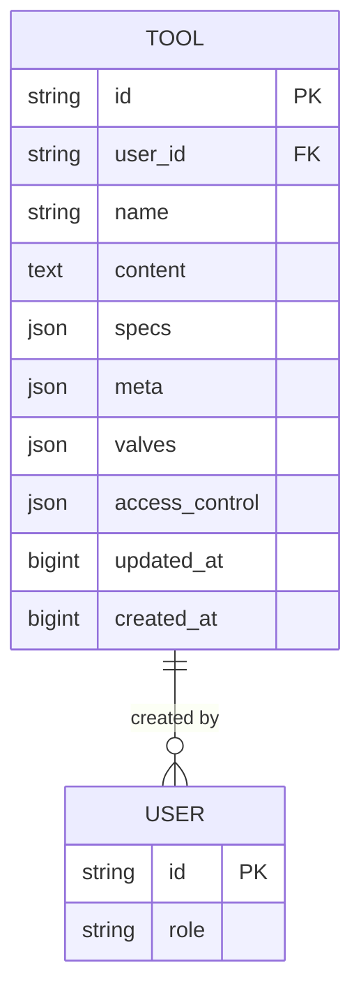
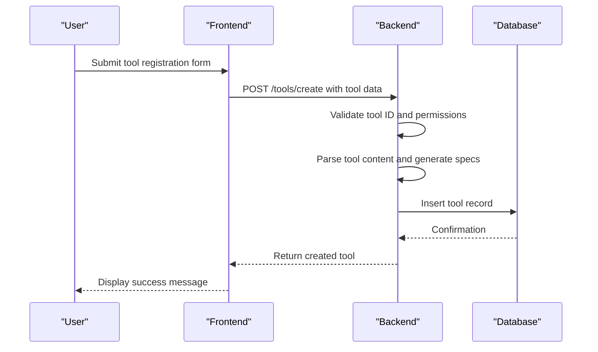
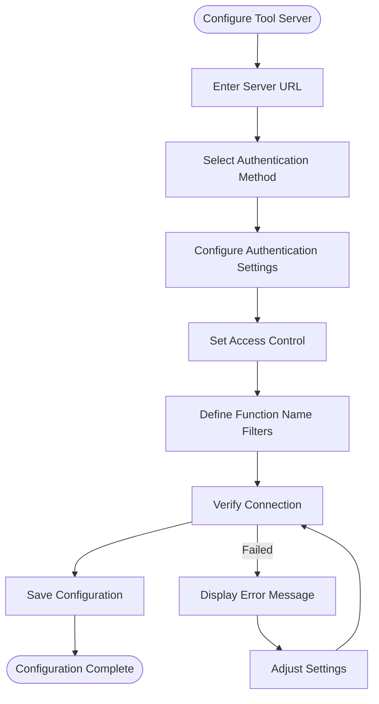
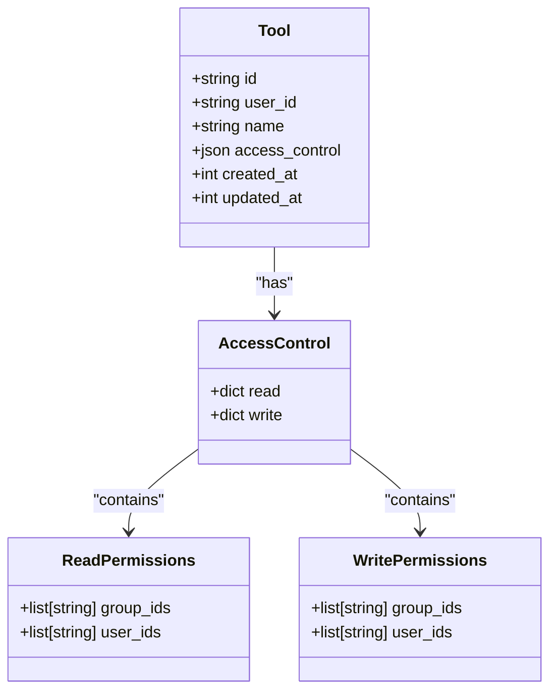
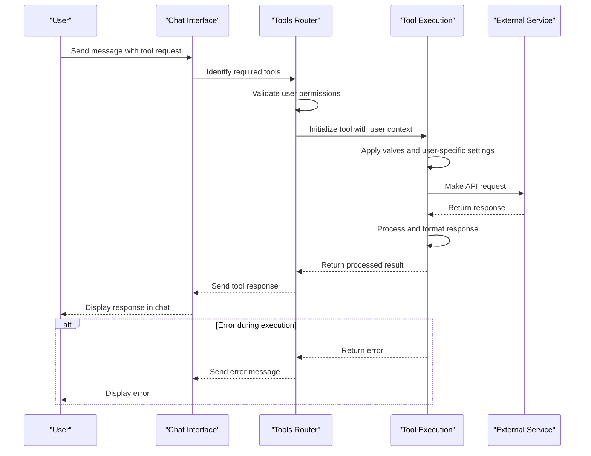

# Tools Framework

<cite>
**Referenced Files in This Document**   
- [tools.py](file://backend/open_webui/models/tools.py)
- [tools.py](file://backend/open_webui/routers/tools.py)
- [tools.py](file://backend/open_webui/utils/tools.py)
- [tavily.py](file://backend/open_webui/retrieval/web/tavily.py)
- [serpapi.py](file://backend/open_webui/retrieval/web/serpapi.py)
- [google_pse.py](file://backend/open_webui/retrieval/web/google_pse.py)
- [config.py](file://backend/open_webui/config.py)
- [configs.py](file://backend/open_webui/routers/configs.py)
</cite>

## Table of Contents
1. [Introduction](#introduction)
2. [Data Model](#data-model)
3. [Tool Registration and Configuration](#tool-registration-and-configuration)
4. [Authentication Methods](#authentication-methods)
5. [External Service Integration](#external-service-integration)
6. [Interaction Flow](#interaction-flow)
7. [Error Handling and Rate Limiting](#error-handling-and-rate-limiting)
8. [Developing New Tool Integrations](#developing-new-tool-integrations)
9. [Conclusion](#conclusion)

## Introduction
The Tools Framework in Open WebUI provides a comprehensive system for integrating external services and APIs into the platform. This framework enables users to extend the platform's capabilities by connecting to third-party services such as search engines, data retrieval systems, and other web APIs. The framework supports both local tool integrations and external tool servers using OpenAPI specifications. It provides robust mechanisms for tool registration, configuration, authentication, and access control, ensuring secure and efficient integration of external services.

**Section sources**
- [tools.py](file://backend/open_webui/models/tools.py#L1-L275)
- [tools.py](file://backend/open_webui/routers/tools.py#L1-L648)

## Data Model
The Tools Framework uses a structured data model to store and manage tool configurations. The primary data structure is the Tool class, which contains essential fields for tool identification, configuration, and metadata.



The Tool model includes the following key fields:
- **id**: Unique identifier for the tool
- **user_id**: Identifier of the user who created the tool
- **name**: Display name of the tool
- **content**: Python code or configuration for the tool
- **specs**: JSON representation of the tool's function specifications in OpenAI format
- **meta**: Metadata including description and manifest information
- **valves**: Configuration settings for the tool
- **access_control**: Rules defining who can access and modify the tool

The access_control field supports three modes:
- **None**: Public access, available to all users with the "user" role
- **{}**: Private access, restricted exclusively to the owner
- **Custom permissions**: Specific access control for reading and writing, with group or user-level restrictions

**Diagram sources**
- [tools.py](file://backend/open_webui/models/tools.py#L24-L54)

**Section sources**
- [tools.py](file://backend/open_webui/models/tools.py#L24-L54)

## Tool Registration and Configuration
The Tools Framework provides multiple methods for registering and configuring tools within the platform. Tools can be registered through the API, imported from external URLs, or configured as external tool servers.

### Local Tool Registration
Local tools are registered through the `/tools/create` endpoint, which accepts a ToolForm containing the tool's ID, name, content, and metadata. The registration process validates the tool ID, ensures it's not already taken, and stores the tool in the database with its specifications automatically generated from the provided code.



**Diagram sources**
- [tools.py](file://backend/open_webui/routers/tools.py#L270-L333)

### External Tool Server Configuration
External tool servers are configured through the platform's settings interface, allowing administrators to connect to OpenAPI or MCP (Model Context Protocol) servers. The configuration includes the server URL, authentication method, and access control settings.

The configuration process involves:
1. Specifying the server URL and type (OpenAPI or MCP)
2. Configuring authentication (bearer token, OAuth 2.1, or session-based)
3. Setting access control rules
4. Defining function name filters to control which endpoints are exposed
5. Verifying the connection before saving



**Diagram sources**
- [configs.py](file://backend/open_webui/routers/configs.py#L218-L349)
- [config.py](file://backend/open_webui/config.py#L154-L190)

**Section sources**
- [configs.py](file://backend/open_webui/routers/configs.py#L154-L190)
- [config.py](file://backend/open_webui/config.py#L154-L190)

## Authentication Methods
The Tools Framework supports multiple authentication methods for securing access to tools and external services. These methods ensure that only authorized users can access and use specific tools.

### Tool-Level Authentication
Tools can be configured with different access levels through the access_control field:
- **Public**: Accessible to all users
- **Private**: Restricted to the tool owner
- **Group-based**: Accessible to specific user groups
- **User-specific**: Accessible to specific users



**Diagram sources**
- [tools.py](file://backend/open_webui/models/tools.py#L35-L51)

### External Service Authentication
When connecting to external services, the framework supports several authentication methods:

**Bearer Token Authentication**: Uses API keys in the Authorization header
```python
headers["Authorization"] = f"Bearer {tool_server_connection.get('key', '')}"
```

**OAuth 2.1 Authentication**: Supports OAuth flows for MCP servers, with token management through the OAuth client manager
```python
session_token = await request.app.state.oauth_client_manager.get_oauth_token(user.id, f"mcp:{server_id}")
```

**Session-based Authentication**: Uses the current user's session token
```python
headers["Authorization"] = f"Bearer {request.state.token.credentials}"
```

**System OAuth Authentication**: Uses system-managed OAuth tokens
```python
headers["Authorization"] = f"Bearer {oauth_token.get('access_token', '')}"
```

The authentication configuration is stored in the TOOL_SERVER_CONNECTIONS setting, which includes the auth_type, key (for bearer tokens), and additional headers as needed.

**Section sources**
- [tools.py](file://backend/open_webui/routers/tools.py#L169-L195)
- [tools.py](file://backend/open_webui/utils/tools.py#L651-L658)

## External Service Integration
The Tools Framework provides robust integration with external services through dedicated modules for popular APIs such as Tavily, SerpAPI, and Google PSE. These integrations follow a consistent pattern of API interaction, parameter handling, and result processing.

### Tavily Integration
The Tavily integration allows users to perform web searches through the Tavily Search API. The integration is implemented in the `search_tavily` function, which handles the API request and response processing.

```python
def search_tavily(
    api_key: str,
    query: str,
    count: int,
    filter_list: Optional[list[str]] = None,
) -> list[SearchResult]:
    url = "https://api.tavily.com/search"
    headers = {
        "Content-Type": "application/json",
        "Authorization": f"Bearer {api_key}",
    }
    data = {"query": query, "max_results": count}
    response = requests.post(url, headers=headers, json=data)
    response.raise_for_status()
    
    json_response = response.json()
    results = json_response.get("results", [])
    if filter_list:
        results = get_filtered_results(results, filter_list)
    
    return [
        SearchResult(
            link=result["url"],
            title=result.get("title", ""),
            snippet=result.get("content"),
        )
        for result in results
    ]
```

Key features of the Tavily integration:
- Uses bearer token authentication with the API key
- Supports result filtering based on domain or IP address
- Returns results in a standardized SearchResult format
- Handles HTTP errors and raises appropriate exceptions

**Section sources**
- [tavily.py](file://backend/open_webui/retrieval/web/tavily.py#L12-L52)

### SerpAPI Integration
The SerpAPI integration provides access to various search engines through the SerpAPI service. The implementation supports multiple search engines and handles query parameters appropriately.

```python
def search_serpapi(
    api_key: str,
    engine: str,
    query: str,
    count: int,
    filter_list: Optional[list[str]] = None,
) -> list[SearchResult]:
    url = "https://serpapi.com/search"
    engine = engine or "google"
    payload = {"engine": engine, "q": query, "api_key": api_key}
    url = f"{url}?{urlencode(payload)}"
    response = requests.request("GET", url)
    json_response = response.json()
    
    results = sorted(
        json_response.get("organic_results", []), key=lambda x: x.get("position", 0)
    )
    if filter_list:
        results = get_filtered_results(results, filter_list)
    return [
        SearchResult(
            link=result["link"],
            title=result.get("title"),
            snippet=result.get("snippet"),
        )
        for result in results[:count]
    ]
```

Key features of the SerpAPI integration:
- Supports multiple search engines (Google, Bing, etc.)
- Uses query parameters for API configuration
- Sorts results by position
- Implements result filtering
- Returns a limited number of results based on the count parameter

**Section sources**
- [serpapi.py](file://backend/open_webui/retrieval/web/serpapi.py#L13-L51)

### Google PSE Integration
The Google Programmable Search Engine (PSE) integration handles pagination and rate limiting to retrieve search results. This integration is designed to work within Google's API constraints.

```python
def search_google_pse(
    api_key: str,
    search_engine_id: str,
    query: str,
    count: int,
    filter_list: Optional[list[str]] = None,
    referer: Optional[str] = None,
) -> list[SearchResult]:
    url = "https://www.googleapis.com/customsearch/v1"
    headers = {"Content-Type": "application/json"}
    if referer:
        headers["Referer"] = referer
    
    all_results = []
    start_index = 1
    
    while count > 0:
        num_results_this_page = min(count, 10)
        params = {
            "cx": search_engine_id,
            "q": query,
            "key": api_key,
            "num": num_results_this_page,
            "start": start_index,
        }
        response = requests.request("GET", url, headers=headers, params=params)
        response.raise_for_status()
        json_response = response.json()
        results = json_response.get("items", [])
        if results:
            all_results.extend(results)
            count -= len(results)
            start_index += 10
        else:
            break
    
    if filter_list:
        all_results = get_filtered_results(all_results, filter_list)
    
    return [
        SearchResult(
            link=result["link"],
            title=result.get("title"),
            snippet=result.get("snippet"),
        )
        for result in all_results
    ]
```

Key features of the Google PSE integration:
- Handles pagination automatically (Google PSE returns max 10 results per page)
- Manages start index for pagination
- Supports referer header for API quota management
- Implements result filtering
- Continues fetching until the requested count is reached or no more results are available

**Section sources**
- [google_pse.py](file://backend/open_webui/retrieval/web/google_pse.py#L12-L75)

## Interaction Flow
The interaction flow between the chat interface and external tools follows a structured process that ensures reliable execution and proper response handling.



The flow begins when a user sends a message that requires tool execution. The system identifies which tools are needed based on the message content and the available tool specifications. Before executing any tool, the system validates that the user has the necessary permissions to access and use the requested tool.

Once permission is confirmed, the tool is initialized with the user's context, including any user-specific valves or settings. The tool then makes the appropriate API request to the external service, handling authentication and parameter formatting.

Upon receiving the response from the external service, the tool processes the data, applying any necessary transformations or filters. The processed result is then returned to the router, which formats it for display in the chat interface.

**Diagram sources**
- [tools.py](file://backend/open_webui/routers/tools.py#L54-L648)
- [tools.py](file://backend/open_webui/utils/tools.py#L109-L322)

**Section sources**
- [tools.py](file://backend/open_webui/routers/tools.py#L54-L648)
- [tools.py](file://backend/open_webui/utils/tools.py#L109-L322)

## Error Handling and Rate Limiting
The Tools Framework implements comprehensive error handling and rate limiting mechanisms to ensure reliable operation and prevent abuse of external services.

### Error Handling
The framework uses a consistent error handling approach across all tool integrations:

1. **HTTP Error Handling**: All HTTP requests include proper error checking using `raise_for_status()` or equivalent methods
2. **Exception Handling**: Try-catch blocks wrap critical operations to prevent crashes
3. **Logging**: Detailed logging of errors for debugging and monitoring
4. **User Feedback**: Clear error messages returned to users when tool execution fails

```python
try:
    response = requests.post(url, headers=headers, json=data)
    response.raise_for_status()
    json_response = response.json()
except requests.exceptions.RequestException as e:
    log.exception(f"Error connecting to external service: {e}")
    raise HTTPException(status_code=500, detail="Failed to connect to external service")
except json.JSONDecodeError as e:
    log.exception(f"Error parsing response: {e}")
    raise HTTPException(status_code=500, detail="Invalid response from external service")
```

### Rate Limiting
The framework addresses rate limiting through several mechanisms:

1. **Configuration Settings**: Timeout settings for HTTP requests to prevent hanging
```python
timeout = aiohttp.ClientTimeout(total=AIOHTTP_CLIENT_TIMEOUT_TOOL_SERVER_DATA)
```

2. **Retry Logic**: Automatic retries for transient failures
3. **Caching**: Results caching to reduce redundant API calls
4. **Pagination Handling**: Proper handling of API pagination to avoid exceeding limits

For Google PSE specifically, the integration handles the 10-results-per-page limitation by implementing automatic pagination:

```python
while count > 0:
    num_results_this_page = min(count, 10)  # Respect Google's 10-result limit
    # ... make request ...
    start_index += 10  # Increment for next page
```

### Result Filtering
The framework includes a robust result filtering system to enhance security and relevance:

```python
def get_filtered_results(results, filter_list):
    if not filter_list:
        return results
        
    filtered_results = []
    for result in results:
        url = result.get("url") or result.get("link", "") or result.get("href", "")
        if not validators.url(url):
            continue
            
        domain = urlparse(url).netloc
        if not domain:
            continue
            
        hostnames = [domain]
        try:
            ipv4_addresses, ipv6_addresses = resolve_hostname(domain)
            hostnames.extend(ipv4_addresses)
            hostnames.extend(ipv6_addresses)
        except Exception:
            pass
            
        if is_string_allowed(hostnames, filter_list):
            filtered_results.append(result)
            
    return filtered_results
```

This filtering system:
- Validates URLs to ensure they are well-formed
- Extracts domains from URLs
- Resolves domains to IP addresses for comprehensive filtering
- Applies allow/deny lists to filter results based on hostname or IP
- Returns only approved results

**Section sources**
- [google_pse.py](file://backend/open_webui/retrieval/web/google_pse.py#L42-L63)
- [main.py](file://backend/open_webui/retrieval/web/main.py#L12-L40)
- [tools.py](file://backend/open_webui/utils/tools.py#L590-L637)

## Developing New Tool Integrations
Developing new tool integrations for the Open WebUI platform follows a standardized process that ensures consistency and reliability across all tools.

### Creating Local Tools
To create a new local tool, developers need to:

1. Create a Python module with the tool's functionality
2. Define functions with proper type hints and docstrings
3. Include metadata in the module's docstring (frontmatter)
4. Register the tool through the API or UI

The framework automatically converts Python functions to OpenAI-compatible specifications using type hints and docstrings:

```python
def convert_function_to_pydantic_model(func: Callable) -> type[BaseModel]:
    type_hints = get_type_hints(func)
    signature = inspect.signature(func)
    parameters = signature.parameters
    
    docstring = func.__doc__
    function_description = parse_description(docstring)
    function_param_descriptions = parse_docstring(docstring)
    
    field_defs = {}
    for name, param in parameters.items():
        type_hint = type_hints.get(name, Any)
        default_value = param.default if param.default is not param.empty else ...
        
        param_description = function_param_descriptions.get(name, None)
        
        if param_description:
            field_defs[name] = (
                type_hint,
                Field(default_value, description=param_description),
            )
        else:
            field_defs[name] = type_hint, default_value
    
    model = create_model(func.__name__, **field_defs)
    model.__doc__ = function_description
    
    return model
```

### Integrating External APIs
For external API integrations, follow these steps:

1. Create a dedicated module in the appropriate directory (e.g., `retrieval/web/`)
2. Implement a function that accepts API credentials, query parameters, and configuration
3. Handle authentication according to the API's requirements
4. Process the API response into the standardized SearchResult format
5. Implement error handling and logging
6. Add result filtering if applicable

Example template for a new API integration:

```python
def search_external_api(
    api_key: str,
    query: str,
    count: int,
    filter_list: Optional[list[str]] = None,
    **kwargs
) -> list[SearchResult]:
    """
    Search using external API and return results as SearchResult objects.
    
    Args:
        api_key (str): API key for authentication
        query (str): Search query
        count (int): Maximum number of results to return
        filter_list (Optional[list[str]]): List of domains to filter results
        **kwargs: Additional API-specific parameters
    
    Returns:
        list[SearchResult]: List of search results
    """
    url = "https://api.external-service.com/search"
    headers = {
        "Content-Type": "application/json",
        "Authorization": f"Bearer {api_key}",
    }
    
    params = {
        "query": query,
        "limit": count,
        **kwargs
    }
    
    try:
        response = requests.get(url, headers=headers, params=params)
        response.raise_for_status()
        json_response = response.json()
        
        results = json_response.get("results", [])
        if filter_list:
            results = get_filtered_results(results, filter_list)
        
        return [
            SearchResult(
                link=result["url"],
                title=result.get("title", ""),
                snippet=result.get("description"),
            )
            for result in results[:count]
        ]
    except Exception as e:
        log.exception(f"Error connecting to external API: {e}")
        raise HTTPException(status_code=500, detail="Failed to connect to external service")
```

### Testing Tool Integrations
When developing new tool integrations, follow these testing practices:

1. **Unit Testing**: Test individual functions with mock data
2. **Integration Testing**: Test the complete flow with actual API calls (use test credentials)
3. **Error Scenario Testing**: Verify proper handling of network errors, authentication failures, and invalid responses
4. **Performance Testing**: Ensure the tool responds within acceptable time limits
5. **Security Testing**: Verify that user input is properly sanitized and that authentication is secure

The platform provides testing endpoints and utilities to facilitate development and debugging of new tool integrations.

**Section sources**
- [tools.py](file://backend/open_webui/utils/tools.py#L380-L448)
- [tools.py](file://backend/open_webui/utils/tools.py#L54-L92)

## Conclusion
The Tools Framework in Open WebUI provides a comprehensive and flexible system for integrating external services and APIs into the platform. By supporting both local tool development and external tool server connections, the framework enables users to extend the platform's capabilities in numerous ways. The robust authentication, access control, and error handling mechanisms ensure secure and reliable operation, while the standardized integration patterns make it easy to develop new tool integrations. With support for popular services like Tavily, SerpAPI, and Google PSE, the framework demonstrates its versatility and practical utility in real-world applications.