# API Clients

<cite>
**Referenced Files in This Document**   
- [index.ts](file://src/lib/apis/index.ts)
- [chats/index.ts](file://src/lib/apis/chats/index.ts)
- [users/index.ts](file://src/lib/apis/users/index.ts)
- [models/index.ts](file://src/lib/apis/models/index.ts)
- [auths/index.ts](file://src/lib/apis/auths/index.ts)
- [folders/index.ts](file://src/lib/apis/folders/index.ts)
- [functions/index.ts](file://src/lib/apis/functions/index.ts)
- [channels/index.ts](file://src/lib/apis/channels/index.ts)
- [configs/index.ts](file://src/lib/apis/configs/index.ts)
- [tools/index.ts](file://src/lib/apis/tools/index.ts)
- [utils/index.ts](file://src/lib/apis/utils/index.ts)
- [streaming/index.ts](file://src/lib/apis/streaming/index.ts)
- [constants.ts](file://src/lib/constants.ts)
- [index.ts](file://src/lib/stores/index.ts)
</cite>

## Table of Contents
1. [Introduction](#introduction)
2. [Project Structure](#project-structure)
3. [Core Components](#core-components)
4. [Architecture Overview](#architecture-overview)
5. [Detailed Component Analysis](#detailed-component-analysis)
6. [Dependency Analysis](#dependency-analysis)
7. [Performance Considerations](#performance-considerations)
8. [Troubleshooting Guide](#troubleshooting-guide)
9. [Conclusion](#conclusion)

## Introduction
The open-webui frontend implements a modular API client architecture in the `src/lib/apis` directory, where each subdirectory corresponds to a backend service such as chats, users, models, and others. This documentation provides a comprehensive overview of the API client system, detailing how TypeScript interfaces define request/response schemas for type safety, how HTTP methods are implemented, and how error handling patterns are standardized across all clients. The documentation also covers the centralized API configuration in `src/lib/apis/index.ts`, including base URL management, authentication token injection, and request interceptors. Special attention is given to real-time updates through WebSocket integration and state synchronization with Svelte stores. Guidance is provided for extending the API client system for new backend endpoints.

## Project Structure
The API clients in open-webui follow a modular structure where each backend service has its corresponding directory in `src/lib/apis`. Each directory contains an `index.ts` file that exports functions for interacting with the backend service. The structure promotes separation of concerns and makes it easy to locate and modify code related to specific services. The API clients use TypeScript interfaces to define request and response schemas, ensuring type safety throughout the application. The centralized configuration in `src/lib/apis/index.ts` manages base URLs and authentication tokens, while utility functions handle common tasks like error parsing and response formatting.

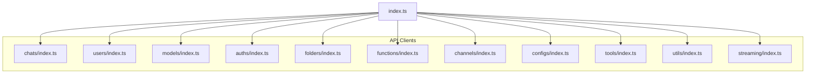

**Diagram sources** 
- [index.ts](file://src/lib/apis/index.ts)
- [chats/index.ts](file://src/lib/apis/chats/index.ts)
- [users/index.ts](file://src/lib/apis/users/index.ts)
- [models/index.ts](file://src/lib/apis/models/index.ts)
- [auths/index.ts](file://src/lib/apis/auths/index.ts)
- [folders/index.ts](file://src/lib/apis/folders/index.ts)
- [functions/index.ts](file://src/lib/apis/functions/index.ts)
- [channels/index.ts](file://src/lib/apis/channels/index.ts)
- [configs/index.ts](file://src/lib/apis/configs/index.ts)
- [tools/index.ts](file://src/lib/apis/tools/index.ts)
- [utils/index.ts](file://src/lib/apis/utils/index.ts)
- [streaming/index.ts](file://src/lib/apis/streaming/index.ts)

**Section sources**
- [index.ts](file://src/lib/apis/index.ts)

## Core Components
The core components of the API client system include the centralized configuration in `src/lib/apis/index.ts`, which manages base URLs and authentication tokens, and the individual API clients in subdirectories like `chats`, `users`, and `models`. Each API client exports functions that correspond to HTTP methods for interacting with the backend service. TypeScript interfaces are used to define request and response schemas, ensuring type safety. Error handling is standardized across all clients, with common patterns for catching and propagating errors. The API clients coordinate with Svelte stores for state synchronization, ensuring that the UI reflects the current state of the application.

**Section sources**
- [index.ts](file://src/lib/apis/index.ts)
- [chats/index.ts](file://src/lib/apis/chats/index.ts)
- [users/index.ts](file://src/lib/apis/users/index.ts)
- [models/index.ts](file://src/lib/apis/models/index.ts)

## Architecture Overview
The API client architecture in open-webui is designed to be modular and maintainable. Each backend service has its corresponding directory in `src/lib/apis`, with an `index.ts` file that exports functions for interacting with the service. The centralized configuration in `src/lib/apis/index.ts` manages base URLs and authentication tokens, ensuring consistency across all API calls. The API clients use TypeScript interfaces to define request and response schemas, providing type safety and improving developer experience. Error handling is standardized, with common patterns for catching and propagating errors. The API clients coordinate with Svelte stores for state synchronization, ensuring that the UI reflects the current state of the application. Real-time updates are handled through WebSocket integration, allowing the application to respond to changes in the backend state.

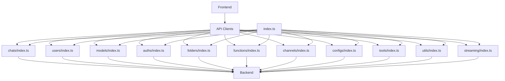

**Diagram sources** 
- [index.ts](file://src/lib/apis/index.ts)
- [chats/index.ts](file://src/lib/apis/chats/index.ts)
- [users/index.ts](file://src/lib/apis/users/index.ts)
- [models/index.ts](file://src/lib/apis/models/index.ts)
- [auths/index.ts](file://src/lib/apis/auths/index.ts)
- [folders/index.ts](file://src/lib/apis/folders/index.ts)
- [functions/index.ts](file://src/lib/apis/functions/index.ts)
- [channels/index.ts](file://src/lib/apis/channels/index.ts)
- [configs/index.ts](file://src/lib/apis/configs/index.ts)
- [tools/index.ts](file://src/lib/apis/tools/index.ts)
- [utils/index.ts](file://src/lib/apis/utils/index.ts)
- [streaming/index.ts](file://src/lib/apis/streaming/index.ts)

## Detailed Component Analysis

### Chats API Client
The chats API client in `src/lib/apis/chats/index.ts` handles CRUD operations for chat conversations. It exports functions for creating new chats, retrieving chat lists, getting chat details by ID, and managing chat metadata like pinning and sharing. The client uses TypeScript interfaces to define request and response schemas, ensuring type safety. For example, the `createNewChat` function takes a token, chat object, and folder ID as parameters, and returns a promise that resolves to the created chat. The client also handles error cases, catching and propagating errors to the caller.

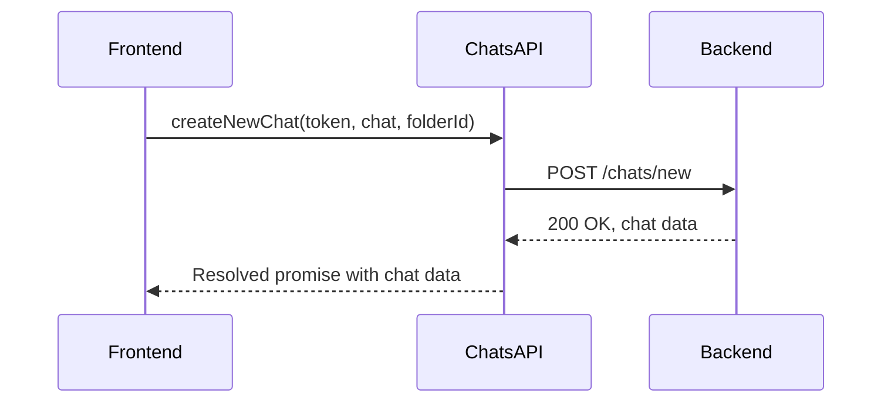

**Diagram sources** 
- [chats/index.ts](file://src/lib/apis/chats/index.ts)

**Section sources**
- [chats/index.ts](file://src/lib/apis/chats/index.ts)

### Users API Client
The users API client in `src/lib/apis/users/index.ts` manages authentication and profile updates. It exports functions for getting user details, updating user settings, and managing user roles. The client uses TypeScript interfaces to define request and response schemas, ensuring type safety. For example, the `getUserSettings` function takes a token as a parameter and returns a promise that resolves to the user's settings. The client also handles error cases, catching and propagating errors to the caller.

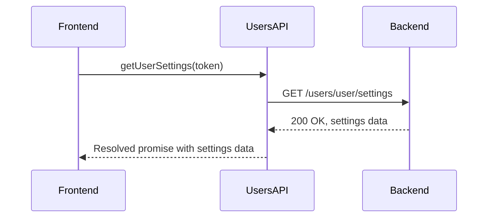

**Diagram sources** 
- [users/index.ts](file://src/lib/apis/users/index.ts)

**Section sources**
- [users/index.ts](file://src/lib/apis/users/index.ts)

### Models API Client
The models API client in `src/lib/apis/models/index.ts` handles operations related to AI models. It exports functions for getting model lists, creating new models, and updating model configurations. The client uses TypeScript interfaces to define request and response schemas, ensuring type safety. For example, the `getModelItems` function takes parameters like query, view option, and selected tag, and returns a promise that resolves to a list of models. The client also handles error cases, catching and propagating errors to the caller.

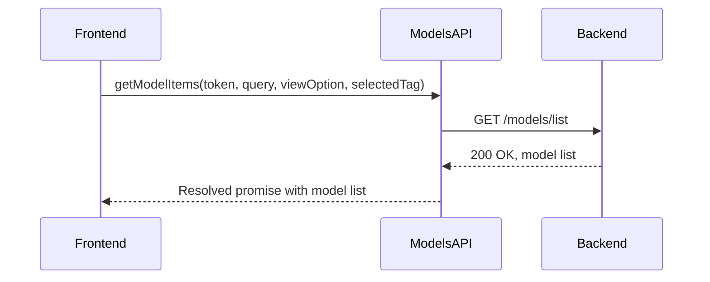

**Diagram sources** 
- [models/index.ts](file://src/lib/apis/models/index.ts)

**Section sources**
- [models/index.ts](file://src/lib/apis/models/index.ts)

### Authentication API Client
The authentication API client in `src/lib/apis/auths/index.ts` handles user authentication and session management. It exports functions for user sign-in, sign-up, and sign-out, as well as for managing API keys. The client uses TypeScript interfaces to define request and response schemas, ensuring type safety. For example, the `userSignIn` function takes an email and password as parameters, and returns a promise that resolves to the user's session data. The client also handles error cases, catching and propagating errors to the caller.

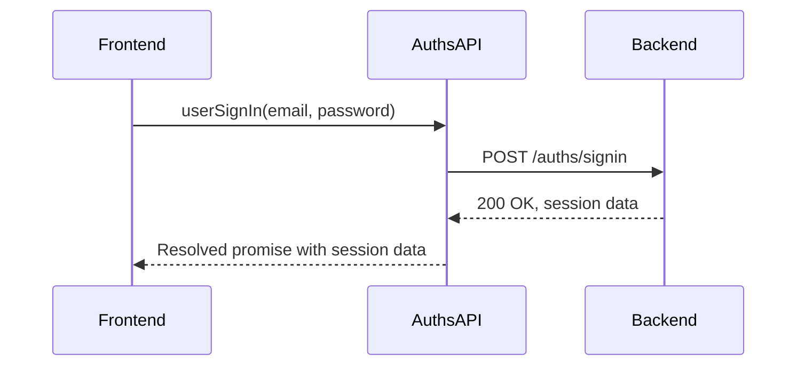

**Diagram sources** 
- [auths/index.ts](file://src/lib/apis/auths/index.ts)

**Section sources**
- [auths/index.ts](file://src/lib/apis/auths/index.ts)

### Folders API Client
The folders API client in `src/lib/apis/folders/index.ts` manages folder operations for organizing chats and other content. It exports functions for creating new folders, retrieving folder lists, and updating folder metadata. The client uses TypeScript interfaces to define request and response schemas, ensuring type safety. For example, the `createNewFolder` function takes a token and folder form as parameters, and returns a promise that resolves to the created folder. The client also handles error cases, catching and propagating errors to the caller.

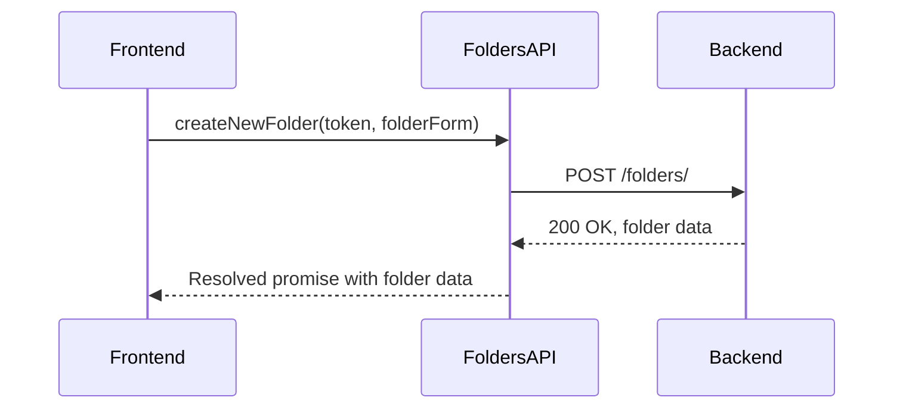

**Diagram sources** 
- [folders/index.ts](file://src/lib/apis/folders/index.ts)

**Section sources**
- [folders/index.ts](file://src/lib/apis/folders/index.ts)

### Functions API Client
The functions API client in `src/lib/apis/functions/index.ts` handles operations related to custom functions. It exports functions for creating new functions, retrieving function lists, and updating function configurations. The client uses TypeScript interfaces to define request and response schemas, ensuring type safety. For example, the `createNewFunction` function takes a token and function object as parameters, and returns a promise that resolves to the created function. The client also handles error cases, catching and propagating errors to the caller.

**Diagram sources** 
- [functions/index.ts](file://src/lib/apis/functions/index.ts)

**Section sources**
- [functions/index.ts](file://src/lib/apis/functions/index.ts)

### Channels API Client
The channels API client in `src/lib/apis/channels/index.ts` manages operations related to communication channels. It exports functions for creating new channels, retrieving channel lists, and managing channel members. The client uses TypeScript interfaces to define request and response schemas, ensuring type safety. For example, the `createNewChannel` function takes a token and channel object as parameters, and returns a promise that resolves to the created channel. The client also handles error cases, catching and propagating errors to the caller.

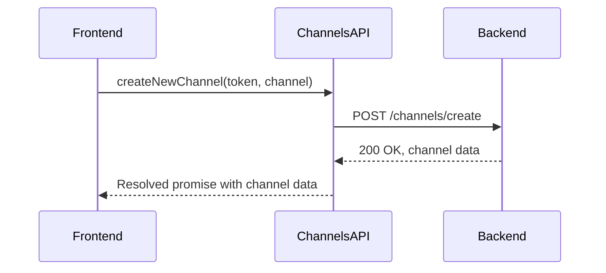

**Diagram sources** 
- [channels/index.ts](file://src/lib/apis/channels/index.ts)

**Section sources**
- [channels/index.ts](file://src/lib/apis/channels/index.ts)

### Configs API Client
The configs API client in `src/lib/apis/configs/index.ts` handles operations related to application configuration. It exports functions for importing and exporting configurations, managing tool server connections, and setting code execution configurations. The client uses TypeScript interfaces to define request and response schemas, ensuring type safety. For example, the `importConfig` function takes a token and configuration object as parameters, and returns a promise that resolves to the imported configuration. The client also handles error cases, catching and propagating errors to the caller.

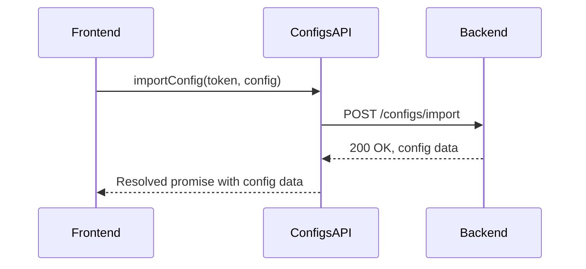

**Diagram sources** 
- [configs/index.ts](file://src/lib/apis/configs/index.ts)

**Section sources**
- [configs/index.ts](file://src/lib/apis/configs/index.ts)

### Tools API Client
The tools API client in `src/lib/apis/tools/index.ts` manages operations related to external tools. It exports functions for creating new tools, retrieving tool lists, and updating tool configurations. The client uses TypeScript interfaces to define request and response schemas, ensuring type safety. For example, the `createNewTool` function takes a token and tool object as parameters, and returns a promise that resolves to the created tool. The client also handles error cases, catching and propagating errors to the caller.

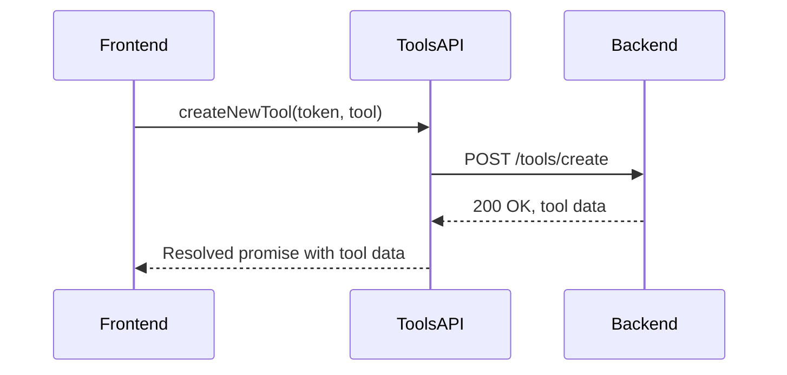

**Diagram sources** 
- [tools/index.ts](file://src/lib/apis/tools/index.ts)

**Section sources**
- [tools/index.ts](file://src/lib/apis/tools/index.ts)

### Utils API Client
The utils API client in `src/lib/apis/utils/index.ts` provides utility functions for common tasks. It exports functions for executing code, formatting Python code, and downloading chat transcripts as PDFs. The client uses TypeScript interfaces to define request and response schemas, ensuring type safety. For example, the `executeCode` function takes a token and code string as parameters, and returns a promise that resolves to the execution result. The client also handles error cases, catching and propagating errors to the caller.

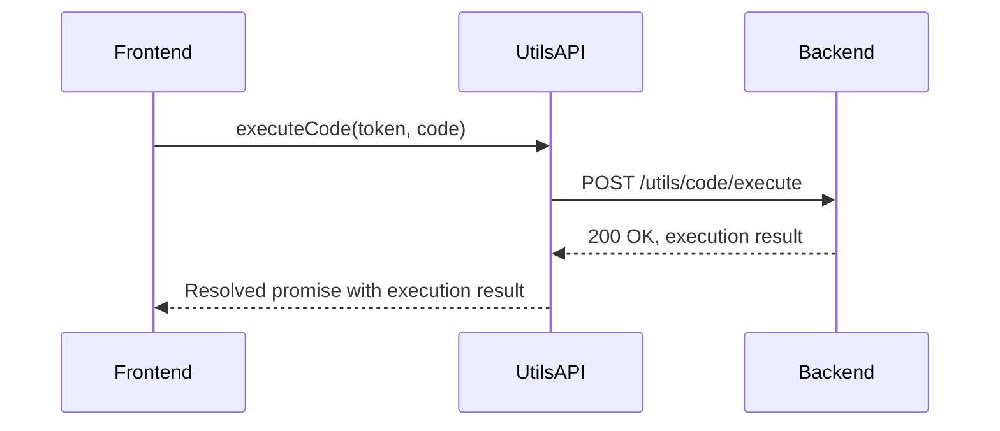

**Diagram sources** 
- [utils/index.ts](file://src/lib/apis/utils/index.ts)

**Section sources**
- [utils/index.ts](file://src/lib/apis/utils/index.ts)

### Streaming API Client
The streaming API client in `src/lib/apis/streaming/index.ts` handles real-time updates through WebSocket integration. It exports functions for creating text streams and handling large deltas. The client uses TypeScript interfaces to define request and response schemas, ensuring type safety. For example, the `createOpenAITextStream` function takes a response body and a flag for splitting large deltas, and returns an async generator that emits delta updates. The client also handles error cases, catching and propagating errors to the caller.

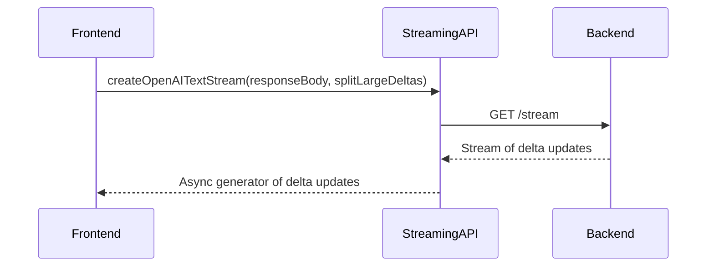

**Diagram sources** 
- [streaming/index.ts](file://src/lib/apis/streaming/index.ts)

**Section sources**
- [streaming/index.ts](file://src/lib/apis/streaming/index.ts)

## Dependency Analysis
The API clients in open-webui have a well-defined dependency structure. The centralized configuration in `src/lib/apis/index.ts` depends on `src/lib/constants.ts` for base URL and API key information. Each API client depends on the centralized configuration for base URL and authentication token injection. The API clients also depend on Svelte stores in `src/lib/stores/index.ts` for state synchronization. For example, the chats API client updates the `chats` store when a new chat is created or an existing chat is updated. The dependency structure ensures that the API clients are loosely coupled and can be developed and tested independently.

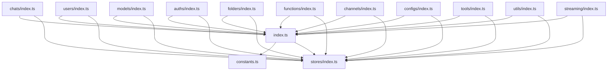

**Diagram sources** 
- [index.ts](file://src/lib/apis/index.ts)
- [constants.ts](file://src/lib/constants.ts)
- [stores/index.ts](file://src/lib/stores/index.ts)
- [chats/index.ts](file://src/lib/apis/chats/index.ts)
- [users/index.ts](file://src/lib/apis/users/index.ts)
- [models/index.ts](file://src/lib/apis/models/index.ts)
- [auths/index.ts](file://src/lib/apis/auths/index.ts)
- [folders/index.ts](file://src/lib/apis/folders/index.ts)
- [functions/index.ts](file://src/lib/apis/functions/index.ts)
- [channels/index.ts](file://src/lib/apis/channels/index.ts)
- [configs/index.ts](file://src/lib/apis/configs/index.ts)
- [tools/index.ts](file://src/lib/apis/tools/index.ts)
- [utils/index.ts](file://src/lib/apis/utils/index.ts)
- [streaming/index.ts](file://src/lib/apis/streaming/index.ts)

**Section sources**
- [index.ts](file://src/lib/apis/index.ts)
- [constants.ts](file://src/lib/constants.ts)
- [stores/index.ts](file://src/lib/stores/index.ts)

## Performance Considerations
The API client system in open-webui is designed with performance in mind. The use of TypeScript interfaces for request and response schemas ensures type safety and reduces runtime errors. The centralized configuration in `src/lib/apis/index.ts` reduces code duplication and ensures consistency across all API calls. The API clients use async/await syntax for handling asynchronous operations, making the code easier to read and maintain. The streaming API client in `src/lib/apis/streaming/index.ts` handles real-time updates efficiently by using async generators and chunking large deltas into smaller pieces. The dependency structure ensures that the API clients are loosely coupled and can be developed and tested independently, reducing the risk of performance issues.

## Troubleshooting Guide
When troubleshooting issues with the API clients in open-webui, start by checking the browser's developer console for error messages. Common issues include authentication errors, network errors, and type errors. Authentication errors can be resolved by ensuring that the user is signed in and that the authentication token is valid. Network errors can be resolved by checking the network connection and ensuring that the backend server is running. Type errors can be resolved by ensuring that the request and response schemas match the expected types. If the issue persists, check the backend logs for more detailed error messages.

**Section sources**
- [index.ts](file://src/lib/apis/index.ts)
- [chats/index.ts](file://src/lib/apis/chats/index.ts)
- [users/index.ts](file://src/lib/apis/users/index.ts)
- [models/index.ts](file://src/lib/apis/models/index.ts)
- [auths/index.ts](file://src/lib/apis/auths/index.ts)
- [folders/index.ts](file://src/lib/apis/folders/index.ts)
- [functions/index.ts](file://src/lib/apis/functions/index.ts)
- [channels/index.ts](file://src/lib/apis/channels/index.ts)
- [configs/index.ts](file://src/lib/apis/configs/index.ts)
- [tools/index.ts](file://src/lib/apis/tools/index.ts)
- [utils/index.ts](file://src/lib/apis/utils/index.ts)
- [streaming/index.ts](file://src/lib/apis/streaming/index.ts)

## Conclusion
The API client system in open-webui provides a modular and maintainable architecture for interacting with backend services. Each service has its corresponding API client with well-defined functions for CRUD operations and other interactions. TypeScript interfaces ensure type safety, while centralized configuration manages base URLs and authentication tokens. The API clients coordinate with Svelte stores for state synchronization and handle real-time updates through WebSocket integration. The system is designed to be extensible, making it easy to add new API clients for additional backend services. By following the patterns and practices documented here, developers can effectively use and extend the API client system in open-webui.