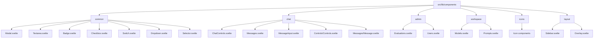
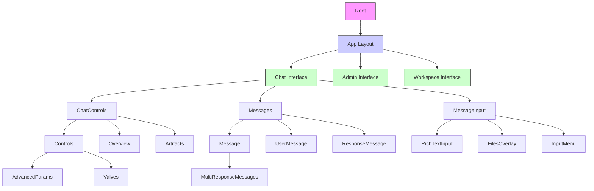
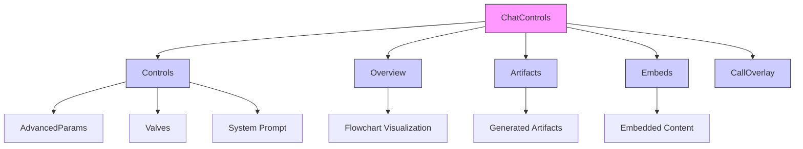
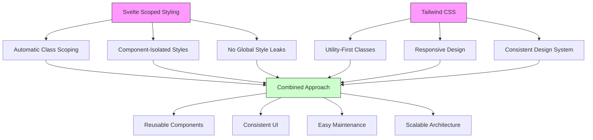
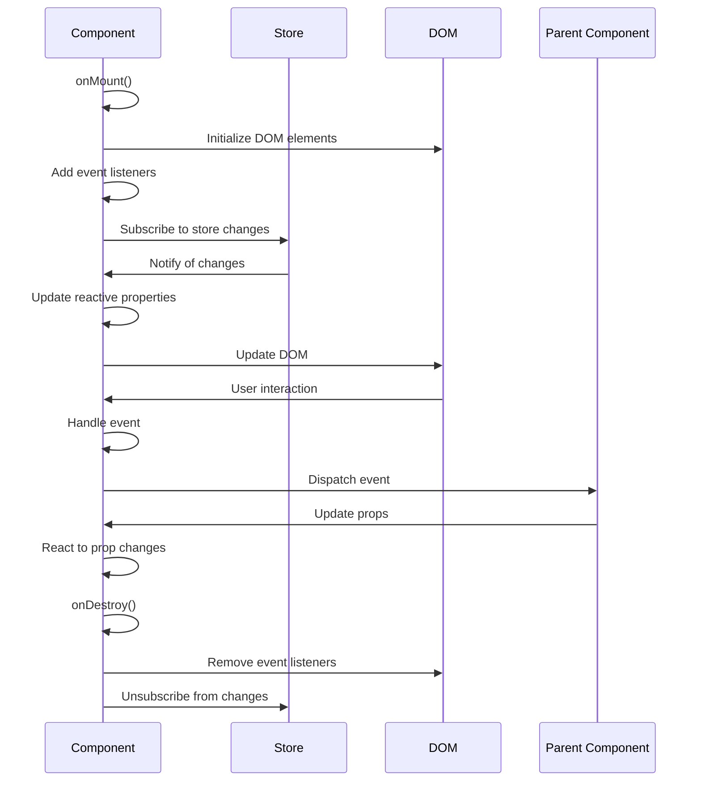
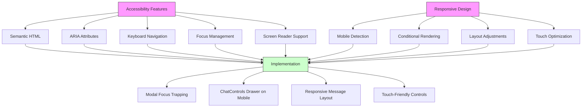
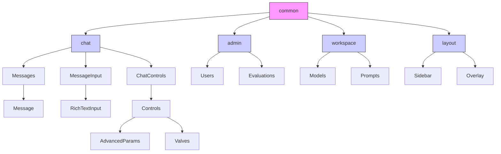

# Component Tree

<cite>
**Referenced Files in This Document**   
- [Modal.svelte](file://src/lib/components/common/Modal.svelte)
- [ShareChatModal.svelte](file://src/lib/components/chat/ShareChatModal.svelte)
- [ChatControls.svelte](file://src/lib/components/chat/ChatControls.svelte)
- [Messages.svelte](file://src/lib/components/chat/Messages.svelte)
- [MessageInput.svelte](file://src/lib/components/chat/MessageInput.svelte)
- [Textarea.svelte](file://src/lib/components/common/Textarea.svelte)
- [Controls.svelte](file://src/lib/components/chat/Controls/Controls.svelte)
- [Message.svelte](file://src/lib/components/chat/Messages/Message.svelte)
- [ValvesModal.svelte](file://src/lib/components/workspace/common/ValvesModal.svelte)
- [Badge.svelte](file://src/lib/components/common/Badge.svelte)
- [Checkbox.svelte](file://src/lib/components/common/Checkbox.svelte)
- [Switch.svelte](file://src/lib/components/common/Switch.svelte)
- [Dropdown.svelte](file://src/lib/components/common/Dropdown.svelte)
- [Selector.svelte](file://src/lib/components/common/Selector.svelte)
</cite>

## Table of Contents
1. [Introduction](#introduction)
2. [Project Structure](#project-structure)
3. [Core Components](#core-components)
4. [Architecture Overview](#architecture-overview)
5. [Detailed Component Analysis](#detailed-component-analysis)
6. [Dependency Analysis](#dependency-analysis)
7. [Performance Considerations](#performance-considerations)
8. [Troubleshooting Guide](#troubleshooting-guide)
9. [Conclusion](#conclusion)
10. [Appendices](#appendices) (if necessary)

## Introduction
This document provides a comprehensive analysis of the frontend component tree in the Open WebUI application. The documentation focuses on the hierarchical organization of Svelte components, detailing how atomic elements are composed into complex composite components. The analysis covers the component library structure in src/lib/components, including the common, chat, admin, and workspace directories. Special attention is given to composition patterns, component inheritance, slot usage, and the implementation of Svelte's scoped styling with Tailwind CSS. The document also addresses component states, lifecycle management, event handling patterns, accessibility considerations, and responsive design implementation across different screen sizes.

## Project Structure
The Open WebUI frontend component tree is organized in a hierarchical structure within the src/lib/components directory. The components are categorized into several main directories: admin, app, channel, chat, common, icons, layout, notes, playground, and workspace. The common directory contains atomic components that are reused throughout the application, while the chat directory contains complex composite components specific to the chat interface. The component library follows a modular design pattern, with each component encapsulated in its own .svelte file and organized into subdirectories based on functionality and scope.



**Diagram sources**
- [src/lib/components](file://src/lib/components)
- [src/lib/components/common](file://src/lib/components/common)
- [src/lib/components/chat](file://src/lib/components/chat)

**Section sources**
- [src/lib/components](file://src/lib/components)

## Core Components
The core components of the Open WebUI frontend are organized around the chat interface, which serves as the primary user interaction point. The component tree is built from atomic elements in the common directory, which are composed into more complex components in the chat directory. The Modal component serves as a base for various modal dialogs throughout the application, demonstrating component inheritance through extension. The ChatControls component manages the sidebar functionality, while Messages and MessageInput handle the chat message display and input respectively. These components work together to create a cohesive chat interface with rich functionality including message history, file attachments, and model selection.

**Section sources**
- [src/lib/components/chat/ChatControls.svelte](file://src/lib/components/chat/ChatControls.svelte)
- [src/lib/components/chat/Messages.svelte](file://src/lib/components/chat/Messages.svelte)
- [src/lib/components/chat/MessageInput.svelte](file://src/lib/components/chat/MessageInput.svelte)

## Architecture Overview
The frontend architecture of Open WebUI follows a component-based design pattern using Svelte as the framework. The component tree is organized hierarchically, with atomic components in the common directory serving as building blocks for more complex composite components. The architecture emphasizes reusability and maintainability through the use of Svelte's scoped styling and slot mechanism. Components are organized by feature area (chat, admin, workspace) and by type (common atomic components, complex composites). The application state is managed through stores, with components subscribing to relevant stores for reactive updates. The architecture supports responsive design through conditional rendering based on screen size and device type.



**Diagram sources**
- [src/lib/components/chat/ChatControls.svelte](file://src/lib/components/chat/ChatControls.svelte)
- [src/lib/components/chat/Messages.svelte](file://src/lib/components/chat/Messages.svelte)
- [src/lib/components/chat/MessageInput.svelte](file://src/lib/components/chat/MessageInput.svelte)

## Detailed Component Analysis

### Component Composition Patterns
The Open WebUI application demonstrates sophisticated component composition patterns, particularly in the chat interface. The ChatControls component serves as a container for various functionality panels including Controls, Overview, Artifacts, and Embeds. These panels are conditionally rendered based on store values, allowing for a dynamic interface that adapts to user actions. The Messages component composes individual Message components, which in turn render either UserMessage or ResponseMessage components based on the message role. This hierarchical composition allows for complex functionality while maintaining code organization and reusability.



**Diagram sources**
- [src/lib/components/chat/ChatControls.svelte](file://src/lib/components/chat/ChatControls.svelte)
- [src/lib/components/chat/Controls/Controls.svelte](file://src/lib/components/chat/Controls/Controls.svelte)

**Section sources**
- [src/lib/components/chat/ChatControls.svelte](file://src/lib/components/chat/ChatControls.svelte)
- [src/lib/components/chat/Controls/Controls.svelte](file://src/lib/components/chat/Controls/Controls.svelte)

### Atomic Components and Reusability
The common directory contains atomic components that are reused throughout the application. These components include Modal, Textarea, Badge, Checkbox, Switch, Dropdown, and Selector. The Modal component serves as a base for various modal dialogs, demonstrating inheritance through extension. The Textarea component provides a resizable text input with automatic height adjustment. The Badge component displays status indicators with different color schemes. The Checkbox and Switch components provide form controls with visual feedback. The Dropdown and Selector components implement menu and selection functionality with search capabilities. These atomic components follow consistent design patterns and leverage Tailwind CSS for styling, ensuring visual consistency across the application.

```mermaid
classDiagram
    class Modal {
        +show : boolean
        +size : string
        +containerClassName : string
        +className : string
        +onDestroy()
        +onMount()
        +handleKeyDown()
        +isTopModal()
    }
    class Textarea {
        +value : string
        +placeholder : string
        +rows : number
        +minSize : number
        +maxSize : number
        +required : boolean
        +readonly : boolean
        +className : string
        +onInput()
        +onBlur()
        +resize()
    }
    class Badge {
        +type : string
        +content : string
        +classNames : Record~string, string~
    }
    class Checkbox {
        +state : string
        +indeterminate : boolean
        +disabled : boolean
        +disabledClassName : string
    }
    class Switch {
        +state : boolean
        +id : string
        +ariaLabelledbyId : string
        +tooltip : boolean
    }
    class ShareChatModal {
    }
    class ValvesModal {
    }
    class RichTextInput {
    }
    class Valves {
    }
    class InputMenu {
    }
    class ModelSelector {
    }
    class Dropdown {
    }
    class Selector {
    }
    Modal <|-- ShareChatModal
    Modal <|-- ValvesModal
    Textarea --> RichTextInput
    Switch --> Valves
    Dropdown --> InputMenu
    Selector --> ModelSelector
    note right of Modal
        "Base component for all modal dialogs<br/>Implements accessibility features<br/>Handles focus trapping"
    end note
    note right of Textarea
        "Auto-resizing text input<br/>Supports min/max height constraints<br/>Integrates with form validation"
    end note
```

**Diagram sources**
- [src/lib/components/common/Modal.svelte](file://src/lib/components/common/Modal.svelte)
- [src/lib/components/common/Textarea.svelte](file://src/lib/components/common/Textarea.svelte)
- [src/lib/components/common/Badge.svelte](file://src/lib/components/common/Badge.svelte)
- [src/lib/components/common/Checkbox.svelte](file://src/lib/components/common/Checkbox.svelte)
- [src/lib/components/common/Switch.svelte](file://src/lib/components/common/Switch.svelte)
- [src/lib/components/common/Dropdown.svelte](file://src/lib/components/common/Dropdown.svelte)
- [src/lib/components/common/Selector.svelte](file://src/lib/components/common/Selector.svelte)

**Section sources**
- [src/lib/components/common/Modal.svelte](file://src/lib/components/common/Modal.svelte)
- [src/lib/components/common/Textarea.svelte](file://src/lib/components/common/Textarea.svelte)
- [src/lib/components/common/Badge.svelte](file://src/lib/components/common/Badge.svelte)
- [src/lib/components/common/Checkbox.svelte](file://src/lib/components/common/Checkbox.svelte)
- [src/lib/components/common/Switch.svelte](file://src/lib/components/common/Switch.svelte)
- [src/lib/components/common/Dropdown.svelte](file://src/lib/components/common/Dropdown.svelte)
- [src/lib/components/common/Selector.svelte](file://src/lib/components/common/Selector.svelte)

### Component Inheritance and Slot Usage
The Open WebUI application demonstrates component inheritance through the Modal component, which serves as a base for specialized modal dialogs like ShareChatModal and ValvesModal. These child components extend the base Modal functionality while adding specific content and behavior. The slot mechanism is used extensively to enable content composition, allowing parent components to inject content into child components. For example, the Modal component uses a default slot to contain its content, while the Controls component uses named slots for collapsible content. This pattern promotes reusability and flexibility in the component design.

```mermaid
classDiagram
    class Modal {
        +show : boolean
        +size : string
        +containerClassName : string
        +className : string
    }
    class ShareChatModal {
        +chatId : string
        +show : boolean
        +shareUrl : string
    }
    class ValvesModal {
        +show : boolean
        +type : string
        +id : string
        +userValves : boolean
        +saving : boolean
        +loading : boolean
        +valvesSpec : object
        +valves : object
    }
    Modal <|-- ShareChatModal
    Modal <|-- ValvesModal
    ShareChatModal : "Uses slot for modal content"
    ValvesModal : "Uses slot for valves configuration form"
    Modal : "Implements focus trapping"
    Modal : "Handles keyboard navigation"
    Modal : "Manages backdrop interaction"
    note right of ShareChatModal
        "Extends Modal with chat sharing functionality<br/>Implements URL generation and copying<br/>Provides integration with AIris Community"
    end note
    note right of ValvesModal
        "Extends Modal with valves configuration<br/>Supports both tool and function valves<br/>Implements form validation and submission"
    end note
```

**Diagram sources**
- [src/lib/components/common/Modal.svelte](file://src/lib/components/common/Modal.svelte)
- [src/lib/components/chat/ShareChatModal.svelte](file://src/lib/components/chat/ShareChatModal.svelte)
- [src/lib/components/workspace/common/ValvesModal.svelte](file://src/lib/components/workspace/common/ValvesModal.svelte)

**Section sources**
- [src/lib/components/common/Modal.svelte](file://src/lib/components/common/Modal.svelte)
- [src/lib/components/chat/ShareChatModal.svelte](file://src/lib/components/chat/ShareChatModal.svelte)
- [src/lib/components/workspace/common/ValvesModal.svelte](file://src/lib/components/workspace/common/ValvesModal.svelte)

### Svelte's Scoped Styling and Tailwind CSS
The Open WebUI application leverages Svelte's scoped styling to ensure component styles do not leak to other components. Each component has its own style block that is automatically scoped to the component. The application extensively uses Tailwind CSS for styling, following a utility-first approach that promotes consistency and reduces CSS bloat. The combination of Svelte's scoped styling and Tailwind CSS enables a maintainable and scalable styling architecture. Components use Tailwind classes for layout, typography, colors, and spacing, while Svelte's style blocks handle component-specific styling that cannot be achieved with utility classes.



**Diagram sources**
- [src/lib/components/common/Modal.svelte](file://src/lib/components/common/Modal.svelte)
- [src/lib/components/chat/ChatControls.svelte](file://src/lib/components/chat/ChatControls.svelte)
- [src/lib/components/chat/Messages.svelte](file://src/lib/components/chat/Messages.svelte)

**Section sources**
- [src/lib/components/common/Modal.svelte](file://src/lib/components/common/Modal.svelte)
- [src/lib/components/chat/ChatControls.svelte](file://src/lib/components/chat/ChatControls.svelte)
- [src/lib/components/chat/Messages.svelte](file://src/lib/components/chat/Messages.svelte)

### Component States, Lifecycle, and Event Handling
The Open WebUI components implement sophisticated state management and lifecycle handling. Components use Svelte's reactive declarations ($:) to respond to store changes and component property updates. The onMount and onDestroy lifecycle functions are used to set up and clean up component resources, such as event listeners and DOM elements. Event handling is implemented through Svelte's event directives (on:click, on:input, etc.), with events often dispatched to parent components using createEventDispatcher. The components also use Svelte's transitions and animations for smooth user interactions.



**Diagram sources**
- [src/lib/components/chat/ChatControls.svelte](file://src/lib/components/chat/ChatControls.svelte)
- [src/lib/components/chat/Messages.svelte](file://src/lib/components/chat/Messages.svelte)
- [src/lib/components/chat/MessageInput.svelte](file://src/lib/components/chat/MessageInput.svelte)

**Section sources**
- [src/lib/components/chat/ChatControls.svelte](file://src/lib/components/chat/ChatControls.svelte)
- [src/lib/components/chat/Messages.svelte](file://src/lib/components/chat/Messages.svelte)
- [src/lib/components/chat/MessageInput.svelte](file://src/lib/components/chat/MessageInput.svelte)

### Accessibility and Responsive Design
The Open WebUI application implements comprehensive accessibility features and responsive design patterns. Components use semantic HTML elements and ARIA attributes to ensure accessibility for users with disabilities. The Modal component implements focus trapping to maintain keyboard navigation within the modal. The application responds to different screen sizes through conditional rendering and layout adjustments. On mobile devices, certain components like ChatControls are rendered as drawers instead of sidebars. The responsive design ensures a consistent user experience across desktop, tablet, and mobile devices.



**Diagram sources**
- [src/lib/components/common/Modal.svelte](file://src/lib/components/common/Modal.svelte)
- [src/lib/components/chat/ChatControls.svelte](file://src/lib/components/chat/ChatControls.svelte)
- [src/lib/components/chat/Messages.svelte](file://src/lib/components/chat/Messages.svelte)

**Section sources**
- [src/lib/components/common/Modal.svelte](file://src/lib/components/common/Modal.svelte)
- [src/lib/components/chat/ChatControls.svelte](file://src/lib/components/chat/ChatControls.svelte)
- [src/lib/components/chat/Messages.svelte](file://src/lib/components/chat/Messages.svelte)

## Dependency Analysis
The component dependencies in Open WebUI follow a clear hierarchical pattern, with atomic components in the common directory having no dependencies on higher-level components. The chat components depend on common components for UI elements and functionality. The component tree shows a well-organized dependency graph with minimal circular dependencies. The use of Svelte stores for state management reduces direct component-to-component dependencies, promoting loose coupling. The dependency analysis reveals a maintainable architecture where components can be modified or replaced with minimal impact on other parts of the application.



**Diagram sources**
- [src/lib/components/common](file://src/lib/components/common)
- [src/lib/components/chat](file://src/lib/components/chat)
- [src/lib/components/admin](file://src/lib/components/admin)
- [src/lib/components/workspace](file://src/lib/components/workspace)
- [src/lib/components/layout](file://src/lib/components/layout)

**Section sources**
- [src/lib/components/common](file://src/lib/components/common)
- [src/lib/components/chat](file://src/lib/components/chat)
- [src/lib/components/admin](file://src/lib/components/admin)
- [src/lib/components/workspace](file://src/lib/components/workspace)
- [src/lib/components/layout](file://src/lib/components/layout)

## Performance Considerations
The Open WebUI component tree demonstrates several performance optimization techniques. Components use Svelte's reactive declarations efficiently, minimizing unnecessary re-renders. The Messages component implements virtual scrolling through conditional loading of message history, reducing memory usage and improving rendering performance. The use of Svelte's keyed each blocks ensures efficient DOM updates when the message list changes. The application leverages lazy loading for certain components like the Overview visualization, which is only imported when needed. These optimizations contribute to a responsive user interface even with large message histories and complex functionality.

**Section sources**
- [src/lib/components/chat/Messages.svelte](file://src/lib/components/chat/Messages.svelte)
- [src/lib/components/chat/ChatControls.svelte](file://src/lib/components/chat/ChatControls.svelte)

## Troubleshooting Guide
When troubleshooting component issues in Open WebUI, start by checking the component's dependencies and store subscriptions. Verify that required props are being passed correctly and that store values are updating as expected. For rendering issues, check the component's reactive declarations and ensure they are correctly defined. For event handling problems, verify that event listeners are properly attached and that events are being dispatched correctly. When debugging modal components, ensure that focus trapping is working correctly and that the modal is properly appended to the document body. For performance issues, analyze the component's reactivity and consider implementing optimizations like lazy loading or virtual scrolling.

**Section sources**
- [src/lib/components/common/Modal.svelte](file://src/lib/components/common/Modal.svelte)
- [src/lib/components/chat/Messages.svelte](file://src/lib/components/chat/Messages.svelte)
- [src/lib/components/chat/ChatControls.svelte](file://src/lib/components/chat/ChatControls.svelte)

## Conclusion
The Open WebUI frontend component tree demonstrates a well-architected Svelte application with a clear hierarchical organization. The use of atomic components in the common directory promotes reusability and consistency across the application. The composition patterns in complex components like ChatControls and Messages enable rich functionality while maintaining code organization. The implementation of component inheritance through the Modal base class and the extensive use of slots provide flexibility and extensibility. The combination of Svelte's scoped styling and Tailwind CSS ensures a maintainable and scalable styling architecture. The attention to accessibility and responsive design ensures a high-quality user experience across different devices and user needs. Overall, the component tree represents a robust and maintainable frontend architecture that effectively supports the application's functionality.