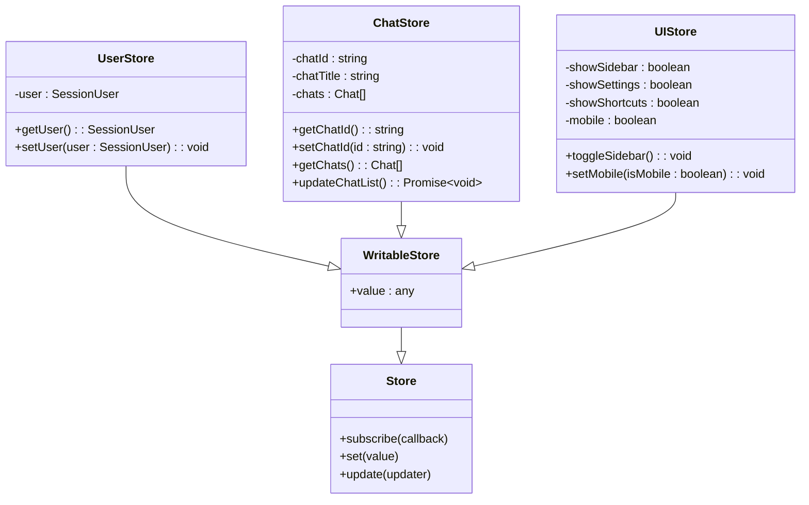
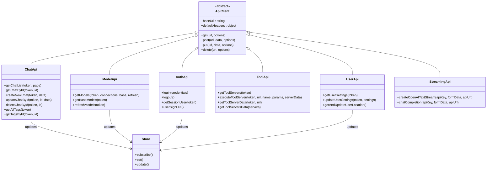
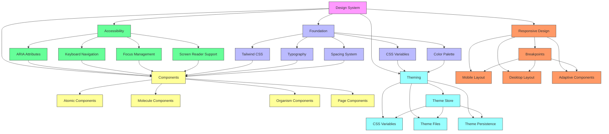

# Frontend Architecture

<cite>
**Referenced Files in This Document**   
- [index.ts](file://src/lib/stores/index.ts)
- [+layout.svelte](file://src/routes/+layout.svelte)
- [index.ts](file://src/lib/apis/index.ts)
- [Chat.svelte](file://src/lib/components/chat/Chat.svelte)
- [Modal.svelte](file://src/lib/components/common/Modal.svelte)
- [Sidebar.svelte](file://src/lib/components/common/Sidebar.svelte)
- [package.json](file://package.json)
</cite>

## Table of Contents
1. [Introduction](#introduction)
2. [Svelte Component Architecture](#svelte-component-architecture)
3. [State Management with Svelte Stores](#state-management-with-svelte-stores)
4. [Routing System with SvelteKit](#routing-system-with-sveltekit)
5. [API Client Architecture](#api-client-architecture)
6. [Component Hierarchy and Reusability](#component-hierarchy-and-reusability)
7. [UI Design System and Theming](#ui-design-system-and-theming)
8. [Component Composition Examples](#component-composition-examples)
9. [Performance Considerations](#performance-considerations)
10. [Conclusion](#conclusion)

## Introduction
The open-webui frontend is a SvelteKit-based application that provides a comprehensive interface for interacting with AI models and chat functionality. Built with Svelte 5, the application leverages modern web technologies to deliver a responsive and interactive user experience. The architecture follows a component-based approach with a strong emphasis on reusability, state management, and efficient API communication. This documentation provides a detailed analysis of the frontend architecture, focusing on the Svelte component system, state management with Svelte stores, routing with SvelteKit, API client architecture, and UI design patterns.

## Svelte Component Architecture
The open-webui frontend implements a hierarchical component architecture built on Svelte 5, organizing UI elements into a well-structured hierarchy that promotes reusability and maintainability. The component system is organized into several categories based on functionality and scope, with components ranging from atomic UI elements to complex composite components.

The architecture follows a clear directory structure under `src/lib/components/`, which categorizes components into logical groups:
- **admin**: Components for administrative interfaces
- **app**: Application-level components like AppSidebar
- **channel**: Components for channel-related functionality
- **chat**: Comprehensive components for chat interface
- **common**: Reusable atomic and molecule components
- **icons**: SVG icon components
- **layout**: Layout-specific components
- **notes**: Components for note-taking functionality
- **playground**: Components for experimentation features
- **workspace**: Components for workspace management

The component architecture emphasizes composition, where complex interfaces are built by combining simpler, reusable components. For example, the chat interface is composed of multiple specialized components like MessageInput, Messages, ChatControls, and Navbar, each responsible for a specific aspect of the chat experience. This modular approach allows for independent development and testing of components while enabling flexible composition for different use cases.

**Section sources**
- [Chat.svelte](file://src/lib/components/chat/Chat.svelte)
- [Modal.svelte](file://src/lib/components/common/Modal.svelte)
- [Sidebar.svelte](file://src/lib/components/common/Sidebar.svelte)

## State Management with Svelte Stores
The open-webui application implements a centralized state management system using Svelte stores, providing a reactive and efficient way to manage application state across components. The state management architecture is defined in `src/lib/stores/index.ts`, which exports a collection of writable stores that represent different aspects of the application state.

The store system follows a pattern of creating named exports for each state variable, making them easily importable and usable across the application. Key state stores include:
- **User and session state**: Stores for user information, authentication tokens, and session data
- **Application configuration**: Stores for backend configuration, version information, and deployment IDs
- **UI state**: Stores for managing UI elements like sidebar visibility, modal states, and various toggle states
- **Data entities**: Stores for collections of data such as chats, models, prompts, tools, and functions
- **Chat-specific state**: Stores for current chat ID, chat title, message history, and related metadata

The stores are implemented using Svelte's `writable` function, which creates stores that can be both read from and written to. This approach provides reactivity, automatically updating components that subscribe to store values when the state changes. The architecture also includes type definitions for complex state objects, ensuring type safety throughout the application.

A notable aspect of the state management system is its integration with the application lifecycle. Stores are initialized and updated in the root layout component (`+layout.svelte`), where they are populated with data from API calls during application startup. This ensures that the application state is properly initialized before rendering components that depend on it.



**Diagram sources **
- [index.ts](file://src/lib/stores/index.ts)
- [+layout.svelte](file://src/routes/+layout.svelte)

**Section sources**
- [index.ts](file://src/lib/stores/index.ts)

## Routing System with SvelteKit
The open-webui application utilizes SvelteKit's file-based routing system to manage navigation and page rendering. The routing architecture is organized under the `src/routes/` directory, following SvelteKit's convention of mapping file and directory names to URL paths.

The routing system implements a nested layout structure, with a root layout (`+layout.svelte`) that provides shared functionality and UI elements across all pages. This root layout handles critical application initialization tasks, including:
- Setting up WebSocket connections for real-time communication
- Initializing internationalization (i18n) with language detection and configuration
- Managing user authentication and session state
- Loading application configuration from the backend
- Setting up broadcast channels for inter-tab communication
- Handling service worker updates and version management

The application employs a group layout pattern with routes organized under the `(app)` directory, which likely represents the main application area accessible only to authenticated users. This structure allows for shared layout and data loading logic across related pages while maintaining separation from authentication and error pages.

Key routing features include:
- **Layout inheritance**: Child routes inherit layout components and scripts from parent layouts
- **Server-side rendering (SSR) control**: The `+layout.js` file sets `ssr = false`, indicating a client-side rendered application
- **Navigation guards**: The layout component implements logic to redirect unauthenticated users to the login page
- **Dynamic parameters**: Routes support dynamic segments (e.g., `[id]`) for handling variable path components
- **Error handling**: A dedicated `+error.svelte` page provides a consistent error experience

The routing system is tightly integrated with the state management system, with the layout component responsible for initializing and updating global stores based on route changes and user interactions.

```mermaid
graph TD
A[Root Route] --> B[+layout.svelte]
A --> C[+error.svelte]
A --> D[auth/+page.svelte]
A --> E[error/+page.svelte]
A --> F[s/[id]/+page.svelte]
A --> G[watch/+page.svelte]
B --> H[(app) Group]
H --> I[+layout.svelte]
H --> J[+page.svelte]
H --> K[admin/+layout.svelte]
H --> L[billing/+layout.svelte]
H --> M[c/[id]/+page.svelte]
H --> N[channels/[id]/+page.svelte]
H --> O[home/+layout.svelte]
H --> P[notes/+layout.svelte]
H --> Q[playground/+layout.svelte]
H --> R[workspace/+layout.svelte]
style A fill:#f9f,stroke:#333
style H fill:#bbf,stroke:#333
classDef route fill:#f9f,stroke:#333;
classDef group fill:#bbf,stroke:#333;
classDef layout fill:#ff9,stroke:#333;
classDef page fill:#9ff,stroke:#333;
class A,B,C,D,E,F,G route
class H group
class I,J,K,L,O,P,Q,R layout
class M,N page
```

**Diagram sources **
- [+layout.svelte](file://src/routes/+layout.svelte)
- [+layout.js](file://src/routes/+layout.js)

**Section sources**
- [+layout.svelte](file://src/routes/+layout.svelte)
- [+layout.js](file://src/routes/+layout.js)

## API Client Architecture
The open-webui frontend implements a comprehensive API client architecture in the `src/lib/apis/` directory, providing typed interfaces for communicating with backend services. The architecture follows a modular approach, with separate modules for different API endpoints and functionality areas.

The API client system is organized into individual files or directories for each major functionality area:
- **admin/billing**: Administrative billing functionality
- **audio**: Audio-related API endpoints
- **auths**: Authentication and user session management
- **channels**: Channel and messaging functionality
- **chats**: Chat management and message history
- **configs**: Configuration and settings
- **evaluations**: Model evaluation functionality
- **files**: File upload and management
- **folders**: Folder organization
- **functions**: Function calling and execution
- **groups**: User group management
- **images**: Image generation and processing
- **knowledge**: Knowledge base functionality
- **memories**: Memory management
- **models**: AI model management and listing
- **notes**: Note-taking functionality
- **ollama**: Ollama-specific API endpoints
- **openai**: OpenAI-compatible API endpoints
- **prompts**: Prompt management
- **retrieval**: Information retrieval and search
- **streaming**: Streaming API functionality
- **tools**: Tool integration and management
- **users**: User management and profile
- **utils**: Utility functions and helpers

The architecture follows a consistent pattern across API modules, with each typically exporting functions that encapsulate specific API calls. These functions handle request construction, authentication header management, error handling, and response parsing. The main `index.ts` file in the apis directory exports higher-level functions that may aggregate or coordinate calls to multiple specific API endpoints.

Key architectural features include:
- **Type safety**: TypeScript interfaces ensure type safety for request and response data
- **Authentication handling**: Automatic inclusion of authorization headers when tokens are available
- **Error handling**: Consistent error handling patterns with appropriate error propagation
- **Caching and optimization**: Some endpoints implement caching strategies to reduce redundant API calls
- **Streaming support**: Specialized functions for handling streaming responses, particularly for chat completions

The API client architecture is designed to be both comprehensive and extensible, allowing for easy addition of new endpoints while maintaining consistency across the codebase.



**Diagram sources **
- [index.ts](file://src/lib/apis/index.ts)
- [index.ts](file://src/lib/stores/index.ts)

**Section sources**
- [index.ts](file://src/lib/apis/index.ts)

## Component Hierarchy and Reusability
The open-webui frontend implements a well-structured component hierarchy that emphasizes reusability and composability. The component system is organized into a clear taxonomy, with components categorized by their level of abstraction and scope of functionality.

At the lowest level are **atomic components** in the `common/` directory, which represent basic UI elements that are highly reusable across the application. These include:
- **Form elements**: Checkbox, Textarea, SensitiveInput, Selector
- **Interactive elements**: Button, Dropdown, Modal, Tooltip, ConfirmDialog
- **Display elements**: Badge, Banner, Image, Loader, Spinner
- **Layout elements**: Sidebar, Drawer, Overlay, Collapsible
- **Specialized inputs**: RichTextInput, CodeEditor, FileItem

These atomic components are designed to be highly configurable through props, allowing them to be adapted to different use cases while maintaining a consistent look and feel. For example, the Modal component accepts props for size, container class name, and custom classes, enabling it to be used for various dialog types throughout the application.

At the intermediate level are **molecule components** that combine atomic components to create more complex UI patterns. Examples include:
- **MessageInput**: Combines text input with file upload and tool selection
- **ChatControls**: Groups various chat-related controls and actions
- **Tags**: Manages tag display and interaction
- **Valves**: Controls for managing AI model parameters and settings

At the highest level are **organism components** that represent major sections of the user interface:
- **Chat**: The main chat interface component that orchestrates the entire chat experience
- **Channel**: Component for channel-based communication
- **AppSidebar**: Navigation sidebar for the application
- **Navbar**: Top navigation bar with user controls

The component hierarchy follows the principle of composition over inheritance, with higher-level components building upon lower-level ones through slot-based composition. This approach enables maximum flexibility and reusability while maintaining clear separation of concerns.

```mermaid
graph TD
A[Atomic Components] --> B[Molecule Components]
B --> C[Organism Components]
C --> D[Page Components]
subgraph "Atomic Components"
A1[Button]
A2[Checkbox]
A3[Modal]
A4[Tooltip]
A5[Loader]
A6[Spinner]
A7[Badge]
A8[Banner]
A9[Image]
A10[Textarea]
A11[SensitiveInput]
A12[Selector]
A13[Dropdown]
A14[ConfirmDialog]
A15[RichTextInput]
A16[CodeEditor]
A17[FileItem]
A18[Sidebar]
A19[Drawer]
A20[Overlay]
A21[Collapsible]
end
subgraph "Molecule Components"
B1[MessageInput]
B2[ChatControls]
B3[Tags]
B4[Valves]
B5[ModelSelector]
B6[Controls]
B7[ContentRenderer]
B8[Placeholder]
end
subgraph "Organism Components"
C1[Chat]
C2[Channel]
C3[AppSidebar]
C4[Navbar]
C5[Messages]
C6[Overview]
C7[Artifacts]
end
subgraph "Page Components"
D1[Home]
D2[ChatPage]
D3[ChannelPage]
D4[SettingsPage]
D5[AdminPage]
end
A1 --> B1
A2 --> B4
A3 --> B4
A4 --> B4
A5 --> B4
A6 --> B4
A7 --> B3
A8 --> C1
A9 --> B1
A10 --> B1
A11 --> B1
A12 --> B5
A13 --> B5
A14 --> C1
A15 --> B1
A16 --> B1
A17 --> B1
A18 --> C1
A19 --> C1
A20 --> C1
A21 --> C1
B1 --> C1
B2 --> C1
B3 --> C1
B4 --> C1
B5 --> C1
B6 --> C1
B7 --> C1
B8 --> C1
C1 --> D2
C2 --> D3
C3 --> D1
C3 --> D2
C3 --> D3
C3 --> D4
C3 --> D5
C4 --> D1
C4 --> D2
C4 --> D3
C4 --> D4
C4 --> D5
C5 --> D2
C6 --> D2
C7 --> D2
style A fill:#f9f,stroke:#333
style B fill:#bbf,stroke:#333
style C fill:#ff9,stroke:#333
style D fill:#9ff,stroke:#333
classDef atomic fill:#f9f,stroke:#333;
classDef molecule fill:#bbf,stroke:#333;
classDef organism fill:#ff9,stroke:#333;
classDef page fill:#9ff,stroke:#333;
class A1,A2,A3,A4,A5,A6,A7,A8,A9,A10,A11,A12,A13,A14,A15,A16,A17,A18,A19,A20,A21 atomic
class B1,B2,B3,B4,B5,B6,B7,B8 molecule
class C1,C2,C3,C4,C5,C6,C7 organism
class D1,D2,D3,D4,D5 page
```



**Diagram sources **
- [Modal.svelte](file://src/lib/components/common/Modal.svelte)
- [Sidebar.svelte](file://src/lib/components/common/Sidebar.svelte)
- [Chat.svelte](file://src/lib/components/chat/Chat.svelte)

**Section sources**
- [Modal.svelte](file://src/lib/components/common/Modal.svelte)
- [Sidebar.svelte](file://src/lib/components/common/Sidebar.svelte)
- [Chat.svelte](file://src/lib/components/chat/Chat.svelte)

## UI Design System and Theming
The open-webui frontend implements a comprehensive UI design system that ensures visual consistency and provides theming capabilities. The design system is built on several key technologies and patterns, including Tailwind CSS for utility-first styling, CSS variables for theming, and a component-based approach to UI construction.

The application leverages Tailwind CSS extensively, as evidenced by the presence of `tailwind.config.js` and the use of Tailwind classes throughout the components. This utility-first approach allows for rapid UI development and consistent styling across components. The design system includes responsive design patterns that adapt to different screen sizes, with specific breakpoints and layout adjustments for mobile devices.

Theming support is implemented through CSS variables and a theme store in the application state. The theme can be set to 'system', 'light', or 'dark' mode, with the current theme stored in localStorage for persistence. The application includes predefined theme files in the `static/themes/` directory, such as `rosepine.css` and `rosepine-dawn.css`, which likely define custom color palettes and visual styles.

Key aspects of the UI design system include:
- **Responsive design**: Components adapt to different screen sizes, with specific layouts for mobile devices
- **Accessibility**: Components include appropriate ARIA attributes and keyboard navigation support
- **Animations and transitions**: The application uses Svelte's built-in transitions (fade, slide) and custom animations for smooth user interactions
- **Icon system**: A comprehensive collection of SVG icon components in the `icons/` directory provides consistent visual elements throughout the interface
- **Typography**: Consistent typography scales and font choices create a cohesive reading experience
- **Spacing and layout**: A consistent spacing system based on Tailwind's spacing scale ensures visual harmony

The design system is implemented through a combination of global styles in `app.css` and `tailwind.css`, component-specific styles, and runtime theme management through the theme store. This multi-layered approach allows for both global consistency and component-specific customization.



**Diagram sources **
- [app.css](file://src/app.css)
- [tailwind.css](file://src/tailwind.css)
- [index.ts](file://src/lib/stores/index.ts)

**Section sources**
- [index.ts](file://src/lib/stores/index.ts)

## Component Composition Examples
The open-webui application demonstrates effective component composition patterns through several key interfaces, with the chat interface being a prime example of how multiple components work together to create a cohesive user experience.

### Chat Interface Composition
The chat interface is composed of several specialized components that work together to provide a rich chat experience:

```mermaid
graph TD
A[Chat Component] --> B[Navbar]
A --> C[Messages]
A --> D[MessageInput]
A --> E[ChatControls]
A --> F[Placeholder]
A --> G[Overview]
A --> H[Artifacts]
A --> I[Modal Components]
B --> B1[Title]
B --> B2[Back Button]
B --> B3[Share Button]
B --> B4[Settings Button]
C --> C1[Message]
C --> C2[Message Group]
C --> C3[Message Status]
C --> C4[Message Actions]
D --> D1[Text Input]
D --> D2[File Upload]
D --> D3[Tool Selection]
D --> D4[Send Button]
D --> D5[Voice Input]
E --> E1[Model Selector]
E --> E2[Regenerate]
E --> E3[Stop Generation]
E --> E4[Copy]
E --> E5[Edit]
F --> F1[Welcome Message]
F --> F2[Suggestions]
G --> G1[Chat Statistics]
G --> G2[Message Analysis]
H --> H1[Code Blocks]
H --> H2[Images]
H --> H3[Files]
I --> I1[Settings Modal]
I --> I2[Shortcuts Modal]
I --> I3[Share Modal]
I --> I4[Tag Modal]
style A fill:#f9f,stroke:#333
style B fill:#bbf,stroke:#333
style C fill:#bbf,stroke:#333
style D fill:#bbf,stroke:#333
style E fill:#bbf,stroke:#333
style F fill:#bbf,stroke:#333
style G fill:#bbf,stroke:#333
style H fill:#bbf,stroke:#333
style I fill:#bbf,stroke:#333
classDef container fill:#f9f,stroke:#333;
classDef component fill:#bbf,stroke:#333;
class A container
class B,C,D,E,F,G,H,I component
```



The Chat component serves as the orchestrator, managing the state and coordinating interactions between the various subcomponents. It handles the overall layout, manages the message history, and coordinates API calls for sending messages and retrieving chat data. The Messages component displays the conversation history, rendering individual Message components for each message. The MessageInput component provides the interface for composing new messages, including text input, file attachment, and tool selection. The ChatControls component provides additional actions like regenerating responses, copying content, and editing messages.

### Settings Modal Composition
The settings modal is another example of effective component composition, bringing together multiple specialized components to create a comprehensive settings interface:

```mermaid
flowchart TD
A[Settings Modal] --> B[Tab Navigation]
A --> C[General Settings]
A --> D[Model Settings]
A --> E[Tool Settings]
A --> F[Display Settings]
A --> G[Privacy Settings]
A --> H[Advanced Settings]
B --> B1[General Tab]
B --> B2[Models Tab]
B --> B3[Tools Tab]
B --> B4[Display Tab]
B --> B5[Privacy Tab]
B --> B6[Advanced Tab]
C --> C1[Profile Settings]
C --> C2[Notification Settings]
C --> C3[Language Settings]
D --> D1[Model Selection]
D --> D2[Model Parameters]
D --> D3[Model Ordering]
E --> E1[Tool Configuration]
E --> E2[Tool Server Management]
E --> E3[Function Calling]
F --> F1[Theme Selection]
F --> F2[Text Scale]
F --> F3[Layout Options]
G --> G1[Data Collection]
G --> G2[Sharing Preferences]
G --> G3[Security Settings]
H --> H1[Direct Connections]
H --> H2[API Configuration]
H --> H3[Experimental Features]
style A fill:#f9f,stroke:#333
style B fill:#bbf,stroke:#333
style C fill:#bbf,stroke:#333
style D fill:#bbf,stroke:#333
style E fill:#bbf,stroke:#333
style F fill:#bbf,stroke:#333
style G fill:#bbf,stroke:#333
style H fill:#bbf,stroke:#333
classDef modal fill:#f9f,stroke:#333;
classDef section fill:#bbf,stroke:#333;
classDef setting fill:#9ff,stroke:#333;
class A modal
class B,C,D,E,F,G,H section
```



The settings modal uses a tabbed interface to organize settings into logical categories, with each tab containing specialized components for configuring specific aspects of the application. This composition pattern allows for a complex settings interface to be built from simpler, focused components.

**Diagram sources **
- [Chat.svelte](file://src/lib/components/chat/Chat.svelte)
- [Modal.svelte](file://src/lib/components/common/Modal.svelte)

**Section sources**
- [Chat.svelte](file://src/lib/components/chat/Chat.svelte)
- [Modal.svelte](file://src/lib/components/common/Modal.svelte)

## Performance Considerations
The open-webui frontend implements several performance optimizations to ensure a responsive and efficient user experience. These optimizations span various aspects of the application, including code organization, state management, and rendering strategies.

One key performance consideration is the use of Svelte's reactivity system, which efficiently updates only the components that need to be re-rendered when state changes. This fine-grained reactivity minimizes unnecessary DOM updates and improves rendering performance. The application also leverages Svelte's built-in transitions and animations, which are optimized for performance and provide smooth user interactions without jank.

The routing system is configured with `ssr = false` in the `+layout.js` file, indicating that the application is client-side rendered. This approach can improve perceived performance by allowing for faster navigation between pages without full page reloads, as SvelteKit can update only the changed portions of the DOM.

The application implements several strategies for efficient state updates:
- **Batched updates**: Multiple state changes are batched together to minimize re-renders
- **Selective subscriptions**: Components subscribe only to the specific store values they need
- **Memoization**: Computed values are cached to avoid recalculation
- **Lazy loading**: Some components and data are loaded only when needed

For API communication, the application implements caching strategies to reduce redundant network requests. For example, the getModels function includes a refresh parameter that allows for controlled cache invalidation, preventing unnecessary API calls when the data hasn't changed.

The component architecture itself contributes to performance by promoting reusability and minimizing code duplication. Atomic components can be reused across the application, reducing the overall bundle size and improving load times. The use of slots and composition patterns also enables efficient rendering by allowing parent components to control when child components are rendered.

Additionally, the application leverages modern web platform features for performance:
- **Service workers**: For offline support and asset caching
- **WebSockets**: For real-time communication with the backend, reducing the need for polling
- **Web Workers**: For running computationally intensive tasks like Python code execution in a separate thread, preventing UI blocking

These performance considerations work together to create a responsive and efficient user experience, even when handling complex AI interactions and large amounts of data.

**Section sources**
- [Chat.svelte](file://src/lib/components/chat/Chat.svelte)
- [+layout.svelte](file://src/routes/+layout.svelte)
- [index.ts](file://src/lib/stores/index.ts)

## Conclusion
The open-webui frontend architecture demonstrates a well-structured and modern approach to building a complex web application with Svelte and SvelteKit. The architecture emphasizes component reusability, efficient state management, and a clear separation of concerns, resulting in a maintainable and scalable codebase.

Key strengths of the architecture include:
- A comprehensive component hierarchy that promotes reusability and composability
- A centralized state management system using Svelte stores for reactive data flow
- A robust routing system with SvelteKit that supports nested layouts and dynamic parameters
- A modular API client architecture with typed endpoints for reliable backend communication
- A consistent UI design system with theming support and responsive design patterns
- Effective performance optimizations for a smooth user experience

The application successfully leverages the strengths of Svelte 5, including its reactivity system, component model, and build-time optimizations, to create a responsive and interactive interface for AI chat functionality. The architecture is well-suited for its purpose, providing a solid foundation for future enhancements and feature additions.

**Section sources**
- [package.json](file://package.json)