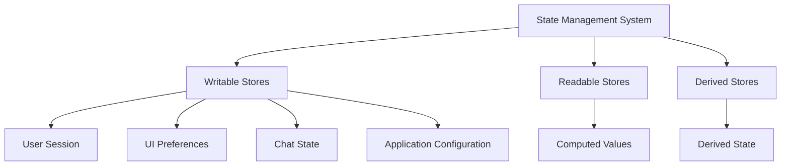
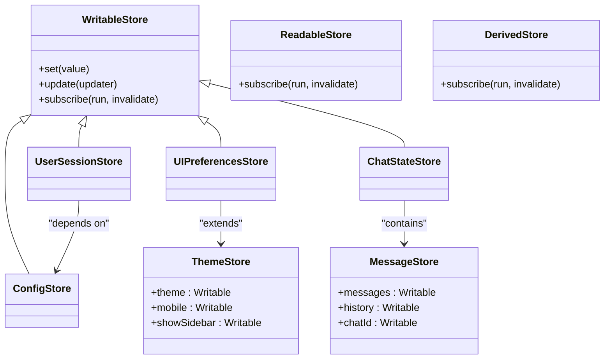
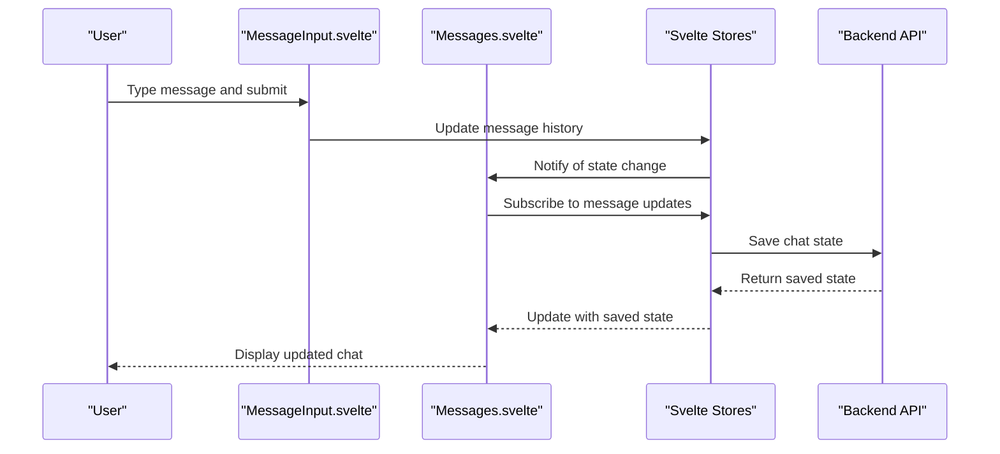
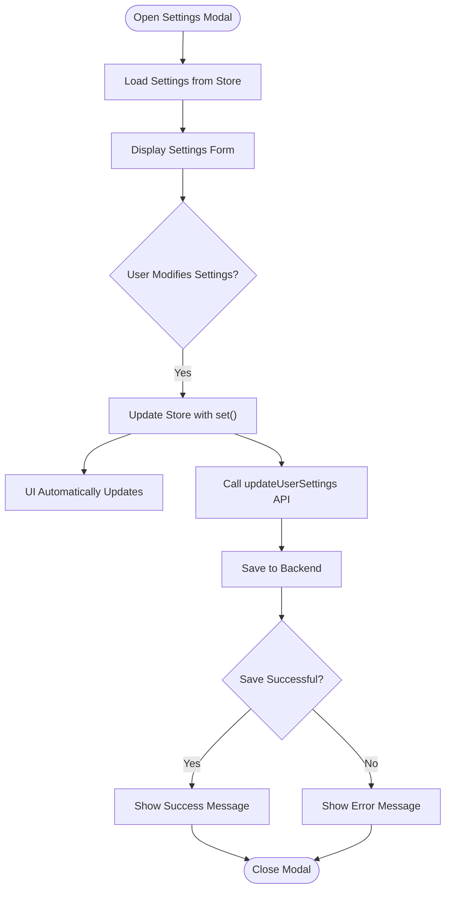
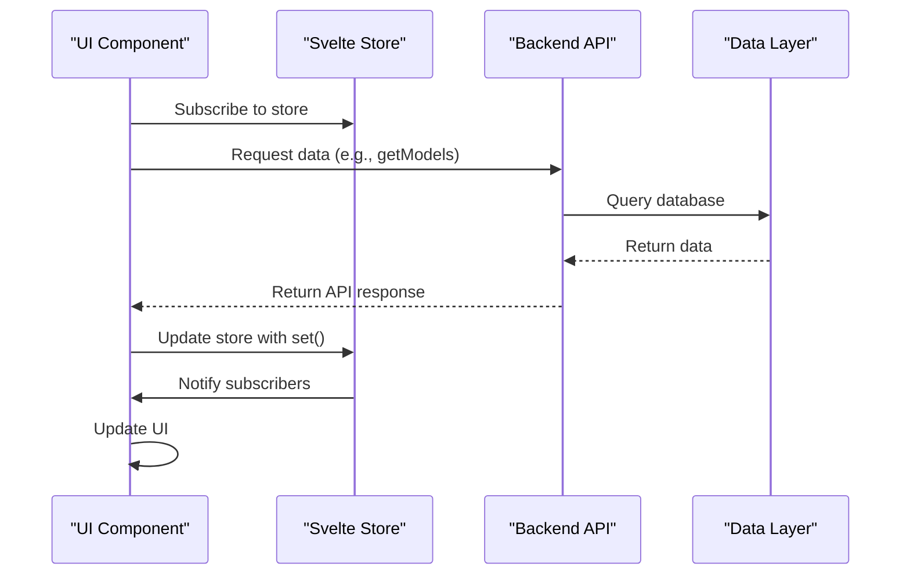
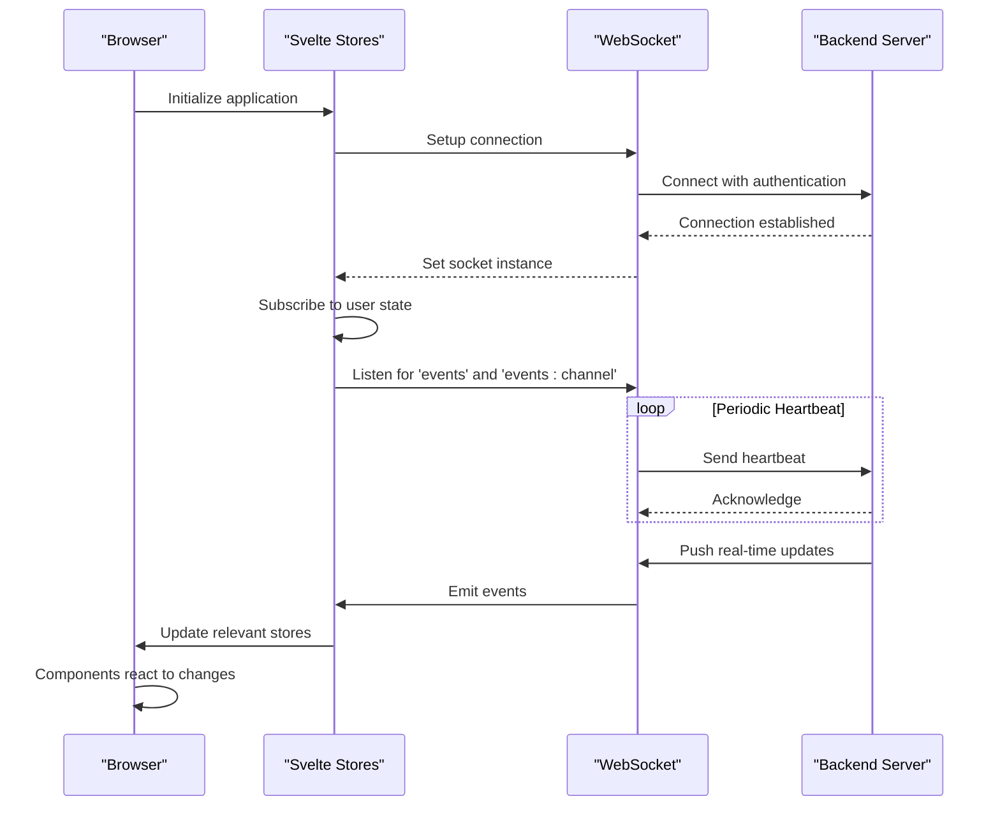

# State Management

<cite>
**Referenced Files in This Document**   
- [index.ts](file://src/lib/stores/index.ts)
- [+layout.svelte](file://src/routes/+layout.svelte)
- [Messages.svelte](file://src/lib/components/chat/Messages.svelte)
- [Message.svelte](file://src/lib/components/chat/Messages/Message.svelte)
- [SettingsModal.svelte](file://src/lib/components/chat/SettingsModal.svelte)
- [MessageInput.svelte](file://src/lib/components/chat/MessageInput.svelte)
- [constants.ts](file://src/lib/constants.ts)
- [index.ts](file://src/lib/apis/index.ts)
</cite>

## Table of Contents
1. [Introduction](#introduction)
2. [Store Implementation Overview](#store-implementation-overview)
3. [Core Store Types and Patterns](#core-store-types-and-patterns)
4. [Chat Interface State Synchronization](#chat-interface-state-synchronization)
5. [Form State Management in Modals](#form-state-management-in-modals)
6. [API Integration and Data Flow](#api-integration-and-data-flow)
7. [Real-time Updates and Socket Connections](#real-time-updates-and-socket-connections)
8. [Performance Considerations](#performance-considerations)
9. [Best Practices](#best-practices)
10. [Conclusion](#conclusion)

## Introduction
The State Management system in open-webui is built on Svelte stores, providing a reactive and efficient way to manage global application state. This documentation explains how Svelte stores are implemented in the application to handle user sessions, UI preferences, real-time updates, and chat state synchronization. The system uses writable, readable, and derived stores to manage different state requirements across the application, ensuring components stay in sync with the latest state changes.

## Store Implementation Overview

The state management system is centralized in `src/lib/stores/index.ts`, which exports various stores for different aspects of the application state. These stores are imported and used throughout the application to maintain a consistent state across components.

**Diagram sources**
- [index.ts](file://src/lib/stores/index.ts#L1-L302)

**Section sources**
- [index.ts](file://src/lib/stores/index.ts#L1-L302)

## Core Store Types and Patterns

The application implements three main types of Svelte stores: writable, readable, and derived. Writable stores are used for state that can be modified by components, such as user sessions, UI preferences, and chat state. Readable stores provide access to state without allowing direct modification, while derived stores compute values based on other stores.

The stores are organized by functionality:
- **Backend state**: Stores like `config`, `user`, and `WEBUI_VERSION` manage backend configuration and user session data
- **Frontend state**: Stores like `theme`, `mobile`, and `showSidebar` manage UI preferences and responsive behavior
- **Chat state**: Stores like `chatId`, `chats`, and `messages` manage the current chat context and message history
- **Feature state**: Stores like `models`, `prompts`, and `tools` manage available resources and capabilities

**Diagram sources**
- [index.ts](file://src/lib/stores/index.ts#L1-L302)

**Section sources**
- [index.ts](file://src/lib/stores/index.ts#L1-L302)

## Chat Interface State Synchronization

The chat interface components use Svelte stores to synchronize message state across multiple components. The `Messages.svelte` component subscribes to several stores including `chats`, `config`, `settings`, `user`, `mobile`, `currentChatPage`, and `temporaryChatEnabled` to maintain the current chat state.

When a user interacts with the chat interface, the component updates the local message history and then persists these changes to the backend through API calls. The store system ensures that all components displaying the chat state are automatically updated when changes occur.

**Diagram sources**
- [Messages.svelte](file://src/lib/components/chat/Messages.svelte#L1-L465)
- [MessageInput.svelte](file://src/lib/components/chat/MessageInput.svelte#L1-L1805)

**Section sources**
- [Messages.svelte](file://src/lib/components/chat/Messages.svelte#L1-L465)
- [Message.svelte](file://src/lib/components/chat/Messages/Message.svelte#L1-L129)

## Form State Management in Modals

Modal components use Svelte stores to manage form state, particularly in the Settings modal. The `SettingsModal.svelte` component imports and uses multiple stores including `config`, `models`, `settings`, and `user` to manage the form state and user preferences.

When users modify settings in the modal, the changes are first applied to the local store state using the `set` method, and then persisted to the backend through API calls. This pattern ensures that the UI immediately reflects user changes while the backend update happens asynchronously.

**Diagram sources**
- [SettingsModal.svelte](file://src/lib/components/chat/SettingsModal.svelte#L1-L944)

**Section sources**
- [SettingsModal.svelte](file://src/lib/components/chat/SettingsModal.svelte#L1-L944)

## API Integration and Data Flow

The state management system integrates with backend APIs to fetch and store data. The `apis/index.ts` file contains functions that retrieve data from the backend and update the corresponding stores. For example, the `getModels` function fetches available AI models and updates the `models` store.

The data flow follows a consistent pattern:
1. Components subscribe to relevant stores
2. On initialization or specific events, API calls are made to fetch data
3. The retrieved data is stored in the appropriate Svelte store
4. All subscribed components automatically receive the updated state

**Diagram sources**
- [index.ts](file://src/lib/apis/index.ts#L1-L1706)
- [index.ts](file://src/lib/stores/index.ts#L1-L302)

**Section sources**
- [index.ts](file://src/lib/apis/index.ts#L1-L1706)
- [index.ts](file://src/lib/stores/index.ts#L1-L302)

## Real-time Updates and Socket Connections

The application uses socket connections for real-time updates, with the socket instance stored in a Svelte store. The `+layout.svelte` file sets up the socket connection and stores it in the `socket` store, making it available to all components.

When the user authentication state changes, the application subscribes to socket events and updates the relevant stores. This enables real-time collaboration features and immediate notification of changes made by other users or devices.

**Diagram sources**
- [+layout.svelte](file://src/routes/+layout.svelte#L88-L742)
- [index.ts](file://src/lib/stores/index.ts#L1-L302)

**Section sources**
- [+layout.svelte](file://src/routes/+layout.svelte#L88-L742)

## Performance Considerations

The state management system includes several performance optimizations to minimize unnecessary re-renders and efficient state updates:

1. **Selective Store Subscriptions**: Components only subscribe to the specific stores they need, reducing unnecessary updates
2. **Batched Updates**: Multiple store updates are batched when possible to reduce re-render frequency
3. **Conditional Rendering**: Components use Svelte's reactive statements (`$:`) to only update when specific store values change
4. **Memory Management**: Event listeners and subscriptions are properly cleaned up when components are destroyed

The system also implements debouncing for certain operations like settings search to prevent excessive store updates during user input.

## Best Practices

The implementation follows several best practices for Svelte store management:

1. **Centralized Store Definition**: All stores are defined in a single file (`index.ts`) for easy discovery and maintenance
2. **Type Safety**: Stores are properly typed using TypeScript interfaces to prevent runtime errors
3. **Consistent Naming**: Store names follow a consistent pattern that indicates their purpose
4. **Proper Cleanup**: Subscriptions and event listeners are properly cleaned up to prevent memory leaks
5. **Error Handling**: API calls that update stores include proper error handling to maintain application stability
6. **Testing Considerations**: The store pattern facilitates unit testing by allowing stores to be easily mocked

## Conclusion

The State Management system in open-webui effectively uses Svelte stores to manage global application state across various domains including user sessions, UI preferences, and real-time chat interactions. By leveraging writable, readable, and derived stores, the system provides a reactive and efficient way to keep components synchronized with the latest state. The integration with backend APIs and socket connections enables real-time updates while maintaining a clean separation of concerns. The implementation follows best practices for performance, maintainability, and type safety, making it a robust foundation for the application's state management needs.