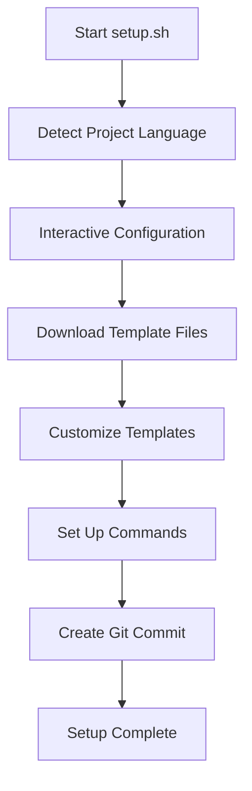
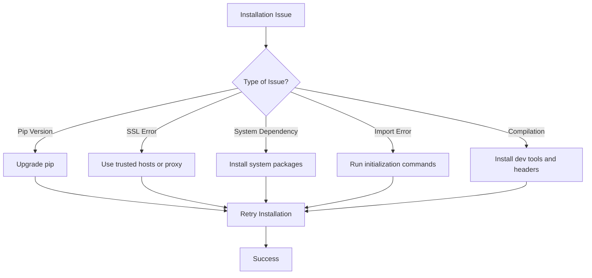

# Virtual Environment and Dependencies

<cite>
**Referenced Files in This Document**   
- [setup.sh](file://setup.sh)
- [requirements.txt](file://backend/requirements.txt)
- [requirements-min.txt](file://backend/requirements-min.txt)
- [start.sh](file://backend/start.sh)
- [dev.sh](file://backend/dev.sh)
- [pyproject.toml](file://pyproject.toml)
- [env.py](file://backend/open_webui/env.py)
- [main.py](file://backend/open_webui/main.py)
</cite>

## Table of Contents
1. [Introduction](#introduction)
2. [Virtual Environment Setup](#virtual-environment-setup)
3. [Dependency Management](#dependency-management)
4. [Setup Automation](#setup-automation)
5. [Common Issues and Troubleshooting](#common-issues-and-troubleshooting)
6. [Best Practices](#best-practices)

## Introduction
This document provides comprehensive guidance on setting up the Python virtual environment for open-webui, managing dependencies, and troubleshooting common issues. The open-webui project is a web-based interface for interacting with AI models, particularly Ollama, and requires careful environment configuration to ensure proper functionality. The documentation covers virtual environment creation, dependency installation from various requirements files, automation through setup scripts, and solutions to common installation problems.

**Section sources**
- [setup.sh](file://setup.sh#L1-L277)
- [requirements.txt](file://backend/requirements.txt#L1-L153)
- [requirements-min.txt](file://backend/requirements-min.txt#L1-L52)

## Virtual Environment Setup
To set up a Python virtual environment for open-webui, you can use either Python's built-in `venv` module or Conda. The project requires Python 3.11 or 3.12, as specified in the pyproject.toml file. Using a virtual environment isolates the project's dependencies from your system's Python installation, preventing conflicts between different projects.

For `venv`, create and activate the virtual environment with:
```bash
python -m venv venv
source venv/bin/activate  # On Windows: venv\Scripts\activate
```

For Conda, create and activate the environment with:
```bash
conda create -n open-webui python=3.11
conda activate open-webui
```

The virtual environment should be created at the project root directory. After activation, you can proceed with dependency installation. The environment variables and configuration settings are managed through the .env file and environment variables, which are loaded by the application during startup.

**Section sources**
- [pyproject.toml](file://pyproject.toml#L119-L126)
- [env.py](file://backend/open_webui/env.py#L1-L800)
- [main.py](file://backend/open_webui/main.py#L1-L800)

## Dependency Management
The open-webui project provides two requirements files: requirements.txt and requirements-min.txt, each serving different purposes. The full dependency set in requirements.txt includes all optional components and integrations, while the minimal set in requirements-min.txt contains only essential packages for basic functionality.

The requirements.txt file contains over 150 dependencies, including:
- Core web framework components (FastAPI, uvicorn)
- Database libraries (SQLAlchemy, alembic, psycopg2-binary)
- AI and machine learning libraries (langchain, transformers, sentence-transformers)
- Various integrations (Google Drive, Azure, AWS S3 via boto3)
- Testing and development tools

The requirements-min.txt file contains approximately 50 essential dependencies, focusing on:
- Core web framework components
- Essential database functionality
- Basic AI capabilities (langchain, openai)
- Required utilities

To install dependencies, use pip after activating your virtual environment:
```bash
# For full functionality
pip install -r backend/requirements.txt

# For minimal setup
pip install -r backend/requirements-min.txt
```

The difference between the full and minimal sets is significant in terms of functionality. The full set enables all integrations and advanced features, while the minimal set provides core chat functionality with reduced disk and memory usage.

**Section sources**
- [requirements.txt](file://backend/requirements.txt#L1-L153)
- [requirements-min.txt](file://backend/requirements-min.txt#L1-L52)
- [pyproject.toml](file://pyproject.toml#L1-L206)

## Setup Automation
The open-webui project includes a setup.sh script that automates much of the environment setup process. This script detects the project language, prompts for configuration details, and downloads template files for AI-assisted development. The script also handles the creation of a "Memory Bank" system for storing development knowledge and workflows.

The setup process includes:
1. Language detection based on project files
2. Interactive configuration prompts for project details
3. Downloading AI SWE (Software Engineering) template files
4. Customizing templates with project-specific information
5. Setting up custom commands for AI assistance
6. Creating git commits with generated infrastructure

Additionally, the project provides start.sh and dev.sh scripts for running the application. The start.sh script handles Playwright browser installation when needed, manages secret keys, and starts the uvicorn server with appropriate workers. The dev.sh script is configured for development with hot reloading enabled.



**Diagram sources**
- [setup.sh](file://setup.sh#L1-L277)
- [start.sh](file://backend/start.sh#L1-L87)
- [dev.sh](file://backend/dev.sh#L1-L4)

**Section sources**
- [setup.sh](file://setup.sh#L1-L277)
- [start.sh](file://backend/start.sh#L1-L87)
- [dev.sh](file://backend/dev.sh#L1-L4)

## Common Issues and Troubleshooting
Several common issues may arise during the setup and dependency installation process for open-webui. Understanding these issues and their solutions can save significant troubleshooting time.

### Pip Version Conflicts
Outdated pip versions can cause dependency resolution issues. Always ensure you're using a recent version:
```bash
python -m pip install --upgrade pip
```

### SSL Errors During Package Download
SSL errors often occur in restricted network environments. Solutions include:
- Using trusted hosts: `pip install --trusted-host pypi.org --trusted-host files.pythonhosted.org package_name`
- Configuring pip with proxy settings if behind a corporate firewall
- Setting environment variables for SSL verification

### Missing System-Level Dependencies
Some Python packages require system-level dependencies. For psycopg2, install:
- Ubuntu/Debian: `sudo apt-get install libpq-dev python3-dev`
- CentOS/RHEL: `sudo yum install postgresql-devel python3-devel`
- macOS: `brew install postgresql`

For cryptography and other packages requiring compilation:
- Ubuntu/Debian: `sudo apt-get install build-essential libssl-dev libffi-dev python3-dev`
- Windows: Install Microsoft Visual C++ Build Tools

### ImportError Scenarios
Common import errors and their solutions:
- **Missing Playwright browsers**: Run `playwright install chromium` as shown in start.sh
- **NLTK data missing**: Execute `python -c "import nltk; nltk.download('punkt_tab')"` as in the startup scripts
- **CUDA/cuDNN issues**: Ensure compatible versions are installed and environment variables are set correctly

### Platform-Specific Compilation Issues
For packages like psycopg2 and cryptography that require compilation:
- Ensure development headers are installed
- Use pre-compiled wheels when available
- Consider using conda-forge which often provides pre-compiled packages
- For ARM64/Raspberry Pi, some packages may require specific version pinning (e.g., pyarrow==20.0.0 as noted in requirements.txt)



**Diagram sources**
- [start.sh](file://backend/start.sh#L7-L15)
- [requirements.txt](file://backend/requirements.txt#L58)
- [env.py](file://backend/open_webui/env.py#L43-L69)

**Section sources**
- [start.sh](file://backend/start.sh#L7-L15)
- [requirements.txt](file://backend/requirements.txt#L58)
- [env.py](file://backend/open_webui/env.py#L43-L69)

## Best Practices
Adhering to best practices for dependency management and virtual environment maintenance ensures a stable and reproducible development environment for open-webui.

### Dependency Management
- Always use virtual environments to isolate project dependencies
- Pin dependency versions in production to ensure consistency
- Regularly update dependencies while testing for compatibility
- Use requirements-min.txt for production deployments to reduce attack surface
- Keep development and production dependencies separate

### Virtual Environment Maintenance
- Include the virtual environment directory in .gitignore
- Document the Python version requirement in project documentation
- Create a setup script or documentation for new developers
- Regularly clean up unused virtual environments to save disk space
- Use environment variables for configuration rather than hardcoding values

### Security Considerations
- Never commit secret keys or credentials to version control
- Use .env files for local configuration (add to .gitignore)
- Regularly audit dependencies for security vulnerabilities
- Keep the base Python version updated with security patches
- Limit dependencies to only what is necessary for functionality

### Performance Optimization
- Use the minimal requirements set in production environments
- Consider using conda for better binary package management
- Pre-install Playwright browsers to avoid startup delays
- Monitor memory usage, especially with AI/ML libraries
- Use appropriate worker counts in uvicorn based on available CPU cores

Following these best practices will help maintain a stable, secure, and efficient development environment for the open-webui project.

**Section sources**
- [setup.sh](file://setup.sh#L1-L277)
- [requirements.txt](file://backend/requirements.txt#L1-L153)
- [requirements-min.txt](file://backend/requirements-min.txt#L1-L52)
- [start.sh](file://backend/start.sh#L1-L87)