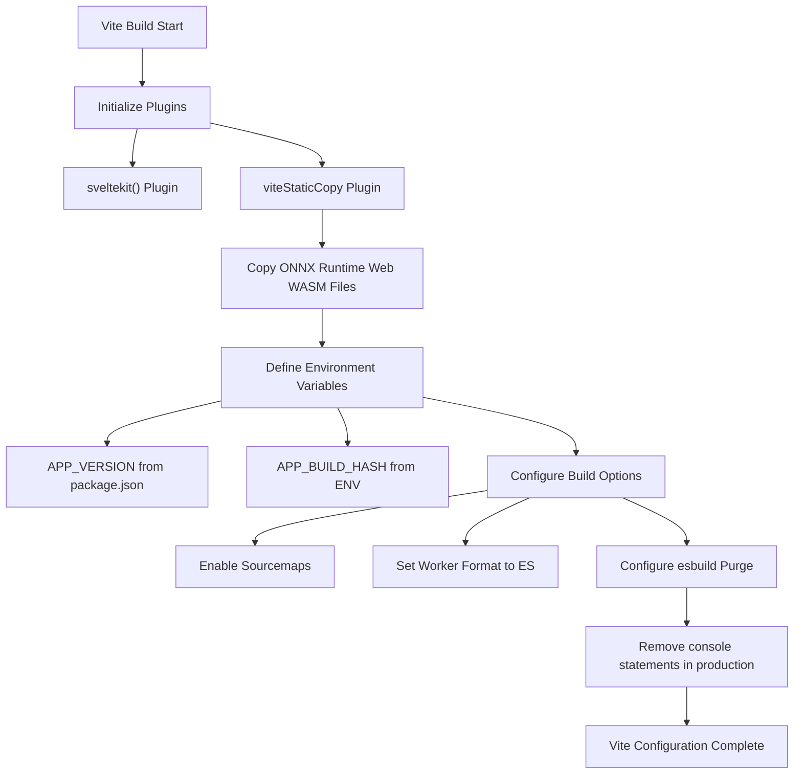
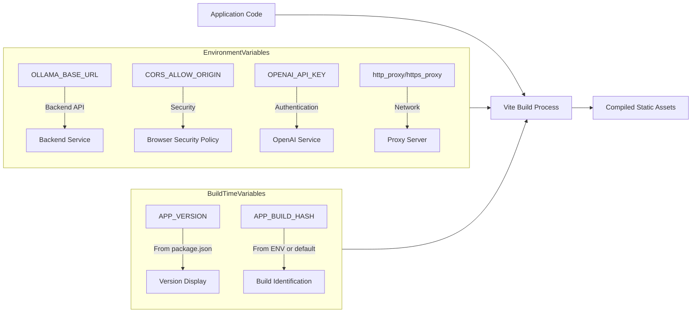

# Frontend Build

<cite>
**Referenced Files in This Document**   
- [package.json](file://package.json)
- [vite.config.ts](file://vite.config.ts)
- [svelte.config.js](file://svelte.config.js)
- [tsconfig.json](file://tsconfig.json)
- [tailwind.config.js](file://tailwind.config.js)
- [postcss.config.js](file://postcss.config.js)
- [scripts/prepare-pyodide.js](file://scripts/prepare-pyodide.js)
- [.env.example](file://.env.example)
- [src/lib/constants.ts](file://src/lib/constants.ts)
</cite>

## Table of Contents
1. [Introduction](#introduction)
2. [Node.js Dependencies Installation](#nodejs-dependencies-installation)
3. [Vite Build Configuration](#vite-build-configuration)
4. [Svelte Frontend Compilation](#svelte-frontend-compilation)
5. [Environment-Specific Build Variables](#environment-specific-build-variables)
6. [Static Assets Generation](#static-assets-generation)
7. [Build Verification and Troubleshooting](#build-verification-and-troubleshooting)
8. [Customizing the Build Process](#customizing-the-build-process)

## Introduction
This document provides comprehensive guidance on building the frontend for open-webui, a Svelte-based application that integrates with a backend service for AI-powered web interactions. The build process leverages Vite as the build tool, SvelteKit for the framework, and various optimization techniques to produce production-ready static assets. The documentation covers the complete workflow from dependency installation to final asset deployment, including configuration details, environment variables, and troubleshooting common issues.

## Node.js Dependencies Installation
The frontend build process begins with installing Node.js dependencies using npm. The project requires Node.js version 18.13.0 or higher but not exceeding 22.x.x, as specified in the package.json engines configuration. To install dependencies, execute `npm install` in the project root directory. This command reads the package.json file and installs all listed dependencies and devDependencies, including Svelte, Vite, TypeScript, ESLint, Prettier, and various UI libraries. The installation process also triggers the pyodide:fetch script automatically through npm hooks, which prepares Python packages for in-browser execution. After installation, all dependencies are available in the node_modules directory, enabling subsequent build and development operations.

**Section sources**
- [package.json](file://package.json#L147-L150)
- [package.json](file://package.json#L22)
- [scripts/prepare-pyodide.js](file://scripts/prepare-pyodide.js)

## Vite Build Configuration
The Vite build configuration is defined in vite.config.ts and integrates with SvelteKit for optimal frontend compilation. The configuration includes the sveltekit() plugin as the primary plugin, which enables SvelteKit-specific features and optimizations. A key aspect of the configuration is the use of vite-plugin-static-copy to copy ONNX Runtime Web WebAssembly files from node_modules/onnxruntime-web/dist to the wasm directory in the output build. The build process is configured to generate sourcemaps for debugging purposes. Environment variables APP_VERSION and APP_BUILD_HASH are defined during build time, with APP_VERSION pulled from the package.json version field. The esbuild configuration removes console.log, console.debug, and console.error statements in production builds when ENV is not set to 'dev', helping to reduce bundle size and prevent sensitive information leakage.

**Diagram sources**
- [vite.config.ts](file://vite.config.ts#L6-L32)
- [package.json](file://package.json#L3)

## Svelte Frontend Compilation
The Svelte frontend compilation process is managed through Vite and SvelteKit, transforming Svelte components and TypeScript code into optimized static assets for production deployment. The build process is initiated by running `npm run build`, which executes the build script defined in package.json. This script first runs the pyodide:fetch command to ensure all required Python packages are downloaded and cached, then invokes `vite build` to compile the application. The compilation process includes transpiling TypeScript to JavaScript, processing Svelte components, optimizing CSS with Tailwind CSS, and bundling assets. The output is generated in the build directory as configured in svelte.config.js. During compilation, Vite performs tree-shaking to eliminate unused code, minifies JavaScript and CSS assets, and generates hashed filenames for cache busting. The resulting static files are optimized for performance and ready for deployment to a web server.

**Section sources**
- [package.json](file://package.json#L8)
- [svelte.config.js](file://svelte.config.js#L15-L19)
- [vite.config.ts](file://vite.config.ts)

## Environment-Specific Build Variables
Environment-specific build variables are managed through a combination of environment variables and build-time configuration. The primary environment variables are defined in the .env.example file, which serves as a template for actual environment configuration. Key variables include OLLAMA_BASE_URL for specifying the backend API endpoint, CORS_ALLOW_ORIGIN for configuring cross-origin resource sharing, and various API keys for external services. During the build process, the Vite configuration defines APP_VERSION from the package.json version field and APP_BUILD_HASH from the environment or defaults to 'dev-build'. These variables are embedded in the compiled code and accessible throughout the application. The build system also supports network proxy configuration through environment variables like http_proxy, https_proxy, and all_proxy, which are used by the prepare-pyodide.js script to download packages through proxy servers when required. This environment variable system allows for flexible configuration across different deployment environments without modifying the source code.

**Diagram sources**
- [.env.example](file://.env.example)
- [vite.config.ts](file://vite.config.ts#L20-L22)
- [scripts/prepare-pyodide.js](file://scripts/prepare-pyodide.js#L28-L52)

## Static Assets Generation
The static assets generation process produces all necessary files for serving the frontend application, including HTML, JavaScript, CSS, and WebAssembly files. The build output is configured in svelte.config.js to use the 'build' directory for both pages and assets, with 'index.html' as the fallback for client-side routing. The generated assets include optimized JavaScript bundles with hashed filenames for cache busting, minified CSS files processed through Tailwind CSS and PostCSS, and static files copied from the static directory. A critical part of the asset generation is the preparation of Pyodide packages, where the prepare-pyodide.js script downloads and caches Python packages specified in its configuration, creating a pyodide-lock.json file that ensures consistent package versions across builds. The ONNX Runtime Web WebAssembly files are also copied to the wasm directory during the build process through the vite-plugin-static-copy configuration. These static assets are designed to be served by the backend's SPAStaticFiles handler, which serves index.html for all non-API routes, enabling client-side routing to function correctly in production.

**Section sources**
- [svelte.config.js](file://svelte.config.js#L15-L19)
- [vite.config.ts](file://vite.config.ts#L9-L17)
- [scripts/prepare-pyodide.js](file://scripts/prepare-pyodide.js#L1-L18)

## Build Verification and Troubleshooting
Verifying build success and troubleshooting common issues is essential for maintaining a reliable frontend build process. After running `npm run build`, verify success by checking for the build directory containing the compiled assets, including index.html, JavaScript bundles, CSS files, and the wasm directory with ONNX Runtime Web files. Common issues include missing dependencies, which can be resolved by ensuring npm install completes successfully and checking for network connectivity issues, especially when downloading Pyodide packages. TypeScript compilation issues often stem from type errors or configuration problems and can be diagnosed by running `npm run check` to execute svelte-check with the project's tsconfig.json. Asset bundling problems may occur when Vite cannot resolve imports or when file paths are incorrect; these can be addressed by verifying import statements and checking the Vite configuration. Network proxy issues during Pyodide package download can be resolved by setting appropriate http_proxy, https_proxy, or all_proxy environment variables. The build process generates sourcemaps by default, which can be used to debug issues in the compiled code by mapping back to the original source files.

**Section sources**
- [package.json](file://package.json#L11-L12)
- [vite.config.ts](file://vite.config.ts#L24)
- [tsconfig.json](file://tsconfig.json)
- [scripts/prepare-pyodide.js](file://scripts/prepare-pyodide.js)

## Customizing the Build Process
Customizing the build process allows for adaptation to different deployment scenarios and optimization requirements. The primary customization points include modifying the Vite configuration in vite.config.ts to adjust plugins, environment variables, and build options. For example, the esbuild pure configuration can be modified to preserve or remove specific console statements based on the deployment environment. The svelte.config.js file can be updated to change the output directory, adjust adapter settings, or modify version polling behavior. Environment-specific configurations can be implemented by creating different .env files for development, staging, and production environments, with appropriate values for API endpoints, CORS settings, and feature flags. The Pyodide package list in prepare-pyodide.js can be customized to include or exclude specific Python packages based on application requirements, affecting the size and capabilities of the browser-based Python environment. Additionally, the Tailwind CSS configuration in tailwind.config.js can be extended to add custom colors, typography, or responsive breakpoints. These customization options provide flexibility to optimize the build process for performance, security, and functionality across various deployment scenarios.

**Section sources**
- [vite.config.ts](file://vite.config.ts)
- [svelte.config.js](file://svelte.config.js)
- [tailwind.config.js](file://tailwind.config.js)
- [scripts/prepare-pyodide.js](file://scripts/prepare-pyodide.js#L1-L18)
- [.env.example](file://.env.example)