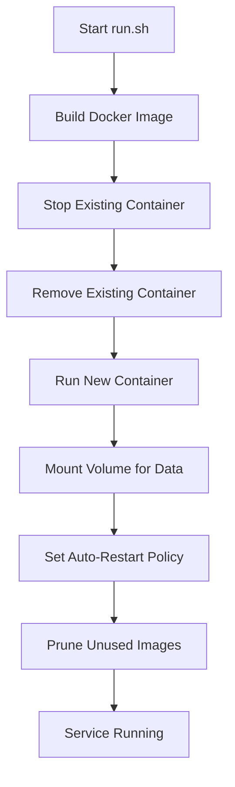
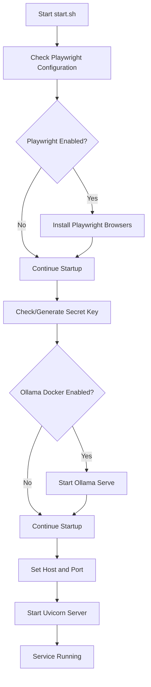

# Process Management

<cite>
**Referenced Files in This Document**   
- [run.sh](file://run.sh)
- [setup.sh](file://setup.sh)
- [backend/start.sh](file://backend/start.sh)
- [backend/dev.sh](file://backend/dev.sh)
- [backend/open_webui/main.py](file://backend/open_webui/main.py)
- [.env.example](file://.env.example)
</cite>

## Table of Contents
1. [Introduction](#introduction)
2. [Systemd Service Configuration](#systemd-service-configuration)
3. [Startup Scripts Analysis](#startup-scripts-analysis)
4. [Service Management and Monitoring](#service-management-and-monitoring)
5. [Failure Recovery and Resource Management](#failure-recovery-and-resource-management)
6. [Troubleshooting Common Issues](#troubleshooting-common-issues)

## Introduction
This document provides comprehensive guidance on managing the open-webui application in production environments using systemd. The documentation covers the complete lifecycle management of the application, including service configuration, startup procedures, monitoring, and failure recovery strategies. Systemd is used as the init system to ensure reliable process management, automatic restarts, and integrated logging capabilities. The open-webui application consists of a FastAPI backend server that serves both the API and frontend components, with various configuration options for different deployment scenarios.

**Section sources**
- [backend/open_webui/main.py](file://backend/open_webui/main.py#L1-L100)

## Systemd Service Configuration

### Complete Systemd Service Unit File
The following systemd service unit file provides a production-ready configuration for managing the open-webui application. This configuration includes proper user permissions, environment loading, dependency handling, and resource limits.

```ini
[Unit]
Description=Open WebUI Service
After=network.target
Wants=network.target

[Service]
Type=simple
User=openwebui
Group=openwebui
WorkingDirectory=
EnvironmentFile=.env
ExecStart=backend/start.sh
Restart=always
RestartSec=5
StartLimitInterval=30
StartLimitBurst=3
TimeoutStartSec=300
TimeoutStopSec=60

# Security settings
NoNewPrivileges=true
PrivateTmp=true
ProtectSystem=strict
ProtectHome=true
ReadWritePaths=backend/data backend/open_webui/data

# Resource limits
LimitNOFILE=65536
LimitNPROC=4096
LimitMEMLOCK=infinity
LimitAS=infinity

# Logging
StandardOutput=journal
StandardError=journal
SyslogIdentifier=open-webui

# Environment
Environment=PYTHONPATH=backend
Environment=PATH=venv/bin:/usr/local/bin:/usr/bin:/bin

[Install]
WantedBy=multi-user.target
```

### Service Configuration Details
The systemd service configuration is designed to ensure reliable operation of the open-webui application in production environments. The service runs under a dedicated user account (openwebui) to follow the principle of least privilege. The WorkingDirectory is set to the project root to ensure all relative paths resolve correctly. Environment variables are loaded from the .env file using EnvironmentFile, which allows for centralized configuration management.

The service is configured with Restart=always to ensure automatic recovery from crashes or unexpected terminations. RestartSec=5 sets a 5-second delay between restart attempts, while StartLimitInterval and StartLimitBurst prevent rapid restart loops that could indicate deeper issues. The timeout settings provide sufficient time for the application to start and stop gracefully.

Security is enhanced through various hardening options: NoNewPrivileges prevents the process from gaining additional privileges, PrivateTmp isolates temporary files, and ProtectSystem/ProtectHome restrict access to system directories. The ReadWritePaths directive explicitly defines which directories the service can write to, limiting potential damage from security breaches.

Resource limits are set to prevent the application from consuming excessive system resources. The file descriptor limit (LimitNOFILE) is set to 65536 to handle many concurrent connections, while process limits (LimitNPROC) prevent fork bombs. Memory-related limits are set to infinity to accommodate the application's needs while relying on system-level memory management.

**Section sources**
- [.env.example](file://.env.example#L1-L22)
- [backend/start.sh](file://backend/start.sh#L1-L87)

## Startup Scripts Analysis

### run.sh Script Functionality
The run.sh script provides a Docker-based deployment method for the open-webui application. It builds a Docker image from the current directory and runs a container with specific configurations. The script sets up port mapping between host port 3000 and container port 8080, creates a named volume for persistent data storage, and configures the container to restart automatically on failure. Before starting the new container, it stops and removes any existing container with the same name to ensure a clean state.



**Diagram sources**
- [run.sh](file://run.sh#L1-L20)

### setup.sh Script Functionality
The setup.sh script is designed to integrate AI Software Engineering (AI SWE) methodology into existing projects. It detects the project's primary language, prompts for project configuration details, downloads template files from a remote repository, and customizes them with project-specific information. The script sets up a Memory Bank system for knowledge management, creates custom slash commands for AI assistance, and establishes development workflows. It also handles intelligent merging of gitignore files and creates an initial git commit with all configured files.

### start.sh Script Functionality
The start.sh script in the backend directory is the primary entry point for running the open-webui application. It handles several critical startup tasks: installing Playwright browsers if configured, generating a secret key if one doesn't exist, starting the Ollama service if enabled, and configuring CUDA libraries when needed. The script sets default values for host and port, loads environment variables, and starts the uvicorn server with the appropriate number of workers. It also handles special configuration for HuggingFace Space deployments, including automatic admin user creation.



**Diagram sources**
- [backend/start.sh](file://backend/start.sh#L1-L87)
- [backend/open_webui/main.py](file://backend/open_webui/main.py#L656-L662)

## Service Management and Monitoring

### Service Lifecycle Commands
Systemd provides a comprehensive set of commands for managing the open-webui service:

```bash
# Start the service
sudo systemctl start open-webui.service

# Stop the service
sudo systemctl stop open-webui.service

# Restart the service
sudo systemctl restart open-webui.service

# Enable automatic startup on boot
sudo systemctl enable open-webui.service

# Disable automatic startup
sudo systemctl disable open-webui.service

# Check service status
sudo systemctl status open-webui.service
```

### Monitoring Service Status
The systemctl status command provides detailed information about the service state, including whether it's active, its process ID, memory usage, and recent log entries. For more detailed status information, use:

```bash
# Get detailed service information
systemctl show open-webui.service

# Check if service is enabled
systemctl is-enabled open-webui.service

# List all service instances
systemctl list-units --type=service | grep open-webui
```

### Log Management with journalctl
Systemd's journalctl command provides powerful log management capabilities for the open-webui service:

```bash
# View service logs
sudo journalctl -u open-webui.service

# View logs with timestamps
sudo journalctl -u open-webui.service -o short-iso

# Follow logs in real-time
sudo journalctl -u open-webui.service -f

# View logs from the last hour
sudo journalctl -u open-webui.service --since "1 hour ago"

# View logs with priority filtering
sudo journalctl -u open-webui.service -p err

# View logs with line buffering
sudo journalctl -u open-webui.service --lines=100 --follow
```

### Health Checks Implementation
The open-webui application includes a health check endpoint that can be used for monitoring service availability. This can be integrated with systemd's health check functionality:

```ini
[Service]
# Health check configuration
ExecReload=/bin/kill -USR1 $MAINPID
WatchdogSec=30
```

A custom health check script can also be implemented:

```bash
#!/bin/bash
# health-check.sh
if curl -sf http://localhost:8080/health >/dev/null; then
    exit 0
else
    exit 1
fi
```

**Section sources**
- [backend/start.sh](file://backend/start.sh#L53-L67)
- [backend/open_webui/main.py](file://backend/open_webui/main.py#L552-L565)

## Failure Recovery and Resource Management

### Automatic Restart Strategies
The systemd service configuration includes multiple layers of automatic restart capabilities. The Restart=always directive ensures the service is restarted regardless of how it exited. The StartLimitInterval and StartLimitBurst parameters implement a circuit breaker pattern to prevent rapid restart loops that could overwhelm the system. If the service fails more than 3 times within 30 seconds, systemd will stop attempting to restart it, requiring manual intervention.

For more granular control, different restart policies can be used:
- Restart=on-failure: Only restart on non-zero exit codes
- Restart=on-abnormal: Only restart on abnormal terminations
- Restart=on-abort: Only restart if the process aborts

### Resource Limits Configuration
Proper resource limiting is essential for production stability. The service configuration includes limits for file descriptors, processes, and memory. Additional limits can be configured based on specific requirements:

```ini
# CPU limits
CPUQuota=80%  # Limit to 80% of one CPU core
CPUWeight=100  # Relative CPU share

# Memory limits
MemoryMax=4G  # Maximum memory usage
MemorySwapMax=2G  # Maximum swap usage

# IO limits
IOWeight=100  # Relative IO priority
BlockIOWeight=100  # Relative block IO priority
```

### Graceful Shutdown Procedures
The open-webui application implements graceful shutdown handling through FastAPI's lifespan context manager. When systemd sends a SIGTERM signal to initiate shutdown, the application performs cleanup operations before terminating. The TimeoutStopSec parameter in the service configuration specifies how long systemd should wait for the service to stop gracefully before sending SIGKILL.

The application's shutdown sequence includes:
1. Canceling the Redis task command listener
2. Closing database connections
3. Cleaning up temporary resources
4. Finalizing any ongoing operations

### Health Monitoring and Alerting
For production environments, implement comprehensive health monitoring:

```bash
# Health check script for external monitoring
#!/bin/bash
set -e

# Check service status
if ! systemctl is-active --quiet open-webui.service; then
    echo "Service is not active"
    exit 1
fi

# Check API responsiveness
if ! curl -sf --max-time 10 http://localhost:8080/health; then
    echo "API is not responding"
    exit 1
fi

# Check resource usage
MEMORY_USAGE=$(systemctl status open-webui.service | grep Memory | awk '{print $2}')
if [[ "$MEMORY_USAGE" =~ ^[0-9]+M$ ]] && [ "${MEMORY_USAGE%M}" -gt 2000 ]; then
    echo "Memory usage is too high: $MEMORY_USAGE"
    exit 1
fi

echo "Service is healthy"
exit 0
```

**Section sources**
- [backend/start.sh](file://backend/start.sh#L75-L87)
- [backend/open_webui/main.py](file://backend/open_webui/main.py#L569-L654)

## Troubleshooting Common Issues

### Permission Errors
Permission issues are common when deploying the open-webui application. Ensure the service user has appropriate permissions:

```bash
# Create dedicated user and group
sudo useradd --system --no-create-home openwebui
sudo groupadd --system openwebui

# Set proper ownership
sudo chown -R openwebui:openwebui 
sudo chmod -R 755 

# Ensure data directories are writable
sudo chown -R openwebui:openwebui backend/data
sudo chown -R openwebui:openwebui backend/open_webui/data
```

Common permission-related errors and solutions:
- "Permission denied" when accessing data directories: Ensure the service user owns the data directories
- "Cannot bind to port" errors: Use ports above 1024 or configure appropriate capabilities
- "Cannot read environment file": Verify file permissions and ownership

### Startup Issues
Common startup problems and their solutions:

1. **Secret key generation issues**:
   - Ensure the user running the service has write permissions to the key file location
   - Verify the .webui_secret_key file is not corrupted

2. **Database migration errors**:
   - Check that the database directory is writable
   - Verify database file permissions
   - Ensure the database service is running if using external database

3. **Port conflicts**:
   - Check if the configured port is already in use: `sudo netstat -tlnp | grep :8080`
   - Change the PORT environment variable or configure a different port in the service file

4. **Missing dependencies**:
   - Ensure all Python dependencies are installed: `pip install -r requirements.txt`
   - Verify Playwright browsers are installed if WEB_LOADER_ENGINE is set to playwright

### Debugging Tips
When troubleshooting service issues, follow this systematic approach:

1. Check service status:
```bash
sudo systemctl status open-webui.service
```

2. Examine recent logs:
```bash
sudo journalctl -u open-webui.service -n 100
```

3. Test configuration files:
```bash
# Validate the service file syntax
sudo systemd-analyze verify /etc/systemd/system/open-webui.service

# Check for configuration errors
sudo systemd-analyze dump | grep open-webui
```

4. Test the application manually:
```bash
# Run the start script manually as the service user
sudo -u openwebui backend/start.sh
```

5. Verify environment variables:
```bash
# Check if environment variables are properly loaded
sudo systemctl show open-webui.service | grep Environment
```

6. Monitor resource usage:
```bash
# Check memory and CPU usage
systemctl status open-webui.service

# Monitor logs in real-time
sudo journalctl -u open-webui.service -f
```

**Section sources**
- [backend/start.sh](file://backend/start.sh#L23-L36)
- [.env.example](file://.env.example#L1-L22)
- [backend/open_webui/main.py](file://backend/open_webui/main.py#L532-L534)