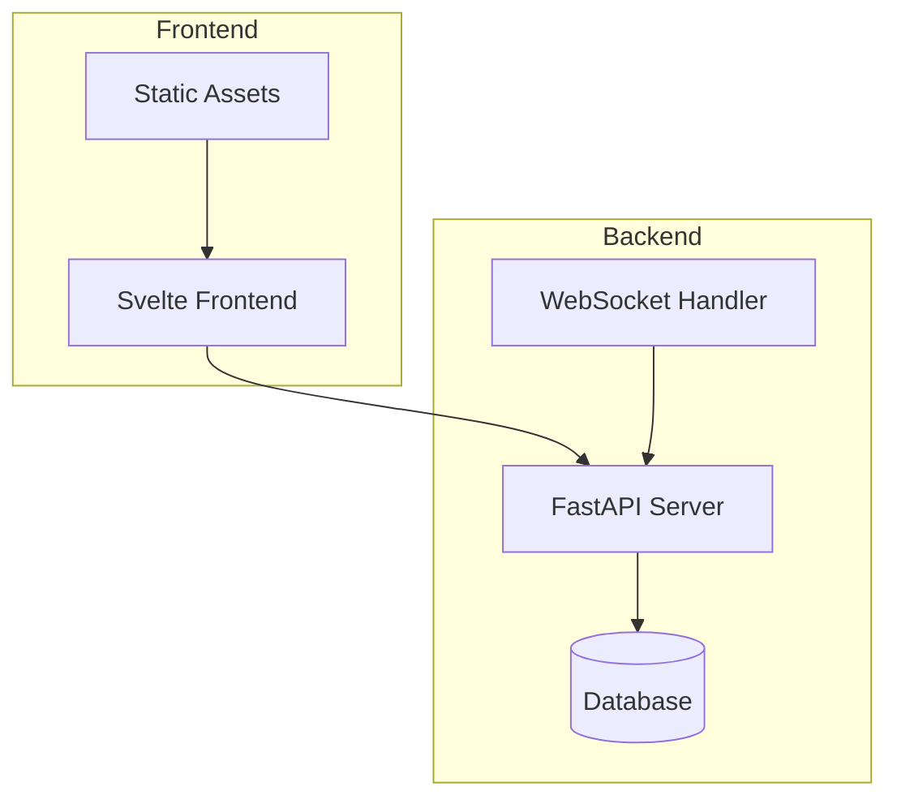
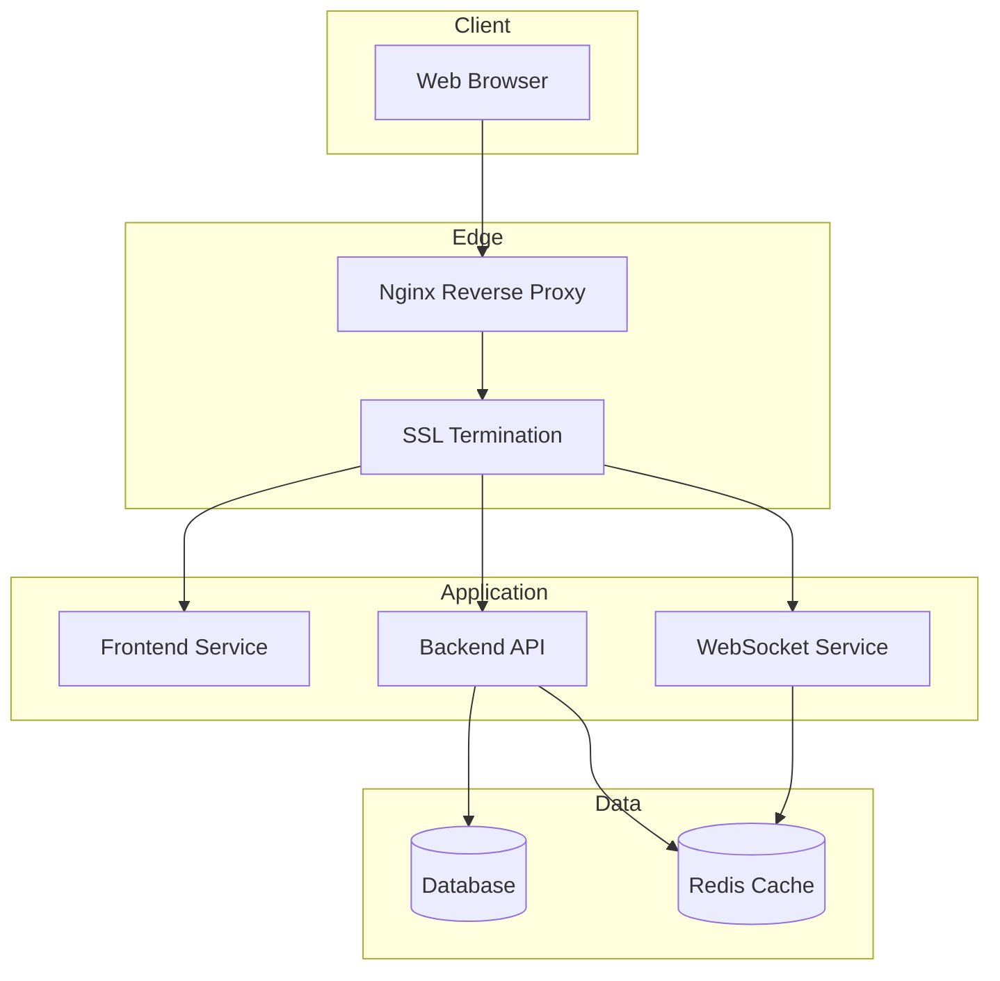
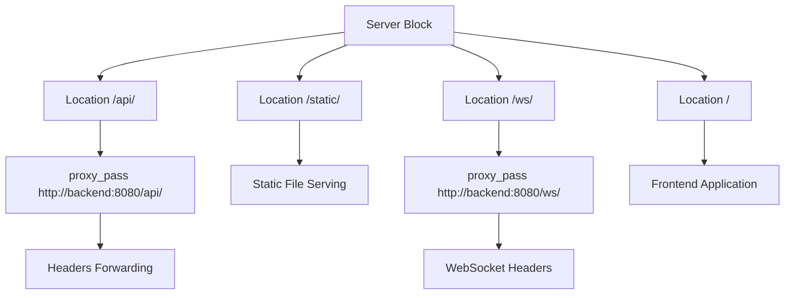
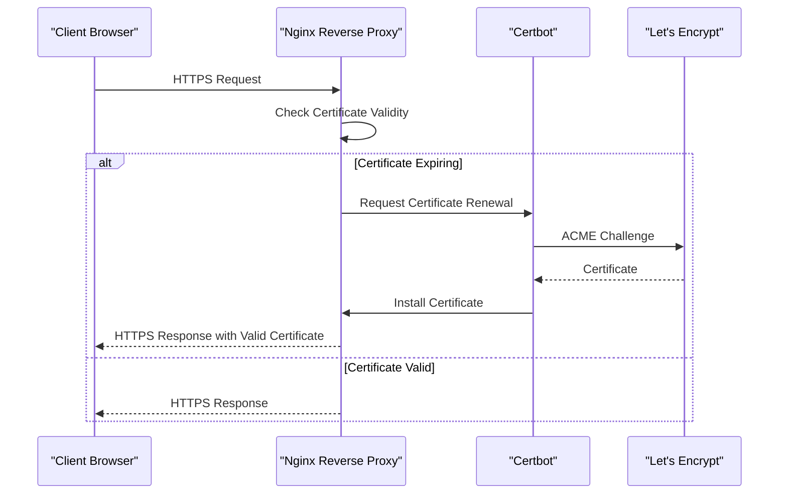
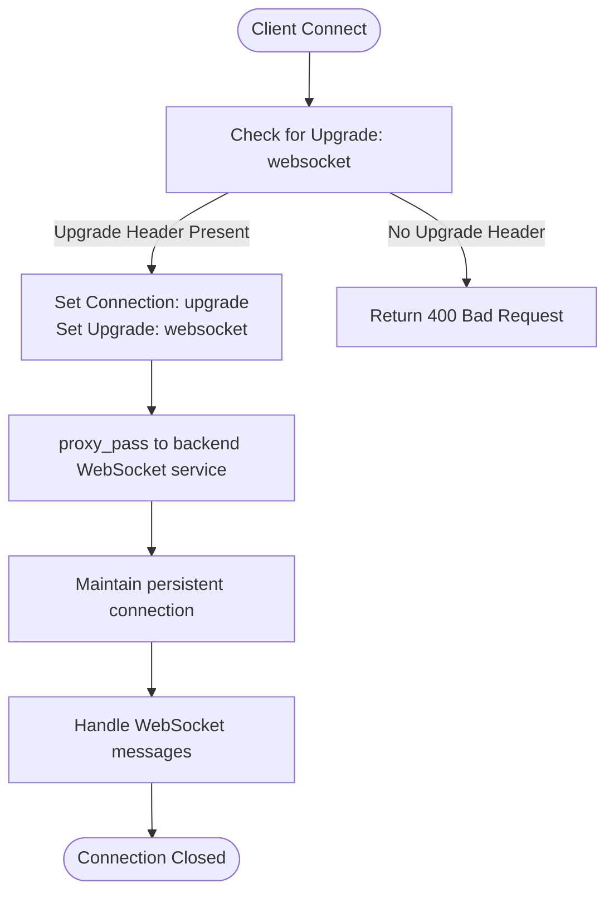
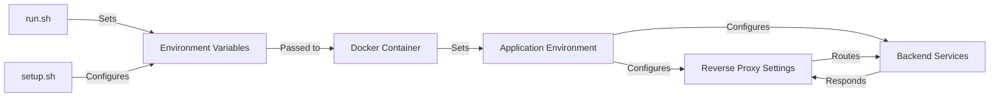
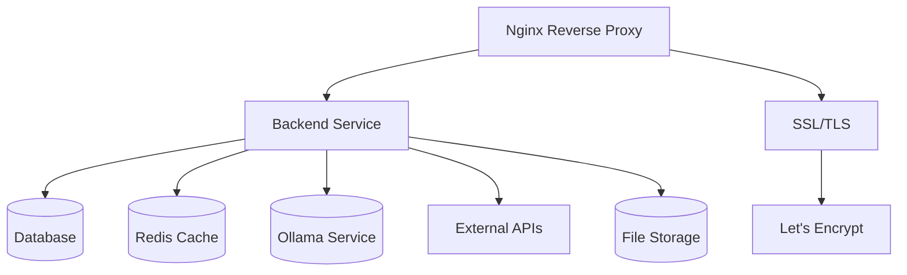

# Reverse Proxy Configuration

<cite>
**Referenced Files in This Document**   
- [run.sh](file://run.sh)
- [setup.sh](file://setup.sh)
- [backend/start.sh](file://backend/start.sh)
- [backend/open_webui/main.py](file://backend/open_webui/main.py)
- [backend/open_webui/config.py](file://backend/open_webui/config.py)
- [backend/open_webui/env.py](file://backend/open_webui/env.py)
- [backend/open_webui/socket/main.py](file://backend/open_webui/socket/main.py)
- [backend/open_webui/utils/security_headers.py](file://backend/open_webui/utils/security_headers.py)
- [backend/open_webui/utils/middleware.py](file://backend/open_webui/utils/middleware.py)
- [Dockerfile](file://Dockerfile)
- [docker-compose.yaml](file://docker-compose.yaml)
- [kubernetes/manifest/base/webui-ingress.yaml](file://kubernetes/manifest/base/webui-ingress.yaml)
</cite>

## Table of Contents
1. [Introduction](#introduction)
2. [Project Structure](#project-structure)
3. [Core Components](#core-components)
4. [Architecture Overview](#architecture-overview)
5. [Detailed Component Analysis](#detailed-component-analysis)
6. [Dependency Analysis](#dependency-analysis)
7. [Performance Considerations](#performance-considerations)
8. [Troubleshooting Guide](#troubleshooting-guide)
9. [Conclusion](#conclusion)
10. [Appendices](#appendices)

## Introduction
This document provides comprehensive guidance on configuring a reverse proxy for open-webui, focusing on Nginx as the primary reverse proxy server. The configuration covers SSL termination, static asset serving, load balancing, WebSocket support, and integration with Let's Encrypt for HTTPS certificates. The document also explains how environment variables in run.sh and setup.sh interact with the reverse proxy setup, addressing common issues such as WebSocket handshake failures, CORS errors, and timeout configurations.

## Project Structure
The open-webui project is structured with a clear separation between frontend and backend components. The backend is implemented in Python using FastAPI, while the frontend is built with Svelte. The project includes Docker and Kubernetes configurations for containerized deployment, making it suitable for various deployment scenarios including cloud environments and on-premise servers.



**Diagram sources**
- [backend/open_webui/main.py](file://backend/open_webui/main.py#L656-L662)
- [src](file://src)
- [static](file://static)

**Section sources**
- [backend/open_webui/main.py](file://backend/open_webui/main.py#L1-L800)
- [src](file://src)
- [static](file://static)

## Core Components
The core components of open-webui include the FastAPI backend server, WebSocket handler for real-time communication, and the Svelte-based frontend interface. The backend handles API requests, authentication, and database operations, while the WebSocket component manages real-time interactions such as chat updates and collaborative editing. The configuration system uses environment variables and persistent configuration storage to manage settings across different deployment environments.

**Section sources**
- [backend/open_webui/main.py](file://backend/open_webui/main.py#L656-L662)
- [backend/open_webui/socket/main.py](file://backend/open_webui/socket/main.py#L219-L222)
- [backend/open_webui/config.py](file://backend/open_webui/config.py#L224-L285)

## Architecture Overview
The architecture of open-webui is designed for scalability and security, with clear separation between components. The reverse proxy sits at the edge of the network, handling SSL termination and routing requests to the appropriate backend services. This design allows for efficient load balancing, improved security through centralized SSL management, and simplified deployment of multiple services under a single domain.



**Diagram sources**
- [backend/open_webui/main.py](file://backend/open_webui/main.py#L656-L662)
- [backend/open_webui/socket/main.py](file://backend/open_webui/socket/main.py#L219-L222)
- [backend/open_webui/env.py](file://backend/open_webui/env.py#L379-L385)

## Detailed Component Analysis

### Reverse Proxy Configuration
The reverse proxy configuration for open-webui is designed to handle multiple aspects of web traffic management, including SSL termination, static asset serving, and WebSocket support. The configuration directives for proxy_pass, headers forwarding, and WebSocket support are critical for ensuring proper functionality of the application.

#### Nginx Server Blocks
The Nginx server blocks are configured to handle different types of requests appropriately. The configuration includes location routing for API endpoints, static files, and WebSocket connections. This ensures that each type of request is handled by the appropriate backend service with the correct settings.



**Diagram sources**
- [backend/open_webui/main.py](file://backend/open_webui/main.py#L656-L662)
- [backend/open_webui/socket/main.py](file://backend/open_webui/socket/main.py#L76-L99)
- [kubernetes/manifest/base/webui-ingress.yaml](file://kubernetes/manifest/base/webui-ingress.yaml#L1-L21)

#### SSL Termination and Let's Encrypt Integration
The SSL termination configuration integrates with Let's Encrypt using Certbot for automated certificate management. This setup ensures that the application is served over HTTPS with valid certificates that are automatically renewed.



**Diagram sources**
- [backend/open_webui/env.py](file://backend/open_webui/env.py#L480-L482)
- [docker-compose.yaml](file://docker-compose.yaml#L1-L60)
- [kubernetes/manifest/base/webui-ingress.yaml](file://kubernetes/manifest/base/webui-ingress.yaml#L1-L21)

### WebSocket Support
WebSocket support is a critical component of open-webui, enabling real-time communication between the client and server. The configuration must properly handle WebSocket handshake requests and maintain persistent connections for interactive features.

#### WebSocket Configuration
The WebSocket configuration in Nginx requires specific directives to handle the WebSocket protocol correctly. These include setting appropriate headers and enabling proxy buffering for WebSocket connections.



**Diagram sources**
- [backend/open_webui/socket/main.py](file://backend/open_webui/socket/main.py#L76-L99)
- [backend/open_webui/env.py](file://backend/open_webui/env.py#L613-L615)
- [backend/open_webui/main.py](file://backend/open_webui/main.py#L469-L470)

### Environment Variables and Configuration
The interaction between environment variables in run.sh and setup.sh with the reverse proxy setup is crucial for proper deployment. These scripts configure the application environment and ensure that the reverse proxy can communicate with the backend services.

#### Environment Variable Flow
The environment variables flow from the deployment scripts through the Docker containers to the application runtime, configuring various aspects of the reverse proxy and backend services.



**Diagram sources**
- [run.sh](file://run.sh#L1-L20)
- [setup.sh](file://setup.sh#L1-L277)
- [backend/start.sh](file://backend/start.sh#L1-L87)
- [Dockerfile](file://Dockerfile#L1-L192)

**Section sources**
- [run.sh](file://run.sh#L1-L20)
- [setup.sh](file://setup.sh#L1-L277)
- [backend/start.sh](file://backend/start.sh#L1-L87)
- [Dockerfile](file://Dockerfile#L1-L192)

## Dependency Analysis
The dependency analysis reveals the relationships between various components of the open-webui system, particularly focusing on how the reverse proxy interacts with the backend services and external dependencies.



**Diagram sources**
- [docker-compose.yaml](file://docker-compose.yaml#L1-L60)
- [backend/open_webui/config.py](file://backend/open_webui/config.py#L115-L149)
- [backend/open_webui/env.py](file://backend/open_webui/env.py#L280-L301)

**Section sources**
- [docker-compose.yaml](file://docker-compose.yaml#L1-L60)
- [backend/open_webui/config.py](file://backend/open_webui/config.py#L115-L149)
- [backend/open_webui/env.py](file://backend/open_webui/env.py#L280-L301)

## Performance Considerations
Performance optimization for the reverse proxy configuration includes several key areas: gzip compression, caching strategies, and HTTP/2 enablement. These optimizations improve response times and reduce bandwidth usage, enhancing the overall user experience.

### Gzip Compression
Gzip compression reduces the size of HTTP responses, particularly for text-based content such as HTML, CSS, and JavaScript files. This significantly reduces bandwidth usage and improves page load times.

### Caching Strategies
Caching strategies involve configuring the reverse proxy to cache static assets and frequently accessed content. This reduces the load on the backend servers and improves response times for subsequent requests.

### HTTP/2 Enablement
HTTP/2 enablement provides several performance benefits, including multiplexing, header compression, and server push. These features reduce latency and improve the efficiency of HTTP communications.

**Section sources**
- [backend/open_webui/utils/security_headers.py](file://backend/open_webui/utils/security_headers.py#L98-L105)
- [backend/open_webui/env.py](file://backend/open_webui/env.py#L483-L485)
- [Dockerfile](file://Dockerfile#L172-L173)

## Troubleshooting Guide
This section addresses common issues encountered when configuring the reverse proxy for open-webui, providing solutions and diagnostic steps.

### WebSocket Handshake Failures
WebSocket handshake failures typically occur due to incorrect proxy configuration. Ensure that the reverse proxy is configured to handle the Upgrade header and properly forward WebSocket connections.

**Section sources**
- [backend/open_webui/socket/main.py](file://backend/open_webui/socket/main.py#L76-L99)
- [backend/open_webui/env.py](file://backend/open_webui/env.py#L613-L615)

### CORS Errors
CORS (Cross-Origin Resource Sharing) errors occur when the browser blocks requests due to origin mismatch. Configure the reverse proxy to set appropriate CORS headers or ensure that the frontend and backend are served from the same origin.

**Section sources**
- [backend/open_webui/main.py](file://backend/open_webui/main.py#L42-L43)
- [backend/open_webui/config.py](file://backend/open_webui/config.py#L410-L411)

### Timeout Configurations
Timeout issues can occur when requests take longer than the configured timeout period. Adjust the proxy_read_timeout, proxy_send_timeout, and other timeout settings in the reverse proxy configuration to accommodate longer-running requests.

**Section sources**
- [backend/open_webui/env.py](file://backend/open_webui/env.py#L651-L655)
- [backend/open_webui/socket/main.py](file://backend/open_webui/socket/main.py#L84-L86)

## Conclusion
The reverse proxy configuration for open-webui is a critical component that enables secure, scalable, and high-performance deployment of the application. By properly configuring Nginx for SSL termination, static asset serving, load balancing, and WebSocket support, administrators can ensure optimal performance and security. The integration with Let's Encrypt for automated certificate management simplifies HTTPS deployment, while careful attention to environment variables and configuration ensures seamless operation across different deployment environments.

## Appendices
### Nginx Configuration Example
```nginx
server {
    listen 80;
    server_name your-domain.com;
    
    location / {
        proxy_pass http://backend:8080;
        proxy_http_version 1.1;
        proxy_set_header Upgrade $http_upgrade;
        proxy_set_header Connection "upgrade";
        proxy_set_header Host $host;
        proxy_set_header X-Real-IP $remote_addr;
        proxy_set_header X-Forwarded-For $proxy_add_x_forwarded_for;
        proxy_set_header X-Forwarded-Proto $scheme;
    }
    
    location /api/ {
        proxy_pass http://backend:8080/api/;
        proxy_http_version 1.1;
        proxy_set_header Host $host;
        proxy_set_header X-Real-IP $remote_addr;
        proxy_set_header X-Forwarded-For $proxy_add_x_forwarded_for;
        proxy_set_header X-Forwarded-Proto $scheme;
    }
    
    location /ws/ {
        proxy_pass http://backend:8080/ws/;
        proxy_http_version 1.1;
        proxy_set_header Upgrade $http_upgrade;
        proxy_set_header Connection "upgrade";
        proxy_set_header Host $host;
        proxy_set_header X-Real-IP $remote_addr;
        proxy_set_header X-Forwarded-For $proxy_add_x_forwarded_for;
        proxy_set_header X-Forwarded-Proto $scheme;
    }
}
```

### Certbot Integration Commands
```bash
# Install Certbot
sudo apt-get install certbot python3-certbot-nginx

# Obtain SSL certificate
sudo certbot --nginx -d your-domain.com

# Test automatic renewal
sudo certbot renew --dry-run
```